https://www.bilibili.com/video/BV1wy4y1D7JT?from=search&seid=1655099700202851743#

# 一 React简介

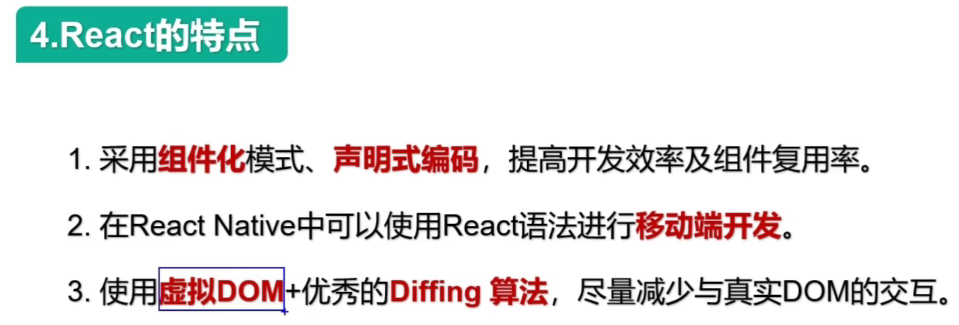

# 二 Hello React案例

 

React工具：https://fb.me/react-devtools

# 三 虚拟DOM的两种创建方式

- [ ] 为什么不用原生的js，非要用jsx？

- [ ] React官方为什么要出jsx语法？

  创建虚拟dom太繁琐了，有了jsx，编码人员可以更简单的创建虚拟dom

**1.使用jsx创建虚拟DOM：**


**2.用js创建虚拟DOM：**


# 五 JSX语法规则


# 六 jsx小练习

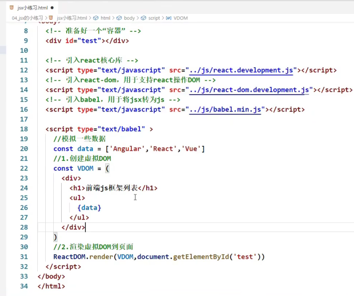


==**规律：如果给React传了一个数组，React会自动遍历该数组**==

什么是表达式？什么是语句？

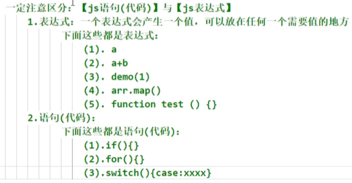

# 七 组件与模块


# 八 开发者工具的安装

# 九 函数式组件

两种：

1. ==函数式组件==：适用于简单组件的定义

2. ==类式组件==：


```react
// 1.创建函数式组件
function demo () {
    return <h2>我是用函数定义的组件（适用于简单组件的定义）</h2>
}
// 2.渲染组件到页面
ReactDOM.render(demo, document.getElementById('test'));
```

报错：函数类型式不能作为react的节点的


```react
// 1.创建函数式组件
function demo () {
    return <h2>我是用函数定义的组件（适用于简单组件的定义）</h2>
}
// 2.渲染组件到页面
ReactDOM.render(<demo/>, document.getElementById('test'));

// 报错：
Warning:The tag <demo> is unrecognized in this browser.If you meant to render a React component, start its name with an uppercase letter
```


```react
<script type="text/babel">
    // 1.创建函数式组件
    function Demo () {
        console.log(this); // undefined 因为代码经过babel（将jsx转为js）的翻译，babel开启了严格模式。严格模式最大的特点就是：禁止自定义的函数里面的this指向window
        return <h2>我是用函数定义的组件（适用于简单组件的定义）</h2>
    }
    // 2.渲染组件到页面
    ReactDOM.render(<Demo/>,document.getElementById('test'));
</script>
```

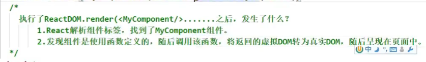

# 十 复习类相关的基本知识


问题：speak方法放在了哪里？——Person类的原型对象上，供实例使用


[尚硅谷2021版React技术全家桶全套完整版（零基础入门到精通/男神天禹老师亲授）_哔哩哔哩_bilibili](https://www.bilibili.com/video/BV1wy4y1D7JT?p=11&spm_id_from=pageDriver)

# 11 类式组件

```react
// 1.创建类式组件
class MyComponent extends React.Component{
    // render是放在哪里的？—— 类的原型对象上，供实例使用
    render(){
        console.log(this) // this：MyComponent的实例对象
        // 实例对象上有这样一些属性：context，props，refs，state，updater，_reactInternalFiber，_reactInternalInstance
        renturn <h2>我是类式定义组件</h2>
    }
}
ReactDOM.render(<MyComponent></MyComponent>, document.getElementById('test'));
```

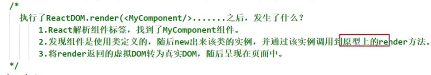

# 12 对state的理解

- 如果组件是有状态的，就是复杂组件


- 如果组件是无状态的，就是简单组件


- 什么是状态？

  - 人		状态	影响	行为
  - 组件	状态	驱动	页面	

- 组件的状态里面存着数据，数据的改变驱动着页面的展示


- 状态其实是组件实例对象身上的
- 最新版的react提出了一个新的东西：hooks

# 13 初始化state

```react
// new MyComponent这个动作是由react做的，不是我们自己new的
class MyComponent extends React.Component{
    // state是类的实例对象身上的，对类的实例对象做一些初始化操作，就要联想到constructor
    // props是什么？
    constructor (props) {
        // 如果a类继承了b类，且a类中写了构造器，那么a类构造器中的super是必须要调用的
        super(props);
        // 初始化状态
        this.state = {isHot:true};
    }
    
    render(){
        renturn <h2>今天天气很{this.state.isHot ? '炎热' : '凉爽'}</h2>
    }
}
ReactDOM.render(<MyComponent></MyComponent>, document.getElementById('test'));
```

# 14 React中的事件绑定

原生事件的绑定有几种方式：

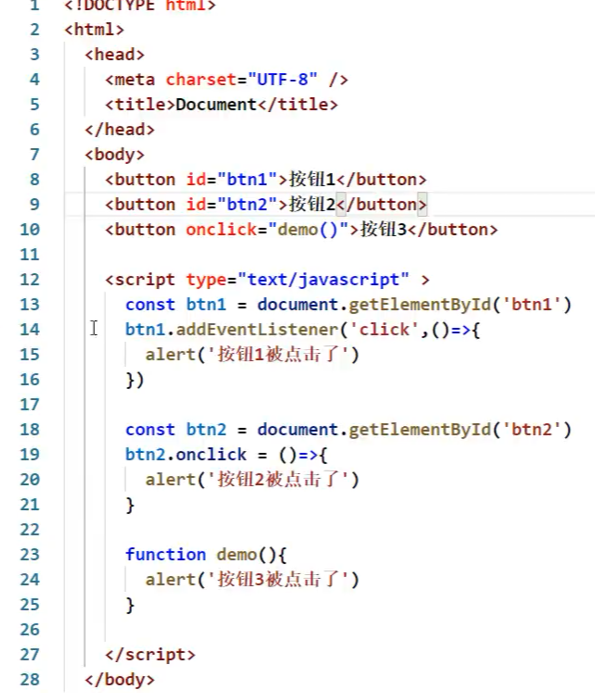

第一版：

```react
class MyComponent extends React.Component{
    constructor (props) {
        super(props);
        // 初始化状态
        this.state = {isHot:true};
    }
    
    render(){
        renturn <h2 onclick="demo()">今天天气很{this.state.isHot ? '炎热' : '凉爽'}</h2>
    }
}
ReactDOM.render(<MyComponent></MyComponent>, document.getElementById('test'));

function demo () {
    console.log('被点击了')
}

// 报错：
Invalid event handler property `onclick`. Did you mean `onClick`?
```

第二版：

```React
class MyComponent extends React.Component{
    constructor (props) {
        super(props);
        // 初始化状态
        this.state = {isHot:true};
    }
    
    render(){
        renturn <h2 onClick="demo()">今天天气很{this.state.isHot ? '炎热' : '凉爽'}</h2>
    }
}
ReactDOM.render(<MyComponent></MyComponent>, document.getElementById('test'));

function demo () {
    console.log('被点击了');
}

// 报错：
Expected `onClick` listener to be a function, instead got a value of `string` type.
```

第三版：

```react
class MyComponent extends React.Component{
    constructor (props) {
        super(props)
        // 初始化状态
        this.state = {isHot:true}
    }
    
    render(){
        renturn <h2 onClick={demo}>今天天气很{this.state.isHot ? '炎热' : '凉爽'}</h2>
    }
}
ReactDOM.render(<MyComponent></MyComponent>, document.getElementById('test'));

function demo () {
    console.log('被点击了')
}
```

# 15 类中方法中的this

第一版：不合理

babel禁止自定义函数的this指向window


 第二版：报错：changeWeather is not defined.


第三版：报错：Cannot read property 'state' of undefined


为什么changeWeather里面的this是undefined？它不是实例方法吗？为什么this会丢失？

* 只有通过Weather的实例对象调用changeWeather的时候，changeWeather中的this才是Weather实例
* 由于changeWeather是作为onClick的回调，所以不是通过实例调用的，是直接调用，而且由于**类中的方法默认开启了局部的严格模式**，所以changeWeather中的this为undefined


# 16 解决类中this指向问题

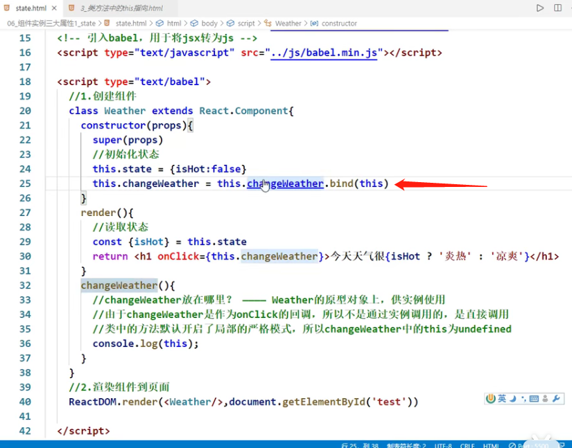

bind能做两件事

第一：生成一个新的函数

第二：改变this指向


第30行调用的changeWeather函数是**原型上**的还是**挂在实例自身身上**的？

* **挂在实例自身身上的**

# 17 setState的使用


```react
this.setState({
	isHot: !isHot; // 替换还是合并？合并
})
```


# 18 state的简写方式


精简前：


精简后：

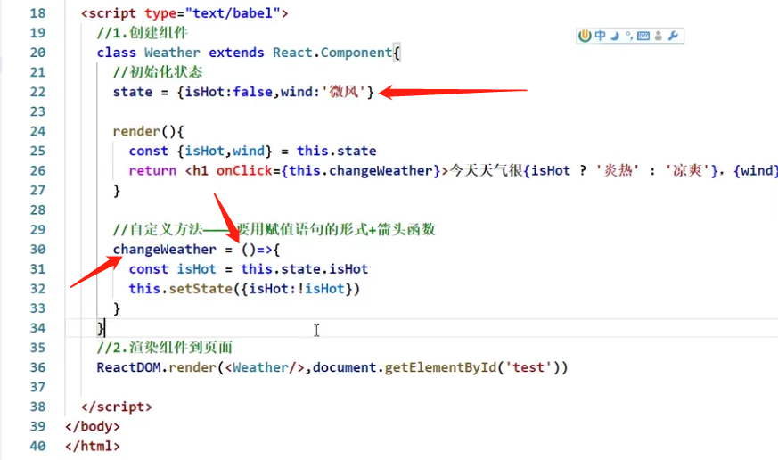


# 19 总结state


# 20 props的简单使用


https://www.bilibili.com/video/BV1wy4y1D7JT?p=28

# 21 批量传递props

即**批量传递标签属性**


...展开运算符是不能展开对象的

babel + react后：...展开运算符就能展开对象


# 22 对props进行限制


# 23 props的简写方式

props是只读的


# 24 类式组件中的构造器与props

类中的构造器到底有什么作用？


# 25 函数组件使用props


# 26 总结props

# 27 字符串形式的ref

**React官方不推荐使用字符串形式的ref**。为什么不推荐？https://zh-hans.reactjs.org/docs/refs-and-the-dom.html#gatsby-focus-wrapper

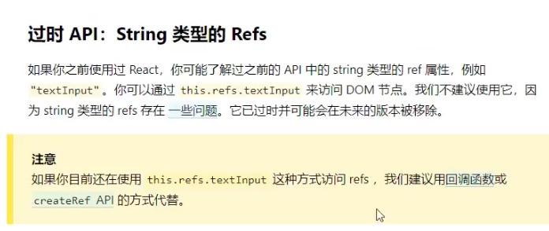

因为string类型的refs存在一些问题：写多了效率不高（为什么写多了效率不高？？）

https://github.com/facebook/react/pull/8333#issuecomment-271648615


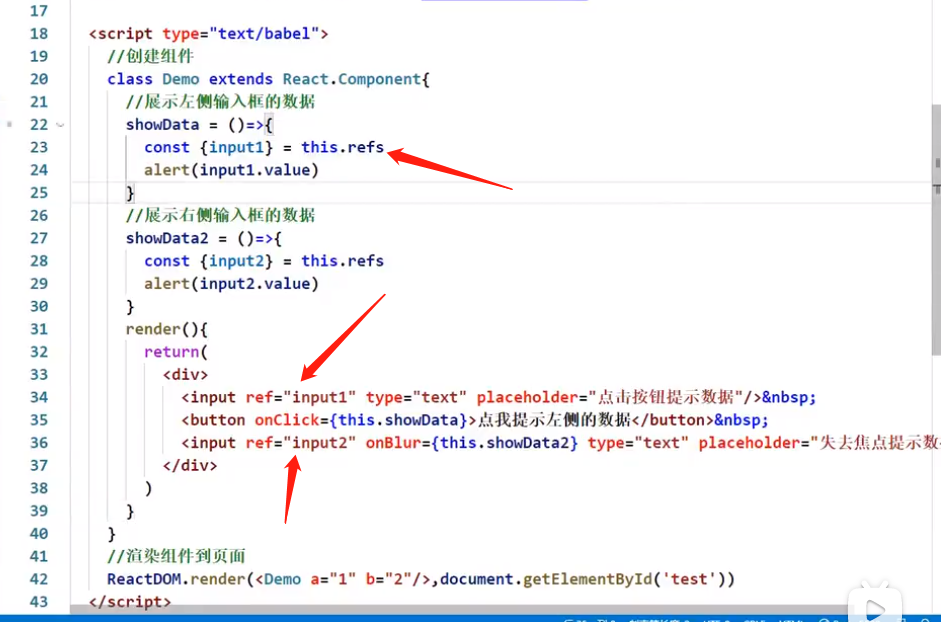

 为什么要有ref这种东西，感觉跟id的感觉一样？

* Refs and the DOM
* Refs转发
* 转发refs到DOM组件
* 在高阶组件中转发refs

# 28 回调形式的ref

你要写回调了，你得首先定义一个函数，所以说直接就在花括号里面去定义一个函数

34行：ref={() => {}}

里面的这个箭头函数是回调函数吗？

回调函数有三个特点：

1. 函数是由我们定义的
2. 但函数不是由我们调用的
3. 这函数最终执行了

里面的这个箭头函数是回调函数吗？——是

**这个箭头函数会接到参数吗？会接收到什么参数呢？**

* 回调函数能收到什么参数取决于回调函数的调用者！
* 
* 参数正好是ref这个属性所处的那个节点 input

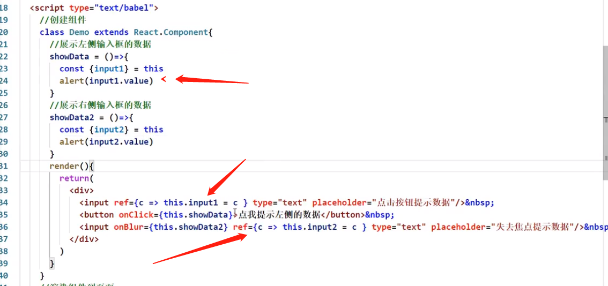

# 29 回调ref中调用次数的问题


[关于回调ref的说明](https://zh-hans.legacy.reactjs.org/docs/refs-and-the-dom.html#caveats-with-callback-refs)：

- 如果ref回调函数是以==内联函数==的方式定义的，在**==组件更新过程中==**它会被执行两次，第一次传入参数null，第二次传入参数DOM元素
- 这是因为在每次渲染时会创建一个新的（不是之前的那个函数了，是一个新的函数了，之前的那个函数执行完了被释放了）函数实例（指41行的函数），所以说不确定之前那个函数做了一些什么动作，所以说为了保证这个东西能够完美的被清空，所以在组件更新的过程中，第一次调用传了一个null
- 所以React清空旧的ref并且设置新的
- 通过将ref的回调函数**定义成class的绑定函数的方式**可以避免上述问题

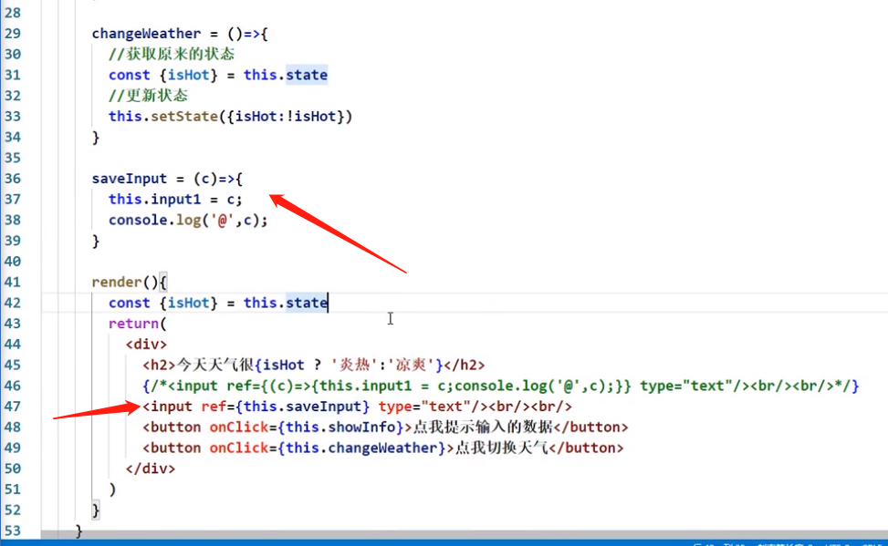

- 更改state中的数据，触发render函数的执行。无论怎么触发render函数的执行，也不会频繁的去调用saveInput，因为已经放在实例自身身上了。就算以后重新调用render，它也知道我身上有saveInput，我之前调过，==它不再是一个新的函数了==


# 30 createRef的使用


# refs相关技术分享

https://zh-hans.reactjs.org/docs/refs-and-the-dom.html#gatsby-focus-wrapper

1. refs是在创建类组件的时候从React.component中继承而来的

2. 在典型的 React 数据流中，[props](https://zh-hans.reactjs.org/docs/components-and-props.html) 是父组件与子组件交互的唯一方式。要修改一个子组件，你需要使用新的 props 来重新渲染它。但是，==在某些情况下，你需要在典型数据流之外强制修改子组件==。被修改的子组件可能是一个 React 组件的实例，也可能是一个 DOM 元素。对于这两种情况，React 都提供了解决办法

   1. ==在什么情况下需要在典型数据流之外强制修改子组件？==

3. 应用场景：

   1. 管理焦点，文本选择或媒体播放。==？==
   2. 触发强制动画。==？==
   3. 集成第三方 DOM 库。==？==

   在某些情况下（==什么具体的情况？==），我们会通过使用`refs`来更新组件，但这种方式并不推荐，更多情况我们是通过`props`与`state`的方式进行去重新渲染子元素

4. 我们在日常写React代码的时候，一般情况是用不到Refs这个东西，因为我们并不直接操作底层DOM元素，而是在render函数里去编写我们的页面结构，由React来组织DOM元素的更新。

   凡事总有例外，总会有一些很奇葩的时候我们需要直接去操作页面的真实DOM，这就要求我们有直接访问真实DOM的能力，而Refs就是为我们提供了这样的能力。也就是React无法控制局面的时候，就需要直接操作Refs了。

5. ### 将 DOM Refs 暴露给父组件

   在极少数情况下（==什么情况？==），你可能希望在父组件中引用子节点的 DOM 节点

   通常不建议这样做，因为它会打破组件的封装

   但它偶尔可用于触发焦点或测量子 DOM 节点的大小或位置（==？？？？==）

   虽然你可以[向子组件添加 ref](https://zh-hans.reactjs.org/docs/refs-and-the-dom.html#adding-a-ref-to-a-class-component)，但这不是一个理想的解决方案，因为你只能获取组件实例而不是 DOM 节点。并且，它还在函数组件上无效

6. 如果你使用 16.3 或更高版本的 React, 这种情况下我们推荐使用 [ref 转发](https://zh-hans.reactjs.org/docs/forwarding-refs.html)。**Ref 转发使组件可以像暴露自己的 ref 一样暴露子组件的 ref**。关于怎样对父组件暴露子组件的 DOM 节点，在 [ref 转发文档](https://zh-hans.reactjs.org/docs/forwarding-refs.html#forwarding-refs-to-dom-components)中有一个详细的例子

7. ref转发：https://zh-hans.reactjs.org/docs/forwarding-refs.html

8. 如何传递refs：https://www.bilibili.com/video/BV1kt411p7De?from=search&seid=8754523972667526849&spm_id_from=333.337.0.0

# 扩展：高阶组件

https://www.bilibili.com/video/BV1Ut411p7Ne/?spm_id_from=333.788.recommend_more_video.-1

https://zh-hans.reactjs.org/docs/higher-order-components.html#gatsby-focus-wrapper

https://www.bilibili.com/video/BV1wy4y1D7JT?p=32&spm_id_from=pageDriver

# 31总结ref

# 32 react中的事件处理

https://www.bilibili.com/video/BV1wy4y1D7JT/?p=32&spm_id_from=pageDriver&vd_source=a7089a0e007e4167b4a61ef53acc6f7e


**给button加的onClick，给input加的onBlur，其实react在工作的时候把这些事件都加给了最外侧的div**

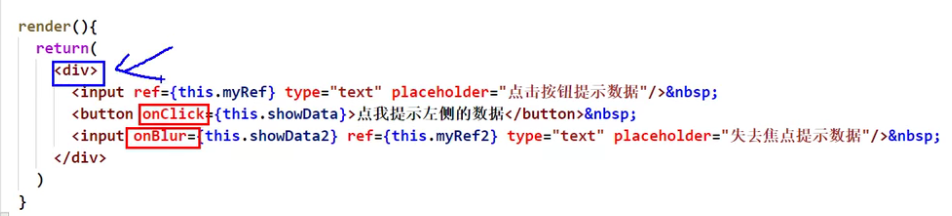

为什么要这样做呢？

- **事件委托的原理——事件冒泡** 为了高效


**event.target:  当发生事件的元素正好是要操作的元素，就可以省略ref**

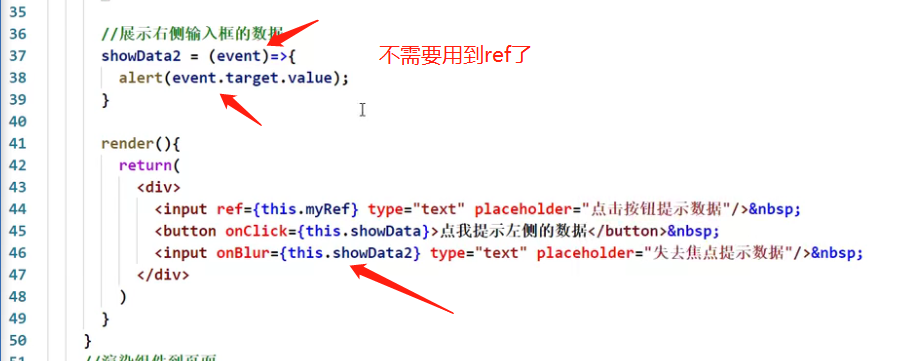

# 33 非受控组件

https://www.bilibili.com/video/BV1wy4y1D7JT/?p=33&spm_id_from=pageDriver&vd_source=a7089a0e007e4167b4a61ef53acc6f7e

页面中所有输入类的dom是**现用现取**

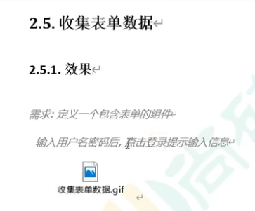


如果不指定请求方式，form表单发出去的请求默认是get请求，而且默认带的参数是query参数

ajax最大的优势就是**页面无刷新获取数据**

表单提交默认引起页面的跳转，如何阻止跳转呢？

* 不配地址，即action不赋值（没有解决问题）
* **表单提交是一个默认的动作**，所以利用原生的阻止默认事件就可以阻止跳转了


# 34 受控组件

https://www.bilibili.com/video/BV1wy4y1D7JT/?p=34&spm_id_from=pageDriver&vd_source=a7089a0e007e4167b4a61ef53acc6f7e

受控组件是受到了谁的控制？

页面中所有输入类的dom，随着输入可以把值维护到状态里面去，需要用的时候直接从状态里面取出来

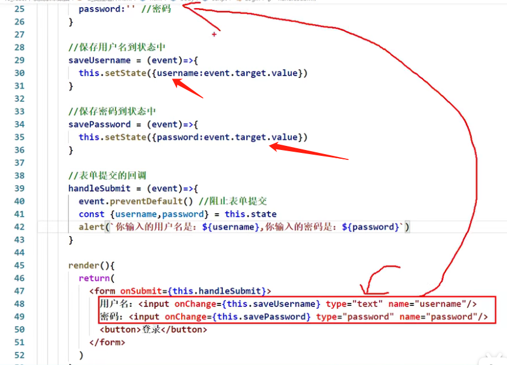

# 35 高阶函数_函数柯里化！！！


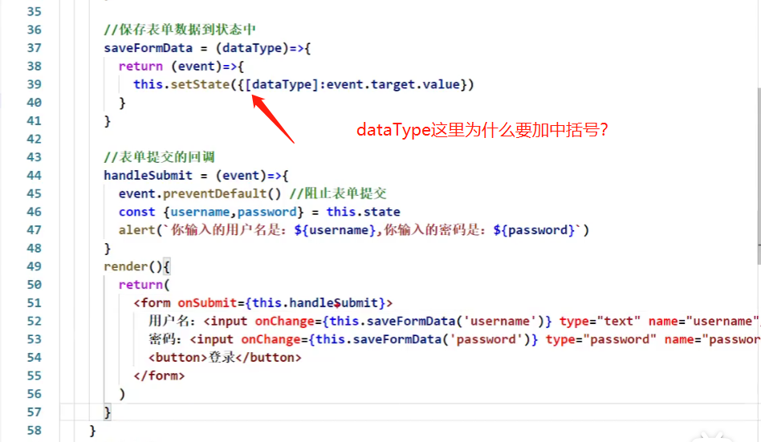


演示函数的柯里化：


# 36 不用柯里化的写法！！！

https://www.bilibili.com/video/BV1wy4y1D7JT/?p=36&spm_id_from=pageDriver&vd_source=a7089a0e007e4167b4a61ef53acc6f7e


# 37 引出生命周期

https://www.bilibili.com/video/BV1wy4y1D7JT?p=37&vd_source=a7089a0e007e4167b4a61ef53acc6f7e


解法1:


解法2：


# 38 生命周期(旧)_组件挂载流程

https://www.bilibili.com/video/BV1wy4y1D7JT?p=38&spm_id_from=pageDriver&vd_source=a7089a0e007e4167b4a61ef53acc6f7e

**react生命周期(旧)**


# 39 生命周期(旧)_setState流程

1,2,3共三条线


# 40 生命周期(旧)_forceUpdate流程

https://www.bilibili.com/video/BV1wy4y1D7JT?p=40&spm_id_from=pageDriver&vd_source=a7089a0e007e4167b4a61ef53acc6f7e

强制更新：不对状态做出任何的修改，组件也能进行更新


 


