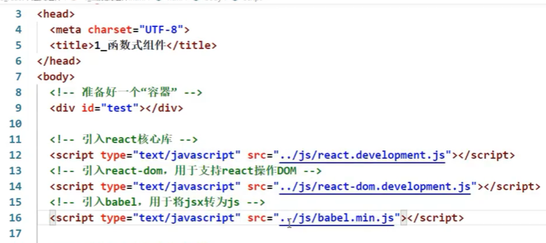
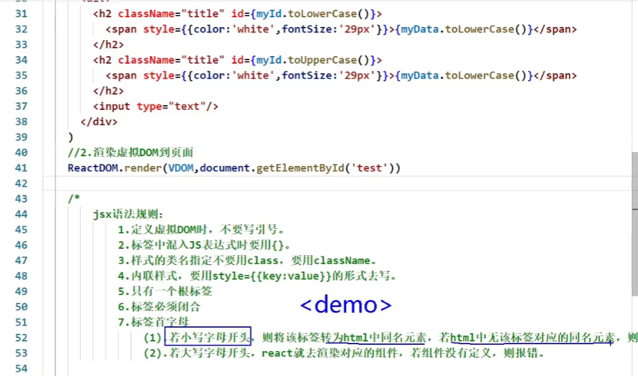

https://www.bilibili.com/video/BV1wy4y1D7JT?from=search&seid=1655099700202851743#

# 五 JSX语法规则

 


# 六 jsx小练习


# 九 函数式组件

两种：

1. 函数式组件：适用于简单组件的定义

2. 类式组件：

   



```react
// 1.创建函数式组件
function demo () {
    return <h2>我是用函数定义的组件（适用于简单组件的定义）</h2>
}
// 2.渲染组件到页面
ReactDOM.render(demo, document.getElementById('test'));

// 报错：
Warning:Functions are not valid as a React child. This may happen if you return a Component instead of <Component /> from render. Or maybe you meant to call this function rather than return it.

函数类型式不能作为react的节点的
```


```react
// 1.创建函数式组件
function demo () {
    return <h2>我是用函数定义的组件（适用于简单组件的定义）</h2>
}
// 2.渲染组件到页面
ReactDOM.render(<demo/>, document.getElementById('test'));

// 报错：
Warning:The tag <demo> is unrecognized in this browser.If you meant to render a React component, start its name with an uppercase letter
```





```react
// 1.创建函数式组件
function Demo () {
    console.log(this); // undefined 因为代码经过babel（将jsx转为js）的翻译，babel开启了严格模式
    return <h2>我是用函数定义的组件（适用于简单组件的定义）</h2>
}
// 2.渲染组件到页面
ReactDOM.render(<Demo/>,document.getElementById('test'));
```


