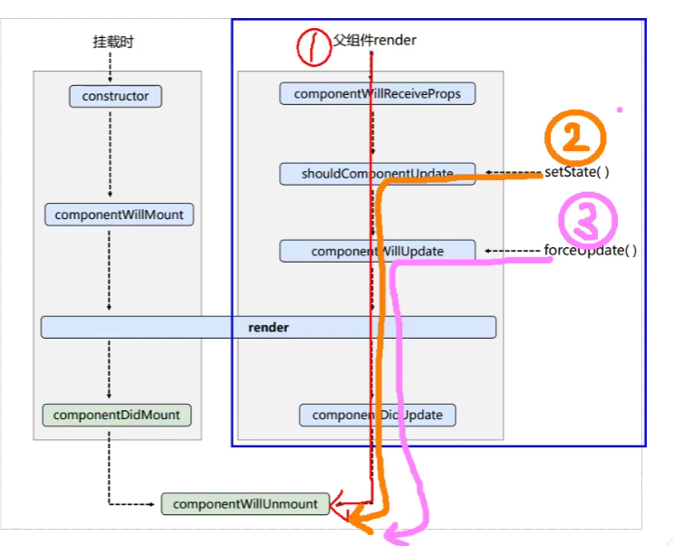
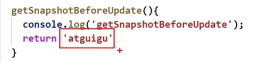
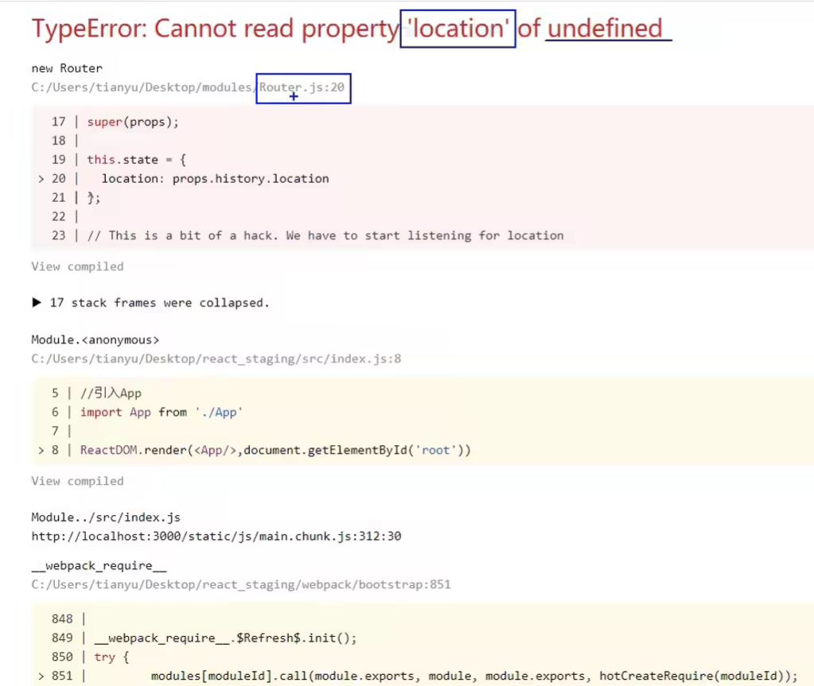
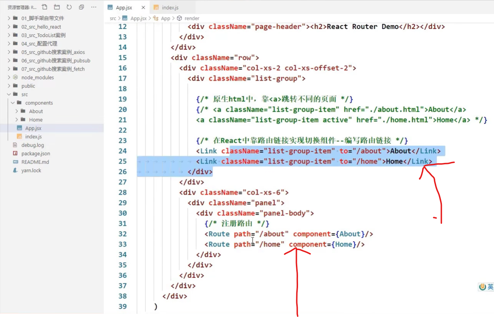
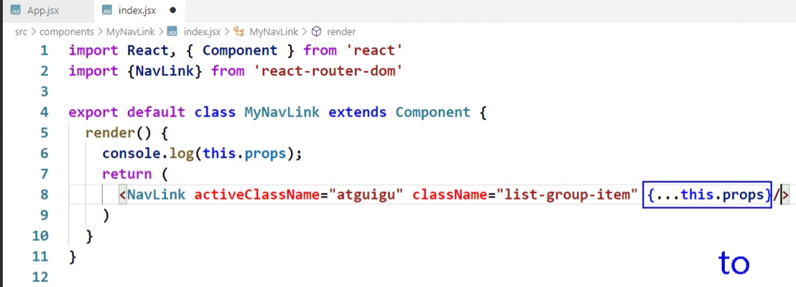
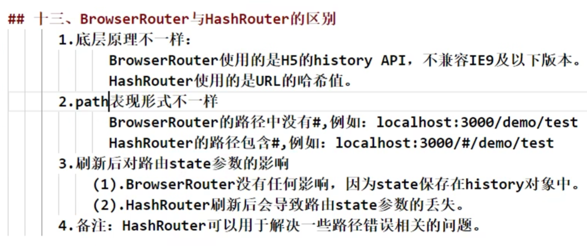

https://www.bilibili.com/video/BV1wy4y1D7JT?from=search&seid=1655099700202851743#

# 1 React简介


# 2 Hello React案例

 

React工具：https://fb.me/react-devtools

# 3 虚拟DOM的两种创建方式

- [ ] 为什么不用原生的js，非要用jsx？

- [ ] React官方为什么要出jsx语法？

  创建虚拟dom太繁琐了，有了jsx，编码人员可以更简单的创建虚拟dom

**1.使用jsx创建虚拟DOM：**


**2.用js创建虚拟DOM：**


# 5 JSX语法规则


# 6 jsx小练习


==**规律：如果给React传了一个数组，React会自动遍历该数组**==

什么是表达式？什么是语句？


# 7 组件与模块


# 8 开发者工具的安装

# 9 函数式组件

两种：

1. ==函数式组件==：适用于简单组件的定义

2. ==类式组件==：


```react
// 1.创建函数式组件
function demo () {
    return <h2>我是用函数定义的组件（适用于简单组件的定义）</h2>
}
// 2.渲染组件到页面
ReactDOM.render(demo, document.getElementById('test'));
```

报错：函数类型式不能作为react的节点的


```react
// 1.创建函数式组件
function demo () {
    return <h2>我是用函数定义的组件（适用于简单组件的定义）</h2>
}
// 2.渲染组件到页面
ReactDOM.render(<demo/>, document.getElementById('test'));

// 报错：
Warning:The tag <demo> is unrecognized in this browser.If you meant to render a React component, start its name with an uppercase letter
```


```react
<script type="text/babel">
    // 1.创建函数式组件
    function Demo () {
        console.log(this); // undefined 因为代码经过babel（将jsx转为js）的翻译，babel开启了严格模式。严格模式最大的特点就是：禁止自定义的函数里面的this指向window
        return <h2>我是用函数定义的组件（适用于简单组件的定义）</h2>
    }
    // 2.渲染组件到页面
    ReactDOM.render(<Demo/>,document.getElementById('test'));
</script>
```


# 10 复习类相关的基本知识


问题：speak方法放在了哪里？——Person类的原型对象上，供实例使用


[尚硅谷2021版React技术全家桶全套完整版（零基础入门到精通/男神天禹老师亲授）_哔哩哔哩_bilibili](https://www.bilibili.com/video/BV1wy4y1D7JT?p=11&spm_id_from=pageDriver)

# 11 类式组件

```react
// 1.创建类式组件
class MyComponent extends React.Component{
    // render是放在哪里的？—— 类的原型对象上，供实例使用
    render(){
        console.log(this) // this：MyComponent的实例对象
        // 实例对象上有这样一些属性：context，props，refs，state，updater，_reactInternalFiber，_reactInternalInstance
        renturn <h2>我是类式定义组件</h2>
    }
}
ReactDOM.render(<MyComponent></MyComponent>, document.getElementById('test'));
```


# 12 对state的理解

- 如果组件是有状态的，就是复杂组件


- 如果组件是无状态的，就是简单组件


- 什么是状态？

  - 人		状态	影响	行为
  - 组件	状态	驱动	页面	

- 组件的状态里面存着数据，数据的改变驱动着页面的展示


- 状态其实是组件实例对象身上的
- 最新版的react提出了一个新的东西：hooks

# 13 初始化state

```react
// new MyComponent这个动作是由react做的，不是我们自己new的
class MyComponent extends React.Component{
    // state是类的实例对象身上的，对类的实例对象做一些初始化操作，就要联想到constructor
    // props是什么？
    constructor (props) {
        // 如果a类继承了b类，且a类中写了构造器，那么a类构造器中的super是必须要调用的
        super(props);
        // 初始化状态
        this.state = {isHot:true};
    }
    
    render(){
        renturn <h2>今天天气很{this.state.isHot ? '炎热' : '凉爽'}</h2>
    }
}
ReactDOM.render(<MyComponent></MyComponent>, document.getElementById('test'));
```

# 14 React中的事件绑定

原生事件的绑定有几种方式：


第一版：

```react
class MyComponent extends React.Component{
    constructor (props) {
        super(props);
        // 初始化状态
        this.state = {isHot:true};
    }
    
    render(){
        renturn <h2 onclick="demo()">今天天气很{this.state.isHot ? '炎热' : '凉爽'}</h2>
    }
}
ReactDOM.render(<MyComponent></MyComponent>, document.getElementById('test'));

function demo () {
    console.log('被点击了')
}

// 报错：
Invalid event handler property `onclick`. Did you mean `onClick`?
```

第二版：

```React
class MyComponent extends React.Component{
    constructor (props) {
        super(props);
        // 初始化状态
        this.state = {isHot:true};
    }
    
    render(){
        renturn <h2 onClick="demo()">今天天气很{this.state.isHot ? '炎热' : '凉爽'}</h2>
    }
}
ReactDOM.render(<MyComponent></MyComponent>, document.getElementById('test'));

function demo () {
    console.log('被点击了');
}

// 报错：
Expected `onClick` listener to be a function, instead got a value of `string` type.
```

第三版：

```react
class MyComponent extends React.Component{
    constructor (props) {
        super(props)
        // 初始化状态
        this.state = {isHot:true}
    }
    
    render(){
        renturn <h2 onClick={demo}>今天天气很{this.state.isHot ? '炎热' : '凉爽'}</h2>
    }
}
ReactDOM.render(<MyComponent></MyComponent>, document.getElementById('test'));

function demo () {
    console.log('被点击了')
}
```

# 15 类中方法中的this

第一版：不合理

babel禁止自定义函数的this指向window


 第二版：报错：changeWeather is not defined.


第三版：报错：Cannot read property 'state' of undefined


为什么changeWeather里面的this是undefined？它不是实例方法吗？为什么this会丢失？

* 只有通过Weather的实例对象调用changeWeather的时候，changeWeather中的this才是Weather实例
* 由于changeWeather是作为onClick的回调，所以不是通过实例调用的，是直接调用，而且由于**类中的方法默认开启了局部的严格模式**，所以changeWeather中的this为undefined


# 16 解决类中this指向问题


bind能做两件事

第一：生成一个新的函数

第二：改变this指向


第30行调用的changeWeather函数是**原型上**的还是**挂在实例自身身上**的？

* **挂在实例自身身上的**

# 17 setState的使用


```react
this.setState({
	isHot: !isHot; // 替换还是合并？合并
})
```


# 18 state的简写方式


精简前：


精简后：


# 19 总结state


# 20 props的简单使用


https://www.bilibili.com/video/BV1wy4y1D7JT?p=28

# 21 批量传递props

即**批量传递标签属性**


...展开运算符是不能展开对象的

babel + react后：...展开运算符就能展开对象


# 22 对props进行限制


# 23 props的简写方式

props是只读的


# 24 类式组件中的构造器与props

类中的构造器到底有什么作用？


# 25 函数组件使用props


# 26 总结props

# 27 字符串形式的ref

**React官方不推荐使用字符串形式的ref**。为什么不推荐？https://zh-hans.reactjs.org/docs/refs-and-the-dom.html#gatsby-focus-wrapper


因为string类型的refs存在一些问题：写多了效率不高（为什么写多了效率不高？？）

https://github.com/facebook/react/pull/8333#issuecomment-271648615


 为什么要有ref这种东西，感觉跟id的感觉一样？

* Refs and the DOM
* Refs转发
* 转发refs到DOM组件
* 在高阶组件中转发refs

# 28 回调形式的ref

你要写回调了，你得首先定义一个函数，所以说直接就在花括号里面去定义一个函数

34行：ref={() => {}}

里面的这个箭头函数是回调函数吗？

回调函数有三个特点：

1. 函数是由我们定义的
2. 但函数不是由我们调用的
3. 这函数最终执行了

里面的这个箭头函数是回调函数吗？——是

**这个箭头函数会接到参数吗？会接收到什么参数呢？**

* 回调函数能收到什么参数取决于回调函数的调用者！
* 
* 参数正好是ref这个属性所处的那个节点 input


# 29 回调ref中调用次数的问题


[关于回调ref的说明](https://zh-hans.legacy.reactjs.org/docs/refs-and-the-dom.html#caveats-with-callback-refs)：

- 如果ref回调函数是以==内联函数==的方式定义的，在**==组件更新过程中==**它会被执行两次，第一次传入参数null，第二次传入参数DOM元素
- 这是因为在每次渲染时会创建一个新的（不是之前的那个函数了，是一个新的函数了，之前的那个函数执行完了被释放了）函数实例（指41行的函数），所以说不确定之前那个函数做了一些什么动作，所以说为了保证这个东西能够完美的被清空，所以在组件更新的过程中，第一次调用传了一个null
- 所以React清空旧的ref并且设置新的
- 通过将ref的回调函数**定义成class的绑定函数的方式**可以避免上述问题


- 更改state中的数据，触发render函数的执行。无论怎么触发render函数的执行，也不会频繁的去调用saveInput，因为已经放在实例自身身上了。就算以后重新调用render，它也知道我身上有saveInput，我之前调过，==它不再是一个新的函数了==


# 30 createRef的使用


# refs相关技术分享

https://zh-hans.reactjs.org/docs/refs-and-the-dom.html#gatsby-focus-wrapper

1. refs是在创建类组件的时候从React.component中继承而来的

2. 在典型的 React 数据流中，[props](https://zh-hans.reactjs.org/docs/components-and-props.html) 是父组件与子组件交互的唯一方式。要修改一个子组件，你需要使用新的 props 来重新渲染它。但是，==在某些情况下，你需要在典型数据流之外强制修改子组件==。被修改的子组件可能是一个 React 组件的实例，也可能是一个 DOM 元素。对于这两种情况，React 都提供了解决办法

   1. ==在什么情况下需要在典型数据流之外强制修改子组件？==

3. 应用场景：

   1. 管理焦点，文本选择或媒体播放。==？==
   2. 触发强制动画。==？==
   3. 集成第三方 DOM 库。==？==

   在某些情况下（==什么具体的情况？==），我们会通过使用`refs`来更新组件，但这种方式并不推荐，更多情况我们是通过`props`与`state`的方式进行去重新渲染子元素

4. 我们在日常写React代码的时候，一般情况是用不到Refs这个东西，因为我们并不直接操作底层DOM元素，而是在render函数里去编写我们的页面结构，由React来组织DOM元素的更新。

   凡事总有例外，总会有一些很奇葩的时候我们需要直接去操作页面的真实DOM，这就要求我们有直接访问真实DOM的能力，而Refs就是为我们提供了这样的能力。也就是React无法控制局面的时候，就需要直接操作Refs了。

5. ### 将 DOM Refs 暴露给父组件

   在极少数情况下（==什么情况？==），你可能希望在父组件中引用子节点的 DOM 节点

   通常不建议这样做，因为它会打破组件的封装

   但它偶尔可用于触发焦点或测量子 DOM 节点的大小或位置（==？？？？==）

   虽然你可以[向子组件添加 ref](https://zh-hans.reactjs.org/docs/refs-and-the-dom.html#adding-a-ref-to-a-class-component)，但这不是一个理想的解决方案，因为你只能获取组件实例而不是 DOM 节点。并且，它还在函数组件上无效

6. 如果你使用 16.3 或更高版本的 React, 这种情况下我们推荐使用 [ref 转发](https://zh-hans.reactjs.org/docs/forwarding-refs.html)。**Ref 转发使组件可以像暴露自己的 ref 一样暴露子组件的 ref**。关于怎样对父组件暴露子组件的 DOM 节点，在 [ref 转发文档](https://zh-hans.reactjs.org/docs/forwarding-refs.html#forwarding-refs-to-dom-components)中有一个详细的例子

7. ref转发：https://zh-hans.reactjs.org/docs/forwarding-refs.html

8. 如何传递refs：https://www.bilibili.com/video/BV1kt411p7De?from=search&seid=8754523972667526849&spm_id_from=333.337.0.0

# 扩展：高阶组件

https://www.bilibili.com/video/BV1Ut411p7Ne/?spm_id_from=333.788.recommend_more_video.-1

https://zh-hans.reactjs.org/docs/higher-order-components.html#gatsby-focus-wrapper

https://www.bilibili.com/video/BV1wy4y1D7JT?p=32&spm_id_from=pageDriver

# 31总结ref

# 32 react中的事件处理

https://www.bilibili.com/video/BV1wy4y1D7JT/?p=32&spm_id_from=pageDriver&vd_source=a7089a0e007e4167b4a61ef53acc6f7e


**给button加的onClick，给input加的onBlur，其实react在工作的时候把这些事件都加给了最外侧的div**


为什么要这样做呢？

- **事件委托的原理——事件冒泡** 为了高效


**event.target:  当发生事件的元素正好是要操作的元素，就可以省略ref**


# 33 非受控组件

https://www.bilibili.com/video/BV1wy4y1D7JT/?p=33&spm_id_from=pageDriver&vd_source=a7089a0e007e4167b4a61ef53acc6f7e

页面中所有输入类的dom是**现用现取**


如果不指定请求方式，form表单发出去的请求默认是get请求，而且默认带的参数是query参数

ajax最大的优势就是**页面无刷新获取数据**

表单提交默认引起页面的跳转，如何阻止跳转呢？

* 不配地址，即action不赋值（没有解决问题）
* **表单提交是一个默认的动作**，所以利用原生的阻止默认事件就可以阻止跳转了


# 34 受控组件

https://www.bilibili.com/video/BV1wy4y1D7JT/?p=34&spm_id_from=pageDriver&vd_source=a7089a0e007e4167b4a61ef53acc6f7e

受控组件是受到了谁的控制？

页面中所有输入类的dom，随着输入可以把值维护到状态里面去，需要用的时候直接从状态里面取出来


# 35 高阶函数_函数柯里化！！！


演示函数的柯里化：


# 36 不用柯里化的写法！！！

https://www.bilibili.com/video/BV1wy4y1D7JT/?p=36&spm_id_from=pageDriver&vd_source=a7089a0e007e4167b4a61ef53acc6f7e


# [37 引出生命周期](https://www.bilibili.com/video/BV1wy4y1D7JT?p=37&vd_source=a7089a0e007e4167b4a61ef53acc6f7e)


| 解法1:                                                       | 解法2：                                                      |
| ------------------------------------------------------------ | ------------------------------------------------------------ |
|  |  |

# [38 生命周期(旧)_组件挂载流程](https://www.bilibili.com/video/BV1wy4y1D7JT?p=38&spm_id_from=pageDriver&vd_source=a7089a0e007e4167b4a61ef53acc6f7e)

> 图中的‘父组件render’其实指的是‘更新’

|  | 1,2,3共三条线: <br> |
| ------------------------------------------------------------ | ------------------------------------------------------------ |
| 1. <br>2. shouldComponentUpdate：组件是否应该被更新。该钩子如果不写，默认返回true<br>3. componentWillUpdate：组件将要更新<br>4. componentDidUpdate：组件更新完毕 |  |

# [39 生命周期(旧)_setState流程](https://www.bilibili.com/video/BV1wy4y1D7JT/?p=39&spm_id_from=pageDriver&vd_source=a7089a0e007e4167b4a61ef53acc6f7e)

见上节的图

# [40 生命周期(旧)_forceUpdate流程](https://www.bilibili.com/video/BV1wy4y1D7JT/?p=40&spm_id_from=pageDriver&vd_source=a7089a0e007e4167b4a61ef53acc6f7e)

见上上节的图

> 强制更新：不对状态做出任何的修改，组件也能进行更新
>

# [41 生命周期(旧)——父组件render流程](https://www.bilibili.com/video/BV1wy4y1D7JT/?p=41&spm_id_from=pageDriver&vd_source=a7089a0e007e4167b4a61ef53acc6f7e)

> 父组件一旦重新render，子组件就会响应**componentWillReceiveProps**钩子

|  |  |
| ------------------------------------------------------------ | ------------------------------------------------------------ |

# 42 总结生命周期（旧）

# 43 对比新旧生命周期

https://www.bilibili.com/video/BV1wy4y1D7JT/?p=43&vd_source=a7089a0e007e4167b4a61ef53acc6f7e


在新版react中使用旧版react中的生命周期钩子：


* componentWillMount -->UNSAFE_componentWillMount

* componentWillReceiveProps -->UNSAFE_componentWillReceiveProps 

* componentWillUpdate-->UNSAFE_componentWillUpdate


**为什么要加UNSAFE？**


# 44 getDerivedStateFromProps

https://www.bilibili.com/video/BV1wy4y1D7JT/?p=44&spm_id_from=pageDriver&vd_source=a7089a0e007e4167b4a61ef53acc6f7e


设计getDerivedStateFromProps有什么用？


# 45 getSnapshotBeforeUpdate

https://www.bilibili.com/video/BV1wy4y1D7JT/?p=45&spm_id_from=pageDriver&vd_source=a7089a0e007e4167b4a61ef53acc6f7e

在更新之前获取快照


- 在更新之前获取谁的快照？
- 这个快照获取完了之后有什么用呢？




- 这个返回的快照值交给谁了？ 

  

  

# 46 getSnapshotBeforeUpdate举例


# 47 总结生命周期（新）

# 48 DOM的diffing算法


**上面add有一个非常严重的效率问题**

# 49 初始化react脚手架


脚手架是用什么搭的？——webpack

# 50 脚手架文件介绍_public

  public里面一般存静态文件：页面 样式 图片


https://www.bilibili.com/video/BV1wy4y1D7JT?p=56&spm_id_from=pageDriver

# 51 脚手架文件介绍_src

src中的index.js **入口文件**


StrictMode：用来检查App组件及其子组件里面写的东西是否合理

reportWebVitals：用于记录页面上的性能


index.js也没有引入到index.html当中啊，那他俩之间是怎么发生关系的呢？

* **靠webpack配置**


# 52 一个简单的hello组件


==**默认暴露 + 分别暴露**==


# 53 样式的模块化（还没看）

模块化前：


模块化后：


# 54 vscode中react插件的安装（还没看）


# 55 组件化编码流程


# 56 静态组件


# 57 动态初始化列表

**强调：状态中的数据驱动着页面的展示**

**涉及到组件间传值 通信**

# 58 添加todo


#### 1.**父组件给子组件传值用props**

#### 2.**子组件给父组件传值呢？**

- 父组件通过props传给子组件一个函数A
- 然后子组件在合适的时候调用函数A


**了解一下nanoid库，uuid库**


# 59 鼠标移入效果


# 60 添加一个todo 


https://www.bilibili.com/video/BV1wy4y1D7JT?p=65

# 61 对props进行限制

要安装相关库

```javascript
import PropTypes from 'prop-types'
```


# 62 删除一个todo(还没看)

# 63 实现底部功能(还没看)

# 64 总结todolist案例(还没看)

# 65 脚手架配置代理_方法一

**针对单个server**


- axios: promise风格
  - 返回的时候不是把真正的数据返回给你，是返回了一个promise实例对象

- 为什么学习react？
  - 为了尽可能的减少自己去操作dom，我们只是更新状态，改数据，react帮我们转成虚拟dom，进而转成真实dom，然后放到页面

**React的核心就是你别自己操作dom，你却在react中引入了一个专门操作dom的jquery。你觉得这合适吗？**


- 3000端口给5000端口发请求，跨域了

- 到底是因为跨域，导致我的ajax请求不能发送，还是因为说因为跨域，我的ajax请求能发送，但是数据回不来？
  - 答案是后者


- 怎么解决跨域问题？
  - 在react脚手架里面通过**代理**去解决
  - 所谓代理就是出现一个中间人，中间人也是开在3000端口上的，（3000端口跑了一个脚手架，其实也开了另外一台非常微小的服务器）
  - 
- 为什么'中3000'能接收到'server 5000的'数据？
  - 因为‘中3000’没有ajax引擎，产生跨域本质是因为ajax引擎把响应给拦住了，中间人是通过请求转发的形式，没有ajax引擎，所以说也不存在跨域这个问题
- 怎么去开启**中间人代理服务器**呢？


# 66 脚手架配置代理_方法二

**针对多个server**

setupProxy.js：**名字不能改，react脚手架会自动找到这个配置文件**

- setupProxy文件里面的代码不能用ES6语法，要用CommonJS

  * 因为setupProxy不是给前端代码用于执行的，react脚手架找到这个文件，把它加到webpack配置里面

  * webpack里面用的都是node里的语法，都是CommonJS


# 67 github搜索案例_静态组件

没啥用

# 68 github搜索案例_axios发送请求

# 69 github搜索案例_展示数据

https://www.bilibili.com/video/BV1wy4y1D7JT/?p=69&spm_id_from=pageDriver&vd_source=a7089a0e007e4167b4a61ef53acc6f7e

兄弟组件通信

# 70 github搜索案例_完成案例

https://www.bilibili.com/video/BV1wy4y1D7JT?p=71&spm_id_from=pageDriver

# 71 消息订阅与发布机制

兄弟组件间的通信


# 72 fetch 发送请求（没看完）

https://www.bilibili.com/video/BV1wy4y1D7JT/?p=72&spm_id_from=pageDriver&vd_source=a7089a0e007e4167b4a61ef53acc6f7e

9min处

# 73 总结github搜索案例

# [74 对SPA应用的理解](https://www.bilibili.com/video/BV1wy4y1D7JT?p=74&spm_id_from=pageDriver&vd_source=a7089a0e007e4167b4a61ef53acc6f7e)

single page application


# [75 对路由的理解](https://www.bilibili.com/video/BV1wy4y1D7JT?p=75&spm_id_from=pageDriver&vd_source=a7089a0e007e4167b4a61ef53acc6f7e)


浏览器的路径怎么变成/test呢？

# [76 前端路由原理](https://www.bilibili.com/video/BV1wy4y1D7JT?p=76&spm_id_from=pageDriver&vd_source=a7089a0e007e4167b4a61ef53acc6f7e)

前端路由依赖浏览器的历史记录history

|  |  |
| :----------------------------------------------------------: | ------------------------------------------------------------ |

浏览器的历史记录是一个栈的结构


前端路由在单页面应用程序（SPA）中起着关键作用。它使用户在浏览器中导航不同页面时，不需要向服务器发送新的HTTP请求，而是通过JavaScript在客户端更新视图。以下是前端路由不会向后端发送请求的原理：

### 核心原理

#### 1. **单页面应用程序（SPA）**

SPA应用程序加载一个单独的HTML页面，并通过JavaScript动态更新页面内容，而不是从服务器请求新的页面。这种架构利用了浏览器的`history` API来管理URL和用户的浏览历史。

#### 2. **客户端路由**

客户端路由由JavaScript库（如React Router、Vue Router、Angular Router等）管理。这些库拦截浏览器的URL变化，并根据URL变化动态加载或切换组件，而不发出新的HTTP请求。

### 实现机制

#### 1. **Browser History API**

浏览器的`history` API允许开发者控制浏览器会话历史记录，包括以下主要方法：

- **`history.pushState()`**：添加新的历史记录条目。
- **`history.replaceState()`**：替换当前的历史记录条目。
- **`popstate` 事件**：监听浏览器前进或后退按钮事件。

#### 2. **Hash-based Routing**

早期的前端路由主要依赖于URL的哈希部分（即`#`后面的部分）来控制导航。这种方式简单且无需服务器支持：

- **URL 示例**：`http://example.com/#/home`
- **特点**：哈希部分的变化不会触发页面重新加载，且浏览器会将哈希值传递给JavaScript处理。

#### 3. **History API Routing**

现代前端路由使用`history` API来实现更干净的URL：

- **URL 示例**：`http://example.com/home`
- **特点**：通过`history.pushState()`和`history.replaceState()`方法管理URL，不会导致页面重新加载。

### 工作流程

1. **初始加载**：当用户首次访问应用程序时，服务器会返回一个静态HTML文件以及相关的CSS和JavaScript文件。
2. **前端路由初始化**：JavaScript加载后，前端路由库会初始化并监听URL的变化。
3. **URL 变化**：
   - 用户点击链接或浏览器地址栏发生变化时，路由库会拦截事件。
   - 使用`history.pushState()`或`history.replaceState()`更新URL，触发URL变化的监听器。
4. **视图更新**：根据当前URL，路由库加载相应的组件或视图，更新页面内容。

### 示例代码

下面是一个使用React Router的简单示例：

```javascript
import React from 'react';
import ReactDOM from 'react-dom';
import { BrowserRouter as Router, Route, Switch, Link } from 'react-router-dom';

const Home = () => <h2>Home</h2>;
const About = () => <h2>About</h2>;
const Contact = () => <h2>Contact</h2>;

const App = () => (
  <Router>
    <div>
      <nav>
        <ul>
          <li><Link to="/">Home</Link></li>
          <li><Link to="/about">About</Link></li>
          <li><Link to="/contact">Contact</Link></li>
        </ul>
      </nav>

      <Switch>
        <Route path="/" exact component={Home} />
        <Route path="/about" component={About} />
        <Route path="/contact" component={Contact} />
      </Switch>
    </div>
  </Router>
);

ReactDOM.render(<App />, document.getElementById('root'));
```

### 优势

- **提高性能**：减少了不必要的HTTP请求，提升了应用程序的响应速度。
- **更好的用户体验**：无刷新导航提供了更流畅的用户体验。
- **增强的控制**：开发者可以更好地控制应用程序的状态和过渡效果。

### 结论

前端路由通过利用浏览器的`history` API和JavaScript框架或库来拦截URL变化，动态更新视图，从而避免了向服务器发送新的请求。这种机制是实现单页面应用程序的关键，使得Web应用程序具有更快的响应速度和更流畅的用户体验。

# [77 路由的基本使用](https://www.bilibili.com/video/BV1wy4y1D7JT?p=77&vd_source=a7089a0e007e4167b4a61ef53acc6f7e)

**react-router-dom**

> 注意：由于react-router-dom在2021年11月份升级到了6版本，我们在此处学的是5版本，要执行: npm i react-router-dom@5
>
> 关于react-router-dom的最新6版本，在本教程的127集开始进行讲解

|  | <br>这里的报错不是很精准，Router分为BrowserRouter和HashRouter |
| ------------------------------------------------------------ | ------------------------------------------------------------ |
|  |  |
|  |  |

# [78 路由组件与一般组件](https://www.bilibili.com/video/BV1wy4y1D7JT/?p=78&spm_id_from=pageDriver&vd_source=a7089a0e007e4167b4a61ef53acc6f7e)

|  |  |
| ------------------------------------------------------------ | ------------------------------------------------------------ |


# [79 NavLink的使用](https://www.bilibili.com/video/BV1wy4y1D7JT/?p=79&spm_id_from=pageDriver&vd_source=a7089a0e007e4167b4a61ef53acc6f7e)

| <br>如果用Link，就意味着你所写的路由链接不带有高亮效果；<br>如果想高亮，用Link的升级版，NavLink |  |
| ------------------------------------------------------------ | ------------------------------------------------------------ |


# [80 封装NavLink组件](https://www.bilibili.com/video/BV1wy4y1D7JT/?p=80&spm_id_from=pageDriver&vd_source=a7089a0e007e4167b4a61ef53acc6f7e)

|  |  |
| ------------------------------------------------------------ | ------------------------------------------------------------ |
| 传递属性增多后的升级写法：                                   |                                                              |
|  | <br>有开闭两个标签 |
| 再升级：标签自闭合                                           |                                                              |
|  |  |

# [81 Switch的使用](https://www.bilibili.com/video/BV1wy4y1D7JT/?p=81&spm_id_from=pageDriver&vd_source=a7089a0e007e4167b4a61ef53acc6f7e)


# [82 解决样式丢失的问题](https://www.bilibili.com/video/BV1wy4y1D7JT/?p=82&spm_id_from=pageDriver&vd_source=a7089a0e007e4167b4a61ef53acc6f7e) 

%PUBLIC_URL%


# [83 路由的模糊匹配与严格匹配](https://www.bilibili.com/video/BV1wy4y1D7JT/?p=83&spm_id_from=pageDriver&vd_source=a7089a0e007e4167b4a61ef53acc6f7e)


# [84 Redirect的使用](https://www.bilibili.com/video/BV1wy4y1D7JT/?p=84&spm_id_from=pageDriver&vd_source=a7089a0e007e4167b4a61ef53acc6f7e)


# [85 嵌套路由(二级路由)](https://www.bilibili.com/video/BV1wy4y1D7JT/?p=85&spm_id_from=pageDriver&vd_source=a7089a0e007e4167b4a61ef53acc6f7e)


# [86 向路由组件传递params参数](https://www.bilibili.com/video/BV1wy4y1D7JT/?p=86&spm_id_from=pageDriver&vd_source=a7089a0e007e4167b4a61ef53acc6f7e)

|  |  |
| ------------------------------------------------------------ | ------------------------------------------------------------ |


# [87 向路由组件传递search参数](https://www.bilibili.com/video/BV1wy4y1D7JT/?p=87&spm_id_from=pageDriver&vd_source=a7089a0e007e4167b4a61ef53acc6f7e)

|  |  |
| ------------------------------------------------------------ | ------------------------------------------------------------ |
|  |  |
|  | <br> |

# [88 向路由组件传递state参数](https://www.bilibili.com/video/BV1wy4y1D7JT/?p=88&spm_id_from=pageDriver&vd_source=a7089a0e007e4167b4a61ef53acc6f7e)


|  |  |
| ------------------------------------------------------------ | ------------------------------------------------------------ |

# [89 总结路由参数](https://www.bilibili.com/video/BV1wy4y1D7JT/?p=89&spm_id_from=pageDriver&vd_source=a7089a0e007e4167b4a61ef53acc6f7e)


# [90 push与replace](https://www.bilibili.com/video/BV1wy4y1D7JT/?p=90&spm_id_from=pageDriver&vd_source=a7089a0e007e4167b4a61ef53acc6f7e)


# [91 编程式路由导航](https://www.bilibili.com/video/BV1wy4y1D7JT?p=91&spm_id_from=pageDriver&vd_source=a7089a0e007e4167b4a61ef53acc6f7e)


 


# [92 withRouter的使用](https://www.bilibili.com/video/BV1wy4y1D7JT/?p=92&spm_id_from=pageDriver&vd_source=a7089a0e007e4167b4a61ef53acc6f7e)


# [93 BrowserRouter与HashRouter](https://www.bilibili.com/video/BV1wy4y1D7JT/?p=93&spm_id_from=pageDriver&vd_source=a7089a0e007e4167b4a61ef53acc6f7e)



# 94 antd的基本使用

# 95 antd样式的按需引入

# 96 antd自定义主题

# [97 redux简介](https://www.bilibili.com/video/BV1wy4y1D7JT?p=97&vd_source=a7089a0e007e4167b4a61ef53acc6f7e)


# 98 redux工作流程

https://www.bilibili.com/video/BV1wy4y1D7JT?p=98&spm_id_from=pageDriver&vd_source=a7089a0e007e4167b4a61ef53acc6f7e


# 99 求和案例 纯react版

https://www.bilibili.com/video/BV1wy4y1D7JT?p=99&spm_id_from=pageDriver&vd_source=a7089a0e007e4167b4a61ef53acc6f7e


# 100 求和案例 redux精简版

https://www.bilibili.com/video/BV1wy4y1D7JT?p=100&spm_id_from=pageDriver&vd_source=a7089a0e007e4167b4a61ef53acc6f7e


# 101 求和案例 redux完整版

https://www.bilibili.com/video/BV1wy4y1D7JT?p=101&spm_id_from=pageDriver&vd_source=a7089a0e007e4167b4a61ef53acc6f7e


# 102 求和案例 异步action版

https://www.bilibili.com/video/BV1wy4y1D7JT?p=102&spm_id_from=pageDriver&vd_source=a7089a0e007e4167b4a61ef53acc6f7e


# 103 对react-redux的理解

https://www.bilibili.com/video/BV1wy4y1D7JT/?p=103&spm_id_from=pageDriver&vd_source=a7089a0e007e4167b4a61ef53acc6f7e


# 104 连接容器组件与UI组件

https://www.bilibili.com/video/BV1wy4y1D7JT/?p=104&spm_id_from=pageDriver&vd_source=a7089a0e007e4167b4a61ef53acc6f7e

# 105 react-redux基本使用

# 106 优化1——简写mapDispatch

# 107 优化2——Provider组件的使用

# 108 整合UI组件与容器组件

# 109 数据共享——编写Person组件

# 110 数据共享——编写Person的Reducer

# 111 数据共享——完成数据共享

# 112 纯函数

# 113 redux开发者工具

# 114 最终版

# 115 项目打包运行

# 116 扩展1——setState

https://www.bilibili.com/video/BV1wy4y1D7JT/?p=116&spm_id_from=pageDriver&vd_source=a7089a0e007e4167b4a61ef53acc6f7e


# 117 扩展2——lazyLoad

https://www.bilibili.com/video/BV1wy4y1D7JT/?p=117&spm_id_from=pageDriver&vd_source=a7089a0e007e4167b4a61ef53acc6f7e


# [118 stateHook——React.useState()——用于在函数组件中添加状态](https://www.bilibili.com/video/BV1wy4y1D7JT/?p=118&spm_id_from=pageDriver&vd_source=a7089a0e007e4167b4a61ef53acc6f7e)

为什么函数式组件里面没有this，但是类式组件里面有this？

https://github.com/jappp/Blog/issues/12

## 118.1 类式组件


## 118.2 函数式组件

                 

## 118.3 常见useState相关面试题

在大厂的前端面试中，`useState` 钩子是React中一个重要的概念。以下是一些关于 `useState` 的常见面试题及其答案：

### 1. 解释 `useState` 钩子的基本用法。

**回答**：
`useState` 是React中的一个钩子，用于在函数组件中添加状态。它返回一个状态变量和一个更新该状态的函数。

```javascript
import React, { useState } from 'react';

function Counter() {
  const [count, setCount] = useState(0);

  return (
    <div>
      <p>Count: {count}</p >
      <button onClick={() => setCount(count + 1)}>Increment</button>
    </div>
  );
}
```

### 2. `useState` 中初始状态的设置方式有哪些？

**回答**：
初始状态可以是一个值或一个返回值的函数：

- 直接传递值：

  ```javascript
  const [count, setCount] = useState(0);
  ```

- 传递一个函数（惰性初始状态）：

  ```javascript
  const [count, setCount] = useState(() => {
    return expensiveComputation();
  });
  ```

### 3. `useState` 是同步还是异步的？解释原因。

**回答**：
`useState` 更新是异步的。React会在组件重新渲染时批量处理状态更新，以优化性能。

```javascript
const [count, setCount] = useState(0);

function handleClick() {
  setCount(count + 1);
  console.log(count); // 可能还是旧值
}
```

由于 `setCount` 不会立即更新 `count`，日志中的值可能不会如预期更新。

### 4. 如何使用函数式更新来避免状态更新中的竞争条件？

**回答**：
使用函数式更新可以避免状态更新中的竞争条件，尤其是在需要基于当前状态计算新状态时：

```javascript
const [count, setCount] = useState(0);

function handleClick() {
  setCount(prevCount => prevCount + 1);
}
```

这种方式确保 `setCount` 接收到的是最新的状态。

### 5. 如何在 `useState` 中存储复杂的状态对象？

**回答**：
可以在 `useState` 中存储对象，但更新状态时要小心合并旧状态和新状态：

```javascript
const [state, setState] = useState({ count: 0, name: 'John' });

function updateName(newName) {
  setState(prevState => ({
    ...prevState,
    name: newName
  }));
}
```

通过扩展运算符 `...` 合并旧状态和新状态。

### 6. 如何实现一个简单的计数器组件？

**回答**：

```javascript
import React, { useState } from 'react';

function Counter() {
  const [count, setCount] = useState(0);

  return (
    <div>
      <p>Count: {count}</p >
      <button onClick={() => setCount(count + 1)}>Increment</button>
      <button onClick={() => setCount(count - 1)}>Decrement</button>
    </div>
  );
}
```

该组件包含两个按钮，分别用于增加和减少计数值。

### 7. 解释如何使用多个 `useState` 钩子管理多个独立的状态。

**回答**：
可以使用多个 `useState` 钩子来管理多个独立的状态变量：

```javascript
const [count, setCount] = useState(0);
const [name, setName] = useState('John');
```

每个 `useState` 钩子管理一个独立的状态变量。

### 8. 如何在React组件首次渲染后执行某个操作，但仅在首次渲染时执行？

**回答**：
通常会使用 `useEffect` 钩子实现此功能，但结合 `useState` 可以管理一个初始状态：

```javascript
import React, { useState, useEffect } from 'react';

function Component() {
  const [hasMounted, setHasMounted] = useState(false);

  useEffect(() => {
    if (!hasMounted) {
      // 只在首次渲染时执行
      console.log('Component did mount');
      setHasMounted(true);
    }
  }, [hasMounted]);

  return <div>Check console log</div>;
}
```

这种方法结合了 `useState` 和 `useEffect` 实现首次渲染的逻辑。

### 9. 在使用 `useState` 时遇到性能问题时，应该考虑哪些优化措施？

**回答**：

- **惰性初始状态**：使用函数返回初始状态，避免每次渲染时都计算初始值。

  ```javascript
  const [state, setState] = useState(() => computeInitialState());
  ```

- **避免不必要的状态更新**：确保只在必要时更新状态，减少组件重新渲染。

- **使用 `useMemo` 和 `useCallback`**：优化复杂计算和函数的创建，避免不必要的重渲染。

### 10. 解释 `useState` 与 `useReducer` 的区别及使用场景。

**回答**：

- **`useState`**：适用于简单状态管理，状态更新逻辑简单。

  ```javascript
  const [count, setCount] = useState(0);
  ```

- **`useReducer`**：适用于复杂状态管理和状态更新逻辑复杂的场景。

  ```javascript
  const [state, dispatch] = useReducer(reducer, initialState);
  
  function reducer(state, action) {
    switch (action.type) {
      case 'increment':
        return { count: state.count + 1 };
      case 'decrement':
        return { count: state.count - 1 };
      default:
        throw new Error();
    }
  }
  ```

  `useReducer` 提供了更清晰的状态管理结构，适用于复杂应用。

这些问题涵盖了 `useState` 的基本用法、性能优化、以及与其他钩子的区别，能够帮助考察候选人对React状态管理的理解和应用。

# [119 扩展4——EffectHook（用于模拟类组件中的生命周期钩子）](https://www.bilibili.com/video/BV1wy4y1D7JT/?p=119&spm_id_from=pageDriver&vd_source=a7089a0e007e4167b4a61ef53acc6f7e)

       


# 120 扩展5——RefHook

# 121 扩展6——Fragment

# [122 扩展7——Context](https://www.bilibili.com/video/BV1wy4y1D7JT?p=122&vd_source=a7089a0e007e4167b4a61ef53acc6f7e)

React Context（上下文）是一种用于在React应用中共享数据的机制，无需通过组件树的显式传递。它可以用于在组件树中传递数据，而不必通过层层传递props来实现。这在传递需要在多个组件间共享的全局数据（如主题、用户信息、语言设置等）时非常有用。

### 主要概念

1. **Context对象**：
   - `React.createContext()` 方法用于创建一个Context对象。这个对象包含两个组件：`Provider` 和 `Consumer`。

2. **Provider**：
   - `Provider` 组件是Context的提供者，负责传递Context的值。`Provider` 组件接受一个 `value` 属性，该属性值将被传递给Context的所有消费者。

3. **Consumer**：
   - `Consumer` 组件是Context的消费者，它订阅Context的变化，并在Context的值发生变化时重新渲染。

4. **useContext**：
   - 在函数组件中，你可以使用 `useContext` Hook 来消费Context的值，避免了使用 `Consumer` 组件。

### 使用示例

#### 1. 创建Context

```javascript
import React from 'react';
const MyContext = React.createContext();
```

#### 2. 使用Provider提供Context值

```javascript
import React from 'react';
import ReactDOM from 'react-dom';
import MyContext from './MyContext';

const App = () => {
  return (
    <MyContext.Provider value={{ name: 'John Doe', age: 30 }}>
      <Child />
    </MyContext.Provider>
  );
};

const Child = () => {
  return (
    <div>
      <Grandchild />
    </div>
  );
};

const Grandchild = () => {
  return (
    <MyContext.Consumer>
      {context => (
        <div>
          Name: {context.name}, Age: {context.age}
        </div>
      )}
    </MyContext.Consumer>
  );
};

ReactDOM.render(<App />, document.getElementById('root'));
```

#### 3. 使用`useContext` Hook消费Context值（函数组件）

```javascript
import React, { useContext } from 'react';
import MyContext from './MyContext';

const Grandchild = () => {
  const context = useContext(MyContext);

  return (
    <div>
      Name: {context.name}, Age: {context.age}
    </div>
  );
};
```

### 高级用法

1. **动态更新Context**：
   - Context的值是可以动态更新的。如果你需要更新Context的值，可以将 `Provider` 组件的 `value` 属性设为一个包含状态和更新方法的对象。

```javascript
import React, { useState } from 'react';
import ReactDOM from 'react-dom';
import MyContext from './MyContext';

const App = () => {
  const [user, setUser] = useState({ name: 'John Doe', age: 30 });

  const updateUser = () => {
    setUser({ name: 'Jane Doe', age: 25 });
  };

  return (
    <MyContext.Provider value={{ user, updateUser }}>
      <Child />
      <button onClick={updateUser}>Update User</button>
    </MyContext.Provider>
  );
};

const Child = () => {
  return <Grandchild />;
};

const Grandchild = () => {
  const { user, updateUser } = useContext(MyContext);

  return (
    <div>
      Name: {user.name}, Age: {user.age}
      <button onClick={updateUser}>Update User</button>
    </div>
  );
};

ReactDOM.render(<App />, document.getElementById('root'));
```

2. **Context与性能**：
   - 当Context的值发生变化时，所有消费该Context的组件都会重新渲染。为了优化性能，确保Context的值不频繁变化，并仅在必要时更新Context。

### 总结

React Context 提供了一种简便的方式来在组件树中共享数据，而无需通过props进行逐层传递。它适用于共享全局数据，但不适合用于频繁变化的数据。对于那些只需要在较小范围内传递数据的场景，传统的props传递可能更合适。


# 123 扩展8——PureComponent

# 124 扩展9——renderProps

# [125 扩展10——ErrorBoundary](https://www.bilibili.com/video/BV1wy4y1D7JT?p=125&spm_id_from=pageDriver&vd_source=a7089a0e007e4167b4a61ef53acc6f7e)


 


