[尚硅谷2021版React技术全家桶全套完整版（零基础入门到精通/男神天禹老师亲授）_哔哩哔哩_bilibili](https://www.bilibili.com/video/BV1wy4y1D7JT?p=11&spm_id_from=pageDriver)

# 11 类式组件

```react
// 1.创建类式组件
class MyComponent extends React.Component{
    // render是放在哪里的？—— 类的原型对象上，供实例使用
    render(){
        console.log(this) // this：MyComponent的实例对象
        // 实例对象上有这样一些属性：context，props，refs，state，updater，_reactInternalFiber，_reactInternalInstance
        renturn <h2>我是类式定义组件</h2>
    }
}
ReactDOM.render(<MyComponent></MyComponent>, document.getElementById('test'));
```

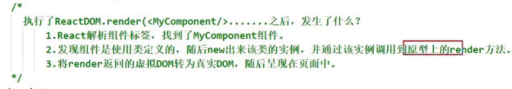

# 12 对state的理解

- 如果组件是有状态的，就是复杂组件


- 如果组件是无状态的，就是简单组件


- 什么是状态？

  - 人		状态	影响	行为
  - 组件	状态	驱动	页面	

- 组件的状态里面存着数据，数据的改变驱动着页面的展示


- 状态其实是组件实例对象身上的
- 最新版的react提出了一个新的东西：hooks

# 13 初始化state

```react
// new MyComponent这个动作是由react做的，不是我们自己new的
class MyComponent extends React.Component{
    // state是类的实例对象身上的，对类的实例对象做一些初始化操作，就要联想到constructor
    // props是什么？
    constructor (props) {
        // 如果a类继承了b类，且a类中写了构造器，那么a类构造器中的super是必须要调用的
        super(props);
        // 初始化状态
        this.state = {isHot:true};
    }
    
    render(){
        renturn <h2>今天天气很{this.state.isHot ? '炎热' : '凉爽'}</h2>
    }
}
ReactDOM.render(<MyComponent></MyComponent>, document.getElementById('test'));
```

# 14 React中的事件绑定

原生事件的绑定有几种方式：

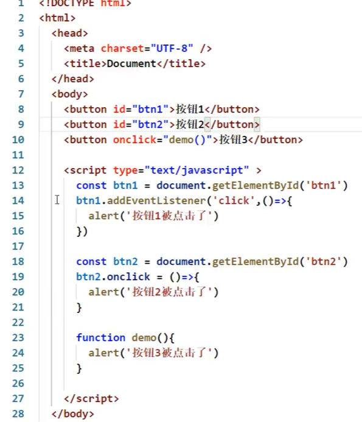

第一版：

```react
class MyComponent extends React.Component{
    constructor (props) {
        super(props);
        // 初始化状态
        this.state = {isHot:true};
    }
    
    render(){
        renturn <h2 onclick="demo()">今天天气很{this.state.isHot ? '炎热' : '凉爽'}</h2>
    }
}
ReactDOM.render(<MyComponent></MyComponent>, document.getElementById('test'));

function demo () {
    console.log('被点击了')
}

// 报错：
Invalid event handler property `onclick`. Did you mean `onClick`?
```

第二版：

```React
class MyComponent extends React.Component{
    constructor (props) {
        super(props);
        // 初始化状态
        this.state = {isHot:true};
    }
    
    render(){
        renturn <h2 onClick="demo()">今天天气很{this.state.isHot ? '炎热' : '凉爽'}</h2>
    }
}
ReactDOM.render(<MyComponent></MyComponent>, document.getElementById('test'));

function demo () {
    console.log('被点击了');
}

// 报错：
Expected `onClick` listener to be a function, instead got a value of `string` type.
```

第三版：

```react
class MyComponent extends React.Component{
    constructor (props) {
        super(props)
        // 初始化状态
        this.state = {isHot:true}
    }
    
    render(){
        renturn <h2 onClick={demo}>今天天气很{this.state.isHot ? '炎热' : '凉爽'}</h2>
    }
}
ReactDOM.render(<MyComponent></MyComponent>, document.getElementById('test'));

function demo () {
    console.log('被点击了')
}
```

# 15 类中方法中的this

第一版：不合理

babel禁止自定义函数的this指向window

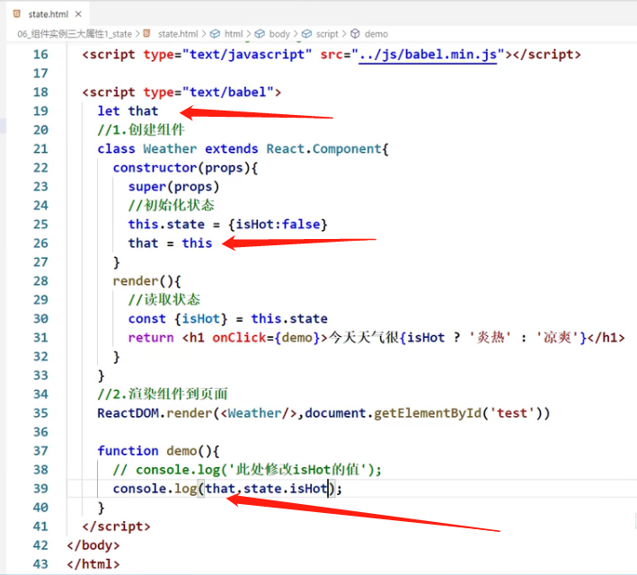

 第二版：报错：changeWeather is not defined.

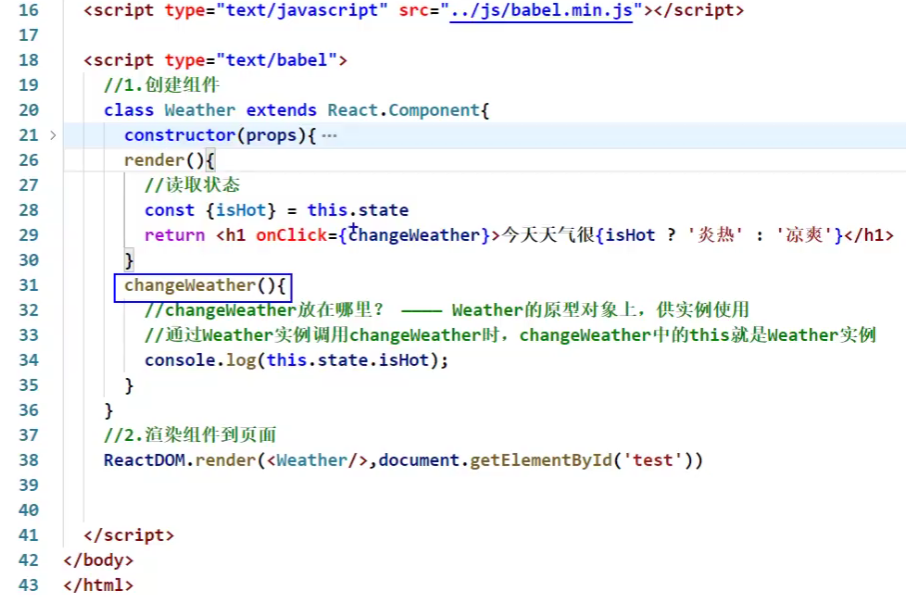

第三版：报错：Cannot read property 'state' of undefined

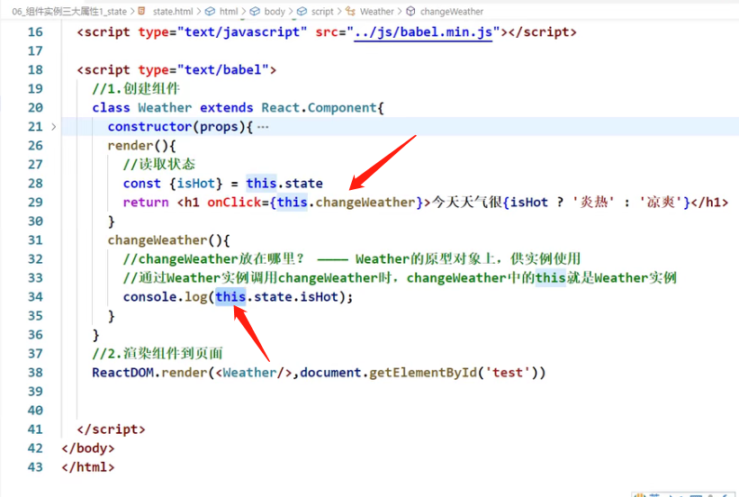

为什么changeWeather里面的this是undefined？它不是实例方法吗？为什么this会丢失？

* 只有通过Weather的实例对象调用changeWeather的时候，changeWeather中的this才是Weather实例
* 由于changeWeather是作为onClick的回调，所以不是通过实例调用的，是直接调用，而且由于**类中的方法默认开启了局部的严格模式**，所以changeWeather中的this为undefined

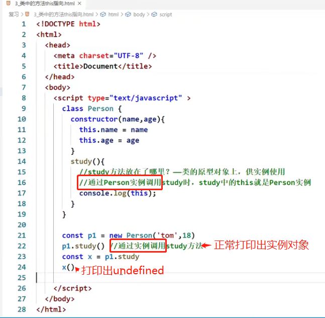

# 16 解决类中this指向问题

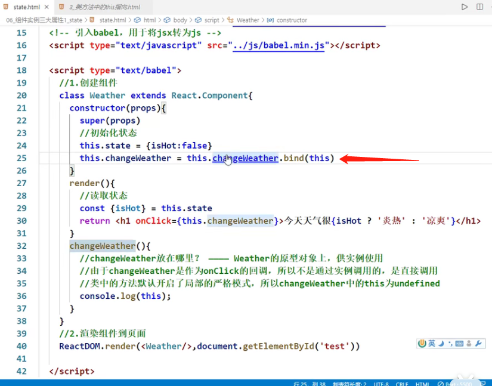

bind能做两件事

第一：生成一个新的函数

第二：改变this指向


第30行调用的changeWeather函数是**原型上**的还是**挂在实例自身身上**的？

* **挂在实例自身身上的**

# 17 setState的使用

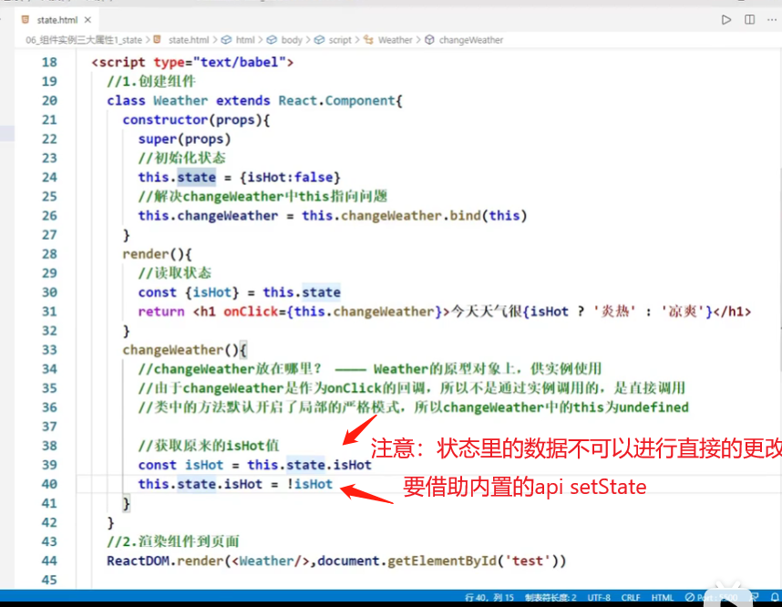

```react
this.setState({
	isHot: !isHot; // 替换还是合并？合并
})
```

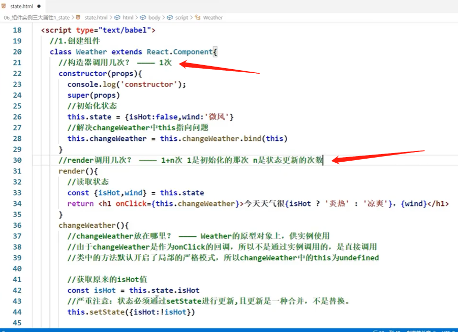

# 18 state的简写方式

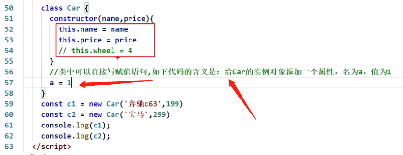

精简前：

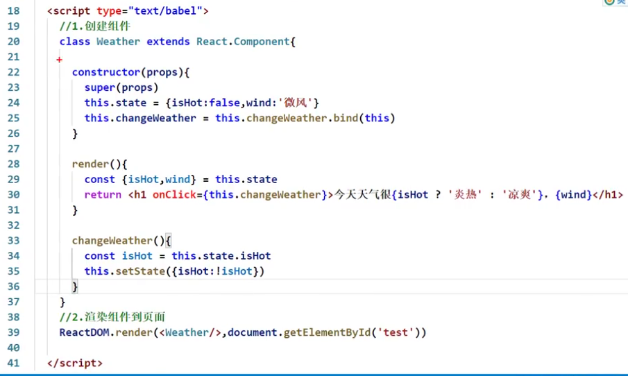

精简后：

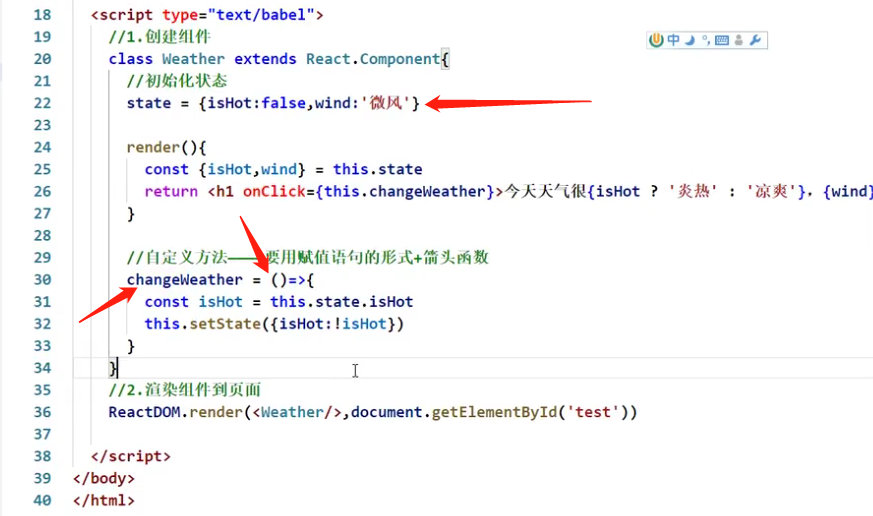


# 19 总结state


# 20 props的简单使用

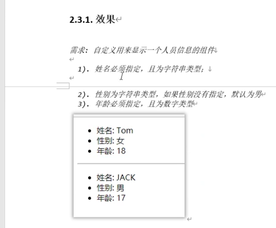

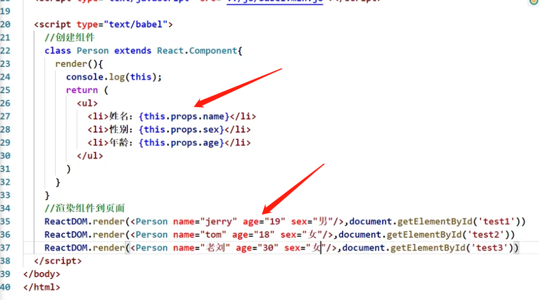


 


