https://www.bilibili.com/video/BV1wy4y1D7JT?p=28

# 21 批量传递props

即**批量传递标签属性**

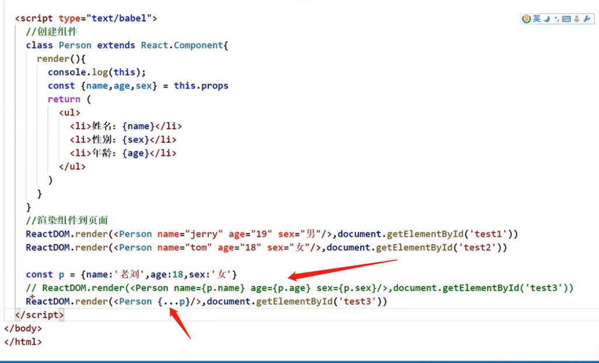

...展开运算符是不能展开对象的

babel + react后：...展开运算符就能展开对象

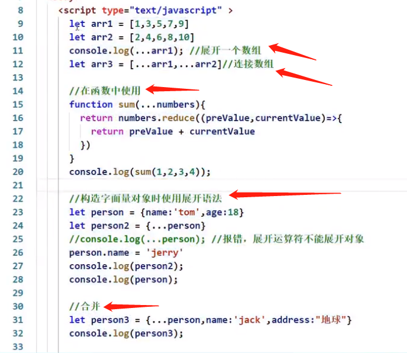

# 22 对props进行限制

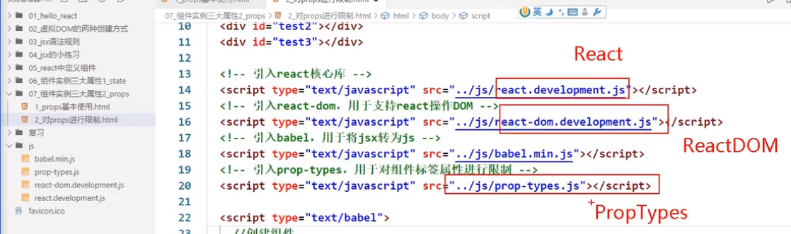

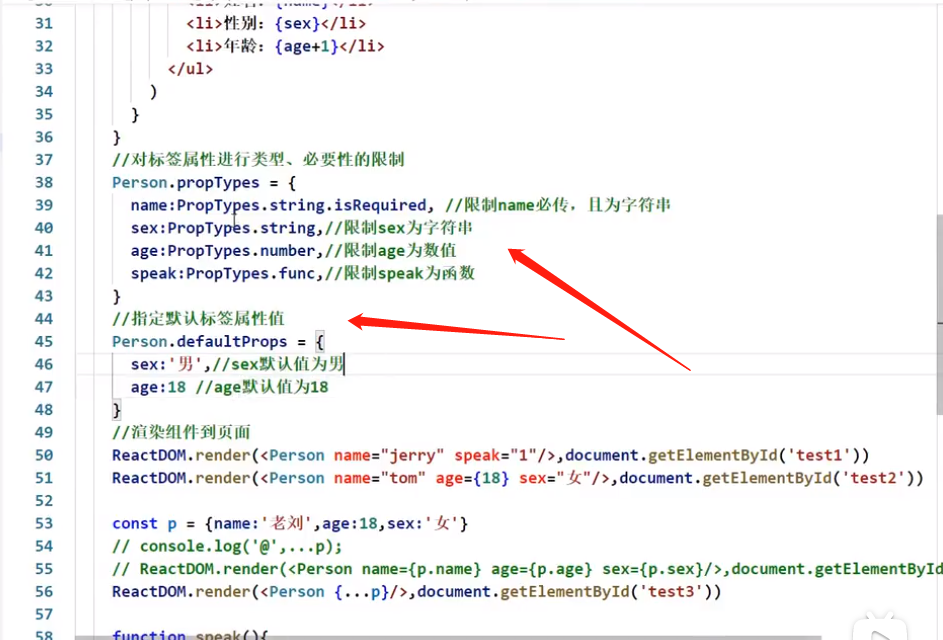

# 23 props的简写方式

props是只读的

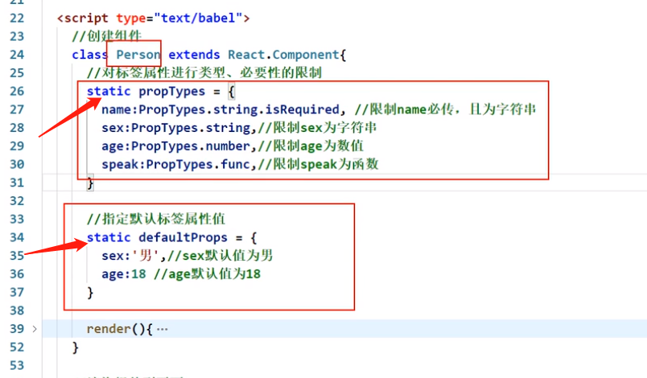

# 24 类式组件中的构造器与props

类中的构造器到底有什么作用？

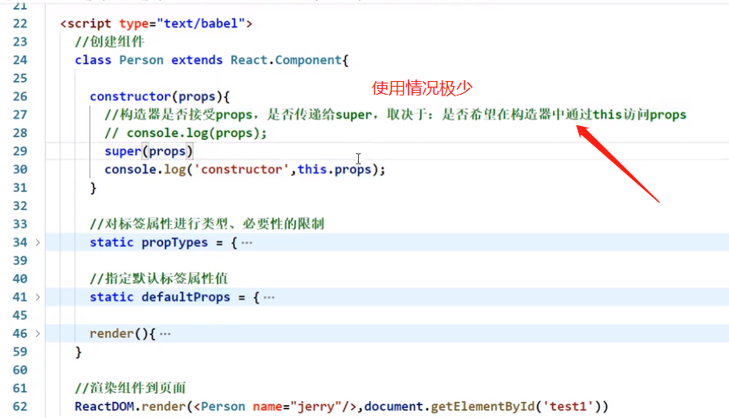

# 25 函数组件使用props

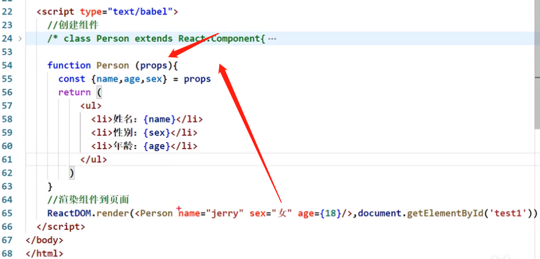

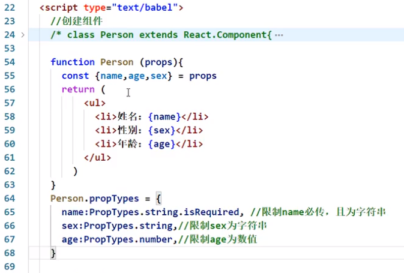

# 26

# 27 字符串形式的ref

**React官方不推荐使用字符串形式的ref**。为什么不推荐？https://zh-hans.reactjs.org/docs/refs-and-the-dom.html#gatsby-focus-wrapper

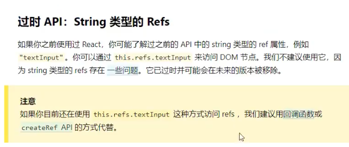

因为string类型的refs存在一些问题：写多了效率不高（为什么写多了效率不高？？）

https://github.com/facebook/react/pull/8333#issuecomment-271648615

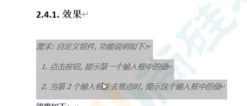

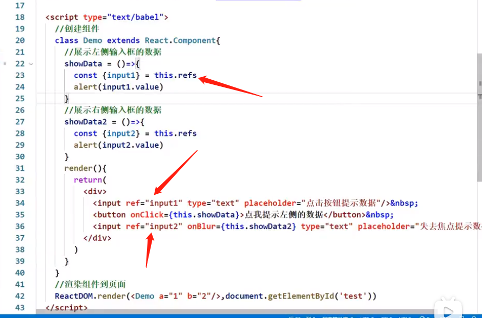

 为什么要有ref这种东西，感觉跟id的感觉一样？

* Refs and the DOM
* Refs转发
* 转发refs到DOM组件
* 在高阶组件中转发refs

# 28 回调形式的ref

你要写回调了，你得首先定义一个函数，所以说直接就在花括号里面去定义一个函数

34行：ref={() => {}}

里面的这个箭头函数是回调函数吗？

回调函数有三个特点：

1. 函数是由我们定义的
2. 但函数不是由我们调用的
3. 这函数最终执行了

里面的这个箭头函数是回调函数吗？——是

**这个箭头函数会接到参数吗？会接收到什么参数呢？**

* 回调函数能收到什么参数取决于回调函数的调用者！
* 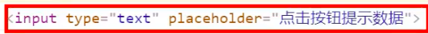
* 参数正好是ref这个属性所处的那个节点 input

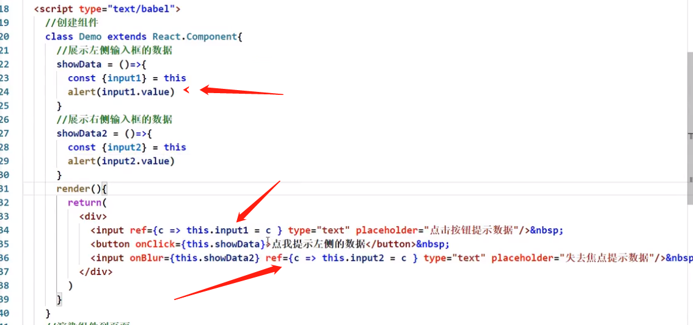

# 29 回调ref中调用次数的问题

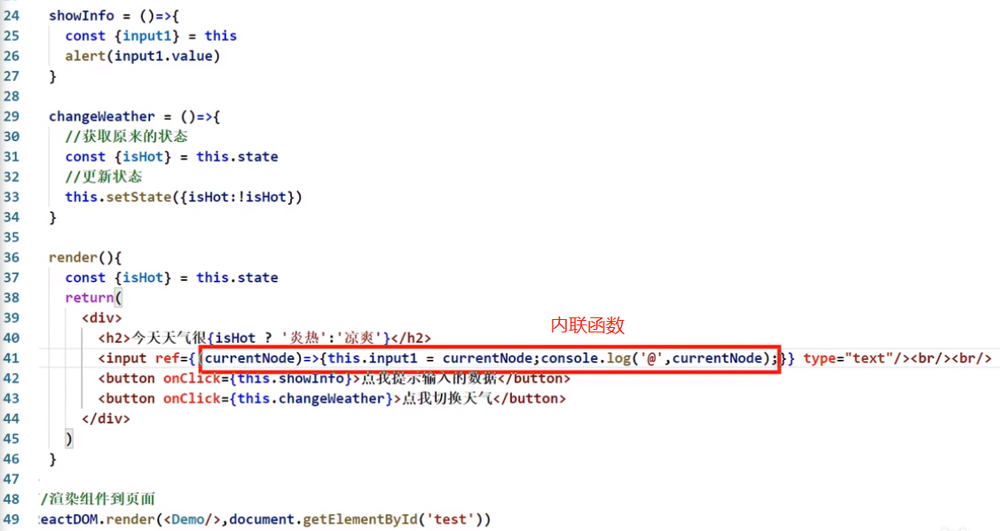

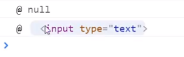

如果ref回调函数是以==内联函数==的方式定义的，在**==组件更新过程中==**它会被执行两次，第一次传入参数null，然后第二次传入参数DOM元素。

这是因为在每次渲染时会创建一个新的（不是之前的那个函数了，是一个新的函数了，之前的那个函数执行完了被释放了）函数实例（指41行的函数），所以说不确定之前那个函数做了一些什么动作，所以说为了保证这个东西能够完美的被清空，所以在组件更新的过程中，第一次调用传了一个null。

**==还是没懂为什么要清空，为什么第一次要传null，想不出那个场景==**

所以React清空旧的ref并且设置新的

通过将ref的回调函数**定义成class的绑定函数的方式**可以避免上述问题（**==读不懂==**）

什么叫==class的绑定函数==？？？（见下图）

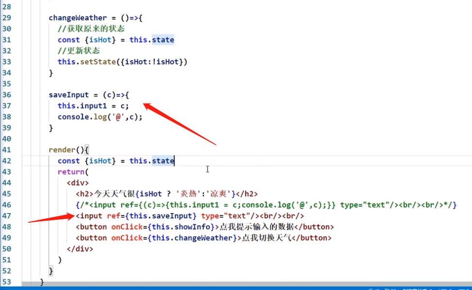

更改state中的数据，触发render函数的执行。无论怎么触发render函数的执行，也不会频繁的去调用saveInput，因为已经放在实例自身身上了。就算以后重新调用render，它也知道我身上有saveInput，我之前调过，==它不再是一个新的函数了==。

# 30 createRef的使用

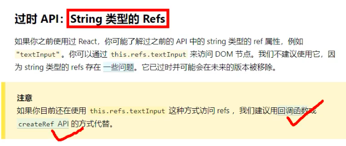

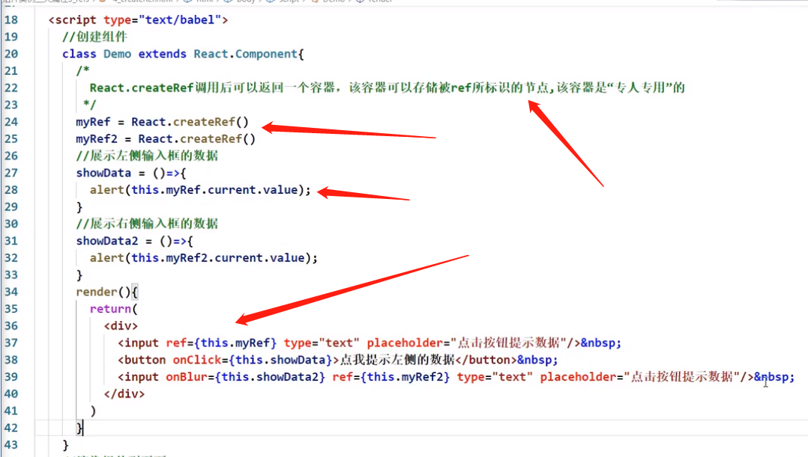

# refs相关技术分享

https://zh-hans.reactjs.org/docs/refs-and-the-dom.html#gatsby-focus-wrapper

1. refs是在创建类组件的时候从React.component中继承而来的

2. 在典型的 React 数据流中，[props](https://zh-hans.reactjs.org/docs/components-and-props.html) 是父组件与子组件交互的唯一方式。要修改一个子组件，你需要使用新的 props 来重新渲染它。但是，==在某些情况下，你需要在典型数据流之外强制修改子组件==。被修改的子组件可能是一个 React 组件的实例，也可能是一个 DOM 元素。对于这两种情况，React 都提供了解决办法

   1. ==在什么情况下需要在典型数据流之外强制修改子组件？==

3. 应用场景：

   1. 管理焦点，文本选择或媒体播放。==？==
   2. 触发强制动画。==？==
   3. 集成第三方 DOM 库。==？==

   在某些情况下（==什么具体的情况？==），我们会通过使用`refs`来更新组件，但这种方式并不推荐，更多情况我们是通过`props`与`state`的方式进行去重新渲染子元素

4. 我们在日常写React代码的时候，一般情况是用不到Refs这个东西，因为我们并不直接操作底层DOM元素，而是在render函数里去编写我们的页面结构，由React来组织DOM元素的更新。

   凡事总有例外，总会有一些很奇葩的时候我们需要直接去操作页面的真实DOM，这就要求我们有直接访问真实DOM的能力，而Refs就是为我们提供了这样的能力。也就是React无法控制局面的时候，就需要直接操作Refs了。

5. ### 将 DOM Refs 暴露给父组件

   在极少数情况下（==什么情况？==），你可能希望在父组件中引用子节点的 DOM 节点

   通常不建议这样做，因为它会打破组件的封装

   但它偶尔可用于触发焦点或测量子 DOM 节点的大小或位置（==？？？？==）

   虽然你可以[向子组件添加 ref](https://zh-hans.reactjs.org/docs/refs-and-the-dom.html#adding-a-ref-to-a-class-component)，但这不是一个理想的解决方案，因为你只能获取组件实例而不是 DOM 节点。并且，它还在函数组件上无效

6. 如果你使用 16.3 或更高版本的 React, 这种情况下我们推荐使用 [ref 转发](https://zh-hans.reactjs.org/docs/forwarding-refs.html)。**Ref 转发使组件可以像暴露自己的 ref 一样暴露子组件的 ref**。关于怎样对父组件暴露子组件的 DOM 节点，在 [ref 转发文档](https://zh-hans.reactjs.org/docs/forwarding-refs.html#forwarding-refs-to-dom-components)中有一个详细的例子

7. ref转发：https://zh-hans.reactjs.org/docs/forwarding-refs.html

8. 如何传递refs：https://www.bilibili.com/video/BV1kt411p7De?from=search&seid=8754523972667526849&spm_id_from=333.337.0.0

# 扩展：高阶组件

https://www.bilibili.com/video/BV1Ut411p7Ne/?spm_id_from=333.788.recommend_more_video.-1

https://zh-hans.reactjs.org/docs/higher-order-components.html#gatsby-focus-wrapper

