https://www.bilibili.com/video/BV13A411v7co/?spm_id_from=333.337.search-card.all.click&vd_source=a7089a0e007e4167b4a61ef53acc6f7e（这个视频有点啰嗦）

# 1. 什么情况下使用vuex/redux

#  2. react-redux Provider

| 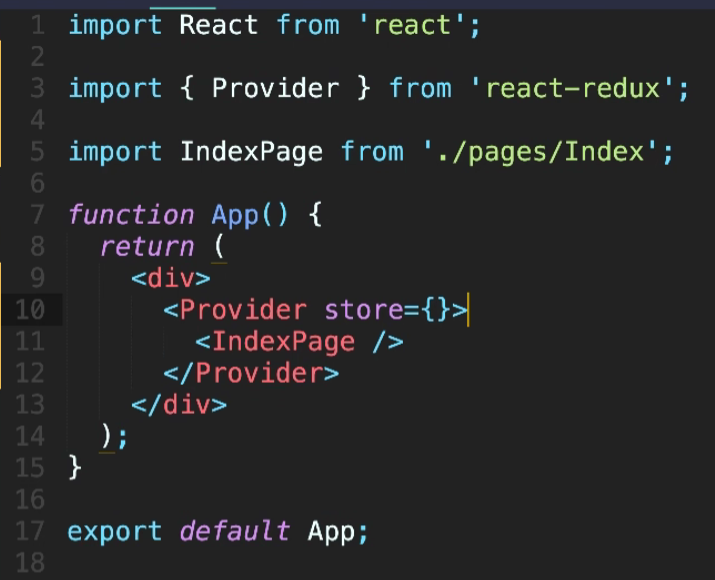 | 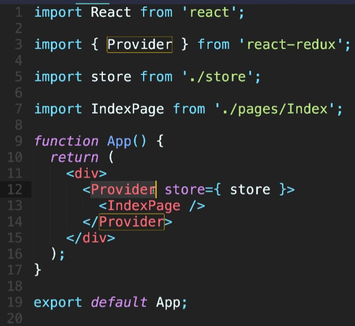 |
| ------------------------------------------------------------ | ------------------------------------------------------------ |
| 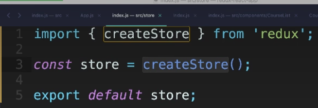 | 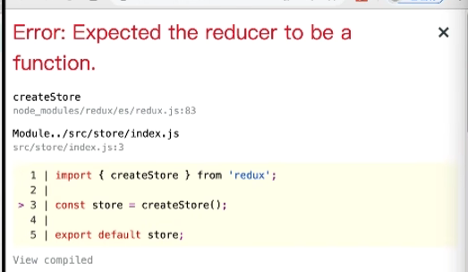 |

# 3. reducer是什么


为了职责清晰，Redux代码被分为三个核心的概念，学redux，其实就是学这三个核心概念之间的配合：

1. **state**:  一个对象 存放着我们管理的数据
2. **action**:  一个对象 用来描述你想怎么改数据
3. **reducer**:  一个函数 根据action的描述更新state

# 4. reducer为什么叫做reducer

Redux 中的 reducer 命名为 reducer 是因为它源于函数式编程中的 `reduce` 函数。`reduce` 函数是一种高阶函数，用于累积或归纳集合中的值，最终生成一个结果。Redux 中的 reducer 具有类似的功能，它接收当前的状态和一个 action，返回一个新的状态。这个过程就像 `reduce` 函数累积值一样，reducer 累积状态变化。

具体来说，Redux 中的 reducer 函数签名通常如下：

```javascript
function reducer(state, action) {
    // 根据 action 类型和 payload 处理 state 并返回新的 state
}
```

这个函数接收两个参数：
1. `state`：当前的应用状态。
2. `action`：一个描述状态变化的对象，通常包含一个 `type` 字段和一个 `payload` 字段。

reducer 函数通过检查 action 的类型，决定如何更新状态并返回新的状态。这个过程类似于 `Array.prototype.reduce` 中的回调函数，它接收累积器和当前值，并返回新的累积结果。

例如，在 JavaScript 中的 `reduce` 函数可以这样使用：

```javascript
const numbers = [1, 2, 3, 4];
const sum = numbers.reduce((accumulator, currentValue) => accumulator + currentValue, 0);
console.log(sum); // 输出 10
```

在这个例子中，`reduce` 函数通过一个回调函数累积数组中的值，并最终返回总和。Redux 中的 reducer 也是通过一个函数累积状态变化，并最终返回新的状态。这种命名方式使得开发者能够直观地理解 reducer 的作用和工作原理。

1h17min处

# [1. 数据传递的概念和核心思想](https://www.bilibili.com/video/BV1La4y1S7qY?p=1&vd_source=a7089a0e007e4167b4a61ef53acc6f7e)

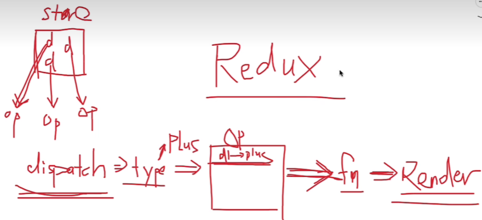

# [2. 用普通思想和方法完成案例](https://www.bilibili.com/video/BV1La4y1S7qY?p=2&vd_source=a7089a0e007e4167b4a61ef53acc6f7e)

| 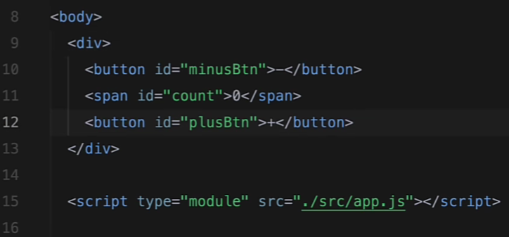 | 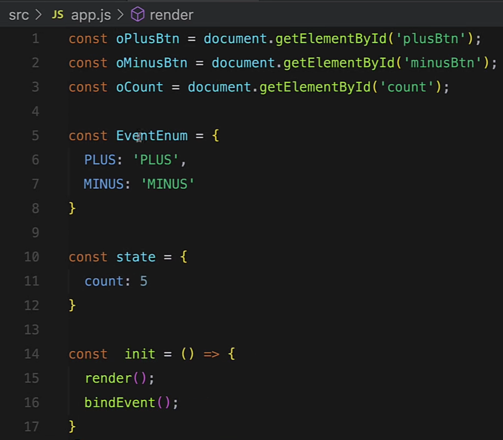 |
| ------------------------------------------------------------ | ------------------------------------------------------------ |
| 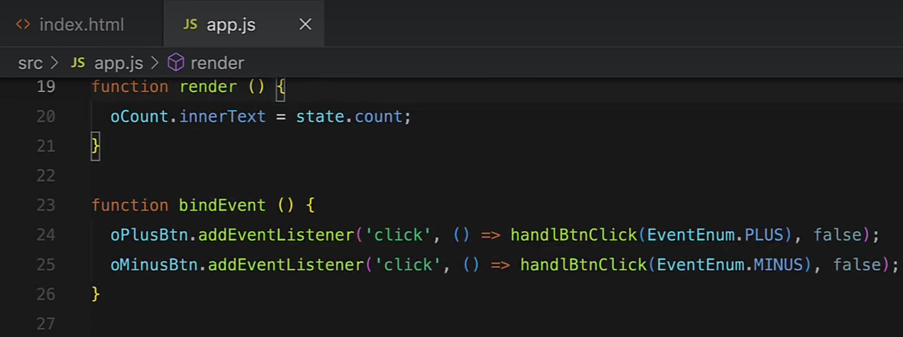 | 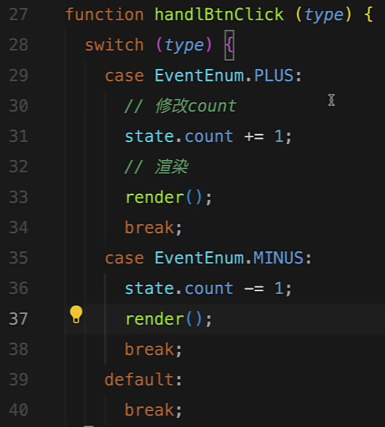 |

问题分析：

- handleBtnClick 完成了两个任务：修改 && render。而这两个任务实际上是没有相关性的
- 希望handleBtnClick仅仅是修改数据，修改数据后去触发一次render

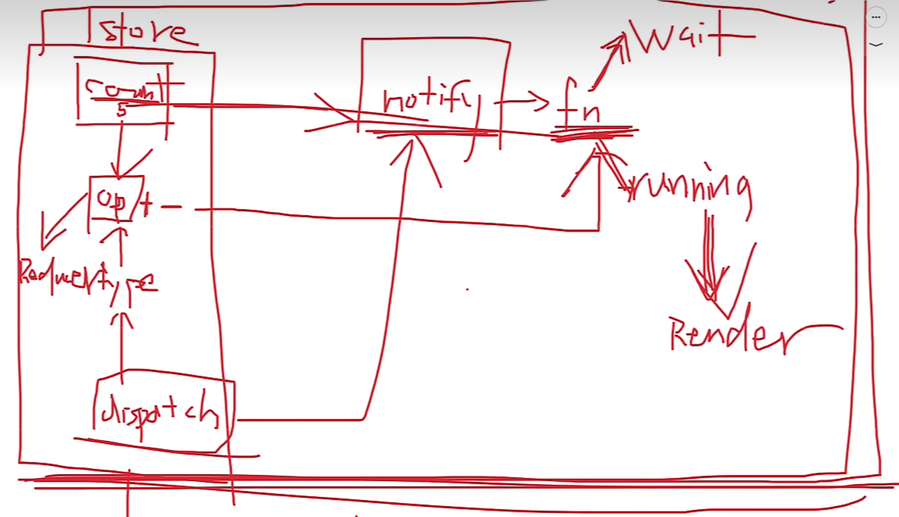

# [3. 用redux的思想和方案完成案例](https://www.bilibili.com/video/BV1La4y1S7qY/?p=3&spm_id_from=pageDriver&vd_source=a7089a0e007e4167b4a61ef53acc6f7e)

1. 需要一个store，存放state

| 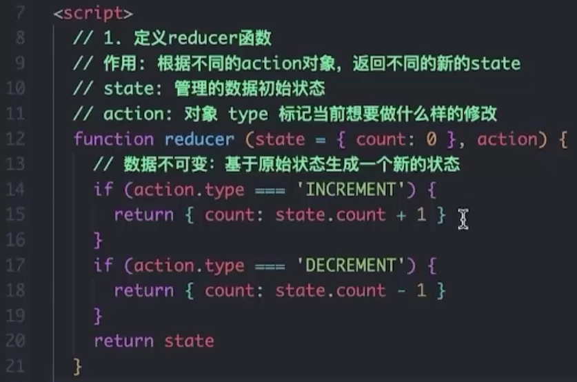 | 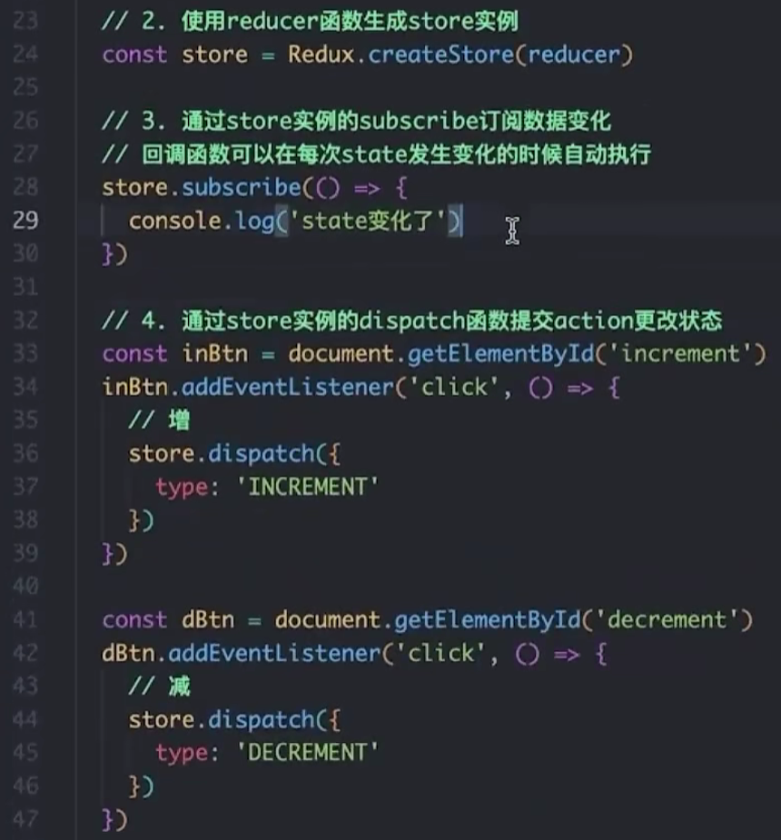 |
| ------------------------------------------------------------ | ------------------------------------------------------------ |

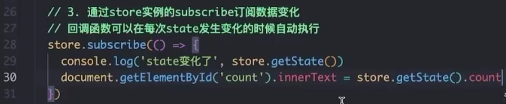

# Redux

Redux 是一个用于管理 JavaScript 应用状态的库，主要与 React 配合使用，但也可以与其他库或框架结合。Redux 的设计旨在简化复杂应用中的状态管理，提供可预测的状态管理和调试能力。下面是对 Redux 的详细分析：

### 核心概念

1. **Store（存储）**
   - **定义**: Redux 应用只有一个 store，它是一个 JavaScript 对象，用于存储整个应用的状态。
   - **功能**: 提供一个集中式的状态管理点，保证应用中的状态可以被所有组件访问。
2. **Action（动作）**
   - **定义**: 描述发生了什么的普通 JavaScript 对象。它们是改变应用状态的唯一来源。
   - **结构**: 一个 action 至少要有一个 `type` 字段，用来表示发生了什么事件，通常还会包含其他数据（payload）。
3. **Reducer（简化器）**
   - **定义**: 一个纯函数，接收当前的状态和一个 action，返回一个新的状态。
   - **功能**: Reducer 用于处理 state 的更新逻辑。它将旧的状态和 action 合并，产生新的状态。
4. **Dispatch（分发）**
   - **定义**: 用于发送 action 的方法。
   - **功能**: 通过调用 `store.dispatch(action)`，可以触发 reducer 执行，更新状态。
5. **Selector（选择器）**
   - **定义**: 从 store 中提取和计算数据的函数。
   - **功能**: 提供了一种从状态中提取数据的标准化方式。


### 工作流程

1. **创建 Store**: 使用 `createStore(reducer)` 创建一个 store，传入一个 reducer 函数。
   
2. **Dispatch Action**: 使用 `store.dispatch(action)` 发送 action，通知 store 有状态需要更新。

3. **Reducer 处理 Action**: store 内部调用 reducer，根据 action 的类型决定如何更新状态。

4. **更新 State**: Reducer 返回新的状态，store 更新其内部状态。

5. **通知组件**: 如果使用 React-Redux，组件会通过 `connect` 函数自动接收到新的状态和更新。

### 使用示例

```javascript
import { createStore } from 'redux';

// 定义初始状态
const initialState = {
  count: 0
};

// 定义 reducer
function counterReducer(state = initialState, action) {
  switch (action.type) {
    case 'INCREMENT':
      return { count: state.count + 1 };
    case 'DECREMENT':
      return { count: state.count - 1 };
    default:
      return state;
  }
}

// 创建 store
const store = createStore(counterReducer);

// 订阅 store 变化
store.subscribe(() => console.log(store.getState()));

// 分发 actions
store.dispatch({ type: 'INCREMENT' });
store.dispatch({ type: 'INCREMENT' });
store.dispatch({ type: 'DECREMENT' });
```

### 中间件

Redux 中间件是一种扩展 Redux 功能的方式。它可以在 action 被 dispatch 后，reducer 处理前执行。常用中间件包括：

- **Redux Thunk**: 允许 action 创建函数返回一个函数，而不是一个 action 对象。这对于处理异步操作非常有用。
- **Redux Saga**: 用于处理副作用的中间件，通过生成器函数控制异步流程。

### 优缺点

**优点:**

- **可预测性**: 单一的 store 和纯函数 reducer 确保状态更新的可预测性。
- **调试能力**: Redux DevTools 提供强大的调试功能。
- **中间件支持**: 可以轻松集成异步操作和其他功能。

**缺点:**

- **样板代码**: 需要编写较多的样板代码，如 actions、reducers 和 types。
- **学习曲线**: 对新手来说，理解 Redux 的概念和最佳实践可能需要时间。

Redux 适用于需要复杂状态管理和调试的应用，但对于简单应用来说，可能会觉得过于复杂。
