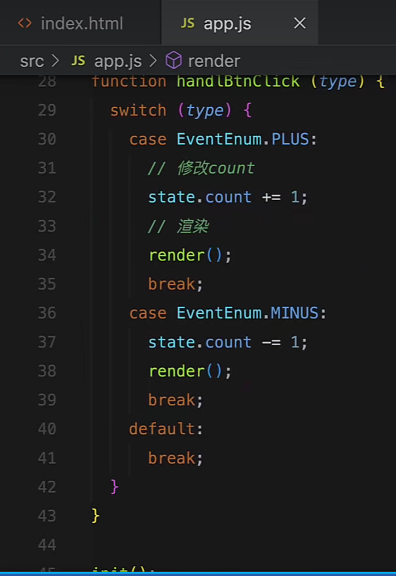

https://www.bilibili.com/video/BV13A411v7co/?spm_id_from=333.337.search-card.all.click&vd_source=a7089a0e007e4167b4a61ef53acc6f7e

# 1. 什么情况下使用vuex/redux?

#  2. react-redux Provider

|  |  |
| ------------------------------------------------------------ | ------------------------------------------------------------ |
|  |  |

# 3. reducer到底是个啥啊？


为了职责清晰，Redux代码被分为三个核心的概念，我们学redux，其实就是学这三个核心概念之间的配合，三个概念分别是:

1. **state**:  一个对象 存放着我们管理的数据
2. **action**:  一个对象 用来描述你想怎么改数据
3. **reducer**:  ==一个函数 根据action的描述更新state==

# 4. reducer为什么叫做reducer？

Redux 中的 reducer 命名为 reducer 是因为它源于函数式编程中的 `reduce` 函数。`reduce` 函数是一种高阶函数，用于累积或归纳集合中的值，最终生成一个结果。Redux 中的 reducer 具有类似的功能，它接收当前的状态和一个 action，返回一个新的状态。这个过程就像 `reduce` 函数累积值一样，reducer 累积状态变化。

具体来说，Redux 中的 reducer 函数签名通常如下：

```javascript
function reducer(state, action) {
    // 根据 action 类型和 payload 处理 state 并返回新的 state
}
```

这个函数接收两个参数：
1. `state`：当前的应用状态。
2. `action`：一个描述状态变化的对象，通常包含一个 `type` 字段和一个 `payload` 字段。

reducer 函数通过检查 action 的类型，决定如何更新状态并返回新的状态。这个过程类似于 `Array.prototype.reduce` 中的回调函数，它接收累积器和当前值，并返回新的累积结果。

例如，在 JavaScript 中的 `reduce` 函数可以这样使用：

```javascript
const numbers = [1, 2, 3, 4];
const sum = numbers.reduce((accumulator, currentValue) => accumulator + currentValue, 0);
console.log(sum); // 输出 10
```

在这个例子中，`reduce` 函数通过一个回调函数累积数组中的值，并最终返回总和。Redux 中的 reducer 也是通过一个函数累积状态变化，并最终返回新的状态。这种命名方式使得开发者能够直观地理解 reducer 的作用和工作原理。

1h17min处

# ——————————————————————————————————————————————————————————————————————————

https://www.bilibili.com/video/BV1La4y1S7qY?p=2&vd_source=a7089a0e007e4167b4a61ef53acc6f7e

# 2.用普通思想和方法完成案例


|  |  |
| ------------------------------------------------------------ | ------------------------------------------------------------ |
|  |  |

# 3.用redux的思想和方案完成案例 ！！！

1.需要一个store，存放state

2.

|  |  |
| ------------------------------------------------------------ | ------------------------------------------------------------ |
|  |                                                              |

