https://www.bilibili.com/video/BV1wy4y1D7JT?p=32&spm_id_from=pageDriver

# 31总结ref

# 32 react中的事件处理

https://www.bilibili.com/video/BV1wy4y1D7JT/?p=32&spm_id_from=pageDriver&vd_source=a7089a0e007e4167b4a61ef53acc6f7e

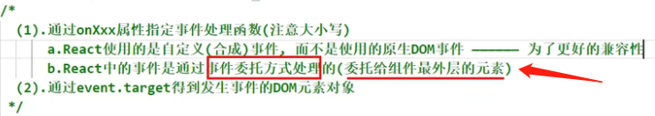

**给button加的onClick，给input加的onBlur，其实react在工作的时候把这些事件都加给了最外侧的div**

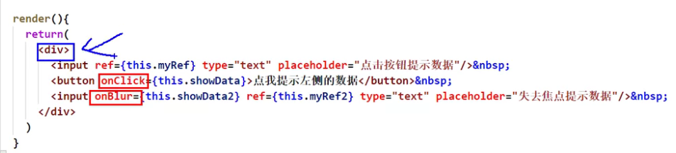

为什么要这样做呢？

- **事件委托的原理——事件冒泡** 为了高效

**event.target:  当发生事件的元素正好是要操作的元素，就可以省略ref**

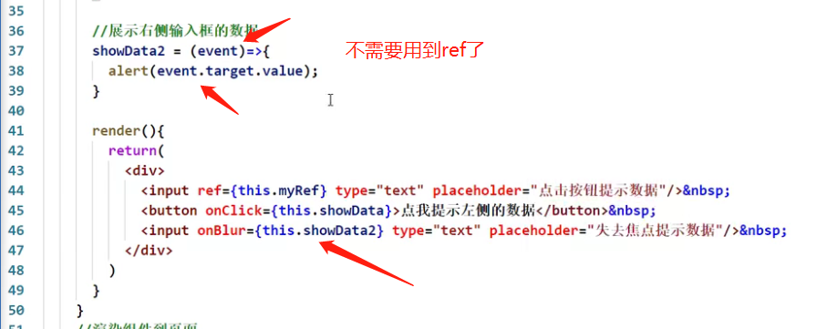

# 33 非受控组件

https://www.bilibili.com/video/BV1wy4y1D7JT/?p=33&spm_id_from=pageDriver&vd_source=a7089a0e007e4167b4a61ef53acc6f7e

页面中所有输入类的dom是**现用现取**

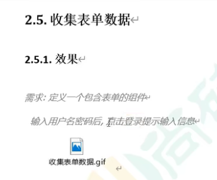

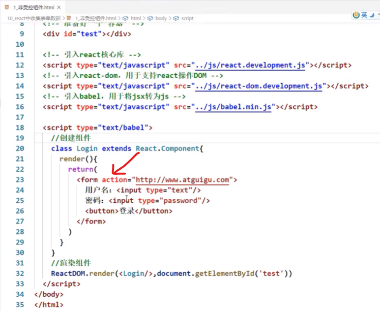

如果不指定请求方式，form表单发出去的请求默认是get请求，而且默认带的参数是query参数

ajax最大的优势就是**页面无刷新获取数据**

表单提交默认引起页面的跳转，如何阻止跳转呢？

* 不配地址，即action不赋值（没有解决问题）
* **表单提交是一个默认的动作**，所以利用原生的阻止默认事件就可以阻止跳转了

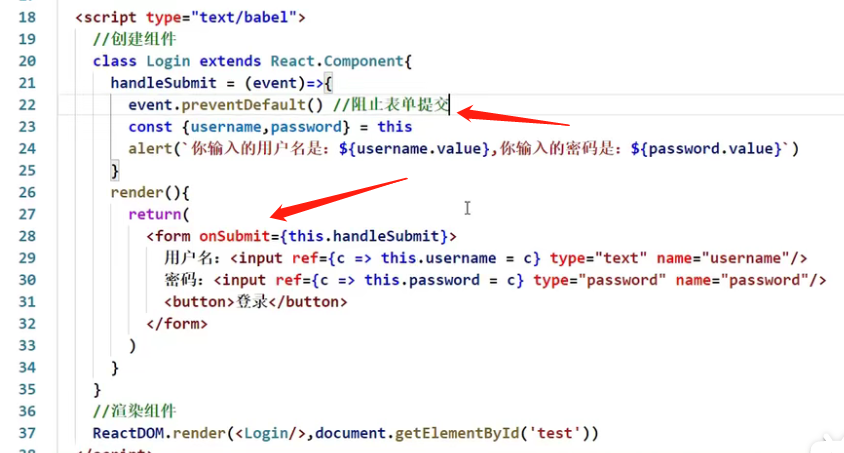

# 34 受控组件

https://www.bilibili.com/video/BV1wy4y1D7JT/?p=34&spm_id_from=pageDriver&vd_source=a7089a0e007e4167b4a61ef53acc6f7e

受控组件是受到了谁的控制？

页面中所有输入类的dom，随着输入可以把值维护到状态里面去，需要用的时候直接从状态里面取出来

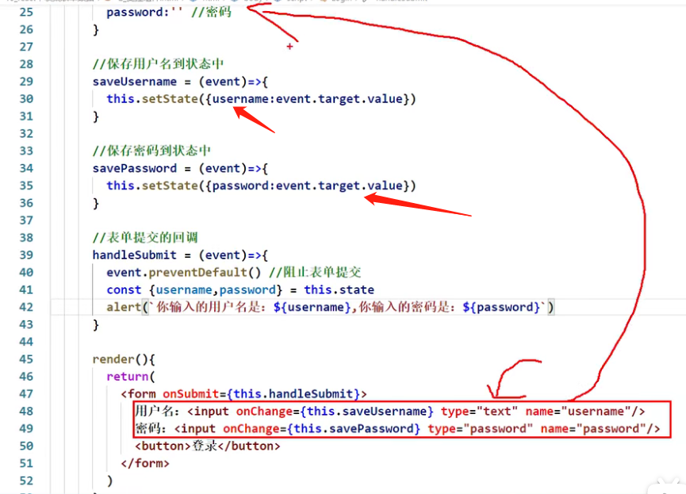

# 35 高阶函数_函数柯里化！！！

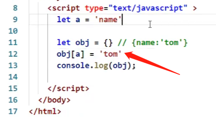

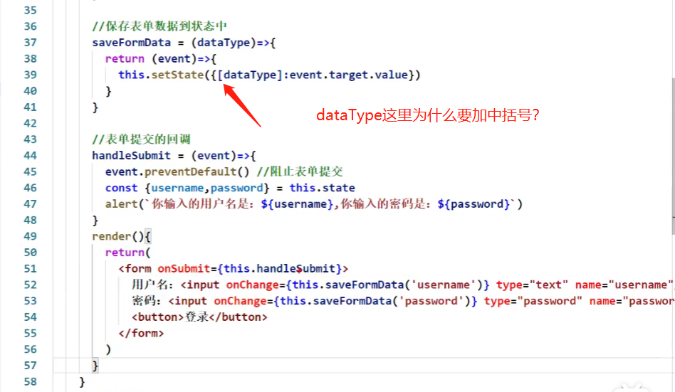

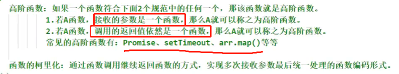

演示函数的柯里化：

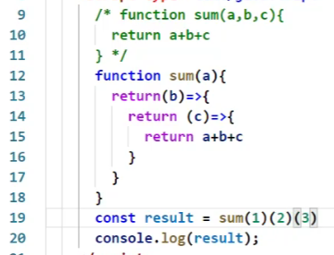

# 36 不用柯里化的写法！！！

https://www.bilibili.com/video/BV1wy4y1D7JT/?p=36&spm_id_from=pageDriver&vd_source=a7089a0e007e4167b4a61ef53acc6f7e

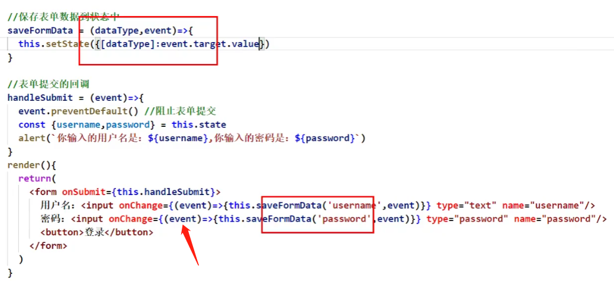

# 37 引出生命周期

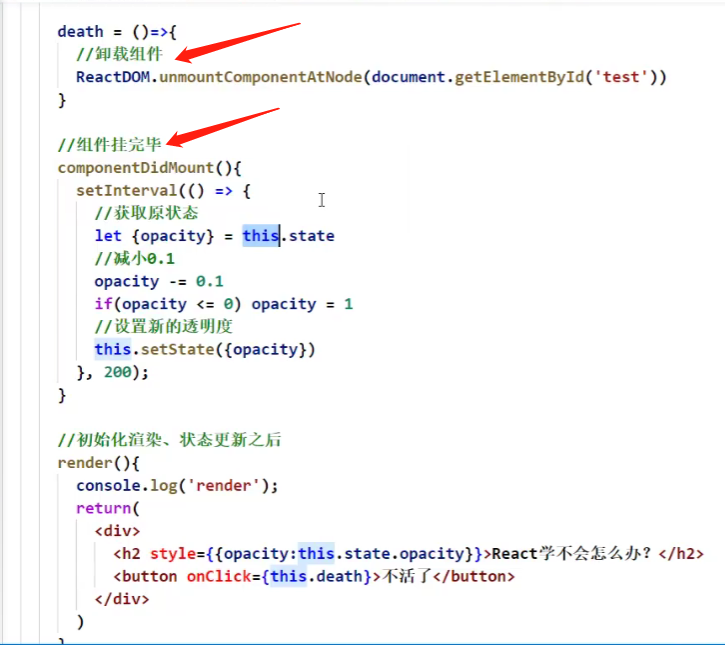

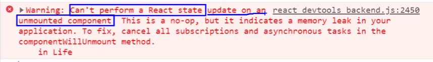

解法1:

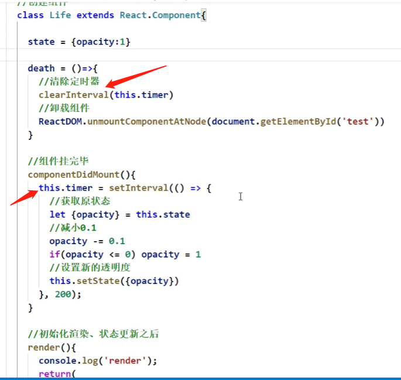

解法2：

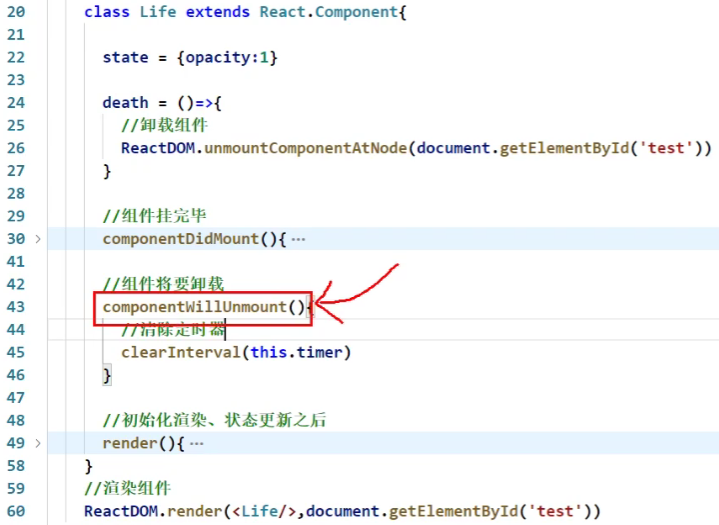

# 38 生命周期_组件挂载流程

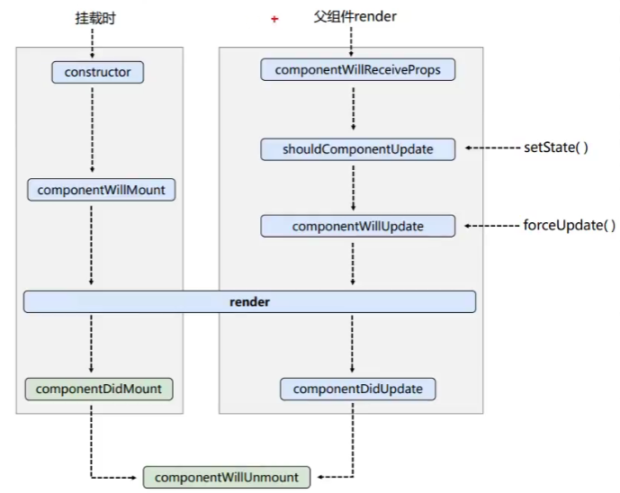

# 39 生命周期_setState流程

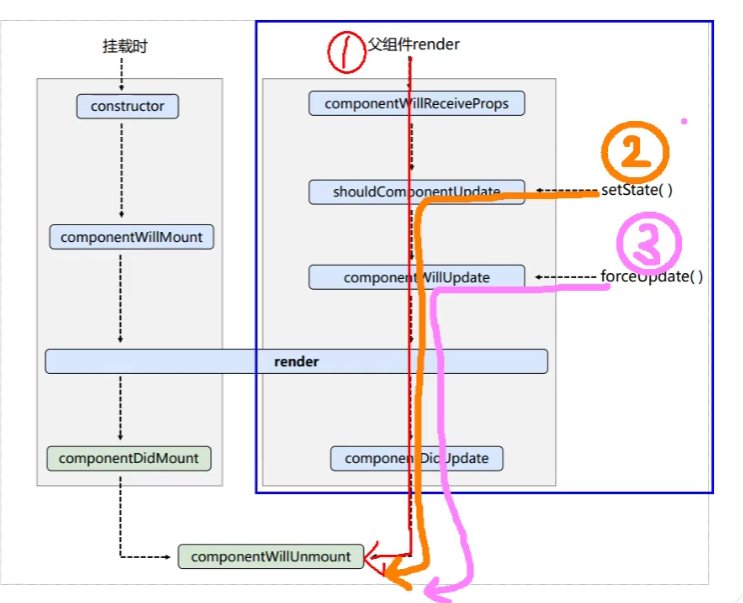

# 40 生命周期_forceUpdate流程

