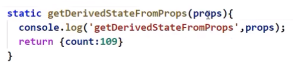

https://www.bilibili.com/video/BV1wy4y1D7JT?p=43

# 41 生命周期(旧)——父组件render流程

父组件一旦重新render，子组件就会响应**componentWillReceiveProps**钩子

# 42 总结生命周期（旧）

# 43 对比新旧生命周期

https://www.bilibili.com/video/BV1wy4y1D7JT/?p=43&vd_source=a7089a0e007e4167b4a61ef53acc6f7e

在新版react中使用旧版react中的生命周期钩子：

* componentWillMount -->UNSAFE_componentWillMount

* componentWillReceiveProps -->UNSAFE_componentWillReceiveProps 

* componentWillUpdate-->UNSAFE_componentWillUpdate

**为什么要加UNSAFE？**

# 44 getDerivedStateFromProps

https://www.bilibili.com/video/BV1wy4y1D7JT/?p=44&spm_id_from=pageDriver&vd_source=a7089a0e007e4167b4a61ef53acc6f7e

设计getDerivedStateFromProps有什么用？

# 45 getSnapshotBeforeUpdate

https://www.bilibili.com/video/BV1wy4y1D7JT/?p=45&spm_id_from=pageDriver&vd_source=a7089a0e007e4167b4a61ef53acc6f7e

在更新之前获取快照

- 在更新之前获取谁的快照？
- 这个快照获取完了之后有什么用呢？

- 这个返回的快照值交给谁了？ 

  

  

# 46 getSnapshotBeforeUpdate举例

# 47 总结生命周期（新）

# 48 DOM的diffing算法

**上面add有一个非常严重的效率问题**

# 49 初始化react脚手架

脚手架是用什么搭的？——webpack

# 50 脚手架文件介绍_public

  public里面一般存静态文件：页面 样式 图片

