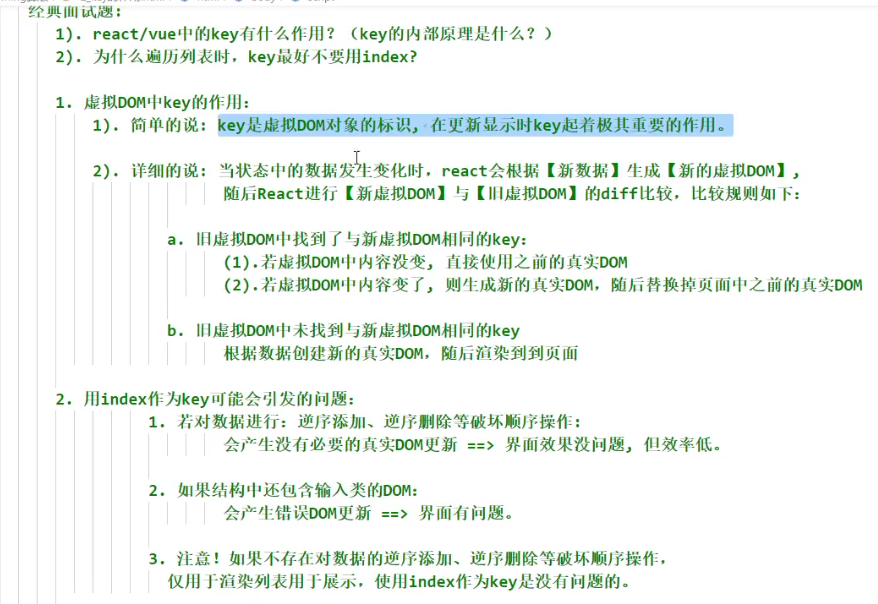
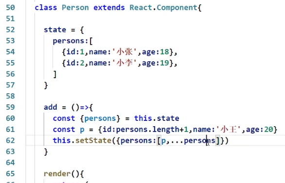
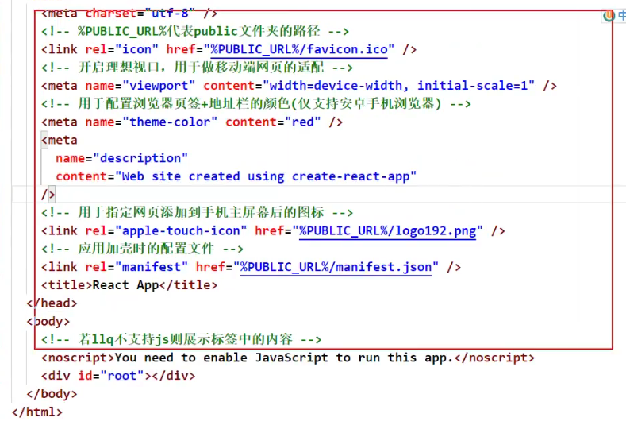

https://www.bilibili.com/video/BV1wy4y1D7JT?p=43

# 41 生命周期(旧)——父组件render流程

**父组件render是个什么？？？**

父组件一旦重新render，子组件就会响应componentWillReceiveProps钩子

# 42 总结生命周期（旧）

# 43 对比新旧生命周期

在新版react中使用旧版react中的生命周期钩子：

* componentWillMount -->UNSAFE_componentWillMount

* componentWillReceiveProps -->UNSAFE_componentWillReceiveProps 

* componentWillUpdate-->UNSAFE_componentWillUpdate

  

**为什么要加UNSAFE？**

# 44 getDerivedStateFromProps

# 45 getSnapshotBeforeUpdate

# 46 getSnapshotBeforeUpdate举例

# 47 总结生命周期（新）

# 48 DOM的diffing算法

**上面add有一个非常严重的效率问题**

# 49 初始化react脚手架

脚手架是用什么搭的？——webpack

# 50 脚手架文件介绍_public

  public里面一般存静态文件：页面 样式 图片

