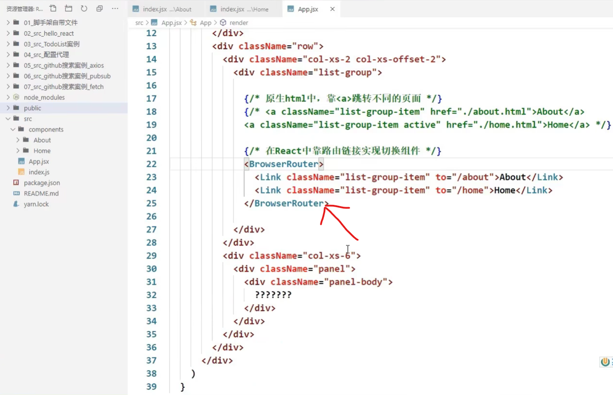
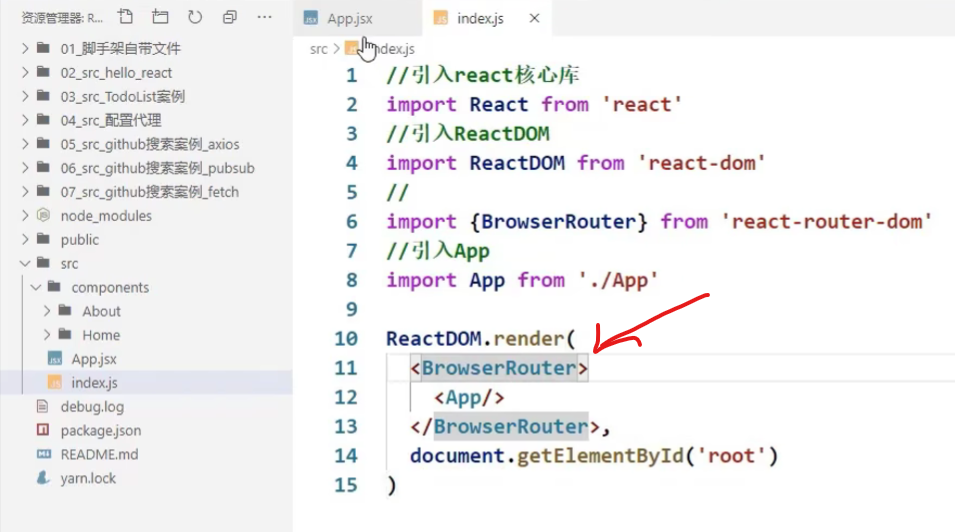
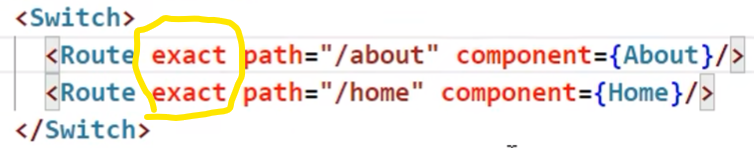
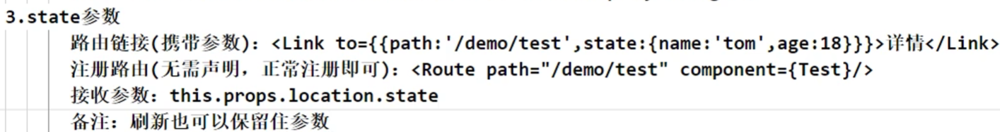
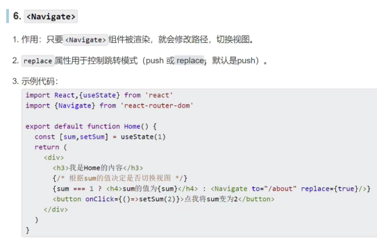

# 1. react-router-dom怎么实现页面跳转且不能回退

在 `react-router-dom` 中实现页面跳转且不能回退，可以通过以下几种方式来实现：

### 1. 使用 `history.replace`

`history.replace` 方法可以在不添加新历史记录的情况下替换当前页面的 URL，并导航到新页面。这样用户就不能通过浏览器的后退按钮回到前一个页面。

#### 示例：

```javascript
import { useHistory } from 'react-router-dom';

function MyComponent() {
  const history = useHistory();

  const handleClick = () => {
    // 替换当前页面的 URL，并导航到 /new-page
    history.replace('/new-page');
  };

  return (
    <button onClick={handleClick}>Go to New Page (no back)</button>
  );
}
```

### 2. 使用 `Redirect` 组件

在需要执行页面跳转时，可以使用 `Redirect` 组件来渲染一个新的页面，并使用 `push` 属性设置为 `false`，确保替换而不是推入新的历史记录。

#### 示例：

```javascript
import React from 'react';
import { Redirect } from 'react-router-dom';

function MyComponent() {
  // 当条件满足时，执行重定向
  if (condition) {
    return <Redirect to="/new-page" push={false} />;
  }

  return (
    <div>
      {/* 其他内容 */}
    </div>
  );
}
```

### 3. 使用 `useNavigate` 钩子（React Router v6）

在 React Router 版本 6 中，可以使用 `useNavigate` 钩子来进行导航，通过 `replace` 方法来替换当前页面的 URL，从而实现不可回退的效果。

#### 示例：

```javascript
import { useNavigate } from 'react-router-dom';

function MyComponent() {
  const navigate = useNavigate();

  const handleClick = () => {
    // 替换当前页面的 URL，并导航到 /new-page
    navigate('/new-page', { replace: true });
  };

  return (
    <button onClick={handleClick}>Go to New Page (no back)</button>
  );
}
```

### 注意事项

- 在使用以上方法时，请确保理解其影响。页面不可回退可能会影响用户体验，因此应谨慎使用。
- 使用 `replace` 或 `Redirect` 组件时，页面不会添加新的历史记录，因此用户不能通过浏览器的后退按钮回到前一个页面。
- 在不需要控制页面历史记录的特殊情况下，可以考虑使用这些方法来实现特定的页面导航需求。

通过上述方法，你可以在 `react-router-dom` 中实现页面跳转并确保页面不可回退的效果。

# 2. React Router 5.x

## [75 对路由的理解](https://www.bilibili.com/video/BV1wy4y1D7JT?p=75&spm_id_from=pageDriver&vd_source=a7089a0e007e4167b4a61ef53acc6f7e)


浏览器的路径怎么变成/test呢？

## [76 前端路由原理](https://www.bilibili.com/video/BV1wy4y1D7JT?p=76&spm_id_from=pageDriver&vd_source=a7089a0e007e4167b4a61ef53acc6f7e)

**前端路由依赖浏览器的历史记录history**

|  |  |
| :----------------------------------------------------------: | ------------------------------------------------------------ |

浏览器的历史记录是一个栈的结构


前端路由在单页面应用程序（SPA）中起着关键作用。它使用户在浏览器中导航不同页面时，不需要向服务器发送新的HTTP请求，而是通过JavaScript在客户端更新视图。以下是前端路由不会向后端发送请求的原理：

### 核心原理

#### 1. **单页面应用程序（SPA）**

SPA应用程序加载一个单独的HTML页面，并通过JavaScript动态更新页面内容，而不是从服务器请求新的页面。这种架构利用了浏览器的`history` API来管理URL和用户的浏览历史。

#### 2. **客户端路由**

客户端路由由JavaScript库（如React Router、Vue Router、Angular Router等）管理。这些库拦截浏览器的URL变化，并根据URL变化动态加载或切换组件，而不发出新的HTTP请求。

### 实现机制

#### 1. **Browser History API**

浏览器的`history` API允许开发者控制浏览器会话历史记录，包括以下主要方法：

- **`history.pushState()`**：添加新的历史记录条目
- **`history.replaceState()`**：替换当前的历史记录条目
- **`popstate` 事件**：监听浏览器前进或后退按钮事件

#### 2. **Hash-based Routing**

早期的前端路由主要依赖于URL的哈希部分（即`#`后面的部分）来控制导航。这种方式简单且无需服务器支持：

- **URL 示例**：`http://example.com/#/home`
- **特点**：哈希部分的变化不会触发页面重新加载，且浏览器会将哈希值传递给JavaScript处理

#### 3. **History API Routing**

现代前端路由使用`history` API来实现更干净的URL：

- **URL 示例**：`http://example.com/home`
- **特点**：通过`history.pushState()`和`history.replaceState()`方法管理URL，不会导致页面重新加载

### 工作流程

1. **初始加载**：当用户首次访问应用程序时，服务器会返回一个静态HTML文件以及相关的CSS和JavaScript文件。
2. **前端路由初始化**：JavaScript加载后，前端路由库会初始化并监听URL的变化。
3. **URL 变化**：
   - 用户点击链接或浏览器地址栏发生变化时，路由库会拦截事件
   - 使用`history.pushState()`或`history.replaceState()`更新URL，触发URL变化的监听器
4. **视图更新**：根据当前URL，路由库加载相应的组件或视图，更新页面内容。

### 示例代码

下面是一个使用React Router的简单示例：

```javascript
import React from 'react';
import ReactDOM from 'react-dom';
import { BrowserRouter as Router, Route, Switch, Link } from 'react-router-dom';

const Home = () => <h2>Home</h2>;
const About = () => <h2>About</h2>;
const Contact = () => <h2>Contact</h2>;

const App = () => (
  <Router>
    <div>
      <nav>
        <ul>
          <li><Link to="/">Home</Link></li>
          <li><Link to="/about">About</Link></li>
          <li><Link to="/contact">Contact</Link></li>
        </ul>
      </nav>

      <Switch>
        <Route path="/" exact component={Home} />
        <Route path="/about" component={About} />
        <Route path="/contact" component={Contact} />
      </Switch>
    </div>
  </Router>
);

ReactDOM.render(<App />, document.getElementById('root'));
```

### 优势

- **提高性能**：减少了不必要的HTTP请求，提升了应用程序的响应速度。
- **更好的用户体验**：无刷新导航提供了更流畅的用户体验。
- **增强的控制**：开发者可以更好地控制应用程序的状态和过渡效果。

### 结论

前端路由通过利用浏览器的`history` API和JavaScript框架或库来拦截URL变化，动态更新视图，从而避免了向服务器发送新的请求。这种机制是实现单页面应用程序的关键，使得Web应用程序具有更快的响应速度和更流畅的用户体验。

## [77 路由的基本使用](https://www.bilibili.com/video/BV1wy4y1D7JT?p=77&vd_source=a7089a0e007e4167b4a61ef53acc6f7e)

**react-router-dom**

> 注意：由于react-router-dom在2021年11月份升级到了6版本，我们在此处学的是5版本，要执行: npm i react-router-dom@5
>
> 关于react-router-dom的最新6版本，在本教程的127集开始进行讲解

|  | <br>这里的报错不是很精准，Router分为BrowserRouter和HashRouter |
| ------------------------------------------------------------ | ------------------------------------------------------------ |
|  |  |
|  |  |

## [78 路由组件与一般组件](https://www.bilibili.com/video/BV1wy4y1D7JT/?p=78&spm_id_from=pageDriver&vd_source=a7089a0e007e4167b4a61ef53acc6f7e)

|  |  |
| ------------------------------------------------------------ | ------------------------------------------------------------ |


## [79 NavLink的使用](https://www.bilibili.com/video/BV1wy4y1D7JT/?p=79&spm_id_from=pageDriver&vd_source=a7089a0e007e4167b4a61ef53acc6f7e)

| <br>如果用Link，就意味着你所写的路由链接不带有高亮效果；<br>如果想高亮，用Link的升级版，NavLink |  |
| ------------------------------------------------------------ | ------------------------------------------------------------ |


## [80 封装NavLink组件](https://www.bilibili.com/video/BV1wy4y1D7JT/?p=80&spm_id_from=pageDriver&vd_source=a7089a0e007e4167b4a61ef53acc6f7e)

|  |  |
| ------------------------------------------------------------ | ------------------------------------------------------------ |
| 传递属性增多后的升级写法：                                   |                                                              |
|  | <br>有开闭两个标签 |
| 再升级：标签自闭合                                           |                                                              |
|  |  |

## [81 Switch的使用](https://www.bilibili.com/video/BV1wy4y1D7JT/?p=81&spm_id_from=pageDriver&vd_source=a7089a0e007e4167b4a61ef53acc6f7e)


## [82 解决样式丢失的问题](https://www.bilibili.com/video/BV1wy4y1D7JT/?p=82&spm_id_from=pageDriver&vd_source=a7089a0e007e4167b4a61ef53acc6f7e) 

%PUBLIC_URL%


## [83 路由的模糊匹配与严格匹配](https://www.bilibili.com/video/BV1wy4y1D7JT/?p=83&spm_id_from=pageDriver&vd_source=a7089a0e007e4167b4a61ef53acc6f7e)




## [84 Redirect的使用](https://www.bilibili.com/video/BV1wy4y1D7JT/?p=84&spm_id_from=pageDriver&vd_source=a7089a0e007e4167b4a61ef53acc6f7e)


## [85 嵌套路由(二级路由)](https://www.bilibili.com/video/BV1wy4y1D7JT/?p=85&spm_id_from=pageDriver&vd_source=a7089a0e007e4167b4a61ef53acc6f7e)


## [86 向路由组件传递params参数](https://www.bilibili.com/video/BV1wy4y1D7JT/?p=86&spm_id_from=pageDriver&vd_source=a7089a0e007e4167b4a61ef53acc6f7e)

|  |  |
| ------------------------------------------------------------ | ------------------------------------------------------------ |


## [87 向路由组件传递search参数](https://www.bilibili.com/video/BV1wy4y1D7JT/?p=87&spm_id_from=pageDriver&vd_source=a7089a0e007e4167b4a61ef53acc6f7e)

|  |  |
| ------------------------------------------------------------ | ------------------------------------------------------------ |
|  |  |
|  | <br> |

## [88 向路由组件传递state参数](https://www.bilibili.com/video/BV1wy4y1D7JT/?p=88&spm_id_from=pageDriver&vd_source=a7089a0e007e4167b4a61ef53acc6f7e)


|  |  |
| ------------------------------------------------------------ | ------------------------------------------------------------ |

## [89 总结路由参数](https://www.bilibili.com/video/BV1wy4y1D7JT/?p=89&spm_id_from=pageDriver&vd_source=a7089a0e007e4167b4a61ef53acc6f7e)


## [90 push与replace](https://www.bilibili.com/video/BV1wy4y1D7JT/?p=90&spm_id_from=pageDriver&vd_source=a7089a0e007e4167b4a61ef53acc6f7e)


## [91 编程式路由导航](https://www.bilibili.com/video/BV1wy4y1D7JT?p=91&spm_id_from=pageDriver&vd_source=a7089a0e007e4167b4a61ef53acc6f7e)


 


## [92 withRouter的使用](https://www.bilibili.com/video/BV1wy4y1D7JT/?p=92&spm_id_from=pageDriver&vd_source=a7089a0e007e4167b4a61ef53acc6f7e)


## [93 BrowserRouter与HashRouter](https://www.bilibili.com/video/BV1wy4y1D7JT/?p=93&spm_id_from=pageDriver&vd_source=a7089a0e007e4167b4a61ef53acc6f7e)


# 3. React Router 6

**React Router 6** 正式发布于 **2021年11月4日**

## 课程说明


- 移除\<Redirect>，增加Navigate


## [一级路由](https://www.bilibili.com/video/BV1wy4y1D7JT?spm_id_from=333.788.videopod.episodes&vd_source=a7089a0e007e4167b4a61ef53acc6f7e&p=128)


## [重定向](https://www.bilibili.com/video/BV1wy4y1D7JT?spm_id_from=333.788.player.switch&vd_source=a7089a0e007e4167b4a61ef53acc6f7e&p=129)



示例一：


示例二：


**路由跳转有两种模式，一种是push，一种是replace**

## [NavLink高亮](https://www.bilibili.com/video/BV1wy4y1D7JT?spm_id_from=333.788.player.switch&vd_source=a7089a0e007e4167b4a61ef53acc6f7e&p=130)

写法一：


写法二：


## [useRoutes路由表](https://www.bilibili.com/video/BV1wy4y1D7JT?spm_id_from=333.788.player.switch&vd_source=a7089a0e007e4167b4a61ef53acc6f7e&p=131)

写法一：


 

写法二：


## [嵌套路由](https://www.bilibili.com/video/BV1wy4y1D7JT?spm_id_from=333.788.player.switch&vd_source=a7089a0e007e4167b4a61ef53acc6f7e&p=132)


更简化一点的写法：


## [路由的params参数](https://www.bilibili.com/video/BV1wy4y1D7JT?spm_id_from=333.788.player.switch&vd_source=a7089a0e007e4167b4a61ef53acc6f7e&p=133)


## [路由的search参数](https://www.bilibili.com/video/BV1wy4y1D7JT?spm_id_from=333.788.player.switch&vd_source=a7089a0e007e4167b4a61ef53acc6f7e&p=134)


## [路由的state参数](https://www.bilibili.com/video/BV1wy4y1D7JT?spm_id_from=333.788.player.switch&vd_source=a7089a0e007e4167b4a61ef53acc6f7e&p=135)


## [编程式路由导航](https://www.bilibili.com/video/BV1wy4y1D7JT?spm_id_from=333.788.player.switch&vd_source=a7089a0e007e4167b4a61ef53acc6f7e&p=136)

`useNavigate`


## [useInRouterContext](https://www.bilibili.com/video/BV1wy4y1D7JT?spm_id_from=333.788.player.switch&vd_source=a7089a0e007e4167b4a61ef53acc6f7e&p=137)


## [useNavigationType](https://www.bilibili.com/video/BV1wy4y1D7JT?spm_id_from=333.788.player.switch&vd_source=a7089a0e007e4167b4a61ef53acc6f7e&p=138)


## [useOutlet](https://www.bilibili.com/video/BV1wy4y1D7JT?spm_id_from=333.788.player.switch&vd_source=a7089a0e007e4167b4a61ef53acc6f7e&p=139)


## [useResolvedPath](https://www.bilibili.com/video/BV1wy4y1D7JT?spm_id_from=333.788.player.switch&vd_source=a7089a0e007e4167b4a61ef53acc6f7e&p=140)


## [总结](https://www.bilibili.com/video/BV1wy4y1D7JT?spm_id_from=333.788.player.switch&vd_source=a7089a0e007e4167b4a61ef53acc6f7e&p=141)

# 4. React 路由拦截

