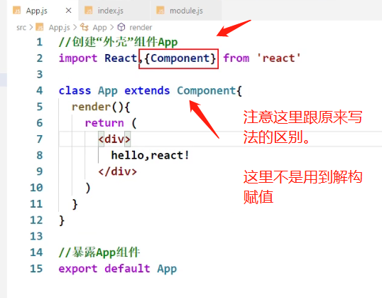
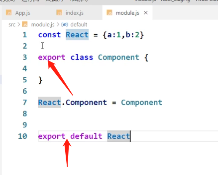
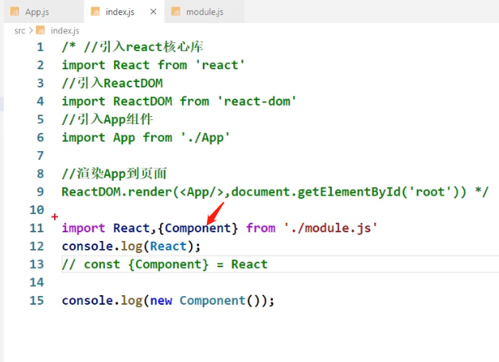
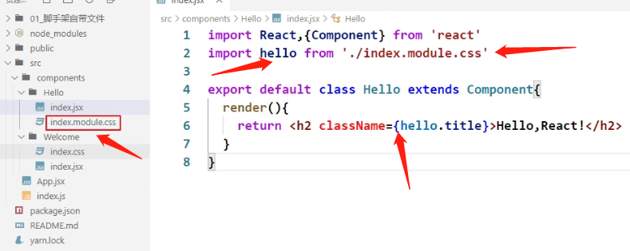
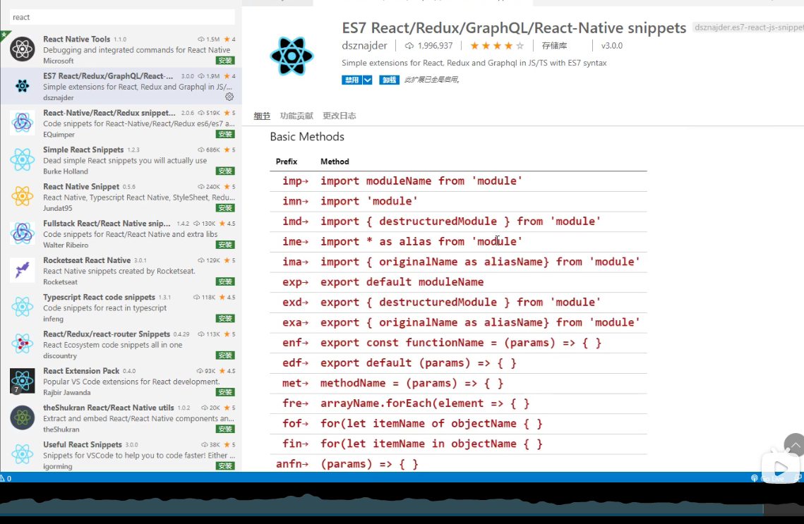
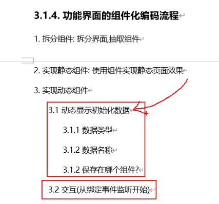
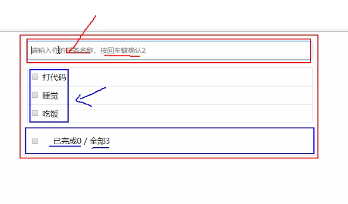

https://www.bilibili.com/video/BV1wy4y1D7JT?p=56&spm_id_from=pageDriver

# 51 脚手架文件介绍_src

src中的index.js **入口文件**

StrictMode：用来检查App组件及其子组件里面写的东西是否合理

reportWebVitals：用于记录页面上的性能

index.js也没有引入到index.html当中啊，那他俩之间是怎么发生关系的呢？

* **靠webpack配置**

# 52 一个简单的hello组件

==**默认暴露 + 分别暴露**==

# 53 样式的模块化（还没看）

模块化前：

模块化后：

# 54 vscode中react插件的安装（还没看）

# 55 组件化编码流程

# 56 静态组件

# 57 动态初始化列表

**强调：状态中的数据驱动着页面的展示**

**涉及到组件间传值 通信**

# 58 添加todo

#### 1.**父组件给子组件传值用props**

#### 2.**子组件给父组件传值呢？**

- 父组件通过props传给子组件一个函数A
- 然后子组件在合适的时候调用函数A

**了解一下nanoid库，uuid库**

# 59 鼠标移入效果

# 60 添加一个todo 

