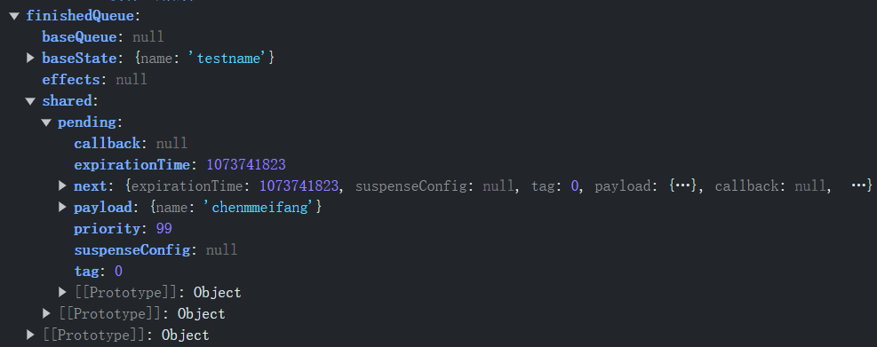

https://www.bilibili.com/video/BV1ev411P7jn/?spm_id_from=333.337.search-card.all.click&vd_source=a7089a0e007e4167b4a61ef53acc6f7e

  "react-dom": "^18.2.0",

  "react-dom": "^17.0.1",

# [1.配置React源码学习本地调试环境](https://www.bilibili.com/video/BV13j411D7K6/?spm_id_from=333.788.recommend_more_video.11&vd_source=a7089a0e007e4167b4a61ef53acc6f7e)

> 注意：之后继续调试react-test2项目

注意：

1.使用create-react-app脚手架创建项目

​	`npx create-react-app react-test`

2.弹射create-react-app脚手架内部配置

​	`cd react-test`

​	`npm run eject`

3.克隆react官方源码学习（在项目的根目录下进行克隆）

​	`git clone --branch v16.13.1 --depth=1 https://github.com/facebook/react.git src/react`

4.链接本地源码

```javascript
// 文件位置：react-test/config/webpack.config.js
resolve: {
      alias: {
        'react-native': 'react-native-web',                
        "react": path.resolve(__dirname, "../src/react/packages/react"),
        "react-dom": path.resolve(__dirname, "../src/react/packages/react-dom"),
        "shared": path.resolve(__dirname, "../src/react/packages/shared"),
        "react-reconciler": path.resolve(__dirname, "../src/react/packages/react-reconciler"),
        "legacy-events": path.resolve(__dirname, "../src/react/packages/legacy-events"),
      }
}
```

> path.resolve(__dirname，‘xxx’)
>
> path.resolve() 用于将路径解析为绝对路径
>
> `__dirname` 是 Node.js 中的一个全局变量，表示当前模块文件所在的目录的绝对路径

5.修改环境变量

```javascript
// 文件位置：react-test/config/env.js
const stringified = {
    'process.env': Object.keys(raw).reduce((env, key) => {
      env[key] = JSON.stringify(raw[key]);
      return env;
    }, {}),
    __DEV__: true,
    SharedArrayBuffer: true,
    spyOnDev: true,
    spyOnDevAndProd: true,
    spyOnProd: true,
    __PROFILE__: true,
    __UMD__: true,
    __EXPERIMENTAL__: true,
    __VALIANT__: true,
    gate: true,
    trustedTypes: true
};
```

6.告诉babel在转换代码时忽略类型检查

`npm install @babel/plugin-transform-flow-strip-types -D`

> 这是一个 Babel 插件，专门用于处理 Flow 类型注释。将其从代码中移除，以便在生产环境中只保留 JavaScript 代码而不包含类型信息.
>
> Flow 是Facebook 开发的一个静态类型检查器，它在开发过程中提供类型安全，但这些类型注释在编译后的代码中是不需要的
>
> Flow 用于在 JavaScript 代码中添加类型注释。它可以帮助在开发过程中捕捉类型错误，但这些类型信息在实际的 JavaScript 代码中并不需要。
>
> @babel/plugin-transform-flow-strip-types 这个插件会从 Flow 注释的代码中移除类型注释。它会转换 Flow 代码，使其在编译后的 JavaScript 中不包含类型注释，从而减少代码体积，并确保最终生成的代码是纯 JavaScript 代码

```javascript
// 文件位置：react-test/config/webpack.config.js [babel-loader]
plugins: [
    require.resolve("@babel/plugin-transform-flow-strip-types"),
]
```

> `require.resolve` 是 Node.js 的一个方法，用于解析模块的绝对路径。它返回给定模块的绝对路径。如果模块在 `node_modules` 中，它会返回模块的完整路径
>
> 使用 `require.resolve` 可以确保 Babel 确切地知道插件的位置，并避免路径问题。这在配置中明确引用插件时特别有用，尤其是在处理不同的包版本和路径时。

7.导出HostConfig

```javascript
// 文件位置: react\packages\react-reconciler\src\ReactFiberHostConfig.js
+ export * from './forks/ReactFiberHostConfig.dom';
```


> 这行代码使用了 JavaScript 的 ES6 模块语法，作用是从 `'./forks/ReactFiberHostConfig.dom'` 模块中导出所有导出的内容
>
> **`export \* from` 语法**:
>
> - 这是 ES6 模块的一部分，用于重新导出另一个模块的所有导出内容。这种语法在模块的聚合或重导出时非常有用

8.修改ReactSharedInternals.js文件

```javascript
// 文件位置：react\packages\shared\ReactSharedInternals.js
- import * as React from 'react';
- const ReactSharedInternals = React.__SECRET_INTERNALS_DO_NOT_USE_OR_YOU_WILL_BE_FIRED;
+ import ReactSharedInternals from '../react/src/ReactSharedInternals';
```

> `* as React` 表示将模块中所有的导出内容作为一个对象导入，并命名为 React

9.关闭eslint扩展


> `.eslintrc.js` 文件是用于配置 ESLint 的配置文件。ESLint 是一个用于识别和报告 JavaScript 代码中的模式匹配的静态代码分析工具，旨在确保代码的一致性并避免错误。配置文件 `.eslintrc.js` 可以包含各种规则、解析器选项、插件等。以下是一个示例 `.eslintrc.js` 文件及其详细解释：
>
> ```javascript
> module.exports = {
>   env: {
>     browser: true, // 启用浏览器全局变量
>     es2021: true,  // 启用 ES2021 全局变量
>     node: true,    // 启用 Node.js 全局变量
>   },
>   extends: [
>     'eslint:recommended', // 使用推荐的 ESLint 规则
>     'plugin:react/recommended', // 使用推荐的 React 规则
>   ],
>   parserOptions: {
>     ecmaFeatures: {
>       jsx: true, // 启用 JSX 解析
>     },
>     ecmaVersion: 'latest', // 使用最新的 ECMAScript 版本
>     sourceType: 'module', // 启用 ES 模块
>   },
>   plugins: [
>     'react', // 使用 eslint-plugin-react 插件
>   ],
>   rules: {
>     'no-unused-vars': 'warn', // 不允许未使用的变量，发出警告
>     'no-console': 'off', // 允许 console 语句
>     'react/prop-types': 'off', // 关闭 prop-types 规则
>   },
>   settings: {
>     react: {
>       version: 'detect', // 自动检测 React 版本
>     },
>   },
> };
> ```
>
> ### 配置说明
>
> 1. **`env`**:
>    - 指定环境，可以包含多个环境。每个环境会预定义特定的全局变量。
>    - `browser: true` 启用浏览器全局变量。
>    - `es2021: true` 启用 ES2021 全局变量。
>    - `node: true` 启用 Node.js 全局变量。
>
> 2. **`extends`**:
>    - 用于扩展一组共享的配置。
>    - `eslint:recommended` 使用推荐的 ESLint 规则。
>    - `plugin:react/recommended` 使用推荐的 React 规则。
>
> 3. **`parserOptions`**:
>    - 设置解析器选项。
>    - `ecmaFeatures.jsx` 启用 JSX 解析。
>    - `ecmaVersion` 设置为 `'latest'` 使用最新的 ECMAScript 版本。
>    - `sourceType` 设置为 `'module'` 启用 ES 模块。
>
> 4. **`plugins`**:
>    - 指定插件，扩展 ESLint 的功能。
>    - `react` 插件提供 React 相关的规则。
>
> 5. **`rules`**:
>    - 自定义规则，可以覆盖扩展配置中的规则。
>    - `'no-unused-vars': 'warn'` 不允许未使用的变量，并发出警告。
>    - `'no-console': 'off'` 允许使用 `console` 语句。
>    - `'react/prop-types': 'off'` 关闭 `prop-types` 规则。
>
> 6. **`settings`**:
>    - 提供给指定插件的配置。
>    - `react.version` 设置为 `'detect'`，自动检测 React 版本。
>
> ### 扩展和插件
>
> - **扩展（extends）**:
>   - `eslint:recommended` 是 ESLint 提供的一组推荐规则。
>   - `plugin:react/recommended` 是 `eslint-plugin-react` 插件提供的一组推荐规则。
>
> - **插件（plugins）**:
>   - `eslint-plugin-react` 插件提供了一组 React 相关的规则。
>
> ### 自定义规则
>
> 你可以根据项目需求添加或修改规则。例如：
>
> ```javascript
> rules: {
>   'semi': ['error', 'always'], // 强制使用分号
>   'quotes': ['error', 'single'], // 强制使用单引号
>   'react/jsx-uses-react': 'off', // 关闭旧的 React 规则（React 17 及更高版本）
>   'react/react-in-jsx-scope': 'off', // 关闭旧的 React 规则（React 17 及更高版本）
> }
> ```
>
> ### 总结
>
> `.eslintrc.js` 文件是 ESLint 的配置文件，用于定义代码风格、最佳实践和潜在错误的规则。通过合理配置 ESLint，可以提高代码质量，保持代码风格一致性，并在开发过程中捕捉潜在的问题。

10.禁止invariant报错

```javascript
+ if (condition) return;
```


11.eslint配置

在react源码文件夹中新建.eslintrc.json并添加如下配置

```javascript
{
    "extends": "react-app",
    "globals": {
        "SharedArrayBuffer": true,
        "spyOnDev": true,
        "spyOnDevAndProd": true,
        "spyOnProd": true,
        "__PROFILE__": true,
        "__UMD__": true,
        "__EXPERIMENTAL__": true,
        "__VALIANT__": true,
        "gate": true,
        "trustedTypes": true
    }
}
```

12.修改react react-dom引入方式


13.解决vsCode中flow报错


14.可选项配置


15.____DEV____报错

删除node_modules，执行npm Install

# [2.创建React元素](https://www.bilibili.com/video/BV13j411D7K6/?p=2&vd_source=a7089a0e007e4167b4a61ef53acc6f7e)

在react项目运行之前，**jsx代码会被babel转换成React.createElement()代码的调用**

## 2.1 createElement

> 文件位置：packages/react/src/ReactElement.js

[JSX转换为ReactElement的过程](https://www.bilibili.com/video/BV13j411D7K6?p=2&spm_id_from=pageDriver&vd_source=a7089a0e007e4167b4a61ef53acc6f7e)

- react元素：就是之前所说的virtual dom，实际上就是js对象，用来描述真实dom对象长成什么样子

- 在react项目运行之前，jsx会被babel进行转换，每一段jsx语法都会被babel转换为React.createElement方法的调用，返回react元素
- jsx是如何被转换为react元素的？

## 2.2 ReactElement

react元素上主要包含的属性：$$typeof,ref,props,_owner


## 2.3 hasValidRef

## 2.4 hasValidKey

## [2.5 isValidElement](https://www.bilibili.com/video/BV13j411D7K6/?p=4&spm_id_from=pageDriver&vd_source=a7089a0e007e4167b4a61ef53acc6f7e)

```js
export function isValidElement(object) {
  return (
    typeof object === 'object' &&
    object !== null &&
    object.$$typeof === REACT_ELEMENT_TYPE
  );
}
```

## 2.6 defineKeyPropWarningGetter

## 2.7 defineRefPropWarningGetter

# [3.React架构](https://www.bilibili.com/video/BV13j411D7K6?p=5&vd_source=a7089a0e007e4167b4a61ef53acc6f7e)

[React16版本架构](https://www.bilibili.com/video/BV13j411D7K6/?p=5&spm_id_from=pageDriver&vd_source=a7089a0e007e4167b4a61ef53acc6f7e)

- 在react16版本当中，使用了Fiber Reconciler替代了stack Reconciler

- **调度层**：负责调度任务的优先级，高优先级任务优先进入到协调器当中。要保证react代码在浏览器的空闲时间去执行
  - ==怎么判断任务的优先级？==
- **协调层**：负责构建Fiber数据结构，比对Fiber对象找出差异，记录Fiber对象要进行的dom操作
- **渲染层**：负责将发生变化的部分渲染到页面当中

## 3.1 Scheduler 调度层


- 在react 15中是没有调度层的，为什么要在react 16中加入调度层呢？
  - 因为react 15中采用了**循环加递归**的方式进行**virtualDOM的比对**，==由于递归使用的是Javascript自身的执行栈，==一旦开始就无法停止，直到任务执行完成
  - 如果virutal dom树的层级比较深，vitural dom的比对就会长期占用Javascript主线程，由于js又是单线程的，没有办法同时去执行其他任务，所以在比对的过程当中，就无法同时响应用户的操作，无法及时执行元素动画，就造成了页面卡顿的现象
  - 为了解决卡顿的问题，在react 16中就加入了调度层
- react 16，所有的任务并不是直接去执行，而是要先被加入到任务队列中，等到浏览器有空闲时间了，才去执行
- react 16中，放弃了使用js递归的方式进行vitural dom的比对，而是采用循环去模拟递归。这样任务在执行的过程当中，如果浏览器没有空闲时间了，任务也可以随时被中断

## 3.2 Reconciler 协调层

> reconcile: 使和谐一致，使调和

- react 15中，协调层和渲染层是交替执行的，即找到了差异就直接去更新差异
- react 16中，协调层和渲染层不再交替执行，**协调层负责构建Fiber节点，找出差异**，在所有差异找出之后，统一交给渲染层进行dom的更新
- **协调层的主要任务：找出差异部分，并为差异打上标记**

## 3.3 Renderer 渲染层

- 渲染层根据协调层为Fiber节点打的标记，同步执行对应的dom操作
- 比对的过程从递归变成了可以中断的循环，那么react是如何解决中断更新时dom渲染不完全的问题呢？
  - ==其实根本就不存在这个问题，因为在整个的更新过程当中，调度层和协调层的工作是在内存当中完成的，是可以被打断的；而渲染层的工作被设定成不可以被打断，所以不存在dom渲染不完全的问题==

# 4.数据结构

[Fiber数据结构介绍](https://www.bilibili.com/video/BV13j411D7K6/?p=6&spm_id_from=pageDriver&vd_source=a7089a0e007e4167b4a61ef53acc6f7e)

## 4.1 Fiber

- react元素：就是之前所说的virtual dom，实际上就是js对象，用来描述真实dom对象长成什么样子

- Fiber其实就是js对象，它是从virtural dom对象演变而来的


在fiber对象中，有很多属性，主要分为四类：

### 4.1.1 和dom实例对象相关

- **tag**：用来区分组件类型，当前fiber节点表示的是：函数组件 || 类组件 || 普通的react元素 || 其他的组件类型。
  - 其值详见WorkTag

- **type**：createElement方法的第一个参数，表示节点的类型
  - 若当前节点是div或span，type属性存储的是字符串类型的div，span
  - 若当前元素是组件，type属性当中存储的是组件的构造函数
- **stateNode**
  - 若当前fiber表示的是普通dom节点，stateNode属性存的是节点对应的真实dom对象
  - 若当前fiber表示的是类组件，stateNode属性存的是类组件的实例对象
  - 若当前fiber表示的是函数组件，stateNode属性存的是null，因为**函数组件没有实例**

### 4.1.2  和构建fiber树相关的

- **return**：父级fiber节点
- **child**：子级fiber节点
- **sibling**：下一个兄弟fiber节点
- **alternate**：见双缓存一节

### 4.1.3 和组件状态相关的

- **pendingProps**：组件中即将更新的props
- **memoizedProps**：旧的props
- **memoizedState**：旧的state

### 4.1.4 和副作用相关的属性

> 副作用属性——指可触发dom操作的属性

- **updateQueue**：表示任务队列，当前fiber对应的组件要执行的任务都会被存储在这个任务队列当中（比如组件的状态更新，组件的初始化渲染）

  - **在setState方法被调用，更新并不是马上发生的，react会将多个更新操作放在updateQueue队列当中，最后执行批量更新操作**
  - updateQueue属性的值其实是JS对象，对象中以链表的方式存储要更新的任务

- **effectTag**：当前fiber节点对应的dom节点要进行什么样的操作，其值参考SideEffectTag。当Fiber节点对应的DOM操作执行完成以后，effectTag属性的值会被重置成1

- **firstEffect**：Fiber

- **nextEffect**：Fiber

- **lastEffect**：Fiber

  - 这三个属性中存储的都是Fiber节点。存储的是当前Fiber的子级Fiber节点，是需要执行副作用的子级Fiber节点

- 

- expiration：过期时间，若因为任务优先级的关系，任务迟迟没有得到执行，若过任务的过期时间，react就会强制执行该任务；若是同步任务，这个过期时间会被设置成一个很大的数值

- mode：表示当前fiber节点的模式。其值详见TypeOfMode

- |  |  |
  | ------------------------------------------------------------ | ------------------------------------------------------------ |

## 4.2 WorkTag

|  |  |
| ------------------------------------------------------------ | ------------------------------------------------------------ |

- 0：函数组件
- 1：类组件
- 3：当前组件挂载点对应的fiber对象，默认情况就是id为root的div节点对应的fiber对象
- 5：普通的react节点，比如：div span

## 4.3 TypeOfMode

```js
export type TypeOfMode = number;

export const NoMode = 0b0000;
export const StrictMode = 0b0001;
// TODO: Remove BlockingMode and ConcurrentMode by reading from the root
// tag instead
export const BlockingMode = 0b0010;
export const ConcurrentMode = 0b0100;
export const ProfileMode = 0b1000;
```


## 4.3 SideEffectTag

表示的是当前fiber 节点对应的dom节点要进行什么样的操作

```js
export type SideEffectTag = number;

// Don't change these two values. They're used by React Dev Tools.
export const NoEffect = /*              */ 0b0000000000000; // 表示当前Fiber节点不需要进行任何DOM操作
export const PerformedWork = /*         */ 0b0000000000001; // 表示该节点要执行的DOM操作已经完成

// You can change the rest (and add more).
export const Placement = /*             */ 0b0000000000010;
export const Update = /*                */ 0b0000000000100;
export const PlacementAndUpdate = /*    */ 0b0000000000110;
export const Deletion = /*              */ 0b0000000001000;
export const ContentReset = /*          */ 0b0000000010000;
export const Callback = /*              */ 0b0000000100000;
export const DidCapture = /*            */ 0b0000001000000;
export const Ref = /*                   */ 0b0000010000000;
export const Snapshot = /*              */ 0b0000100000000;
export const Passive = /*               */ 0b0001000000000;
export const Hydrating = /*             */ 0b0010000000000;
export const HydratingAndUpdate = /*    */ 0b0010000000100;

// Passive & Update & Callback & Ref & Snapshot
export const LifecycleEffectMask = /*   */ 0b0001110100100;

// Union of all host effects
export const HostEffectMask = /*        */ 0b0011111111111;

export const Incomplete = /*            */ 0b0100000000000;
export const ShouldCapture = /*         */ 0b1000000000000;
```

## 4.4 Update

```js
let update: Update<*> = {
    expirationTime,
    suspenseConfig,

    tag: UpdateState,
    payload: null,
    callback: null,

    next: (null: any),
};
```

## 4.5 UpdateQueue


## 4.6 RootTag

## 4.7 双缓存技术——在内存中构建并直接替换的技术

[双缓存技术介绍](https://www.bilibili.com/video/BV13j411D7K6?p=7&spm_id_from=pageDriver&vd_source=a7089a0e007e4167b4a61ef53acc6f7e)

- current Fiber树
- workInProgress Fiber树


|  |  |
| :----------------------------------------------------------: | :----------------------------------------------------------: |

- rootFiber：表示组件的挂载点对应的Fiber对象，目前就是id为root的div所对应的Fiber对象
- **fiber节点对象中是存储了对应的dom节点对象的，也就是说，dom对象的构建是在内存当中完成的，当所有fiber对象构建完成后，所有的dom对象就也构建完成了。这时就可以直接使用内存当中的dom对象替换页面当中的dom对象了**

## [4.8 区分fiberRoot与rootFiber](https://www.bilibili.com/video/BV13j411D7K6?p=8&spm_id_from=pageDriver&vd_source=a7089a0e007e4167b4a61ef53acc6f7e)


**stateNode**：

- 如果当前fiber表示的是普通dom节点，stateNode属性当中存储的就是节点对应的真实dom对象
- 如果当前fiber表示的是类组件，stateNode属性当中存储的就是类组件的实例对象
- 如果当前fiber表示的是函数组件，stateNode属性当中存储的就是null，因为**函数组件没有实例**

在React中，`fiberRoot`和`rootFiber`是与Fiber架构相关的概念。以下是它们的区别：

1. **fiberRoot**：
   - 这是指根Fiber节点，通常是整个应用的顶层Fiber。
   - 它包含整个应用的DOM树，并且是更新的起点。
   - 在React 16及之后的版本中，`fiberRoot` 是 `ReactDOMRoot` 的核心部分，负责管理整个应用的状态和更新流程。

2. **rootFiber**：
   - 这个术语不如 `fiberRoot` 常见，通常在内部实现中使用。
   - 它可能指的是与特定根Fiber相关的特定Fiber节点，或在某些情况下的一个根Fiber节点的别名或引用。

总结来说，`fiberRoot` 是应用的顶级Fiber节点，负责管理和调度更新。`rootFiber` 的定义可能依赖于具体上下文，通常是指与某个特定根节点相关的Fiber。

# 5.初始化渲染

[render方法解析](https://www.bilibili.com/video/BV13j411D7K6?p=9&spm_id_from=pageDriver&vd_source=a7089a0e007e4167b4a61ef53acc6f7e)

react元素是如何被渲染到页面中的？

## 5.1 render阶段

- render阶段是协调层负责的阶段

- 在这个阶段，要为每个react元素构建对应的fiber对象，在构建fiber对象的过程中，还要为此fiber对象创建对应的dom对象，且还要为fiber对象添加EffectTag属性

  - “在render阶段构建dom对象有争议”

  - > 在React的执行过程中，构建DOM对象的阶段是在**`commit` 阶段**。具体来说：
    >
    > 1. **Render阶段**：
    >    
    >    - 在Render阶段，React会执行组件的渲染逻辑，生成一个新的虚拟DOM（Fiber树）。在这个阶段，React仅仅是计算和构建新的虚拟DOM树，并不会直接操作真实DOM。
    >    
    > 2. **Commit阶段**：
    >    - 在Commit阶段，React会将虚拟DOM中的更改应用到真实DOM中。这一阶段会执行DOM的增、删、改操作，更新真实DOM的状态。
    >
    >    具体来说，`commit` 阶段包括以下几个子阶段：
    >    - **Pre-commit阶段**：在这个阶段，React会进行一些准备工作，如计算插入和删除的DOM元素等。
    >    - **Mutation阶段**：这是最关键的阶段，React会对真实DOM进行具体的插入、删除和更新操作。
    >    - **Post-commit阶段**：在这个阶段，React会进行一些清理和后续处理工作，如触发`useEffect`等副作用。
    >
    > 总结来说，DOM对象的实际构建和更新是在`commit`阶段完成的，而在`render`阶段，只是生成新的虚拟DOM结构

- react 15中，协调层和渲染层是交替执行的，即找到了差异就直接去更新差异

- react 16中，协调层和渲染层不再交替执行，**协调层负责构建Fiber节点，找出差异**，在所有差异找出之后，统一交给渲染层进行dom的更新

- **协调层的主要任务：找出差异部分，并为差异打上标记**

### 5.1.1 render

`文件位置：packages/react-dom/src/client/ReactDOMLegacy.js`


```js
/**
* element: 要进行渲染的ReactElement，createElement方法的返回值
* container：渲染容器 <div id="root"></div>
* callback：渲染完成后执行的回调函数
*/
export function render(
  element: React$Element<any>,
  container: Container,
  callback: ?Function,
) {
  return legacyRenderSubtreeIntoContainer(
    // 父组件 初始渲染没有父组件 传递null占位
    null,
    element,
    container,
    // 是否为服务器端渲染 false：不是服务器端渲染 true：是服务器端渲染
    false,
    callback,
  );
}
```

#### 1. isValidContainer


> 在JavaScript中，`nodeType`属性是一个常用的DOM属性，用于标识一个节点的类型。这个属性是Node接口的一部分，所有的DOM节点对象都具有这个属性。`nodeType`的值是一个整数，表示节点的类型。以下是常见的`nodeType`值和对应的节点类型：
>
> 1. **1**: 元素节点（Element）
>    - 例如：`<div>`, `<span>`, `<p>` 等。
>
> 2. **2**: 属性节点（Attribute）
>    - 例如：`id="example"`, `class="test"`。
>
> 3. **3**: 文本节点（Text）
>    - 包含实际文本内容的节点，例如文本节点中的文字内容。
>
> 4. **4**: CDATA节点（CDATASection）
>    - 包含CDATA块的节点，用于存储不需要进行转义的文本。
>
> 5. **5**: 实体参考节点（EntityReference）
>    - 例如：`&amp;`。
>
> 6. **6**: 实体节点（Entity）
>    - 例如：`&nbsp;`。
>
> 7. **7**: 注释节点（Comment）
>    - 例如：`<!-- This is a comment -->`。
>
> 8. **8**: 文档类型节点（DocumentType）
>    - 例如：`<!DOCTYPE html>`。
>
> 9. **9**: 文档节点（Document）
>    - 表示整个文档。
>
> 10. **10**: 文档片段节点（DocumentFragment）
>     - 用于表示一个轻量级的文档片段。
>
> 11. **11**: 解构节点（Notation）
>     - 用于表示DTD中的实体类型。
>
> 使用`nodeType`属性可以通过以下方式检查节点类型：
>
> ```javascript
> const node = document.getElementById('example');
> 
> if (node.nodeType === 1) {
>   console.log('This is an element node.');
> } else if (node.nodeType === 3) {
>   console.log('This is a text node.');
> }
> ```
>

### 5.1.2 初始化FiberRoot

[创建fiberRoot对象和rootFiber对象](https://www.bilibili.com/video/BV13j411D7K6?p=10&spm_id_from=pageDriver&vd_source=a7089a0e007e4167b4a61ef53acc6f7e)

#### 1. legacyRenderSubtreeIntoContainer


```js
/**
* 初始化Fiber数据结构——创建fiberRoot以及rootFiber
* parentComponent: 父组件，初始渲染传入了null,
* children: render方法中的第一个参数,要渲染的ReactElement
* container: 渲染容器。container是一个dom对象：<div id="root"></div>
* forceHydrate: true为服务端渲染,false为客户端渲染
* callback: 组件渲染完成后需要执行的回调函数
*/
function legacyRenderSubtreeIntoContainer(
    parentComponent: ?React$Component<any, any>,
    children: ReactNodeList,
    container: Container,
    forceHydrate: boolean,
    callback: ?Function,
) {
    let root: RootType = (container._reactRootContainer: any);
    let fiberRoot;
    if (!root) { // Initial mount 表示初始渲染
        root = container._reactRootContainer = legacyCreateRootFromDOMContainer(
            container,
            forceHydrate,
        );
        // 结果：container._reactRootContainer = {__internalRoot: {}}
        // __internalRoot属性值即为 FiberRoot，表示根节点Fiber数据结构
        fiberRoot = root._internalRoot;
        if (typeof callback === 'function') {
            // 改变callback函数中的this指向，使其指向render方法第一个参数所对应的真实DOM对象
            const originalCallback = callback;
            callback = function () {
                const instance = getPublicRootInstance(fiberRoot);
                originalCallback.call(instance);
            };
        }
        // Initial mount should not be batched.
        unbatchedUpdates(() => {
            updateContainer(children, fiberRoot, parentComponent, callback);
        });
    } else { // 表示更新
        fiberRoot = root._internalRoot;
        if (typeof callback === 'function') {
            const originalCallback = callback;
            callback = function () {
                const instance = getPublicRootInstance(fiberRoot);
                originalCallback.call(instance);
            };
        }
        updateContainer(children, fiberRoot, parentComponent, callback); // Update
    }
    return getPublicRootInstance(fiberRoot);
}
```

#### 2. legacyCreateRootFromDOMContainer

> 该方法的核心工作：**创建FiberRoot以及RootFiber**


```js
/**
* 判断是否为服务器端渲染，如果不是服务器端渲染，清空container容器中的节点
*/
function legacyCreateRootFromDOMContainer(
    container: Container,
    forceHydrate: boolean, // 是否是服务器端渲染
): RootType {
    // 检测是否是服务器端渲染
    const shouldHydrate =
        forceHydrate || shouldHydrateDueToLegacyHeuristic(container);
    if (!shouldHydrate) { // 不是服务器端渲染
        let warned = false;
        let rootSibling;
        // 开启循环 删除container容器中的节点
        while ((rootSibling = container.lastChild)) {
            container.removeChild(rootSibling);
        }
    }
    return createLegacyRoot(
        container,
        shouldHydrate
            ? {
                hydrate: true,
            }
            : undefined,
    );
}
```

为什么要清空container中的元素？

- 有时需要在container中放置一些占位图或者loading图以提高首屏加载用户梯体验
- 就无可避免的要向container中加入html标记
- 在将ReactElement渲染到container之前，必须先清空container
- 因为占位图和ReactElement不能同时显示

在加入占位代码时，最好只有一个父级元素，可以减少内部代码的循环次数以提高性能

```html
<div>
    <p>placement</p>
    <p>placement</p>
    <p>placement</p>
</div>
```

#### 3. createLegacyRoot


```js
/**
* 通过实例化 ReactDOMBlockingRoot 类创建 LegacyRoot
*/
export function createLegacyRoot(
  container: Container,
  options?: RootOptions,
): RootType {
  // LeagcyRoot是一个常亮，值为0
  // 通过render方法创建的container就是LagacyRoot
  return new ReactDOMBlockingRoot(container, LegacyRoot, options);
}
```


 ==什么是LegacyRoot？==

#### 4. ReactDOMBlockingRoot


```js
function ReactDOMBlockingRoot(
  container: Container,
  tag: RootTag,
  options: void | RootOptions,
) {
  // container._reactRootContainer = {__internalRoot: {}}
  this._internalRoot = createRootImpl(container, tag, options);
}
```

#### 5. createRootImpl


#### 6. createContainer


#### 7. createFiberRoot

container是一个dom节点

container._reactRootContainer = {__internalRoot: {}}


```js
// 创建根节点对应的fiber对象
export function createFiberRoot(
  containerInfo: any,
  tag: RootTag,
  hydrate: boolean,
  hydrationCallbacks: null | SuspenseHydrationCallbacks,
): FiberRoot {
  // 1.创建FiberRoot
  const root: FiberRoot = (new FiberRootNode(containerInfo, tag, hydrate): any);
  // 2.创建rootFiber——id为root的div所对应的Fiber对象
  const uninitializedFiber = createHostRootFiber(tag);
  // 3.为FiberRoot添加current属性为rootFiber
  root.current = uninitializedFiber;
  // 4.为rootFiber添加stateNode属性为FiberRoot
  uninitializedFiber.stateNode = root;

  // 5.为rootFiber对象添加updateQueue属性，初始化updateQueue对象
  //   updateQueue用于存放Update对象
  //   Update对象用于记录组件状态的改变
  initializeUpdateQueue(uninitializedFiber);

  return root;
}
```

|                          FiberRoot                           |                          rootFiber                           |
| :----------------------------------------------------------: | :----------------------------------------------------------: |
|  |  |

#### 8. FiberRootNode

```js
function FiberRootNode(containerInfo, tag, hydrate) {
  this.tag = tag;
  this.current = null;
  this.containerInfo = containerInfo;
  this.pendingChildren = null;
  this.pingCache = null;
  this.finishedExpirationTime = NoWork;
  this.finishedWork = null;
  this.timeoutHandle = noTimeout;
  this.context = null;
  this.pendingContext = null;
  this.hydrate = hydrate;
  this.callbackNode = null;
  this.callbackPriority = NoPriority;
  this.firstPendingTime = NoWork;
  this.firstSuspendedTime = NoWork;
  this.lastSuspendedTime = NoWork;
  this.nextKnownPendingLevel = NoWork;
  this.lastPingedTime = NoWork;
  this.lastExpiredTime = NoWork;

  if (enableSchedulerTracing) {
    this.interactionThreadID = unstable_getThreadID();
    this.memoizedInteractions = new Set();
    this.pendingInteractionMap = new Map();
  }
  if (enableSuspenseCallback) {
    this.hydrationCallbacks = null;
  }
}
```

#### 9. initializeUpdateQueue

```js
export function initializeUpdateQueue<State>(fiber: Fiber): void {
  const queue: UpdateQueue<State> = {
    baseState: fiber.memoizedState,
    baseQueue: null,
    shared: {
      pending: null,
    },
    effects: null,
  };
  fiber.updateQueue = queue;
}
```

### 5.1.3 获取rootFiber.child实例对象

### 5.1.4 unbatchedUpdates

```js
export function unbatchedUpdates<A, R>(fn: (a: A) => R, a: A): R {
  const prevExecutionContext = executionContext;
  executionContext &= ~BatchedContext;
  executionContext |= LegacyUnbatchedContext;
  try {
    return fn(a);
  } finally {
    executionContext = prevExecutionContext;
    if (executionContext === NoContext) {
      // Flush the immediate callbacks that were scheduled during this batch
      flushSyncCallbackQueue(); // 关键代码！！！！！！！！！
    }
  }
}
```

### 5.1.4 flushSyncCallbackQueue

```js
export function flushSyncCallbackQueue() {
  if (immediateQueueCallbackNode !== null) {
    const node = immediateQueueCallbackNode;
    immediateQueueCallbackNode = null;
    Scheduler_cancelCallback(node);
  }
  flushSyncCallbackQueueImpl();
}
```

### 5.1.4 flushSyncCallbackQueueImpl

```js
function flushSyncCallbackQueueImpl() {
  if (!isFlushingSyncQueue && syncQueue !== null) {
    isFlushingSyncQueue = true; // Prevent re-entrancy.
    let i = 0;
    try {
      const isSync = true;
      const queue = syncQueue;
      runWithPriority(ImmediatePriority, () => {
        for (; i < queue.length; i++) {
          let callback = queue[i];
          do {
            callback = callback(isSync); // 注意：这里的callback是performSyncWorkOnRoot()
          } while (callback !== null);
        }
      });
      syncQueue = null;
    } catch (error) {
      // If something throws, leave the remaining callbacks on the queue.
      if (syncQueue !== null) {
        syncQueue = syncQueue.slice(i + 1);
      }
      // Resume flushing in the next tick
      Scheduler_scheduleCallback(
        Scheduler_ImmediatePriority,
        flushSyncCallbackQueue,
      );
      throw error;
    } finally {
      isFlushingSyncQueue = false;
    }
  }
}
```


### [5.1.4 updateContainer](https://www.bilibili.com/video/BV13j411D7K6?p=12&spm_id_from=pageDriver&vd_source=a7089a0e007e4167b4a61ef53acc6f7e)

```js
/**
* 初始化Fiber数据结构——创建fiberRoot以及rootFiber
* parentComponent: 父组件，初始渲染传入了null,
* children: render方法中的第一个参数,要渲染的ReactElement
* container: 渲染容器。container是一个dom对象：<div id="root"></div>
* forceHydrate: true为服务端渲染,false为客户端渲染
* callback: 组件渲染完成后需要执行的回调函数
*/
function legacyRenderSubtreeIntoContainer(
    parentComponent: ?React$Component<any, any>,
    children: ReactNodeList,
    container: Container,
    forceHydrate: boolean,
    callback: ?Function,
) {
    let root: RootType = (container._reactRootContainer: any);
    let fiberRoot;
    if (!root) { // Initial mount 表示初始渲染
        root = container._reactRootContainer = legacyCreateRootFromDOMContainer(
            container,
            forceHydrate,
        );
        // 结果：container._reactRootContainer = {__internalRoot: {}}
        // __internalRoot属性值即为 FiberRoot，表示根节点Fiber数据结构
        fiberRoot = root._internalRoot;
        if (typeof callback === 'function') {
            // 改变callback函数中的this指向，使其指向render方法第一个参数所对应的真实DOM对象
            const originalCallback = callback;
            callback = function () {
                const instance = getPublicRootInstance(fiberRoot);
                originalCallback.call(instance);
            };
        }
        // Initial mount should not be batched.
        // unbatchedUpdates: 非批量更新
        // 多次调用setState的时候是批量更新
        unbatchedUpdates(() => {
            updateContainer(children, fiberRoot, parentComponent, callback);
        });
    } else { // 表示更新
        fiberRoot = root._internalRoot;
        if (typeof callback === 'function') {
            const originalCallback = callback;
            callback = function () {
                const instance = getPublicRootInstance(fiberRoot);
                originalCallback.call(instance);
            };
        }
        updateContainer(children, fiberRoot, parentComponent, callback); // Update
    }
    return getPublicRootInstance(fiberRoot);
}
```


```js
/**
* 创建一个任务对象。当前所做的事情是初始化渲染，它会把初始化渲染当做一个任务去执行
* element: 要渲染的ReactElement
* container: FiberRoot对象
* parentComponent: 父组件 初始渲染为null
* callback: 渲染完成执行的回调函数
*/
export function updateContainer(
  element: ReactNodeList,
  container: OpaqueRoot,
  parentComponent: ?React$Component<any, any>,
  callback: ?Function,
): ExpirationTime {
  const current = container.current; // 获取RootFiber
  const currentTime = requestCurrentTimeForUpdate();
  const suspenseConfig = requestCurrentSuspenseConfig();
  // 计算过期时间。为防止任务因为优先级的原因一直被打断而未能执行，react会设置一个过期时间，当时间到了过期时间的时候，如果任务还未执行的话，react将会强制执行该任务。初始化渲染时，任务同步执行不涉及被打断的问题。过期时间被设置成了1073741823，这个数值表示当前任务为同步任务。
  const expirationTime = computeExpirationForFiber(currentTime, current, suspenseConfig);

  // 设置FiberRoot.context。首次执行返回一个emptyContext，是一个{}
  const context = getContextForSubtree(parentComponent);
  if (container.context === null) {
    container.context = context;
  } else {
    container.pendingContext = context;
  }

  // 1.创建一个待执行的任务
  const update = createUpdate(expirationTime, suspenseConfig);
  // 2.将要更新的内容挂载到更新对象中的payload中
  update.payload = {element};

  callback = callback === undefined ? null : callback;
  if (callback !== null) {
    // 3.将callback挂载到update对象中。其实就是一层层传递，方便ReactElement元素渲染完成后调用
    update.callback = callback;
  }
  // 4.将update对象加到当前Fiber的更新队列中(updateQueue).待执行的任务都存储在fiber.updateQueue.shared.pending
  enqueueUpdate(current, update);
  // 5.调度和更新current对象
  scheduleWork(current, expirationTime);

  return expirationTime;
}
```

### 5.1.5 createUpdate

```js
export function createUpdate(
  expirationTime: ExpirationTime,
  suspenseConfig: null | SuspenseConfig,
): Update<*> {
  let update: Update<*> = {
    expirationTime,
    suspenseConfig,

    tag: UpdateState,
    payload: null,
    callback: null,

    next: (null: any),
  };
  update.next = update;
  return update;
}
```

### 5.1.6 enqueueUpdate

```JS
export function enqueueUpdate<State>(fiber: Fiber, update: Update<State>) {
  const updateQueue = fiber.updateQueue; // rootFiber
  if (updateQueue === null) {
    // 仅发生在fiber已经被卸载
    return;
  }

  const sharedQueue = updateQueue.shared;
  const pending = sharedQueue.pending;
  if (pending === null) {
    // This is the first update. Create a circular list.
    update.next = update;
  } else {
    update.next = pending.next;
    pending.next = update;
  }
  sharedQueue.pending = update;
}
```

### [5.1.5 scheduleWork-->scheduleUpdateOnFiber](https://www.bilibili.com/video/BV13j411D7K6?p=13&spm_id_from=pageDriver&vd_source=a7089a0e007e4167b4a61ef53acc6f7e)

任务执行前的准备工作


```js
/**
* 判断任务是否是同步任务，如果是同步任务，就调用同步任务入口方法
*/
export function scheduleUpdateOnFiber(
  fiber: Fiber, // RootFiber
  expirationTime: ExpirationTime,
) {
  checkForNestedUpdates(); // 检查是否是无限循环的update。在componentWillUpdate或者componentDidUpdate生命周期函数中重复调用setState方法时，可能会发生这种情况，React限制了嵌套更新的数量以防止无限循环。限制的嵌套更新数量为50，通过NESTED_UPDATE_LIMIT全局变量获取
  const root = markUpdateTimeFromFiberToRoot(fiber, expirationTime);
  if (root === null) { return;}

  // 获取当前调度任务的优先级 数值类型 从90开始 数值越大 优先级越高
  const priorityLevel = getCurrentPriorityLevel(); // 97 普通优先级任务

  if (expirationTime === Sync) { // 判断任务是否是同步任务
    if ( // 检查是否处于非批量更新模式。初始渲染是非批量更新模式
      (executionContext & LegacyUnbatchedContext) !== NoContext &&
        // 检查是否没有处于正在进行渲染的任务
      (executionContext & (RenderContext | CommitContext)) === NoContext
    ) {
      schedulePendingInteractions(root, expirationTime); // 初始渲染不执行
      performSyncWorkOnRoot(root); // 同步任务入口点
    } else {
      ensureRootIsScheduled(root);
      schedulePendingInteractions(root, expirationTime);
      if (executionContext === NoContext) {
        flushSyncCallbackQueue();
      }
    }
  } else {
    ensureRootIsScheduled(root);
    schedulePendingInteractions(root, expirationTime);
  }

  if ( 
    (executionContext & DiscreteEventContext) !== NoContext &&
    (priorityLevel === UserBlockingPriority ||
      priorityLevel === ImmediatePriority)
  ) {
    // 初始渲染不执行，删除部分代码...
  }
}
```

### [5.1.6 performSyncWorkOnRoot](https://www.bilibili.com/video/BV13j411D7K6?p=14&spm_id_from=pageDriver&vd_source=a7089a0e007e4167b4a61ef53acc6f7e)

- **同步任务入口点**
- **进入render阶段(要为每一个react元素构建fiber对象)**，构建workInProgress Fiber树~~中的rootFiber~~


```js
function performSyncWorkOnRoot(root) { // root: currentFiber树当中的FiberRoot对象
  const lastExpiredTime = root.lastExpiredTime;  // 检查是否有过期的任务，如果没有过期的任务，值为0
  const expirationTime = lastExpiredTime !== NoWork ? lastExpiredTime : Sync;
  flushPassiveEffects(); // 处理useEffect钩子函数相关的内容

  // workInProgressRoot：是一个全局对象，表示workInProgress Fiber树当中的FiberRoot对象
  if (root !== workInProgressRoot || expirationTime !== renderExpirationTime) {
    prepareFreshStack(root, expirationTime); // 构建workInProgressFiber树 及其 里面的RootFiber对象
    startWorkOnPendingInteractions(root, expirationTime); // 初始渲染不执行
  }

  if (workInProgress !== null) {
    const prevExecutionContext = executionContext;
    executionContext |= RenderContext;
    const prevDispatcher = pushDispatcher(root);
    const prevInteractions = pushInteractions(root);
    startWorkLoopTimer(workInProgress);

    do {
      try {
        workLoopSync(); // 开启一个循环，以同步的方式开始构建Fiber对象
        break;
      } catch (thrownValue) {
        handleError(root, thrownValue);
      }
    } while (true);
    resetContextDependencies();
    executionContext = prevExecutionContext;
    popDispatcher(prevDispatcher);
    if (enableSchedulerTracing) {
      popInteractions(((prevInteractions: any): Set<Interaction>));
    }

    if (workInProgressRootExitStatus === RootFatalErrored) {
      // 初始渲染不执行 删除部分代码...
    }

    if (workInProgress !== null) {
    } else {
      stopFinishedWorkLoopTimer();
      root.finishedWork = (root.current.alternate: any);
      root.finishedExpirationTime = expirationTime;
      finishSyncRender(root); // 结束render阶段，进入commit阶段
    }
    ensureRootIsScheduled(root);
  }
  return null;
}
```

#### 1. prepareFreshStack


```js
/**
* 构建workInProgressFiber树 及其 里面的rootFiber对象
* root：current Fiber树当中的FiberRoot对象
*/
function prepareFreshStack(root, expirationTime) {
  // finishedWork 表示render阶段执行完成后构建的待提交的Fiber对象。（表示render阶段执行完成后的工作成果）
  // 也就是说：在commit阶段，要处理的就是root.finishedWork这个属性当中存储的Fiber对象
  root.finishedWork = null;
  root.finishedExpirationTime = NoWork;

  const timeoutHandle = root.timeoutHandle;
  if (workInProgress !== null) {
    // 初始化渲染不执行 workInProgress 全局变量 初始化为null。删除部分代码...
  }

  workInProgressRoot = root; // 构建workInProgress Fiber树的fiberRoot对象
  workInProgress = createWorkInProgress(root.current, null); // 构建workInProgress Fiber树中的rootFiber
  renderExpirationTime = expirationTime;
  workInProgressRootExitStatus = RootIncomplete;
  workInProgressRootFatalError = null;
  workInProgressRootLatestProcessedExpirationTime = Sync;
  workInProgressRootLatestSuspenseTimeout = Sync;
  workInProgressRootCanSuspendUsingConfig = null;
  workInProgressRootNextUnprocessedUpdateTime = NoWork;
  workInProgressRootHasPendingPing = false;

  if (enableSchedulerTracing) {
    spawnedWorkDuringRender = null;
  }
}
```

#### 2. createWorkInProgress


```js
/**
* 构建workInProgressFiber树中的rootFiber
*/
export function createWorkInProgress(current: Fiber, pendingProps: any): Fiber {
  let workInProgress = current.alternate;
  if (workInProgress === null) {
    workInProgress = createFiber(current.tag, pendingProps, current.key, current.mode);
    // 属性复用
    workInProgress.elementType = current.elementType;
    workInProgress.type = current.type;
    workInProgress.stateNode = current.stateNode;
    // 使用alternate存储current
    workInProgress.alternate = current;
    // 使用alternate存储workInProgress
    current.alternate = workInProgress;
  } else {
    workInProgress.pendingProps = pendingProps;
    // We already have an alternate.
    // Reset the effect tag.
    workInProgress.effectTag = NoEffect;
    // The effect list is no longer valid.
    workInProgress.nextEffect = null;
    workInProgress.firstEffect = null;
    workInProgress.lastEffect = null;

    if (enableProfilerTimer) {
      workInProgress.actualDuration = 0;
      workInProgress.actualStartTime = -1;
    }
  }

  workInProgress.childExpirationTime = current.childExpirationTime;
  workInProgress.expirationTime = current.expirationTime;

  workInProgress.child = current.child;
  workInProgress.memoizedProps = current.memoizedProps;
  workInProgress.memoizedState = current.memoizedState;
  workInProgress.updateQueue = current.updateQueue;

  // Clone the dependencies object. This is mutated during the render phase, so
  // it cannot be shared with the current fiber.
  const currentDependencies = current.dependencies;
  workInProgress.dependencies =
    currentDependencies === null
      ? null
      : {
          expirationTime: currentDependencies.expirationTime,
          firstContext: currentDependencies.firstContext,
          responders: currentDependencies.responders,
        };

  // These will be overridden during the parent's reconciliation
  workInProgress.sibling = current.sibling;
  workInProgress.index = current.index;
  workInProgress.ref = current.ref;

  if (enableProfilerTimer) {
    workInProgress.selfBaseDuration = current.selfBaseDuration;
    workInProgress.treeBaseDuration = current.treeBaseDuration;
  }

  return workInProgress;
}
```

#### [3. workLoopSync](https://www.bilibili.com/video/BV13j411D7K6?p=15&spm_id_from=pageDriver&vd_source=a7089a0e007e4167b4a61ef53acc6f7e)

- **构建其他react元素的所对应的Fiber对象（构建workInProgressFiber树中的其他子节点）**
- **开启一个循环，以同步的方式开始去构建Fiber对象**

```js
function workLoopSync() {
  // Already timed out, so perform work without checking if we need to yield.
  // 第一轮循环的时候，workInProgress的值是：见下图
  // while方法支撑render阶段所有fiber节点的构建
  while (workInProgress !== null) {
    workInProgress = performUnitOfWork(workInProgress);
  }
}
```


#### [4. performUnitOfWork](https://www.bilibili.com/video/BV13j411D7K6?p=16)

- beginWork：从父级到子级，构建Fiber节点对象
- completeUnitOfWork：从子级到父级，构建其余节点Fiber对象


```js
function performUnitOfWork(unitOfWork: Fiber): Fiber | null {
  const current = unitOfWork.alternate;
  startWorkTimer(unitOfWork);

  let next;
  if (enableProfilerTimer && (unitOfWork.mode & ProfileMode) !== NoMode) {
    startProfilerTimer(unitOfWork);
    next = beginWork(current, unitOfWork, renderExpirationTime);
    stopProfilerTimerIfRunningAndRecordDelta(unitOfWork, true);
  } else {
    // 从父级到子级，构建Fiber节点对象。返回值next为当前节点的子节点
    next = beginWork(current, unitOfWork, renderExpirationTime);
  }

  unitOfWork.memoizedProps = unitOfWork.pendingProps;
  if (next === null) {
    // react15中，使用递归的方式来完成Fiber节点的构建
    // react16中，使用循环的方式模拟递归 来完成Fiber节点的构建
    next = completeUnitOfWork(unitOfWork); // 从子级到父级，构建其余节点Fiber对象
  }

  ReactCurrentOwner.current = null;
  return next;
}
```

#### 5. beginWork

- 相当于递归里面的递阶段
- 根据当前Fiber的类型决定如何构建起子级Fiber对象


```js
function beginWork(
  current: Fiber | null,
  workInProgress: Fiber,
  renderExpirationTime: ExpirationTime,
): Fiber | null {
  const updateExpirationTime = workInProgress.expirationTime;
  // ...中间删除了一些代码...
  workInProgress.expirationTime = NoWork;
  switch (workInProgress.tag) { // 看当前Fiber对象是什么类型，因为不同的Fiber对象获取子级元素的方式不同
    // 删除了一些case...
    case IndeterminateComponent: { // 2 函数组件在第一次被渲染时使用
      return mountIndeterminateComponent(
        current,
        workInProgress,
        workInProgress.type,
        renderExpirationTime,
      );
    }
    case FunctionComponent: {
      const Component = workInProgress.type;
      const unresolvedProps = workInProgress.pendingProps;
      const resolvedProps =
        workInProgress.elementType === Component
          ? unresolvedProps
          : resolveDefaultProps(Component, unresolvedProps);
      return updateFunctionComponent(
        current,
        workInProgress,
        Component,
        resolvedProps,
        renderExpirationTime,
      );
    }
    case ClassComponent: {
      const Component = workInProgress.type;
      const unresolvedProps = workInProgress.pendingProps;
      const resolvedProps =
        workInProgress.elementType === Component
          ? unresolvedProps
          : resolveDefaultProps(Component, unresolvedProps);
      return updateClassComponent(
        current,
        workInProgress,
        Component,
        resolvedProps,
        renderExpirationTime,
      );
    }
    case HostRoot: // 3
      return updateHostRoot(current, workInProgress, renderExpirationTime);
    case HostComponent: // 5 普通的react元素
      return updateHostComponent(current, workInProgress, renderExpirationTime);
    case HostText:
      return updateHostText(current, workInProgress);
    case ContextProvider:
      return updateContextProvider(
        current,
        workInProgress,
        renderExpirationTime,
      );
    case ContextConsumer:
      return updateContextConsumer(
        current,
        workInProgress,
        renderExpirationTime,
      );
  }
}
```

#### 6. updateHostRoot

- 要找到其子级，并构建其子级

```js
function updateHostRoot(current, workInProgress, renderExpirationTime) {
  pushHostRootContext(workInProgress);
  const updateQueue = workInProgress.updateQueue; // 获取更新队列
  const nextProps = workInProgress.pendingProps;  // 获取新的props对象 null
  const prevState = workInProgress.memoizedState; // 获取上一次渲染使用的state null
  const prevChildren = prevState !== null ? prevState.element : null; // 获取上一次渲染使用的children null
  cloneUpdateQueue(current, workInProgress);  // 浅复制更新队列，防止引用属性相互影响

  // 获取updateQueue.payload 并赋值到 workInProgress.memoizedState？？？？？
  processUpdateQueue(workInProgress, nextProps, null, renderExpirationTime);
  const nextState = workInProgress.memoizedState;
  const nextChildren = nextState.element; // nextChildren是App
  if (nextChildren === prevChildren) {
    // 初始渲染未执行，删除了部分代码...
  }
  const root: FiberRoot = workInProgress.stateNode;
  if (root.hydrate && enterHydrationState(workInProgress)) {
    // 服务器端渲染... 删除了部分代码
  } else {
    // 构建完nextChildren对应的Fiber对象之后，会把对应的Fiber对象添加到workInProgress.child属性中
    reconcileChildren(
      current,
      workInProgress,
      nextChildren,
      renderExpirationTime,
    );
    resetHydrationState();
  }
  return workInProgress.child;
}
```

#### 7. updateHostComponent

#### 8. [reconcileChildren](https://www.bilibili.com/video/BV13j411D7K6?p=17&spm_id_from=pageDriver&vd_source=a7089a0e007e4167b4a61ef53acc6f7e)

- 真正构建子级Fiber对象的方法


```js
/**
* current: 旧Fiber。为什么要传递current？因为不是初始渲染的情况，要进行新旧Fiber对比
* workInProgress: 父级Fiber,
* nextChildren: 子级vdom对象,
* renderExpirationTime: 过期时间,
*/
export function reconcileChildren(
  current: Fiber | null,
  workInProgress: Fiber,
  nextChildren: any,
  renderExpirationTime: ExpirationTime,
) {
  if (current === null) {
    workInProgress.child = mountChildFibers(
      workInProgress,
      null,
      nextChildren,
      renderExpirationTime,
    );
  } else {
    workInProgress.child = reconcileChildFibers(
      workInProgress,
      current.child,
      nextChildren,
      renderExpirationTime,
    );
  }
}
```

#### 9. mountChildFibers ->reconcileChildFibers


```js
function reconcileChildFibers(
    returnFiber: Fiber, // 父Fiber对象
    currentFirstChild: Fiber | null, // 旧的第一个子级Fiber对象，初始渲染为null
    newChild: any,
    expirationTime: ExpirationTime,
  ): Fiber | null {
    // 判断newChild是不是占位组件，比如<></>。删除了部分代码...
        
    const isObject = typeof newChild === 'object' && newChild !== null;
    if (isObject) {
      switch (newChild.$$typeof) {
        case REACT_ELEMENT_TYPE:
          return placeSingleChild(
            reconcileSingleElement(
              returnFiber,
              currentFirstChild,
              newChild,
              expirationTime,
            ),
          );
        case REACT_PORTAL_TYPE:
          return placeSingleChild(
            reconcileSinglePortal(
              returnFiber,
              currentFirstChild,
              newChild,
              expirationTime,
            ),
          );
      }
    }

    if (typeof newChild === 'string' || typeof newChild === 'number') {
      return placeSingleChild(
        reconcileSingleTextNode(
          returnFiber,
          currentFirstChild,
          '' + newChild,
          expirationTime,
        ),
      );
    }

    if (isArray(newChild)) {
      return reconcileChildrenArray(
        returnFiber,
        currentFirstChild,
        newChild,
        expirationTime,
      );
    }

    if (getIteratorFn(newChild)) {
      return reconcileChildrenIterator(
        returnFiber,
        currentFirstChild,
        newChild,
        expirationTime,
      );
    }

    if (isObject) {
      throwOnInvalidObjectType(returnFiber, newChild);
    }

    if (typeof newChild === 'undefined' && !isUnkeyedTopLevelFragment) {
      switch (returnFiber.tag) {
        case ClassComponent: {
        }
        case FunctionComponent: {
          const Component = returnFiber.type;
        }
      }
    }

    // Remaining cases are all treated as empty.
    return deleteRemainingChildren(returnFiber, currentFirstChild);
  }
```

#### 10. reconcileSingleElement

```js
function reconcileSingleElement(
    returnFiber: Fiber,
    currentFirstChild: Fiber | null,
    element: ReactElement,
    expirationTime: ExpirationTime,
  ): Fiber {
    const key = element.key;
    let child = currentFirstChild;
    // ...删除了一些代码...

    if (element.type === REACT_FRAGMENT_TYPE) {
      // ...删除了一些代码...
    } else {
      const created = createFiberFromElement(
        element,
        returnFiber.mode,
        expirationTime,
      );
      created.ref = coerceRef(returnFiber, currentFirstChild, element);
      created.return = returnFiber;
      // 返回创建好的子级Fiber
      return created;
    }
  }
```

#### 11. createFiberFromElement


```js
export function createFiberFromElement(
  element: ReactElement,
  mode: TypeOfMode,
  expirationTime: ExpirationTime,
): Fiber {
  let owner = null;
  const type = element.type;
  const key = element.key;
  const pendingProps = element.props;
  const fiber = createFiberFromTypeAndProps(
    type,
    key,
    pendingProps,
    owner,
    mode,
    expirationTime,
  );
  return fiber;
}
```

#### 12. reconcileChildrenArray


```js
function reconcileChildrenArray(
    returnFiber: Fiber,
    currentFirstChild: Fiber | null,
    newChildren: Array<*>,
    expirationTime: ExpirationTime,
  ): Fiber | null {
    let resultingFirstChild: Fiber | null = null; // 存储第一个子节点Fiber对象。并最终会返回出去
    let previousNewFiber: Fiber | null = null;    // 存储上一次创建的Fiber对象

    let oldFiber = currentFirstChild;
    let lastPlacedIndex = 0;
    let newIdx = 0;
    let nextOldFiber = null;
    // ...删除了一些初始下渲染不执行的代码...

    if (oldFiber === null) { // 初始渲染
      for (; newIdx < newChildren.length; newIdx++) {
        // 创建Fiber对象
        const newFiber = createChild(
          returnFiber,
          newChildren[newIdx],
          expirationTime,
        );
        if (newFiber === null) {
          continue;
        }
        lastPlacedIndex = placeChild(newFiber, lastPlacedIndex, newIdx);
        if (previousNewFiber === null) {
          // 第一次循环时会进入
          resultingFirstChild = newFiber;
        } else {
          previousNewFiber.sibling = newFiber;
        }
        previousNewFiber = newFiber;
      }
      return resultingFirstChild;
    }
  }
```

#### [13. completeUnitOfWork](https://www.bilibili.com/video/BV13j411D7K6?p=20&spm_id_from=pageDriver&vd_source=a7089a0e007e4167b4a61ef53acc6f7e)

- 从子到父，构建其余节点Fiber对象
- 相当于递归里面的归阶段


```js
/**
* 在从子级到父级的过程中，会经过每一个Fiber节点对象，会为Fiber构建其对应的DOM节点对象，并把DOM节点对象添加到Fiber的stateNode属性当中
* 在从子级到父级的过程中，收集要执行DOM操作的Fiber节点，组建effect链表结构
*/
function completeUnitOfWork(unitOfWork: Fiber): Fiber | null {
  workInProgress = unitOfWork; // 为workInProgress全局变量重新赋值
  do {
    const current = workInProgress.alternate;
    const returnFiber = workInProgress.return;
    if ((workInProgress.effectTag & Incomplete) === NoEffect) {
      let next;
      if (
        !enableProfilerTimer ||
        (workInProgress.mode & ProfileMode) === NoMode
      ) {
        next = completeWork(current, workInProgress, renderExpirationTime);
      } else {
        startProfilerTimer(workInProgress);
        // 创建节点真实DOM对象，并将其添加到stateNode属性中
        next = completeWork(current, workInProgress, renderExpirationTime);
        stopProfilerTimerIfRunningAndRecordDelta(workInProgress, false);
      }
      stopWorkTimer(workInProgress);
      resetChildExpirationTime(workInProgress);

      if (next !== null) {
        // 如果子级存在，返回子级，一直返回到workLoopSync。再重新执行performUnitWork 构建子级Fiber节点对象
        return next;
      }

      if (
        returnFiber !== null &&
        (returnFiber.effectTag & Incomplete) === NoEffect
      ) {
        if (returnFiber.firstEffect === null) {
          returnFiber.firstEffect = workInProgress.firstEffect;
        }
        if (workInProgress.lastEffect !== null) {
          if (returnFiber.lastEffect !== null) {
            returnFiber.lastEffect.nextEffect = workInProgress.firstEffect;
          }
          returnFiber.lastEffect = workInProgress.lastEffect;
        }

        const effectTag = workInProgress.effectTag;

        if (effectTag > PerformedWork) {
          if (returnFiber.lastEffect !== null) {
            returnFiber.lastEffect.nextEffect = workInProgress;
          } else {
            returnFiber.firstEffect = workInProgress;
          }
          returnFiber.lastEffect = workInProgress;
        }
      }
    } else {
      const next = unwindWork(workInProgress, renderExpirationTime);
      if (
        enableProfilerTimer &&
        (workInProgress.mode & ProfileMode) !== NoMode
      ) {
        stopProfilerTimerIfRunningAndRecordDelta(workInProgress, false);

        let actualDuration = workInProgress.actualDuration;
        let child = workInProgress.child;
        while (child !== null) {
          actualDuration += child.actualDuration;
          child = child.sibling;
        }
        workInProgress.actualDuration = actualDuration;
      }

      if (next !== null) {
        stopFailedWorkTimer(workInProgress);
        next.effectTag &= HostEffectMask;
        return next;
      }
      stopWorkTimer(workInProgress);

      if (returnFiber !== null) {
        returnFiber.firstEffect = returnFiber.lastEffect = null;
        returnFiber.effectTag |= Incomplete;
      }
    }

    const siblingFiber = workInProgress.sibling;
    if (siblingFiber !== null) {
      // 如果有同级，返回同级Fiber对象，去构建同级的子级
      return siblingFiber;
    }
    // 否则退回父级
    workInProgress = returnFiber;
  } while (workInProgress !== null);

  if (workInProgressRootExitStatus === RootIncomplete) {
    workInProgressRootExitStatus = RootCompleted;
  }
  return null;
}
```

#### 14. completeWork

```js
function completeWork(
  current: Fiber | null,
  workInProgress: Fiber,
  renderExpirationTime: ExpirationTime,
): Fiber | null {
  const newProps = workInProgress.pendingProps;
  switch (workInProgress.tag) {
  	case HostComponent: {
      popHostContext(workInProgress);
      const rootContainerInstance = getRootHostContainer();
      const type = workInProgress.type;
      if (current !== null && workInProgress.stateNode != null) {
        // 初始渲染没走这...删除部分代码
      } else {
        if (!newProps) {
          return null;
        }
        const currentHostContext = getHostContext();
        let wasHydrated = popHydrationState(workInProgress);
        if (wasHydrated) {
          // 服务器渲染相关没走这...删除部分代码
        } else {
          // 创建真实的DOM对象
          let instance = createInstance(
            type,
            newProps,
            rootContainerInstance,
            currentHostContext,
            workInProgress,
          );
          // 将所有子级追加到父级中，instance是父级，workInProgress.child为子级
          appendAllChildren(instance, workInProgress, false, false);
          workInProgress.stateNode = instance;
          if (enableDeprecatedFlareAPI) {
            // 初始渲染没走这...删除部分代码
          }
          if (
            finalizeInitialChildren(
              instance,
              type,
              newProps,
              rootContainerInstance,
              currentHostContext,
            )
          ) {
            markUpdate(workInProgress);
          }
        }

        if (workInProgress.ref !== null) {
          markRef(workInProgress);
        }
      }
      return null;
    }
  }
```

#### 15. createInstance


```js
export function createInstance(
  type: string,
  props: Props,
  rootContainerInstance: Container,
  hostContext: HostContext,
  internalInstanceHandle: Object,
): Instance {
  let parentNamespace: string;
  if (__DEV__) {
    // ...删除部分代码
  } else {
    parentNamespace = ((hostContext: any): HostContextProd);
  }
  const domElement: Instance = createElement(
    type,
    props,
    rootContainerInstance,
    parentNamespace,
  );
  precacheFiberNode(internalInstanceHandle, domElement);
  updateFiberProps(domElement, props);
  return domElement;
}
```

#### 16. createElement


```js
export function createElement(
  type: string,
  props: Object,
  rootContainerElement: Element | Document,
  parentNamespace: string,
): Element {
  let isCustomComponentTag;
  const ownerDocument: Document = getOwnerDocumentFromRootContainer(
    rootContainerElement,
  );
  let domElement: Element;
  let namespaceURI = parentNamespace;
  if (namespaceURI === HTML_NAMESPACE) {
    namespaceURI = getIntrinsicNamespace(type);
  }
  if (namespaceURI === HTML_NAMESPACE) {
    if (type === 'script') {
      const div = ownerDocument.createElement('div');
      div.innerHTML = '<script><' + '/script>'; // eslint-disable-line
      const firstChild = ((div.firstChild: any): HTMLScriptElement);
      domElement = div.removeChild(firstChild);
    } else if (typeof props.is === 'string') {
      domElement = ownerDocument.createElement(type, {is: props.is});
    } else {
      domElement = ownerDocument.createElement(type);
      if (type === 'select') {
        // 删除部分代码...
      }
    }
  } else {
    domElement = ownerDocument.createElementNS(namespaceURI, type);
  }
  return domElement;
}
```

#### 17. appendAllChildren

```js
appendAllChildren = function(
    parent: Instance,
    workInProgress: Fiber,
    needsVisibilityToggle: boolean,
    isHidden: boolean,
  ) {
    let node = workInProgress.child;
    while (node !== null) {
      if (node.tag === HostComponent || node.tag === HostText) {
        appendInitialChild(parent, node.stateNode);
      } else if (enableFundamentalAPI && node.tag === FundamentalComponent) {
        appendInitialChild(parent, node.stateNode.instance);
      } else if (node.tag === HostPortal) {
      } else if (node.child !== null) {
        node.child.return = node;
        node = node.child;
        continue;
      }
      if (node === workInProgress) {
        return;
      }
      while (node.sibling === null) {
        if (node.return === null || node.return === workInProgress) {
          return;
        }
        node = node.return;
      }
      node.sibling.return = node.return;
      node = node.sibling;
    }
  };
```

#### 18. finishSyncRender 

- 结束同步渲染（render）阶段，进入commit阶段，做真实的dom操作

## 5.2 commit阶段

- 在commit阶段，会先获取到render阶段的工作成果，就是获取到保存在FiberRoot对象当中的新构建的workingProgressFiber树
- 接下来就是根据fiber对象中的effectTag属性进行相应的dom操作


### 1. finishSyncRender

```js
function finishSyncRender(root) {
  // 销毁workInProgress Fiber树。因为待提交Fiber对象已经被存储在了root.finishedWork中
  workInProgressRoot = null;
  // 进入commit阶段
  commitRoot(root);
}
```

### 2. commitRoot

```js
function commitRoot(root) {
  // 获取任务优先级 97=>普通优先级
  const renderPriorityLevel = getCurrentPriorityLevel();
  // 使用最高优先级执行当前任务，因为commit阶段不可以被打断
  // ImmediatePriority 优先级为99 最高优先级
    
  // runWithPriority 改变任务的优先级
  runWithPriority(
    ImmediatePriority,
    commitRootImpl.bind(null, root, renderPriorityLevel),
  );
  return null;
}
```

### 3. commitRootImpl

commit阶段可以分为三个子阶段：

- before mutation阶段（执行DOM操作前）
- mutation阶段（执行DOM操作）
- layout阶段（执行DOM操作后）调用类组件的生命周期函数和函数组件的钩子函数

```js
function commitRootImpl(root, renderPriorityLevel) {
  do {
    flushPassiveEffects();
  } while (rootWithPendingPassiveEffects !== null);
  const finishedWork = root.finishedWork;
  const expirationTime = root.finishedExpirationTime;
  if (finishedWork === null) {
    return null;
  }
  root.finishedWork = null;
  root.finishedExpirationTime = NoWork;

  root.callbackNode = null;
  root.callbackExpirationTime = NoWork;
  root.callbackPriority = NoPriority;
  root.nextKnownPendingLevel = NoWork;

  startCommitTimer();

  const remainingExpirationTimeBeforeCommit = getRemainingExpirationTime(
    finishedWork,
  );
  markRootFinishedAtTime(
    root,
    expirationTime,
    remainingExpirationTimeBeforeCommit,
  );

  if (root === workInProgressRoot) {
    // We can reset these now that they are finished.
    workInProgressRoot = null;
    workInProgress = null;
    renderExpirationTime = NoWork;
  } else {
  }

  let firstEffect;
  if (finishedWork.effectTag > PerformedWork) {
    if (finishedWork.lastEffect !== null) {
      finishedWork.lastEffect.nextEffect = finishedWork;
      firstEffect = finishedWork.firstEffect;
    } else {
      firstEffect = finishedWork;
    }
  } else {
    // 获取要执行DOM操作的副作用列表
    firstEffect = finishedWork.firstEffect;
  }

  if (firstEffect !== null) {
    const prevExecutionContext = executionContext;
    executionContext |= CommitContext;
    const prevInteractions = pushInteractions(root);

    ReactCurrentOwner.current = null;

    startCommitSnapshotEffectsTimer();
    prepareForCommit(root.containerInfo);
    nextEffect = firstEffect;
    // commit 第一个子阶段
    // 处理类组件的getSnapShotBeforeUpdate生命周期函数
    do {
      try {
        commitBeforeMutationEffects();
      } catch (error) {
        captureCommitPhaseError(nextEffect, error);
        nextEffect = nextEffect.nextEffect;
      }
    } while (nextEffect !== null);
    stopCommitSnapshotEffectsTimer();

    if (enableProfilerTimer) {
      recordCommitTime();
    }

    startCommitHostEffectsTimer();
    nextEffect = firstEffect;
    // commit 第二个子阶段
    do {
      try {
        commitMutationEffects(root, renderPriorityLevel);
      } catch (error) {
        captureCommitPhaseError(nextEffect, error);
        nextEffect = nextEffect.nextEffect;
      }
    } while (nextEffect !== null);
    stopCommitHostEffectsTimer();
    resetAfterCommit(root.containerInfo);

    root.current = finishedWork;

    startCommitLifeCyclesTimer();
    nextEffect = firstEffect;
    // commit 第三个子阶段
    do {
      try {
        commitLayoutEffects(root, expirationTime);
      } catch (error) {
        captureCommitPhaseError(nextEffect, error);
        nextEffect = nextEffect.nextEffect;
      }
    } while (nextEffect !== null);
    stopCommitLifeCyclesTimer();

    nextEffect = null;
    requestPaint();

    if (enableSchedulerTracing) {
      popInteractions(((prevInteractions: any): Set<Interaction>));
    }
    executionContext = prevExecutionContext;
  } else {
    // No effects.
    root.current = finishedWork;
    startCommitSnapshotEffectsTimer();
    stopCommitSnapshotEffectsTimer();
    if (enableProfilerTimer) {
      recordCommitTime();
    }
    startCommitHostEffectsTimer();
    stopCommitHostEffectsTimer();
    startCommitLifeCyclesTimer();
    stopCommitLifeCyclesTimer();
  }

  stopCommitTimer();

  const rootDidHavePassiveEffects = rootDoesHavePassiveEffects;

  if (rootDoesHavePassiveEffects) {
    rootDoesHavePassiveEffects = false;
    rootWithPendingPassiveEffects = root;
    pendingPassiveEffectsExpirationTime = expirationTime;
    pendingPassiveEffectsRenderPriority = renderPriorityLevel;
  } else {
    nextEffect = firstEffect;
    while (nextEffect !== null) {
      const nextNextEffect = nextEffect.nextEffect;
      nextEffect.nextEffect = null;
      nextEffect = nextNextEffect;
    }
  }

  const remainingExpirationTime = root.firstPendingTime;
  if (remainingExpirationTime !== NoWork) {
    if (enableSchedulerTracing) {
      if (spawnedWorkDuringRender !== null) {
        const expirationTimes = spawnedWorkDuringRender;
        spawnedWorkDuringRender = null;
        for (let i = 0; i < expirationTimes.length; i++) {
          scheduleInteractions(
            root,
            expirationTimes[i],
            root.memoizedInteractions,
          );
        }
      }
      schedulePendingInteractions(root, remainingExpirationTime);
    }
  } else {
    legacyErrorBoundariesThatAlreadyFailed = null;
  }

  if (enableSchedulerTracing) {
    if (!rootDidHavePassiveEffects) {
      finishPendingInteractions(root, expirationTime);
    }
  }

  if (remainingExpirationTime === Sync) {
    if (root === rootWithNestedUpdates) {
      nestedUpdateCount++;
    } else {
      nestedUpdateCount = 0;
      rootWithNestedUpdates = root;
    }
  } else {
    nestedUpdateCount = 0;
  }

  onCommitRoot(finishedWork.stateNode, expirationTime);

  ensureRootIsScheduled(root);

  if (hasUncaughtError) {
    hasUncaughtError = false;
    const error = firstUncaughtError;
    firstUncaughtError = null;
    throw error;
  }

  if ((executionContext & LegacyUnbatchedContext) !== NoContext) {
    return null;
  }

  flushSyncCallbackQueue();
  return null;
}
```

### [4. commitBeforeMutationEffects](https://www.bilibili.com/video/BV13j411D7K6/?p=22&spm_id_from=pageDriver&vd_source=a7089a0e007e4167b4a61ef53acc6f7e)

```js
/**
* commit 第一个子阶段
* 调用类组件的getSnapShotBeforeUpdate生命周期函数
* getSnapShotBeforeUpdate是在更新阶段才执行的，在初始渲染阶段不执行
*/
function commitBeforeMutationEffects() {
  // nextEffect是从root.finishedWork这个属性当中获取来的
  // 里面存储的是要执行dom操作的Fiber对象
  while (nextEffect !== null) {
    // effectTag表示当前Fiber对象要执行什么样的DOM操作
    const effectTag = nextEffect.effectTag; // 3 placement 往页面中插入元素
    if ((effectTag & Snapshot) !== NoEffect) {
      recordEffect();
      const current = nextEffect.alternate;
      // 调用getSnapShotBeforeUpdate生命周期函数
      commitBeforeMutationEffectOnFiber(current, nextEffect);
    }
    if ((effectTag & Passive) !== NoEffect) {
      if (!rootDoesHavePassiveEffects) {
        rootDoesHavePassiveEffects = true;
        scheduleCallback(NormalPriority, () => {
          flushPassiveEffects();
          return null;
        });
      }
    }
    nextEffect = nextEffect.nextEffect;
  }
}
```

### [5. commitMutationEffects](https://www.bilibili.com/video/BV13j411D7K6/?p=23&spm_id_from=pageDriver&vd_source=a7089a0e007e4167b4a61ef53acc6f7e)

```js
/**
* commit 第二个子阶段
* 根据effectTag属性执行DOM操作
*/
function commitMutationEffects(root: FiberRoot, renderPriorityLevel) {
  while (nextEffect !== null) {
    const effectTag = nextEffect.effectTag;
    if (effectTag & ContentReset) {
      commitResetTextContent(nextEffect);
    }
    if (effectTag & Ref) {
      const current = nextEffect.alternate;
      if (current !== null) {
        commitDetachRef(current);
      }
    }

    let primaryEffectTag =
      effectTag & (Placement | Update | Deletion | Hydrating);
    switch (primaryEffectTag) {
      case Placement: {
        commitPlacement(nextEffect);
        nextEffect.effectTag &= ~Placement; // 将effectTag属性重置为1
        break;
      }
      case PlacementAndUpdate: {
        commitPlacement(nextEffect);
        nextEffect.effectTag &= ~Placement;
        const current = nextEffect.alternate;
        commitWork(current, nextEffect);
        break;
      }
      case Update: {
        const current = nextEffect.alternate;
        commitWork(current, nextEffect);
        break;
      }
      case Deletion: {
        commitDeletion(root, nextEffect, renderPriorityLevel);
        break;
      }
    }

    recordEffect();
    resetCurrentDebugFiberInDEV();
    nextEffect = nextEffect.nextEffect;
  }
}
```

### [6. commitLayoutEffects](https://www.bilibili.com/video/BV13j411D7K6/?p=24&spm_id_from=pageDriver&vd_source=a7089a0e007e4167b4a61ef53acc6f7e)

```js
/**
* commit 第三个子阶段
* 调用类组件的生命周期函数和函数组件的钩子函数
*/
function commitLayoutEffects(
  root: FiberRoot,
  committedExpirationTime: ExpirationTime,
) {
  while (nextEffect !== null) {
    // 此时effectTag已经被重置为1，表示DOM操作已经完成
    const effectTag = nextEffect.effectTag;
    if (effectTag & (Update | Callback)) {
      recordEffect();
      const current = nextEffect.alternate;
      // 调用类组件的生命周期函数和函数组件的钩子函数
      commitLayoutEffectOnFiber(
        root,
        current,
        nextEffect,
        committedExpirationTime,
      );
    }

    if (effectTag & Ref) {
      recordEffect();
      commitAttachRef(nextEffect);
    }

    resetCurrentDebugFiberInDEV();
    nextEffect = nextEffect.nextEffect;
  }
}
```

### 7. commitLayoutEffectOnFiber-->commitLifeCycles

```

```

### 8. commitHookEffectListMount


```js
function commitHookEffectListMount(tag: number, finishedWork: Fiber) {
  const updateQueue: FunctionComponentUpdateQueue | null = (finishedWork.updateQueue: any);
  let lastEffect = updateQueue !== null ? updateQueue.lastEffect : null;
  if (lastEffect !== null) {
    const firstEffect = lastEffect.next;
    let effect = firstEffect;
    do {
      if ((effect.tag & tag) === tag) {
        // Mount
        const create = effect.create;
        effect.destroy = create();

        if (__DEV__) {
          const destroy = effect.destroy;
          if (destroy !== undefined && typeof destroy !== 'function') {
            let addendum;
            if (destroy === null) {
              addendum =
                ' You returned null. If your effect does not require clean ' +
                'up, return undefined (or nothing).';
            } else if (typeof destroy.then === 'function') {
              addendum =
                '\n\nIt looks like you wrote useEffect(async () => ...) or returned a Promise. ' +
                'Instead, write the async function inside your effect ' +
                'and call it immediately:\n\n' +
                'useEffect(() => {\n' +
                '  async function fetchData() {\n' +
                '    // You can await here\n' +
                '    const response = await MyAPI.getData(someId);\n' +
                '    // ...\n' +
                '  }\n' +
                '  fetchData();\n' +
                `}, [someId]); // Or [] if effect doesn't need props or state\n\n` +
                'Learn more about data fetching with Hooks: https://fb.me/react-hooks-data-fetching';
            } else {
              addendum = ' You returned: ' + destroy;
            }
            console.error(
              'An effect function must not return anything besides a function, ' +
                'which is used for clean-up.%s%s',
              addendum,
              getStackByFiberInDevAndProd(finishedWork),
            );
          }
        }
      }
      effect = effect.next;
    } while (effect !== firstEffect);
  }
}
```


# 6. React Element和React Fiber

在 React 中，**React Element** 和 **React Fiber** 是两个核心概念，分别在不同的层面上描述了 React 的工作机制。它们在 React 的渲染流程中扮演着不同的角色。

### 1. React Element

#### 定义
- **React Element** 是 React 应用中构建 UI 的最基本单元，它是一个普通的 JavaScript 对象，用来描述你想在屏幕上看到的内容。React Element 本身是不可变的，也就是说一旦创建就不能更改。

#### 特性
- **类型**：表示元素的类型，例如 `'div'`、`'span'` 或者是一个 React 组件。
- **属性（props）**：React Element 的属性，包括所有传递给元素的参数。
- **子元素（children）**：描述该元素的子元素。

#### 示例

创建一个 React Element 的示例：

```javascript
const element = React.createElement('div', { className: 'container' }, 'Hello, world!');
```

这个 `element` 是一个简单的对象，描述了一个 `<div>` 元素，它有一个 `className` 属性和一个包含文本 `'Hello, world!'` 的子元素。

### 2. React Fiber

#### 定义
- **React Fiber** 是 React 16 引入的一种新的协调算法，它主要用来实现增量渲染、时间分片和优先级更新等特性。Fiber 也是一个用于描述 React 树的数据结构，它使得 React 能够更高效地管理 UI 更新。

#### 特性
- **优先级管理**：Fiber 允许 React 根据不同任务的优先级来决定哪些更新应该被优先处理。
- **增量渲染**：React 可以暂停并恢复渲染任务，从而避免阻塞主线程，保证用户界面的流畅性。
- **时间分片**：通过将渲染任务切割成更小的任务，React 可以在更新过程中将控制权交还给浏览器，从而保持用户界面的响应性。

#### 工作方式
- **Fiber Node**：每一个 Fiber 节点对应 React 应用中的一个元素或组件，Fiber Node 包含了元素的类型、属性、子元素和引用等信息。
- **Work-in-progress Tree**：在更新过程中，React 维护了一棵工作中的 Fiber 树，该树描述了更新的不同状态和步骤。
- **Commit Phase**：在协调（Reconciliation）完成后，React 会将最终的变化提交到 DOM 中，这是 Fiber 工作的最后阶段。

### React Element 和 React Fiber 的关系

- **React Element 描述 UI**：React Element 是静态的描述，用于表示 React 应用中每个节点的状态和结构。
- **React Fiber 负责更新 UI**：当 React 需要更新 UI 时，它使用 Fiber 架构来高效地管理和协调这些 React Elements，决定如何将这些描述转换为实际的 DOM 操作。

### 举例说明

当你在 React 中使用 JSX 编写代码时，React 会将其转换为 React Elements。例如：

```jsx
const element = <div className="container">Hello, world!</div>;
```

这个 `element` 会被 React 转换为一个 React Element 对象。然后，在渲染过程中，React 使用 Fiber 架构来协调和渲染这个 React Element。

### 总结

- **React Element** 是构建 React UI 的最基本单位，是对组件及其属性的静态描述。
- **React Fiber** 是 React 的调度和渲染引擎，用于优化 UI 更新的性能和响应性，通过细粒度的控制实现时间分片和优先级管理。

# 7. 调用setState时的源码流程

## 1. setState


```js
Component.prototype.setState = function(partialState, callback) {
  this.updater.enqueueSetState(this, partialState, callback, 'setState');
};
```

## 2. enqueueSetState


```js
enqueueSetState(inst, payload, callback) {
    const fiber = getInstance(inst);
    const currentTime = requestCurrentTimeForUpdate();
    const suspenseConfig = requestCurrentSuspenseConfig();
    const expirationTime = computeExpirationForFiber(
      currentTime,
      fiber,
      suspenseConfig,
    );

    const update = createUpdate(expirationTime, suspenseConfig);
    update.payload = payload;
    if (callback !== undefined && callback !== null) {
      update.callback = callback;
    }

    enqueueUpdate(fiber, update);
    scheduleWork(fiber, expirationTime);
  }
```

|  |  |
| ------------------------------------------------------------ | ------------------------------------------------------------ |

## 3. enqueueUpdate


```js
export function enqueueUpdate<State>(fiber: Fiber, update: Update<State>) {
  const updateQueue = fiber.updateQueue;
  if (updateQueue === null) {
    // Only occurs if the fiber has been unmounted.
    return;
  }

  const sharedQueue = updateQueue.shared;
  const pending = sharedQueue.pending;
  if (pending === null) {
    // This is the first update. Create a circular list.
    update.next = update;
  } else {
    update.next = pending.next;
    pending.next = update;
  }
  sharedQueue.pending = update;
}
```

## 4. scheduleWork-->scheduleUpdateOnFiber

```js
export function scheduleUpdateOnFiber(
  fiber: Fiber,
  expirationTime: ExpirationTime,
) {
  checkForNestedUpdates();
  const root = markUpdateTimeFromFiberToRoot(fiber, expirationTime);
  if (root === null) {
    return;
  }
  checkForInterruption(fiber, expirationTime);
  recordScheduleUpdate();

  const priorityLevel = getCurrentPriorityLevel(); // 99

  if (expirationTime === Sync) {
    if (
      (executionContext & LegacyUnbatchedContext) !== NoContext &&
      (executionContext & (RenderContext | CommitContext)) === NoContext
    ) {
      schedulePendingInteractions(root, expirationTime);
      performSyncWorkOnRoot(root);
    } else {
      ensureRootIsScheduled(root);
      schedulePendingInteractions(root, expirationTime);
      if (executionContext === NoContext) {
        flushSyncCallbackQueue();
      }
    }
  } else {
    ensureRootIsScheduled(root);
    schedulePendingInteractions(root, expirationTime);
  }

  if (
    (executionContext & DiscreteEventContext) !== NoContext &&
    (priorityLevel === UserBlockingPriority ||
      priorityLevel === ImmediatePriority)
  ) {
    if (rootsWithPendingDiscreteUpdates === null) {
      rootsWithPendingDiscreteUpdates = new Map([[root, expirationTime]]);
    } else {
      const lastDiscreteTime = rootsWithPendingDiscreteUpdates.get(root);
      if (lastDiscreteTime === undefined || lastDiscreteTime > expirationTime) {
        rootsWithPendingDiscreteUpdates.set(root, expirationTime);
      }
    }
  }
}
```

## 5. ensureRootIsScheduled

```
callbackNode = scheduleSyncCallback(performSyncWorkOnRoot.bind(null, root));
```

## 6. scheduleSyncCallback

callback是performSyncWorkOnRoot函数

```js
export function scheduleSyncCallback(callback: SchedulerCallback) {
  // Push this callback into an internal queue. We'll flush these either in
  // the next tick, or earlier if something calls `flushSyncCallbackQueue`.
  if (syncQueue === null) {
    syncQueue = [callback];
    // Flush the queue in the next tick, at the earliest.
    immediateQueueCallbackNode = Scheduler_scheduleCallback(
      Scheduler_ImmediatePriority,
      flushSyncCallbackQueueImpl,
    );
  } else {
    // Push onto existing queue. Don't need to schedule a callback because
    // we already scheduled one when we created the queue.
    syncQueue.push(callback);
  }
  return fakeCallbackNode;
}
```

## 7. commitUpdateQueue

实际没干啥



```js
export function commitUpdateQueue<State>(
  finishedWork: Fiber,
  finishedQueue: UpdateQueue<State>,
  instance: any,
): void {
  // Commit the effects
  const effects = finishedQueue.effects;
  finishedQueue.effects = null;
  if (effects !== null) {
    for (let i = 0; i < effects.length; i++) {
      const effect = effects[i];
      const callback = effect.callback;
      if (callback !== null) {
        effect.callback = null;
        callCallback(callback, instance);
      }
    }
  }
}
```

## 8. unbatchedUpdates

```js
export function unbatchedUpdates<A, R>(fn: (a: A) => R, a: A): R {
  const prevExecutionContext = executionContext;
  executionContext &= ~BatchedContext;
  executionContext |= LegacyUnbatchedContext;
  try {
    return fn(a);
  } finally {
    executionContext = prevExecutionContext;
    if (executionContext === NoContext) {
      // Flush the immediate callbacks that were scheduled during this batch
      flushSyncCallbackQueue();
    }
  }
}
```

## 9. flushSyncCallbackQueue

```js
export function flushSyncCallbackQueue() {
  if (immediateQueueCallbackNode !== null) {
    const node = immediateQueueCallbackNode;
    immediateQueueCallbackNode = null;
    Scheduler_cancelCallback(node);
  }
  flushSyncCallbackQueueImpl();
}
```

## 10. flushSyncCallbackQueueImpl

```js
function flushSyncCallbackQueueImpl() {
  if (!isFlushingSyncQueue && syncQueue !== null) {
    // Prevent re-entrancy.
    isFlushingSyncQueue = true;
    let i = 0;
    try {
      const isSync = true;
      const queue = syncQueue;
      runWithPriority(ImmediatePriority, () => {
        for (; i < queue.length; i++) {
          let callback = queue[i];
          do {
            callback = callback(isSync);
          } while (callback !== null);
        }
      });
      syncQueue = null;
    } catch (error) {
      // If something throws, leave the remaining callbacks on the queue.
      if (syncQueue !== null) {
        syncQueue = syncQueue.slice(i + 1);
      }
      // Resume flushing in the next tick
      Scheduler_scheduleCallback(
        Scheduler_ImmediatePriority,
        flushSyncCallbackQueue,
      );
      throw error;
    } finally {
      isFlushingSyncQueue = false;
    }
  }
}
```

## 11. performSyncWorkOnRoot

```js
function performSyncWorkOnRoot(root) {
  const lastExpiredTime = root.lastExpiredTime;
  const expirationTime = lastExpiredTime !== NoWork ? lastExpiredTime : Sync;
  flushPassiveEffects();

  if (root !== workInProgressRoot || expirationTime !== renderExpirationTime) {
    prepareFreshStack(root, expirationTime);
    startWorkOnPendingInteractions(root, expirationTime);
  }

  if (workInProgress !== null) {
    const prevExecutionContext = executionContext;
    executionContext |= RenderContext;
    const prevDispatcher = pushDispatcher(root);
    const prevInteractions = pushInteractions(root);
    startWorkLoopTimer(workInProgress);

    do {
      try {
        workLoopSync();
        break;
      } catch (thrownValue) {
        handleError(root, thrownValue);
      }
    } while (true);
    resetContextDependencies();
    executionContext = prevExecutionContext;
    popDispatcher(prevDispatcher);
    if (enableSchedulerTracing) {
      popInteractions(((prevInteractions: any): Set<Interaction>));
    }

    if (workInProgressRootExitStatus === RootFatalErrored) {
      const fatalError = workInProgressRootFatalError;
      stopInterruptedWorkLoopTimer();
      prepareFreshStack(root, expirationTime);
      markRootSuspendedAtTime(root, expirationTime);
      ensureRootIsScheduled(root);
      throw fatalError;
    }

    if (workInProgress !== null) {
    } else {
      stopFinishedWorkLoopTimer();
      root.finishedWork = (root.current.alternate: any);
      root.finishedExpirationTime = expirationTime;
      finishSyncRender(root);
    }
    ensureRootIsScheduled(root);
  }

  return null;
}
```

## 12. workLoopSync

## 13. performUnitOfWork

## 14. beginWork

验证：应该是在completeUnitOfWork的时候构建firstEffect，lastEffect等值。然后在commit阶段使用firstEffect，lastEffect等值

firstEffect，nextEffect，lastEffect这三个属性中存储的都是Fiber节点。需要执行副作用的子级Fiber节点

## 15. completeUnitOfWork

```js
if (effectTag > PerformedWork) {
    if (returnFiber.lastEffect !== null) {
        returnFiber.lastEffect.nextEffect = workInProgress;
    } else {
        returnFiber.firstEffect = workInProgress; // 关键代码
    }
    returnFiber.lastEffect = workInProgress;
}
```

|                         returnFiber                          |                        workInProgress                        |
| :----------------------------------------------------------: | :----------------------------------------------------------: |
|  |  |

# 8. firstEffect，nextEffect，lastEffect三个属性的构建和使用

在commitRootImpl方法里面

```js
root.finishedWork = (root.current.alternate: any);
const finishedWork = root.finishedWork; // root是FiberRootNode
firstEffect = finishedWork.firstEffect;
nextEffect = firstEffect;
```

finishedWork是啥来着？

root.current.alternate是workInProgress Tree的RootFiber

workInProgress Tree的RootFiber的firstEffect是什么时候创建的！！！

在completeUnitOfWork里面

```js
if (effectTag > PerformedWork) {
    if (returnFiber.lastEffect !== null) {
        returnFiber.lastEffect.nextEffect = workInProgress;
    } else {
        returnFiber.firstEffect = workInProgress; // 这一行的执行！！！
    }
    returnFiber.lastEffect = workInProgress;
}
```

# 8. 什么时候nextEffect有值

大部分场景是firstEffect和lastEffect有值！

# 9. 多次调用setState时的源码流程

## 1. 多次调用修改的是同一个变量

```js
class App extends React.Component {
  constructor(props) {
    super(props);
    this.state = {
      name: 'testname'
    }
  }
  componentDidMount() {
    this.setState({
      name: 'chenmmeifang'
    })
    this.setState({
      name: 'chenmmeifang222'
    })
  }
  render() {
    return <div>ceshi{this.state.name}</div>
  }
}
```

fiber.updateQueue如下：（fiber是App）


App.updateQueue.shared.pending中的值是在beginWork方法中被使用的

Fiber的pendingProps在哪被赋值的？？？

## 2. 多次调用修改的是多个变量

```js
class App extends React.Component {
  constructor(props) {
    super(props);
    this.state = {
      name: 'testname',
      age: 18
    }
  }
  componentDidMount() {
    this.setState({
      name: 'chenmmeifang'
    })
    this.setState({
      age: 24
    })
  }
  render() {
    return <div>ceshi{this.state.name}{this.state.age}</div>
  }
}
```

fiber.updateQueue如下：（fiber是App）


# 10. render阶段的DOM和commit阶段的DOM操作的区别

记得两个阶段都有DOM操作的地方

# 11. JSX和bable和createElement是怎么样相互调用的


# [卡颂 第一课：搭建项目架构](https://appjiz2zqrn2142.pc.xiaoe-tech.com/p/t_pc/course_pc_detail/video/v_638072cfe4b0fc5d120a24cf?product_id=p_638035c1e4b07b05581d25db&content_app_id=&type=6)

[本节课代码地址](https://github.com/BetaSu/big-react/commit/208e76bf8f91921b4c492a4d19b7fe506dba9ee2)

架子包括：

- 定义项目结构（`monorepo`）
- 定义开发规范（lint、commit、tsc、代码风格）
- 选择打包工具

## 项目结构

`Multi-repo`和`Mono-repo`该如何选择？


- `Multi-repo`每个库有自己独立的仓库，逻辑清晰，相对应的，协同管理会更繁琐。
- `Mono-repo`可以很方便的协同管理不同独立的库的生命周期，相对应的，会有更高的操作复杂度。

[参考资料：现代前端工程为什么越来越离不开 Monorepo?](https://juejin.cn/post/6944877410827370504)

## Mono-repo技术选型

简单工具：

- [npm workspace](https://docs.npmjs.com/cli/v7/using-npm/workspaces)
- [yarn workspace](https://classic.yarnpkg.com/lang/en/docs/workspaces/)
- [pnpm workspaces](https://pnpm.io/workspaces)

专业工具：

- [nx](https://nx.dev/)
- [bit](https://bit.dev/)
- [turborepo](https://turborepo.org/)
- [rush.js](https://rushjs.io/)
- [nx](https://nx.dev/)
- [lerna](https://www.lernajs.cn/)

pnpm相比其他打包工具的优势：

- 依赖安装快
- 更规范（处理幽灵依赖问题）

[参考资料：pnpm 是凭什么对 npm 和 yarn 降维打击的？](https://juejin.cn/post/7127295203177676837)

## pnpm初始化

[安装](https://pnpm.io/zh/installation)

```
npm install -g pnpm
pnpm init
```

[初始化pnpm-workspace.yaml](https://pnpm.io/zh/pnpm-workspace_yaml)

## 定义开发规范

### 代码规范检查与修复

代码规范：lint工具

```
eslint
```

安装：

```
pnpm i eslint -D -w
```

初始化：

```
npx eslint --init
```

`.eslintrc.json`配置如下：

```json
{
   "env": {
    "browser": true,
    "es2021": true,
    "node": true
   },
   "extends": [
    "eslint:recommended",
    "plugin:@typescript-eslint/recommended",
    "prettier",
    "plugin:prettier/recommended"
   ],
   // parser: 指我们要用什么样的解析器把JS代码解析成抽象语法树（AST），默认的eslint解析器它是没有办法解析typescript的代码的
   "parser": "@typescript-eslint/parser",
   "parserOptions": {
    "ecmaVersion": "latest",
    "sourceType": "module"
   },
   "plugins": ["@typescript-eslint", "prettier"],
   "rules": {
    "prettier/prettier": "error",
    "no-case-declarations": "off",
    "no-constant-condition": "off",
    "@typescript-eslint/ban-ts-comment": "off"
   }
}
```

安装ts的eslint插件：

```
pnpm i -D -w @typescript-eslint/eslint-plugin 
```

代码风格：`prettier`

安装：

```
pnpm i prettier -D -w
```

新建`.prettierrc.json`配置文件，添加配置：

```json
{
 "printWidth": 80,
 "tabWidth": 2,
 "useTabs": true,
 "singleQuote": true,
 "semi": true,
 "trailingComma": "none",
 "bracketSpacing": true
}
```

将`prettier`集成到`eslint`中，其中：

- `eslint-config-prettie`r：覆盖`ESLint`本身的规则配置
- `eslint-plugin-prettier`：用`Prettier`来接管修复代码即`eslint --fix`

```
pnpm i eslint-config-prettier eslint-plugin-prettier -D -w
```

为`lint`增加对应的执行脚本，并验证效果：

```
"lint": "eslint --ext .js,.ts,.jsx,.tsx --fix --quiet ./packages"
```

验证成功后，安装`prettier`与`eslint`的`VSCode`插件，并在`setting`中设置为保存后自动执行。


### commit规范检查

安装[husky](https://www.npmjs.com/package/husky)，用于拦截`commit`命令：

```
pnpm i husky -D -w
```

初始化`husky`：

```
npx husky install
```

将刚才实现的格式化命令`pnpm lint`纳入`commit`时`husky`将执行的脚本：

```
npx husky add .husky/pre-commit "pnpm lint"
```

> TODO：pnpm lint会对代码全量检查，当项目复杂后执行速度可能比较慢，届时可以考虑使用[lint-staged](https://github.com/okonet/lint-staged)，实现只对暂存区代码进行检查

通过[commitlint](https://github.com/conventional-changelog/commitlint)对`git`提交信息进行检查，首先安装必要的库：

```
pnpm i commitlint @commitlint/cli @commitlint/config-conventional -D -w
```

新建配置文件`.commitlintrc.js`：

```
module.exports = {
  extends: ["@commitlint/config-conventional"]
}; 
```

集成到`husky`中：

```
npx husky add .husky/commit-msg "npx --no-install commitlint -e $HUSKY_GIT_PARAMS"
```

conventional规范集意义：

```
// 提交的类型: 摘要信息
<type>: <subject>
```

常用的`type`值包括如下:

- feat: 添加新功能
- fix: 修复 Bug
- chore: 一些不影响功能的更改
- docs: 专指文档的修改
- perf: 性能方面的优化
- refactor: 代码重构
- test: 添加一些测试代码等等

配置`tsconfig.json`：

```json
{
 "compileOnSave": true,
 "compilerOptions": {
  "target": "ESNext",
  "useDefineForClassFields": true,
  "module": "ESNext",
  "lib": ["ESNext", "DOM"],
  "moduleResolution": "Node",
  "strict": true,
  "sourceMap": true,
  "resolveJsonModule": true,
  "isolatedModules": true,
  "esModuleInterop": true,
  "noEmit": true,
  "noUnusedLocals": true,
  "noUnusedParameters": true,
  "noImplicitReturns": false,
  "skipLibCheck": true,
  "baseUrl": "./packages"
 }
}
```

### 选择打包工具

比较不同打包工具的区别 [参考资料：Overview | Tooling.Report](https://bundlers.tooling.report/)我们要开发的项目的特点：

- 是库，而不是业务项目
- 希望工具尽可能简洁、打包产物可读性高
- 原生支持`ESM`

所以选择`rollup`，安装：

```
pnpm i -D -w rollup
```

# [第二课：JSX转化](https://appjiz2zqrn2142.pc.xiaoe-tech.com/p/t_pc/course_pc_detail/video/v_638072cde4b0fc5d120a24cd?product_id=p_638035c1e4b07b05581d25db&content_app_id=&type=6)

[本节课代码地址](https://github.com/BetaSu/big-react/commit/cb7cc007c64cd696d7199020797ddf503e41841c)

React项目结构：

- `react`（宿主环境无关的公用方法, 比如说react.createElement，react.cloneElement）
- `react-reconciler`（协调器的实现——是整个react的核心逻辑所在，宿主环境无关）
- 各种宿主环境的包（比如react-dom）
- `shared`（公用辅助方法以及类型定义，宿主环境无关）

本节课将实现的JSX转换属于`react`包

## JSX转换是什么

[JSX转换 playground](https://babeljs.io/repl#?browsers=defaults&build=&builtIns=false&corejs=3.6&spec=false&loose=false&code_lz=DwEwlgbgfAjATAZmAenNIA&debug=false&forceAllTransforms=false&shippedProposals=false&circleciRepo=&evaluate=false&fileSize=false&timeTravel=false&sourceType=module&lineWrap=true&presets=react%2Cstage-2&prettier=false&targets=&version=7.19.5&externalPlugins=&assumptions={})

```js
// 转换前
<div id="test" name="cmf">123</div>
// 转换后
import { jsx as _jsx } from "react/jsx-runtime";
/*#__PURE__*/_jsx("div", {
  id: "test",
  name: "cmf",
  children: "123"
});
// 或
/*#__PURE__*/React.createElement("div", {
  id: "test",
  name: "cmf"
}, "123");
```

包括两部分：

- 编译时
- 运行时：`jsx`方法或`React.createElement`方法的实现（包括dev、prod两个环境）

`编译时`由`babel`编译实现，我们来实现`运行时`，工作量包括：

- 实现`_jsx`方法
- 实现打包流程
- 实现调试打包结果的环境

### 实现jsx方法

包括：

- `jsxDEV方法`（dev环境）
- `jsx`方法（prod环境）
- `React.createElement`方法

### [一个React元素以下属性](https://zh-hans.react.dev/reference/react/createElement)

- `type`：你传入的 `type`。`type` 参数必须是一个有效的 React 组件类型，例如一个字符串标签名（如 `'div'` 或 `'span'`），或一个 React 组件（一个函数式组件、一个类式组件，或者是一个特殊的组件如 [`Fragment`](https://zh-hans.react.dev/reference/react/Fragment)）
- `props`：你传入的 `props`，不包括 `ref` 和 `key`。如果 `type` 是一个组件，且带有过时的 `type.defaultProps` 属性，那么 `props` 中任何缺失或未定义的字段都会采用 `type.defaultProps` 中的值。
- `ref`：你传入的 `ref`。如果缺失则为 `null`。
- `key`：你传入的 `key`，会被强制转换为字符串。如果缺失则为 `null`
- `children`：**可选** `...children`：零个或多个子节点。它们可以是任何 React 节点，包括 React 元素、字符串、数字、[portal](https://zh-hans.react.dev/reference/react-dom/createPortal)、空节点（`null`、`undefined`、`true` 和 `false`），以及 React 节点数组。

### React元素为什么有$$typeof属性

https://overreacted.io/why-do-react-elements-have-typeof-property/

### XSS攻击是什么

### hasOwnProperty

### [实现打包流程](https://appjiz2zqrn2142.pc.xiaoe-tech.com/p/t_pc/course_pc_detail/video/v_63aa74cae4b0fc5d121c7022?product_id=p_638035c1e4b07b05581d25db&content_app_id=&type=6)

对应上述两3方法，打包对应文件：

- `react/jsx-dev-runtime.js`（dev环境）
- `react/jsx-rumtime.js`（prod环境）
- `React`

打包流程中需要安装的`rollup plugin`与`node`包：

```
pnpm i -D -w rimraf rollup-plugin-generate-package-json rollup-plugin-typescript2 @rollup/plugin-commonjs
```

### [调试打包结果](https://appjiz2zqrn2142.pc.xiaoe-tech.com/p/t_pc/course_pc_detail/video/v_63aa74cbe4b06159f725b87c?product_id=p_638035c1e4b07b05581d25db&content_app_id=&type=6)

[pnpm link文档](https://pnpm.io/zh/cli/link)


在dist/node_modules/react目录下执行`pnpm link --global`：能够将生成的react包，指向全局node_modules下的react（即：全局node_modules下的react指向了我们生成的react包）

`npx create-react-app react-demo`：创建一个新的react-demo项目

在Demo项目中执行`pnpm link react --global`：能将react-demo项目中依赖的react从**项目的node_modules下的react**变成**全局node_modules下的react**

这种方式的优点：可以模拟实际项目引用`React`的情况

缺点：对于我们当前开发`big-react`来说，略显繁琐。对于开发过程，更期望的是热更新效果。

## 补充知识

### `@rollup/plugin-commonjs`插件的作用

`rollup`原生支持`ESM`格式，所以对于`CJS`格式的包，我们需要先将它用该插件转为`ESM`格式。

这里使用该插件是因为他是`rollup`中最常见的插件，加上有备无患。

### 执行`pnpm link --global`时报错

如果报如下错误：

```
ERROR  Unable to find the global bin directory
```

结局方案参考[解决pnpm 升级之后全局安装出现异常问题](https://juejin.cn/post/7147206776838946823)

### 影响`JSX`转换的因素

有些同学发现：在06源码学习中`jsx`的`key`属性是第三个传参，但视频中实现`createElement`时是从`config`参数中获取。造成这些区别的原因如下：

- 在测试用例（后续课程会实现）中使用的是`createElement`，在打包后代码中使用的是`jsx`。虽然这两者最后都是生成`ReactElement`，但他们的传参是不同的。

`jsx`的参数如下：

- 对于开发环境，`jsxDEV`参数依次为`type`、`props`、`key`、`source`、`self`。其中后两者为开发环境用于调试的参数
- 对于生产环境，`jsx`参数依次为`type`、`props`、`key`

`key`作为一个单独的传参，为了体现了他的特殊性（与节点稳定相关），所以与其他`props`区分开。

`createElement`的参数依次为`type`、`props`、`...children`。其中`children`及后续其他传参经过转换都会作为`children`属性，比如对于：

```
<ul>
  <li>1</li>
</ul>

<ul>
  <li>1</li>
  <li>2</li>
</ul>
```

转换结果为：

```
React.createElement("ul", null, 
  React.createElement("li", null, "1")
);

React.createElement("ul", null, 
  React.createElement("li", null, "1"), 
  React.createElement("li", null, "2")
);
```

`createElement`与`jsx`之所以会有这些区别更详细的原因可以参考[createlement-rfc](https://github.com/reactjs/rfcs/blob/createlement-rfc/text/0000-create-element-changes.md#dev-only-transforms)

所以结论是，由于以下情况传参都有区别：

- `createElement`与`jsx`
- `jsx`在生产环境与开发环境

所以我们起码需要实现`createElement`与`jsx`这2个`API`，如果为了更高的06源码学习还原度，我们甚至应该实现3个版本（`createElement`与生产、开发环境下的`jsx`），以应对使用不同`API`的场景（比如对于部分测试用例，使用的是`createElement`）

本节课程没有区分`jsx`与`createElement`，这是不严谨的。这么做可能造成的后果之一是**「由于key传参位置不同，导致在某些情况下key丢失」**。比如应该用`jsx`的场景（`key`是第三个参数），使用了`createElement`（`key`在第二个参数`props`中），就会导致`key`被当成`createElement`的`children prop`，进而导致`key`丢失。解决办法如下，学员可自行更新到代码中：

[fix: jsx与createElement实现一致导致key丢失的问题](https://github.com/BetaSu/big-react/commit/c29a13c74660e75ee7cf78bf46a6b9cfcbb4e2e9)

## 纠错

1. `jsx-runtime`的`output`中输出格式参数名应为`format`而不是`formate`
2. `react`的`output`中`name`字段的值应为`react`而不是`index.js`

对于`umd`的格式，如果是以`esm`引入，则两者没有区别。但如果在浏览器引入，前者会挂载`window.react`，而后者会挂载`window.index`。

详见[rollup文档#outputname](ttps://rollupjs.org/guide/en/#outputname)

# [第三课：实现Reconciler架构](https://appjiz2zqrn2142.pc.xiaoe-tech.com/p/t_pc/course_pc_detail/video/v_638072d0e4b030cacaedf159?product_id=p_638035c1e4b07b05581d25db&content_app_id=&type=6)

[本节课代码地址](https://github.com/BetaSu/big-react/commit/2783c639dee37139eeff9d0d7ba6133df6db9a0e)

`reconciler`是`React`核心逻辑所在的模块，中文名叫`协调器`。协调（reconcile）就是`diff`算法的意思。

## reconciler有什么用？

`jQuery`工作原理（**过程驱动**）：


前端框架结构与工作原理（**状态驱动**）：


- 消费JSX
- 没有编译优化
- 开放通用API供不同宿主环境使用

## 核心模块消费JSX的过程

### 核心模块操作的数据结构是？

当前已知的数据结构：`ReactElement`（[JSX转换 playground](https://babeljs.io/repl#?browsers=defaults&build=&builtIns=false&corejs=3.6&spec=false&loose=false&code_lz=DwEwlgbgfAjATAZmAenNIA&debug=false&forceAllTransforms=false&shippedProposals=false&circleciRepo=&evaluate=false&fileSize=false&timeTravel=false&sourceType=module&lineWrap=true&presets=react%2Cstage-2&prettier=false&targets=&version=7.19.5&externalPlugins=&assumptions={})）

`ReactElement`如果作为核心模块操作的数据结构，存在的问题：

- 无法表达节点之间的关系
- 字段有限，不好拓展（比如：无法表达状态）

所以，需要一种新的数据结构，他的特点：

- 介于`ReactElement`与真实UI节点之间
- 能够表达节点之间的关系
- 方便拓展（不仅作为数据存储单元，也能作为工作单元）

这就是`FiberNode`（虚拟DOM在React中的实现）

当前我们了解的节点类型：

- JSX
- ReactElement
- FiberNode
- DOMElement

## reconciler的工作方式

对于同一个节点，比较其`ReactElement`与`fiberNode`，生成`子fiberNode`。并根据比较的结果生成不同标记（插入、删除、移动......），对应不同宿主环境API的执行。


比如，挂载`<div></div>`：

```jsx
// React Element <div></div>
jsx("div")
// 对应fiberNode
null
// 生成子fiberNode
// 对应标记
Placement // 插入标记
```

将`<div></div>`更新为`<p></p>`：

```jsx
// React Element <p></p>
jsx("p") // 执行的结果是P对应的ReactElement
// 对应fiberNode：
FiberNode {type: 'div'} // 这个fiberNode是怎么来的？——是div FiberNode的父亲FiberNode和父亲FiberNode的ReactElement比较后生成的
// 生成子fiberNode
// 对应标记
Deletion Placement
```

当所有`ReactElement`比较完后，会生成一棵`fiberNode树`，一共会存在两棵`fiberNode树`：

- current：与视图中真实UI对应的`fiberNode树`
- workInProgress：触发更新后，正在`reconciler`中计算的`fiberNode树`

[双缓冲技术介绍](https://blog.csdn.net/wwwlyj123321/article/details/126447825)

## JSX消费的顺序

[DFS 深度优先遍历与 BFS 广度优先遍历详解](https://houbb.github.io/2020/01/23/data-struct-learn-08-dfs-bfs)

以DFS（深度优先遍历）的顺序遍历`ReactElement`，这意味着：

- 如果有子节点，遍历子节点
- 如果没有子节点，遍历兄弟节点 例子：

```jsx
<Card>
    <h3>你好</h3>
    <p>Big-React</p>
</Card>
```

这是个递归的过程，存在递、归两个阶段：

- 递：对应`beginWork`
- 归：对应`completeWork`

# [第四课：如何触发更新](https://appjiz2zqrn2142.pc.xiaoe-tech.com/p/t_pc/course_pc_detail/video/v_63aa810ce4b0fc5d121c750a?product_id=p_638035c1e4b07b05581d25db&content_app_id=&type=6)

[本节课代码地址](https://github.com/BetaSu/big-react/commit/25caea0432b10c60b602fbb126269684438ef1c5)

常见的触发更新的方式：

- `ReactDOM.createRoot().render`（或老版的`ReactDOM.render`）
- this.setState
- `useState`的`dispatch`方法

我们希望实现一套统一的更新机制，他的特点是：

- 兼容上述触发更新的方式
- 方便后续扩展（优先级机制...）——因为React18的特色是并发更新，这套更新机制也要方便我们从当前的同步更新变成后续的并发更新

## 更新机制的组成部分

- **代表更新的数据结构** —— `Update`

  - Update包含一个action字段

  - 对于react来说，有两种触发更新的方式：

    - this.setState({xx: 1})
    - this.setState(({xx: 1}) =>({xx: 2}))

  - action字段要能接受上面的两种形式

  - ```typescript
    type Action<State> = State | ((prevState: State) => State)
    ```

  - ```typescript
    interface Update<State> {
        action: Action<State>
    }
    ```

  - ```typescript
    const createUpdate = <State>(action: Action<State>): Update<State> => {
        return {
            action
        }
    }
    ```

- **消费`update`的数据结构** —— `UpdateQueue`


```typescript
interface UpdateQueue<State> {
    shared: {
        pending: Update<State> | null
    }
}
```

```typescript
const createUpdateQueue = <State>() => {
    return {
        shared: {
            pending: null
        }
    } as UpdateQueue<State>
}
```

```typescript
// 往UpdateQueue里面增加Update
const enqueueUpdate = <State>(updateQueue: UpdateQueue<State>, update: Update<State>) => {
    updateQueue.shared.pending = update;
}
```

```typescript
// UpdateQueue消费Update的方法
const processUpdateQueue = <State>(baseState: State, pendingUpdtae: Update<State> | null) : { memoizedState: State } => {
    const result: ReturnType<typeof processUpdateQueue<State>> = { memoizedState: baseState };
    if (pendingUpdtae !== null) {
        // baseState 1 update 2 --> memoizedState 2
        // baseState 1 update (x)=>{4x} --> memoizedState 4
        const action = pendingUpdate.action
        if (action instanceof Function) {
            result.memoizedState = action(baseState)
        } else {
            result.memoizedState = action;
        }
    }
    return result;
}
```

如果我们有一个初始的状态，然后再消费这些update，就能得到一个最终的状态。这就是状态变化的原理。

## [接入状态更新机制](https://appjiz2zqrn2142.pc.xiaoe-tech.com/p/t_pc/course_pc_detail/video/v_63aa810de4b030cacb00210b?product_id=p_638035c1e4b07b05581d25db&content_app_id=&type=6)

下来的工作包括：

- 实现`mount`时调用的API
- 将该API接入上述更新机制中

需要考虑的事情：

- **更新可能发生于任意组件，而更新流程是从根节点递归的**（所以需要从触发更新的节点向上遍历到根节点）
- 需要一个统一的根节点保存通用信息

```jsx
ReactDOM.createRoot(rootElement).render(<App/>)
```


- ReactDOM.createRoot(rootElement)时，会创建一个当前应用的统一的根节点——**fiberRootNode**
- rootElement对应的DOM，也有自己对应的Fiber节点——hostRootFiber

# [第五课：初探mount流程](https://appjiz2zqrn2142.pc.xiaoe-tech.com/p/t_pc/course_pc_detail/video/v_638072d3e4b02685a41bc4ec?product_id=p_638035c1e4b07b05581d25db&content_app_id=&type=6)

[本节课代码地址](https://github.com/BetaSu/big-react/commit/520d963d19fbf3f9bada58d13a788e8f3e49667a)

更新流程的目的：

- 生成`wip fiberNode`树
- 为树中的fiberNode标记副作用`flags`

更新流程的步骤：

- 递：`beginWork`
- 归：`completeWork`

## beginWork

对于如下结构的`reactElement`：

```jsx
<A>
 <B/>
</A>
```

当进入A的`beginWork`时，通过对比B `current fiberNode`与B `reactElement`，生成B对应`wip fiberNode`。

在此过程中最多会标记2类与**「结构变化」**相关的`flags`：

- Placement

```
插入： a -> ab  
移动： abc -> bca
```

- ChildDeletion

```
删除： ul>li*3 -> ul>li*1
```

不包含与**「属性变化」**相关的flag：Update

```
 -> 
```

## 实现与Host相关节点的beginWork

首先，为开发环境增加`__DEV__`标识，方便Dev包打印更多信息：

```
pnpm i -d -w @rollup/plugin-replace
```

### `HostRoot`的`beginWork`工作流程

1. ==计算状态的最新值 ？？==
2. 创造子`fiberNode`

### `HostComponent`的`beginWork`工作流程

1. 创造子`fiberNode`

### `HostText`没有`beginWork`工作流程

因为他没有子节点

```
<p>唱跳Rap</p>
```

## beginWork性能优化策略

考虑如下结构的`reactElement`：

```jsx
<div>
 <p>练习时长</p>
 <span>两年半</span>
</div>
```

理论上`mount`流程完毕后包含的`flags`：

- 两年半 Placement
- span Placement
- 练习时长 Placement
- p Placement
- div Placement

相比于执行5次`Placment`，我们可以构建好**「离屏DOM树」**后，对`div`执行1次`Placement`操作

## [completeWork](https://appjiz2zqrn2142.pc.xiaoe-tech.com/p/t_pc/course_pc_detail/video/v_63aa9053e4b06159f725c923?product_id=p_638035c1e4b07b05581d25db&content_app_id=&type=6)

需要解决的问题：

- 对于`Host`类型`fiberNode`：构建离屏DOM树
- 标记Update flag（TODO）

## completeWork性能优化策略

`flags`分布在不同`fiberNode`中，如何快速找到他们？

答案：利用`completeWork`向上遍历（归）的流程，将子`fiberNode`的`flags`冒泡到父`fiberNode`


