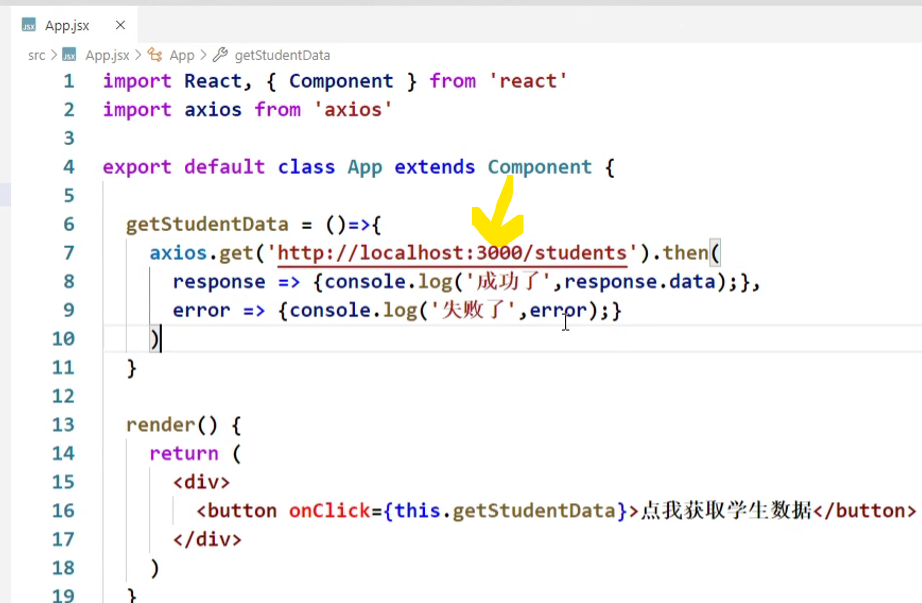
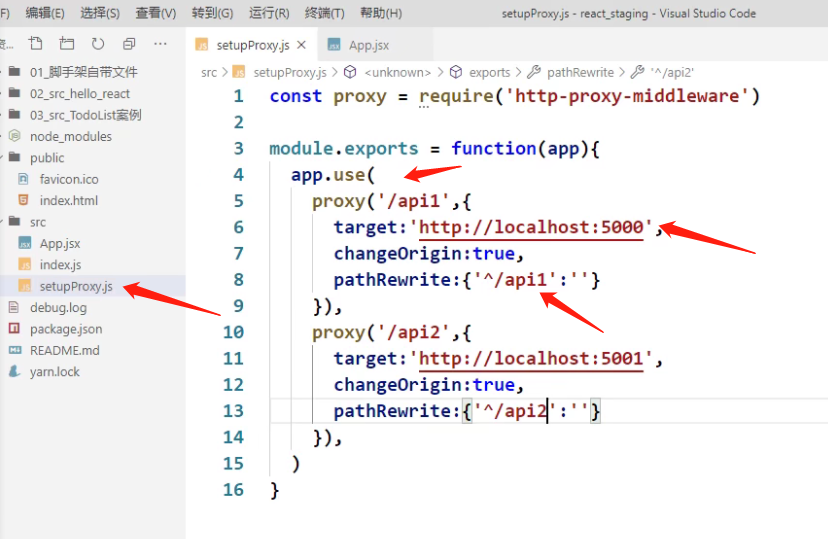

https://www.bilibili.com/video/BV1wy4y1D7JT?p=65

# 61 对props进行限制

要安装相关库

```javascript
import PropTypes from 'prop-types'
```


# 62 删除一个todo(还没看)

# 63 实现底部功能(还没看)

# 64 总结todolist案例(还没看)

# 65 脚手架配置代理_方法一

**针对单个server**


- axios: promise风格
  - 返回的时候不是把真正的数据返回给你，是返回了一个promise实例对象

- 为什么学习react？
  - 为了尽可能的减少自己去操作dom，我们只是更新状态，改数据，react帮我们转成虚拟dom，进而转成真实dom，然后放到页面

**React的核心就是你别自己操作dom，你却在react中引入了一个专门操作dom的jquery。你觉得这合适吗？**


- 3000端口给5000端口发请求，跨域了

- 到底是因为跨域，导致我的ajax请求不能发送，还是因为说因为跨域，我的ajax请求能发送，但是数据回不来？
  - 答案是后者


- 怎么解决跨域问题？
  - 在react脚手架里面通过**代理**去解决
  - 所谓代理就是出现一个中间人，中间人也是开在3000端口上的，（3000端口跑了一个脚手架，其实也开了另外一台非常微小的服务器）
  - 
- 为什么'中3000'能接收到'server 5000的'数据？
  - 因为‘中3000’没有ajax引擎，产生跨域本质是因为ajax引擎把响应给拦住了，中间人是通过请求转发的形式，没有ajax引擎，所以说也不存在跨域这个问题
- 怎么去开启**中间人代理服务器**呢？




# 66 脚手架配置代理_方法二

**针对多个server**

setupProxy.js：**名字不能改，react脚手架会自动找到这个配置文件**

- setupProxy文件里面的代码不能用ES6语法，要用CommonJS

  * 因为setupProxy不是给前端代码用于执行的，react脚手架找到这个文件，把它加到webpack配置里面

  * webpack里面用的都是node里的语法，都是CommonJS





# 67 github搜索案例_静态组件

没啥用

# 68 github搜索案例_axios发送请求

# 69 github搜索案例_展示数据

https://www.bilibili.com/video/BV1wy4y1D7JT/?p=69&spm_id_from=pageDriver&vd_source=a7089a0e007e4167b4a61ef53acc6f7e

兄弟组件通信

# 70 github搜索案例_完成案例

