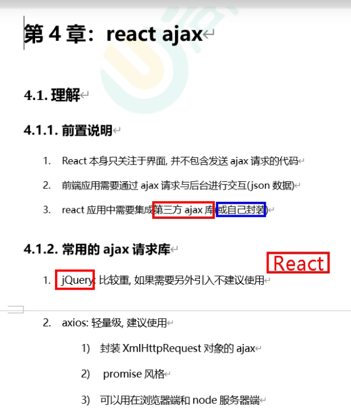
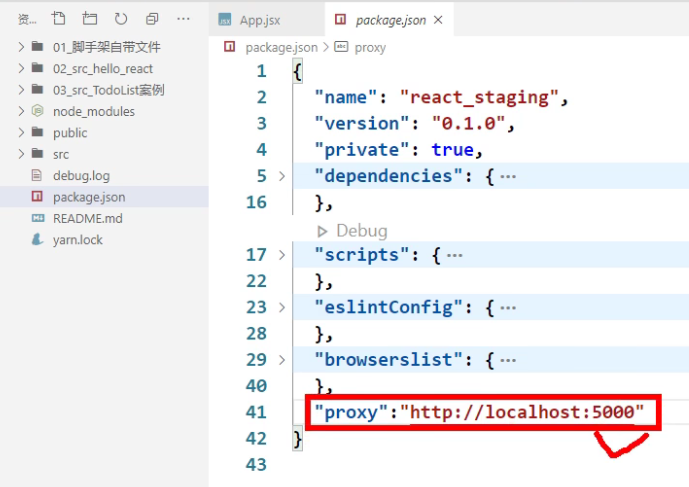
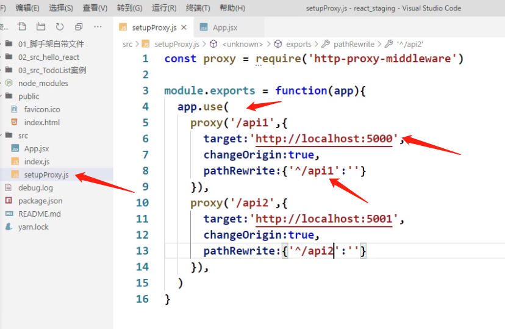
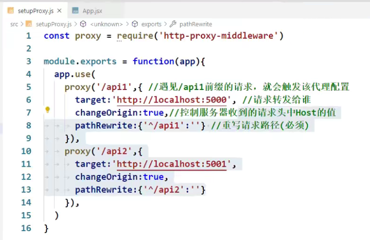

https://www.bilibili.com/video/BV1wy4y1D7JT?p=65

# 61 对props进行限制

# 62 删除一个todo

# 63 实现底部功能

# 64 总结todolist案例

# 65 脚手架配置代理_方法一

**针对单个server**

**React的核心就是你别自己操作dom，你却在react中引入了一个专门操作dom的jquery。你觉得这合适吗？**

# 66 脚手架配置代理_方法二！！！！！！

**针对多个server**

setupProxy.js

**名字不能改，react脚手架会自动找到这个配置文件**

setupProxy文件里面的代码不能用ES6语法，要用CommonJS。

* 因为setupProxy不是给前端代码用于执行的，react脚手架找到这个文件，把它加到webpack配置里面
* webpack里面用的都是node里的语法，都是CommonJS

 

# 67 github搜索案例_静态组件

6min处

# 68 github搜索案例_axios发送请求

# 69 github搜索案例_展示数据

# 70 github搜索案例_完成案例

