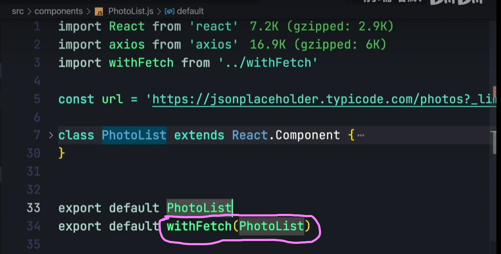
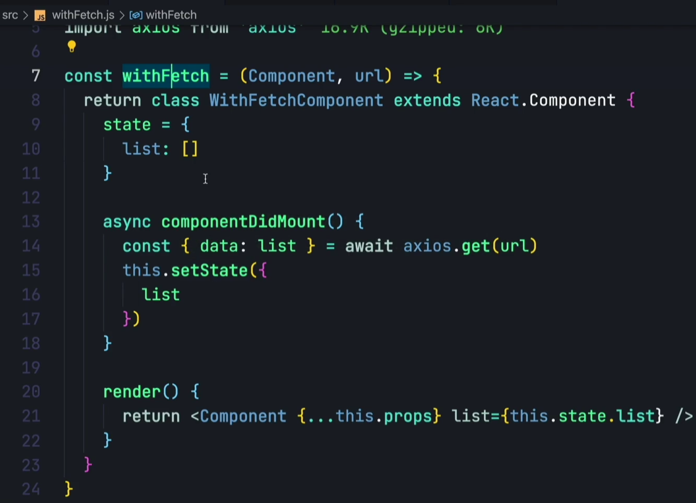
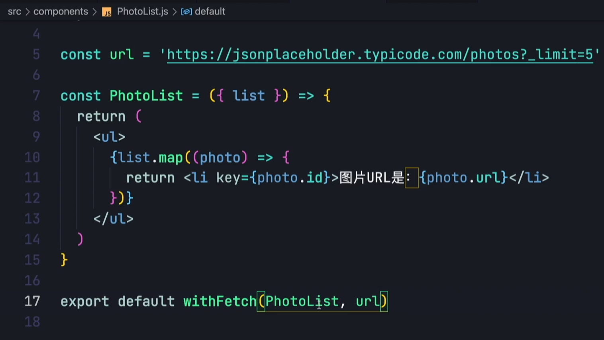

# [1. 使用高阶组件HOC提取组件间公共逻辑](https://www.bilibili.com/video/BV1Zm4y1o7ki/?spm_id_from=333.337.search-card.all.click&vd_source=a7089a0e007e4167b4a61ef53acc6f7e)

|  |  |
| ------------------------------------------------------------ | ------------------------------------------------------------ |
|                                                              |  |

# [2. 高阶组件](https://www.bilibili.com/video/BV18T4y1w7nF/?spm_id_from=333.337.search-card.all.click&vd_source=a7089a0e007e4167b4a61ef53acc6f7e)

https://zh-hans.legacy.reactjs.org/docs/higher-order-components.html

> 高阶组件（HOC）是 React 中用于复用组件逻辑的一种高级技巧。HOC 自身不是 React API 的一部分，它是一种基于 React 的组合特性而形成的设计模式
