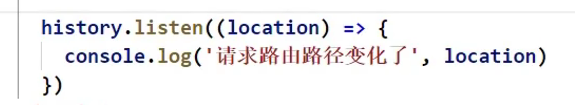

https://www.bilibili.com/video/BV1wy4y1D7JT?p=71&spm_id_from=pageDriver

# 71 消息订阅与发布机制

兄弟组件间的通信

# 72 fetch 发送请求（没看完）

https://www.bilibili.com/video/BV1wy4y1D7JT/?p=72&spm_id_from=pageDriver&vd_source=a7089a0e007e4167b4a61ef53acc6f7e

9min处

# 73 总结github搜索案例

# 74 对SPA应用的理解

single page application

# 75 对路由的理解

浏览器的路径怎么变成/test呢？

# 76 前端路由原理

前端路由依赖浏览器的历史记录history

浏览器的历史记录是一个栈的结构

# 77 路由的基本使用

# 78 路由组件与一般组件

# 79 NavLink的使用

https://www.bilibili.com/video/BV1wy4y1D7JT/?p=79&spm_id_from=pageDriver&vd_source=a7089a0e007e4167b4a61ef53acc6f7e

如果用Link，就意味着你所写的路由链接不带有高亮效果；

如果想高亮，用Link的升级版，NavLink

# 80 封装NavLink组件

https://www.bilibili.com/video/BV1wy4y1D7JT/?p=80&spm_id_from=pageDriver&vd_source=a7089a0e007e4167b4a61ef53acc6f7e

升级写法：

再升级：

