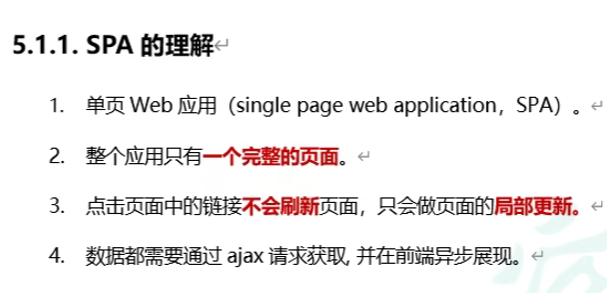
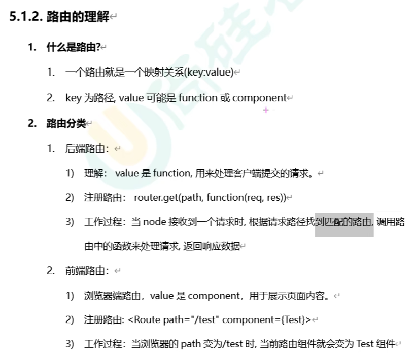
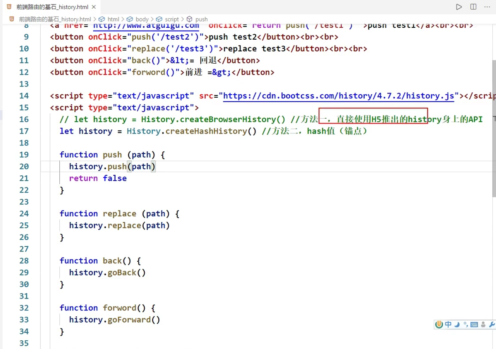
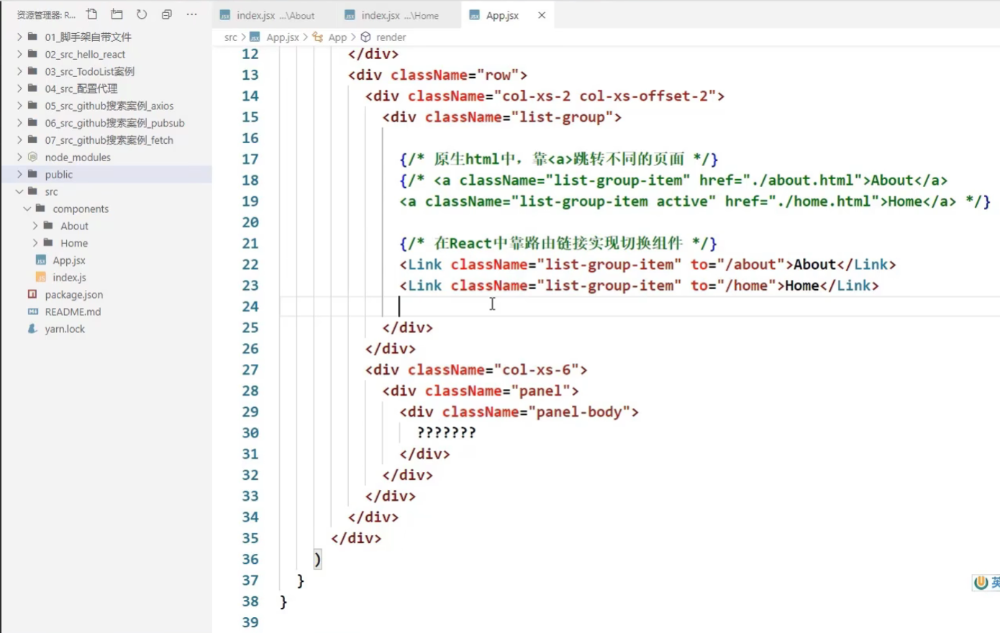
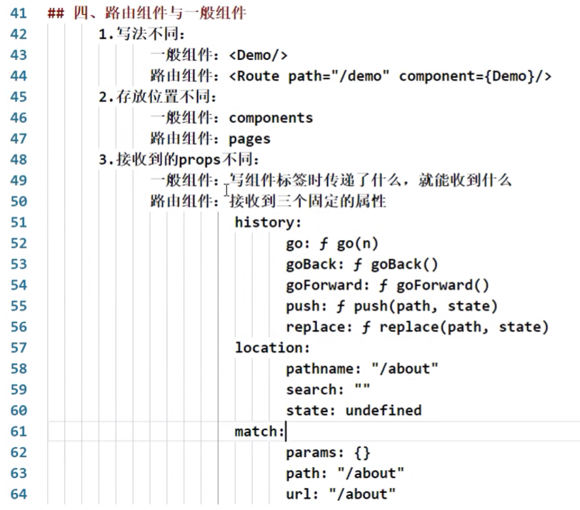

https://www.bilibili.com/video/BV1wy4y1D7JT?p=71&spm_id_from=pageDriver

# 71 消息订阅与发布机制

兄弟组件间的通信

# 72 fetch 发送请求

# 73 总结github搜索案例

# 74 对SPA应用的理解

single page application

# 75 对路由的理解

浏览器的路径怎么变成/test呢？

# 76 前端路由原理

前端路由依赖浏览器的历史记录history

浏览器的历史记录是一个栈的结构

# 77 路由的基本使用

# 78 路由组件与一般组件

# 79 NavLink的使用

# 80 封装NavLink组件

