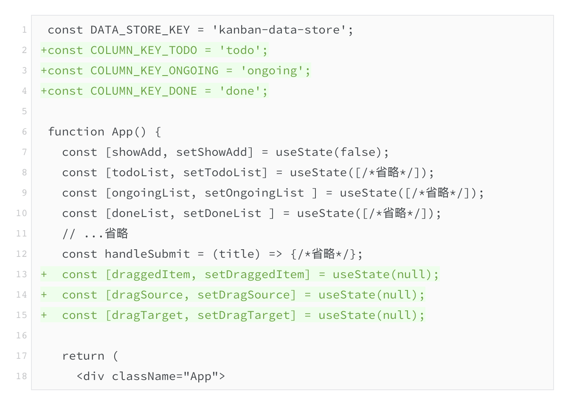

# 1. React函数组件和类组件的区别

|      | 函数组件            | 类组件       |
| ---- | ------------------- | ------------ |
|      | 没有生命周期        | 有生命周期   |
|      | 没有this上下文      | 有this上下文 |
|      | 使用Hooks来管理状态 |              |

# [2. Hooks](https://www.bilibili.com/video/BV1iV411b7L1/?spm_id_from=333.337.search-card.all.click&vd_source=a7089a0e007e4167b4a61ef53acc6f7e)

## 2.1 Hooks的理念

## 2.2 Hooks的实现

## 2.3 Hooks的源码

# [3. React性能优化上](https://www.bilibili.com/video/BV1Yr4y1J7oc/?spm_id_from=333.999.0.0&vd_source=a7089a0e007e4167b4a61ef53acc6f7e)

## 1. 为什么React需要性能优化API


## 2. React性能优化应该遵循的法则

> 将**变的部分**与**不变的部分**分离

重看吧！

## 3. 性能优化背后的源码运行机制

# 4. 如何捕获React全局的报错

在React中，全局捕获报错可以通过以下几种方式实现：

### 1. 使用 Error Boundaries

在React中，最常见的方法是使用 **Error Boundaries**（错误边界）。Error Boundaries 是一种React组件，用于捕获其子组件树中的JavaScript错误，记录这些错误，并展示一个回退UI。它们只会捕获其子组件树中的错误，不会捕获自身的错误。

#### 创建 Error Boundary 组件

首先，你需要创建一个 Error Boundary 组件。这个组件需要实现 `componentDidCatch` 生命周期方法来捕获错误，并且实现 `static getDerivedStateFromError` 方法来更新状态以显示备用UI。

```javascript
import React, { Component } from 'react';

class ErrorBoundary extends Component {
  constructor(props) {
    super(props);
    this.state = { hasError: false };
  }

  static getDerivedStateFromError() {
    // 更新 state，使下一个渲染可以显示降级 UI
    return { hasError: true };
  }

  componentDidCatch(error, info) {
    // 你可以将错误日志上报到服务器
    console.error("Uncaught error:", error, info);
  }

  render() {
    if (this.state.hasError) {
      // 可以渲染任何自定义的降级 UI
      return <h1>Something went wrong.</h1>;
    }

    return this.props.children;
  }
}

export default ErrorBoundary;
```

#### 使用 Error Boundary

将 `ErrorBoundary` 组件包裹在需要捕获错误的组件树周围：

```javascript
import React from 'react';
import ReactDOM from 'react-dom';
import App from './App';
import ErrorBoundary from './ErrorBoundary';

ReactDOM.render(
  <ErrorBoundary>
    <App />
  </ErrorBoundary>,
  document.getElementById('root')
);
```

### 2. 使用 `window.onerror` 和 `window.addEventListener('error')`

对于全局错误，尤其是那些不在 React 组件内部的错误，你可以使用 `window.onerror` 和 `window.addEventListener('error')` 来捕获它们。

#### 使用 `window.onerror`

`window.onerror` 是一个全局事件处理程序，它可以捕获未处理的错误。

```javascript
window.onerror = function(message, source, lineno, colno, error) {
  console.error(`Error: ${message} at ${source}:${lineno}:${colno}`);
  // 你可以将错误日志发送到服务器
  return true; // 阻止浏览器默认的错误处理
};
```

#### 使用 `window.addEventListener('error')`

`window.addEventListener('error')` 也可以用来捕获错误事件：

```javascript
window.addEventListener('error', function(event) {
  console.error(`Error: ${event.message} at ${event.filename}:${event.lineno}:${event.colno}`);
  // 你可以将错误日志发送到服务器
});
```

### 3. 使用 `window.addEventListener('unhandledrejection')`

为了捕获未处理的Promise拒绝（如async/await中的错误），你可以使用 `window.addEventListener('unhandledrejection')`：

```javascript
window.addEventListener('unhandledrejection', function(event) {
  console.error('Unhandled promise rejection:', event.reason);
  // 你可以将错误日志发送到服务器
});
```

### 总结

- **Error Boundaries** 用于捕获 React 组件树中的错误。
- **`window.onerror` 和 `window.addEventListener('error')`** 用于捕获全局错误。
- **`window.addEventListener('unhandledrejection')`** 用于捕获未处理的Promise拒绝。

这些方法可以帮助你全局捕获并处理React应用中的错误，确保应用在遇到错误时能够优雅地降级或记录错误信息。如果你有其他问题或需要更详细的示例，随时告诉我！

# 5. React合成事件

React 使用合成事件（Synthetic Events）而不是直接使用原生 DOM 事件（如 `onclick`）有多个原因，主要包括跨浏览器一致性、性能优化、事件池管理和简化事件处理等方面。下面详细解释了这些原因：

### 1. **跨浏览器一致性**

- **标准化**: 不同浏览器对 DOM 事件的实现可能存在差异，比如事件对象的属性和方法，以及事件的触发时机等。React 的合成事件系统在所有主流浏览器中提供一致的事件处理接口，减少了这些差异带来的不一致性。
  
### 2. **性能优化**

- **事件委托**: React 使用事件委托（event delegation），即在根元素上注册事件处理程序，而不是在每个事件源元素上分别注册。这种做法减少了事件处理程序的数量，从而提高了性能。
  - **事件冒泡**: React 通过事件冒泡机制处理事件，将事件处理程序挂载到顶层（例如 `document`），然后通过事件冒泡捕获和处理子元素的事件。

### 3. **事件池管理**

- **事件池**: React 为每个事件维护一个事件池（event pool），事件对象在事件处理完成后会被复用。这种做法可以减少内存的分配和垃圾回收的压力，提高性能。
  - **复用事件对象**: 事件池复用事件对象，避免了频繁的创建和销毁事件对象，从而减少了内存消耗和性能开销。

### 4. **简化事件处理**

- **统一接口**: React 的合成事件提供了统一的事件处理接口，使得开发者可以使用相同的 API 处理不同类型的事件（如 `onClick`、`onChange`、`onSubmit` 等），简化了事件处理代码。
- **事件合成**: 合成事件将原生事件对象封装为标准化的事件对象，使得事件处理代码更简洁、易于理解和维护。

### 5. **支持 React 特性**

- **事件管理**: React 的合成事件系统与 React 的虚拟 DOM 和生命周期方法紧密集成。它允许 React 在组件更新时正确地处理事件，避免了直接操作 DOM 可能导致的各种问题。
- **异步更新**: React 的合成事件可以与 React 的异步更新机制兼容，确保事件处理程序能够正确地与 React 的渲染流程配合工作。

### 6. **跨环境一致性**

- **环境兼容**: React 的合成事件系统在浏览器环境和非浏览器环境（如 React Native）中提供一致的事件处理接口，使得事件处理代码可以在不同的环境中复用。

### 示例

下面是一个使用 React 合成事件的简单示例：

```jsx
class MyComponent extends React.Component {
  handleClick = (event) => {
    console.log('Button clicked');
    console.log(event.nativeEvent); // 原生事件对象
  };

  render() {
    return <button onClick={this.handleClick}>Click me</button>;
  }
}
```

在上面的代码中，`handleClick` 是一个事件处理函数，它通过合成事件对象处理点击事件。`event.nativeEvent` 可以访问原生事件对象，但事件处理本身是通过 React 的合成事件系统完成的。

### 总结

React 使用合成事件是为了提供跨浏览器一致性、优化性能、管理事件池、简化事件处理，并支持 React 特性。这些优点使得事件处理更加高效、可靠和易于维护。

# [6. React合成事件](http://121.43.36.222/%E8%B5%84%E6%BA%90/14-%E6%9E%81%E5%AE%A2%E6%97%B6%E9%97%B4/%E4%B8%93%E6%A0%8F%E8%AF%BE/261-%E7%8E%B0%E4%BB%A3React%20Web%E5%BC%80%E5%8F%91%E5%AE%9E%E6%88%98/11%EF%BD%9C%E4%BA%8B%E4%BB%B6%E5%A4%84%E7%90%86%EF%BC%9AReact%E5%90%88%E6%88%90%E4%BA%8B%E4%BB%B6%E6%98%AF%E4%BB%80%E4%B9%88%EF%BC%9F%E4%B8%BA%E4%BB%80%E4%B9%88%E4%B8%8D%E7%94%A8%E5%8E%9F%E7%94%9FDOM%E4%BA%8B%E4%BB%B6%EF%BC%9F.md)

在浏览器中，事件处理不是一个新鲜的概念。标准的DOM API中，有完整的DOM事件体系。利用DOM事件，尤其是其捕获和冒泡机制，网页可以实现很多复杂交互。

React里内建了一套名为 **合成事件**（SyntheticEvent）的事件系统，和DOM事件有所区别。不过第一次接触到合成事件概念的开发者，常会有以下疑问：

- 什么是React合成事件？
- 为什么要用合成事件而不直接用原生DOM事件？
- 合成事件有哪些使用场景？
- 有哪些场景下需要使用原生DOM事件？

**合成事件的底层仍然是DOM事件，但隐藏了很多复杂性和跨浏览器时的不一致性**，更易于在React框架中使用。在 `oh-my-kanban` 出现过的受控组件，就是合成事件的重要使用场景之一。此外，我们还会利用其他合成事件为看板卡片加入拖拽功能，顺便了解一下合成事件的冒泡捕获机制

## 什么是React合成事件？

如果你很熟悉原生DOM事件的使用，那你应该很熟悉这种写法：

```xml
<!-- 这是HTML不是JSX -->
<button onclick="handleClick()">按钮</button>
<input type="text" onkeydown="handleKeyDown(event)" />
```

在React中，HTML元素也有类似的、以 `on*` 开头的 **事件处理属性。** 最直接的不同是，这些属性的命名方式遵循驼峰格式（camelCase），如 `onClick`、 `onKeyDown`。在JSX中使用这些属性时，需要传入函数，而不能是字符串：

```javascript
const Component = () => {
  const handleClick = () => {/* ...省略 */};
  const handleKeyDown = evt => {/* ...省略 */};
  return (
    <>
      {/* 这次是JSX了 */}
      <button onClick={handleClick}>按钮</button>
      <input type="text" onKeyDown={evt => handleKeyDown(evt)} />
    </>
  );
};
```

以上面的 `button` 为例，开发者将 `handleClick` 函数传入 `onClick` 属性。在浏览器中，当用户点击按钮时， `handleClick` 会被调用，无论开发者是否需要，React都会传入一个描述点击事件的对象作为函数的第一个参数。而这个对象就是React中的合成事件（SyntheticEvent）。

合成事件是原生DOM事件的一种包装，它 **与原生事件的接口相同**，根据W3c规范，React内部 **规范化**（Normalize） **了这些接口在不同浏览器之间的行为**，开发者不用再担心事件处理的浏览器兼容性问题。

## 合成事件与原生DOM事件的区别

包括刚才提到的，对事件接口在不同浏览器行为的规范化，合成事件与原生DOM事件之间也有着一系列的区别。

### 注册事件监听函数的方式不同

监听原生DOM事件基本有三种方式

1. 与React合成事件类似的，以内联方式写在HTML标签中：

```xml
<button id="btn" onclick="handleClick()">按钮</button>
```

1. 在JS中赋值给DOM元素的事件处理属性：

```javascript
document.getElementById('btn').onclick = handleClick;
```

1. 在JS中调用DOM元素的 `addEventListener` 方法（需要在合适时机调用 `removeEventListener` 以防内存泄漏）：

```javascript
document.getElementById('btn').addEventListener('click', handleClick);
```

而合成事件不能通过 `addEventListener` 方法监听，它的JSX写法等同于JS写法：

```javascript
const Button = () => (<button onClick={handleClick}>按钮</button>);
// 编译为
const Button = () => React.createElement('button', {
  onClick: handleClick
}, '按钮');
```

有时我们需要以捕获方式监听事件，在原生事件中以 `addEventListener` 方法加入第三个参数：

```javascript
div.addEventListener('click', handleClick, true);
```

而在React合成事件中，则需要用在事件属性后面加一个 `Capture` 后缀：

```javascript
() => (<div onClickCapture={handleClick}>...</div>);
```

### 特定事件的行为不同

**React合成事件规范化了一些在各个浏览器间行为不一致，甚至是在不同元素上行为不一致的事件，其中有代表性的是 `onChange`** 

在Chrome或Firefox中，一个文本框 `<input type="text" />` 的 `change` 事件发生在文本框内容被改变、然后失去焦点的时候。不过，对一个下拉框 `<select>` 的 `change` 事件，Chrome和老版本Firefox（v63以前）就有分歧了，前者每次按下键盘箭头键都会触发 `change` 事件，但后者只有下拉框失去焦点时才会触发。

而在React中， `<input>` 、 `<textarea>` 和 `<select>` 三种表单元素的 `onChange` 合成事件被规范成了一致的行为： **在不会导致显示抖动的前提下，表单元素值的改变会尽可能及时地触发这一事件**。

以文本框为例，同样是输入一句话，合成 `change` 事件发生的次数要多于原生的次数，在 `onChange` 事件处理函数被调用时，传入的事件对象参数提供的表单元素值也尽可能是最新的。

顺便提一下，原生 `change` 事件行为的不一致，只是前端领域浏览器兼容性问题的冰山一角。React这样的框架为我们屏蔽了这些疑难杂症，我们在享受便利的同时，也需要知道框架们在负重前行。

除了 `onChange` ，合成事件也规范化了 `onBeforeInput` 、 `onMouseEnter` 、 `onMouseLeave` 、 `onSelect` 。

### 实际注册的目标DOM元素不同

|                         原生DOM事件                          |                        React合成事件                         |
| :----------------------------------------------------------: | :----------------------------------------------------------: |
|                                                              |  |
|  |  |

这一点不影响合成事件处理接口的使用，更多是在讲底层实现

对于下面这个原生DOM事件， `event.currentTarget` 是ID为 `btn` 的按钮：

```javascript
document.getElementById('btn').addEventListener('click', handleClick);
```

但合成事件不一样

```javascript
evt.currentTarget
evt.target
evt.nativeEvent.currentTarget
evt.nativeEvent.target
```

两种事件的 `target` 都是按钮元素本身，合成事件的 `currentTarget` 也是按钮元素，这是符合W3c规范的；但原生事件的 `currentTarget` 不再是按钮，而是React应用的根容器DOM元素 `<div id="root"></div>` ：

这是因为React使用了 **事件代理模式**。React在创建根（ `createRoot` ）的时候，会在容器上监听所有自己支持的原生DOM事件。当原生事件被触发时，React会根据事件的类型和目标元素，找到对应的FiberNode和事件处理函数，创建相应的合成事件并调用事件处理函数。

从表层接口上看，合成事件的属性是符合W3C事件规范的，这就屏蔽了不同浏览器原生DOM事件可能产生的不一致。？？？？？？

## 受控组件与表单

表单处理是前端领域一个常见需求，在React中也是一个重要场景。我们看一下目前 `oh-my-kanban` 项目中唯一的表单代码（省略了部分代码）：

```javascript
const KanbanNewCard = ({ onSubmit }) => {
  const [title, setTitle] = useState('');
  const handleChange = (evt) => {
    setTitle(evt.target.value);
  };
  // ...省略

  return (
    <li>
      <h3>添加新卡片</h3>
      <div>
        <input type="text" value={title} onChange={handleChange} />
      </div>
    </li>
  );
};
```

用户在文本框中输入文本时，会触发 `onChange` 合成事件，调用 `handleChange(evt)` 函数， `handleChange` 函数又会将文本框变更后的值保存在组件state `title` 中，state的变化导致组件重新渲染，文本框的当前值会更新成 `title` ，与刚才的更新值保持一致。

可以看出，这一过程形成了一个闭环。这种 **以React state为单一事实来源**（Single Source of Truth） **，并用React合成事件处理用户交互的组件，被称为“受控组件”**。

除了文本框之外，大部分表单元素，包括单选框、多选框、下拉框等都可以做成受控组件。当这些元素组合成一个表单时，开发者可以很容易获取到任一时刻的表单数据，然后进一步做验证、提交到服务器端等操作。

其实看板新卡片组件里文本框的 `onKeyDown` ，可以看作是提交表单。用户按回车后， `handleKeyDown` 函数会通过 `onSubmit` 属性将表单值传给父组件：

```javascript
const KanbanNewCard = ({ onSubmit }) => {
  const [title, setTitle] = useState('');
  const handleChange = (evt) => {
    setTitle(evt.target.value);
  };
  const handleKeyDown = (evt) => {
    if (evt.key === 'Enter') {
      onSubmit(title);
    }
  };

  return (
    <li>
      <h3>添加新卡片</h3>
      <div>
        <input type="text" value={title}
          onChange={handleChange} onKeyDown={handleKeyDown} />
      </div>
    </li>
  );
};
```

你也可以选择显式地将这些表单元素集中在一个 `<form>` 表单里，这样你就可以利用表单的 `onSubmit` 事件来规范提交表单的时机。但要注意，这里需要禁用掉表单提交事件的默认行为：

```javascript
const Form = () => {
  // ...省略
  const handleSubmit(evt) {
    console.log('表单元素state');
    evt.preventDefault();
  }
  return (
    <form onSubmit={handleSubmit}>
      {/* 省略 */}
      <input type="submit" value="提交" />
    </form>
  );
};
```

后续课程中还会多次涉及到受控组件和表单处理，我们在此暂不继续展开。

## 合成事件的冒泡与捕获

接下来，我们就利用刚学到的React事件处理，上手继续为 `oh-my-kanban` 添加功能，其间也会涵盖合成事件的冒泡和捕获机制。

如果你对第3节课末尾提出的需求还有印象，这个坑我们终于要填了。

> 在三个看板列间，还有进一步的交互。
>
> 1. 对于任意看板列里的任意卡片，可以用鼠标拖拽到其他的看板列；
> 2. 在释放拖拽时，被拖拽的卡片插入到目标看板列，并从原看板列中移除。

我们简单分析一下这个需求。将被拖拽的项目是看板卡片，有效的放置目标是看板列，放置成功时会移动这张卡片。这样的交互对应的数据逻辑如下：

- 被拖拽的卡片对应的数据，是待处理、进行中或已完成数组的其中一个成员；
- 放置成功时，该成员会从源头数组中移除，同时会添加到目标数组中。

那基本上就可以确定这个需求的实现方法了：

- 在看板列和看板卡片组件元素上，需要分别监听拖拽事件；
- 在组件状态中应记录当前被拖拽卡片的数据，以及哪个看板列对应的的数组是拖拽源头，哪个是放置目标。

现在来到 `oh-my-kanban` 的 `src/App.js` 文件，让我们先为看板卡片 `KanbanCard` 组件的 `<li>` 元素添加 `draggable` 和 `onDragStart` 属性：


然后为看板列KanbanColumn组件的 `<section>` 元素添加 `onDragOver` 、 `onDragLeave`、 `onDrop` 、 `onDragEnd` 属性：

```javascript
const KanbanColumn = ({ children, bgColor, title }) => {
  return (
    <section
      onDragOver={(evt) => {
        evt.preventDefault();
        evt.dataTransfer.dropEffect = 'move';
      }}
      onDragLeave={(evt) => {
        evt.preventDefault();
        evt.dataTransfer.dropEffect = 'none';
      }}
      onDrop={(evt) => {
        evt.preventDefault();
      }}
      onDragEnd={(evt) => {
        evt.preventDefault();
      }}
      css={css`...省略`}
    >
      <h2>{title}</h2>
      <ul>{children}</ul>
    </section>
  );
};
```

这时在浏览器里已经可以拖拽卡片了，但放置时貌似没什么反应，动图展示如下：


接下来，需要在根部的 `App` 组件里创建三个新的state，分别是 `draggedItem` 、 `dragSource` 、 `dragTarget` ，以及作为 `dragSource` 和 `dragTarget` 枚举值的三个 `COLUMN_KEY_*` 常量：



这时我们需要在看板卡片 `KanbanCard` 组件 `onDragStart` 事件中更新 draggedItem状态的值，但这个state是在App组件中维护的，那么如何才能让KanbanCard修改它呢？

是的，跟之前的onSubmit一样，将更新函数通过props传给KanbanCard，KanbanCard会在内部的onDragStart中调用它：


上面代码只展示了todoList，另外两个组件列，也就是ongoingList和doneList也要做相同处理，你可以自己上手试一试。

然后来看，如何在看板列KanbanColumn中设置 `dragSource` 和 `dragTarget` 。

为了让KanbanColumn内部的逻辑更清晰些，我没有把 `dragSource` 和 `dragTarget` 直接传给KanbanColumn，而是为它添加了两个修改布尔值的函数props，也就是setIsDragSource 和 setIsDragTarget：


上面的KanbanCard的代码中， `<li>` 已经监听过 `onDragStart` 事件，在KanbanColumn的 `<section>` 中是第二次出现了。在运行时，由于HTML元素的 `onDragStart` 事件在触发后会 **冒泡**（Event Bubbling）到祖先元素，所以这两个事件处理函数都会执行。

对应的，在App组件中需要设置这些props：

```diff
 const DATA_STORE_KEY = 'kanban-data-store';
 const COLUMN_KEY_TODO = 'todo';
 const COLUMN_KEY_ONGOING = 'ongoing';
 const COLUMN_KEY_DONE = 'done';

 function App() {
   // ...省略
   const [draggedItem, setDraggedItem] = useState(null);
   const [dragSource, setDragSource] = useState(null);
   const [dragTarget, setDragTarget] = useState(null);

   return (
     {/* 省略 */}
-    <KanbanColumn bgColor={COLUMN_BG_COLORS.todo} title={
       /* ... */
-    }>
+    <KanbanColumn
+      bgColor={COLUMN_BG_COLORS.todo}
+      title={
         /* ... */
+      }
+      setIsDragSource={(isSrc) => setDragSource(isSrc ? COLUMN_KEY_TODO : null)}
+      setIsDragTarget={(isTgt) => setDragTarget(isTgt ? COLUMN_KEY_TODO : null)}
+    >
```

以上的代码只展示了待处理列的改法，进行中和已完成两列分别对应常量COLUMN_KEY_ONGOING和COLUMN_KEY_DONE，需要请你补全它们的setIsDragSource 和 setIsDragTarget。

这时我们借助React Developer Tools看看拖拽是如何修改state的，动图效果展示如下：

赞，符合预期。好了，最后也是最重要的一步，是加入onDrop的数据处理逻辑。首先是KanbanColumn追加一个onDrop属性：

```diff
 const KanbanColumn = ({
   children,
   bgColor,
   title,
   setIsDragSource = () => {},
   setIsDragTarget = () => {},
+  onDrop
 }) => {
   return (
     <section
       onDragStart={() => setIsDragSource(true)}
       onDragOver={(evt) => {
         evt.preventDefault();
         evt.dataTransfer.dropEffect = 'move';
         setIsDragTarget(true);
       }}
       onDragLeave={(evt) => {
         evt.preventDefault();
         evt.dataTransfer.dropEffect = 'none';
         setIsDragTarget(false);
       }}
       onDrop={(evt) => {
         evt.preventDefault();
+        onDrop && onDrop(evt);
       }}
       onDragEnd={(evt) => {
         evt.preventDefault();
         setIsDragSource(false);
         setIsDragTarget(false);
       }}
       css={css`...省略`}
     >
       <h2>{title}</h2>
       <ul>{children}</ul>
     </section>
   );
 };
```

然后在App组件中定义handleDrop函数，当前面的三个state满足条件时，修改源数组和目标数组，通过onDrop属性把同一个函数分别传递给三个KanbanColumn。

在这里，为了减少代码重复，我在函数内部给三个数组的更新函数套了一个索引对象：

```javascript
const COLUMN_KEY_TODO = 'todo';
const COLUMN_KEY_ONGOING = 'ongoing';
const COLUMN_KEY_DONE = 'done';

function App() {
  const [showAdd, setShowAdd] = useState(false);
  const [todoList, setTodoList] = useState([/*省略*/]);
  const [ongoingList, setOngoingList ] = useState([/*省略*/]);
  const [doneList, setDoneList ] = useState([/*省略*/]);
  // 省略
  const handleSubmit = (title) => {/*省略*/};
  const [draggedItem, setDraggedItem] = useState(null);
  const [dragSource, setDragSource] = useState(null);
  const [dragTarget, setDragTarget] = useState(null);
  const handleDrop = (evt) => {
    if (!draggedItem || !dragSource || !dragTarget || dragSource === dragTarget) {
      return;
    }
    const updaters = {
      [COLUMN_KEY_TODO]: setTodoList,
      [COLUMN_KEY_ONGOING]: setOngoingList,
      [COLUMN_KEY_DONE]: setDoneList
    }
    if (dragSource) {
      updaters[dragSource]((currentStat) =>
        currentStat.filter((item) => !Object.is(item, draggedItem))
      );
    }
    if (dragTarget) {
      updaters[dragTarget]((currentStat) => [draggedItem, ...currentStat]);
    }
  };

  return (
    <div className="App">
      {/* 省略 */}
      <KanbanColumn
        bgColor={COLUMN_BG_COLORS.ongoing}
        title="进行中"
        setIsDragSource={(isDragSource) => setDragSource(isDragSource ? COLUMN_KEY_ONGOING : null)}
        setIsDragTarget={(isDragTarget) => setDragTarget(isDragTarget ? COLUMN_KEY_ONGOING : null)}
        onDrop={handleDrop}
      >
      {/* 省略 */}
    </div>
  );
}
```

现在让我们在浏览器中看看效果，动态展示如下：


恭喜你，大功告成！到目前为止，这个看板的功能总算是形成一个闭环了。这么重要的里程碑，请你务必提交到你的代码仓库里（也欢迎把你的代码链接分享在留言区）。

不过，刚才我们提到了合成事件的事件冒泡，你可能会问，那有 **事件捕获（Event Capture）** 的例子吗？你可以把src/App.js文件中的 `onDragStart` 全局替换成 `onDragStartCapture` ，然后看看效果。

其实从交互上看不出区别，只是两个组件对应的事件处理函数的执行顺序颠倒了过来。关于事件冒泡和事件捕获的使用场景，后续的课程中还会涉及到。

## 什么时候使用原生DOM事件？

一般情况下，React的合成事件已经能满足你的大部分需求了，有两种情况例外。

1. 需要监听React组件树之外的DOM节点的事件，这也包括了window和document对象的事件。注意注意的是，在组件里监听原生DOM事件，属于典型的副作用，所以请务必在useEffect中监听，并在清除函数中及时取消监听。如：

```javascript
useEffect(() => {
  window.addEventListener('resize', handleResize);
  return function cleanup() {
    window.removeEventListener('resize', handleResize);
  };
}, []);
```

1. 很多第三方框架，尤其是与React异构的框架，在运行时会生成额外的DOM节点。在React应用中整合这类框架时，常会有非React的DOM侵入React渲染的DOM树中。当需要监听这类框架的事件时，要监听原生DOM事件，而不是React合成事件。这同样也是useEffect或useLayoutEffect的领域。

   当然，只要你知道原理，也完全可以用原生DOM事件加上一些特殊处理来替代合成事件，但这种做法就没那么“React”了。

## 小结

这节课我们介绍了React合成事件，知道了合成事件是原生DOM事件的一种规范化的封装，也了解了它在注册监听方式、onChange等特定事件的行为、实际注册的目标DOM这三个方面与原生DOM事件的区别。

然后在oh-my-kanban代码基础上，我们进一步学习了受控组件和表单处理，也上手为看板加入了卡片拖拽的功能，并顺路实践了合成事件的事件冒泡和事件捕获。

最后，我们还列举了一些合成事件力不能及，必须监听原生DOM事件的场景。按照老规矩，这里我也附上本节课所涉及的项目源代码： https://gitee.com/evisong/geektime-column-oh-my-kanban/releases/tag/v0.11.0。

下节课我们将迎来组件逻辑开发的重头戏——单向数据流，了解数据如何在React组件中流转，学习如何设计和操控React应用的数据流。

## 思考题

1. 这节课我们讲到了合成事件的事件冒泡和事件捕获，我想请你设计一些实验，来验证事件处理函数在父子组件间的执行顺序。另外，我们也提到了在事件处理函数中可以通过调用 `event.stopPropogation()` 来阻止事件进一步冒泡或捕获，请你思考一下什么场景下会用到。

2. 我们时不时也回来关注一下性能，我想请你在React Developer Tools中打开“组件渲染时高亮变化”。然后观察一下在拖拽操作期间，都有哪些组件做了无谓的渲染。

   

# [7. React事件机制](https://www.bilibili.com/video/BV1xT4y1b7gB/?spm_id_from=333.337.search-card.all.click&vd_source=a7089a0e007e4167b4a61ef53acc6f7e)

# 8. useState和useRef的区别

```jsx
const App = () => {
    const [count, setCount] = useState(0);
    setCount(5);
    return (
        <div>{count}</div>
    )
}
```

报错：


分析：

- 每次调用`setCount`更新状态时，React都会重新渲染组件。上面代码中，由于`setCount(5)`是在组件渲染期间直接调用的，React会进入一个无限循环渲染的状态。

解决：

- 通常在`useEffect`中使用`setCount`以避免在渲染时直接修改状态，防止无限循环

```jsx
const App = () => {
    const count = useRef(0);
    count.current = 5

    return (
        <div>{count.current}</div>
    )
}
```

# 9. useCallback和useMemo的基础使用

`useCallback` 和 `useMemo` 是 React 的两个 Hook，用于优化组件性能。它们的作用是缓存函数和计算结果，避免不必要的重新渲染。以下是它们的基础使用示例。

### `useCallback`

`useCallback` 用于缓存函数实例，以避免在每次组件渲染时重新创建相同的函数。

**基本用法**:

```jsx
import React, { useCallback, useState } from 'react';

function MyComponent() {
  const [count, setCount] = useState(0);

  // 使用 useCallback 缓存 increment 函数
  const increment = useCallback(() => {
    setCount((prevCount) => prevCount + 1);
  }, []); // 依赖项为空数组，函数不会重新创建

  return (
    <div>
      <p>Count: {count}</p>
      <button onClick={increment}>Increment</button>
    </div>
  );
}

export default MyComponent;
```

**解释**:

- `useCallback` 用于缓存 `increment` 函数的实例，只有在其依赖项（这里为空数组）发生变化时，才会重新创建函数。
- 这样可以避免在每次组件重新渲染时都创建新的 `increment` 函数，有助于减少子组件的重新渲染。

### `useMemo`

`useMemo` 用于缓存计算结果，以避免在每次渲染时重复计算。

**基本用法**:

```jsx
import React, { useMemo, useState } from 'react';

function MyComponent() {
  const [count, setCount] = useState(0);
  const [name, setName] = useState('React');

  // 使用 useMemo 缓存计算结果
  const computedValue = useMemo(() => {
    console.log('Computing value...');
    return count * 2; // 假设这是一个昂贵的计算
  }, [count]); // 仅当 count 发生变化时重新计算

  return (
    <div>
      <p>Count: {count}</p>
      <p>Computed Value: {computedValue}</p>
      <button onClick={() => setCount(count + 1)}>Increment Count</button>
      <button onClick={() => setName(name === 'React' ? 'Redux' : 'React')}>Change Name</button>
    </div>
  );
}

export default MyComponent;
```

**解释**:
- `useMemo` 缓存了 `computedValue` 的计算结果，只有在 `count` 发生变化时才重新计算。
- 当 `name` 发生变化时，`computedValue` 不会重新计算，从而提高性能。

### 总结

- **`useCallback`**: 缓存函数实例，防止在每次渲染时创建新的函数，适用于传递回调函数的场景。
- **`useMemo`**: 缓存计算结果，防止在每次渲染时重复计算，适用于昂贵的计算或需要避免不必要计算的场景。

# [10. useCallback && useMemo](https://www.bilibili.com/video/BV1uG411V7m3/?spm_id_from=333.337.search-card.all.click&vd_source=a7089a0e007e4167b4a61ef53acc6f7e)

这两个hooks主要是跟性能优化相关的

- useMemo：保持一个数组或者保持一些值不变
- useCallback：保持一个函数的不变性

[useCallback和useMemo相关的技术文章](https://www.joshwcomeau.com/react/usememo-and-usecallback/)

> memorization:
>
> notorious：well known for being bad 臭名昭著的
>
> make sense of：理解，弄懂
>
> scratch your head：to think hard in order to find an answer to sth 苦苦琢磨，冥思苦想
>
> unpacking
>
> optimize：优化
>
> prime number：素数
>
> prime
>
> run into：遇到困难
>
> gratuitously：不必要地
>
> sluggish：缓慢的，性能欠佳的

The fundamental idea with `useMemo` is that it allows us to *“remember”* a computed value between renders.

`useMemo`: 让我们在不同渲染之间保存一个已经计算好的值。比如说我在第一次渲染的时候已经计算好了一个值，那我在第二次渲染的时候能不能不再进行这个运算，而是直接用第一次渲染时候的值

# 11. React多次调用setState, React内部源码是如何维护的

在 React 中，多次调用 `setState` 会触发组件状态的更新，然而，React 并不会立即同步更新状态，而是对状态更新请求进行批处理。这种机制背后的设计主要为了提高性能，减少不必要的渲染。

### 1. **批处理更新 (Batching Updates)**

React 中，多个 `setState` 调用不会立即导致组件的重新渲染。相反，**React 会将多次 `setState` 调用合并为一个批次处理**。这意味着在一次事件循环中，所有的 `setState` 调用都会被推迟，直到事件处理完毕之后再统一执行。

```javascript
class MyComponent extends React.Component {
  constructor(props) {
    super(props);
    this.state = { count: 0 };
  }

  handleClick = () => {
    this.setState({ count: this.state.count + 1 });
    this.setState({ count: this.state.count + 1 });
    this.setState({ count: this.state.count + 1 });
  };

  render() {
    return (
      <div>
        <button onClick={this.handleClick}>Increase</button>
        <p>{this.state.count}</p>
      </div>
    );
  }
}
```

在上面的代码中，`handleClick` 中的三次 `setState` 调用会被合并处理，最终只会触发一次重新渲染。React 会对传递给 `setState` 的新状态进行合并处理（使用 **对象合并** 或 **函数式更新**）。

### 2. **队列机制**

在 React 内部，每次调用 `setState` 时，React 会将这个状态更新请求推入一个**更新队列**。而这个队列会在适当的时候（通常是在当前的事件循环结束时）统一处理：

- **对象合并**：**当多个 `setState` 传入的是对象时，React 会合并这些对象，将所有更新整合成一个**。
  
  ```javascript
  this.setState({ a: 1 });
  this.setState({ b: 2 });
  // 最终的状态将是：{ a: 1, b: 2 }
  ```

- **函数式更新**：**如果 `setState` 使用了回调函数形式，React 会按顺序执行这些回调函数，并依次传递前一次更新后的状态**。

  ```javascript
  this.setState((prevState) => ({ count: prevState.count + 1 }));
  this.setState((prevState) => ({ count: prevState.count + 1 }));
  this.setState((prevState) => ({ count: prevState.count + 1 }));
  ```

  在这种情况下，`count` 最终会增加 3。

### 3. **渲染过程**

当事件循环结束后，React 会根据批处理的状态更新，决定是否需要重新渲染组件树。如果需要重新渲染，React 会调度一个新的渲染任务，并触发虚拟 DOM 的对比和更新过程。

### 4. **React Fiber 架构**

React 的 Fiber 架构进一步优化了状态更新的过程。Fiber 使得 React 能够将更新任务分片（slice）处理，从而提高响应性。即便有大量的 `setState` 调用，React 也能优先处理更重要的更新任务，从而避免用户界面卡顿。

### 5. **异步与同步的区别**

在 React 18 及其之后版本，React 引入了 `Concurrent Mode`（并发模式），使得 `setState` 的行为在某些情况下变得异步。例如，`useTransition` 或 `startTransition` 可以将更新标记为低优先级，从而让 React 推迟这些更新。

### 总结

React 内部通过批处理、更新队列和 Fiber 架构来高效处理多次 `setState` 调用。通过这些机制，React 能够减少不必要的重新渲染，优化性能，并确保应用能够保持流畅的用户体验。

# 12. react多次调用setState修改同一个状态, react内部源码是如何维护的

当你在 React 中多次调用 `setState` 修改同一个状态时，React 内部会通过以下步骤来维护和处理这些状态更新：

### 1. **状态更新请求的入队**

每次调用 `setState` 时，React 并不会立即更新组件的状态，而是会将每个状态更新请求加入一个更新队列中。这些更新请求会以链表的形式存储在组件的 `updateQueue` 中。每个 `setState` 调用生成一个更新对象，这些对象包含了要更新的状态部分。

```javascript
this.setState({ count: this.state.count + 1 });
this.setState({ count: this.state.count + 1 });
this.setState({ count: this.state.count + 1 });
```

在上面的例子中，三次 `setState` 调用会依次将三条更新请求（每次 `setState` 都生成一个新的更新对象）加入 `updateQueue`。

### 2. **批处理机制**

React 会在适当的时候（例如当前事件循环结束后）统一处理这些更新。批处理机制会遍历 `updateQueue`，然后按顺序应用每个更新对象，依次更新状态。

- **对象合并**：如果 `setState` 传入的是对象，React 会合并这些对象。例如：

  ```javascript
  this.setState({ count: 1 });
  this.setState({ count: 2 });
  ```

  在批处理过程中，React 会将这两个状态合并，最终结果是 `{ count: 2 }`。React 内部实现中，每个更新请求都会按照入队顺序应用到前一个状态上。

### 3. **函数式更新**

当你使用函数式的 `setState` 时，React 会依次调用每个回调函数，并将前一次计算得到的状态作为参数传递给下一次 `setState`：

```javascript
this.setState((prevState) => ({ count: prevState.count + 1 }));
this.setState((prevState) => ({ count: prevState.count + 1 }));
this.setState((prevState) => ({ count: prevState.count + 1 }));
```

在这种情况下，React 内部会维护每个更新函数的调用顺序，确保每次 `setState` 都使用的是前一次更新后的状态。最终，`count` 将会增加 3。

### 4. **状态合并**

在批处理完成后，React 会将合并后的状态应用到组件的 `state` 上，并决定是否需要触发重新渲染。

- **如果所有 `setState` 调用修改的是同一个状态变量**，比如 `count`，React 会按照 `updateQueue` 中的顺序依次处理这些更新，最终得到合并后的状态。
- **如果多个 `setState` 调用的更新影响不同的状态变量**，React 会将它们合并到最终的 `state` 对象中。

### 5. **触发重新渲染**

一旦所有状态更新完成，React 会检查是否需要重新渲染组件。如果需要，React 将调度一次重新渲染，触发虚拟 DOM 的 diff 过程，最终更新真实 DOM。

### 6. **React Fiber 的作用**

在 React Fiber 架构下，所有的更新操作都是被分片处理的，这意味着 React 可以优先处理更重要的任务，比如用户输入事件，即便有多个 `setState` 调用要处理，React 也能保持高效的性能。

### 总结

React 内部通过维护一个更新队列，将多次 `setState` 调用进行批处理。当你多次调用 `setState` 修改同一个状态时，React 会依次处理这些更新请求，并最终得到一个合并后的状态。这种机制确保了 React 的性能，同时保证状态更新的正确性。


