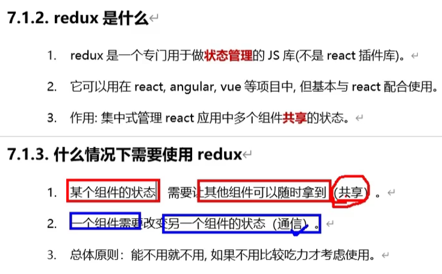
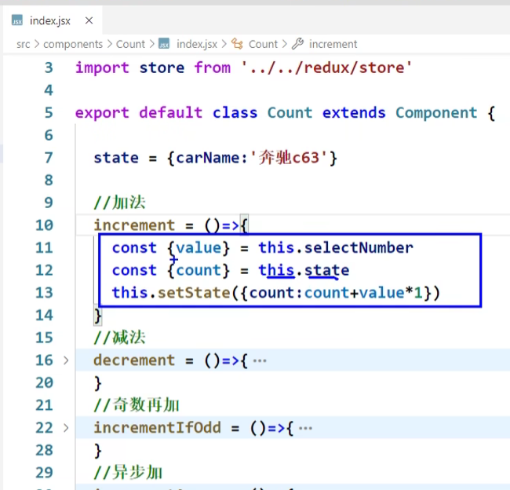

# 91 编程式路由导航

# 92 withRouter的使用

# 93 BrowserRouter与HashRouter

# 94 antd的基本使用

# 95 antd样式的按需引入

# 96 antd自定义主题

# 97 redux简介

https://www.bilibili.com/video/BV1wy4y1D7JT?p=97&vd_source=a7089a0e007e4167b4a61ef53acc6f7e

# 98 redux工作流程

https://www.bilibili.com/video/BV1wy4y1D7JT?p=98&spm_id_from=pageDriver&vd_source=a7089a0e007e4167b4a61ef53acc6f7e

# 99 求和案例 纯react版

https://www.bilibili.com/video/BV1wy4y1D7JT?p=99&spm_id_from=pageDriver&vd_source=a7089a0e007e4167b4a61ef53acc6f7e

# 100 求和案例 redux精简版

https://www.bilibili.com/video/BV1wy4y1D7JT?p=100&spm_id_from=pageDriver&vd_source=a7089a0e007e4167b4a61ef53acc6f7e

