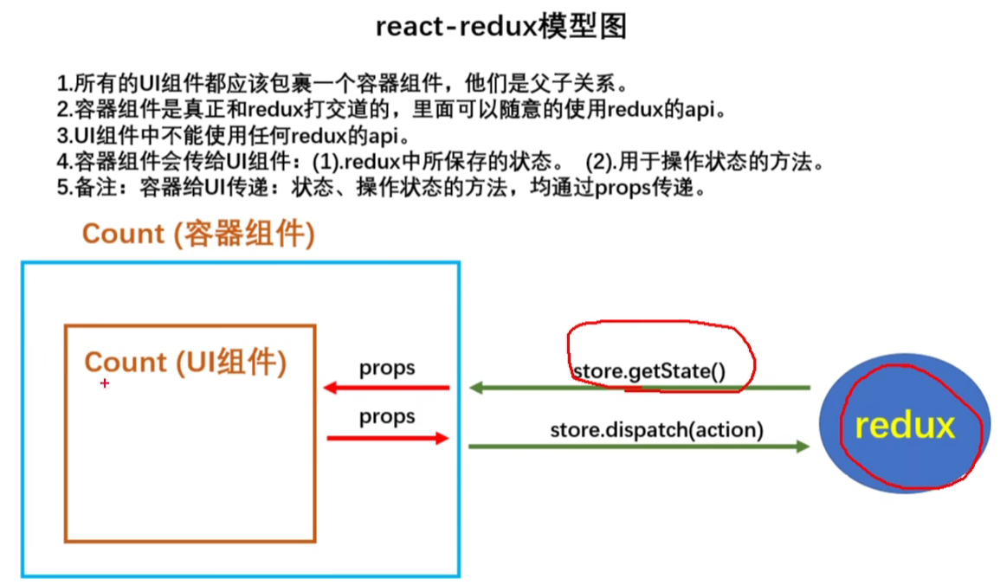

# 101 求和案例 redux完整版

https://www.bilibili.com/video/BV1wy4y1D7JT?p=101&spm_id_from=pageDriver&vd_source=a7089a0e007e4167b4a61ef53acc6f7e

# 102 求和案例 异步action版

https://www.bilibili.com/video/BV1wy4y1D7JT?p=102&spm_id_from=pageDriver&vd_source=a7089a0e007e4167b4a61ef53acc6f7e

# 103 对react-redux的理解

https://www.bilibili.com/video/BV1wy4y1D7JT/?p=103&spm_id_from=pageDriver&vd_source=a7089a0e007e4167b4a61ef53acc6f7e

# 104 连接容器组件与UI组件

https://www.bilibili.com/video/BV1wy4y1D7JT/?p=104&spm_id_from=pageDriver&vd_source=a7089a0e007e4167b4a61ef53acc6f7e

# 105 react-redux基本使用

# 106 优化1——简写mapDispatch

# 107 优化2——Provider组件的使用

# 108 整合UI组件与容器组件

# 109 数据共享——编写Person组件

# 110 数据共享——编写Person的Reducer