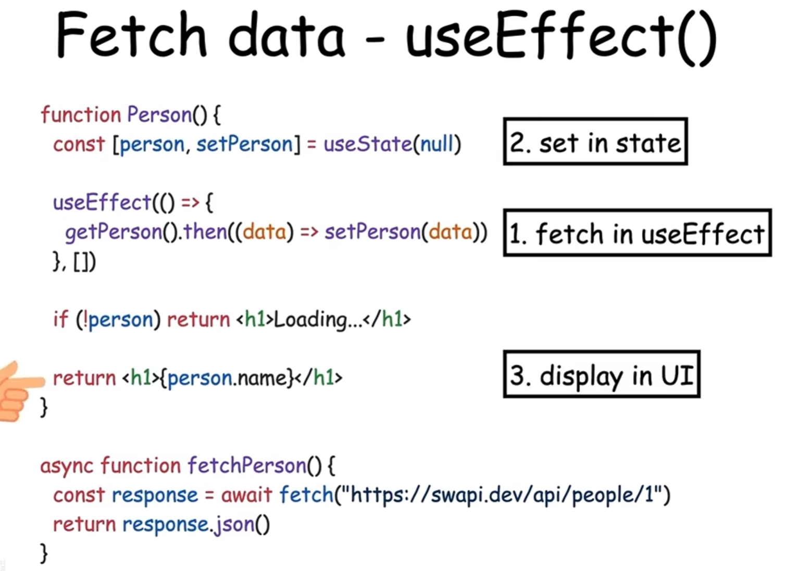
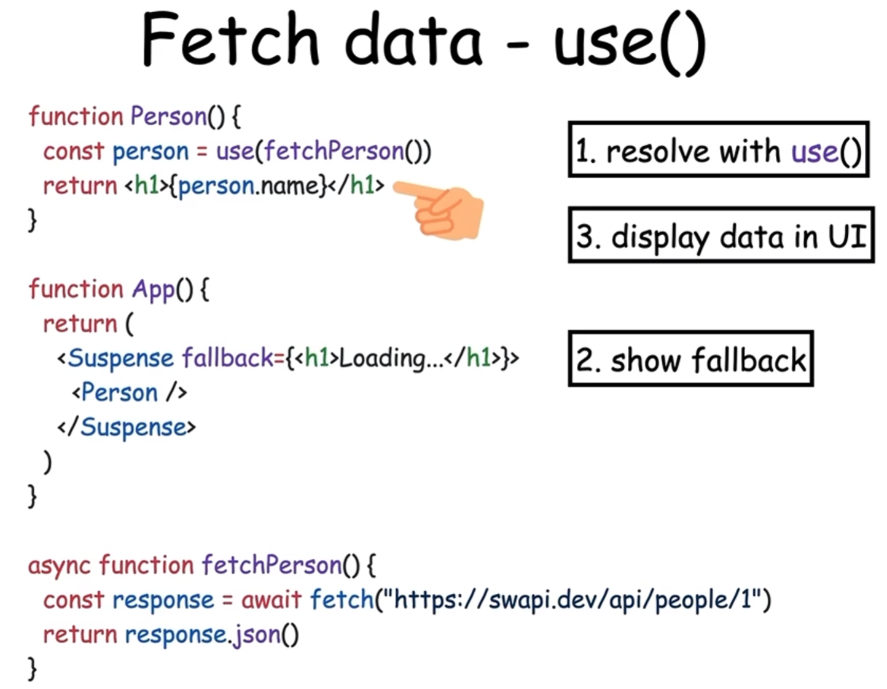

React 的版本迭代中包含了许多重要的特性和改进。以下是一些关键版本及其主要变化和特性：

# 1. React重要版本

### 1. **React 0.x**

- **React 0.3.x - 0.12.x**：
  - 初期版本，提供了基本的组件化、虚拟DOM、单向数据流等核心功能。
  - 引入了 `createClass` API 用于创建组件。

- **React 0.13.x**：
  - 引入了 **ES6 类组件** 的支持，使得创建组件的方式更加符合现代 JavaScript 标准。

### 2. **React 15.x**

- **React 15.0**：
  - 引入了 **ReactDOM**，将 `React.render` 从 `react` 包中移到 `react-dom` 中。
  - 改进了性能和错误信息的处理。

- **React 15.5**：
  - 移除了 `React.createClass`，鼓励使用 ES6 类或函数组件。

### 3. **React 16.x**

- **React 16.0**：
  - 引入了 **Fiber** 重写，改进了虚拟DOM的算法，使得更新变得更加高效。
  - 引入了 **Error Boundaries**，允许组件捕获并处理其子组件的 JavaScript 错误。
  - 支持 **Fragments** 和 **Portals**，使得组件的渲染变得更加灵活。

- **React 16.3**：
  - 引入了 **Context API**，提供了在组件树中传递数据的机制，而不必通过 `props` 层层传递。
  - 引入了 **`getDerivedStateFromProps`** 和 **`getSnapshotBeforeUpdate`** 生命周期方法。

### 4. **React 17.x**

- **React 17.0**：
  - **无新特性**：这个版本专注于改善与其他库和框架的集成，更新了事件系统，使得 React 更加与现代浏览器兼容。
  - 引入了新的 **Event Delegation**，改进了事件处理机制，特别是在处理动态添加的元素时。

### 5. **React 18.x**

- **React 18.0**：
  - 引入了 **Concurrent Mode**，使得 React 可以同时处理多个更新任务，提高了性能和用户体验。
  - 引入了 **Automatic Batching**，使得多个状态更新能够自动合并，从而减少不必要的重新渲染。
  - 引入了 **Suspense for Data Fetching**，允许组件在数据加载时进行懒加载和显示占位符，提升了用户体验。

- **React 18.2**：
  - 在 **Concurrent Mode** 下引入了 **`startTransition`** API，允许开发者标记某些更新为非紧急任务，从而提升 UI 的响应速度。

### 6. **React 19.x**

- **React 19.0**（假设版本）：
  - 未来的版本可能会继续改进 **Concurrent Mode**、**Server Components**（服务端组件）等，进一步提升性能和开发体验。

### **重要特性和改进**

- **Hooks（React 16.8）**：
  - 引入了 **Hooks**，使得函数组件能够使用状态和副作用，极大地提升了函数组件的能力，改变了组件的编写方式。

- **Concurrent Rendering**：
  - **Concurrent Mode** 引入了在后台处理任务的能力，使得 React 应用可以更加流畅地响应用户操作，并在后台处理复杂的任务。

- **Suspense**：
  - 允许组件在等待数据或其他资源时显示备用内容，使得数据加载过程更加流畅。

这些版本和特性展示了 React 的演变，从早期的简单组件化到现在复杂的并发渲染和数据处理，使得 React 成为构建现代用户界面的强大工具。

# [2. React 19](https://www.bilibili.com/video/BV1az421o7n7/?spm_id_from=333.337.search-card.all.click&vd_source=a7089a0e007e4167b4a61ef53acc6f7e)

react19不再是关于你必须编写的代码，而是更多关于你不再需要编写的代码

|                         react19之前                          |                           react19                            |
| :----------------------------------------------------------: | :----------------------------------------------------------: |
|  |  |
|                                                              | 新的编译器会自动优化react代码，因此可以完全消除以前的任何性能hooks |
|                                                              |                                                              |
|  |  |
|                                                              |                                                              |
|  |  |
|                                                              |                                                              |
|                                                              |  |

# [3. React 19](https://react.dev/blog/2024/04/25/react-19)

