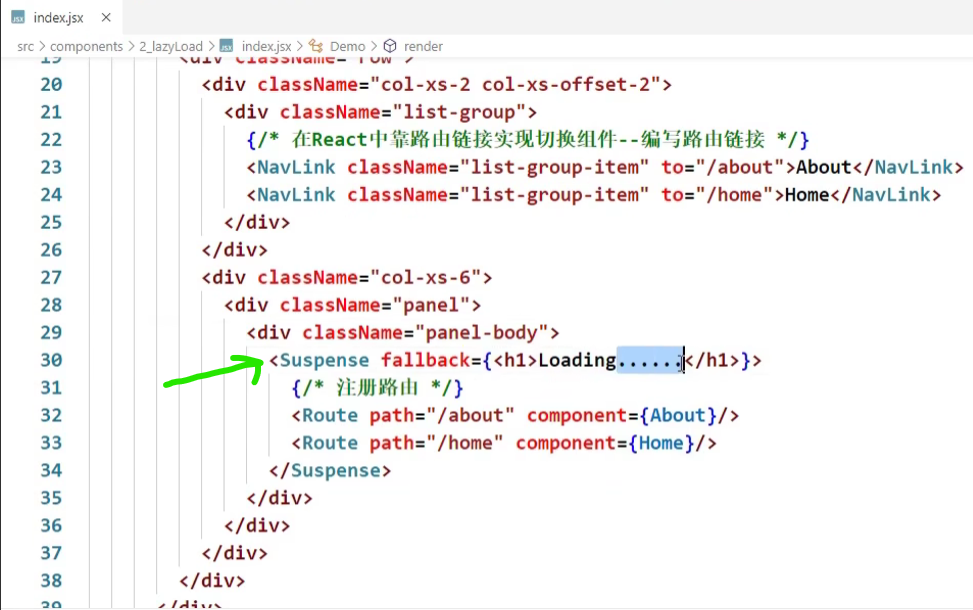
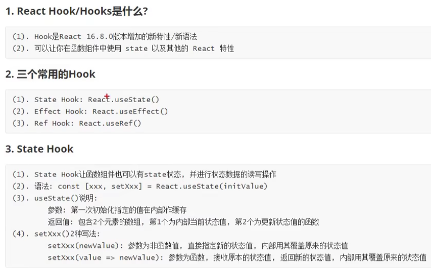
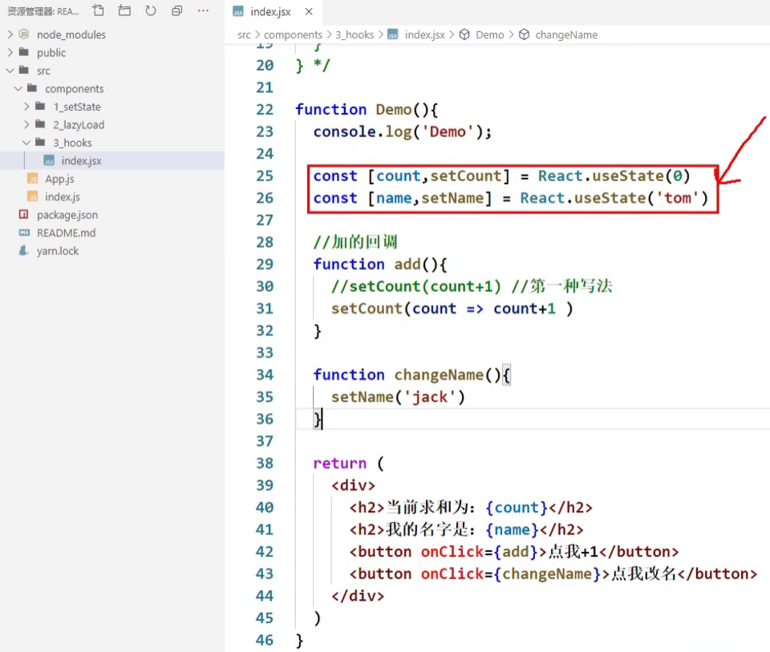

# 111 数据共享——完成数据共享

# 112 纯函数

# 113 redux开发者工具

# 114 最终版

# 115 项目打包运行

# 116 扩展1——setState

https://www.bilibili.com/video/BV1wy4y1D7JT/?p=116&spm_id_from=pageDriver&vd_source=a7089a0e007e4167b4a61ef53acc6f7e


# 117 扩展2——lazyLoad

https://www.bilibili.com/video/BV1wy4y1D7JT/?p=117&spm_id_from=pageDriver&vd_source=a7089a0e007e4167b4a61ef53acc6f7e




# [118 stateHook——React.useState()——用于在函数组件中添加状态](https://www.bilibili.com/video/BV1wy4y1D7JT/?p=118&spm_id_from=pageDriver&vd_source=a7089a0e007e4167b4a61ef53acc6f7e)

为什么函数式组件里面没有this，但是类式组件里面有this？

https://github.com/jappp/Blog/issues/12

## 118.1 类式组件




## 118.2 函数式组件

                 

## 118.3 常见useState相关面试题

在大厂的前端面试中，`useState` 钩子是React中一个重要的概念。以下是一些关于 `useState` 的常见面试题及其答案：

### 1. 解释 `useState` 钩子的基本用法。

**回答**：
`useState` 是React中的一个钩子，用于在函数组件中添加状态。它返回一个状态变量和一个更新该状态的函数。

```javascript
import React, { useState } from 'react';

function Counter() {
  const [count, setCount] = useState(0);

  return (
    <div>
      <p>Count: {count}</p >
      <button onClick={() => setCount(count + 1)}>Increment</button>
    </div>
  );
}
```

### 2. `useState` 中初始状态的设置方式有哪些？

**回答**：
初始状态可以是一个值或一个返回值的函数：
- 直接传递值：
  ```javascript
  const [count, setCount] = useState(0);
  ```
- 传递一个函数（惰性初始状态）：
  ```javascript
  const [count, setCount] = useState(() => {
    return expensiveComputation();
  });
  ```

### 3. `useState` 是同步还是异步的？解释原因。

**回答**：
`useState` 更新是异步的。React会在组件重新渲染时批量处理状态更新，以优化性能。
```javascript
const [count, setCount] = useState(0);

function handleClick() {
  setCount(count + 1);
  console.log(count); // 可能还是旧值
}
```
由于 `setCount` 不会立即更新 `count`，日志中的值可能不会如预期更新。

### 4. 如何使用函数式更新来避免状态更新中的竞争条件？

**回答**：
使用函数式更新可以避免状态更新中的竞争条件，尤其是在需要基于当前状态计算新状态时：
```javascript
const [count, setCount] = useState(0);

function handleClick() {
  setCount(prevCount => prevCount + 1);
}
```
这种方式确保 `setCount` 接收到的是最新的状态。

### 5. 如何在 `useState` 中存储复杂的状态对象？

**回答**：
可以在 `useState` 中存储对象，但更新状态时要小心合并旧状态和新状态：
```javascript
const [state, setState] = useState({ count: 0, name: 'John' });

function updateName(newName) {
  setState(prevState => ({
    ...prevState,
    name: newName
  }));
}
```
通过扩展运算符 `...` 合并旧状态和新状态。

### 6. 如何实现一个简单的计数器组件？

**回答**：
```javascript
import React, { useState } from 'react';

function Counter() {
  const [count, setCount] = useState(0);

  return (
    <div>
      <p>Count: {count}</p >
      <button onClick={() => setCount(count + 1)}>Increment</button>
      <button onClick={() => setCount(count - 1)}>Decrement</button>
    </div>
  );
}
```
该组件包含两个按钮，分别用于增加和减少计数值。

### 7. 解释如何使用多个 `useState` 钩子管理多个独立的状态。

**回答**：
可以使用多个 `useState` 钩子来管理多个独立的状态变量：
```javascript
const [count, setCount] = useState(0);
const [name, setName] = useState('John');
```
每个 `useState` 钩子管理一个独立的状态变量。

### 8. 如何在React组件首次渲染后执行某个操作，但仅在首次渲染时执行？

**回答**：
通常会使用 `useEffect` 钩子实现此功能，但结合 `useState` 可以管理一个初始状态：
```javascript
import React, { useState, useEffect } from 'react';

function Component() {
  const [hasMounted, setHasMounted] = useState(false);

  useEffect(() => {
    if (!hasMounted) {
      // 只在首次渲染时执行
      console.log('Component did mount');
      setHasMounted(true);
    }
  }, [hasMounted]);

  return <div>Check console log</div>;
}
```
这种方法结合了 `useState` 和 `useEffect` 实现首次渲染的逻辑。

### 9. 在使用 `useState` 时遇到性能问题时，应该考虑哪些优化措施？

**回答**：
- **惰性初始状态**：使用函数返回初始状态，避免每次渲染时都计算初始值。
  ```javascript
  const [state, setState] = useState(() => computeInitialState());
  ```
- **避免不必要的状态更新**：确保只在必要时更新状态，减少组件重新渲染。
- **使用 `useMemo` 和 `useCallback`**：优化复杂计算和函数的创建，避免不必要的重渲染。

### 10. 解释 `useState` 与 `useReducer` 的区别及使用场景。

**回答**：
- **`useState`**：适用于简单状态管理，状态更新逻辑简单。
  ```javascript
  const [count, setCount] = useState(0);
  ```
- **`useReducer`**：适用于复杂状态管理和状态更新逻辑复杂的场景。
  ```javascript
  const [state, dispatch] = useReducer(reducer, initialState);
  
  function reducer(state, action) {
    switch (action.type) {
      case 'increment':
        return { count: state.count + 1 };
      case 'decrement':
        return { count: state.count - 1 };
      default:
        throw new Error();
    }
  }
  ```
  `useReducer` 提供了更清晰的状态管理结构，适用于复杂应用。

这些问题涵盖了 `useState` 的基本用法、性能优化、以及与其他钩子的区别，能够帮助考察候选人对React状态管理的理解和应用。

# [119 扩展4——EffectHook（用于模拟类组件中的生命周期钩子）](https://www.bilibili.com/video/BV1wy4y1D7JT/?p=119&spm_id_from=pageDriver&vd_source=a7089a0e007e4167b4a61ef53acc6f7e)

       


# 120 扩展5——RefHook

# 121 扩展6——Fragment

# 122 扩展7——Context

# 123 扩展8——PureComponent

# 124 扩展9——renderProps

# 125 扩展10——ErrorBoundary

