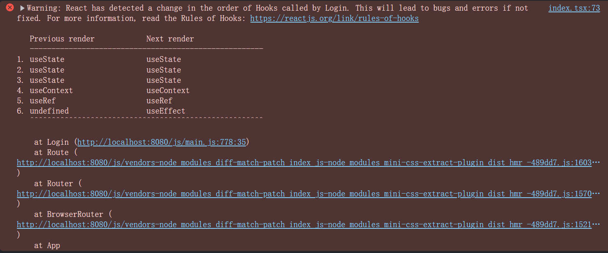
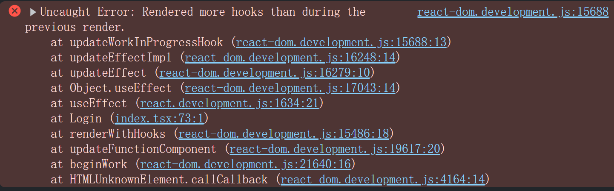
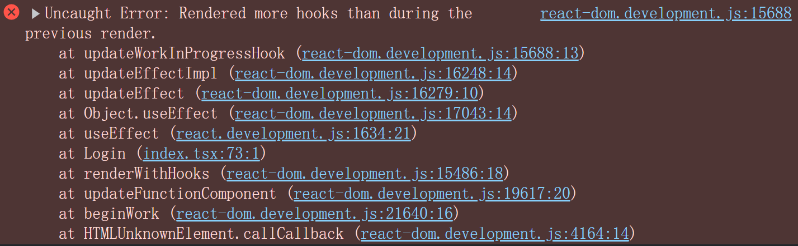
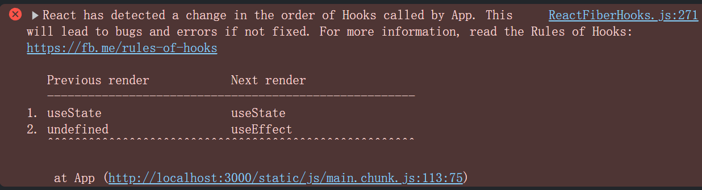
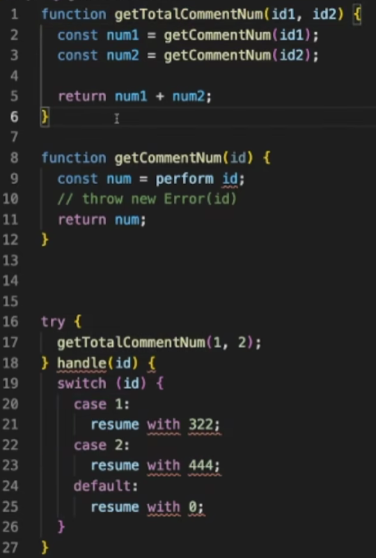
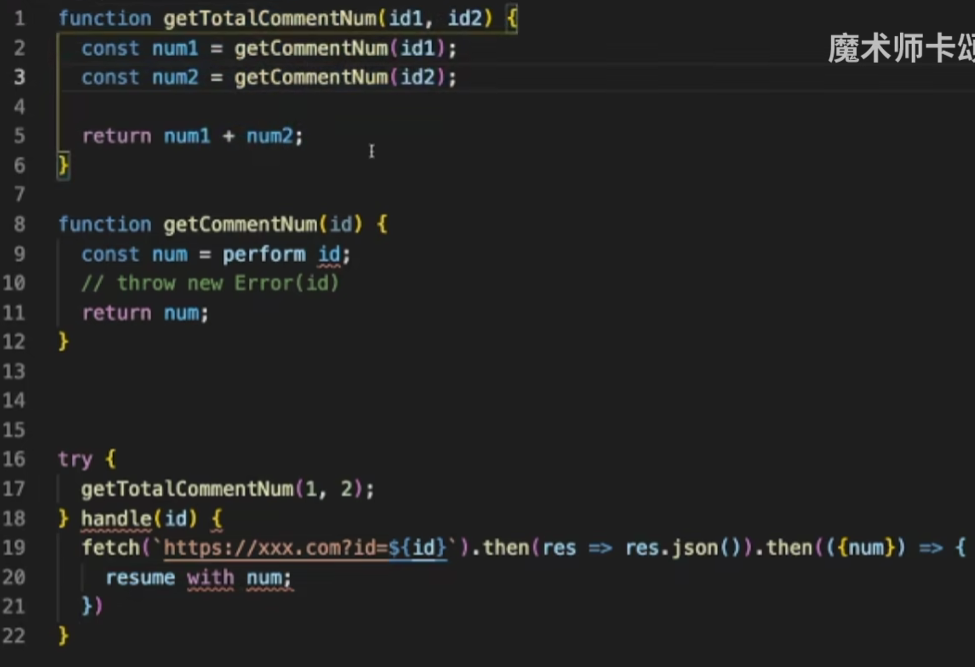
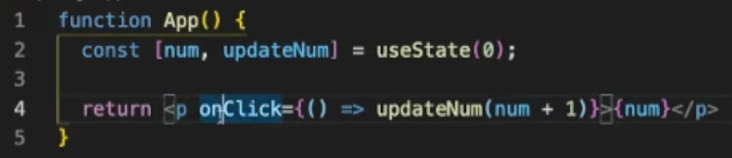
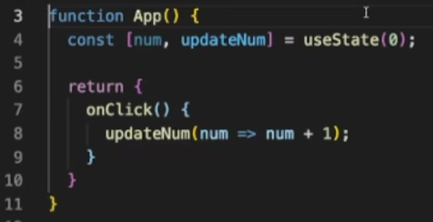
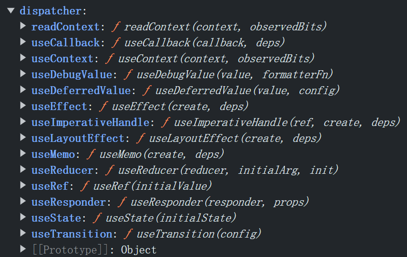

# 1. React Hooks不写在顶层会报错吗

是的，**React Hooks** 必须按照规则写在组件或自定义 Hook 的顶层，否则会报错。这是**因为 React Hooks 的工作原理依赖于调用顺序**。如**果不遵循这些规则，React 将无法正确地追踪 Hook 状态，导致潜在的错误。**

### 规则：

1. **Hooks 只能在函数组件或自定义 Hook 的顶层调用**：
   - Hooks 不能在循环、条件语句、或者嵌套的函数中调用。
   - 必须始终在组件的顶层调用 Hooks，以确保每次渲染时它们以相同的顺序执行。

2. **Hooks 只能在 React 函数组件或自定义 Hook 中调用**：
   - 不可以在普通的 JavaScript 函数中调用 Hooks。Hooks 只能在 React 的函数组件或自定义 Hook 中使用。

### 常见错误及其原因

1. **在条件语句中使用 Hooks**：
   ```js
   if (condition) {
     const [state, setState] = useState(0);  // ❌ 错误：条件语句中使用 Hook
   }
   ```
   - **原因**：如果 `condition` 结果不同，`useState` 可能不会在每次渲染时都被调用，这会导致 Hook 调用顺序的变化，React 无法正确维护状态。

2. **在循环中使用 Hooks**：
   ```js
   for (let i = 0; i < 3; i++) {
     useEffect(() => {
       console.log(i);
     });  // ❌ 错误：循环中使用 Hook
   }
   ```
   - **原因**：循环会多次调用 `useEffect`，导致 Hook 调用顺序混乱。

### 正确用法

1. **在组件顶层使用 Hooks**：
   ```js
   function MyComponent() {
     const [state, setState] = useState(0);  // ✅ 正确：顶层调用
   
     useEffect(() => {
       // Some effect logic
     }, []);  // ✅ 正确：顶层调用
   
     return <div>{state}</div>;
   }
   ```

2. **在自定义 Hook 顶层调用其他 Hooks**：
   ```js
   function useCustomHook() {
     const [state, setState] = useState(0);  // ✅ 正确：顶层调用
   
     useEffect(() => {
       // Some effect logic
     }, []);  // ✅ 正确：顶层调用
   
     return state;
   }
   ```

### React Hook Rules ESLint Plugin

为了帮助开发者遵守这些规则，React 官方提供了 [eslint-plugin-react-hooks](https://www.npmjs.com/package/eslint-plugin-react-hooks) 插件，它会在代码中违反这些规则时给出警告或错误提示。

```bash
npm install eslint-plugin-react-hooks --save-dev
```

### 总结

React Hooks **必须**在组件或自定义 Hook 的顶层调用，不能放在循环、条件语句或嵌套函数中。违反这些规则会导致错误，最常见的就是 Hook 调用顺序被打乱，从而引发 React 状态管理问题。

# 2. eslint-plugin-react-hooks插件

`eslint-plugin-react-hooks` 是一个用于 [React Hooks](https://reactjs.org/docs/hooks-intro.html) 的 ESLint 插件，它帮助开发者遵循 React Hooks 的最佳实践，确保代码中的 Hook 使用符合规范。

它提供了两个核心的规则：

1. **`react-hooks/rules-of-hooks`**  
   - 确保 Hook 只能在函数组件或自定义 Hook 中调用，防止在错误的地方使用 Hook，比如循环、条件语句或嵌套函数中。

2. **`react-hooks/exhaustive-deps`**  
   - 确保 Hook（如 `useEffect`、`useCallback` 和 `useMemo`）的依赖数组包含所有外部作用域中使用的变量，防止因依赖遗漏导致的潜在 Bug 或性能问题。

### 使用方法

1. 安装依赖：

```bash
npm install eslint-plugin-react-hooks --save-dev
```

2. 在 `.eslintrc.js` 配置文件中添加插件：

```js
module.exports = {
  plugins: ['react-hooks'],
  rules: {
    'react-hooks/rules-of-hooks': 'error', // 检查 Hook 的规则
    'react-hooks/exhaustive-deps': 'warn'  // 检查 effect 的依赖
  }
};
```

这个插件能有效防止常见的 Hooks 误用问题，并帮助维护代码的稳定性。

# 3. 实际在循环中调用useEffect却没有报错

虽然 React Hooks 的规则要求 **不要在循环、条件语句、或嵌套函数中调用 Hooks**，但在某些情况下，即使违反了这些规则，React 也可能不会立即抛出错误。这里有一些原因：

### 1. **静态分析工具 vs. 运行时错误**

React 针对 Hooks 的使用规则，主要通过 **ESLint 插件**（`eslint-plugin-react-hooks`）来在开发阶段静态分析代码。这意味着如果你没有启用这个 ESLint 插件，代码中的违规行为可能不会被捕捉到。这种情况不会直接抛出运行时错误，但仍然是潜在的风险。

**如何触发 ESLint 检查：**
- 如果你安装并启用了 `eslint-plugin-react-hooks`，它会在代码中检测到违反 Hooks 规则的用法，并在开发时发出警告或错误。

```bash
npm install eslint-plugin-react-hooks --save-dev
```

### 2. **React 的运行时没有直接检测 Hook 的顺序问题**

React 的运行时并没有强制对 Hook 使用顺序进行立即检查。因为 React 依赖于 Hook 调用的**一致性**来跟踪状态，当 Hook 的调用顺序在多个渲染中保持一致时，即使在循环或条件语句中调用 Hook，也可能不会引发直接的报错。

例如，以下代码可能不会报错：

```js
function MyComponent() {
  for (let i = 0; i < 3; i++) {
    useEffect(() => {
      console.log(`Effect for iteration ${i}`);
    }, []);
  }
  
  return <div>Check the console</div>;
}
```

**原因：**每次渲染时，`useEffect` 仍然按相同的顺序被调用（3 次），因此 React 在状态跟踪上没有遇到问题。

### 3. **在条件分支中调用 Hook**

如果你的代码在**不同渲染中条件变化导致 Hook 调用顺序发生变化**，就会引发问题。例如，以下代码在某些情况下可能没有立即报错，但会在条件发生变化时导致 React 的状态管理出错：

```js
function MyComponent() {
  const [count, setCount] = useState(0);

  if (count > 0) {
    useEffect(() => {
      console.log("Count is greater than 0");
    }, []);
  }

  return <button onClick={() => setCount(count + 1)}>Increase</button>;
}
```

**潜在问题：**如果 `count` 从 `0` 变为 `1`，`useEffect` 只在 `count > 0` 时被调用，这会打乱 Hook 的调用顺序，可能导致 React 跟踪错误的状态，最终引发报错或不期望的行为。

### 4. **React 的容错能力**

在某些简单情况下，React 能够容忍违规的 Hook 调用（例如在小循环中调用多个 Hook），因为这些调用并没有影响到 Hook 的顺序。React 并不会在每次调用时严格验证 Hook 规则，而是依赖于一致的调用顺序。如果你的循环或条件逻辑没有打破这一顺序，React 可能不会报错。

### 5. **你运行的代码可能没有触发实际问题**

你提到在循环中调用 `useEffect` 没有报错，这可能是因为：
- 循环中的 `useEffect` 被多次调用，但顺序在每次渲染时是相同的，因此没有触发 React 的状态跟踪问题。
- 条件语句没有导致 Hook 的调用顺序发生变化。

### 总结

尽管 React Hooks 的规则要求不要在循环、条件语句中调用 Hook，实际在某些情况下 React 可能不会立即报错。即使如此，**违反 Hooks 规则可能会导致未来不可预测的问题**，尤其是在你的组件随着条件或渲染顺序变化时。因此，建议始终遵循 Hooks 的规则，并使用 ESLint 插件来确保代码的正确性。

# 4. 在条件分支中调用 Hook的报错——非源码

https://react.dev/warnings/invalid-hook-call-warning







# 5. 在条件分支中调用 Hook的报错——源码



# 6. React Hooks工作原理

React Hooks 的核心原理在于它们能够在函数组件中实现状态和生命周期管理。Hooks 使得函数组件可以在不使用类的情况下利用 React 的状态和其他功能。下面是 React Hooks 的工作原理的详细解析：

### 1. **函数组件与闭包**
在函数组件中，React 依赖于闭包的特性，使得每次组件渲染都创建一个新的作用域。每次渲染函数时，组件会捕获当前渲染时的状态变量，避免直接修改上一次渲染的状态数据。

### 2. **React Hooks 是如何追踪状态的？**

React 通过一个内部的 **Hooks 数据结构** 来管理每个组件的状态。它使用一个全局的 **“hooks 链表”** 来为每个 Hook 调用分配和保存状态。每次函数组件重新渲染时，React 会按照调用顺序依次执行每个 Hook 并查找之前存储的状态。

例如，对于 `useState`，React 会存储状态的当前值，并提供一个更新状态的函数。对于 `useEffect`，React 会记录依赖项和回调，以便在需要时重新执行。

#### 实现细节：
- React Hooks **不能在循环、条件语句或嵌套函数中调用**。这确保了每次渲染中 Hook 的调用顺序是稳定的，从而允许 React 通过调用顺序匹配每个 Hook 与它们之前的状态。

### 3. **`useState` 工作原理**
`useState` 是最基本的 Hook，用来在函数组件中管理局部状态。

#### 机制：
- 每次调用 `useState(initialValue)` 时，React 会查找对应的状态值。如果组件是首次渲染，React 会将 `initialValue` 作为初始状态存储。
- **当组件重新渲染时，`useState` 返回的是上一次渲染后存储的状态值，而不是初始值**。
- 更新状态时，`setState` 会触发组件的重新渲染，React 读取最新的状态，并在下一次渲染中将其提供给组件。

```js
function Counter() {
  const [count, setCount] = useState(0);

  const increment = () => setCount(count + 1);

  return <button onClick={increment}>{count}</button>;
}
```

### 4. **`useEffect` 工作原理**
`useEffect` 是一个用于处理副作用的 Hook。它类似于类组件中的 `componentDidMount`、`componentDidUpdate` 和 `componentWillUnmount`。

#### 机制：
- `useEffect` 接受一个回调函数，该回调函数会在组件渲染完成后执行。
- 如果提供了依赖项数组，React 会在依赖发生变化时重新执行该回调。否则，`useEffect` 会在每次渲染后都执行。
- 通过返回一个清理函数，`useEffect` 可以在组件卸载时或下一次副作用执行之前运行清理逻辑。

```js
useEffect(() => {
  const timer = setInterval(() => {
    console.log('Interval triggered');
  }, 1000);

  // Cleanup function
  return () => clearInterval(timer);
}, []); // Only run once, after first render
```

### 5. **`useRef` 与 `useMemo` 等其他 Hooks**
- **`useRef`** 提供了一个可变的 `ref` 对象，它不会在组件重新渲染时重置，可以用来持有 DOM 引用或保存跨渲染周期的值。
- **`useMemo`** 和 **`useCallback`** 用于缓存计算结果或回调函数，避免不必要的重新计算或函数重建，从而优化性能。

```js
const memoizedValue = useMemo(() => computeExpensiveValue(a, b), [a, b]);

const memoizedCallback = useCallback(() => {
  doSomething(a, b);
}, [a, b]);
```

### 6. **Hooks 的顺序和依赖管理**
React 通过严格的规则来确保 Hooks 的顺序和依赖能够保持正确：
- Hooks **必须在组件的顶层调用**，不能在条件或循环内，这样 React 才能正确维护 Hooks 调用的顺序。
- `useEffect` 的依赖数组必须包含所有在副作用中使用的外部变量，否则可能会导致逻辑错误。

### 7. **Hooks 的内部实现**
在 React 内部，Hooks 是通过一个数组或链表来管理每个组件的状态。在每次渲染时，React 会维护一个索引，用来指向当前组件的 Hook。在每个 Hook 的调用过程中，React 会根据索引返回对应的状态值，并在更新时替换相应的值。

### 总结
React Hooks 通过利用 JavaScript 的闭包和 React 自身的状态管理机制，简化了函数组件中的状态管理和副作用处理。在不使用类的情况下，Hooks 提供了更简单和灵活的方式来管理组件的生命周期和逻辑抽象，提升了开发效率。

# 7. ReactHooks在源码中的存储

在 React 源码中，React Hooks 是通过内部机制管理的，尤其是在 `ReactFiber` 体系下，它使用了 `fiber` 树来管理每个组件的状态和更新。每个 Hook 调用的状态在 `fiber` 对象中以链表的形式存储和管理。

### React Hooks 的存储机制概述

React 内部使用了 `Hook` 对象存储每一个 Hook 的状态。每个 Hook 通过组件的 `fiber` 关联起来，所有的 Hooks 都以链表的形式存储在 `fiber.memoizedState` 属性中。React 会在组件渲染和更新时遍历这些 Hooks，并根据需要执行相应的操作（如状态更新、Effect 执行等）。

#### 1. `fiber` 节点中的 `memoizedState`

每个函数组件对应一个 `fiber` 对象，这个 `fiber` 对象的 `memoizedState` 字段用于存储该组件相关的 Hook 状态链表。

- **`fiber.memoizedState`**：是一个指向当前组件第一个 Hook 的指针。
- 每个 Hook 包含一个指向下一个 Hook 的指针，形成了一个链表。
  
#### 2. Hook 链表

每个 Hook 在 React 内部表示为一个对象，它有以下结构：

```js
const hook = {
  memoizedState: <the current state>,
  next: <pointer to the next hook>,
};
```

- **`memoizedState`**：存储的是 Hook 的状态值，比如 `useState` 的值或 `useEffect` 的依赖数组等。
- **`next`**：指向下一个 Hook。

当你在组件中调用多个 Hooks 时，React 会创建多个这样的 Hook 对象，并将它们通过 `next` 字段连接在一起。

#### 3. 调用 Hooks 的过程

当组件渲染时，React 会按顺序执行 Hook 调用，并根据 `currentHook` 和 `nextHook` 来管理状态。

- **初次渲染**：React 会初始化所有的 Hook，并将每个 Hook 的状态保存在 `fiber.memoizedState` 的链表中。
  
- **后续更新**：在组件更新时，React 会依次遍历 `fiber.memoizedState` 中的每个 Hook，复用之前的 Hook 状态。

### React 内部如何处理不同的 Hook

#### 1. `useState`

`useState` 是通过一个简单的 `Hook` 对象来存储当前状态值的：

- 当你调用 `useState(initialValue)` 时，React 会在 Hook 对象的 `memoizedState` 中存储这个值。
- 在后续的更新中，React 会从 `memoizedState` 中获取上一次的状态值，并通过更新机制将新值存回去。

代码示例（简化版）：

```js
function useState(initialValue) {
  const hook = getCurrentHook();
  
  if (!hook) {
    // 初次渲染，创建新 hook
    hook = {
      memoizedState: initialValue,
      next: null,
    };
  }

  // 返回状态值和更新函数
  return [hook.memoizedState, dispatchAction.bind(null, hook)];
}
```

#### 2. `useEffect`

`useEffect` 的存储与 `useState` 类似，不过它的 `memoizedState` 里保存的是依赖数组以及执行函数：

- 每次调用 `useEffect`，React 会将其依赖数组保存在对应的 Hook 对象中。
- React 会比较当前依赖数组与上一次渲染时存储的依赖数组，以决定是否重新执行 `useEffect` 回调函数。

代码示例（简化版）：

```js
function useEffect(create, deps) {
  const hook = getCurrentHook();

  if (!hook) {
    // 初次渲染，创建新 hook
    hook = {
      memoizedState: deps,
      next: null,
    };

    // 立即执行 effect
    create();
  } else {
    const prevDeps = hook.memoizedState;
    if (!areHookInputsEqual(prevDeps, deps)) {
      // 依赖数组变化，重新执行 effect
      create();
      hook.memoizedState = deps;
    }
  }
}
```

### Hooks 的执行顺序

React Hooks 必须按照严格的调用顺序执行（如必须在函数组件顶层调用），这是因为 React 是通过链表存储 Hook 的。如果在不同的渲染周期中 Hook 的调用顺序发生变化，React 无法正确找到每个 Hook 对应的状态或依赖数据，从而导致错误。

### 总结

- **存储结构**：React Hooks 状态通过 `fiber.memoizedState` 字段以链表形式存储。
- **Hook 对象**：每个 Hook 都有一个 `memoizedState` 来存储状态值或依赖数组，并通过 `next` 指向下一个 Hook。
- **执行顺序**：React Hooks 的调用顺序在每次渲染时必须一致，否则会导致错误。

# [8. React Hooks的理念，实现，源码](https://www.bilibili.com/video/BV1iV411b7L1/?spm_id_from=333.337.search-card.all.click&vd_source=a7089a0e007e4167b4a61ef53acc6f7e)

## 1. 理念

https://zh-hans.reactjs.org/community/team.html

为了践行**代数效应**的思想

代数效应：把副作用从函数编程中的函数调用中给剥离出去

|  |  |
| ------------------------------------------------------------ | ------------------------------------------------------------ |

## 2. 实现

18min处





https://react.iamkasong.com/hooks/create.html#%E6%9B%B4%E6%96%B0%E6%98%AF%E4%BB%80%E4%B9%88

```js
function useState(initialState) {
  let hook;

  if (isMount) {
    hook = {
      queue: {
        pending: null,
      },
      memoizedState: initialState,
      next: null,
    };
    if (!fiber.memoizedState) {
      fiber.memoizedState = hook;
    } else {
      workInProgressHook.next = hook;
    }
    workInProgressHook = hook;
  } else {
    hook = workInProgressHook;
    workInProgressHook = workInProgressHook.next;
  }

  let baseState = hook.memoizedState;
  if (hook.queue.pending) {
    let firstUpdate = hook.queue.pending.next;

    do {
      const action = firstUpdate.action;
      baseState = action(baseState);
      firstUpdate = firstUpdate.next;
    } while (firstUpdate !== hook.queue.pending.next);

    hook.queue.pending = null;
  }
  hook.memoizedState = baseState;

  return [baseState, dispatchAction.bind(null, hook.queue)];
}
```

```js
function dispatchAction(queue, action) {
  // 创建update
  const update = {
    action,
    next: null,
  };

  // 环状单向链表操作
  if (queue.pending === null) {
    update.next = update;
  } else {
    update.next = queue.pending.next;
    queue.pending.next = update;
  }
  queue.pending = update;

  // 模拟React开始调度更新
  schedule();
}
```

## 3. 源码

47min处

# 9. 代数效应

**代数效应（Algebraic Effects）**是一种用于处理副作用的编程模型，常用于函数式编程语言中。代数效应允许程序在函数调用的过程中使用某种机制来引入和处理副作用，比如 I/O 操作、异常处理、状态管理等，同时保持代码的纯函数特性。这个模型相比传统的副作用处理方法（如异常、回调、Monad）更加灵活，并且有助于编写结构化和可维护的代码。

### 代数效应的核心思想
代数效应的核心思想是将**副作用（effect）**与**处理方式（handler）**分离。这意味着，函数可以声明它们可能引发某些副作用，而不需要在函数定义时明确处理这些副作用。相反，副作用的处理可以在更高层的上下文中指定。这种模式使代码更加模块化，便于测试和重用。

#### 1. **效应（Effect）**
效应表示某种外部操作，可能影响程序的执行。例如：
- 异常抛出与捕获
- 状态变更
- 异步操作
- 日志记录

在代数效应模型中，效应的本质是程序的某些部分（如函数）声明它们可能会引发某些外部的副作用。

#### 2. **效应处理器（Handler）**
效应处理器定义了如何处理这些副作用。当一个程序中的某个操作触发效应时，效应处理器会捕获这个操作并定义如何应对这种效应。例如，处理器可以处理异常、记录日志或者执行某些 I/O 操作。

### 代数效应的工作流程
代数效应模型通常遵循如下流程：
1. **声明效应**：某个函数或操作声明它可能产生一个效应，例如读取文件、修改状态等。
2. **触发效应**：当程序运行时，触发该效应，程序暂停执行，等待某个效应处理器来处理该效应。
3. **处理效应**：一个效应处理器捕获并处理该效应，并决定如何继续执行程序（如恢复执行、修改状态、抛出异常等）。

例如，一个可以抛出异常的函数可以简单地声明自己可能会抛出一个异常，而不需要直接处理它。异常的实际处理可以在调用方或更高层的处理器中完成。

### 代数效应的优点

1. **分离关注点**：代数效应允许将副作用的引发和处理分离，这样可以使代码更加模块化、清晰，并且不同层次的代码可以独立关注各自的逻辑。
   
2. **更灵活的副作用处理**：与传统的异常处理或回调机制相比，代数效应提供了一种更加灵活的机制来捕获和处理副作用。你可以通过处理器定义多种副作用的处理方式，并动态改变处理方式。

3. **提高代码复用性**：由于副作用处理与函数实现解耦，可以在不同的上下文中以不同的方式处理相同的副作用，从而提高代码的复用性。

### 代数效应的实现
代数效应通常在一些高级的编程语言或框架中使用，例如：

- **OCaml** 中的 Effect Handler 特性。
- **Eff** 是一个专门支持代数效应的实验性编程语言。
- 一些现代的函数式编程语言（如 Haskell）通过扩展提供类似的效果。

在大多数常见的编程语言中，代数效应并未原生支持，但可以通过类似的机制（如异常、回调、Monad 等）模拟。

### 代数效应与 Monad 的对比
在函数式编程中，处理副作用常见的方法是通过 **Monad**。Monad 和代数效应在处理副作用上有相似的目的，但实现方式不同：

- **Monad** 强调的是将副作用和计算绑定在一起，并且副作用是以链式的方式传递的。这种方式虽然强大，但通常会导致代码耦合性较高，难以解耦。
- **代数效应** 则分离了效应的声明和处理，通过效应处理器，可以灵活地定义不同上下文中的副作用处理逻辑。

**总之，代数效应是处理副作用的一种灵活模型，通过将副作用和处理器分离，提供了更好的代码模块化和复用性。**

# 10. 源码调试

## useState   ReactHooks.js

```js
export function useState<S>(
  initialState: (() => S) | S,
): [S, Dispatch<BasicStateAction<S>>] {
  const dispatcher = resolveDispatcher();
  return dispatcher.useState(initialState);
}
```



### 1. **函数定义**

```ts
export function useState<S>(
  initialState: (() => S) | S,
): [S, Dispatch<BasicStateAction<S>>]
```

- **`useState<S>`** 是一个泛型函数，泛型类型 `S` 表示状态值的类型。React 的 `useState` Hook 可以处理任意类型的状态，这里用 `<S>` 来定义状态类型
  
- **`initialState: (() => S) | S`**：这是 `useState` 函数的参数，`initialState` 可以是一个值（类型为 `S`），也可以是一个返回值为 `S` 的函数
  - 当 `initialState` 是一个函数时，它表示延迟初始化的状态，这样只有在真正需要时，函数才会被调用来计算初始状态。
  - 如果 `initialState` 是一个简单的值，则直接作为初始状态。

- **返回值类型 `[S, Dispatch<BasicStateAction<S>>]`**：
  - `S`：这是当前的状态值。
  - `Dispatch<BasicStateAction<S>>`：这是一个状态更新函数，用于更新状态，类似于 `setState`

### 2. **dispatcher 与 `resolveDispatcher` 函数**
```ts
const dispatcher = resolveDispatcher();
```

- 这里调用了 `resolveDispatcher()`，它用于获取当前的 **dispatcher**。React 使用 `dispatcher` 来管理 Hooks 的逻辑，`dispatcher` 是一个全局的、与当前组件渲染上下文相关的对象。
  
  - **`resolveDispatcher()`**：这个函数内部会根据当前的 React 渲染上下文返回一个 dispatcher。它的具体作用是找到当前组件渲染时所在的 `dispatcher` 实例。
  - dispatcher 本质上是一个对象，管理当前组件的所有 Hooks 调用，比如 `useState`、`useEffect` 等。React 内部有不同的 dispatcher，用于区分不同的渲染阶段（如服务端渲染和客户端渲染）。

### 3. **使用 dispatcher 调用 `useState`**
```ts
return dispatcher.useState(initialState);
```

- **`dispatcher.useState(initialState)`**：这是实际调用 `useState` 的逻辑。通过 dispatcher，我们获取到与当前组件关联的 Hook 状态，并执行状态初始化。
  
  - `dispatcher.useState` 内部会处理初始化状态、状态更新、以及在组件重新渲染时，如何复用之前的状态。根据 `initialState` 是否是函数，它会决定是直接使用初始值，还是调用函数来延迟计算初始状态。
  
  - 当你在 React 组件中调用 `useState`，实际的状态存储和管理是由 `dispatcher` 完成的，`useState` 只是调用了 dispatcher 的相关逻辑。

### 总结
这段代码实现了 React `useState` 的基本逻辑：

1. 通过 `resolveDispatcher()` 获取当前渲染上下文的 dispatcher。
2. 调用 dispatcher 的 `useState` 方法来管理状态的初始化和更新。
3. `useState` 支持两种初始状态传递方式：直接的初始值或一个返回状态的函数，用于延迟初始化。
4. 返回当前的状态值和更新函数（类似于 `setState`），以便在组件中更新状态。

通过这种设计，React 可以灵活处理不同的渲染上下文和不同类型的 Hook，实现高度可复用的逻辑。

## resolveDispatcher

```js
function resolveDispatcher() {
  const dispatcher = ReactCurrentDispatcher.current;
  return dispatcher;
}
```


`resolveDispatcher()` 是 React 内部用来获取当前的 Dispatcher 的方法。要理解这个函数的目的和作用，需了解 React 的核心机制之一 —— **Dispatcher**

### 分析函数

```javascript
function resolveDispatcher() {
  const dispatcher = ReactCurrentDispatcher.current;
  return dispatcher;
}
```

### 1. **`ReactCurrentDispatcher` 是什么？**

- `ReactCurrentDispatcher` 是 React 内部的一个对象，通常用于存储当前上下文中和 Hooks 相关的调度逻辑。
- 每当组件处于渲染过程中（如使用 Hooks 时），React 会为这个上下文指定一个 Dispatcher，它是一个对象，包含 `useState`、`useEffect` 等 Hooks 函数的实现
- `ReactCurrentDispatcher.current` 指向当前组件渲染时正在使用的 Dispatcher

### 2. **`Dispatcher` 是什么？**

- **Dispatcher** 是 React 内部的一个调度器对象，它负责处理不同阶段中 Hooks 的执行。根据组件的状态，React 会提供不同版本的 Hooks 实现：
  - **初次渲染时**，Dispatcher 可能提供 Hooks 的初次调用行为，比如初始化状态。
  - **更新时**，Dispatcher 会提供执行状态更新和副作用的逻辑。
- 每当 React 函数组件执行时，React 会确保将正确的 Dispatcher 赋值给 `ReactCurrentDispatcher.current`，然后函数组件调用的 `useState`、`useEffect` 等 Hooks 方法，实际就是通过这个 Dispatcher 调用。

### 3. **`resolveDispatcher()` 的功能**

- `resolveDispatcher()` 的作用就是获取当前的 Dispatcher。由于 Dispatcher 是存储在 `ReactCurrentDispatcher.current` 上的，函数通过从该对象读取 `current` 属性来获取当前上下文中的 Dispatcher。
- 这个函数是 React 内部用于处理 Hooks 的函数调用的第一步。任何时候调用 Hooks，React 会通过这个函数找到当前的 Dispatcher，并确保 `useState`、`useEffect` 等方法都能够在正确的上下文中被调度和执行。

### 4. **使用场景**

- 当 React 渲染一个使用 Hooks 的函数组件时，React 需要依赖 `Dispatcher` 来正确管理和追踪这些 Hooks 的调用。例如，`useState` 需要知道它正在处理哪个组件的哪个状态。
- `resolveDispatcher()` 就是一个用于获取当前 `Dispatcher` 的抽象，确保每次调用 Hooks 的时候，能够正确找到并执行 Dispatcher 内的相应逻辑。

### 示例场景

```js
function useState(initialValue) {
  // 获取当前 Dispatcher，并通过它来调用 Hooks 实现
  const dispatcher = resolveDispatcher();
  return dispatcher.useState(initialValue);
}
```

在上面的例子中，当组件调用 `useState` 时，`resolveDispatcher()` 会返回当前渲染上下文的 Dispatcher，`dispatcher.useState()` 则会执行对应的逻辑，比如初次渲染时初始化状态或者组件更新时获取已有状态。

### 总结

`resolveDispatcher()` 函数的核心作用是在函数组件渲染时，获取当前的 Hooks 调度器 (Dispatcher)，以便在调用 Hooks（如 `useState`、`useEffect` 等）时，能够正确管理和调度这些 Hooks 的执行。这是 React Hooks 机制的内部工作原理之一，确保每个组件和每个 Hooks 调用能够在正确的上下文中被处理。

## useState   ReactFiberHooks.js

```js
useState<S>(
    initialState: (() => S) | S,
): [S, Dispatch<BasicStateAction<S>>] {
      currentHookNameInDev = 'useState';
      mountHookTypesDev();
      const prevDispatcher = ReactCurrentDispatcher.current;
      ReactCurrentDispatcher.current = InvalidNestedHooksDispatcherOnMountInDEV;
      try {
        return mountState(initialState);
      } finally {
        ReactCurrentDispatcher.current = prevDispatcher;
      }
}
```

这段代码是 `React` 内部实现 `useState` 钩子的部分，涉及到 React 中的状态管理逻辑。以下是分析：

### 1. 函数签名
```ts
useState<S>(
    initialState: (() => S) | S
): [S, Dispatch<BasicStateAction<S>>]
```
- **`initialState`**: 初始状态，可以是一个值 `S` 或者一个返回值为 `S` 的函数 `() => S`。React 支持传入函数的形式是为了避免在初次渲染时进行不必要的复杂计算，只有在真正需要初始化时才会调用函数获取状态值。
- **返回值**: 返回一个包含当前状态 `S` 和 `Dispatch`（用于更新状态的函数）的元组。`Dispatch` 的类型为 `BasicStateAction<S>`，通常是 `setState` 函数的类型。

### 2. 内部逻辑

#### `currentHookNameInDev = 'useState';`
- **作用**: 在开发环境中，用来标识当前正在使用 `useState` 钩子，以便在调试时更好地进行错误追踪。开发环境下会启用一些额外的错误提示。

#### `mountHookTypesDev();`
- **作用**: 该函数用于记录当前使用的钩子类型。在 React 中，钩子顺序必须保持一致，因此在开发模式下，React 会通过类似函数跟踪和验证钩子调用顺序。

#### `const prevDispatcher = ReactCurrentDispatcher.current;`
- **作用**: `ReactCurrentDispatcher` 是 React 中存储当前钩子分发器的全局对象。它负责在不同生命周期阶段（如渲染、更新）管理不同的钩子逻辑。这里保存了当前的分发器，以便后续恢复。

#### `ReactCurrentDispatcher.current = InvalidNestedHooksDispatcherOnMountInDEV;`
- **作用**: 将当前钩子分发器切换为 `InvalidNestedHooksDispatcherOnMountInDEV`。这个分发器在开发模式下用于防止在钩子嵌套使用时产生问题。如果在渲染过程中，钩子的嵌套方式不正确，React 会抛出相应的错误。

#### `try { return mountState(initialState); }`
- **作用**: `mountState` 是 React 的内部函数，负责根据 `initialState` 初始化 `useState` 的状态值，并返回 `[state, dispatch]`。如果 `initialState` 是一个函数，则在调用 `mountState` 时会执行这个函数，否则直接返回初始值。

#### `finally { ReactCurrentDispatcher.current = prevDispatcher; }`
- **作用**: 在函数执行完之后，无论是成功返回状态还是出现错误，都会恢复之前的 `ReactCurrentDispatcher.current`，以确保在钩子运行过程中不会因为错误或其他原因导致状态不一致。

### 总结
- 这段代码展示了 `useState` 的初始化过程。
- 它通过 `mountState` 设置初始状态，同时在开发环境下引入额外的验证逻辑，防止钩子使用时出现错误。
- 通过保存和恢复 `ReactCurrentDispatcher.current`，React 能确保在不同阶段中分发器的行为保持正确。

## mountState

```js
function mountState<S>(
  initialState: (() => S) | S,
): [S, Dispatch<BasicStateAction<S>>] {
  const hook = mountWorkInProgressHook();
  if (typeof initialState === 'function') {
    initialState = initialState();
  }
  hook.memoizedState = hook.baseState = initialState;
  const queue = (hook.queue = {
    pending: null,
    dispatch: null,
    lastRenderedReducer: basicStateReducer,
    lastRenderedState: (initialState: any),
  });
  const dispatch: Dispatch<
    BasicStateAction<S>,
  > = (queue.dispatch = (dispatchAction.bind(
    null,
    currentlyRenderingFiber,
    queue,
  ): any));
  return [hook.memoizedState, dispatch];
}
```

这段代码实现了 `mountState` 函数，用于在 React 的内部机制中挂载状态。它是 React Hooks 中 `useState` 实现的一部分。以下是对其进行的详细分析：

### 1. 函数签名
```ts
function mountState<S>(
  initialState: (() => S) | S,
): [S, Dispatch<BasicStateAction<S>>]
```
- 泛型 `S` 表示状态的类型，`initialState` 可以是一个状态值或一个返回状态的函数。
- 返回值是一个由两个元素构成的数组：状态值 `S` 和派发动作的函数 `dispatch`。

### 2. `mountWorkInProgressHook`
```ts
const hook = mountWorkInProgressHook();
```
- 这是 React 内部一个获取当前工作的 Hook 的函数，它返回了一个 hook 对象。
- 在 React 中，Hooks 是以链表的形式存储的，`mountWorkInProgressHook` 负责初始化和挂载这个状态 hook。

### 3. 检查 `initialState` 是否为函数
```ts
if (typeof initialState === 'function') {
  initialState = initialState();
}
```
- 如果 `initialState` 是一个函数，就调用它并将其结果作为初始状态。这是为了支持懒加载初始状态的功能，例如：`useState(() => expensiveComputation())`。

### 4. 设置 `memoizedState` 和 `baseState`
```ts
hook.memoizedState = hook.baseState = initialState;
```
- `hook.memoizedState`：存储该 Hook 的当前状态。
- `hook.baseState`：存储状态的基础值，一般用于在某些场景下重置状态。

### 5. 初始化队列
```ts
const queue = (hook.queue = {
  pending: null,
  dispatch: null,
  lastRenderedReducer: basicStateReducer,
  lastRenderedState: initialState,
});
```
- `queue` 是一个动作队列，保存着需要对该 Hook 的状态进行的更新操作。
  - `pending`：保存未处理的更新队列。
  - `dispatch`：保存派发更新的函数。
  - `lastRenderedReducer`：这是用于状态更新的 reducer，默认为 `basicStateReducer`，即直接返回新状态。
  - `lastRenderedState`：存储最近渲染时的状态。

### 6. 绑定 `dispatch` 函数
```ts
const dispatch = (queue.dispatch = (dispatchAction.bind(
  null,
  currentlyRenderingFiber,
  queue,
): any));
```
- `dispatchAction` 是一个更新函数，通过 `bind` 将当前 fiber 和队列绑定，从而能够在未来调用时更新状态。
- `dispatch` 是用户调用时用来触发状态更新的函数。

### 7. 返回值
```ts
return [hook.memoizedState, dispatch];
```
- 最终返回的状态值和 `dispatch` 函数，即 `useState` 的效果。

### 总结
该函数是 React Hooks 内部实现的一部分，用于创建和挂载 `useState` hook。在 `mountState` 中，它初始化了一个 Hook 对象，处理了 `initialState`，并返回当前的状态和一个可以更新该状态的 `dispatch` 函数。

## mountWorkInProgressHook

```js
function mountWorkInProgressHook(): Hook {
  const hook: Hook = {
    memoizedState: null,
    baseState: null,
    baseQueue: null,
    queue: null,
    next: null,
  };
  if (workInProgressHook === null) {
    // This is the first hook in the list
    currentlyRenderingFiber.memoizedState = workInProgressHook = hook;
  } else {
    // Append to the end of the list
    workInProgressHook = workInProgressHook.next = hook;
  }
  return workInProgressHook;
}
```

`currentlyRenderingFiber`是什么时候设置的？

## dispatchAction

```js
function dispatchAction<S, A>(
  fiber: Fiber,
  queue: UpdateQueue<S, A>,
  action: A,
) {
  const currentTime = requestCurrentTimeForUpdate();
  const suspenseConfig = requestCurrentSuspenseConfig();
  const expirationTime = computeExpirationForFiber(currentTime,fiber,suspenseConfig);
  const update: Update<S, A> = {
    expirationTime,
    suspenseConfig,
    action,
    eagerReducer: null,
    eagerState: null,
    next: (null: any),
  };
  // Append the update to the end of the list.
  const pending = queue.pending;
  if (pending === null) {
    // This is the first update. Create a circular list.
    update.next = update;
  } else {
    update.next = pending.next;
    pending.next = update;
  }
  queue.pending = update;

  const alternate = fiber.alternate;
  if (
    fiber === currentlyRenderingFiber ||
    (alternate !== null && alternate === currentlyRenderingFiber)
  ) {
    // This is a render phase update. Stash it in a lazily-created map of
    // queue -> linked list of updates. After this render pass, we'll restart
    // and apply the stashed updates on top of the work-in-progress hook.
    didScheduleRenderPhaseUpdate = true;
    update.expirationTime = renderExpirationTime;
    currentlyRenderingFiber.expirationTime = renderExpirationTime;
  } else {
    if (
      fiber.expirationTime === NoWork &&
      (alternate === null || alternate.expirationTime === NoWork)
    ) {
      // The queue is currently empty, which means we can eagerly compute the
      // next state before entering the render phase. If the new state is the
      // same as the current state, we may be able to bail out entirely.
      const lastRenderedReducer = queue.lastRenderedReducer;
      if (lastRenderedReducer !== null) {
        let prevDispatcher;
        try {
          const currentState: S = (queue.lastRenderedState: any);
          const eagerState = lastRenderedReducer(currentState, action);
          // Stash the eagerly computed state, and the reducer used to compute
          // it, on the update object. If the reducer hasn't changed by the
          // time we enter the render phase, then the eager state can be used
          // without calling the reducer again.
          update.eagerReducer = lastRenderedReducer;
          update.eagerState = eagerState;
          if (is(eagerState, currentState)) {
            // Fast path. We can bail out without scheduling React to re-render.
            // It's still possible that we'll need to rebase this update later,
            // if the component re-renders for a different reason and by that
            // time the reducer has changed.
            return;
          }
        } catch (error) {
          // Suppress the error. It will throw again in the render phase.
        } finally {
        }
      }
    }
    scheduleWork(fiber, expirationTime);
  }
}
```


## updateState

```js
function updateState<S>(
  initialState: (() => S) | S,
): [S, Dispatch<BasicStateAction<S>>] {
  return updateReducer(basicStateReducer, (initialState: any));
}
```

# ReactHooks为什么只能写在顶层，请从源码角度分析

React Hooks 只能在组件函数的顶层调用，主要是由于 React 内部通过 **调用顺序** 和 **Hook 链表** 来管理和维护 Hooks 的状态。React 必须在每次渲染时保持 Hooks 的调用顺序一致，这样才能正确地将状态和副作用与对应的组件实例关联起来。

### 核心原因
1. **Hook 是以调用顺序为依据进行状态管理的**：
   - 每次组件渲染时，React 需要逐一调用 `useState`、`useEffect` 等 Hooks，并通过 Hook 的顺序将当前的状态、上下文等信息与正确的 Hook 实例关联起来。
   - 如果在条件语句或循环中使用 Hook，会导致 Hook 的调用顺序在不同渲染周期发生变化，这会导致 React 无法正确管理 Hook 的状态。

2. **React Hooks 状态存储在链表中**：
   - React 在每次渲染时，维护一个 Hook 链表来存储与每个组件相关的 Hook 状态。链表中的每一个节点表示一个 Hook 实例，每次 `useState`、`useEffect` 调用时，React 会按顺序查找对应的节点，读取或更新状态。
   - 如果 Hook 的调用顺序发生变化，React 会把状态错误地分配给其他 Hook，导致错误的行为。

### 源码分析

在 React 的源码中，Hooks 是依赖**调用顺序**和**链表结构**管理的。接下来，通过分析源码的部分关键逻辑来说明这一点。

#### 1. **Hooks 的调用顺序与 `currentlyRenderingFiber`**
React 每次渲染函数组件时，会为组件创建或获取对应的 `fiber` 对象，这个对象保存了组件的渲染状态。`currentlyRenderingFiber` 表示当前正在渲染的组件，通过它可以追踪到组件的 Hook 状态。

```ts
let currentlyRenderingFiber = null;
```

在组件渲染时，`currentlyRenderingFiber` 被设置为当前组件的 fiber 节点。React 通过 `currentlyRenderingFiber` 的 `memoizedState` 属性存储 Hook 链表的头节点。

#### 2. **`mountWorkInProgressHook` 函数**
这是 React 在初次渲染组件时调用 Hook 的逻辑，负责创建一个新的 Hook 并将其添加到链表中。

```ts
function mountWorkInProgressHook() {
  const hook = {
    memoizedState: null,
    baseState: null,
    baseQueue: null,
    queue: null,
    next: null,
  };
  
  if (workInProgressHook === null) {
    // First hook in the list
    currentlyRenderingFiber.memoizedState = workInProgressHook = hook;
  } else {
    // Append to the end of the list
    workInProgressHook = workInProgressHook.next = hook;
  }
  return hook;
}
```

- 每调用一个 Hook（如 `useState`），React 都会执行 `mountWorkInProgressHook`，创建一个新的 `hook` 对象并将其加入到当前组件的 Hook 链表中。
- `workInProgressHook` 是链表的当前节点指针，通过 `hook.next` 将 Hook 串联起来。

#### 3. **`updateWorkInProgressHook` 函数**
在后续渲染时，React 通过调用 `updateWorkInProgressHook` 按顺序获取链表中的 Hook，并更新其状态。

```ts
function updateWorkInProgressHook() {
  // Move the pointer to the next hook in the linked list
  if (workInProgressHook === null) {
    workInProgressHook = currentlyRenderingFiber.memoizedState;
  } else {
    workInProgressHook = workInProgressHook.next;
  }
  return workInProgressHook;
}
```

- 每次组件更新时，React 会通过 `currentlyRenderingFiber.memoizedState` 获取链表的第一个 Hook，然后依次通过 `hook.next` 访问下一个 Hook。
- 如果 Hook 的调用顺序发生变化，`workInProgressHook` 会指向错误的 Hook，导致状态与实际的 Hook 对象不匹配。

#### 4. **Hook 调用顺序必须保持一致**
React 的 Hooks 系统依赖调用顺序来维护状态。如果调用顺序在不同的渲染周期中发生变化（例如在条件语句中调用 Hook），React 将无法正确匹配 Hook 与状态，导致状态管理错误。例如，`useState` 的状态会被赋给错误的 Hook。

例如，如果我们在条件语句中调用 Hook：

```js
if (someCondition) {
  useState(); // 这个 Hook 可能在下一次渲染中被跳过
}
```

这会导致：
- 如果 `someCondition` 是 `true` 时调用了 `useState`，那么在 React 的 Hook 链表中会创建一个新的 Hook 节点。
- 如果 `someCondition` 是 `false` 时跳过了 `useState`，则链表中的位置会错位，导致之后的 Hook 状态获取出错。

### 5. **React 内部的校验**
在开发模式下，React 有时会在 Hook 调用的错误情况下发出警告。React 通过检查每个渲染周期 Hook 调用的顺序来确保开发者遵循 Hooks 规则。

如果开发者在条件语句或循环中使用 Hook，React 会抛出以下错误：

```
React Hook "useState" is called conditionally. React Hooks must be called in the exact same order in every component render.
```

这个错误的原因正是因为 React 要求每次渲染时，Hook 的调用顺序必须与上一次渲染时一致。

### 总结
React Hooks 必须在顶层调用的原因，源于 React 内部通过 **调用顺序** 和 **链表结构** 管理 Hook 状态。如果 Hook 的调用顺序发生变化，React 将无法正确地管理状态和副作用。因此，React 要求所有 Hooks 调用都在组件的顶层进行，确保每次渲染时 Hook 的调用顺序保持一致。

- **调用顺序** 是确保 Hook 状态管理的核心。
- **链表结构** 用于维护每个组件的 Hook 状态，调用顺序的改变会导致链表状态错位。