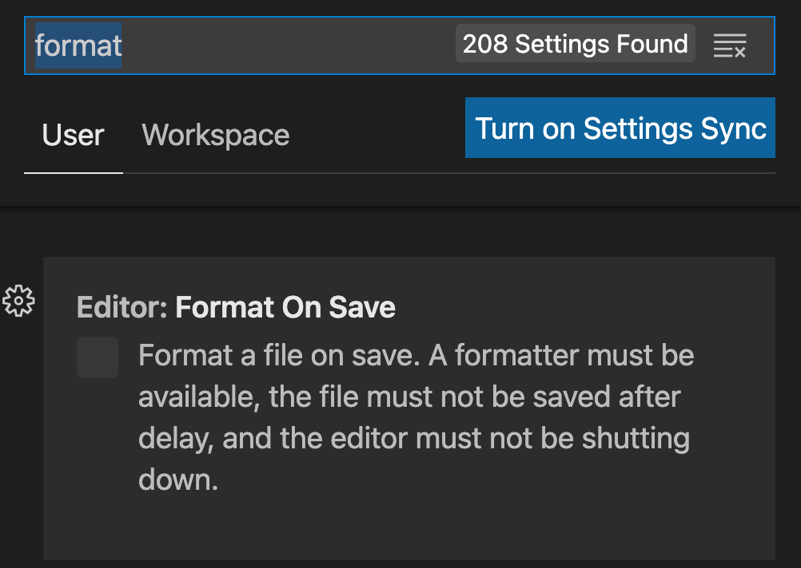
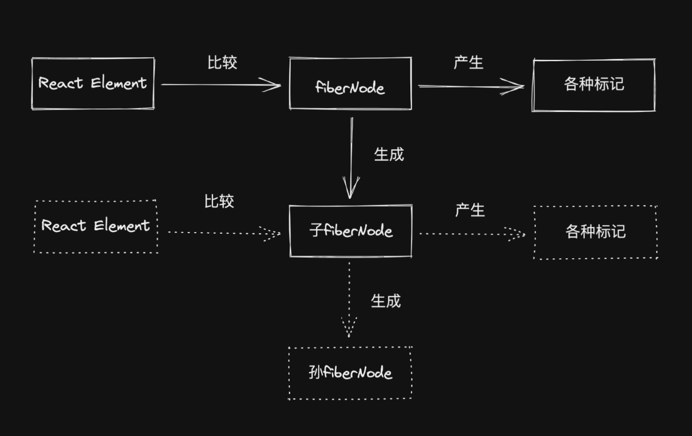

https://www.bilibili.com/video/BV1ev411P7jn/?spm_id_from=333.337.search-card.all.click&vd_source=a7089a0e007e4167b4a61ef53acc6f7e

  "react-dom": "^18.2.0",

  "react-dom": "^17.0.1",

https://www.bilibili.com/video/BV13j411D7K6/?spm_id_from=333.788.recommend_more_video.11&vd_source=a7089a0e007e4167b4a61ef53acc6f7e

# 1.配置React源码本地调试环境

注意：


1.使用create-react-app脚手架创建项目

​	`npx create-react-app react-test`

2.弹射create-react-app

​	`npm run eject`

3.克隆react官方源码

​	`git clone --branch v16.13.1 --depth=1 https://github.com/facebook/react.git src/react`

4.链接本地源码

```javascript
// 文件位置：react-test/config/webpack.config.js
resolve: {
      alias: {
        'react-native': 'react-native-web',                
        "react": path.resolve(__dirname, "../src/react/packages/react"),
        "react-dom": path.resolve(__dirname, "../src/react/packages/react-dom"),
        "shared": path.resolve(__dirname, "../src/react/packages/shared"),
        "react-reconciler": path.resolve(__dirname, "../src/react/packages/react-reconciler"),
        "legacy-events": path.resolve(__dirname, "../src/react/packages/legacy-events"),
      }
}
```

==问题：path.resolve(__dirname，‘xxx’)不熟==

5.修改环境变量

```javascript
// 文件位置：react-test/config/env.js
const stringified = {
    'process.env': Object.keys(raw).reduce((env, key) => {
      env[key] = JSON.stringify(raw[key]);
      return env;
    }, {}),
    __DEV__: true,
    SharedArrayBuffer: true,
    spyOnDev: true,
    spyOnDevAndProd: true,
    spyOnProd: true,
    __PROFILE__: true,
    __UMD__: true,
    __EXPERIMENTAL__: true,
    __VALIANT__: true,
    gate: true,
    trustedTypes: true
};
```

6.告诉babel在转换代码时忽略类型检查

`npm install @babel/plugin-transform-flow-strip-types -D`

```javascript
// 文件位置：react-test/config/webpack.config.js [babel-loader]
plugins: [
    require.resolve("@babel/plugin-transform-flow-strip-types"),
]
```

7.导出HostConfig

```javascript
// 文件位置: react\packages\react-reconciler\src\ReactFiberHostConfig.js
+ export * from './forks/ReactFiberHostConfig.dom';
```


8.修改ReactSharedInternals.js文件

```javascript
// 文件位置：react\packages\shared\ReactSharedInternals.js
- import * as React from 'react';
- const ReactSharedInternals = React.__SECRET_INTERNALS_DO_NOT_USE_OR_YOU_WILL_BE_FIRED;
+ import ReactSharedInternals from '../react/src/ReactSharedInternals';
```

9.关闭eslint扩展


10.禁止invariant报错

```javascript
if (condition) return;
```


11.eslint配置

在react源码文件夹中新建.eslintrc.json并添加如下配置

```javascript
{
    "extends": "react-app",
    "globals": {
        "SharedArrayBuffer": true,
        "spyOnDev": true,
        "spyOnDevAndProd": true,
        "spyOnProd": true,
        "__PROFILE__": true,
        "__UMD__": true,
        "__EXPERIMENTAL__": true,
        "__VALIANT__": true,
        "gate": true,
        "trustedTypes": true
    }
}
```

12.修改react react-dom引入方式


13.解决vsCode中flow报错


14.可选项配置


15.____DEV____报错

删除node_modules，执行npm Install

# 2.创建React元素

https://www.bilibili.com/video/BV13j411D7K6/?p=2&vd_source=a7089a0e007e4167b4a61ef53acc6f7e

**jsx代码会被babel转换成React.createElement代码的调用**

## 2.1 createElement

[JSX转换为ReactElement的过程](https://www.bilibili.com/video/BV13j411D7K6?p=2&spm_id_from=pageDriver&vd_source=a7089a0e007e4167b4a61ef53acc6f7e)

- react元素：就是之前所说的virtual dom，实际上就是js对象，用来描述真实dom对象长成什么样子

- 在react项目运行之前，jsx会被babel进行转换，每一段jsx语法都会被babel转换为React.createElement方法的调用，返回react元素
- jsx是如何被转换为react元素的？

## 2.2 ReactElement

## 2.3 hasValidRef

## 2.4 hasValidKey

## 2.5 isValidElement

## 2.6 defineKeyPropWarningGetter

## 2.7 defineRefPropWarningGetter

# [3.React架构](https://www.bilibili.com/video/BV13j411D7K6?p=5&vd_source=a7089a0e007e4167b4a61ef53acc6f7e)

[React16版本架构](https://www.bilibili.com/video/BV13j411D7K6/?p=5&spm_id_from=pageDriver&vd_source=a7089a0e007e4167b4a61ef53acc6f7e)

- 在react16版本当中，使用了Fiber Reconciler替代了xxx Reconciler


- 调度层：负责调度任务的优先级，高优先级任务优先进入到协调器当中。要保证react代码在浏览器的空闲时间去执行
  - ==怎么判断任务的优先级？==
- 协调层：负责构建Fiber数据结构，比对Fiber对象找出差异，记录Fiber对象要进行的dom操作
- 渲染层：负责将发生变化的部分渲染到页面当中

## 3.1 Scheduler 调度层


- 在react 15中是没有调度层的，为什么要在react 16中加入调度层呢？
  - 因为react 15中采用了**循环加递归**的方式进行**virtualDOM的比对**，==由于递归使用的是Javascript自身的执行栈，==一旦开始就无法停止，直到任务执行完成
  - 如果virutal dom树的层级比较深，vitural dom的比对就会长期占用Javascript主线程，由于js又是单线程的，没有办法同时去执行其他任务，所以在比对的过程当中，就无法同时响应用户的操作，无法及时执行元素动画，就造成了页面卡顿的现象
  - 为了解决卡顿的问题，在react 16中就加入了调度层
- react 16，所有的任务并不是直接去执行，而是要先被加入到任务队列中，等到浏览器有空闲时间了，才去执行
- react 16中，放弃了使用js递归的方式进行vitural dom的比对，而是采用循环去模拟递归。这样任务在执行的过程当中，如果浏览器没有空闲时间了，任务也可以随时被中断

## 3.2 Reconciler 协调层

- react 15中，协调层和渲染层是交替执行的，即找到了差异就直接去更新差异
- react 16中，协调层和渲染层不再交替执行，**协调层负责构建Fiber节点，找出差异**，在所有差异找出之后，统一交给渲染层进行dom的更新
- **协调层的主要任务：找出差异部分，并为差异打上标记**

## 3.3 Renderer 渲染层

- 渲染层根据协调层为Fiber节点打的标记，同步执行对应的dom操作
- 比对的过程从递归变成了可以中断的循环，那么react是如何解决中断更新时dom渲染不完全的问题呢？
  - ==其实根本就不存在这个问题，因为在整个的更新过程当中，调度层和协调层的工作是在内存当中完成的，是可以被打断的；而渲染层的工作被设定成不可以被打断，所以不存在dom渲染不完全的问题==

# 4.数据结构

[Fiber数据结构介绍](https://www.bilibili.com/video/BV13j411D7K6/?p=6&spm_id_from=pageDriver&vd_source=a7089a0e007e4167b4a61ef53acc6f7e)

## 4.1 Fiber

react元素：就是之前所说的virtual dom，实际上就是js对象，用来描述真实dom对象长成什么样子

Fiber其实就是js对象，它是从virtural dom对象演变而来的

在fiber对象中，有很多属性，主要分为四类：

### 4.1.1 和dom实例对象相关

- tag：用来区分组件的类型，当前fiber节点表示的是函数组件还是类组件，还是普通的react元素呢？还是一些其他的组件类型呢？
- type：createElement方法的第一个参数，表示节点的类型
  - 如果当前节点是div或者span，type属性存储的就是字符类型的div，span
  - 如果当前元素是组件，type属性当中存储的就是组件的构造函数

- stateNode
  - 如果当前fiber表示的是普通dom节点，stateNode属性当中存储的就是节点对应的真实dom对象
  - 如果当前fiber表示的是类组件，stateNode属性当中存储的就是类组件的实例对象
  - 如果当前fiber表示的是函数组件，stateNode属性当中存储的就是null，因为函数组件没有实例

### 4.1.2  和构建fiber树相关的

- return：父级fiber节点
- child：子级fiber节点
- sibling：下一个兄弟fiber节点

### 4.1.3 和组件状态相关的

- pendingProps：组件中即将更新的props
- memoizedProps：旧的props
- memoizedState：旧的state

### 4.1.4 和副作用相关的属性——可触发dom操作的属性

- updateQueue：**在setState方法被调用，更新并不是马上发生的，react会将多个更新操作放在updateQueue队列当中，最后执行批量更新操作**
- effectTag：当前fiber节点对应的dom节点要进行什么样的操作
- firstEffect
- nextEffect
- lastEffect
- expiration：过期时间，如果因为任务优先级的关系，任务迟迟没有得到执行，如果超过任务的过期时间，react就会强制执行该任务；如果是同步任务，这个过期时间会被设置成一个很大的数值
- mode：表示当前fiber节点的模式


## 4.2 WorkTag


- 0：函数组件
- 1：类组件
- 3：当前组件挂载点对应的fiber对象 默认情况就是id为root的div节点对应的fiber对象
- 5：普通的react节点，比如：div span

## 4.3 TypeOfMode


## 4.3 SideEffectTag

表示的是当前fiber 节点对应的dom节点要进行什么样的操作


## 4.4 Update

## 4.5 UpdateQueue

## 4.6 RootTag

## 4.7 双缓存技术——在内存中构建并直接替换的技术

[双缓存技术介绍](https://www.bilibili.com/video/BV13j411D7K6?p=7&spm_id_from=pageDriver&vd_source=a7089a0e007e4167b4a61ef53acc6f7e)


**fiber节点对象中是存储了对应的dom节点对象的，也就是说，dom对象的构建是在内存当中完成的，当所有fiber对象构建完成后，所有的dom对象就也构建完成了。这时就可以直接使用内存当中的dom对象替换页面当中的dom对象了**

## 4.8 区分fiberRoot与rootFiber

https://www.bilibili.com/video/BV13j411D7K6?p=8&spm_id_from=pageDriver&vd_source=a7089a0e007e4167b4a61ef53acc6f7e


# 5.初始化渲染

[render方法解析](https://www.bilibili.com/video/BV13j411D7K6?p=9&spm_id_from=pageDriver&vd_source=a7089a0e007e4167b4a61ef53acc6f7e)

react元素是如何渲染到页面中的？

## 5.1 render阶段

协调层负责的阶段，在这个阶段当中，要为每一个react元素构建对应的fiber对象，在构建fiber对象的过程当中，还要为此fiber对象创建其对应的dom对象，并且还要为fiber对象添加EffectTag属性

### 5.1.1 render


### 5.1.2 isValidContainer


### 5.1.3 初始化FiberRoot

[创建fiberRoot对象和rootFiber对象](https://www.bilibili.com/video/BV13j411D7K6?p=10&spm_id_from=pageDriver&vd_source=a7089a0e007e4167b4a61ef53acc6f7e)

**legacyRenderSubtreeIntoContainer：初始化Fiber数据结构——创建fiberRoot以及rootFiber**


==为什么要清除container中的元素？==


==什么是LegacyRoot？==


### 5.1.4 获取rootFiber.child实例对象

### 5.1.5 updateContainer

https://www.bilibili.com/video/BV13j411D7K6?p=12&spm_id_from=pageDriver&vd_source=a7089a0e007e4167b4a61ef53acc6f7e

### 5.1.6 scheduleWork

scheduleUpdateOnFiber

performSyncWorkOnRoot 同步任务入口点

### [5.1.7 performSyncWorkOnRoot](https://www.bilibili.com/video/BV13j411D7K6?p=14&spm_id_from=pageDriver&vd_source=a7089a0e007e4167b4a61ef53acc6f7e)

**进入render阶段，构建workInProgress Fiber树中的rootFiber**

- prepareFreshStack
- workLoopSync
- finishSyncRender 结束同步渲染（render）阶段，进入commit阶段，做真实的dom操作

### [5.1.8 workLoopSync](https://www.bilibili.com/video/BV13j411D7K6?p=15&spm_id_from=pageDriver&vd_source=a7089a0e007e4167b4a61ef53acc6f7e)

**开启一个循环，以同步的方式开始去构建Fiber对象**

### 5.1.9 performUnitOfWork


## 5.2 commit阶段

- 在commit阶段当中，会先获取到render阶段的工作成果，就是获取到保存在FiberRoot对象当中的新构建的workingProgressFiber树
- 接下来就是根据fiber对象中的effectTag属性进行相应的dom操作


# [第一课：搭建项目架构](https://appjiz2zqrn2142.pc.xiaoe-tech.com/p/t_pc/course_pc_detail/video/v_638072cfe4b0fc5d120a24cf?product_id=p_638035c1e4b07b05581d25db&content_app_id=&type=6)

[本节课代码地址](https://github.com/BetaSu/big-react/commit/208e76bf8f91921b4c492a4d19b7fe506dba9ee2)

架子包括：

- 定义项目结构（`monorepo`）
- 定义开发规范（lint、commit、tsc、代码风格）
- 选择打包工具

## 项目结构

`Multi-repo`和`Mono-repo`该如何选择？


- `Multi-repo`每个库有自己独立的仓库，逻辑清晰，相对应的，协同管理会更繁琐。
- `Mono-repo`可以很方便的协同管理不同独立的库的生命周期，相对应的，会有更高的操作复杂度。

[参考资料：现代前端工程为什么越来越离不开 Monorepo?](https://juejin.cn/post/6944877410827370504)

## Mono-repo技术选型

简单工具：

- [npm workspace](https://docs.npmjs.com/cli/v7/using-npm/workspaces)
- [yarn workspace](https://classic.yarnpkg.com/lang/en/docs/workspaces/)
- [pnpm workspaces](https://pnpm.io/workspaces)

专业工具：

- [nx](https://nx.dev/)
- [bit](https://bit.dev/)
- [turborepo](https://turborepo.org/)
- [rush.js](https://rushjs.io/)
- [nx](https://nx.dev/)
- [lerna](https://www.lernajs.cn/)

pnpm相比其他打包工具的优势：

- 依赖安装快
- 更规范（处理幽灵依赖问题）

[参考资料：pnpm 是凭什么对 npm 和 yarn 降维打击的？](https://juejin.cn/post/7127295203177676837)

## pnpm初始化

[安装](https://pnpm.io/zh/installation)

```
npm install -g pnpm
pnpm init
```

[初始化pnpm-workspace.yaml](https://pnpm.io/zh/pnpm-workspace_yaml)

## 定义开发规范

### 代码规范检查与修复

代码规范：lint工具

```
eslint
```

安装：

```
pnpm i eslint -D -w
```

初始化：

```
npx eslint --init
```

`.eslintrc.json`配置如下：

```json
{
   "env": {
    "browser": true,
    "es2021": true,
    "node": true
   },
   "extends": [
    "eslint:recommended",
    "plugin:@typescript-eslint/recommended",
    "prettier",
    "plugin:prettier/recommended"
   ],
   // parser: 指我们要用什么样的解析器把JS代码解析成抽象语法树（AST），默认的eslint解析器它是没有办法解析typescript的代码的
   "parser": "@typescript-eslint/parser",
   "parserOptions": {
    "ecmaVersion": "latest",
    "sourceType": "module"
   },
   "plugins": ["@typescript-eslint", "prettier"],
   "rules": {
    "prettier/prettier": "error",
    "no-case-declarations": "off",
    "no-constant-condition": "off",
    "@typescript-eslint/ban-ts-comment": "off"
   }
}
```

安装ts的eslint插件：

```
pnpm i -D -w @typescript-eslint/eslint-plugin 
```

代码风格：`prettier`

安装：

```
pnpm i prettier -D -w
```

新建`.prettierrc.json`配置文件，添加配置：

```json
{
 "printWidth": 80,
 "tabWidth": 2,
 "useTabs": true,
 "singleQuote": true,
 "semi": true,
 "trailingComma": "none",
 "bracketSpacing": true
}
```

将`prettier`集成到`eslint`中，其中：

- `eslint-config-prettie`r：覆盖`ESLint`本身的规则配置
- `eslint-plugin-prettier`：用`Prettier`来接管修复代码即`eslint --fix`

```
pnpm i eslint-config-prettier eslint-plugin-prettier -D -w
```

为`lint`增加对应的执行脚本，并验证效果：

```
"lint": "eslint --ext .js,.ts,.jsx,.tsx --fix --quiet ./packages"
```

验证成功后，安装`prettier`与`eslint`的`VSCode`插件，并在`setting`中设置为保存后自动执行。



### commit规范检查

安装[husky](https://www.npmjs.com/package/husky)，用于拦截`commit`命令：

```
pnpm i husky -D -w
```

初始化`husky`：

```
npx husky install
```

将刚才实现的格式化命令`pnpm lint`纳入`commit`时`husky`将执行的脚本：

```
npx husky add .husky/pre-commit "pnpm lint"
```

> TODO：pnpm lint会对代码全量检查，当项目复杂后执行速度可能比较慢，届时可以考虑使用[lint-staged](https://github.com/okonet/lint-staged)，实现只对暂存区代码进行检查

通过[commitlint](https://github.com/conventional-changelog/commitlint)对`git`提交信息进行检查，首先安装必要的库：

```
pnpm i commitlint @commitlint/cli @commitlint/config-conventional -D -w
```

新建配置文件`.commitlintrc.js`：

```
module.exports = {
  extends: ["@commitlint/config-conventional"]
}; 
```

集成到`husky`中：

```
npx husky add .husky/commit-msg "npx --no-install commitlint -e $HUSKY_GIT_PARAMS"
```

conventional规范集意义：

```
// 提交的类型: 摘要信息
<type>: <subject>
```

常用的`type`值包括如下:

- feat: 添加新功能
- fix: 修复 Bug
- chore: 一些不影响功能的更改
- docs: 专指文档的修改
- perf: 性能方面的优化
- refactor: 代码重构
- test: 添加一些测试代码等等

配置`tsconfig.json`：

```json
{
 "compileOnSave": true,
 "compilerOptions": {
  "target": "ESNext",
  "useDefineForClassFields": true,
  "module": "ESNext",
  "lib": ["ESNext", "DOM"],
  "moduleResolution": "Node",
  "strict": true,
  "sourceMap": true,
  "resolveJsonModule": true,
  "isolatedModules": true,
  "esModuleInterop": true,
  "noEmit": true,
  "noUnusedLocals": true,
  "noUnusedParameters": true,
  "noImplicitReturns": false,
  "skipLibCheck": true,
  "baseUrl": "./packages"
 }
}
```

### 选择打包工具

比较不同打包工具的区别 [参考资料：Overview | Tooling.Report](https://bundlers.tooling.report/)我们要开发的项目的特点：

- 是库，而不是业务项目
- 希望工具尽可能简洁、打包产物可读性高
- 原生支持`ESM`

所以选择`rollup`，安装：

```
pnpm i -D -w rollup
```

# [第二课：JSX转化](https://appjiz2zqrn2142.pc.xiaoe-tech.com/p/t_pc/course_pc_detail/video/v_638072cde4b0fc5d120a24cd?product_id=p_638035c1e4b07b05581d25db&content_app_id=&type=6)

[本节课代码地址](https://github.com/BetaSu/big-react/commit/cb7cc007c64cd696d7199020797ddf503e41841c)

React项目结构：

- `react`（宿主环境无关的公用方法, 比如说react.createElement，react.cloneElement）
- `react-reconciler`（协调器的实现——是整个react的核心逻辑所在，宿主环境无关）
- 各种宿主环境的包（比如react-dom）
- `shared`（公用辅助方法以及类型定义，宿主环境无关）

本节课将实现的JSX转换属于`react`包

## JSX转换是什么

[JSX转换 playground](https://babeljs.io/repl#?browsers=defaults&build=&builtIns=false&corejs=3.6&spec=false&loose=false&code_lz=DwEwlgbgfAjATAZmAenNIA&debug=false&forceAllTransforms=false&shippedProposals=false&circleciRepo=&evaluate=false&fileSize=false&timeTravel=false&sourceType=module&lineWrap=true&presets=react%2Cstage-2&prettier=false&targets=&version=7.19.5&externalPlugins=&assumptions={})

```js
// 转换前
<div id="test" name="cmf">123</div>
// 转换后
import { jsx as _jsx } from "react/jsx-runtime";
/*#__PURE__*/_jsx("div", {
  id: "test",
  name: "cmf",
  children: "123"
});
// 或
/*#__PURE__*/React.createElement("div", {
  id: "test",
  name: "cmf"
}, "123");
```

包括两部分：

- 编译时
- 运行时：`jsx`方法或`React.createElement`方法的实现（包括dev、prod两个环境）

`编译时`由`babel`编译实现，我们来实现`运行时`，工作量包括：

- 实现`_jsx`方法
- 实现打包流程
- 实现调试打包结果的环境

### 实现jsx方法

包括：

- `jsxDEV方法`（dev环境）
- `jsx`方法（prod环境）
- `React.createElement`方法

### [一个React元素以下属性](https://zh-hans.react.dev/reference/react/createElement)

- `type`：你传入的 `type`。`type` 参数必须是一个有效的 React 组件类型，例如一个字符串标签名（如 `'div'` 或 `'span'`），或一个 React 组件（一个函数式组件、一个类式组件，或者是一个特殊的组件如 [`Fragment`](https://zh-hans.react.dev/reference/react/Fragment)）
- `props`：你传入的 `props`，不包括 `ref` 和 `key`。如果 `type` 是一个组件，且带有过时的 `type.defaultProps` 属性，那么 `props` 中任何缺失或未定义的字段都会采用 `type.defaultProps` 中的值。
- `ref`：你传入的 `ref`。如果缺失则为 `null`。
- `key`：你传入的 `key`，会被强制转换为字符串。如果缺失则为 `null`
- `children`：**可选** `...children`：零个或多个子节点。它们可以是任何 React 节点，包括 React 元素、字符串、数字、[portal](https://zh-hans.react.dev/reference/react-dom/createPortal)、空节点（`null`、`undefined`、`true` 和 `false`），以及 React 节点数组。

### React元素为什么有$$typeof属性

https://overreacted.io/why-do-react-elements-have-typeof-property/

### XSS攻击是什么

### hasOwnProperty

### [实现打包流程](https://appjiz2zqrn2142.pc.xiaoe-tech.com/p/t_pc/course_pc_detail/video/v_63aa74cae4b0fc5d121c7022?product_id=p_638035c1e4b07b05581d25db&content_app_id=&type=6)

对应上述两3方法，打包对应文件：

- `react/jsx-dev-runtime.js`（dev环境）
- `react/jsx-rumtime.js`（prod环境）
- `React`

打包流程中需要安装的`rollup plugin`与`node`包：

```
pnpm i -D -w rimraf rollup-plugin-generate-package-json rollup-plugin-typescript2 @rollup/plugin-commonjs
```

### [调试打包结果](https://appjiz2zqrn2142.pc.xiaoe-tech.com/p/t_pc/course_pc_detail/video/v_63aa74cbe4b06159f725b87c?product_id=p_638035c1e4b07b05581d25db&content_app_id=&type=6)

[pnpm link文档](https://pnpm.io/zh/cli/link)


在dist/node_modules/react目录下执行`pnpm link --global`：能够将生成的react包，指向全局node_modules下的react（即：全局node_modules下的react指向了我们生成的react包）

`npx create-react-app react-demo`：创建一个新的react-demo项目

在Demo项目中执行`pnpm link react --global`：能将react-demo项目中依赖的react从**项目的node_modules下的react**变成**全局node_modules下的react**

这种方式的优点：可以模拟实际项目引用`React`的情况

缺点：对于我们当前开发`big-react`来说，略显繁琐。对于开发过程，更期望的是热更新效果。

## 补充知识

### `@rollup/plugin-commonjs`插件的作用

`rollup`原生支持`ESM`格式，所以对于`CJS`格式的包，我们需要先将它用该插件转为`ESM`格式。

这里使用该插件是因为他是`rollup`中最常见的插件，加上有备无患。

### 执行`pnpm link --global`时报错

如果报如下错误：

```
ERROR  Unable to find the global bin directory
```

结局方案参考[解决pnpm 升级之后全局安装出现异常问题](https://juejin.cn/post/7147206776838946823)

### 影响`JSX`转换的因素

有些同学发现：在源码中`jsx`的`key`属性是第三个传参，但视频中实现`createElement`时是从`config`参数中获取。造成这些区别的原因如下：

- 在测试用例（后续课程会实现）中使用的是`createElement`，在打包后代码中使用的是`jsx`。虽然这两者最后都是生成`ReactElement`，但他们的传参是不同的。

`jsx`的参数如下：

- 对于开发环境，`jsxDEV`参数依次为`type`、`props`、`key`、`source`、`self`。其中后两者为开发环境用于调试的参数
- 对于生产环境，`jsx`参数依次为`type`、`props`、`key`

`key`作为一个单独的传参，为了体现了他的特殊性（与节点稳定相关），所以与其他`props`区分开。

`createElement`的参数依次为`type`、`props`、`...children`。其中`children`及后续其他传参经过转换都会作为`children`属性，比如对于：

```
<ul>
  <li>1</li>
</ul>

<ul>
  <li>1</li>
  <li>2</li>
</ul>
```

转换结果为：

```
React.createElement("ul", null, 
  React.createElement("li", null, "1")
);

React.createElement("ul", null, 
  React.createElement("li", null, "1"), 
  React.createElement("li", null, "2")
);
```

`createElement`与`jsx`之所以会有这些区别更详细的原因可以参考[createlement-rfc](https://github.com/reactjs/rfcs/blob/createlement-rfc/text/0000-create-element-changes.md#dev-only-transforms)

所以结论是，由于以下情况传参都有区别：

- `createElement`与`jsx`
- `jsx`在生产环境与开发环境

所以我们起码需要实现`createElement`与`jsx`这2个`API`，如果为了更高的源码还原度，我们甚至应该实现3个版本（`createElement`与生产、开发环境下的`jsx`），以应对使用不同`API`的场景（比如对于部分测试用例，使用的是`createElement`）

本节课程没有区分`jsx`与`createElement`，这是不严谨的。这么做可能造成的后果之一是**「由于key传参位置不同，导致在某些情况下key丢失」**。比如应该用`jsx`的场景（`key`是第三个参数），使用了`createElement`（`key`在第二个参数`props`中），就会导致`key`被当成`createElement`的`children prop`，进而导致`key`丢失。解决办法如下，学员可自行更新到代码中：

[fix: jsx与createElement实现一致导致key丢失的问题](https://github.com/BetaSu/big-react/commit/c29a13c74660e75ee7cf78bf46a6b9cfcbb4e2e9)

## 纠错

1. `jsx-runtime`的`output`中输出格式参数名应为`format`而不是`formate`
2. `react`的`output`中`name`字段的值应为`react`而不是`index.js`

对于`umd`的格式，如果是以`esm`引入，则两者没有区别。但如果在浏览器引入，前者会挂载`window.react`，而后者会挂载`window.index`。

详见[rollup文档#outputname](ttps://rollupjs.org/guide/en/#outputname)

# [第三课：实现Reconciler架构](https://appjiz2zqrn2142.pc.xiaoe-tech.com/p/t_pc/course_pc_detail/video/v_638072d0e4b030cacaedf159?product_id=p_638035c1e4b07b05581d25db&content_app_id=&type=6)

[本节课代码地址](https://github.com/BetaSu/big-react/commit/2783c639dee37139eeff9d0d7ba6133df6db9a0e)

`reconciler`是`React`核心逻辑所在的模块，中文名叫`协调器`。协调（reconcile）就是`diff`算法的意思。

## reconciler有什么用？

`jQuery`工作原理（**过程驱动**）：


前端框架结构与工作原理（**状态驱动**）：


- 消费JSX
- 没有编译优化
- 开放通用API供不同宿主环境使用

## 核心模块消费JSX的过程

### 核心模块操作的数据结构是？

当前已知的数据结构：`ReactElement`（[JSX转换 playground](https://babeljs.io/repl#?browsers=defaults&build=&builtIns=false&corejs=3.6&spec=false&loose=false&code_lz=DwEwlgbgfAjATAZmAenNIA&debug=false&forceAllTransforms=false&shippedProposals=false&circleciRepo=&evaluate=false&fileSize=false&timeTravel=false&sourceType=module&lineWrap=true&presets=react%2Cstage-2&prettier=false&targets=&version=7.19.5&externalPlugins=&assumptions={})）

`ReactElement`如果作为核心模块操作的数据结构，存在的问题：

- 无法表达节点之间的关系
- 字段有限，不好拓展（比如：无法表达状态）

所以，需要一种新的数据结构，他的特点：

- 介于`ReactElement`与真实UI节点之间
- 能够表达节点之间的关系
- 方便拓展（不仅作为数据存储单元，也能作为工作单元）

这就是`FiberNode`（虚拟DOM在React中的实现）

当前我们了解的节点类型：

- JSX
- ReactElement
- FiberNode
- DOMElement

## reconciler的工作方式

对于同一个节点，比较其`ReactElement`与`fiberNode`，生成`子fiberNode`。并根据比较的结果生成不同标记（插入、删除、移动......），对应不同宿主环境API的执行。



比如，挂载`<div></div>`：

```jsx
// React Element <div></div>
jsx("div")
// 对应fiberNode
null
// 生成子fiberNode
// 对应标记
Placement // 插入标记
```

将`<div></div>`更新为`<p></p>`：

```jsx
// React Element <p></p>
jsx("p") // 执行的结果是P对应的ReactElement
// 对应fiberNode：
FiberNode {type: 'div'} // 这个fiberNode是怎么来的？——是div FiberNode的父亲FiberNode和父亲FiberNode的ReactElement比较后生成的
// 生成子fiberNode
// 对应标记
Deletion Placement
```

当所有`ReactElement`比较完后，会生成一棵`fiberNode树`，一共会存在两棵`fiberNode树`：

- current：与视图中真实UI对应的`fiberNode树`
- workInProgress：触发更新后，正在`reconciler`中计算的`fiberNode树`

[双缓冲技术介绍](https://blog.csdn.net/wwwlyj123321/article/details/126447825)

## JSX消费的顺序

[DFS 深度优先遍历与 BFS 广度优先遍历详解](https://houbb.github.io/2020/01/23/data-struct-learn-08-dfs-bfs)

以DFS（深度优先遍历）的顺序遍历`ReactElement`，这意味着：

- 如果有子节点，遍历子节点
- 如果没有子节点，遍历兄弟节点 例子：

```jsx
<Card>
    <h3>你好</h3>
    <p>Big-React</p>
</Card>
```

这是个递归的过程，存在递、归两个阶段：

- 递：对应`beginWork`
- 归：对应`completeWork`

# [第四课：如何触发更新](https://appjiz2zqrn2142.pc.xiaoe-tech.com/p/t_pc/course_pc_detail/video/v_63aa810ce4b0fc5d121c750a?product_id=p_638035c1e4b07b05581d25db&content_app_id=&type=6)

[本节课代码地址](https://github.com/BetaSu/big-react/commit/25caea0432b10c60b602fbb126269684438ef1c5)

常见的触发更新的方式：

- `ReactDOM.createRoot().render`（或老版的`ReactDOM.render`）
- this.setState
- `useState`的`dispatch`方法

我们希望实现一套统一的更新机制，他的特点是：

- 兼容上述触发更新的方式
- 方便后续扩展（优先级机制...）——因为React18的特色是并发更新，这套更新机制也要方便我们从当前的同步更新变成后续的并发更新

## 更新机制的组成部分

- **代表更新的数据结构** —— `Update`

  - Update包含一个action字段

  - 对于react来说，有两种触发更新的方式：

    - this.setState({xx: 1})
    - this.setState(({xx: 1}) =>({xx: 2}))

  - action字段要能接受上面的两种形式

  - ```typescript
    type Action<State> = State | ((prevState: State) => State)
    ```

  - ```typescript
    interface Update<State> {
        action: Action<State>
    }
    ```

  - ```typescript
    const createUpdate = <State>(action: Action<State>): Update<State> => {
        return {
            action
        }
    }
    ```

- **消费`update`的数据结构** —— `UpdateQueue`


```typescript
interface UpdateQueue<State> {
    shared: {
        pending: Update<State> | null
    }
}
```

```typescript
const createUpdateQueue = <State>() => {
    return {
        shared: {
            pending: null
        }
    } as UpdateQueue<State>
}
```

```typescript
// 往UpdateQueue里面增加Update
const enqueueUpdate = <State>(updateQueue: UpdateQueue<State>, update: Update<State>) => {
    updateQueue.shared.pending = update;
}
```

```typescript
// UpdateQueue消费Update的方法
const processUpdateQueue = <State>(baseState: State, pendingUpdtae: Update<State> | null) : { memoizedState: State } => {
    const result: ReturnType<typeof processUpdateQueue<State>> = { memoizedState: baseState };
    if (pendingUpdtae !== null) {
        // baseState 1 update 2 --> memoizedState 2
        // baseState 1 update (x)=>{4x} --> memoizedState 4
        const action = pendingUpdate.action
        if (action instanceof Function) {
            result.memoizedState = action(baseState)
        } else {
            result.memoizedState = action;
        }
    }
    return result;
}
```

如果我们有一个初始的状态，然后再消费这些update，就能得到一个最终的状态。这就是状态变化的原理。

https://appjiz2zqrn2142.pc.xiaoe-tech.com/p/t_pc/course_pc_detail/video/v_63aa810de4b030cacb00210b?product_id=p_638035c1e4b07b05581d25db&content_app_id=&type=6

下来的工作包括：

- 实现`mount`时调用的API
- 将该API接入上述更新机制中

需要考虑的事情：

- **更新可能发生于任意组件，而更新流程是从根节点递归的**（所以需要从触发更新的节点向上遍历到根节点）
- 需要一个统一的根节点保存通用信息

```jsx
ReactDOM.createRoot(rootElement).render(<App/>)
```


- ReactDOM.createRoot(rootElement)时，会创建一个当前应用的统一的根节点——**fiberRootNode**
- rootElement对应的DOM，也有自己对应的Fiber节点——hostRootFiber

# [第五课：初探mount流程](https://appjiz2zqrn2142.pc.xiaoe-tech.com/p/t_pc/course_pc_detail/video/v_638072d3e4b02685a41bc4ec?product_id=p_638035c1e4b07b05581d25db&content_app_id=&type=6)

[本节课代码地址](https://github.com/BetaSu/big-react/commit/520d963d19fbf3f9bada58d13a788e8f3e49667a)

更新流程的目的：

- 生成`wip fiberNode`树
- 为树中的fiberNode标记副作用`flags`

更新流程的步骤：

- 递：`beginWork`
- 归：`completeWork`

## beginWork

对于如下结构的`reactElement`：

```
<A>
 <B/>
</A>
```

当进入A的`beginWork`时，通过对比B `current fiberNode`与B `reactElement`，生成B对应`wip fiberNode`。

在此过程中最多会标记2类与**「结构变化」**相关的`flags`：

- Placement

```
插入： a -> ab  
移动： abc -> bca
```

- ChildDeletion

```
删除： ul>li*3 -> ul>li*1
```

不包含与**「属性变化」**相关的flag：Update

```
 -> 
```

## 实现与Host相关节点的beginWork

首先，为开发环境增加`__DEV__`标识，方便Dev包打印更多信息：

```
pnpm i -d -w @rollup/plugin-replace
```

### `HostRoot`的`beginWork`工作流程

1. 计算状态的最新值
2. 创造子`fiberNode`

### `HostComponent`的`beginWork`工作流程

1. 创造子`fiberNode`

### `HostText`没有`beginWork`工作流程

因为他没有子节点

```
<p>唱跳Rap</p>
```

## beginWork性能优化策略

考虑如下结构的`reactElement`：

```
<div>
 <p>练习时长</p>
 <span>两年半</span>
</div>
```

理论上`mount`流程完毕后包含的`flags`：

- 两年半 Placement
- span Placement
- 练习时长 Placement
- p Placement
- div Placement

相比于执行5次`Placment`，我们可以构建好**「离屏DOM树」**后，对`div`执行1次`Placement`操作

## completeWork

需要解决的问题：

- 对于`Host`类型`fiberNode`：构建离屏DOM树
- 标记Update flag（TODO）

## completeWork性能优化策略

`flags`分布在不同`fiberNode`中，如何快速找到他们？

答案：利用`completeWork`向上遍历（归）的流程，将子`fiberNode`的`flags`冒泡到父`fiberNode`


