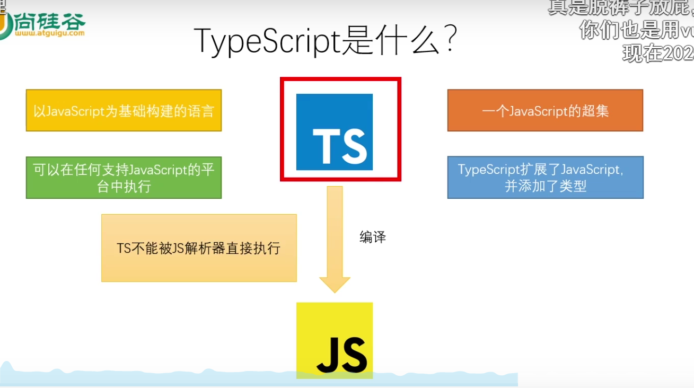
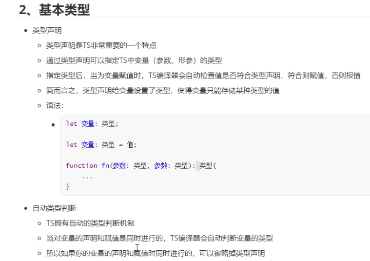
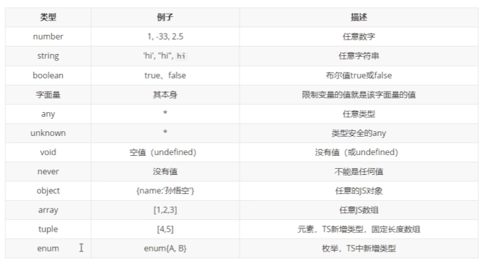
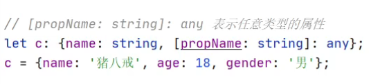
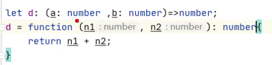
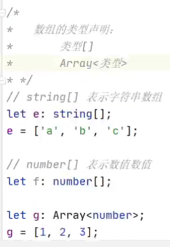
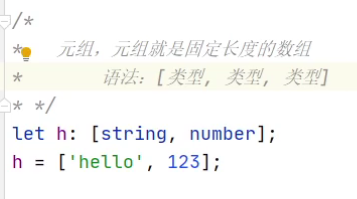
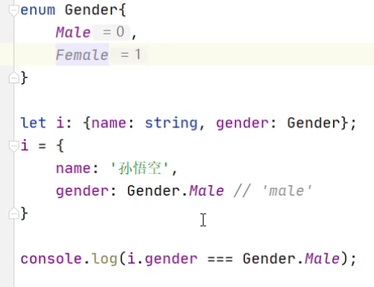
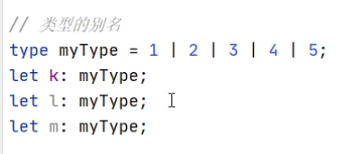
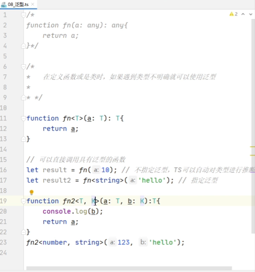

# tsconfig.json文件

`tsconfig.json` 文件用于配置 TypeScript 编译器的行为。它指定了要编译的根文件和编译选项，使得项目中的 TypeScript 代码可以按照预期进行编译和运行。通过这个配置文件，开发者可以控制 TypeScript 编译器的各种行为，如目标 JavaScript 版本、模块系统、类型检查等。

### 主要作用：

1. **指定编译选项**：通过 `compilerOptions` 字段，开发者可以配置 TypeScript 编译器的各种选项，例如目标 ECMAScript 版本、模块系统、严格类型检查等。

2. **定义项目结构**：通过 `include`、`exclude` 和 `files` 字段，开发者可以指定哪些文件和目录需要被编译，哪些不需要。

3. **简化编译命令**：有了 `tsconfig.json` 文件后，只需运行 `tsc` 命令，而不需要每次编译时都指定大量的命令行参数。

### 示例 `tsconfig.json` 文件：

```json
{
  "compilerOptions": {
    "target": "es6",                         // 指定 ECMAScript 目标版本。
    "module": "commonjs",                    // 指定模块系统。
    "strict": true,                          // 启用所有严格类型检查选项。
    "esModuleInterop": true,                 // 允许对 CommonJS 和 ES 模块进行互操作。
    "outDir": "./dist",                      // 指定输出目录。
    "rootDir": "./src",                      // 指定输入文件的根目录。
    "sourceMap": true,                       // 生成 .map 文件以便调试。
    "forceConsistentCasingInFileNames": true // 强制文件名一致性。
  },
  "include": ["src"],                        // 指定要编译的文件和目录。
  "exclude": ["node_modules", "dist"]        // 指定要排除的文件和目录。
}
```

### 常见的 `compilerOptions`：

- **target**: 设置编译后的 JavaScript 版本（如 `es5`, `es6`, `esnext`）。
- **module**: 设置模块系统（如 `commonjs`, `amd`, `es6`）。
- **strict**: 启用所有严格类型检查选项。
- **esModuleInterop**: 允许对 CommonJS 和 ES 模块进行互操作。
- **outDir**: 指定编译输出目录。
- **rootDir**: 指定 TypeScript 源文件的根目录。
- **sourceMap**: 生成源映射文件以便调试。
- **forceConsistentCasingInFileNames**: 强制文件名的一致性大小写。

### 其他选项：

- **include**: 指定要编译的文件和目录。
- **exclude**: 指定要排除的文件和目录。
- **files**: 明确列出要编译的文件。

通过配置 `tsconfig.json` 文件，开发者可以更方便地管理 TypeScript 项目的编译过程，确保代码的质量和一致性。

# [1 TS简介](https://www.bilibili.com/video/BV1Xy4y1v7S2?from=search&seid=16841912106626622736)



# 2 TS开发环境搭建

看到6：24处

TS编译成JS，然后才能交给JS解析器去执行

TS解析器是nodejs写的

```
npm i -g typescript
tsc xxx.ts
```

# 3 TS的类型申明



# 4 TS中类型(1)



# 5 TS中类型(2)

我们在限制一个对象的时候更想要去限制对象里面的属性，而不是限制它是不是一个对象

```js
let b:{name:string}; // 用来指定对象中可以包含哪些属性

b = {}; // 错误
b = {name:'孙悟空'} // 正确
```


```js
let b:{name:string, age:number};

b = {name: '孙悟空'}; // 错误

let b:{name:string, age?:number}; // 加一个？表示该属性可选

b = {name: '孙悟空'}; // 正确
b = {name: '孙悟空', age: 18}; // 正确
```







13min处













# 6 TS编译选项(1)(2)(3)(4)

```js
tsc xxx.ts
tsc xxx.ts -w //ts编译器自动监视文件的变化 starting compilation in watch mode
// File change detected
// 弊端：该自动编译只针对当前文件（一百个文件得开一百个窗口）

// 期望：执行某一个命令，就可以把所有ts文件全部编译成js
tsc
// 能使用tsc命令来编译所有ts文件的前提是项目目录下有一个ts的配置文件
tsc -w
```


ts配置文件：tsconfig.json

```json
{
    "include":["./src/**/*"], // 在写路径的时候，*表示任意文件，**表示任意目录
    "exclude":[], // 默认值：“node_modules”,"bower_components","jspm_packages"
    "extends": "", // 继承配置文件
    "files": [], // 类似include
    
    // 决定了编译器如何去对ts文件进行编译
    "compilerOptions": {
        "target": "ES3", // 用来指定ts被编译为的ES的版本 “es3,es5,es6,es2015,es2016,es2017,es2018,es2019,es2020,esnext”
        "module": "commonjs", // 指定要使用的模块化规范 “none,commonjs,amd,system,umd,es6,es2015,es2020,esnext”
        
        // lib一般情况下不需要改，只有当代码不是在浏览器的环境运行，是在nodejs中运行，里面没有dom
        "lib": ["dom"], // 指定项目中用到哪些库，dom就是其中的一个库 "es5,es6,es2015,es7,es2016,es2017,es2018,es2019,es2020,esnext,dom, dom.iterable, webworker, webworker.importscripts, webworker.iterable, scripthost, es2015.core, es2015.collection, es2015.generator, es2015.iterable, es2015.promise, es2015.proxy, es2015.reflect, es2015.symbol, es2015.symbol.wellknown, es2016.array.include, es2017.object, es2017.sharedmemory, es2017.string, es2017.intl, es2017.typedarrays, es2018.asyncgenerator, es2018.asynciterable, es2018.intl, es2018.promise, es2018.regexp, es2019.array, es2019.object, es2019.string, es2019.symbol, es2019.bigint, es2020.promise, es2020.sharedmemory, es2020.string, es2020.symbol.wellknown, es2020.intl, esnext.array, esnext.symbol, esnext.asynciterable, esnext.intl, esnext.bigint, esnext.string, esnext.promise, esnext.weakref"
        
        // 指定编译后文件所在的目录
        "outDir": "./dist",
        
        // 将代码合并为一个文件
        "outFile": './dist/app.js',
        // only 'amd' and 'system' modules are supported alongside --outFile
        // 要想把多个模块合并成一个文件，模块化规范必须使用amd或者system
        
        // 是否对js文件进行编译，默认是false
        "allowJs": false, // false || true
        
        // 是否检查js代码是否符合规范，默认是false
        "checkJs": true,
        
        // 是否移除注释
        "removeComments": false, // false:不移除 true：移除
        
        // 不生成编译后的文件
        "noEmit": true,
        
        // 当有错误的时候不生成编译文件
        "onEmitOnError": false,
        
        
       
        // 用来设置编译后的文件是否使用严格模式，默认false（不使用严格模式）
        "alwaysStrict": false, // js里的import和export是导入引出模块的，当代码中写了这个之后，JS代码会自动进入到严格模式
        
        // 不允许出现隐式的any类型
        "noImplicitAny": true,
        
        // 不允许不明确类型的this
        "noImplicitThis": true,
        
        // 严格的检查空值
        "strictNullChecks": true,
        
        // 所有严格检查的总开关
        "strict": true
    }
}
```


```js
import {hi} from './m.js'
let a = 10;
console.log(hi);
```

选用commonjs模块化规范编译后:

```js
"use strict";
Object.defineProperty(exports, "__esModule", {value:true});
const m_js_1 = require("./m.js");
let a = 10;
console.log(m_js_1.hi);
```


# 10 使用webpack打包ts代码(1)(2)(3) 14min处

一般在开发大型项目的时候 会用到打包工具

结合ts和打包工具

```json
npm init -y // 生成package.json

npm i -D webpack webpack-cli typescript ts-loader // -D(save dev) 代表开发依赖
// ts-loader：把webpack和ts进行一个整合，变成一体的

npm i -D html-webpack-plugin // 帮助自动生成html文件

npm i -D webpack-dev-server // 安装内置服务器

npm i -D clean-webpack-plugin

npm i -D @babel/core @babel/preset-env @babel-loader core-js

```


webpack.config.json

```json
const path = require('path');
const HTMLWebpackPlugin = require('html-webpack-plugin');
const { CleanWebpackPlugin } = require('clean-webpack-plugin');

module.exports = {
    // 指定入口文件 
    entry: "./src/index.ts",
    
    // 指定打包文件所在目录
    output: {
        // 打包文件所在目录
        path: path.resolve(__dirname, 'dist'),
        // 打包后文件的名字
        filename: "bundle.js"
    },
    
    module: {
        rules: [
            {
                // test指定规则生效的文件
                test: /\.ts$/,
                // 要使用的loader
                use: [
                    // 'babel-loader'
                    {
                        loader: 'babel-loader',
                        options: {
                            // 设置预定义的环境
                            presets: [
                                [
                                    // 指定环境的插件
                                    "@babel-preset-env",
                                    // 配置信息
                                    {
                                        // 要兼容的目标浏览器
                                        targets: {
                                            "chrome": "88",
                                        },
                                        // 指定corejs的版本
                                        "corejs": "3",
                                        // 使用corejs的方式
                                        "useBuiltIns": "usage", // 按需加载
                                        ""
                                    }
                                ]
                            ]
                        }
                    },
                    'ts-loader'
                ],
                // 要排除的文件
                exclude: /node_modules/
            }
        ]
    },
    
    plugin: [
        new CleanWebpackPlugin(),
        new HTMLWebpackPlugin({
            title: "这是一个自定义的title",
            template: "./src/index.html"
        }),
    ],
    
    // webpack默认情况不知道ts可以作为模块使用（不知道哪些文件可以被引入）
    resolve: {
        extensions: ['.ts', '.js']
    }
}
```


package.json

```json
{
    "scripts": {
        "build": "webpack", // npm run build
        "start": "webpack serve --open chrome.exe", // npm start
    }
}
```


# 13 面向对象简介 9min处


# 14 类的简介

```js
class Person{
    // 定义实例属性
    name: string = '孙悟空';
	age: number = 18;

	// 在属性前使用static关键字可以定义类属性（静态属性）
	static age2: number = 18;

	// 只读属性
	readonly name2: string = '猪八戒';

	// 实例方法
	sayHello(){
        console.log('hello大家好');
    }

	// 类方法
	static sayHello1(){
        console.log('hello大家好');
    }
}

const per = new Person();
```


# 15 构造函数和this

```js
class Dog {
	name = '旺财';
	age = 3;
}

class Dog {
	name: string;
	age: number;
    
    // 构造函数在对象创建时调用
	// construtor() {
        // console.log(this);
        // this.name = '旺财';
        // this.age = 18;
    // }
    construtor(name: string, age: number) {
        console.log(this);
        this.name = name;
        this.age = age;
    }
}

const dog = new Dog();
```


# 16 继承简介

```js
class Animal {
    name: string;
	age: number;
    
    construtor(name: string, age: number) {
        console.log(this);
        this.name = name;
        this.age = age;
    }

	sayHello(){
        console.log('动物在叫~')
    }
}

// 通过继承可以将多个类中共有的代码写在一个父类中
class Dog extends Animal{
	run(){
        console.log('狗在跑');
    }
    
    // 如果在子类中添加了和父类相同的方法，则子类方法会覆盖父类方法
    sayHello(){
        console.log('汪汪汪');
    }
}

class Cat extends Animal{
    sayHello(){
        console.log('喵喵喵');
    }
}

const dog = new Dog('旺财', 5);
const cat = new Cat('Mi', 3);
```


# 17 super关键字

```js
class Animal {
    name: string;
	age: number;
    
    construtor(name: string, age: number) {
        console.log(this);
        this.name = name;
        this.age = age;
    }

	sayHello(){
        console.log('动物在叫~')
    }
}

// 通过继承可以将多个类中共有的代码写在一个父类中
class Dog extends Animal{
	run(){
        console.log('狗在跑');
    }
    
    sayHello(){
        console.log('汪汪汪');
    }
}

class Cat extends Animal{
    age: number;

	constructor(name: string, age: number){
        // 如果在子类中写了构造函数,在子类的构造函数中必须对父类的构造函数进行调用
        super(name);
        this.age = age;
    }

    sayHello(){
        // super表示当前类的父类
        super.sayHello();
    }
}

const dog = new Dog('旺财', 5);
const cat = new Cat('Mi', 3);
```

# 18 抽象类

# 19 接口

# 20 属性的封装

4min处

# [21 泛型](https://www.bilibili.com/video/BV1Xy4y1v7S2?p=21&vd_source=a7089a0e007e4167b4a61ef53acc6f7e)




# interface和type的区别

在TypeScript中，可以使用接口（`interface`）或类型别名（`type`）来表示一个对象的结构和属性。以下是如何表示一个包含两个具体属性的对象参数的示例。

### 使用接口（`interface`）

```typescript
interface MyObject {
  property1: string;
  property2: number;
}

function processObject(obj: MyObject) {
  console.log(obj.property1);
  console.log(obj.property2);
}

// 调用示例
const exampleObj: MyObject = {
  property1: "Hello",
  property2: 42
};

processObject(exampleObj);
```

### 使用类型别名（`type`）

```typescript
type MyObject = {
  property1: string;
  property2: number;
};

function processObject(obj: MyObject) {
  console.log(obj.property1);
  console.log(obj.property2);
}

// 调用示例
const exampleObj: MyObject = {
  property1: "Hello",
  property2: 42
};

processObject(exampleObj);
```

### 说明

- **接口（`interface`）**:
  - 主要用于定义对象的结构和类型。
  - 支持扩展和合并（通过`extends`和合并声明）。

- **类型别名（`type`）**:
  - 也可以定义对象的结构，但可以用于定义其他类型（例如联合类型、交叉类型）。
  - 不支持扩展和合并。

选择`interface`还是`type`取决于具体需求。在定义简单对象结构时，`interface`和`type`都可以有效地表达所需的类型。


