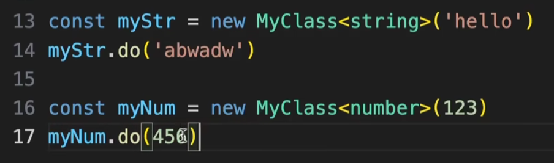

https://www.bilibili.com/video/BV1q64y1j7aH/?spm_id_from=333.337.search-card.all.click&vd_source=a7089a0e007e4167b4a61ef53acc6f7e

# 1. 函数重载

JS中不支持函数重载

> 函数重载：创建多个名称一样，但是参数类型和返回值不同的函数，以便能够达到编写一个函数，实现多种功能的目的


疑问：一定需要第三行的代码吗？？？有了第三行为啥还需要第一行和第二行的代码？？？

# 2. 接口继承


# 3. 类的修饰符

|  |  |
| ------------------------------------------------------------ | ------------------------------------------------------------ |

private：只能在当前类的内部去使用

protected：只能在当前类的内部或者子类中进行访问

# 4. 存取器

> 存取器类似于我们在操作时候使用的getter跟setter
>
> 只不多TS中提供了一种单独的设置方式


# 5. 抽象类

> 抽象类是我们在使用类的时候比较常见的一种使用形式
>
> 抽象类它是用来作为子类基类去使用的


对于Animal来说，它本身不具备一个实例化的的需求

可以理解为它就是用来去规范格式的

这种类就非常适合作为抽象类来设置

# 6. 类实现接口

> 通过interface来定义类应该具有的行为

|  |  |
| ------------------------------------------------------------ | ------------------------------------------------------------ |

注意：这里不是继承，因为类不可能继承自一个接口。接口本身是没有功能的。叫做实现。

# 7. 泛型类




# 8. 泛型

> 泛型允许在定义函数、类或接口时不指定具体的类型，而是使用占位符，等到实际使用时再指定具体类型。

### 1. **泛型的基本概念**

泛型允许你在定义函数、接口或类时，不指定具体的类型，而是在使用时再指定具体的类型。这可以通过在函数、接口或类名称后面添加一个或多个类型参数来实现。类型参数通常使用大写字母 `T` 表示，但你可以使用任何有效的标识符。

#### 示例：
```typescript
function identity<T>(arg: T): T {
    return arg;
}
```
在上面的代码中，`identity` 函数接受一个类型参数 `T`，并返回一个相同类型的值。当你调用这个函数时，可以显式地指定类型，也可以让 TypeScript 推断类型：

```typescript
let output1 = identity<string>("Hello"); // T 被推断为 string
let output2 = identity(42); // T 被推断为 number
```

### 2. **泛型函数**

泛型函数是最常见的泛型使用场景。你可以编写一个函数，使其能够处理不同类型的数据，而无需为每种类型编写单独的实现。

#### 示例：
```typescript
function logLength<T>(arg: T[]): void {
    console.log(arg.length);
}

logLength<string>(["Hello", "World"]); // 输出: 2
logLength<number>([1, 2, 3, 4]); // 输出: 4
```

### 3. **泛型接口**

你可以使用泛型定义接口，这使得接口可以与不同的数据类型一起使用。例如，一个用于获取数据的接口可以定义为泛型。

#### 示例：
```typescript
interface ApiResponse<T> {
    data: T;
    status: number;
    message: string;
}

function fetchData<T>(url: string): ApiResponse<T> {
    // 假设我们通过url获取了数据
    let data: T = JSON.parse("some data"); // 这是一个例子
    return {
        data,
        status: 200,
        message: "Success"
    };
}

const userResponse = fetchData<{ name: string, age: number }>("api/user");
// userResponse.data 将具有 { name: string, age: number } 类型
```

### 4. **泛型类**

泛型类允许你定义一个可以处理不同类型数据的类。你可以为类的属性或方法指定泛型类型参数。

#### 示例：
```typescript
class GenericNumber<T> {
    zeroValue: T;
    add: (x: T, y: T) => T;

    constructor(zeroValue: T, addFunction: (x: T, y: T) => T) {
        this.zeroValue = zeroValue;
        this.add = addFunction;
    }
}

let numberInstance = new GenericNumber<number>(0, (x, y) => x + y);
console.log(numberInstance.add(5, 10)); // 输出: 15

let stringInstance = new GenericNumber<string>("", (x, y) => x + y);
console.log(stringInstance.add("Hello, ", "World!")); // 输出: Hello, World!
```

### 5. **泛型约束**

有时候你希望泛型类型符合某些条件，比如具有某些属性或方法。这时可以使用泛型约束（Constraints）。

#### 示例：
```typescript
interface Lengthwise {
    length: number;
}

function logWithLength<T extends Lengthwise>(arg: T): void {
    console.log(arg.length);
}

// logWithLength(10); // 错误：数字没有 length 属性
logWithLength({ length: 10, value: "Hello" }); // 输出: 10
```

在这个例子中，泛型 `T` 被约束为 `Lengthwise` 接口，因此传入的参数必须有 `length` 属性。

### 6. **泛型的默认类型**

在某些情况下，你可以为泛型参数指定默认类型，以便在调用时不显式指定类型。

#### 示例：
```typescript
function createPair<T = string, U = number>(x: T, y: U): [T, U] {
    return [x, y];
}

let pair1 = createPair("Hello", 42); // [string, number]
let pair2 = createPair("World"); // [string, number] 因为 U 的默认值是 number
```

### 7. **泛型的实用场景**

- **封装数据结构**：泛型常用于封装像数组、队列、栈等数据结构，使它们能够处理任意类型的数据。
- **创建可重用组件**：通过泛型，你可以创建更通用的组件，如表单控件、列表渲染器等，这些组件可以用于不同的数据类型。
- **增强类型安全性**：泛型允许你在编写代码时更好地利用 TypeScript 的类型检查，从而减少运行时错误。

### 8. **泛型工具类型**

TypeScript 提供了一些内置的泛型工具类型，如 `Partial<T>`、`Readonly<T>`、`Record<K, T>` 等，这些工具类型利用泛型增强了对类型的操作能力。

#### 示例：
```typescript
interface Todo {
    title: string;
    description: string;
}

// Partial<T> 将 Todo 的所有属性变为可选
let partialTodo: Partial<Todo> = {
    title: "Buy milk"
};
```

### 总结

TypeScript 的泛型机制为编写灵活、可重用的代码提供了强大的工具。理解并掌握泛型的使用可以极大地提升代码的质量和维护性。在实际应用中，通过泛型，你可以有效地减少代码重复，并确保在不同场景下的类型安全。

# [9. any和unknown的区别](https://www.bilibili.com/video/BV1Bj411V7MV/?spm_id_from=333.337.search-card.all.click&vd_source=a7089a0e007e4167b4a61ef53acc6f7e)

## 赋值时候的表现

1. 任意类型可以赋值给any

   ```typescript
   let p1: any = 47;
   let p2: any = 'Hello';
   let p3: any = {}
   // ...
   ```

2. any也可以赋值给任意类型

   ```typescript
   let p: any = 47;
   let num: number = p;
   let str: string = p;
   let obj: object = p;
   // ...
   ```

3. 任意类型可以赋值给unknown

   ```ts
   let p1: unknown = 47;
   let p2: unknown = 'Hello';
   let p3: unknown = {};
   // ...
   ```

4. 但unknown只能给unknown或any类型赋值

   ```typescript
   let p: unknown = 47;
   let x: unknown = p;
   let y: any = p;
   let num: number = p; // 报错: Type 'unknown' is not assignable to type 'number'.ts(2322)
   let str: string = p; // 报错：Type 'unknown' is not assignable to type 'string'.ts(2322)
   // ...
   ```

## 安全性方面比较

unknown是更加安全的any类型，一般要配合类型检查和类型断言才能对其操作，否则在编译阶段就会报错。

# 10. any和unknown的区别

在 TypeScript 中，`unknown` 和 `any` 是两种不同的类型，它们在类型安全和代码的可预测性方面有着不同的作用。以下是两者的区别：

### 1. **`any` 类型**

- **描述**：`any` 类型可以表示任意类型的值。使用 `any` 的变量可以赋值为任意类型，并且在访问该变量的属性或调用方法时不会进行类型检查。
- **优点**：可以方便地绕过类型检查，使代码更加灵活。
- **缺点**：丧失了类型安全，因为 TypeScript 无法知道这个值的类型，编译时不会提示类型错误。

**示例**：
```typescript
let value: any;
value = 42;
value = "hello";
value = true;

console.log(value.toUpperCase()); // 没有类型检查，可能导致运行时错误
```

在上面的代码中，`value` 变量可以随意更改类型，并且 TypeScript 编译器不会进行任何检查。这虽然灵活，但可能会导致错误的代码无法被及时发现。

### 2. **`unknown` 类型**

- **描述**：`unknown` 类型也可以表示任意类型的值，但与 `any` 不同的是，`unknown` 类型在未进行类型检查或类型断言之前不能进行任何操作。这意味着你必须先检查或确定类型，然后才能使用它。
- **优点**：提供了更高的类型安全性。使用 `unknown` 可以确保在操作前进行适当的类型检查。
- **缺点**：需要额外的类型检查步骤，代码可能略显繁琐。

**示例**：
```typescript
let value: unknown;
value = 42;
value = "hello";
value = true;

// 需要先进行类型检查或类型断言，才能使用它
if (typeof value === "string") {
    console.log(value.toUpperCase()); // 只有在确定是 string 时才能调用 toUpperCase 方法
}

// 或者通过类型断言
console.log((value as string).toUpperCase()); // 如果你确定类型，可以使用类型断言
```

在这个例子中，`value` 是 `unknown` 类型，在使用它之前，必须先通过 `typeof` 检查它是否是 `string` 类型，或者通过类型断言将它转换为 `string` 类型。

### 3. **总结**

- **`any`**：使用 `any` 时，类型检查器完全跳过该变量的类型检查，使代码灵活但容易出错。
- **`unknown`**：使用 `unknown` 时，类型检查器会强制要求你在使用该变量前进行类型检查或类型断言，这提供了额外的安全性。

通常，`unknown` 被认为是 `any` 的一种更安全的替代方案，因为它鼓励你在操作之前明确地处理类型。
