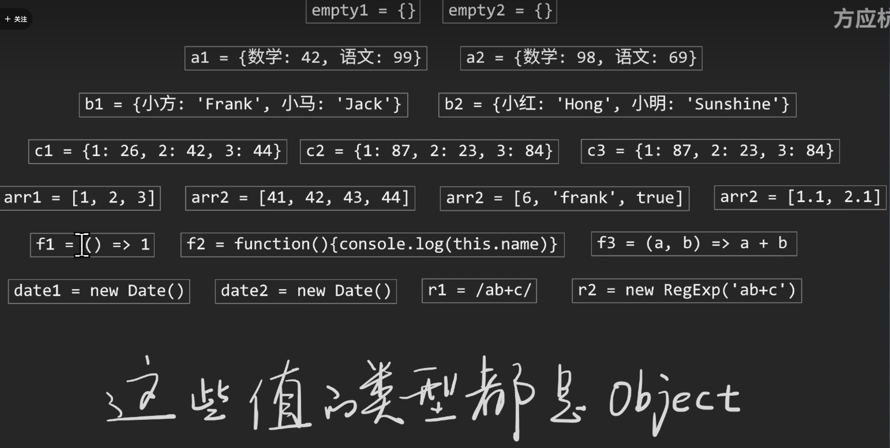
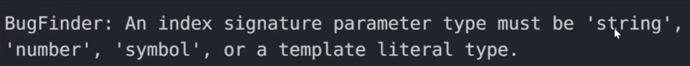
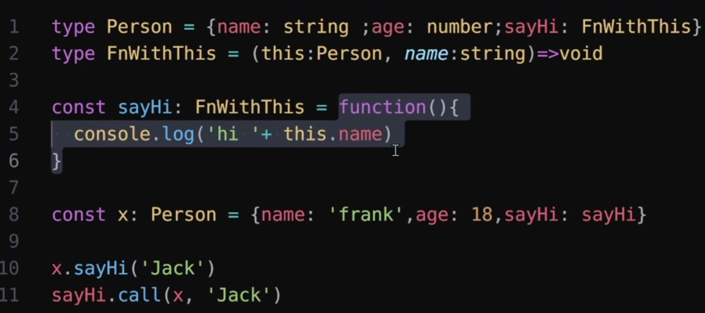
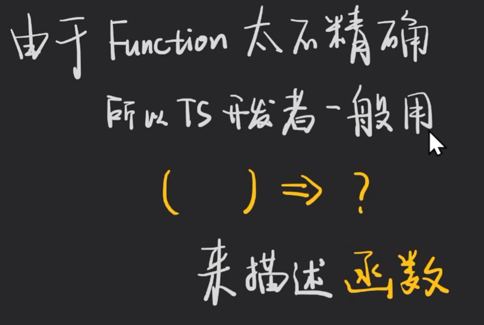

# 1. 开启TS严格模式

要开启 TypeScript 的严格模式，可以通过配置 TypeScript 的 `tsconfig.json` 文件来实现。严格模式下，TypeScript 会进行更严格的类型检查，从而帮助你捕获更多的潜在错误。

### 具体步骤：

1. **创建或打开 `tsconfig.json` 文件**:
   - 如果你还没有 `tsconfig.json` 文件，可以使用以下命令生成：

   ```bash
   tsc --init
   ```

   这会在项目根目录下生成一个 `tsconfig.json` 文件。

2. **启用严格模式**:
   - 在 `tsconfig.json` 文件中找到或添加 `"strict"` 选项，并将其设置为 `true`：

   ```json
   {
     "compilerOptions": {
       "strict": true
     }
   }
   ```

   设置 `"strict": true` 会同时开启以下几个更具体的严格性检查：

   - **`strictNullChecks`**: 禁用隐式的 `null` 和 `undefined` 的赋值。
   - **`strictFunctionTypes`**: 严格检查函数类型的赋值。
   - **`strictBindCallApply`**: 严格检查 `bind`、`call` 和 `apply` 方法的参数类型。
   - **`strictPropertyInitialization`**: 检查类的实例属性是否在构造函数中正确初始化。
   - **`noImplicitAny`**: 不允许变量和参数隐式地具有 `any` 类型。
   - **`noImplicitThis`**: 不允许隐式的 `this` 类型为 `any`。
   - **`alwaysStrict`**: 在所有编译的文件中启用严格模式（即 `"use strict"`）。

   如果你想单独控制这些选项，可以分别设置它们：

   ```json
   {
     "compilerOptions": {
       "strict": true,
       "strictNullChecks": true,
       "strictFunctionTypes": true,
       "strictBindCallApply": true,
       "strictPropertyInitialization": true,
       "noImplicitAny": true,
       "noImplicitThis": true,
       "alwaysStrict": true
     }
   }
   ```

### 示例 `tsconfig.json`

以下是一个包含严格模式配置的 `tsconfig.json` 示例：

```json
{
  "compilerOptions": {
    "target": "es5",
    "module": "commonjs",
    "strict": true,              // 启用严格模式
    "strictNullChecks": true,    // 单独启用严格的 null 检查
    "strictFunctionTypes": true, // 单独启用严格的函数类型检查
    "noImplicitAny": true,       // 禁用隐式的 any 类型
    "strictPropertyInitialization": true // 检查类属性的初始化
  }
}
```

### 总结
开启严格模式可以让 TypeScript 帮助你捕捉更多的潜在问题，进一步提高代码的安全性和可维护性。在 `tsconfig.json` 中设置 `"strict": true` 是最简单的方法，它会启用一组严格的类型检查选项。如果你希望更细粒度地控制这些检查，可以单独设置各个选项。

# 2. 解决出现never类型的场景

在 TypeScript 中，`never` 类型通常出现在类型检查推断出某个变量不可能有任何有效值的情况下。对于你提供的代码片段，如果 `prevCompressed` 中的 `msg` 和 `rMsg` 被推断为 `never[]`，通常是因为 TypeScript 无法推断出这些属性的具体类型，或者你没有给它们赋予一个初始值。

要避免 `never` 类型的出现，可以通过以下几种方法：

### 1. 明确声明数组的类型

你可以显式地为 `msg` 和 `rMsg` 数组指定它们包含的元素类型，例如 `string[]`、`number[]`、`any[]` 等。这样可以确保 TypeScript 正确推断出数组的类型。

```typescript
let prevCompressed: {
    msg: string[];
    rMsg: string[];
} = {
    msg: [],
    rMsg: []
};
```

在上面的例子中，`msg` 和 `rMsg` 都被显式地声明为 `string[]` 类型的数组，因此它们的初始值 `[]` 将被正确识别为一个空的字符串数组，而不是 `never[]`。

### 2. 基于现有值推断类型

如果你在定义对象时就赋予了数组具体的值，TypeScript 将根据这些值推断出正确的类型，而不会将它们推断为 `never[]`。

```typescript
let prevCompressed = {
    msg: ['initial message'],  // 推断为 string[]
    rMsg: ['initial response'] // 推断为 string[]
};
```

### 3. 使用泛型或接口定义

如果 `prevCompressed` 是一个泛型对象或者是从接口继承的，你可以定义一个泛型接口或类型别名来指定这些数组的类型。

```typescript
interface CompressedMessages<T> {
    msg: T[];
    rMsg: T[];
}

let prevCompressed: CompressedMessages<string> = {
    msg: [],
    rMsg: []
};
```

### 4. 避免不必要的类型推断

如果 `never` 类型是由于某些类型推断错误导致的，可以通过显式声明或提供初始值来避免。例如，在函数返回值或者条件判断中，显式地为返回值指定类型可以避免 `never` 出现。

### 总结

`never[]` 通常是因为 TypeScript 无法推断出数组元素的类型。通过显式地声明类型、提供初始值或者使用泛型接口等方式，你可以避免 `never` 类型的出现，并确保 TypeScript 能够正确推断出数组的元素类型。

# [3. 用类型签名和Record描述对象](https://www.bilibili.com/video/BV1aa411P7Zk/?spm_id_from=333.337.search-card.all.click&vd_source=a7089a0e007e4167b4a61ef53acc6f7e)

```ts
type CatName = "miffy" | "boris" | "mordred";
 
interface CatInfo {
  age: number;
  breed: string;
}
 
const cats: Record<CatName, CatInfo> = {
  miffy: { age: 10, breed: "Persian" },
  boris: { age: 5, breed: "Maine Coon" },
  mordred: { age: 16, breed: "British Shorthair" },
};
```

用类型签名和Record描述对象

```typescript
// type Object表示的范围太大了
type A = Object;
const a: Object = []
const b: Object = function(){}
```


|  |  |
| ------------------------------------------------------------ | ------------------------------------------------------------ |


```typescript
type Person = {
    name: string;
    age: number
}

const a: Person = {
    name: 'frank',
    age: 18
}
```


```typescript
// 签名索引
// A表示key为string，value为number的所有对象
type A = {
    [k: string] : number
}
// k是可变的，可以取任意字母


type A2 = Record<string, number>
```

上面代码中，k的类型可以不是string吗？——可以。还可以是number和symbol




# [4. 用[]和Array泛型描述数组](https://www.bilibili.com/video/BV1qG411t7B8?spm_id_from=333.788.videopod.sections&vd_source=a7089a0e007e4167b4a61ef53acc6f7e)

|  |  |
| ------------------------------------------------------------ | ------------------------------------------------------------ |

```typescript
// const arr: Array = [1, 2, 3];
// 报错：Generic type 'Array<T>' requires 1 type argument(s).ts(2314)

const arr2: Array<number> = [1, 2, 3]
const arr3: number[] = [1, 2, 3]
```

# [5. 描述函数对象](https://www.bilibili.com/video/BV1iP411L77W?spm_id_from=333.788.videopod.sections&vd_source=a7089a0e007e4167b4a61ef53acc6f7e)

|  |  |
| ------------------------------------------------------------ | ------------------------------------------------------------ |
|  |                                                              |

# [6. never类型怎么用](https://www.bilibili.com/video/BV1Ua411o77G?spm_id_from=333.788.videopod.sections&vd_source=a7089a0e007e4167b4a61ef53acc6f7e)

any是全集，never是空集，unknown是未知集


空集有什么用呢？——空集用来做检查


string类型和number类型没有交集，所以A的类型就是never

never不是用来声明的，而是用来推断的


# 7. Partial

在 TypeScript 中，`Partial` 是一个非常有用的工具类型，它的作用是将一个类型的所有属性变为 **可选**（即将所有属性的类型设置为 `T ·| undefined`）。通过使用 `Partial`，你可以·从一个类型中衍生出一个新类型，该类型具有与原类型相同的属性，但所有的属性都是可选的。

### **1. `Partial` 的定义**

`Partial` 类型是 TypeScript 提供的内置工具类型，定义如下：

```ts
type Partial<T> = {
  [P in keyof T]?: T[P];
};
```

- `T` 是我们传入的原始类型。
- `keyof T` 是原类型 `T` 的所有键（属性名）的联合类型。
- `[P in keyof T]` 是 **映射类型**，它遍历了 `T` 的所有键。
- `T[P]` 是原类型中属性的类型。
- `?:` 将每个属性标记为可选属性。

简而言之，`Partial<T>` 会遍历类型 `T` 的所有属性，并将它们变成 **可选**，这样就可以在使用该类型时省略某些属性。

### **2. 使用示例**

#### **基本用法：**

假设我们有一个接口 `User`，定义了一个用户的基本信息：

```ts
interface User {
  id: number;
  name: string;
  email: string;
}
```

如果我们希望创建一个 **部分更新** 用户信息的类型，比如只需要提供部分字段，而不是完整的 `User` 对象，使用 `Partial` 就非常方便：

```ts
function updateUser(id: number, userInfo: Partial<User>) {
  // 只更新传入的属性
  console.log(id, userInfo);
}

// 可以只传递部分字段
updateUser(1, { name: "Alice" });  // 只更新 name
updateUser(2, { email: "bob@example.com" });  // 只更新 email
```

在这个例子中，`Partial<User>` 表示一个 **可能包含 `User` 类型的一部分** 的对象，所有属性都变成了可选的。你可以传入部分字段而不必提供所有字段。

#### **另一个例子：**

```ts
interface Todo {
  title: string;
  description: string;
  completed: boolean;
}

function updateTodo(todo: Partial<Todo>) {
  // 可以部分更新 todo
  console.log(todo);
}

updateTodo({ title: "New Task" });  // 只更新 title
updateTodo({ completed: true });    // 只更新 completed
updateTodo({ description: "A new task description", completed: false });  // 更新多个字段
```

在这个例子中，`Partial<Todo>` 允许我们传入一个 **部分的 `Todo`** 对象，其中的字段都是可选的。

### **3. `Partial` 与可选属性**

`Partial<T>` 使得 **原类型的所有属性都变为可选**。也就是说，如果你有一个对象类型，其中的一些属性已经是可选的，使用 `Partial` 后，这些属性仍然是可选的，其他没有标记为可选的属性也会变成可选。

#### **示例：**

```ts
interface User {
  id: number;
  name?: string;
  email: string;
}

// 使用 Partial
type PartialUser = Partial<User>;
// PartialUser 变成了 {
//   id?: number;
//   name?: string;
//   email?: string;
// }
```

在上面的例子中，`name` 本来是可选的，但在 `Partial<User>` 类型中，`id` 和 `email` 也变成了可选的。

### **4. `Partial` 与函数的结合**

`Partial` 类型通常在需要更新、修改、合并或者处理部分字段时非常有用。比如在合并对象或更新部分数据时，`Partial` 可以避免你必须传入整个对象。

#### **示例：**

```ts
interface Person {
  name: string;
  age: number;
  address: string;
}

// 合并对象的函数，接收一个完整的对象和一个部分更新的对象
function merge<T>(base: T, update: Partial<T>): T {
  return { ...base, ...update };
}

const person: Person = { name: "John", age: 25, address: "USA" };

const updatedPerson = merge(person, { age: 26 });  // 只更新 age
console.log(updatedPerson);  // { name: "John", age: 26, address: "USA" }
```

在这个例子中，`merge` 函数接收一个 `Person` 对象和一个 **部分更新** 的 `Person` 对象。我们用 `Partial<T>` 来确保 `update` 对象只包含 `Person` 的部分字段，并且这些字段是可选的。

### **5. `Partial` 的实际应用场景**

1. **处理更新和部分字段：** 当你需要处理 **部分数据更新** 时，`Partial` 是非常有用的工具。例如，在做 **CRUD 操作**（增、删、改、查）时，通常只更新某些字段而不是整个对象。
2. **合并对象：** 使用 `Partial` 可以实现类似合并的操作（比如 `Object.assign`），但在合并时允许传入部分字段。
3. **默认参数：** 在函数中使用 `Partial` 可以让你为参数提供默认值，避免强制要求传递完整的对象。

#### **示例：**

在处理一些表单数据时，可能只传递部分字段：

```ts
interface FormData {
  name: string;
  email: string;
  phone?: string;
}

function submitForm(data: Partial<FormData>) {
  // 处理表单提交
  console.log(data);
}

submitForm({ name: "Alice" });  // 只提交 name
submitForm({ email: "bob@example.com", phone: "1234567890" });  // 提交 email 和 phone
```

### **6. `Partial` 与其他工具类型的组合使用**

`Partial` 还可以与其他 TypeScript 工具类型配合使用，提供更强的类型推导和操作。

#### **与 `Required` 结合：**

`Required<T>` 是 `Partial<T>` 的对立面，它会将所有属性变成 **必选** 的。因此，`Required<Partial<T>>` 会将属性既转为必选，又转为 **非 `undefined`**。

```ts
type CompleteUser = Required<Partial<User>>;
// CompleteUser 变成了:
// {
//   id: number;
//   name?: string;
//   email: string;
// }
```

#### **与 `Readonly` 结合：**

你也可以将 `Partial` 与 `Readonly` 结合，使得属性在变为可选的同时，也变为只读属性：

```ts
type ReadonlyPartial<T> = Readonly<Partial<T>>;
```

------

### **7. 总结**

- **作用**：`Partial<T>` 将一个类型的所有属性变为 **可选**。
- 应用场景：
  - 用于函数参数中，只更新对象的一部分。
  - 在进行部分数据更新时，避免传递完整对象。
  - 合并多个对象时，可以方便地只更新需要改变的字段。
- **行为**：`Partial<T>` 生成一个新类型，其中所有的属性变成可选。即使原本属性已经是可选的，`Partial` 仍然会将其变为可选。
- **与其他工具类型结合**：`Partial` 可以与其他工具类型（如 `Required`、`Readonly` 等）结合，提供更加灵活的类型推导。

通过掌握 `Partial`，你可以在开发中灵活处理数据更新和对象合并，避免对整个对象进行强制要求，提升代码的可维护性和灵活性
