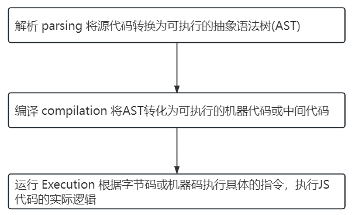

# 面试题

在互联网公司的前端面试中，TypeScript 相关的面试题通常涉及类型系统的应用、类型推导、工具类型、泛型、以及如何在实际项目中利用 TypeScript 提高代码的可靠性和可维护性。以下是一些典型的 TypeScript 相关面试题：

### 基础题

1. **TypeScript 和 JavaScript 的区别是什么？为什么使用 TypeScript？**
   
   - 回答重点：静态类型、类型检查、提高代码健壮性、工具支持（如 IDE 自动补全和重构）、ES6+ 支持。
   
2. **如何声明和使用接口？接口和类型别名的区别？**
   
   - 回答重点：`interface` 和 `type` 的基本用法，扩展接口、交叉类型、联合类型的区别，使用场景。
   
3. **如何在 TypeScript 中声明一个函数类型？**
   ```typescript
   type MyFunction = (arg1: number, arg2: string) => boolean;
   ```

4. **TypeScript 中的类型推导是如何工作的？**
   
   - 回答重点：TypeScript 自动推断类型的机制以及如何利用它避免显式类型注释。
   
5. **TypeScript 中 `any`、`unknown`、`never` 和 `void` 的区别？**
   
   - 回答重点：
     - `any`: 关闭类型检查；
     - `unknown`: 更安全的 `any`；
     - `never`: 永远不会出现的类型（如抛出异常或无限循环的函数）；
     - `void`: 没有返回值的函数。

### 进阶题

6. **如何用 TypeScript 实现一个泛型函数？泛型函数的应用场景？**
   ```typescript
   function identity<T>(arg: T): T {
     return arg;
   }
   ```
   - 泛型应用场景：函数或类可以适用于多种类型，如数组处理、Promise、React Hooks 等。

7. **如何在 TypeScript 中创建一个可选参数？如何给函数参数设置默认值？**
   ```typescript
   function greet(name: string, greeting: string = "Hello") {
     console.log(`${greeting}, ${name}!`);
   }
   ```

8. **如何使用类型守卫（Type Guards）？**
   
   - 回答重点：类型守卫是 TypeScript 提供的一种机制，帮助区分联合类型中的不同类型，常见方法有 `typeof`、`instanceof`、自定义类型谓词。
   ```typescript
   function isString(value: unknown): value is string {
     return typeof value === "string";
   }
   ```
   
9. **如何通过 TypeScript 定义一个 `Readonly` 类型，阻止对象属性被修改？**
   
   - 回答重点：使用 `Readonly` 工具类型。
   ```typescript
   const obj: Readonly<{ name: string }> = { name: "John" };
   obj.name = "Doe"; // Error: Cannot assign to 'name' because it is a read-only property.
   ```
   
10. **TypeScript 中如何使用 `Partial`、`Pick`、`Omit` 等工具类型？这些类型如何帮助我们进行类型操作？**
    
    - 回答重点：`Partial`、`Pick`、`Omit` 等工具类型用于基于现有类型进行修改。
    ```typescript
    type Person = { name: string; age: number; address: string };
    type PartialPerson = Partial<Person>; // 所有属性变为可选
    type PickPerson = Pick<Person, "name" | "age">; // 只选定部分属性
    type OmitPerson = Omit<Person, "address">; // 去掉某个属性
    ```
    
11. **如何用 TypeScript 实现一个深度部分可选的类型？**
    
    - 考察泛型递归和工具类型的应用。
    ```typescript
    type DeepPartial<T> = {
      [P in keyof T]?: T[P] extends object ? DeepPartial<T[P]> : T[P];
    };
    ```

### 实际项目场景题

12. **在 TypeScript 项目中如何管理复杂的类型定义？**
    
    - 回答重点：使用声明文件（`.d.ts`）、模块类型导出、使用 `type` 和 `interface` 管理代码的可维护性，避免类型重复。
    
13. **在 Redux 中如何用 TypeScript 定义 `Action` 和 `Reducer`？**
    - 回答重点：使用 `enum` 定义 `Action` 类型，利用泛型定义 `Reducer` 函数的参数类型和返回值类型。
    ```typescript
    enum ActionTypes {
      INCREMENT = "INCREMENT",
      DECREMENT = "DECREMENT"
    }
    
    interface IncrementAction {
      type: ActionTypes.INCREMENT;
    }
    
    interface DecrementAction {
      type: ActionTypes.DECREMENT;
    }
    
    type Action = IncrementAction | DecrementAction;
    
    function reducer(state: number, action: Action): number {
      switch (action.type) {
        case ActionTypes.INCREMENT:
          return state + 1;
        case ActionTypes.DECREMENT:
          return state - 1;
        default:
          return state;
      }
    }
    ```

14. **如何在 React 项目中使用 TypeScript 处理组件的 `props` 和 `state`？**
    - 回答重点：`props` 使用接口声明，`state` 通过泛型传递类型，函数组件和类组件的写法。
    ```typescript
    interface MyComponentProps {
      name: string;
      age: number;
    }
    
    const MyComponent: React.FC<MyComponentProps> = ({ name, age }) => {
      return <div>{name} - {age}</div>;
    };
    ```

15. **在实际开发中，TypeScript 如何帮助你发现潜在的 bug？举一个你遇到的例子？**
    - 回答重点：结合实际项目经验，讲述类型系统如何帮助你避免常见错误，如 `null`/`undefined` 检查、函数参数不匹配、接口不一致等。

### 源码和工具相关题

16. **TypeScript 编译器的 `strict` 模式有什么作用？**
    - 回答重点：`strict` 模式开启后，会启用多种严格检查（如 `noImplicitAny`、`strictNullChecks`、`strictFunctionTypes`），确保代码质量。

17. **如何配置 `tsconfig.json` 使 TypeScript 项目支持严格的类型检查？**
    ```json
    {
      "compilerOptions": {
        "strict": true,
        "noImplicitAny": true,
        "strictNullChecks": true,
        "strictFunctionTypes": true,
        "strictBindCallApply": true
      }
    }
    ```

18. **如何通过 TypeScript 解决跨项目依赖的问题？**
    - 回答重点：通过 `path` alias 和 `tsconfig.json` 中的 `paths` 字段来解决模块引用问题。

19. **如何调试 TypeScript 项目？**
    - 回答重点：使用 Source Maps，结合 Chrome DevTools 或 VSCode 进行调试，配置 `tsconfig.json` 中的 `"sourceMap": true`。

### 综合应用题

20. **如何利用 TypeScript 和 `type inference`（类型推断）机制设计一个更加灵活的函数？**
    - 例如实现一个根据传入参数类型自动推断返回类型的函数。

---

这些问题涵盖了 TypeScript 从基础到进阶的概念，涉及了类型系统、工具类型、实际开发中的应用等内容，常用于考察候选人对 TypeScript 的掌握程度以及在项目中的应用能力。

# 1. TS 和 JS 的区别

1. **静态类型 vs. 动态类型**
   - **JavaScript**：是一种动态类型语言，变量的类型是在运行时确定的，可以随时改变。
   - **TypeScript**：是一种**静态类型**语言，类型在编译时就确定了。通过显式的类型注解，TypeScript 可以在编译阶段检查代码中的类型错误，避免在运行时出现类型不匹配的问题。

2. **编译时检查 vs. 运行时检查**
   - **JavaScript**：由于是动态类型语言，只有在运行时才能捕获类型错误，容易导致潜在的 bug。
   - **TypeScript**：通过类型系统，TypeScript 能在编译时发现代码中的类型错误，减少运行时错误的发生。

3. **类型推断**
   - **JavaScript**：没有类型推断，所有变量的类型都只能通过运行时确定。
   - **TypeScript**：具有类型推断功能，虽然可以不显式声明类型，但 TypeScript 能自动推断变量的类型，并在类型不匹配时给出错误提示。

4. **支持现代 JavaScript 特性**
   - **JavaScript**：通常需要 Babel 等工具才能使用最新的 ECMAScript 特性。
   - **TypeScript**：TypeScript 是 ECMAScript 标准的超集，支持所有最新的 JavaScript 特性，并且可以通过编译目标的配置支持将代码编译为不同版本的 JavaScript。

5. **额外的类型特性**
   - **TypeScript**：引入了很多 JavaScript 不具备的类型特性，如**接口（Interface）**、**枚举（Enum）**、**泛型（Generics）**等，提供了更强大的类型系统，增强了代码的可维护性。

6. **工具类型**
   - **TypeScript**：提供了丰富的工具类型（如 `Partial`、`Pick`、`Omit` 等），可以通过组合现有类型创建新的类型。

7. **开发体验**
   - **JavaScript**：需要借助工具提供自动补全和类型提示功能，但没有强制的类型检查。
   - **TypeScript**：结合静态类型分析，IDE 能提供更强大的代码补全、跳转、重构、类型检查等功能，提升了开发体验。

TypeScript 通过引入静态类型检查和增强的类型系统，解决了 JavaScript 在开发大型项目时的安全性和可维护性问题，同时保留了 JavaScript 的灵活性和动态性。它是 JavaScript 的超集，既可以让开发者继续使用熟悉的 JavaScript 语法，又能带来类型检查带来的诸多优势。

# 2. 为什么使用 TS

1. **提高代码的安全性和可靠性**
   - 静态类型检查帮助发现代码中的类型错误，减少运行时异常和潜在 bug。
   - 特别是在大型项目中，静态类型系统能够有效控制代码质量，防止由于类型问题引起的不可预见的错误。

2. **增强代码的可维护性**
   - 明确的类型定义让代码更易读、更可维护。团队协作时，通过类型可以清晰知道变量、函数的输入输出格式，减少沟通成本。
   - 代码重构时有明确的类型约束，可以有效防止因为改动引发的连锁错误。

3. **提升开发效率**
   - TypeScript 与 IDE（如 VSCode）紧密结合，提供了强大的自动补全、类型提示、代码导航等功能，大幅提升开发效率。
   - 类型推断和编译期错误检查让开发者在编写代码时就能发现问题，而不是在运行时捕捉错误。

4. **支持现代 JavaScript 特性**
   - TypeScript 是 JavaScript 的超集，支持所有最新的 ECMAScript 特性，还允许开发者根据项目需要将代码编译为不同版本的 JavaScript，从而兼容不同的运行环境。

5. **更好的团队协作**
   - 在多人协作的项目中，TypeScript 通过类型定义提供明确的接口规范，减少了开发人员之间的沟通误解，有利于团队合作和代码复用。

6. **大型项目的可扩展性**
   - TypeScript 的类型系统非常适合处理复杂和大型项目。在复杂场景下，静态类型可以帮助组织代码，简化业务逻辑，提高代码扩展性。

# 3. JS执行过程

JavaScript 的执行过程可以分为多个环节，不仅仅是编译时和运行时，还包括解析、优化等环节



### 1. **解析阶段（Parsing）**
   - **作用**：将源代码转换为可执行的抽象语法树（AST）。
   - **过程**：
     1. **词法分析（Lexical Analysis）**：代码被拆解成一系列的**词法单元（Token）**，这些 Token 是语法上的最小单位，比如关键字、标识符、运算符等。
     2. **语法分析（Syntax Analysis）**：根据语言的语法规则，将 Token 组织成一棵**抽象语法树（AST）**。AST 是代码结构的树状表示形式，能够表达代码的结构和逻辑。
   - **结果**：生成 AST。这个过程是解释器了解代码含义的基础。

### 2. **编译阶段（Compilation）**
   - **作用**：将 AST 转化为可执行的机器代码或中间代码。
   - **过程**：
     1. **字节码生成（Bytecode Generation）**：JavaScript 是一门解释型语言，现代的 JavaScript 引擎（如 V8 引擎）在执行前会将代码编译成**字节码（Bytecode）**，由虚拟机来解释执行。
     2. **即时编译（JIT Compilation）**：为了提升性能，现代 JavaScript 引擎使用 JIT 编译技术。在某些情况下，代码会直接被编译为机器码（Native Code）以提高执行速度。
   - **结果**：生成字节码或机器码，准备进入执行环节。

### 3. **运行时（Execution）**
   - **作用**：根据字节码或机器码执行具体的指令，执行 JavaScript 代码的实际逻辑。
   - **过程**：
     1. **执行上下文创建（Execution Context Creation）**：当函数、全局代码或块级代码开始执行时，会为其创建一个**执行上下文**，包括变量、作用域链等内容。
     2. **内存分配与垃圾回收（Memory Allocation & Garbage Collection）**：在运行时，JavaScript 引擎会为变量、对象分配内存，并在合适的时机自动回收不再使用的内存，避免内存泄漏。
     3. **执行字节码或机器码**：根据编译生成的字节码或机器码逐行执行代码逻辑，改变程序的状态。
   - **结果**：代码的具体逻辑被执行，产生最终的输出。

### 4. **优化阶段（Optimization）**
   - **作用**：提升代码的执行性能，避免低效的代码执行。
   - **过程**：
     1. **内联缓存（Inline Caching）**：JavaScript 引擎会缓存常用的对象属性访问路径，以加快属性查找的速度。
     2. **热点代码优化（Hot Code Optimization）**：JavaScript 引擎会监测哪些代码频繁执行，将其编译为机器码，并应用更复杂的优化技术，如函数内联、循环展开等。
     3. **垃圾回收优化（Garbage Collection Optimization）**：引擎通过优化垃圾回收的算法，提高内存管理效率。
   - **结果**：提升代码执行的整体性能，减少不必要的内存分配和操作。

### 5. **垃圾回收阶段（Garbage Collection）**
   - **作用**：自动释放不再使用的内存，避免内存泄漏。
   - **过程**：
     1. **标记-清除（Mark-and-Sweep）**：引擎会标记当前仍然可以访问的对象，然后清除那些没有被标记的对象。
     2. **引用计数（Reference Counting）**：维护对象的引用次数，当对象的引用次数为 0 时，释放其占用的内存。
   - **结果**：释放不再使用的内存，为后续代码执行腾出内存空间。

### 6. **事件循环（Event Loop）**
   - **作用**：处理异步任务和回调，确保 JavaScript 的非阻塞执行。
   - **过程**：
     1. **宏任务（Macro Task）**：包括主程序块、`setTimeout`、`setInterval`、`I/O` 等，宏任务完成后会执行微任务。
     2. **微任务（Micro Task）**：包括 `Promise.then`、`MutationObserver` 等，在当前事件循环结束前执行。
     3. **任务调度**：JavaScript 引擎通过事件循环，不断调度宏任务和微任务，执行异步代码，保证浏览器不会被阻塞。
   - **结果**：处理异步任务，保证非阻塞执行的同时保持代码的有序执行。

### 7. **错误处理阶段（Error Handling）**
   - **作用**：在运行时捕获异常，防止程序崩溃。
   - **过程**：
     1. **同步错误处理**：如 `try...catch` 块，可以捕获同步代码中的错误，避免程序终止。
     2. **异步错误处理**：例如处理 `Promise` 的 `.catch()`，用于捕获异步操作中的错误。
   - **结果**：捕获和处理异常，保持程序的健壮性和稳定性。

### 总结

JavaScript 的执行流程包含多个环节，不仅仅是编译和运行时，还包括解析、优化、垃圾回收和事件循环等。每个环节负责不同的任务，共同确保 JavaScript 代码的正确、高效执行：

1. **解析阶段**：将源代码转为 AST，构建代码结构。
2. **编译阶段**：将代码编译为字节码或机器码。
3. **运行时**：实际执行代码逻辑，完成内存分配和垃圾回收。
4. **优化阶段**：提升执行性能。
5. **事件循环**：处理异步任务和事件调度。
6. **错误处理**：捕获并处理程序中的异常。

# 4. 如何声明和使用接口

```ts
interface Person {
    readonly id: number; // 只读属性
    name: string;
    age?: number;
    greet(): void;
}

// 定义索引签名
// 使用索引签名来定义动态键值的对象类型
// StringArray是一个定义了以数字索引，并且索引值是字符串的数组类型
interface StringArray {
    [index: number]: string 
}
// index是可以更改的，它只是一个占位符，也可以写成下面的形式：
interface StringArray2 {
    [i: number]: string
}

const myArray: stringArray = ['hello', 'world']
myArray[2] = 'TS' // 合法
myArray['key'] = 'value' // 报错，因为索引签名只允许数字索引
```


```ts
// 接口不仅可以描述对象类型，还可以用于函数类型的约束
interface GreetFunction {
    (name: string): void
}
const greet: GreetFunction = (name: string) => {
    console.log("hello: ", name)
}
```


```ts
// 接口可以用于约束类，要求类必须实现接口定义的所有属性和方法
interface Person {
    name: string;
    greet(): void
}

class Employee implements Person {
    name: string;
    constructor(name: string){
        this.name = name
    }
    greet(){
        console.log('hello')
    }
}
```

# 5. 接口和类型别名的区别

Interface && Type Alias

```ts
// 1.定义语法上的区别
interface Person {
	name: string;
	age: number;
}

type Person = {
    name: string;
    age: number;
}
```


```ts
// 2.1接口支持继承其他接口
interface Animal {
    species: string
}
interface Dog extends Animal {
    breed: string
}
// 2.2 类型别名支持使用交叉类型来实现类似的扩展功能
type Animal = {
    species: string
}
type Dog = Animal & {
    breed: string
}
// 虽然接口和类型别名在扩展方面都能实现类似功能，但接口的扩展机制更自然，而类型别名的交叉类型有时可能会在复杂场景中增加理解难度
```


```ts
// 3.类型别名支持直接定义联合类型，而接口不支持直接定义联合类型
type Pet = Dog | Cat;
```


```ts
// 4.1类型别名可以表示几乎所有类型，包括原始类型，函数类型，元组类型，联合类型等
// 函数类型
type GreetFunction = (name: string) => void
// 元组类型
type Point = [number, number];
// 联合类型
type Pet = Dog | Cat;
// 4.2 接口不能直接用于元组或联合类型
```


```ts
// 5. 声明合并
// 5.1 接口具有声明合并的特性，如果定义了多个同名接口，它们的定义会被自动合并
interface Person {
    name: string
}
interface Person {
    age: num
}
const person: Person = {name: 'Alice', age: 30}
// 合并了两个接口的定义

// 5.2 类型别名不能进行声明合并，定义相同名称的类型别名会导致编译错误
type Person = {
    name: string;
}
type Person = {
    age: number;
} // 报错：类型Person已经存在
```

### 总结

| **特点**         | **接口 (Interface)**                              | **类型别名 (Type Alias)**                          |
| ---------------- | ------------------------------------------------- | -------------------------------------------------- |
| **定义语法**     | `interface Person { name: string; age: number; }` | `type Person = { name: string; age: number; };`    |
| **继承**         | 支持继承（`extends`），可以扩展多个接口           | 使用交叉类型（`&`）实现类似继承                    |
| **联合类型**     | 不支持直接定义联合类型                            | 支持（`type A = B | C;`）                          |
| **元组类型**     | 不支持                                            | 支持                                               |
| **声明合并**     | 支持同名接口自动合并                              | 不支持同名类型别名，重复定义会报错                 |
| **用于函数类型** | 可以定义函数类型                                  | 可以定义函数类型                                   |
| **适用场景**     | 更适合定义类、对象结构，尤其在需要继承时          | 更适合复杂类型、联合类型、函数类型、元组等灵活场景 |

通常，**接口**更适合用来定义数据结构和对象模型，而**类型别名**则适合更复杂和灵活的类型组合。在日常开发中，如果是面向对象的设计模式，推荐使用接口；如果需要灵活组合类型，可以选择类型别名。

# 6. 联合类型和交叉类型

### 1. **联合类型（Union Types）**

联合类型允许一个值可以是多种类型中的一种。用竖线 (`|`) 表示。

```typescript
type A = string | number;
```

```typescript
let value: string | number;
value = "Hello"; // 合法
value = 42;      // 合法
value = true;    // 报错，不能将布尔值赋给 string | number
```

联合类型的场景非常适合当一个变量可以接受多种类型时使用。例如处理多种输入类型，或者当函数参数可以接受不同类型的数据。

#### 应用场景
- **函数参数可以是多种类型**：
  ```typescript
  function printId(id: number | string) {
    console.log("ID:", id);
  }
  printId(123);      // 输出: ID: 123
  printId("ABC");    // 输出: ID: ABC
  ```
  
- **处理多种输入类型**：
  ```typescript
  function process(value: string | number) {
    if (typeof value === 'string') {
      console.log("String value: " + value);
    } else {
      console.log("Number value: " + value);
    }
  }
  ```

### 2. **交叉类型（Intersection Types）**

交叉类型允许将多个类型组合成一个新的类型，这个新类型拥有所有组合类型的特性。用 `&` 符号表示

```typescript
type A = { name: string };
type B = { age: number };
type C = A & B;
```

在这个例子中，`C` 类型既有 `A` 的 `name` 属性，也有 `B` 的 `age` 属性

```typescript
type Person = { name: string };
type Employee = { employeeId: number };

const employee: Person & Employee = {
  name: "John",
  employeeId: 123
};
```

- 变量 `employee` 必须同时满足 `Person` 和 `Employee` 类型，即同时具有 `name` 和 `employeeId` 两个属性。

#### 应用场景
- **将多个对象类型合并**：
  如果你需要一个对象同时具有多个对象的属性，交叉类型可以帮助你：
  ```typescript
  type Car = { wheels: number };
  type Boat = { sails: number };
  
  type AmphibiousVehicle = Car & Boat;
  
  const vehicle: AmphibiousVehicle = {
    wheels: 4,
    sails: 1
  };
  ```

- **扩展类型**：
  你可以使用交叉类型来扩展多个接口或类型，创建更复杂的数据结构。

### 3. **联合类型 vs 交叉类型**

| 特性 | 联合类型 `A | B`                               | 交叉类型 `A & B`                                             |
| ---- | ---------------------------------------------- | ------------------------------------------------------------ |
| 定义 | 可以是多种类型中的一种                         | 必须同时拥有多个类型的所有特性                               |
| 用途 | 当一个值可以是多种类型时                       | 当需要合并多个类型为一个时                                   |
| 示例 | `string | number`：可以是 `string` 或 `number` | `{name: string} & {age: number}`：必须同时有 `name` 和 `age` |
| 操作 | 只能使用所有类型共有的特性                     | 可以使用所有类型的特性                                       |

### 4. **示例比较**

#### 联合类型：
```typescript
function combine(value: string | number) {
  if (typeof value === 'string') {
    return value.toUpperCase(); // 只能使用 string 类型的方法
  }
  return value.toFixed(2);       // 只能使用 number 类型的方法
}
```

#### 交叉类型：
```typescript
type A = { name: string };
type B = { age: number };

function describe(person: A & B) {
  console.log(`${person.name} is ${person.age} years old.`); // 可以同时使用 name 和 age
}
```

### 总结：
- **联合类型**是当变量可以是多个不同类型中的一种时使用的。
- **交叉类型**是当一个对象需要同时具备多个类型的特性时使用的。

# 7. 元组类型

在 TypeScript 中，**元组类型**（Tuple Types）是一种特殊的数组类型，它可以存储固定数量的不同类型的元素。元组的元素类型和数量都是明确规定的。

### 1. **元组的定义**

元组类型通过在方括号中定义元素类型来创建。每个元素的类型可以不同，并且顺序是重要的。

```typescript
let tuple: [string, number, boolean];
```

在这个例子中，`tuple` 是一个元组，它必须包含一个字符串、一个数字和一个布尔值。

### 2. **示例**

以下是使用元组类型的基本示例：

```typescript
let person: [string, number] = ["Alice", 30];
console.log(person[0]); // 输出: Alice
console.log(person[1]); // 输出: 30
```

- 这里，`person` 是一个元组，包含一个 `string` 类型的姓名和一个 `number` 类型的年龄。

### 3. **访问元组元素**

可以通过索引访问元组的元素，索引从 0 开始：

```typescript
console.log(person[0]); // 输出: Alice
console.log(person[1]); // 输出: 30
```

### 4. **元组的长度**

元组的长度是固定的，超出定义长度的元素会导致错误：

```typescript
let employee: [string, number] = ["Bob", 25];

// 合法
employee[2]; // 报错，超出元组定义长度
```

### 5. **可选元组元素**

元组的元素可以是可选的，通过在类型后面加上问号 `?` 来表示：

```typescript
let optionalTuple: [string, number?] = ["Charlie"];
console.log(optionalTuple); // 输出: ['Charlie']
```

在这个例子中，`optionalTuple` 可以只有一个字符串，也可以有一个字符串和一个数字。

### 6. **元组的扩展**

TypeScript 还支持使用剩余参数（rest parameters）来创建可以接收任意数量的元素的元组：

```typescript
let mixed: [string, ...number[]] = ["test", 1, 2, 3]; // 合法
```

在这个例子中，`mixed` 的第一个元素是 `string` 类型，后面可以有任意数量的 `number` 类型的元素。

### 7. **示例：使用元组**

下面是一个更完整的示例，展示了如何使用元组类型来处理多个返回值：

```typescript
function getUserInfo(): [string, number] {
  return ["David", 40];
}

const userInfo = getUserInfo();
console.log(`Name: ${userInfo[0]}, Age: ${userInfo[1]}`); // 输出: Name: David, Age: 40
```

### 8. **元组类型的优势**

- **类型安全**：元组类型在编译时进行类型检查，确保每个元素的类型和数量都符合定义。
- **明确性**：元组提供了一种更结构化的方式来处理多个不同类型的数据。

### 总结

- **元组类型**允许在 TypeScript 中创建一个具有固定长度和不同类型元素的数组。
- 元组的类型和长度在定义时确定，并在编译时进行类型检查。
- 可选元素和剩余参数的支持，使得元组更加灵活和易于使用。

# 8. TS 中 `any`、`unknown`、`never` 和 `void` 的区别

### 1. `any`

- **定义**：`any` 类型表示任意类型。使用 `any` 可以让你在 TypeScript 中放弃类型检查。
- **用途**：主要用于在无法确定变量类型或希望允许任意类型时使用。
- **特性**：
  - 可以赋值为任何类型。
  - 可以与其他类型进行操作，没有类型检查。
- **缺点**：使用 `any` 会导致失去 TypeScript 的类型安全，建议尽量避免使用。

```typescript
let value: any = 10;
value = "Hello"; // 合法
value = true;    // 合法
```

### 2. `unknown`

- **定义**：`unknown` 类型表示一种未知类型。在任何类型的值都可以赋给 `unknown` 类型，但在使用之前必须进行类型检查。
- **用途**：用于需要安全的处理任意类型的场景。
- **特性**：
  - **可以赋值为任何类型，但不能直接进行操作，必须进行类型检查后才能使用。**
  - 更安全的替代 `any`，在不失去类型安全的情况下允许任意类型。
  
```typescript
let value: unknown = 10;
value = "Hello"; // 合法
// console.log(value.toUpperCase()); // 错误：不能对 unknown 类型进行操作

if (typeof value === "string") {
  console.log(value.toUpperCase()); // 现在合法
}
```

### 3. `never`

- **定义**：`never` 类型表示一种永远不会出现的值。例如，函数永远不会返回，或者抛出异常的情况下。
- **用途**：用于表示不应该有的类型，例如无限循环的函数、抛出异常的函数等。
- **特性**：
  - `never` 类型是任何类型的子类型，因此可以赋值给其他类型。
  - 不可以赋值给 `never` 类型，表示此处应该有代码执行但实际上不会到达。

```typescript
function throwError(message: string): never {
  throw new Error(message); // 永远不会返回
}

function infiniteLoop(): never {
  while (true) {}
}
```

### 4. `void`

- **定义**：`void` 类型表示函数没有返回值，通常用于标记不返回任何值的函数。
- **用途**：用于表示函数的返回值类型是空，表示函数不返回任何值。
- **特性**：
  - 可以将 `undefined` 赋值给 `void` 类型，表示函数可能没有返回值。
  - `void` 与 `any` 和 `unknown` 不同，不能用于其他地方。

```typescript
function logMessage(message: string): void {
  console.log(message); // 没有返回值
}

let result: void = logMessage("Hello"); // result 被推断为 void
```

### 总结

| 类型      | 允许的值                         | 使用场景                       |
| --------- | -------------------------------- | ------------------------------ |
| `any`     | 任何类型                         | 放弃类型检查，类型不确定的场合 |
| `unknown` | 任何类型                         | 安全处理任意类型，需类型检查   |
| `never`   | 永远不会有的值                   | 不会返回的函数，抛出异常       |
| `void`    | 没有返回值（可以是 `undefined`） | 标记函数不返回值               |

# 9. 如何使用类型守卫（Type Guards）

# 10. 如何通过 TS 定义一个 `Readonly` 类型，阻止对象属性被修改

```ts
const obj: Readonly<{ name: string }> = { name: "John" };
obj.name = "Doe"; // Error: Cannot assign to 'name' because it is a read-only property.
```

### 使用 `Readonly` 内置工具类型

TypeScript 提供了一个内置的 `Readonly` 工具类型，可以将所有属性都设为只读

```typescript
interface User {
  name: string;
  age: number;
}

// 使用 Readonly 修饰符
type ReadonlyUser = Readonly<User>;

const user: ReadonlyUser = {
  name: "Alice",
  age: 30,
};

// 尝试修改属性会导致编译错误
// user.name = "Bob"; // 错误: Cannot assign to 'name' because it is a read-only property.
// user.age = 31; // 错误: Cannot assign to 'age' because it is a read-only property.
```

### 自定义只读类型

如果想要实现一个自定义的只读类型，可以手动定义一个类型，将对象的所有属性变为只读。可以使用映射类型来实现这一点：

```typescript
type MyReadonly<T> = {
  readonly [K in keyof T]: T[K];
};

interface User {
  name: string;
  age: number;
}

type ReadonlyUser = MyReadonly<User>;

const user: ReadonlyUser = {
  name: "Alice",
  age: 30,
};

// 尝试修改属性会导致编译错误
// user.name = "Bob"; // 错误: Cannot assign to 'name' because it is a read-only property.
// user.age = 31; // 错误: Cannot assign to 'age' because it is a read-only property.
```

# 11. 深度部分可选的类型

深度部分可选的类型（`DeepPartial<T>`）是一种类型，它允许一个对象的属性及其嵌套属性变为可选。这种类型通常用于需要部分更新或设置的场景，比如在表单提交、API 请求、状态管理等情况。

### 特点：
1. **可选性**：对象的顶层属性和嵌套属性均可被省略。
2. **嵌套结构**：对于对象类型的属性，可以递归地将其嵌套属性也设置为可选。
3. **类型安全**：尽管某些属性是可选的，TypeScript 仍会确保类型的正确性。

### 示例：
假设有一个用户类型 `User`：

```typescript
interface User {
  id: number;
  name: string;
  address: {
    street: string;
    city: string;
  };
}
```

使用 `DeepPartial<User>` 后，可以创建如下对象：

```typescript
const userUpdate: DeepPartial<User> = {
  name: "Alice",
  address: {
    city: "Wonderland"
  }
};
```

在上面的例子中，`userUpdate` 只提供了 `name` 和 `address.city` 属性，而其他属性可以省略，这正是深度部分可选类型的作用

`DeepPartial` 不是 TypeScript 内置的类型，而是一个常见的自定义类型。由于 TypeScript 的内置类型并不直接支持深度可选特性，因此开发者通常需要自己实现这样的类型

# 12. 如何用 TS 实现一个深度部分可选的类型

```ts
type DeepPartial<T> = {
  [P in keyof T]?: T[P] extends object ? DeepPartial<T[P]> : T[P];
};
```

在 TypeScript 中，可用**递归类型和条件类型**实现深度部分可选的类型。

```typescript
// [K in keyof T]表示遍历T的所有键
type DeepPartial<T> = {
  [K in keyof T]?: T[K] extends object ? DeepPartial<T[K]> : T[K];
};

// 示例使用
interface User {
  id: number;
  name: string;
  address: {
    street: string;
    city: string;
  };
}

type PartialUser = DeepPartial<User>;

const user: PartialUser = {
  name: "Alice",
  address: {
    city: "Wonderland"
  }
};
```

### 解释：
- `DeepPartial<T>` 类型通过映射类型遍历 `T` 的所有属性。
- `K in keyof T` 表示遍历 `T` 的所有键。
- `T[K] extends object ? DeepPartial<T[K]> : T[K]` 用于检查属性类型。如果属性是对象类型，则递归调用 `DeepPartial`，否则保持原类型。
- 最终生成的 `PartialUser` 类型允许在 `User` 的任意层级中将属性设为可选。

# 13. 在 TS 项目中如何管理复杂的类型定义

