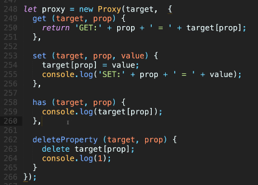

https://www.bilibili.com/video/BV1Dk4y127Ha  19min处开始

# 1. Vue双向绑定的原理

**Vue的双向数据绑定是通过数据劫持结合发布者订阅者模式来实现的**

在new Vue的时候，在Observer中通过Object.defineProperty()达到数据劫持，代理所有数据的getter和setter属性，在每次触发setter的时候，都会通过Dep来通知Watcher（派发更新），Watcher作为Observer数据监听器与Compile模板解析器之间的桥梁，当Observer监听到数据发生改变的时候，通过Updater来通知Compile更新视图。

而Compile通过Watcher订阅对应数据，绑定更新函数，通过Dep来添加订阅者，达到双向绑定

# 2. Vue双向绑定为什么要用Proxy改写

Vue双向绑定为什么要用Proxy改写，而不用原来的Object.defineProperty?

在 Vue 中，双向绑定是指当数据发生变化时，视图自动更新，并且视图的变化（如表单输入）也能够同步到数据模型。Vue 的双向绑定技术核心是 **数据劫持**，它通过在数据属性上设置 `getter` 和 `setter` 来实现。当数据发生变化时，触发 `setter`，并通知视图更新。Vue 2.x 使用的是 `Object.defineProperty` 来实现这一机制，而 Vue 3.x 则采用了新的技术 `Proxy` 来代替 `Object.defineProperty`。下面我将详细分析为什么 Vue 3.x 采用 `Proxy` 而不是继续使用 `Object.defineProperty`。

### 1. **`Object.defineProperty` 的局限性**

在 Vue 2.x 中，双向绑定和响应式系统是通过 `Object.defineProperty` 来实现的。虽然这种方式在 Vue 2.x 中运行得很好，但它有一些重要的局限性：

#### 1.1. **无法监听新增/删除的属性**

`Object.defineProperty` 只能劫持已经存在的对象属性，如果后续在对象上新增或删除属性，它无法自动检测到变化。这意味着，如果你动态地添加了新属性，Vue 2.x 不能正确地通知视图更新。

```javascript
const obj = { name: 'Vue' };

// 使用 defineProperty 监听 name
Object.defineProperty(obj, 'name', {
  get() { return this._name; },
  set(val) { this._name = val; }
});

// 下面这行代码无法触发视图更新
obj.newProp = 'new';  // Vue 2.x 无法检测到 newProp 的变化
```

#### 1.2. **性能问题（频繁操作时效率较低）**

`Object.defineProperty` 会遍历对象的每个属性并为其添加 `getter` 和 `setter`。当你有大量的数据对象时，频繁的 `getter` 和 `setter` 调用可能会导致性能问题，特别是当数据对象结构复杂时，每个属性都要单独设置 `getter` 和 `setter`，这会消耗额外的计算资源。

#### 1.3. **代理对象时缺乏深度支持**

`Object.defineProperty` 需要对每一层嵌套的属性都逐个劫持。如果对象有多层嵌套，Vue 需要递归地为每一层的属性设置 `getter` 和 `setter`。这就导致了在处理复杂对象时，Vue 需要多次嵌套递归 `Object.defineProperty`，这种方式相对繁琐且容易出错。

#### 1.4. **无法代理数组的变化**

虽然 `Object.defineProperty` 可以监听对象的属性变化，但对于数组的变化，它的能力非常有限。例如，使用 `push()`、`pop()`、`shift()` 等数组方法时，Vue 2.x 并不能完全监控所有数组的变化（这也是 Vue 2.x 在数组响应式实现中需要特别处理的一部分）。

### 2. **`Proxy` 的优势**

Vue 3.x 引入了 `Proxy` 来替代 `Object.defineProperty`，它解决了上述的许多问题，并带来了性能和功能上的提升。具体优势如下：

#### 2.1. **可以监听新增/删除的属性**

`Proxy` 是 ES6 引入的一项新特性，它可以代理整个对象，能够捕获对象的各种操作，如属性的读取、修改、删除、添加等。因此，使用 `Proxy` 时，任何新增或删除的属性都能被监控到，从而解决了 `Object.defineProperty` 无法检测新属性的添加和删除的问题。

```javascript
const handler = {
  get(target, key) {
    console.log(`Accessing ${key}`);
    return target[key];
  },
  set(target, key, value) {
    console.log(`Setting ${key} to ${value}`);
    target[key] = value;
    return true;
  }
};

const obj = new Proxy({}, handler);
obj.name = 'Vue'; // Console: Setting name to Vue
console.log(obj.name); // Console: Accessing name
```

#### 2.2. **性能提升**

与 `Object.defineProperty` 不同，`Proxy` 可以一次性代理整个对象，避免了为每个属性单独设置 `getter` 和 `setter` 的性能开销。`Proxy` 通过拦截器来处理对象的所有操作，可以更加高效地处理数据变化。

#### 2.3. **深度代理支持**

`Proxy` 可以支持代理嵌套的对象和数组。当访问某一层级的嵌套对象时，`Proxy` 可以自动捕获到这些访问，而不需要手动递归处理。这样，Vue 3 通过 `Proxy` 实现了自动深度代理，简化了代码并提高了性能。

```javascript
const handler = {
  get(target, key) {
    if (typeof target[key] === 'object' && target[key] !== null) {
      return new Proxy(target[key], handler); // 递归代理
    }
    return target[key];
  }
};

const obj = new Proxy({ user: { name: 'Vue' } }, handler);
console.log(obj.user.name); // Console: Accessing name
```

#### 2.4. **简化的数组代理**

`Proxy` 能够拦截数组的方法（如 `push()`、`pop()`、`shift()` 等），从而能够正确地响应数组变化，而不需要手动重写这些方法。它提供了更简洁且高效的方式来处理数组变化。

```javascript
const arr = new Proxy([], {
  get(target, key) {
    console.log(`Accessing index ${key}`);
    return target[key];
  },
  set(target, key, value) {
    console.log(`Setting index ${key} to ${value}`);
    target[key] = value;
    return true;
  }
});

arr.push(1); // Console: Setting index 0 to 1
console.log(arr[0]); // Console: Accessing index 0
```

#### 2.5. **更加灵活的拦截**

`Proxy` 不仅可以拦截 `get` 和 `set` 操作，还能拦截其他操作，如 `deleteProperty`（删除属性）、`has`（检查属性是否存在）等。这样 Vue 3 可以提供更加丰富和细粒度的响应式功能，甚至可以自定义一些操作，如监听对象属性的删除。

### 3. **Vue 3.x 的响应式实现**

在 Vue 3.x 中，响应式系统使用 `Proxy` 来代理整个对象，这样可以更加高效、灵活地处理数据变化和视图更新。具体实现步骤如下：

- 当创建响应式对象时，Vue 会使用 `Proxy` 包装对象。
- `Proxy` 的 `get` 和 `set` 捕获器会自动执行 Vue 的依赖收集和视图更新操作。
- 如果对象的属性发生变化，`set` 捕获器会触发通知更新视图。
- 如果对象的属性被删除或新增，`Proxy` 会捕获到这些变化，并且 Vue 会正确地通知视图更新。

### 4. **总结**

Vue 3.x 采用 `Proxy` 来代替 Vue 2.x 中的 `Object.defineProperty`，主要是因为 `Proxy` 提供了以下优势：

- **支持监听新增/删除属性**： `Proxy` 可以动态监听对象的所有属性操作，包括新增、删除等。
- **更高效的性能**： `Proxy` 可以一次性代理整个对象，避免了 `Object.defineProperty` 为每个属性单独设置 `getter` 和 `setter` 的性能开销。
- **简化的深度代理**： `Proxy` 可以自动代理对象的嵌套属性，无需手动递归。
- **更完善的数组支持**： `Proxy` 更加灵活，能够正确代理数组的变动操作。

因此，Vue 3.x 的响应式系统通过使用 `Proxy`，在性能和功能上都得到了显著的提升。

# [3. Object.defineProperty](https://www.bilibili.com/video/BV1Dk4y127Ha/?vd_source=a7089a0e007e4167b4a61ef53acc6f7e)

看到1h08min处


属性值不可修改——writable（默认为false）；

属性不可枚举——enumerable（默认为false）；

属性不可删除——configurable（默认为false）；


**value 和 writable 出现了任意一个，get和set就不能用**


**defineProperty本身是不具备对数组进行操作的能力的**

那能不能有一个办法能够真正的利用这个东西去设置我的数组呢？可以


vue最牛逼的地方并不是双向绑定，最难的地方是节点和虚拟dom。

虚拟dom的算法导致你在defineProperty里的get 方法和set方法里面的逻辑很长


后面的计算器例子要再看一遍

底下的逻辑没有操作过dom

同一个事件处理函数绑定给两个元素合理吗？

# [4. Proxy](https://www.bilibili.com/video/BV1Dk4y127Ha/?spm_id_from=333.1391.0.0&p=2&vd_source=a7089a0e007e4167b4a61ef53acc6f7e)

4min30s处开始

一个是代理，一个是定义属性。如果不是vue，这俩东西一辈子都没有交集。


defineProperty：劫持数据-->给对象进行扩展-->属性进行设置

Proxy：可以实现同样的功能，但是它不是直接用劫持的方法。proxy是返回一个代理的对象。  


Proxy：ES6的构造函数

因为proxy是target的代理，proxy改了，target肯定会跟着改了。

这个东西是给对象用的，它能用在数组里面吗？**能**

它能处理函数吗？能


对象操作的14种方法：

- 获取原型[[GetPrototypeOf]]

 ```js
 var obj = {a: 1, b: 2}
 var proto = Object.getPrototypeOf(obj);
 console.log(proto);
 console.log(obj.__proto__);
 console.log(Object.prototype);
 ```

- 设置原型[[SetPrototypeOf]]

```js
var obj = {a: 1, b: 2}
Object.setPrototypeOf(obj, {c:3,d:4})
console.log(obj)
```

- 获取对象的可扩展性[[IsExtensible]]（追加，删除，修改，枚举等）


```js
var obj = {a: 1, b: 2}
var extensible = Object.isExtensible(obj);
console.log(extensible); // true
Object.freeze(obj); // 冻结对象——不可修改对象；不可删除对象属性；不可更改属性值；可枚举 
var extensible2 = Object.isExtensible(obj);
console.log(extensible2); // false
Object.seal(obj) // 封闭对象——不可修改对象；不可删除对象属性；可更改属性值；可枚举  
obj.c = 3;
console.log(obj) // {a:1,b:2}
```

- 获取自有属性[[GetOwnProperty]]


```js
var obj = {a: 1, b: 2}
Object.setPrototypeOf(obj, {c:3,d:4});
console.log(Object.getOwnPropertyNames(obj)) // ["a", "b"]
```

- 禁止扩展对象[[PreventExtensions]]

```js
var obj = {a: 1, b: 2}
Object.preventExtensions(obj);
obj.c = 3; // 禁止增加属性
console.log(obj) // {a:1,b:2}
delete obj.a; // 可删除属性
console.log(obj) // {b:2}
```

- 拦截对象操作[[DefineOwnProperty]]


```js
Obj.defineProperty()
```

- 判断是否是自身属性[[HasProperty]]（深拷贝的时候要用到这个东西）


```js
var obj = {a: 1, b: 2}
console.log(obj.hasOwnProperty('a')) // true
```

- [[GET]] 不是你所理解的获取值，而是判断某个属性是不是在对象里面

```js
var obj = {a: 1, b: 2}
console.log('a' in obj) // true
console.log(obj.a)
```

- [[SET]]

```js
var obj = {a: 1, b: 2}
obj.a=3
obj['b']=4
```

- [[Delete]]

```js
var obj = {a: 1, b: 2}
delete obj.a;
```

- 枚举[[Enumerate]]

```js
var obj = {a: 1, b: 2}
for(var k in obj){
    console.log(obj[k])
}
```

- 获取键集合[[OwnPropertyKeys]]

```js
var obj = {a: 1, b: 2}
console.log(Object.keys(obj))
```

在ES6的标准中，任何的语法和对象相关的内建函数方法都是基于这上面13种内部方法构建出来的


重写Proxy：用defineProperty + 深拷贝

```javascript
function MyProxy (target, handler) {
  // 深拷贝
  function deepClone (org, tar) {
    var tar = tar || {},
        toStr = Object.prototype.toString,
        arrType = '[object Array]';
    for (var key in org) {
      if (org.hasOwnProperty(key)) {
        if (typeof(org[key]) === 'object' && org[key] !== null) {
          tar[key] = toStr.call(org[key]) == arrType ? [] : {};
          deepClone(org[key], tar[key])
        } else {
          tar[key] = org[key];
        }
      }
    }
    return tar;
  }
     
  let _target = deepClone(target);
  Object.keys(_target).forEach(key => {
    Object.defineProperty(_target, key, {
      get () {
        return handler.get && handler.get(target, key);
      },
      set (newVal) {
        handler.set && handler.set(target, key, newVal);
      }
    })
  })
  return _target;
}
```





* defineProperty原则上是**给对象增加属性用**的。它在**修改数组的长度**，**用索引去设置元素的值**，**数组的push，pop**等这些方法是无法触发defineProperty的set方法的
* vue2.0 中所以跟数组相关的方法都是重写的
* vue3.0 中没有这个问题，对数组的下标操作完全可以触发set

 

Reflect：反射       方法集合的容器       是es6直接定义的一个内置对象

ES6把对象的十四种方法都放到了Reflect上面


为什么要放到Reflect上面？

- 因为我们很多对象的方法都是直接放在Object上面的，但是实际上很多方法并不是直接操作Object的。有可能操作函数，有可能操作数组。这种情况下 方法 放在Object下面就不合理
