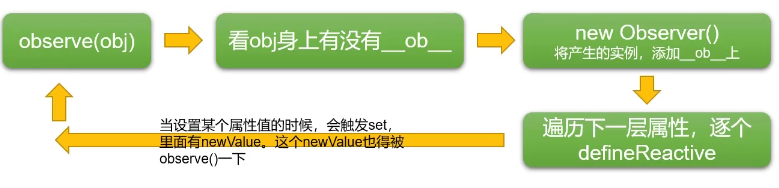

# 1. 课程介绍

# 2. Object.defineProperty

# 3. defineReactive函数

```js
function defineReactive(data, key, val) {
    if (arguments.length == 2) {
        val = obj[key];
    }
    Object.defineProperty(data, key, {
        enumerable: true,
        configurable: true,
        get(){
            console.log('你试图访问obj的'+key+'属性')
            return val;
        },
        set(newValue){
            console.log('你试图改变obj的'+key+'属性', newValue);
            if (val === newValue) {
                return;
            }
            val = newVal;
        }
    })
}
```

这段代码是如何体现闭包的使用的？

# [4. 递归侦测对象全部属性 上](https://www.bilibili.com/video/BV1G54y1s7xV/?spm_id_from=333.1391.0.0&p=4&vd_source=a7089a0e007e4167b4a61ef53acc6f7e)

```js
var obj = {
    a: {
        m: {
            n: 5
        }
    }
}

defineReactive(obj, 'a')
defineReactive(obj, 'b')
console.log(obj.a.m.n)
```

**Observer类**：将一个正常的object转换为每个层级的属性都是响应式的object

```js
// 入口函数
function observe(data) {
  if (typeof data !== 'object') return
  // 调用Observer
  new Observer(data)
}

function observe2(data) {
    if (typeof data !== 'object') return
    var ob;
    if (typeof data.__ob__ !== 'undefined') {
        ob = value.__ob__;
    } else {
        ob = new Observer(data);
    }
    return ob;
}

class Observer {
  constructor(value) {
    this.value = value
    this.walk()
  }
  walk() {
    // 遍历该对象，并进行数据劫持
    Object.keys(this.value).forEach((key) => defineReactive(this.value, key))
  }
}

function defineReactive(data, key, value = data[key]) {
  // 如果value是对象，递归调用observe来监测该对象
  // 如果value不是对象，observe函数会直接返回
  observe(value)
  Object.defineProperty(data, key, {
    get: function reactiveGetter() {
      return value
    },
    set: function reactiveSetter(newValue) {
      if (newValue === value) return
      value = newValue
      observe(newValue) // 设置的新值也要被监听
    }
  })
}

const obj = {
  a: 1,
  b: {
    c: 2
  }
}

observe(obj);
```




# 5. 递归侦测对象全部属性 下

```js
// 入口函数
function observe(data) {
    if (typeof data !== 'object') return
    var ob;
    if (typeof data.__ob__ !== 'undefined') {
        ob = value.__ob__;
    } else {
        ob = new Observer(data);
    }
    return ob;
}

function def(obj, key, value, enumerable){
    Object.defineProperty(obj, key, {
        value,
        enumerable,
        writable: true,
        configurable: true
    })
}

// Observer类：将一个正常的object转换为每个层级的属性都是响应式的object
class Observer {
  constructor(data) {
      // 给value身上添加__ob__属性
      def(data, '__ob__', this, false);
      console.log('我是Observer构造器：', value);
      this.walk(data);
  }
  walk(data) {
    // 遍历该对象，并进行数据劫持
    for(let key in data){
        defineReactive(data, key);
    }
  }
}

function defineReactive(data, key, val) {
    if (arguments.length == 2) {
        val = obj[key];
    }
    observe(val); // 子元素进行observe，至此形成了递归
    // 这个递归不是函数自己调用自己
    // 而是多个函数，类循环调用
    Object.defineProperty(data, key, {
        enumerable: true,
        configurable: true,
        get(){
            console.log('你试图访问obj的'+key+'属性')
            return val;
        },
        set(newValue){
            console.log('你试图改变obj的'+key+'属性', newValue);
            if (val === newValue) {
                return;
            }
            val = newVal;
            observe(newValue); // 当设置了新值，这个新值也要被observe
        }
    })
}

var obj = {
    a: {
        m: {
            n: 5
        }
    },
    b: 10,
    c: {
        d: {
            e: {
                f: 6666
            }
        }
    },
    g: [22,33,44,55]
}

observe(obj);
obj.b++;
obj.a.m = 10;
console.log(obj.c.d.e.f);
obj.g.push(66);
```


# [6. 数组的响应式处理 上](https://www.bilibili.com/video/BV1G54y1s7xV?spm_id_from=333.788.player.switch&vd_source=a7089a0e007e4167b4a61ef53acc6f7e&p=6)

`push`,`pop`,`shift`,`unshift`,`splice`,`sort`,`reverse`这七种方法被改写了

```js
// 入口函数
function observe(data) {
    if (typeof data !== 'object') return
    var ob;
    if (typeof data.__ob__ !== 'undefined') {
        ob = value.__ob__;
    } else {
        ob = new Observer(data);
    }
    return ob;
}

function def(obj, key, value, enumerable){
    Object.defineProperty(obj, key, {
        value,
        enumerable,
        writable: true,
        configurable: true
    })
}

// Observer类：将一个正常的object转换为每个层级的属性都是响应式的object
class Observer {
    constructor(data) {
        // 给value身上添加__ob__属性
        def(data, '__ob__', this, false);
        console.log('我是Observer构造器：', value);
        if(Array.isArray(data)) {
            // 修改数组的原型
            Object.setPrototypeOf(data, arrayMethods)
            // 让数组变得observe
            this.observeArray(data);
        } else {
            this.walk(data);
        }
    }
    // 遍历该对象，并进行数据劫持  
    walk(data) {
        for(let key in data){
            defineReactive(data, key);
        }
    }
    // 数组的特殊遍历
    observeArray(array) {
        for(let i = 0, l = array.length; i < l; i++) {
            // 逐项进行observe
            observe(arr[i])
        }
    }
}

function defineReactive(data, key, val) {
    if (arguments.length == 2) {
        val = obj[key];
    }
    observe(val); // 子元素进行observe，至此形成了递归
    // 这个递归不是函数自己调用自己
    // 而是多个函数，类循环调用
    Object.defineProperty(data, key, {
        enumerable: true,
        configurable: true,
        get(){
            console.log('你试图访问obj的'+key+'属性')
            return val;
        },
        set(newValue){
            console.log('你试图改变obj的'+key+'属性', newValue);
            if (val === newValue) {
                return;
            }
            val = newVal;
            observe(newValue); // 当设置了新值，这个新值也要被observe
        }
    })
}

const arrayPrototype = Array.prototype;
const arrayMethods = Object.create(arrayPrototype);
const methodsNeedchange = ['push', 'pop', 'shift', 'unshift', 'splice', 'sort', 'reverse'];

methodsNeedChange.forEach(methodName => {
    // 备份原来的方法
    const original = arrayPrototype[methodName];
    // 定义新的方法
    def(arrayMethods, methodName, function () {
        // this是数组
        const result = original.apply(this, arguments);
        const args = [...arguments] // 把类数组对象变为数组
        // 有三种方法push、unshift、splice能够插入新项
        // 要把插入的新项也变成observe的
        let inserted = [];
        const ob = this.__ob__;
        switch(methodName){
            case: 'push':
            case: 'unshift':
                inserted = arguments;
                break;
            case: 'splice':
                inserted = args.slice(2);
        }
        if(inserted.length){
            ob.observeArray(inserted)
        }
        console.log('啦啦啦');
        return result;
    }, false)
})

var obj = {
    a: {
        m: {
            n: 5
        }
    },
    b: 10,
    c: {
        d: {
            e: {
                f: 6666
            }
        }
    },
    g: [22,33,44,55]
}

observe(obj);
obj.b++;
obj.a.m = 10;
console.log(obj.c.d.e.f);
obj.g.push(66);
obj.g.splice(2,1,88,99);
```

# 6. Object.setPrototypeOf()

`Object.setPrototypeOf()` 是一个用于设置对象原型的 JavaScript 方法。它允许你动态地修改某个对象的原型对象。这个方法是 ES6 引入的，可以用来改变一个对象的内部 [[Prototype]] 属性。

### 语法：

```javascript
Object.setPrototypeOf(obj, prototype);
```

- `obj`：要设置原型的对象。
- `prototype`：要赋给对象 `obj` 的原型对象。通常是一个对象，或者 `null`（如果你希望对象没有原型链）。

### 返回值：

返回修改后的 `obj` 对象。

### 示例：

1. **基本示例**：

```javascript
const animal = {
  speak() {
    console.log('Animal makes a sound');
  }
};

const dog = {
  speak() {
    console.log('Dog barks');
  }
};

Object.setPrototypeOf(dog, animal); // 将dog的原型设置为animal

dog.speak(); // 输出: "Dog barks"
```

在上面的例子中，`dog` 对象的 `speak` 方法被定义了，所以调用 `dog.speak()` 会输出 `"Dog barks"`。即使我们改变了 `dog` 的原型，`dog` 自身的方法优先执行。

1. **修改原型的影响**：

```javascript
const person = {
  greet() {
    console.log('Hello!');
  }
};

const student = {};

Object.setPrototypeOf(student, person); // student的原型是person

student.greet(); // 输出: "Hello!"
```

在这个例子中，`student` 对象本身没有 `greet` 方法，但是通过 `Object.setPrototypeOf()` 将 `student` 的原型设置为 `person`，因此 `student` 可以访问到 `person` 上的 `greet` 方法。

1. **设置为 `null`**：

```javascript
const obj = {
  foo() {
    console.log('foo');
  }
};

Object.setPrototypeOf(obj, null); // 设置 obj 的原型为 null

obj.foo(); // TypeError: obj.foo is not a function
```

这里将 `obj` 的原型设置为 `null`，意味着 `obj` 不再有原型链，访问 `obj.foo()` 会导致错误，因为 `foo` 方法不再存在于 `obj` 或它的原型中。

### 注意事项：

- 修改对象的原型可能会影响性能。频繁改变原型链可能导致 JavaScript 引擎无法优化代码，因为原型链的变化增加了查找属性的复杂性。
- `Object.setPrototypeOf()` 会覆盖对象原型的设置，和 `Object.create()` 等方法相反，它不会创建一个新的对象，而是直接修改现有对象的原型。

通常，`Object.setPrototypeOf()` 适用于需要动态改变对象原型的场景，但是建议在实际开发中谨慎使用，因为它可能影响代码的可维护性和性能。

# 6. Object.create()

`Object.create()` 用来创建一个新的对象，并指定该对象的原型（`prototype`）。该方法非常适合用来实现对象继承或**创建带有特定原型的对象**。

### 语法：

```javascript
Object.create(proto, [propertiesObject]);
```

- `proto`：新对象的原型对象（可以是任何对象或 `null`）。如果你传递 `null`，那么新对象就没有原型链，无法访问任何继承的属性或方法。
- `propertiesObject`（可选）：一个可选的属性对象，定义了新对象的可枚举属性。如果没有提供这个参数，新对象只会有 `proto` 中定义的属性。

### 返回值：

返回一个新的对象，具有指定原型和可选的属性。

### 示例：

1. **基本用法**：

```javascript
const animal = {
  eats: true,
  speak() {
    console.log('Animal speaks');
  }
};

const dog = Object.create(animal); // 创建一个新对象，原型是animal
dog.bark = function() {
  console.log('Dog barks');
};

console.log(dog.eats);  // true (从animal继承)
dog.speak();            // "Animal speaks" (继承自animal)
dog.bark();             // "Dog barks" (dog自己的方法)
```

在这个例子中，`dog` 是通过 `Object.create(animal)` 创建的，它继承了 `animal` 对象的属性和方法。然后我们为 `dog` 添加了一个 `bark` 方法，`dog` 不仅可以访问自己定义的方法，还能继承自 `animal` 的方法和属性。

1. **设置原型为 `null`**：

```javascript
const obj = Object.create(null);
console.log(obj); // 输出: {}
```

通过将原型设置为 `null`，新创建的对象没有原型链。这意味着它没有任何继承自 `Object` 的属性（如 `toString` 和 `hasOwnProperty`）。这种方式常用于创建不含任何附加方法和属性的纯对象。

1. **添加属性**：

```javascript
const person = {
  greet() {
    console.log('Hello!');
  }
};

const student = Object.create(person, {
  name: {
    value: 'John',
    writable: true,
    enumerable: true,
    configurable: true
  }
});

console.log(student.name); // "John"
student.greet();           // "Hello!"
```

在这个例子中，`student` 继承了 `person` 的 `greet` 方法，并通过第二个参数 `propertiesObject` 定义了 `name` 属性。属性 `name` 具有 `value`（"John"）并且是可写、可枚举、可配置的。

1. **模拟继承**：

```javascript
function Animal(name) {
  this.name = name;
}
Animal.prototype.speak = function() {
  console.log(`${this.name} makes a noise`);
};

function Dog(name) {
  Animal.call(this, name);  // 调用 Animal 构造函数
}

Dog.prototype = Object.create(Animal.prototype); // 设置 Dog 的原型为 Animal 的原型
Dog.prototype.constructor = Dog;  // 修正构造函数指向

const dog = new Dog('Rex');
dog.speak();  // "Rex makes a noise"
```

在这个例子中，`Dog` 通过 `Object.create(Animal.prototype)` 设置原型链，从而实现了继承自 `Animal` 的功能。这是 JavaScript 中传统的继承模式之一。

### 使用 `Object.create()` 的优势：

1. **继承**：通过 `Object.create()` 可以方便地创建一个对象并继承另一个对象的原型链。与 `class` 或 `Object.setPrototypeOf()` 不同，`Object.create()` 允许我们更灵活地控制原型链。
2. **更细粒度的控制**：通过 `propertiesObject` 参数，我们可以指定新对象的属性描述符，例如是否可写、是否可枚举等，提供了对对象属性的精细控制。
3. **简化代码**：对于简单的继承或原型链设置，`Object.create()` 是一种非常简洁、优雅的方式。

### 注意事项：

- 使用 `Object.create()` 创建的对象会继承其原型对象的属性和方法，但这些方法和属性的查找遵循原型链规则。如果原型链过长，查找属性可能会变得不太高效。
- `Object.create()` 创建的对象不会直接继承构造函数的 `this`（需要手动调用构造函数，如 `Animal.call(this, name)`）。
- 如果不传递第二个参数 `propertiesObject`，新对象将没有自己的属性，仅仅继承原型对象的属性。

总结来说，`Object.create()` 是一种用于创建具有指定原型的新对象的强大工具，特别适合用于实现继承和控制对象的原型链。

# 7. 数据的响应式处理 下

# 8. 依赖收集前置知识

在 Vue 中，**依赖收集**是指在 Vue 的响应式系统中，组件和数据之间的关系被自动跟踪和管理的过程。这个过程确保当数据发生变化时，相关的组件能够自动更新，从而达到响应式界面的效果。依赖收集的核心机制是 Vue 的 **响应式系统**，通过 **数据代理**、**getter** 和 **setter** 方法来实现。

### 1. **什么是依赖？**

在 Vue 中，“依赖”是指一个组件或函数对某个数据的访问关系。具体来说，依赖是指那些在组件的模板、计算属性或方法中直接引用了某个响应式数据的地方。

- **模板中的依赖**：组件的模板中直接使用的数据，Vue 会自动追踪这些数据与组件的关系，确保在数据变化时，模板中的视图会被更新。
- **计算属性中的依赖**：计算属性依赖的数据也会被 Vue 追踪，以便在这些数据变化时，自动重新计算计算属性的值。
- **侦听器（watchers）中的依赖**：通过侦听器监控某个响应式数据的变化，Vue 会追踪这个数据作为依赖，数据变化时会触发回调。

### 2. **依赖收集的流程**

#### 2.1. **数据代理（getter）**

Vue 使用 **getter** 来拦截对响应式数据的访问，并通过 getter 方法来收集依赖。

- 当 Vue 组件中的数据（比如模板中的某个数据）被访问时，Vue 会触发 **getter**，**在 getter 中，Vue 会记录当前组件或计算属性为该数据的“依赖”**。
- **每个组件或者计算属性对应一个“观察者**”（**Watcher**）。**当组件访问某个数据时，Watcher 就会将自己注册为该数据的依赖。**

#### 2.2. **依赖收集**

当 Vue 收集依赖时，它会将依赖的组件或计算属性与相应的数据关联起来。具体来说，Vue 会为每个响应式属性创建一个 **dep** 对象（依赖收集器）。每当该属性被访问时，它会通知相关的 **Watcher**（观察者）来收集依赖。

#### 2.3. **数据变化（setter）**

当响应式数据发生变化时，Vue 会触发 **setter**，并通过 `dep.notify()` 通知所有依赖该数据的观察者（即被收集的依赖）来执行更新操作。

#### 2.4. **更新视图**

一旦依赖（如组件或计算属性）被通知到数据已经变化，Vue 会触发视图的重新渲染，更新组件中引用该数据的部分。

### 3. **依赖收集的实现**

在 Vue 2.x 中，Vue 的响应式系统通过 `Object.defineProperty` 来实现数据代理，并且通过 `getter` 和 `setter` 来收集依赖。每当数据的值被访问或修改时，Vue 会在内部执行一系列操作来收集依赖和触发更新。

### 4. **举例说明**

#### 4.1. **模板中的依赖收集**

```html
<template>
  <div>
    <p>{{ message }}</p>
  </div>
</template>

<script>
export default {
  data() {
    return {
      message: 'Hello, Vue!'
    };
  }
}
</script>
```

在这个例子中，模板中的 `{{ message }}` 会触发对 `message` 数据的访问。当 Vue 渲染这个组件时，它会通过 **getter** 获取 `message` 的值，并将当前组件的 **Watcher** 作为依赖收集到 `message` 上。这意味着如果 `message` 数据发生变化，Vue 会自动通知该组件更新视图。

#### 4.2. **计算属性中的依赖收集**

```javascript
export default {
  data() {
    return {
      a: 1,
      b: 2
    };
  },
  computed: {
    sum() {
      return this.a + this.b;
    }
  }
}
```

在这个例子中，`sum` 计算属性依赖 `a` 和 `b`。当 `sum` 被访问时，Vue 会通过 `getter` 追踪到 `a` 和 `b`，并将它们作为 `sum` 的依赖收集。只要 `a` 或 `b` 发生变化，`sum` 就会重新计算。

#### 4.3. **侦听器中的依赖收集**

```javascript
export default {
  data() {
    return {
      message: 'Hello!'
    };
  },
  watch: {
    message(newValue, oldValue) {
      console.log('Message changed from', oldValue, 'to', newValue);
    }
  }
}
```

在这个例子中，`watch` 侦听器监视 `message` 数据的变化。Vue 会通过依赖收集机制，确保在 `message` 发生变化时，触发 `watcher` 中的回调函数。

### 5. **总结**

- **依赖收集** 是 Vue 响应式系统中的核心概念，指的是 Vue 自动追踪组件或计算属性对数据的访问，确保数据变化时，相关的组件能够自动更新。
- **依赖** 是指模板、计算属性、侦听器等对某个响应式数据的引用关系。
- Vue 使用 `getter` 和 `setter` 来进行依赖收集，通过 **Watcher** 将依赖的数据和组件关联起来，从而实现高效的视图更新。

依赖收集机制的核心目标是让开发者能专注于数据和组件的结构，而无需手动管理数据变化后的更新。

# [8. 收集依赖](https://www.bilibili.com/video/BV1G54y1s7xV?spm_id_from=333.788.player.switch&vd_source=a7089a0e007e4167b4a61ef53acc6f7e&p=8)

把依赖收集的代码封装成一个Dep类，它专门用来管理依赖，**每个Observer的实例成员中都有一个Dep的实例**

Watcher是一个中介，数据发生变化时通过Watcher中转，通知组件


- 当 Vue 组件中的数据（比如模板中的某个数据）被访问时，Vue 会触发 **getter**，**在 getter 中，Vue 会记录当前组件或计算属性为该数据的“依赖”**。
- **每个组件或者计算属性对应一个“观察者**”（**Watcher**）。**当组件访问某个数据时，Watcher 就会将自己注册为该数据的依赖。**
- 当响应式数据发生变化时，Vue 会触发 **setter**，并通过 `dep.notify()` 通知所有依赖该数据的观察者（即被收集的依赖）来执行更新操作。

```js
class Dep {
    constructor(){
        // subs里面放的是watcher实例对象
        // subs->subscribes
        this.subs = [];
    }
    // 添加订阅（添加watcher实例对象）
    addSub(sub){
        this.subs.push(sub)
    }
    depend(){
        // Dep.target就是一个我们自己指定的全局的位置
        // 用window.target也行，只要是全局唯一，没有歧义就行
        if (Dep.target){
            this.addSub(Dep.target)
        }
    }
    // 通知更新（通知watcher去更新）
    notify(){
        console.log('notify');
        // 浅克隆一份
        const subs = this.subs.slice();
        for(let i = 0, l = subs.length; i < l; i++){
            subs[i].update();
        }
    }
}

class Watcher{
    // expression: 'a.b.c.d' 
    constructor(target, expression, callback){
        this.target = target;
        this.getter = parsePath(expression);
        this.callback = callback;
        this.value = this.get();
    }
    update(){
       this.run(); 
    }
    get(){
        Dep.target = this;
        const obj = this.target;
        let value;
        try{
            value = this.getter(obj)
        } finally {
            Dep.target = null;
        }
        return value
    }
    run(){
        this.getAndInvoke(this.callback)
    }
    getAndInvoke(cb){
        const value = this.get();
        if (value !== this.value || typeof value == 'object') {
            const oldValue = this.value;
            this.value = value;
            cb.call(this.target, value, oldValue)
        }
    }
}

function parsePath (str) {
    var segments = str.split('.');
    return (obj) => {
        for(let i = 0; i < segments.length; i++){
            obj = obj[segments[i]]
        }
        return obj;
    }
}

// 入口函数
function observe(data) {
    if (typeof data !== 'object') return
    var ob;
    if (typeof data.__ob__ !== 'undefined') {
        ob = value.__ob__;
    } else {
        ob = new Observer(data);
    }
    return ob;
}

function def(obj, key, value, enumerable){
    Object.defineProperty(obj, key, {
        value,
        enumerable,
        writable: true,
        configurable: true
    })
}

// Observer类：将一个正常的object转换为每个层级的属性都是响应式的object
class Observer {
    constructor(data) {
        // 每个Observer实例中都有一个Dep实例对象
        this.dep = new Dep();
        // 给value身上添加__ob__属性
        def(data, '__ob__', this, false);
        console.log('我是Observer构造器：', value);
        if(Array.isArray(data)) {
            // 修改数组的原型
            Object.setPrototypeOf(data, arrayMethods)
            // 让数组变得observe
            this.observeArray(data);
        } else {
            this.walk(data);
        }
    }
    // 遍历该对象，并进行数据劫持  
    walk(data) {
        for(let key in data){
            defineReactive(data, key);
        }
    }
    // 数组的特殊遍历
    observeArray(array) {
        for(let i = 0, l = array.length; i < l; i++) {
            // 逐项进行observe
            observe(arr[i])
        }
    }
}

function defineReactive(data, key, val) {
    const dep = new Dep();
    if (arguments.length == 2) {
        val = obj[key];
    }
    let childOb = observe(val); // 子元素进行observe，至此形成了递归
    // 这个递归不是函数自己调用自己
    // 而是多个函数，类循环调用
    Object.defineProperty(data, key, {
        enumerable: true,
        configurable: true,
        get(){
            console.log('你试图访问obj的'+key+'属性');
            if (Dep.target) {
                dep.depend();
                if (childOb) {
                    childOb.dep.depend()
                }
            }
            return val;
        },
        set(newValue){
            console.log('你试图改变obj的'+key+'属性', newValue);
            if (val === newValue) {
                return;
            }
            val = newVal;
            observe(newValue); // 当设置了新值，这个新值也要被observe
            dep.notify(); // 发布订阅模式，通知dep去更新
        }
    })
}

const arrayPrototype = Array.prototype;
const arrayMethods = Object.create(arrayPrototype);
const methodsNeedchange = ['push', 'pop', 'shift', 'unshift', 'splice', 'sort', 'reverse'];

methodsNeedChange.forEach(methodName => {
    // 备份原来的方法
    const original = arrayPrototype[methodName];
    // 定义新的方法
    def(arrayMethods, methodName, function () {
        // this是数组
        const result = original.apply(this, arguments);
        const args = [...arguments] // 把类数组对象变为数组
        // 有三种方法push、unshift、splice能够插入新项
        // 要把插入的新项也变成observe的
        let inserted = [];
        const ob = this.__ob__;
        switch(methodName){
            case: 'push':
            case: 'unshift':
                inserted = arguments;
                break;
            case: 'splice':
                inserted = args.slice(2);
        }
        if(inserted.length){
            ob.observeArray(inserted)
        }
        console.log('啦啦啦');
        ob.dep.notify();
        return result;
    }, false)
})

var obj = {
    a: {
        m: {
            n: 5
        }
    },
    b: 10,
    c: {
        d: {
            e: {
                f: 6666
            }
        }
    },
    g: [22,33,44,55]
}

observe(obj);
new Watcher(obj, 'a.m.n', (val)=>{
    console.log('hhhhhhh', val)
})
obj.b++;
obj.a.m.n = 10;
console.log(obj.c.d.e.f);
obj.g.push(66);
obj.g.splice(2,1,88,99);
```

# 8. vm.$watch

`vm.$watch` 是 Vue 实例上的一个方法，用于观察 Vue 实例中数据的变化，并在数据变化时执行回调函数。与计算属性不同，`$watch` 是响应式数据变化的低级 API，提供了一种灵活的方式来观察和处理数据变化。

### 语法：

```javascript
vm.$watch(expOrFn, callback, [options])
```

- **expOrFn**: 要观察的表达式或函数。
  - 如果是字符串，表示要观察的数据属性（例如，`'message'`）。
  - 如果是函数，则该函数的返回值将作为需要观察的表达式，且该函数会在每次变化时执行。
- **callback**: 数据变化时要执行的回调函数。回调函数接收两个参数：
  - `newValue`: 数据变化后的新值。
  - `oldValue`: 数据变化前的旧值。
- **options**: （可选）一个对象，用于配置监听器的选项，包含以下属性：
  - **deep**: 是否深度观察（即是否观察对象内部的变化）。默认是 `false`，只有直接修改对象属性时才会触发回调。
  - **immediate**: 是否在绑定后立即执行回调。默认是 `false`，即只有当数据变化时才会触发回调。
  - **sync**: 是否使用同步执行回调（对于 `immediate` 为 `true` 时有用）。默认是 `false`，如果为 `true`，回调会同步执行。

### 返回值：

返回一个 **stop** 函数，可以调用它来停止观察。

### 详细分析

#### 1. **观察单一数据属性**

```javascript
const vm = new Vue({
  data() {
    return {
      message: 'Hello, Vue!'
    };
  }
});

vm.$watch('message', function(newVal, oldVal) {
  console.log(`message changed: ${oldVal} -> ${newVal}`);
});

vm.message = 'Hello, World!'; // 输出: message changed: Hello, Vue! -> Hello, World!
```

在上面的例子中，`vm.$watch('message', callback)` 监听 `message` 数据的变化。当 `message` 被修改时，回调函数会被触发，输出数据变化的前后值。

#### 2. **观察计算属性或函数**

你还可以观察计算属性或函数的返回值，而不仅仅是普通的数据属性。

```javascript
const vm = new Vue({
  data() {
    return {
      a: 1,
      b: 2
    };
  },
  computed: {
    sum() {
      return this.a + this.b;
    }
  }
});

vm.$watch(() => vm.sum, function(newVal, oldVal) {
  console.log(`sum changed: ${oldVal} -> ${newVal}`);
});

vm.a = 3; // 输出: sum changed: 3 -> 5
vm.b = 4; // 输出: sum changed: 5 -> 7
```

在这个例子中，我们观察了计算属性 `sum`，而不是直接观察 `a` 和 `b`。每当 `sum` 变化时，回调会被触发。

#### 3. **深度监听对象的属性变化**

如果你需要监听一个对象内部属性的变化，可以通过 `deep: true` 选项来实现深度观察。

```javascript
const vm = new Vue({
  data() {
    return {
      user: {
        name: 'Alice',
        age: 30
      }
    };
  }
});

vm.$watch('user', function(newVal, oldVal) {
  console.log('user changed:', newVal);
}, {
  deep: true
});

vm.user.name = 'Bob'; // 输出: user changed: { name: 'Bob', age: 30 }
vm.user.age = 31; // 输出: user changed: { name: 'Bob', age: 31 }
```

这里，通过 `deep: true`，我们可以观察到 `user` 对象内部属性的变化，不仅仅是直接修改 `user` 的引用，还包括对象内属性的变化。

#### 4. **立即执行回调函数**

通过 `immediate: true` 选项，观察器会在绑定时立即执行回调，而不等到数据的第一次变化。

```javascript
const vm = new Vue({
  data() {
    return {
      message: 'Hello!'
    };
  }
});

vm.$watch('message', function(newVal, oldVal) {
  console.log(`message changed: ${oldVal} -> ${newVal}`);
}, {
  immediate: true
});

vm.message = 'Hello, World!'; // 输出: message changed: undefined -> Hello!
```

在这个例子中，因为 `immediate: true`，即使 `message` 还没有变化（初始化时），回调函数也会立即执行。

#### 5. **停止观察**

`$watch` 返回一个停止观察的函数。你可以在任何时候调用这个函数来停止对数据的观察。

```javascript
const vm = new Vue({
  data() {
    return {
      message: 'Hello!'
    };
  }
});

const stopWatching = vm.$watch('message', function(newVal, oldVal) {
  console.log(`message changed: ${oldVal} -> ${newVal}`);
});

vm.message = 'Hello, Vue!'; // 输出: message changed: Hello! -> Hello, Vue!
stopWatching();
vm.message = 'Hello, World!'; // 没有输出，监听已经停止
```

调用 `stopWatching()` 后，`message` 的变化将不再触发回调函数。

### 6. **`$watch` 与 Vue 的响应式系统**

`$watch` 实际上是基于 Vue 的响应式系统来实现的。Vue 的响应式系统会通过 `getter` 和 `setter` 机制来跟踪数据的变化，当数据发生变化时，回调函数会被调用。与计算属性不同，`$watch` 允许你对任何 Vue 实例的属性进行观察，而且可以选择性地观察函数的返回值或复杂对象。

### 7. **使用场景**

- **监听某个数据属性的变化**：在需要对数据变化做出响应时，`$watch` 是一种灵活的手段。
- **侦听计算属性**：如果你想知道某个计算属性的值是否发生变化，可以使用 `$watch` 来监听。
- **深度监听复杂对象**：如果你需要监听对象内的嵌套属性，可以使用 `deep` 选项进行深度监听。
- **立即执行回调**：使用 `immediate` 选项时，回调会立即执行，适用于初始化时需要处理数据的情况。

### 总结

- `vm.$watch` 是 Vue 提供的一个方法，用于监听数据变化并执行回调。
- 它支持监听计算属性、深度监听对象、立即执行回调等功能。
- 返回的停止观察函数可以在需要时停止监听。
- `$watch` 适用于在某些情况下需要更灵活的数据监听机制，如监听计算属性、动态数据等。

通过合理使用 `vm.$watch`，你可以更细粒度地控制组件中的响应式数据变化，做出相应的操作。

# [1. vue的MVVM响应式原理介绍](https://www.bilibili.com/video/BV1qJ411W7YR?spm_id_from=333.788.videopod.episodes&vd_source=a7089a0e007e4167b4a61ef53acc6f7e&p=5)


# [2. 入口函数和编译类Compile实现](https://www.bilibili.com/video/BV1qJ411W7YR?spm_id_from=333.788.player.switch&vd_source=a7089a0e007e4167b4a61ef53acc6f7e&p=2)

```js
let vm = new Vue({
    el:'#app',
    data: {
        person: {
            name: '张三'
        }
    }
})
// or
let vm = new Vue({
    el:document.getElementById('app')
})
```


```html
<!-- index.html-->
<h2>{{obj.name}}--{{obj.age}}</h2>
<h2>{{obj.age}}</h2>
<h3 v-text='obj.name'></h3>
<h4 v-text='msg'></h4>
<ul>
    <li>1</li>
    <li>2</li>
    <li>3</li>
</ul>
<h3>{{msg}}</h3>
<div v-html='htmlStr'></div>
<div v-html='obj.fav'></div>
<input type="text" v-model='msg'>

<button v-on:click='handlerClick'>按钮1</button>
<button v-on:click='handlerClick2'>按钮2</button>
<button @click='handlerClick2'>按钮3</button>
```

`MVue.js:`

```js
class MVue {
    constructor(options) {
        this.$el = options.el;
        this.$data = options.data;
        //保存 options参数,后面处理数据要用到
        this.$options = options;
        // 如果这个根元素存在则开始编译模板
        if (this.$el) {
            // 1.实现一个指令解析器compile
            new Compile(this.$el, this)
        }
    }
}

class Compile {
    constructor(el, vm) {
        // 判断el参数是否是一个元素节点,如果是直接赋值,如果不是 则获取赋值
        this.el = this.isElementNode(el) ? el : document.querySelector(el);
        this.vm = vm;
        // 因为每次匹配到进行替换时,会导致页面的回流和重绘,影响页面的性能
        // 所以需要创建文档碎片来进行缓存,减少页面的回流和重绘
        // 1.获取文档碎片对象
        const fragment = this.node2Fragment(this.el);
       
        // 2.编译模板
        this.compile(fragment);
        
        // 3.把子元素的所有内容添加到根元素中
        this.el.appendChild(fragment);
    }
    
    compile(fragment) {
        // 1.获取子节点
        const childNodes = fragment.childNodes;
        // 2.遍历子节点
        [...childNodes].forEach(child => {
            // 3.对子节点的类型进行不同的处理
            if (this.isElementNode(child)) {
                // 是元素节点，编译元素节点
                this.compileElement(child);
            } else {
                // 剩下的就是文本节点，编译文本节点
                this.compileText(child);
            }
            // 4.一定要记得,递归遍历子元素
            if (child.childNodes && child.childNodes.length) {
                this.compile(child);
            }
        })
    }
    
    // node可能取值：
    // <div v-text="msg"></div>
    compileElement(node) {
        // 获取该节点的所有属性
        const attributes = node.attributes;
        // 对属性进行遍历
        [...attributes].forEach(attr => {
            const { name, value } = attr; // v-text v-model v-html v-on:click @click 
            // 看当前name是否是一个指令
            if (this.isDirective(name)) {
                // 对v-text进行操作
                const [, directive] = name.split('-'); // text model html on:click
                // v-bind:src
                const [dirName, eventName] = directive.split(':'); // 对on:click 进行处理
                // 更新数据
                compileUtil[dirName] && compileUtil[dirName](node, value, this.vm, eventName);
                // 移除当前元素中的属性
                node.removeAttribute('v-' + directive);
            } else if(this.isEventName(name)){
                // 对事件进行处理 在这里处理的是@click
                let [,eventName] =  name.split('@');
                compileUtil['on'](node, value, this.vm, eventName)
            }
        })
    }
    
    // 是否是@click这样事件名字
    isEventName(attrName){
        return attrName.startsWith('@')
    }
    
    // 判断是否是一个指令
    isDirective(attrName) {
        return attrName.startsWith('v-')
    }
    
    // 编译文本的方法
    compileText(node) {
        const content = node.textContent;
        // 匹配{{xxx}}的内容
        if (/\{\{(.+?)\}\}/.test(content)) {
            compileUtil['text'](node, content, this.vm); // 处理文本节点
        }
    }
    
    node2Fragment(el) {
        const fragment = document.createDocumentFragment();
        let firstChild;
        while (firstChild = el.firstChild) {
            fragment.appendChild(firstChild);
        }
        return fragment
    }
    
    isElementNode(node){
        return node.nodeType === 1; // 判断是否是元素节点
    }
}
```

# [3. 完整实现编译类Compile](https://www.bilibili.com/video/BV1qJ411W7YR?spm_id_from=333.788.player.switch&vd_source=a7089a0e007e4167b4a61ef53acc6f7e&p=3)

```js
const compileUtil = {
    // 获取值的方法
    getVal(expr, vm) {
        return expr.split('.').reduce((data, currentVal) => {
            return data[currentVal];
        }, vm.$data)
    },
    getAttrs(expr,vm){ },
      
    //获取新值 对{{a}}--{{b}} 这种格式进行处理
    getContentVal(expr, vm) {
        return expr.replace(/\{\{(.+?)\}\}/g, (...args) => {
            return this.getVal(args[1], vm);
        })
    },
    //设置值
    setVal(expr, vm, inputVal){
        return expr.split('.').reduce((data, currentVal, index, arr) => {
            return data[currentVal] = inputVal; // 疑问：这里到底需不需要写return？
        }, vm.$data)
    }, 
    // v-text
    text(node, expr, vm) { // expr 可能是 {{obj.name}}--{{obj.age}} 
        let val;        
        if (expr.indexOf('{{') !== -1) {
            val = expr.replace(/\{\{(.+?)\}\}/g, (...args) => {
                new Watcher(vm, args[1], (newValue) => {
                    this.updater.textUpdater(node, this.getContentVal(expr,vm)); // getContentVal的传参可能有点小问题
                })
                return this.getVal(args[1], vm);
            })
        } else { // 也可能是v-text='obj.name' v-text='msg'
            val = this.getVal(expr,vm);
        }
        this.updater.textUpdater(node, val);
    },
    // v-html
    html(node, expr, vm) {
        // html处理 非常简单 直接取值 然后调用更新函数即可
        let val = this.getVal(expr,vm);
        new Watcher(vm, expr, (newValue) => {
            this.updater.htmlUpdater(node, newValue); 
        }) 
        this.updater.htmlUpdater(node, val); 
    },
    // v-model 双向绑定
    model(node, expr, vm) {
        const val = this.getVal(expr,vm);
        // 数据===>视图
        new Watcher(vm, expr, (newValue) => {
            this.updater.modelUpdater(node, newValue); 
        }) 
        // 视图===>数据===>视图
        node.addEventListener('input',(e)=>{
            // 设置值
            this.setVal(expr, vm, e.target.value);
        },false);
        this.updater.modelUpdater(node,val);
    },
    // 对事件进行处理
    // v-on:click
    on(node, expr, vm, eventName) {
        // 获取事件函数
        let fn = vm.$options.methods && vm.$options.methods[expr];
        // 添加事件 因为我们使用vue时 都不需要关心this的指向问题,这是因为源码的内部帮咱们处理了this的指向
        node.addEventListener(eventName,fn.bind(vm),false);
    },
    // 绑定属性 简单的属性 已经处理 类名样式的绑定有点复杂 因为对应的值可能是对象 也可能是数组 大家根据个人能力尝试写一下
    // v-bind
    bind(node,expr,vm,attrName){
        let attrVal = this.getVal(expr,vm);
        this.updater.attrUpdater(node,attrName,attrVal);
    },
    updater: {
        attrUpdater(node, attrName, attrVal){
            node.setAttribute(attrName,attrVal);
        },
        modelUpdater(node,value){
            node.value = value;
        },
        textUpdater(node, value) {
            node.textContent = value;
        },
        htmlUpdater(node,value){
            node.innerHTML = value;
        }
    }
}
```

通过以上操作:我们实现了一个编译器compile,用它来解析指令,通过updater初始化视图

# [4. 实现Observer劫持并监听所有属性](https://www.bilibili.com/video/BV1qJ411W7YR?spm_id_from=333.788.player.switch&vd_source=a7089a0e007e4167b4a61ef53acc6f7e&p=4)

`MVue.js:`

```js
class MVue {
    constructor(options) {
        this.$el = options.el;
        this.$data = options.data;
        //保存 options参数,后面处理数据要用到
        this.$options = options;
        // 如果这个根元素存在则开始编译模板
        if (this.$el) {
            // 1.实现一个数据观察者
            new Observer(this.$data);
            
            // 把数据获取操作 vm上的取值操作 都代理到vm.$data上
            this.proxyData(this.$data);
            
            // 2.实现一个指令解析器compile
            new Compile(this.$el, this);
        }
    }
    
    // 做个代理
    proxyData(data){
       for (const key in data) {
          Object.defineProperty(this,key,{
              get(){
                  return data[key];
              },
              set(newVal){
                  data[key] = newVal;
              }
          })
       }
    }
}
```

`Observer.js:`

```js
// 创建一个数据监听者  劫持并监听所有数据的变化
class Observer{
    constructor(data) {
        this.observe(data);
    }
    observe(data){
        // 如果当前data是一个对象才劫持并监听
        if(data && typeof data === 'object'){
            // 遍历对象的属性做监听
            Object.keys(data).forEach(key=>{
                this.defineReactive(data,key,data[key]);
            })  
        }
    }
    defineReactive(obj, key, value){
        // 循环递归 对所有层的数据进行观察
        this.observe(value); // 这样obj也能被观察了
        const dep = new Dep();
        Object.defineProperty(obj, key, {
            get(){
                // 收集依赖，往dep中添加观察者
                // 订阅数据变化,往Dep中添加观察者
            	Dep.target && dep.addSub(Dep.target);
                return value;
            },
            set:(newVal)=>{
                if (newVal !== value){
                    // 如果外界直接修改对象 则对新修改的值重新观察
                    this.observe(newVal);
                    value = newVal;
                    // 通知变化
                    dep.notify();
                }
            }
        })
    }
}
```

# [5. 实现观察者Watcher和依赖收集器Dep](https://www.bilibili.com/video/BV1qJ411W7YR?spm_id_from=333.788.player.switch&vd_source=a7089a0e007e4167b4a61ef53acc6f7e&p=5)


```js
class Dep{
    constructor() {
        this.subs = []
    }
    // 添加订阅者（添加watcher）（收集观察者）
    addSub(watcher){
        this.subs.push(watcher);
    }
    // 通知变化（通知watcher去更新）
    notify(){
        // 观察者中有个update方法 来更新视图
        this.subs.forEach(w=>w.update());
    }
}
```


```js
class Watcher{
    constructor(vm, expr, cb) {
        // 观察新值和旧值的变化,如果有变化 更新视图
        this.vm = vm;
        this.expr = expr;
        this.cb = cb;
        this.oldVal = this.getOldVal(); // 先把旧值存起来  
    }
    getOldVal(){
        Dep.target = this;
        let oldVal = compileUtil.getVal(this.expr, this.vm);
        Dep.target = null;
        return oldVal;
    }
    update(){
        // 更新操作 数据变化后 Dep会发生通知 告诉观察者更新视图
        let newVal = compileUtil.getVal(this.expr, this.vm);
        if(newVal !== this.oldVal){
            this.cb(newVal);
        }
    }
}  
```

# [6. 实现双向的数据绑定和Proxy代理](https://www.bilibili.com/video/BV1qJ411W7YR?spm_id_from=333.788.player.switch&vd_source=a7089a0e007e4167b4a61ef53acc6f7e&p=6)

# [7. 面试题讲解](https://www.bilibili.com/video/BV1qJ411W7YR?spm_id_from=333.788.player.switch&vd_source=a7089a0e007e4167b4a61ef53acc6f7e&p=7)

阐述一下你所理解的MVVM响应式原理

# 文档碎片对象

文档碎片（`DocumentFragment`）是一个轻量级的、不可见的文档对象，它用于暂时存储 DOM 中的节点，以便进行批量操作，从而避免直接对 DOM 的频繁修改带来的性能问题。

### 1. **什么是文档碎片对象（`DocumentFragment`）？**

`DocumentFragment` 是一个类似于 `Document` 的容器对象，可以包含多个 DOM 节点，但它本身并不会直接渲染到页面中。它的主要作用是作为一个临时容器，用来将多个 DOM 元素组合在一起，再一次性地添加到真实的 DOM 树中。

### 2. **为什么需要文档碎片？**

在传统的 DOM 操作中，每次修改页面时（例如，添加、删除、修改元素），浏览器会重新渲染整个页面的一部分，更新界面。这些频繁的操作可能会导致性能问题，尤其是在处理大量节点时。

使用 `DocumentFragment` 可以解决这个问题：

- **提高性能**：由于 `DocumentFragment` 本身没有直接渲染到页面中，因此对它的操作不会引起浏览器重绘和回流，直到将其添加到真实的 DOM 树中时才会进行渲染。
- **批量操作**：可以将多个 DOM 节点添加到文档碎片中，然后将整个碎片一次性插入到真实 DOM 中，避免多次渲染。

### 3. **文档碎片的使用场景**

- **动态插入多个子节点**：当你需要添加多个子元素到一个父元素中时，首先将这些子元素插入到一个 `DocumentFragment` 中，最后将碎片插入到父元素中。
- **DOM 批量操作**：当需要进行多次 DOM 修改时（例如：添加、删除、修改节点），使用 `DocumentFragment` 可以避免页面被频繁重绘，从而提升性能。

### 4. **如何使用 `DocumentFragment`？**

1. **创建 `DocumentFragment`**：

   ```javascript
   const fragment = document.createDocumentFragment();
   ```

2. **向 `DocumentFragment` 中添加节点**：

   ```javascript
   const newDiv = document.createElement('div');
   newDiv.textContent = 'This is a new div element!';
   
   // 将新元素添加到 DocumentFragment 中
   fragment.appendChild(newDiv);
   ```

3. **将 `DocumentFragment` 添加到真实的 DOM 中**：

   ```javascript
   document.body.appendChild(fragment);
   ```

   这会将 `fragment` 中的所有节点（`newDiv`）一次性添加到 `body` 元素中。

### 5. **示例代码**

假设我们想将多个 `div` 元素添加到页面中，使用文档碎片来提高性能：

```html
<!DOCTYPE html>
<html lang="en">
<head>
    <meta charset="UTF-8">
    <meta name="viewport" content="width=device-width, initial-scale=1.0">
    <title>Document Fragment Example</title>
</head>
<body>
    <div id="container"></div>

    <script>
        // 创建文档碎片
        const fragment = document.createDocumentFragment();

        // 创建并添加多个 div 元素
        for (let i = 0; i < 1000; i++) {
            const newDiv = document.createElement('div');
            newDiv.textContent = `This is div number ${i + 1}`;
            fragment.appendChild(newDiv);
        }

        // 将所有 div 元素一次性添加到页面中
        document.getElementById('container').appendChild(fragment);
    </script>
</body>
</html>
```

### 6. **`DocumentFragment` 的特点**

- **不可见**：`DocumentFragment` 本身并不会显示在页面中，它只是一个容器，用于暂存 DOM 节点。
- **轻量级**：`DocumentFragment` 只存储节点，不包含额外的样式或其他资源，因此它比真实的 DOM 树要轻量。
- **批量操作**：你可以向 `DocumentFragment` 中添加多个子节点，之后再将整个碎片添加到文档中，这样减少了页面的重绘和回流。

### 7. **与 `Node` 和 `Document` 的区别**

- **`Node`**：`Node` 是一个接口，表示 DOM 中的所有节点（包括元素、文本、注释等）。`DocumentFragment` 是 `Node` 的一种实现，专门用于存储多个节点。
- **`Document`**：`Document` 表示整个 HTML 或 XML 文档，它是整个 DOM 树的根节点。`DocumentFragment` 是一个轻量级的容器，通常用于临时存储节点，并不会添加到文档中，直到你显式地把它添加到文档树中。

### 8. **总结**

- **性能提升**：`DocumentFragment` 的主要优势在于可以批量操作 DOM，避免频繁的重绘和回流，提高页面性能。
- **操作灵活**：它允许你在实际渲染之前对节点进行操作，从而减少 DOM 更新的次数。
- **使用场景**：尤其适用于动态生成多个 DOM 元素并将它们插入到页面的场景。

如果你需要高效地处理大量 DOM 元素的添加、删除或更新，`DocumentFragment` 是一个非常有用的工具。
