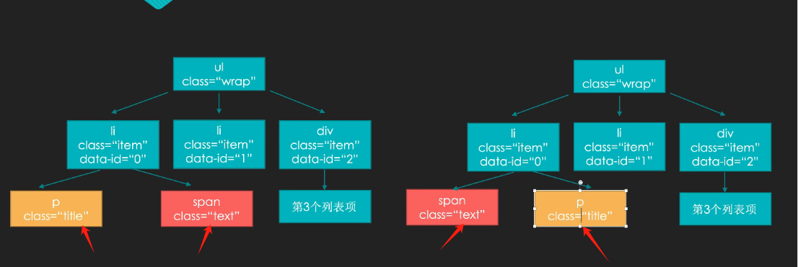

# [1. 了解diff算法的特征，虚拟节点，创建项目]( https://www.bilibili.com/video/BV1zk4y1y7sD)

Dom diff 其实就是对比两个虚拟节点，然后找出它们的差异。然后对应到真实dom上面去做**打补丁**这样一个过程。

目的：找到这些差异，以最小的代价去操作dom

因为操作dom本身很损耗性能。

因此引出一个概念：**虚拟节点**——理解为普通对象（把真实的节点用对象的方式模拟出来）


|                             特点                             |                                                              |
| :----------------------------------------------------------: | :----------------------------------------------------------: |
|                         **平级对比**                         |                                                              |
|                         **会找索引**                         |                                                              |
| **位置交替的情况：可以替换，不用重新渲染li节点**(即span和p的父元素)。 是比较好的优化的策略 |  |
|         dom diff是一个深度遍历的过程（**深度优先**）         |  |


|                             代码                             |                           执行效果                           |
| :----------------------------------------------------------: | :----------------------------------------------------------: |
|  |  |


每一个虚拟节点都有三个东西：

- type：标签名
- props：属性——比如class和style
- children

```js
const vDom = createElement('ul', 
    {
        class:'list', 
        style: 'width:300px;height:300px;background-color:orange'
    }, [
        createElement('li', {class: 'item', 'data-index': 0}, [
            createElement('p', {class: 'text'}, ['第1个列表项'])
        ]),
        createElement('li', {class: 'item', 'data-index': 1}, [
            createElement('p', {class: 'text'}, [
                createElement('span', {class: 'title'}, ['第2个列表项'])
            ])
        ]),
        createElement('li', {class: 'item', 'data-index': 2}, ['第3个列表项'])
    ]
)
```

createElement: 

1. 把虚拟节点转换成能在控制台里面打印出来的虚拟节点
2. 再转换成真实的dom节点

# [2. 构建虚拟节点、转换真实DOM、渲染DOM节点](https://www.bilibili.com/video/BV1zk4y1y7sD?vd_source=a7089a0e007e4167b4a61ef53acc6f7e&p=2&spm_id_from=333.788.player.switch)

虚拟dom 到 真实dom 这个过程，是需要一个渲染函数去支撑的

`Element.js:`


`virtualDom.js`:

# [3. 虚拟节点差异分析 创建补丁包](https://www.bilibili.com/video/BV1zk4y1y7sD?vd_source=a7089a0e007e4167b4a61ef53acc6f7e&spm_id_from=333.788.player.switch&p=3)


# [4. 给真实DOM打补丁](https://www.bilibili.com/video/BV1zk4y1y7sD?vd_source=a7089a0e007e4167b4a61ef53acc6f7e&spm_id_from=333.788.player.switch&p=4)

# 5. React Diff  && Vue Diff

### **Vue 和 React 的 Diff 算法概述**

在前端开发中，**虚拟 DOM** 是优化性能的一种常见技术，它通过减少对实际 DOM 的操作，提升页面渲染的效率。**Diff 算法** 是虚拟 DOM 实现的核心，**它负责高效地比较新旧 DOM 树的差异并最小化实际 DOM 操作**。

虽然 **Vue** 和 **React** 都使用了虚拟 DOM，但它们的 Diff 算法有不同的实现方式

------

### **React 的 Diff 算法**

React 的 Diff 算法基于以下几个核心假设，目的是为了提高效率，减少不必要的渲染。

#### 1. **核心假设**

- **同一层次比较**：React 在比较新旧虚拟 DOM 树时，只会在相同层次的节点之间进行比较。即，React 假设两个同一层次的节点可能有不同的类型和结构。
- **不同类型的元素会导致重新渲染**：当遇到不同类型的元素（如 `<div>` 和 `<span>`）时，React 会丢弃旧的节点，直接重新创建新的节点。
- **使用 key 来优化子节点比较**：对于有多个相同类型的子元素，React 依赖于 `key` 来标识每个子元素的位置，这样可以更高效地更新元素，而不是逐一比较。

#### 2. **更新流程**

- **Reconciliation（协调）**：React 会对比组件的虚拟 DOM 树（即“新树”与“旧树”），然后根据它们之间的差异更新实际 DOM。
- **逐层比较**：React 从根节点开始，逐层遍历新旧树，尝试最小化更新的范围。例如，当两棵树的根节点相同，React 会继续向下比较子节点。
- **Key 的作用**：React 会使用 `key` 属性来优化子元素的对比。没有 `key` 的情况下，React 会直接按位置重新排列和比较 DOM 元素，使用 `key` 时则会通过 `key` 来判断元素是否发生了变化。

#### 3. **算法具体步骤**

1. **对比节点类型**：如果新旧节点类型不同，React 会销毁旧节点并创建新节点。
2. **对比属性**：如果新旧节点类型相同，React 会比较它们的属性，只有在属性变化时才会更新相应的 DOM。
3. **递归对比子节点**：对比子节点时，React 会首先根据 `key` 来确定哪些子节点已经移动、被删除或新增。
4. **处理文本节点**：文本节点的比较相对简单，React 会检查文本内容是否变化，如果变化就更新 DOM。

#### 4. **总结**

- **React 的 Diff 算法** 采用了逐层对比的方式，先比较同一层次的节点，再通过 `key` 来优化子节点的比较，最后根据节点的不同类型决定是否重新渲染。这种方式效率较高，但对于大型应用，还是有一些性能瓶颈，尤其是在没有 `key` 的情况下。

------

### **Vue 的 Diff 算法**

Vue 的 Diff 算法与 React 的算法有些相似，但 Vue 的实现更加关注性能优化，尤其是对子组件和列表的优化。

#### 1. **核心假设**

- **DOM 树分割**：Vue 通过递归地对比组件的子树来减少渲染的粒度。当 Vue 遇到一个组件时，它会递归地比较该组件的子树，而不是对整个应用的虚拟 DOM 进行全量比较。
- **静态标记优化**：Vue 会标记那些没有改变的静态节点，通过静态节点的优化来减少 Diff 比较的数量。

#### 2. **更新流程**

- **Diff 算法（虚拟 DOM 树对比）**：Vue 使用虚拟 DOM 树的 Diff 算法来比较新旧树，算法也基于“逐层比较”的原则。Vue 会从根节点开始对比，并在发现不同的节点时，更新对应的 DOM。
- **组件树的比较**：Vue 中的组件树会单独进行 Diff 比较。这意味着 Vue 会对比每个组件的虚拟 DOM，并且对子组件会优先使用其 `key` 来优化。
- **静态节点标记**：Vue 采用了“静态标记”技术，Vue 在渲染过程中会标记不需要更新的静态节点，这些静态节点会跳过 Diff 比较，从而提高性能。

#### 3. **算法具体步骤**

1. **比较节点类型**：Vue 首先比较新旧节点的类型，如果类型不同则销毁旧节点，创建新节点。
2. **逐层比较子节点**：与 React 相似，Vue 也会根据 `key` 来优化子节点的对比，减少节点的重新渲染。
3. **静态节点优化**：Vue 会为静态节点添加标记，标记之后这些节点就不再参与后续的比较。
4. **组件内差异比较**：对于组件，Vue 会对每个组件的子树进行单独比较，并根据组件的 `key` 属性进行优化。

#### 4. **总结**

- **Vue 的 Diff 算法** 与 React 类似，但 Vue 采用了更多的优化措施。例如，Vue 会使用静态标记来减少对静态内容的比较，并且 Vue 通过对子组件的递归比较来提高 Diff 算法的性能。Vue 更加关注在组件和静态内容上的优化，使得它在一些特定场景下能更高效。

------

### **React 和 Vue Diff 算法对比**

| 特性             | **React**                                                    | **Vue**                                                      |
| ---------------- | ------------------------------------------------------------ | ------------------------------------------------------------ |
| **算法类型**     | 基于虚拟 DOM 的逐层对比，主要使用比较新旧树节点来更新 DOM。  | 递归对比组件的虚拟 DOM，使用静态标记优化和组件内的独立比较。 |
| **组件更新策略** | 使用 `key` 来优化子节点的对比。                              | 使用 `key` 来优化子节点的对比，同时对子组件递归比较。        |
| **静态节点优化** | 没有明确的静态节点优化机制。                                 | 静态节点标记优化：Vue 会标记静态内容，减少不必要的更新。     |
| **DOM 比较粒度** | 逐层比较，最小粒度为同一层级的节点。                         | 静态节点跳过比较，组件有独立的树结构进行比较。               |
| **性能优化**     | 没有静态节点优化，`key` 的使用对性能有较大影响。             | 静态节点优化，递归比较提高组件间差异检测的效率。             |
| **节点更新策略** | 不同类型的节点会被替换，不同类型的节点将会销毁旧节点并创建新节点。 | 相同类型节点更新，不同类型节点销毁并重建。                   |
| **可配置性**     | 算法较为灵活，`key` 和 `shouldComponentUpdate` 提供了性能优化的选项。 | `v-once` 和 `v-for` 提供了灵活的性能优化配置。               |

### **总结**

- **React** 的 Diff 算法强调的是逐层比较和 `key` 的优化，它对于大型列表和没有 `key` 的情况效率较低。React 适合处理数据变化频繁、但没有复杂组件层级结构的场景。
- **Vue** 在 Diff 算法上更加注重性能优化，尤其在静态节点和组件树的优化上做了很多努力。Vue 通过静态节点的标记避免了不必要的比较，递归组件的 Diff 对比提高了多组件协作时的性能。Vue 更加注重在组件树和静态节点上的优化，适用于需要频繁渲染的场景。

两者的算法差异表现在 **性能优化** 和 **可扩展性** 上，Vue 在很多情况下通过自动优化能够提供更高的性能，而 React 则在灵活性和组件化上提供了更多的控制。

# 6. React Diff  && Vue Diff

Vue 和 React 都采用了 **虚拟 DOM** 和 **Diff 算法** 来高效地更新 UI。在 Web 开发中，尤其是单页应用（SPA）中，当数据变化时，如何高效更新页面是一个核心问题。虚拟 DOM 和 Diff 算法的使用，可以最小化 DOM 操作，提升性能。尽管 Vue 和 React 都有类似的目标，但它们的 Diff 算法实现有所不同。下面详细讲解两者的实现，并进行对比。

### **Vue 的 Diff 算法**

Vue 的 Diff 算法实现相对较为简单，主要特点是：

#### 1. **基于“深度优先”比对**

Vue 在更新过程中，会从 **根节点**（通常是组件的根元素）开始，递归地比较每个子节点，直到所有的节点都更新完毕。这种递归式的比对被称为 **深度优先遍历**，即从父节点到子节点逐一进行比较。

#### 2. **通过“key”优化性能**

Vue 的 Diff 算法利用 `key` 来优化 DOM 比较过程。当你在列表中渲染多个元素时，使用唯一的 `key` 可以让 Vue 更容易地确定哪些元素发生了变化。没有 `key` 时，Vue 会使用 **原地复用策略**（即重新排列节点），而有 `key` 时，Vue 会通过比较 `key` 来更精确地更新元素，从而避免不必要的 DOM 操作。

#### 3. **双向绑定和模板解析**

Vue 使用 **双向绑定**（Vue 2.x 中通过 `v-model`，Vue 3.x 使用响应式系统）和模板编译的方式进行数据绑定。模板渲染的过程中，Vue 会生成虚拟 DOM，并通过比较虚拟 DOM 来决定实际的 DOM 更新方式。Vue 在更新过程中，会对同一个 DOM 节点进行 **就地更新**，避免了不必要的重排。

#### 4. **优化策略**

Vue 在处理 DOM 更新时，会对节点的 **动态绑定事件**、**生命周期钩子** 等进行优化，减少无用的重新渲染。

#### 5. **组件渲染**

Vue 在组件渲染时会记录上一次渲染的状态，并使用 **patch** 来处理变化，按需更新 DOM。当一个组件的状态改变时，Vue 通过虚拟 DOM 比较算法来找到需要改变的部分，更新实际 DOM。

### **React 的 Diff 算法**

React 的 Diff 算法也使用了虚拟 DOM，但其实现上更为复杂，主要特点是：

#### 1. **基于“广度优先”比对**

React 在 Diff 算法中采用了 **广度优先**（Level by Level）的比对策略。这意味着 React 会优先对同一层级的节点进行比较。首先比对组件的根节点，再逐层深入，每层逐个节点进行比较。

#### 2. **按类型比较**

React 在进行 Diff 比较时，首先会根据 **元素类型** 来判断。如果类型相同，才会进一步比较子节点的变化；如果类型不同，React 会直接丢弃旧的节点并生成新的节点。这种方式提高了性能，尤其是在元素类型发生变化的情况下。

#### 3. **通过“key”优化性能**

和 Vue 类似，React 也使用 `key` 来优化列表元素的渲染。React 会根据 `key` 来标识每个元素，确保在元素顺序发生变化时，只进行必要的 DOM 更新，而不是重新渲染所有元素。

#### 4. **组件渲染**

React 在组件渲染时使用了 **Virtual DOM**（虚拟 DOM）和 **Reconciliation**（协调算法）。每当组件状态或属性发生变化时，React 会创建新的虚拟 DOM 树并与旧的虚拟 DOM 树进行比较。通过这个过程，React 只会更新发生变化的部分，避免了不必要的 DOM 操作。

#### 5. **Fiber 重构**

React 16 引入了 **Fiber** 重构，优化了渲染过程。Fiber 使得 React 可以将渲染过程拆分成多个小任务，支持异步渲染和高优先级的任务调度。它解决了在高负载下，长时间渲染引起的 UI 卡顿问题。

#### 6. **更新优先级**

React 允许不同优先级的更新并行进行。例如，用户交互（如点击按钮）的更新可以更高优先级，而数据加载的更新可以较低优先级，从而保证页面响应的流畅性。

### **Vue 和 React 的 Diff 算法对比**

| 特性              | **Vue**                                                 | **React**                                                    |
| ----------------- | ------------------------------------------------------- | ------------------------------------------------------------ |
| **Diff 算法类型** | 深度优先遍历，递归比较子节点                            | 广度优先遍历，按层级逐个比较                                 |
| **节点比较**      | 基于节点的类型、`key` 和属性来优化更新                  | 基于节点类型、`key`、子节点比较来优化更新                    |
| **`key` 优化**    | 使用 `key` 来标识列表中的元素，从而避免不必要的节点移动 | 同样使用 `key` 来标识列表中的元素，避免重新渲染整个列表      |
| **组件渲染**      | 使用虚拟 DOM + patch 来渲染组件                         | 使用虚拟 DOM + Reconciliation（协调算法）来渲染组件          |
| **渲染优先级**    | 渲染优先级较为简单，所有更新都等同对待                  | 支持更新的优先级管理（高优先级与低优先级更新并行）           |
| **性能优化**      | 通过 `key` 和虚拟 DOM 机制优化 DOM 更新                 | Fiber 重构，支持异步渲染和按优先级拆分渲染任务               |
| **更新机制**      | 采用脏检查和响应式系统，自动跟踪数据变化                | 使用状态更新和 `setState` 进行异步更新和渲染                 |
| **生命周期**      | 每个组件有完整的生命周期钩子，更新周期短                | 每个组件有完整的生命周期方法，更新通过 `shouldComponentUpdate` 控制 |

### **总结与对比**

- **Diff 算法策略：** Vue 使用 **深度优先** 遍历，而 React 使用 **广度优先** 遍历。这导致了 Vue 在某些情况下更新速度较快（特别是在节点比较较少的情况下），而 React 在更复杂的组件结构中可能有更好的性能。
- **虚拟 DOM 更新机制：** Vue 和 React 都使用虚拟 DOM，但 React 引入了 **Reconciliation** 和 **Fiber**（React 16+），使得 React 在大型应用中能更好地处理异步渲染和任务调度。Vue 则依赖响应式系统和双向数据绑定，更新过程相对简单。
- **`key` 和优化：** 两者都强调 `key` 对列表渲染的优化，确保只重新渲染变化的部分，避免全量更新。
- **组件更新：** Vue 的更新策略相对简单，更新时会根据虚拟 DOM 树比较直接操作 DOM；React 的更新机制更加细致，使用 **shouldComponentUpdate** 和 **PureComponent** 等控制组件的重新渲染。

总的来说，**Vue** 的 Diff 算法相对简单易懂，适合快速开发和中小型项目，而 **React** 则在大型应用和复杂的 UI 更新场景下表现更好，特别是通过 **Fiber** 进行异步渲染优化，提升了性能。

# 7. React Diff  && Vue Diff

 https://mp.weixin.qq.com/s/Is-0DW3QZbPSyxeSIEjT-A

# [8. React Diff  && Vue2 Diff && Vue3 Diff](https://www.bilibili.com/video/BV1Dm411X7rH/?spm_id_from=333.337.search-card.all.click&vd_source=a7089a0e007e4167b4a61ef53acc6f7e)


**React diff仅右移：**


**Vue2双端比较：**


**Vue3：最长递增子序列**


Vue，React为什么循环时必须使用key?


