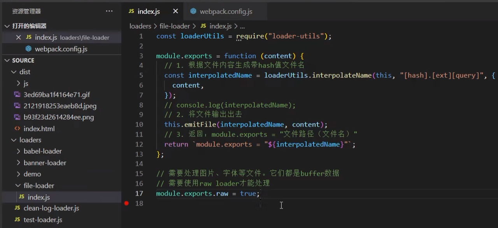
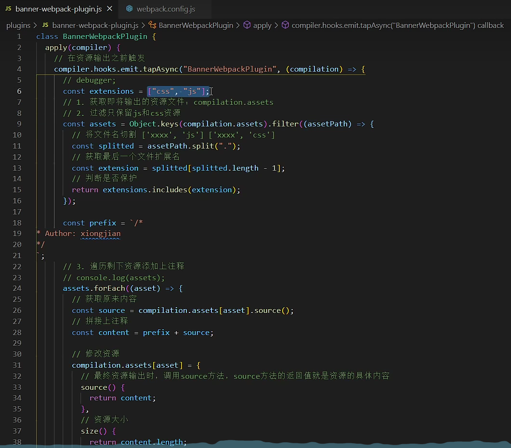

# [38 多进程打包](https://www.bilibili.com/video/BV14T4y1z7sw?p=38&vd_source=a7089a0e007e4167b4a61ef53acc6f7e)

|  |  |
| ------------------------------------------------------------ | ------------------------------------------------------------ |
|  |  |
|  |  |
|  |  |

# [54. ReactCli-开发模式配置-上](https://www.bilibili.com/video/BV14T4y1z7sw?p=54&spm_id_from=pageDriver&vd_source=a7089a0e007e4167b4a61ef53acc6f7e)

# [65 loader介绍](https://www.bilibili.com/video/BV14T4y1z7sw/?p=65&spm_id_from=333.880.my_history.page.click&vd_source=a7089a0e007e4167b4a61ef53acc6f7e)

|  |  |
| ------------------------------------------------------------ | ------------------------------------------------------------ |

# [66 手写第一个loader](https://www.bilibili.com/video/BV14T4y1z7sw/?p=66&spm_id_from=pageDriver&vd_source=a7089a0e007e4167b4a61ef53acc6f7e)

文件目录结构：

`webpack.config.js`

```js
module.exports = {
  entry: "./src/main.js",
  output: {
    path: path.resolve(__dirname, "./dist"),
    filename: "js/[name].js",
  },
  module: {
    rules: [
      {
        test: /\.js$/,
        loader: "./loaders/test-loader.js",
      },
    ],
  },
  plugins: [],
};
```

`test-loader.js`

```js
// loader就是一个函数，当webpack解析资源时，会调用相应的loader去处理
// loader接受到文件内容作为参数，返回内容出去
// content: 文件内容
// map: SourceMap相关的东西
// meta: 别的loader传递的数据
module.exports = function (content, map, meta) {
  console.log(content);
  return content;
};
```

# [67 同步loader](https://www.bilibili.com/video/BV14T4y1z7sw/?p=67&spm_id_from=pageDriver&vd_source=a7089a0e007e4167b4a61ef53acc6f7e)

```js
// 同步loader的第一种写法
module.exports = function (content) {
  return content;
};

// 同步loader的第二种写法
module.exports = function (content, map, meta) {
  // 第一个参数：err 代表是否有错误。若Loader处理过程中发生错误，可将错误信息传递给Webpack。传`null`表示没有错误
  // 第二个参数：content 处理后的文件内容。这个内容会传递给下一个 Loader 或最终打包输出。
  // 第三个参数：source-map(可选): 如果 Loader 生成了 Source Map，传递 Source Map 信息，帮助调试
  // 第四个参数：meta(可选): 附加的元数据，通常用来在 Loader 之间传递一些信息
  this.callback(null, content, map, meta);
  // 注意：同步loader中不能进行异步操作
  // setTimeout(() => {
  //   console.log("test1");
  //   this.callback(null, content, map, meta);
  // }, 1000);
};
```

## this.callback哪里来的

`this.callback` 是由 Webpack 提供给 Loader 开发者的一个回调函数，用于 Loader 返回结果或处理异步任务。

它是 Webpack Loader API 的一部分，允许 Loader 将处理后的文件内容、错误信息、Source Map 和额外的元数据返回给 Webpack。

在 Loader 执行时，Webpack 会为其提供上下文（即 `this`），该上下文中包含多个工具函数和属性，`this.callback` 就是其中之一。`this.callback` 是 Webpack 用于通知其构建流程 Loader 的处理结果的机制

## 自定义loader运行时，其this的指向

在自定义 Loader 运行时，`this` 的指向并不是 Webpack 本身，而是 **Webpack 为每个 Loader 提供的上下文对象**。这个上下文对象包含了很多有用的 API 和工具，帮助 Loader 与 Webpack 构建流程进行交互。

### `this` 指向的 Loader 上下文
当 Webpack 调用 Loader 时，`this` 会指向 Loader 的上下文对象，这个对象提供了一系列方法和属性供 Loader 使用。虽然 `this` 不指向 Webpack 本身，但它包含了一些 Webpack 运行时提供的功能，可以帮助 Loader 获取和处理各种信息。

#### 主要的 `this` 上下文属性和方法：
- **`this.callback`**：用于异步 Loader 向 Webpack 返回处理结果。
- **`this.async()`**：告知 Webpack当前 Loader 是异步的，返回一个可以被调用的 `callback`。
- **`this.resourcePath`**：当前处理文件的完整路径。
- **`this.context`**：文件所在的目录路径。
- **`this.query`**：获取传递给 Loader 的查询参数或选项。
- **`this.cacheable()`**：告诉 Webpack当前 Loader 的处理结果是否可以被缓存。
- **`this.addDependency()`**：手动向 Webpack 声明文件依赖，确保文件的变化会重新触发构建。
- **`this.addContextDependency()`**：声明一个目录的依赖，监视该目录中文件的变化。
- **`this.emitFile()`**：让 Loader 生成新的文件并添加到输出中。
- **`this.sourceMap`**：是否开启 Source Map 生成。

### 示例

```javascript
module.exports = function (source) {
  // 输出 `this` 上下文中的属性
  console.log('Loader context:', this);
  console.log('Resource path:', this.resourcePath);
  console.log('Query options:', this.query);

  // 如果需要异步处理
  const callback = this.async();

  // 模拟异步操作
  setTimeout(() => {
    const result = source.replace(/foo/g, 'bar');
    callback(null, result);
  }, 1000);
};
```

在上面的例子中，`this` 指向的是 Webpack 提供的上下文对象，而不是 Webpack 本身。你可以通过它访问当前文件路径、查询参数，以及其他与 Loader 相关的信息。

### 具体作用
`this` 指向的上下文对象主要用于以下几种场景：
1. **与 Webpack 构建系统交互**：Loader 可以通过 `this.addDependency()` 和 `this.emitFile()` 与 Webpack 的模块和文件系统交互。
2. **异步处理**：如果 Loader 执行的是异步操作，可以使用 `this.async()` 来通知 Webpack。
3. **调试和日志**：通过 `this.resourcePath`、`this.context` 等获取文件和路径信息，便于调试。

### 小结
- `this` 在自定义 Loader 中指向的是 Webpack 为 Loader 提供的上下文对象，而不是 Webpack 本身。
- 这个上下文对象提供了丰富的 API，用于与 Webpack 构建流程进行交互、处理异步操作、缓存结果、声明依赖等。

# [68 异步loader](https://www.bilibili.com/video/BV14T4y1z7sw/?p=68&spm_id_from=pageDriver&vd_source=a7089a0e007e4167b4a61ef53acc6f7e)

https://webpack.docschina.org/api/loaders/#thisasync

- **`this.callback`**：可以同步或者异步调用的并返回多个结果的函数
- **`this.async()`**：告诉 [loader-runner](https://github.com/webpack/loader-runner) 这个 loader 将会异步地回调。返回 `this.callback`

```js
module.exports = function (content, map, meta) {
  const callback = this.async();
  setTimeout(() => {
    // console.log("test2", content);
    callback(null, content, map, meta);
  }, 1000);
};
```

# [69 raw loader](https://www.bilibili.com/video/BV14T4y1z7sw?p=69&spm_id_from=pageDriver&vd_source=a7089a0e007e4167b4a61ef53acc6f7e)

```js
// raw loader接受到content是Buffer数据
// 写法一：
module.exports = function (content) {
   console.log(content);
   return content;
};
module.exports.raw = true;

// 写法二：
function test3Loader(content) {
  return content;
}
test3Loader.raw = true;
module.exports = test3Loader;
```

# [70 pitch loader](https://www.bilibili.com/video/BV14T4y1z7sw?p=70&spm_id_from=pageDriver&vd_source=a7089a0e007e4167b4a61ef53acc6f7e)

pitch方法会在loader执行之前执行


# [71 loader API](https://www.bilibili.com/video/BV14T4y1z7sw/?p=71&spm_id_from=pageDriver&vd_source=a7089a0e007e4167b4a61ef53acc6f7e)

https://webpack.docschina.org/api/loaders/#thiscallback

这些loader api是装了webpack就有吗？还是装webpack-cli才有，还是怎么的？

**Webpack 的 Loader API** 是 Webpack 核心功能的一部分，与 Webpack 本身绑定在一起。因此，只要安装了 Webpack（`webpack` 包），就可以使用 Loader API，**不需要依赖 `webpack-cli`**


# [72 自定义clean-log-loader](https://www.bilibili.com/video/BV14T4y1z7sw/?p=72&spm_id_from=pageDriver&vd_source=a7089a0e007e4167b4a61ef53acc6f7e)


https://webpack.docschina.org/api/cli/

https://webpack.docschina.org/guides/installation/

> ###### 警告
>
> 如果你想使用 `npx` 来运行 webpack，请确保你已经安装了 `webpack-cli`

```
npx webpack
```

# [73  自定义banner-loader](https://www.bilibili.com/video/BV14T4y1z7sw/?p=73&spm_id_from=pageDriver&vd_source=a7089a0e007e4167b4a61ef53acc6f7e)

            


# 74 自定义babel-loader

# [75 自定义file-loader](https://www.bilibili.com/video/BV14T4y1z7sw/?p=75&spm_id_from=pageDriver&vd_source=a7089a0e007e4167b4a61ef53acc6f7e)

- 根据文件内容生成一个hash值的文件名称
- 然后把文件输出到dist目录
- module.exports


```
npm i loader-utils -D
npm i css-loader style-loader -D
```



## 75.1 webpack从v4升级到v5

- 如果你定义了 `rules`，以使用 `raw-loader`，`url-loader` 或 `file-loader` 来加载资源，请使用 [资源模块](https://webpack.docschina.org/guides/asset-modules/) 替代，因为它们可能在不久的将来被淘汰。

# [76 自定义style-loader](https://www.bilibili.com/video/BV14T4y1z7sw/?p=76&spm_id_from=pageDriver&vd_source=a7089a0e007e4167b4a61ef53acc6f7e)

- 通过动态创建style标签， 将处理好的样式，放到style标签内生效
- 

# [78 Plugin介绍](https://www.bilibili.com/video/BV14T4y1z7sw/?p=78&spm_id_from=pageDriver&vd_source=a7089a0e007e4167b4a61ef53acc6f7e)

插件接口允许用户直接介入编译过程。 插件可以在不同时期运行的生命周期挂钩上注册回调函数。 在单个编译流程中，当每个钩子都被执行后，插件将拥有 当前编译流程的完整访问权限

https://webpack.docschina.org/api/plugins/

## Plugin的作用

- 通过plugin，我们可以扩展webpack，加入一些自定义的构建行为，使webpack可以执行更广泛的任务，拥有更强的构建能力

## Plugin的工作原理


## Webpack内部的钩子

### 什么是钩子


### Tapable


## Plugin构建对象


## 生命周期简图

> 资源的具体处理都是在compilation中去完成的
>
> 如果是多入口，compilation会触发很多次


# [79 第一个Plugin](https://www.bilibili.com/video/BV14T4y1z7sw/?p=79&spm_id_from=pageDriver&vd_source=a7089a0e007e4167b4a61ef53acc6f7e)

- 所有插件都是一个构造函数，因为将来要new plugin
- 

# [80 注册hooks](https://www.bilibili.com/video/BV14T4y1z7sw/?p=80&spm_id_from=pageDriver&vd_source=a7089a0e007e4167b4a61ef53acc6f7e)


# [81 通过node调试查看compiler和compilation对象](https://www.bilibili.com/video/BV14T4y1z7sw?p=81&spm_id_from=pageDriver&vd_source=a7089a0e007e4167b4a61ef53acc6f7e)

package.json

```json
"scripts": {
    "debug": "node --inspect-brk ./node_modules/webpack-cli/bin/cli.js"
}
```

# [82 自定义BannerWebpackPlugin](https://www.bilibili.com/video/BV14T4y1z7sw/?p=82&spm_id_from=pageDriver&vd_source=a7089a0e007e4167b4a61ef53acc6f7e)


将tapAsync改成tap




# [83 自定义CleanWebpackPlugin](https://www.bilibili.com/video/BV14T4y1z7sw?p=83&vd_source=a7089a0e007e4167b4a61ef53acc6f7e)

1. 作用：在 webpack 打包输出前将上次打包内容清空。

2. 开发思路：

- 如何在打包输出前执行？需要使用 `compiler.hooks.emit` 钩子, 它是打包输出前触发。
- 如何清空上次打包内容？
  - 获取打包输出目录：通过 compiler 对象。
  - 通过文件操作清空内容：通过 `compiler.outputFileSystem` 操作文件。

3. 实现：

```js
// plugins/clean-webpack-plugin.js
class CleanWebpackPlugin {
  apply(compiler) {
    // 获取操作文件的对象
    const fs = compiler.outputFileSystem;
    // emit是异步串行钩子
    compiler.hooks.emit.tapAsync("CleanWebpackPlugin", (compilation, callback) => {
      // 获取输出文件目录
      const outputPath = compiler.options.output.path;
      // 删除目录所有文件
      const err = this.removeFiles(fs, outputPath);
      // 执行成功err为undefined，执行失败err就是错误原因
      callback(err);
    });
  }

  removeFiles(fs, path) {
    try {
      // 读取当前目录下所有文件
      const files = fs.readdirSync(path);

      // 遍历文件，删除
      files.forEach((file) => {
        // 获取文件完整路径
        const filePath = `${path}/${file}`;
        // 分析文件
        const fileStat = fs.statSync(filePath);
        // 判断是否是文件夹
        if (fileStat.isDirectory()) {
          // 是文件夹需要递归遍历删除下面所有文件
          this.removeFiles(fs, filePath);
        } else {
          // 不是文件夹就是文件，直接删除
          fs.unlinkSync(filePath);
        }
      });

      // 最后删除当前目录
      fs.rmdirSync(path);
    } catch (e) {
      // 将产生的错误返回出去
      return e;
    }
  }
}

module.exports = CleanWebpackPlugin;
```

# [84 自定义AnalyzeWebpackPlugin](https://www.bilibili.com/video/BV14T4y1z7sw?p=84&vd_source=a7089a0e007e4167b4a61ef53acc6f7e)

1. 作用：分析 webpack 打包资源大小，并输出分析文件。
2. 开发思路:

- 在哪做? `compiler.hooks.emit`, 它是在打包输出前触发，我们需要分析资源大小同时添加上分析后的 md 文件。

3. 实现：

```js
// plugins/analyze-webpack-plugin.js
class AnalyzeWebpackPlugin {
  apply(compiler) {
    // emit是异步串行钩子
    compiler.hooks.emit.tap("AnalyzeWebpackPlugin", (compilation) => {
      // Object.entries将对象变成二维数组。二维数组中第一项值是key，第二项值是value
      const assets = Object.entries(compilation.assets);

      let source = "# 分析打包资源大小 \n| 名称 | 大小 |\n| --- | --- |";

      assets.forEach(([filename, file]) => {
        source += `\n| ${filename} | ${file.size()} |`;
      });

      // 添加资源
      compilation.assets["analyze.md"] = {
        source() {
          return source;
        },
        size() {
          return source.length;
        },
      };
    });
  }
}

module.exports = AnalyzeWebpackPlugin;
```

# [85 InlineChunkWebpackPlugin基本介绍](https://www.bilibili.com/video/BV14T4y1z7sw?p=85&vd_source=a7089a0e007e4167b4a61ef53acc6f7e)

1. 作用：webpack 打包生成的 runtime 文件太小了，额外发送请求性能不好，所以需要将其内联到 js 中，从而减少请求数量。
2. 开发思路:

- 我们需要借助 `html-webpack-plugin` 来实现
  - 在 `html-webpack-plugin` 输出 index.html 前将内联 runtime 注入进去
  - 删除多余的 runtime 文件
- 如何操作 `html-webpack-plugin`？[官方文档](https://github.com/jantimon/html-webpack-plugin/#afteremit-hook)

3. 实现：

```js
// plugins/inline-chunk-webpack-plugin.js
const HtmlWebpackPlugin = require("safe-require")("html-webpack-plugin");

class InlineChunkWebpackPlugin {
  constructor(tests) {
    this.tests = tests;
  }

  apply(compiler) {
    compiler.hooks.compilation.tap("InlineChunkWebpackPlugin", (compilation) => {
      const hooks = HtmlWebpackPlugin.getHooks(compilation);

      hooks.alterAssetTagGroups.tap("InlineChunkWebpackPlugin", (assets) => {
        assets.headTags = this.getInlineTag(assets.headTags, compilation.assets);
        assets.bodyTags = this.getInlineTag(assets.bodyTags, compilation.assets);
      });

      hooks.afterEmit.tap("InlineChunkHtmlPlugin", () => {
        Object.keys(compilation.assets).forEach((assetName) => {
          if (this.tests.some((test) => assetName.match(test))) {
            delete compilation.assets[assetName];
          }
        });
      });
    });
  }

  getInlineTag(tags, assets) {
    return tags.map((tag) => {
      if (tag.tagName !== "script") return tag;

      const scriptName = tag.attributes.src;

      if (!this.tests.some((test) => scriptName.match(test))) return tag;

      return { tagName: "script", innerHTML: assets[scriptName].source(), closeTag: true };
    });
  }
}

module.exports = InlineChunkWebpackPlugin;
```


