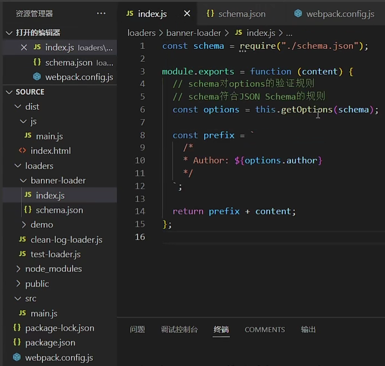
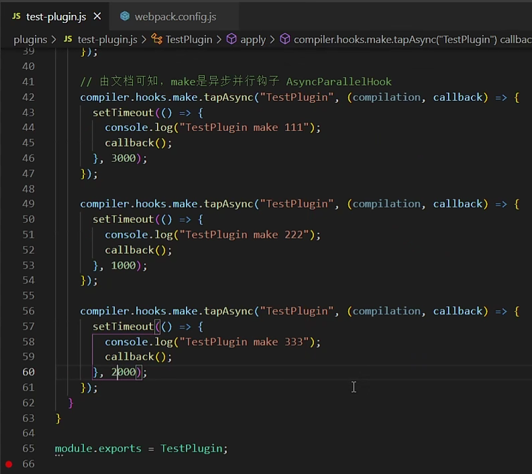

# 65 loader介绍

https://www.bilibili.com/video/BV14T4y1z7sw/?p=65&spm_id_from=333.880.my_history.page.click&vd_source=a7089a0e007e4167b4a61ef53acc6f7e

                                                       

# 66 第一个loader

https://www.bilibili.com/video/BV14T4y1z7sw/?p=66&spm_id_from=pageDriver&vd_source=a7089a0e007e4167b4a61ef53acc6f7e

               

# 67 同步loader

https://www.bilibili.com/video/BV14T4y1z7sw/?p=67&spm_id_from=pageDriver&vd_source=a7089a0e007e4167b4a61ef53acc6f7e


# 68 异步loader

https://www.bilibili.com/video/BV14T4y1z7sw/?p=68&spm_id_from=pageDriver&vd_source=a7089a0e007e4167b4a61ef53acc6f7e


# 69 row loader


# 70 picth loader


# [71 loader API](https://www.bilibili.com/video/BV14T4y1z7sw/?p=71&spm_id_from=pageDriver&vd_source=a7089a0e007e4167b4a61ef53acc6f7e)

==这些loader api是装了webpack就有吗？还是装webpack-cli才有，还是怎么的？？？==


# [72 自定义clean-log-loader](https://www.bilibili.com/video/BV14T4y1z7sw/?p=72&spm_id_from=pageDriver&vd_source=a7089a0e007e4167b4a61ef53acc6f7e)


https://webpack.docschina.org/api/cli/

https://webpack.docschina.org/guides/installation/

> ###### 警告
>
> 如果你想使用 `npx` 来运行 webpack，请确保你已经安装了 `webpack-cli`

```
npx webpack
```

# [73  自定义banner-loader](https://www.bilibili.com/video/BV14T4y1z7sw/?p=73&spm_id_from=pageDriver&vd_source=a7089a0e007e4167b4a61ef53acc6f7e)

            


# 74 自定义babel-loader

# [75 自定义file-loader](https://www.bilibili.com/video/BV14T4y1z7sw/?p=75&spm_id_from=pageDriver&vd_source=a7089a0e007e4167b4a61ef53acc6f7e)

- 根据文件内容生成一个hash值的文件名称
- 然后把文件输出到dist目录
- module.exports


```
npm i loader-utils -D
npm i css-loader style-loader -D
```


## 75.1 webpack从v4升级到v5

- 如果你定义了 `rules`，以使用 `raw-loader`，`url-loader` 或 `file-loader` 来加载资源，请使用 [资源模块](https://webpack.docschina.org/guides/asset-modules/) 替代，因为它们可能在不久的将来被淘汰。

# [76 自定义style-loader](https://www.bilibili.com/video/BV14T4y1z7sw/?p=76&spm_id_from=pageDriver&vd_source=a7089a0e007e4167b4a61ef53acc6f7e)

- 通过动态创建style标签， 将处理好的样式，放到style标签内生效
- 

# [78 Plugin介绍](https://www.bilibili.com/video/BV14T4y1z7sw/?p=78&spm_id_from=pageDriver&vd_source=a7089a0e007e4167b4a61ef53acc6f7e)

插件接口允许用户直接介入编译过程。 插件可以在不同时期运行的生命周期挂钩上注册回调函数。 在单个编译流程中，当每个钩子都被执行后，插件将拥有 当前编译流程的完整访问权限

https://webpack.docschina.org/api/plugins/

## Plugin的作用

- 通过plugin，我们可以扩展webpack，加入一些自定义的构建行为，使webpack可以执行更广泛的任务，拥有更强的构建能力

## Plugin的工作原理


## Webpack内部的钩子

### 什么是钩子


### Tapable


## Plugin构建对象


## 生命周期简图


# [79 第一个Plugin](https://www.bilibili.com/video/BV14T4y1z7sw/?p=79&spm_id_from=pageDriver&vd_source=a7089a0e007e4167b4a61ef53acc6f7e)

- 所有插件都是一个构造函数，因为将来要new plugin
- 

# [80 注册hooks](https://www.bilibili.com/video/BV14T4y1z7sw/?p=80&spm_id_from=pageDriver&vd_source=a7089a0e007e4167b4a61ef53acc6f7e)




# [81 通过node调试查看compiler和compilation对象](https://www.bilibili.com/video/BV14T4y1z7sw?p=81&spm_id_from=pageDriver&vd_source=a7089a0e007e4167b4a61ef53acc6f7e)

package.json

```json
"scripts": {
    "debug": "node --inspect-brk ./node_modules/webpack-cli/bin/cli.js"
}
```

# [82 自定义BannerWebpackPlugin](https://www.bilibili.com/video/BV14T4y1z7sw/?p=82&spm_id_from=pageDriver&vd_source=a7089a0e007e4167b4a61ef53acc6f7e)


将tapAsync改成tap


