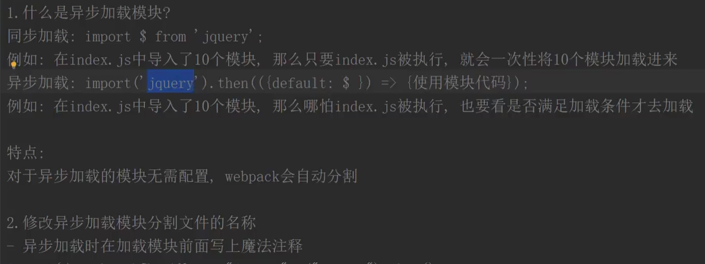
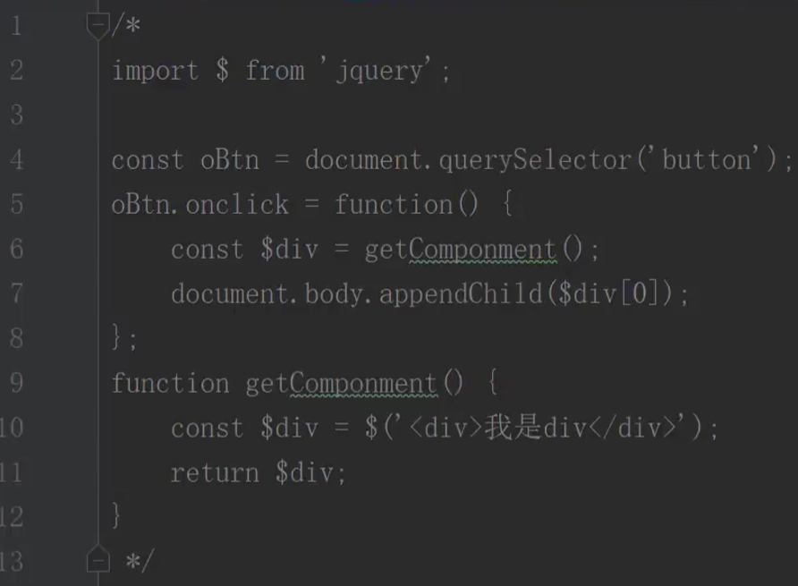

# [5 fileloader打包图片](https://www.bilibili.com/video/BV1Zv4y1p7f3?p=5&spm_id_from=pageDriver&vd_source=a7089a0e007e4167b4a61ef53acc6f7e)

# [44 异步加载模块](https://www.bilibili.com/video/BV1Zv4y1p7f3?p=44&vd_source=a7089a0e007e4167b4a61ef53acc6f7e)

| 同步加载： | 异步加载： |
| ------------------------------------------------------------ | ------------------------------------------------------------ |
|                                                              | 异步加载的另一种写法： |

# [81 发布订阅模式上](https://www.bilibili.com/video/BV1Zv4y1p7f3/?p=81&spm_id_from=333.880.my_history.page.click&vd_source=a7089a0e007e4167b4a61ef53acc6f7e)

# 82 发布订阅模式中

# 83 发布订阅模式下

