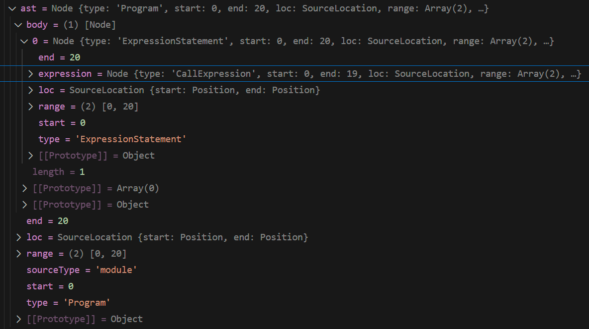

https://github.com/amandakelake/blog/issues/92

# [0. 源码分析](https://www.bilibili.com/video/BV12L411t7Pr/?spm_id_from=333.337.search-card.all.click&vd_source=a7089a0e007e4167b4a61ef53acc6f7e)

如果想让webpack打包，其实就是使用webpack函数来接收config，然后调用compiler run方法即可

1. 引入原生的webpack和配置信息
2. 调用webpack方法，传入配置信息获取compiler实例
3. 调用compiler身上的run方法，让webpack工作

# [1. 源码解析](https://www.bilibili.com/video/BV1AY4y1X7th/?spm_id_from=333.337.search-card.all.click&vd_source=a7089a0e007e4167b4a61ef53acc6f7e)

整体流程：


# [2. 源码解析](https://www.bilibili.com/video/BV1P84y137Xq/?p=2&spm_id_from=pageDriver)


```.json
// package.json文件中的bin字段: 用于指定模块的可执行文件
{
  "bin": {
    "webpack": "bin/webpack.js"
  }
}
```

# commander库

在 Webpack 中，`commander` 库主要用于**命令行接口（CLI）的解析**。`commander` 是一个非常流行的 Node.js 库，它帮助开发者轻松创建并管理命令行工具。通过 `commander`，你可以定义命令行工具中的各种选项、参数，并解析用户在命令行中传递的输入。

### 具体来说，`commander` 在 Webpack 中的作用是：

1. **解析命令行参数**：
   Webpack 提供了一个 CLI 工具，用于启动构建、指定配置文件、设置构建模式等。例如，当你运行以下命令时：
   
   ```bash
   webpack --config webpack.config.js --mode production
   ```

   这些命令行参数（如 `--config` 和 `--mode`）会通过 `commander` 解析，并传递给 Webpack 进行后续处理。

2. **定义和处理命令和选项**：
   Webpack 通过 `commander` 定义了各种命令和选项，使得用户可以通过 CLI 传递各种参数。例如 `--config`、`--mode`、`--watch` 等都可以通过 `commander` 来定义和处理。

3. **提供帮助和文档**：
   当你运行 `webpack --help` 时，Webpack 使用 `commander` 生成帮助文档，列出所有可用的命令和选项，并解释它们的作用。

### 简单的 `commander` 使用示例

假设你要通过 `commander` 构建一个简单的 CLI 工具：

```javascript
const { program } = require('commander');

program
  .version('1.0.0') // 定义版本号
  .option('-c, --config <path>', 'specify the config file') // 定义选项
  .option('-m, --mode <type>', 'define mode (development or production)', 'development') // 设置默认值
  .parse(process.argv); // 解析命令行参数

console.log('Config:', program.config); // 输出配置文件路径
console.log('Mode:', program.mode);     // 输出模式
```

- `--config` 允许用户通过命令行指定配置文件路径，例如 `--config ./webpack.config.js`。
- `--mode` 允许用户指定模式（默认是 `development`），例如 `--mode production`。

### Webpack 中 `commander` 的典型用法

Webpack 使用类似的方式，通过 `commander` 定义其 CLI 工具的参数和选项。用户可以通过命令行传递参数，然后 Webpack 使用 `commander` 来解析并获取这些参数，决定如何构建项目。

### 总结

`commander` 是一个强大的命令行解析工具，Webpack 通过它实现了 CLI 的命令解析和处理。它使 Webpack 的命令行工具更加灵活，便于用户通过命令行定制构建流程。

# 源码

## webpack-cli/bin/cli

```js
// webpack-cli/bin/cli
#!/usr/bin/env node

"use strict";

const importLocal = require("import-local");
const runCLI = require("../lib/bootstrap");

if (!process.env.WEBPACK_CLI_SKIP_IMPORT_LOCAL) {
  // Prefer the local installation of `webpack-cli`
  if (importLocal(__filename)) {
    return;
  }
}

process.title = "webpack";
runCLI(process.argv);
```

## webpack-cli/lib/bootstrap.js

```js
// webpack-cli/lib/bootstrap.js
"use strict";
Object.defineProperty(exports, "__esModule", { value: true });
const WebpackCLI = require("./webpack-cli");
const runCLI = async (args) => {
    const cli = new WebpackCLI();
    try {
        await cli.run(args);
    }
    catch (error) {
        cli.logger.error(error);
        process.exit(2);
    }
};
module.exports = runCLI;
```

## webpack-cli/lib/webpack-cli.js

```js
// webpack-cli/lib/webpack-cli.js
const { program, Option } = require("commander");

constructor() {
    // 可能是用来生成颜色配置，用于在命令行输出中为信息添加颜色
    this.colors = this.createColors();
    // 获取一个日志记录器实例，用于处理日志的输出
    this.logger = this.getLogger();
    // Initialize program
    this.program = program;
    this.program.name("webpack");
    this.program.configureOutput({
        writeErr: this.logger.error,
        outputError: (str, write) => write(`Error: ${this.capitalizeFirstLetter(str.replace(/^error:/, "").trim())}`),
    });
}
```

## loadCommandByName

```js
const loadCommandByName = async (commandName, allowToInstall = false) => {
    const isBuildCommandUsed = isCommand(commandName, buildCommandOptions);
    const isWatchCommandUsed = isCommand(commandName, watchCommandOptions);
    if (isBuildCommandUsed || isWatchCommandUsed) {
        await this.makeCommand(isBuildCommandUsed ? buildCommandOptions : watchCommandOptions, async () => {
            this.webpack = await this.loadWebpack();
            return this.getBuiltInOptions();
        }, async (entries, options) => {
            if (entries.length > 0) {
                options.entry = [...entries, ...(options.entry || [])];
            }
            await this.runWebpack(options, isWatchCommandUsed);
        });
    }
    // 省略了一些代码...
};
```

## loadWebpack

```js
async loadWebpack(handleError = true) {
	return this.tryRequireThenImport(WEBPACK_PACKAGE, handleError);
}
```

## runWebpack

```js
 async runWebpack(options, isWatchCommand) {
     let compiler;
     let createJsonStringifyStream;
     if (options.json) {
         const jsonExt = await this.tryRequireThenImport("@discoveryjs/json-ext");
         createJsonStringifyStream = jsonExt.stringifyStream;
     }
     const callback = (error, stats) => {
         if (error) {
             this.logger.error(error);
             process.exit(2);
         }
         if (stats && (stats.hasErrors() || (options.failOnWarnings && stats.hasWarnings()))) {
             process.exitCode = 1;
         }
         if (!compiler || !stats) {
             return;
         }
         const statsOptions = this.isMultipleCompiler(compiler)
         ? {
             children: compiler.compilers.map((compiler) => compiler.options ? compiler.options.stats : undefined),
         }
         : compiler.options
         ? compiler.options.stats
         : undefined;
         if (options.json && createJsonStringifyStream) {
             const handleWriteError = (error) => {
                 this.logger.error(error);
                 process.exit(2);
             };
             if (options.json === true) {
                 createJsonStringifyStream(stats.toJson(statsOptions))
                     .on("error", handleWriteError)
                     .pipe(process.stdout)
                     .on("error", handleWriteError)
                     .on("close", () => process.stdout.write("\n"));
             }
             else {
                 createJsonStringifyStream(stats.toJson(statsOptions))
                     .on("error", handleWriteError)
                     .pipe(fs.createWriteStream(options.json))
                     .on("error", handleWriteError)
                 // Use stderr to logging
                     .on("close", () => {
                     process.stderr.write(`[webpack-cli] ${this.colors.green(`stats are successfully stored as json to ${options.json}`)}\n`);
                 });
             }
         }
         else {
             const printedStats = stats.toString(statsOptions);
             // Avoid extra empty line when `stats: 'none'`
             if (printedStats) {
                 this.logger.raw(printedStats);
             }
         }
     };
     const env = isWatchCommand || options.watch
     ? Object.assign({ WEBPACK_WATCH: true }, options.env) : Object.assign({ WEBPACK_BUNDLE: true, WEBPACK_BUILD: true }, options.env);
     options.argv = Object.assign(Object.assign({}, options), { env });
     if (isWatchCommand) {
         options.watch = true;
         options.isWatchingLikeCommand = true;
     }
     compiler = await this.createCompiler(options, callback);
     if (!compiler) {
         return;
     }
     const isWatch = (compiler) => Boolean(this.isMultipleCompiler(compiler)        
                    ? compiler.compilers.some((compiler) => compiler.options.watch)
			        : compiler.options.watch);
     if (isWatch(compiler) && this.needWatchStdin(compiler)) {
         process.stdin.on("end", () => {
             process.exit(0);
         });
         process.stdin.resume();
     }
 }
```

## createCompiler

```js
 async createCompiler(options, callback) {
     if (typeof options.defineProcessEnvNodeEnv === "string") {
         process.env.NODE_ENV = options.defineProcessEnvNodeEnv;
     } else if (typeof options.nodeEnv === "string") {
         process.env.NODE_ENV = options.nodeEnv;
     }
     let config = await this.loadConfig(options);
     config = await this.buildConfig(config, options);
     let compiler;
     try {
         compiler = this.webpack(config.options, callback
             ? (error, stats) => {
                 if (error && this.isValidationError(error)) {
                     this.logger.error(error.message);
                     process.exit(2);
                 }
                 callback(error, stats);
             }
             : callback);
     }
     catch (error) {
         if (this.isValidationError(error)) {
             this.logger.error(error.message);
         } else {
             this.logger.error(error);
         }
         process.exit(2);
     }
     return compiler;
 }
```

## lazyFunction

```js
const lazyFunction = factory => {
	const fac = memoize(factory);
	const f = /** @type {any} */ (
		(...args) => {
			return fac()(...args);
		}
	);
	return /** @type {T} */ (f);
};
```

## webpack

实际createCompile的函数

```js
// webpack/lib/webpack.js
const webpack = (
    (options, callback) => {
        const create = () => {
            if (!asArray(options).every(webpackOptionsSchemaCheck)) {
                getValidateSchema()(webpackOptionsSchema, options);
                util.deprecate(
                    () => {},
                    "webpack bug: Pre-compiled schema reports error while real schema is happy. This has performance drawbacks.",
                    "DEP_WEBPACK_PRE_COMPILED_SCHEMA_INVALID"
                )();
            }
            let compiler;
            let watch = false;
            let watchOptions;
            if (Array.isArray(options)) {
                compiler = createMultiCompiler(
                    options,
                    (options)
                );
                watch = options.some(options => options.watch);
                watchOptions = options.map(options => options.watchOptions || {});
            } else {
                const webpackOptions = (options);
                compiler = createCompiler(webpackOptions); // 关键代码
                watch = webpackOptions.watch;
                watchOptions = webpackOptions.watchOptions || {};
            }
            return { compiler, watch, watchOptions };
        };
        if (callback) {
            try {
                const { compiler, watch, watchOptions } = create();
                if (watch) {
                    compiler.watch(watchOptions, callback);
                } else {
                    compiler.run((err, stats) => {
                        compiler.close(err2 => {
                            callback(err || err2, stats);
                        });
                    });
                }
                return compiler;
            } catch (err) {
                process.nextTick(() => callback(err));
                return null;
            }
        } else {
            const { compiler, watch } = create();
            if (watch) {
                util.deprecate(
                    () => {},
                    "A 'callback' argument needs to be provided to the 'webpack(options, callback)' function when the 'watch' option is set. There is no way to handle the 'watch' option without a callback.",
                    "DEP_WEBPACK_WATCH_WITHOUT_CALLBACK"
                )();
            }
            return compiler;
        }
    }
);
```

## createCompiler

```js
// createCompiler内部执行了new Compiler，后续还有很多代码，这些后续的代码其实就是在挂载插件
// 在webpack打包过程中，插件是在compiler声明了之后进行的挂载（并不代表执行）
const createCompiler = rawOptions => {
    // 对我们的配置文件进行标准化的一个处理
	const options = getNormalizedWebpackOptions(rawOptions);
	applyWebpackOptionsBaseDefaults(options);
	const compiler = new Compiler(options.context, options);
	// 给compiler加了文件系统的功能API
    new NodeEnvironmentPlugin({
		infrastructureLogging: options.infrastructureLogging
	}).apply(compiler);
    // 会把用户配置的一些插件进行注册
	if (Array.isArray(options.plugins)) {
		for (const plugin of options.plugins) {
			if (typeof plugin === "function") {
				plugin.call(compiler, compiler);
			} else if (plugin) {
				plugin.apply(compiler);
			}
		}
	}
    // 对我们配置的一些配置项给一个默认值
	applyWebpackOptionsDefaults(options);
	compiler.hooks.environment.call();
	compiler.hooks.afterEnvironment.call();
    // 根据配置项给webpack挂载上相应的插件！！！
	new WebpackOptionsApply().process(options, compiler);
	compiler.hooks.initialize.call();
	return compiler;
};
```

## Compiler

```js
// webpack/lib/Compiler.js
// ...
class Compiler {
    /**
	 * @param {string} context the compilation path
	 * @param {WebpackOptions} options options
     */
    constructor(context, options =  ({})) {
        this.hooks = Object.freeze({
            initialize: new SyncHook([]),
            shouldEmit: new SyncBailHook(["compilation"]),
            done: new AsyncSeriesHook(["stats"]),
            afterDone: new SyncHook(["stats"]),
            additionalPass: new AsyncSeriesHook([]),	
            beforeRun: new AsyncSeriesHook(["compiler"]),
            run: new AsyncSeriesHook(["compiler"]),
            emit: new AsyncSeriesHook(["compilation"]),
            assetEmitted: new AsyncSeriesHook(["file", "info"]),
            afterEmit: new AsyncSeriesHook(["compilation"]),			
            thisCompilation: new SyncHook(["compilation", "params"]),			
            compilation: new SyncHook(["compilation", "params"]),		
            normalModuleFactory: new SyncHook(["normalModuleFactory"]),		
            contextModuleFactory: new SyncHook(["contextModuleFactory"]),
            beforeCompile: new AsyncSeriesHook(["params"]),
            compile: new SyncHook(["params"]),			
            make: new AsyncParallelHook(["compilation"]),		
            finishMake: new AsyncSeriesHook(["compilation"]),		
            afterCompile: new AsyncSeriesHook(["compilation"]),	
            readRecords: new AsyncSeriesHook([]),	
            emitRecords: new AsyncSeriesHook([]),
            watchRun: new AsyncSeriesHook(["compiler"]),
            failed: new SyncHook(["error"]),
            invalid: new SyncHook(["filename", "changeTime"]),
            watchClose: new SyncHook([]),
            shutdown: new AsyncSeriesHook([]),
            infrastructureLog: new SyncBailHook(["origin", "type", "args"]),
            // TODO the following hooks are weirdly located here
            // TODO move them for webpack 5
            environment: new SyncHook([]),
            afterEnvironment: new SyncHook([]),
            afterPlugins: new SyncHook(["compiler"]),
            afterResolvers: new SyncHook(["compiler"]),
            entryOption: new SyncBailHook(["context", "entry"])
        });

        this.webpack = webpack;
    }
}
```

## compile.run

```js
/**
* webpack/lib/Compiler.js
* 该方法是Webpack compiler的核心运行逻辑，负责从开始到结束的整个编译打包流程
* @param {Callback<Stats>} callback signals when the call finishes
* @returns {void}
*/
run(callback) {
    if (this.running) {
        // 检查Webpack当前是否在进行编译
        // 如果已经有编译在进行中，它会抛出一个并发编译错误，以防止多个编译过程同时进行
        return callback(new ConcurrentCompilationError());
    }
    let logger;
    // finalCallback是在整个编译过程结束后执行的函数
    const finalCallback = (err, stats) => {
        // 通过logger.time和logger.timeEnd来记录编译状态切换的时间？？？
        if (logger) logger.time("beginIdle");
        this.idle = true;
        this.cache.beginIdle();
        this.idle = true;
        if (logger) logger.timeEnd("beginIdle");
        this.running = false; // 表示编译已经完成，允许下次编译运行
        if (err) {
            // 如果有错误发生，会触发hooks.failed
            this.hooks.failed.call(err);
        }
        if (callback !== undefined) callback(err, stats);
        this.hooks.afterDone.call(stats);
    };
    const startTime = Date.now();
    this.running = true;
    // onCompiled是编译完成后被调用的回调函数
    const onCompiled = (err, compilation) => {
        if (err) return finalCallback(err);
        if (this.hooks.shouldEmit.call(compilation) === false) {
            compilation.startTime = startTime;
            compilation.endTime = Date.now();
            const stats = new Stats(compilation);
            this.hooks.done.callAsync(stats, err => {
                if (err) return finalCallback(err);
                return finalCallback(null, stats);
            });
            return;
        }
        process.nextTick(() => {
            logger = compilation.getLogger("webpack.Compiler");
            logger.time("emitAssets");
            // emitAssets：负责将生成的文件资源输出到目标目录
            this.emitAssets(compilation, err => {
                logger.timeEnd("emitAssets");
                if (err) return finalCallback(err);
                // needAdditionalPass：检查是否需要再次编译。例如，有些插件或加载器可能要求再运行一次编译
                if (compilation.hooks.needAdditionalPass.call()) {
                    compilation.needAdditionalPass = true;
                    compilation.startTime = startTime;
                    compilation.endTime = Date.now();
                    logger.time("done hook");
                    const stats = new Stats(compilation);
                    this.hooks.done.callAsync(stats, err => {
                        logger.timeEnd("done hook");
                        if (err) return finalCallback(err);
                        this.hooks.additionalPass.callAsync(err => {
                            if (err) return finalCallback(err);
                            this.compile(onCompiled);
                        });
                    });
                    return;
                }

                logger.time("emitRecords");
                // emitRecords：保存编译记录，比如存储一些文件系统信息
                this.emitRecords(err => {
                    logger.timeEnd("emitRecords");
                    if (err) return finalCallback(err);
                    compilation.startTime = startTime;
                    compilation.endTime = Date.now();
                    logger.time("done hook");
                    const stats = new Stats(compilation);
                    this.hooks.done.callAsync(stats, err => {
                        logger.timeEnd("done hook");
                        if (err) return finalCallback(err);
                        this.cache.storeBuildDependencies(
                            compilation.buildDependencies,
                            err => {
                                if (err) return finalCallback(err);
                                return finalCallback(null, stats);
                            }
                        );
                    });
                });
            });
        });
    };
    const run = () => {
        // beforeRun和run是编译开始前的两个钩子，允许开发者在编译前执行自定义逻辑
        this.hooks.beforeRun.callAsync(this, err => {
            if (err) return finalCallback(err);
            this.hooks.run.callAsync(this, err => {
                if (err) return finalCallback(err);
                // readRecords：读取之前的编译记录，确保增量构建时Webpack能有效利用缓存
                this.readRecords(err => {
                    if (err) return finalCallback(err);
                    // compile：编译的核心逻辑，执行具体的编译任务
                    // onCompiled：编译完成后被调用的回调函数
                    this.compile(onCompiled);
                });
            });
        });
    };
    if (this.idle) {
        this.cache.endIdle(err => {
            if (err) return finalCallback(err);
            this.idle = false;
            run();
        });
    } else {
        run();
    }
}
```

## new WebpackOptionsApply().process(options, compiler);

```js
// 代码超级多，差不多七百多行
// 很多这样类似的代码：
new EntryOptionPlugin().apply(compiler);
compiler.hooks.entryOption.call(options.context, options.entry);
```

通过源码的阅读我们可以发现，webpack内部在挂载插件的时候其实就是将所有的配置属性都转为插件进行处理。

例如我们在配置当中写：`entry: './src/index.js'`。 它内部其实是转为了`new EntryOptionsPlugin.apply()`

思想：webpack里面有一个很强大的插件管理的一种方式，所有的东西在它的内部都是以插件的方式在进行体现

## apply

```js
class EntryOptionPlugin {
	/**
	 * @param {Compiler} compiler the compiler instance one is tapping into
	 * @returns {void}
	 */
	apply(compiler) {
		compiler.hooks.entryOption.tap("EntryOptionPlugin", (context, entry) => {
			EntryOptionPlugin.applyEntryOption(compiler, context, entry);
			return true;
		});
	}
    // ...省略了其他方法
}
```

- 在Webpack中，每个插件必须实现一个apply方法，它接收compiler对象作为参数。apply方法是插件挂载到Webpack核心编译器的入口点
- compiler是Webpack的核心对象，代表整个编译器，它包含了Webpack的完整生命周期和各种钩子（hooks）

## compile

```js
compile(callback) {
    const params = this.newCompilationParams();
    // 1.beforeCompile: 在编译开始前异步触发，允许插件执行一些异步任务，比如准备工作
    this.hooks.beforeCompile.callAsync(params, err => {
        if (err) return callback(err);
        // 2.compile: 在编译阶段启动时同步触发，用于通知插件编译即将开始
        this.hooks.compile.call(params);
        // 在beforeCompile里面声明了一个compilation
        const compilation = this.newCompilation(params);
        const logger = compilation.getLogger("webpack.Compiler");
        logger.time("make hook");
        // 3.make: 在生成模块的过程中异步并行触发，允许插件在这个阶段并行地处理一些异步任务
        this.hooks.make.callAsync(compilation, err => {
            logger.timeEnd("make hook");
            if (err) return callback(err);
            logger.time("finish make hook");
            // 4.finishMake: 在make阶段完成后触发，允许执行后续的操作
            this.hooks.finishMake.callAsync(compilation, err => {
                logger.timeEnd("finish make hook");
                if (err) return callback(err);
                process.nextTick(() => {
                    logger.time("finish compilation");
                    compilation.finish(err => {
                        logger.timeEnd("finish compilation");
                        if (err) return callback(err);
                        logger.time("seal compilation");
                        compilation.seal(err => {
                            logger.timeEnd("seal compilation");
                            if (err) return callback(err);
                            logger.time("afterCompile hook");
                            // 5.afterCompile: 在整个编译过程结束后触发
                            this.hooks.afterCompile.callAsync(compilation, err => {
                                logger.timeEnd("afterCompile hook");
                                if (err) return callback(err);
                                return callback(null, compilation);
                            });
                        });
                    });
                });
            });
        });
    });
}
```

## addEntry

```js
// webpack/lib/Compilation.js
addEntry(context, entry, optionsOrName, callback) {
    const options =
          typeof optionsOrName === "object"
    ? optionsOrName
    : { name: optionsOrName };
    this._addEntryItem(context, entry, "dependencies", options, callback);
}
```

## _addEntryItem

```js
_addEntryItem(context, entry, target, options, callback) {
    const { name } = options;
    let entryData = name !== undefined ? this.entries.get(name) : this.globalEntry;
    if (entryData === undefined) {
        entryData = {
            dependencies: [],
            includeDependencies: [],
            options: {
                name: undefined,
                ...options
            }
        };
        entryData[target].push(entry);
        this.entries.set(name, entryData);
    } else {
        // 删除部分代码...
    }

    this.hooks.addEntry.call(entry, options);
    // addModuleTree是递归构建模块依赖树的核心操作，它会基于当前入口和依赖项，查找模块，解析依赖关系并构建模块树
    this.addModuleTree(
        {
            context,
            dependency: entry,
            contextInfo: entryData.options.layer
            ? { issuerLayer: entryData.options.layer }
            : undefined
        },
        (err, module) => {
            if (err) {
                this.hooks.failedEntry.call(entry, options, err);
                return callback(err);
            }
            this.hooks.succeedEntry.call(entry, options, module);
            return callback(null, module);
        }
    );
}
```

## addModuleTree

```
```

## handleModuleCreation

```
```

## factorizeModule

```
```

## addModule

```
```

## _addModule

## _handleModuleBuildAndDependencies

## buildModule

```js
buildModule(module, callback) {
    this.buildQueue.add(module, callback);
}
```

## _buildModule

```
```

## build

## _doBuild

## runLoaders


```js
exports.runLoaders = function runLoaders(options, callback) {
	// read options
	var resource = options.resource || ""; // 原文件
	var loaders = options.loaders || []; // 配置的loaders
	var loaderContext = options.context || {}; // loader的上下文
	var processResource = options.processResource || ((readResource, context, resource, callback) => {
		context.addDependency(resource);
		readResource(resource, callback);
	}).bind(null, options.readResource || readFile);

	//
	var splittedResource = resource && parsePathQueryFragment(resource);
	var resourcePath = splittedResource ? splittedResource.path : undefined;
	var resourceQuery = splittedResource ? splittedResource.query : undefined;
	var resourceFragment = splittedResource ? splittedResource.fragment : undefined;
	var contextDirectory = resourcePath ? dirname(resourcePath) : null;

	// execution state
	var requestCacheable = true;
	var fileDependencies = [];
	var contextDependencies = [];
	var missingDependencies = [];

	// prepare loader objects
	loaders = loaders.map(createLoaderObject);

	loaderContext.context = contextDirectory;
	loaderContext.loaderIndex = 0;
	loaderContext.loaders = loaders;
	loaderContext.resourcePath = resourcePath; // 当前处理文件的完整路径
	loaderContext.resourceQuery = resourceQuery;
	loaderContext.resourceFragment = resourceFragment;
	loaderContext.async = null; // 告知webpack当前loader是异步的，返回一个可以被调用的callback
	loaderContext.callback = null; // 用于异步Loader向Webpack返回处理结果
	loaderContext.cacheable = function cacheable(flag) {
		if (flag === false) {
			requestCacheable = false;
		}
	};
	loaderContext.dependency = loaderContext.addDependency = function addDependency(file) {
		fileDependencies.push(file);
	};
	loaderContext.addContextDependency = function addContextDependency(context) {
		contextDependencies.push(context);
	};
	loaderContext.addMissingDependency = function addMissingDependency(context) {
		missingDependencies.push(context);
	};
	loaderContext.getDependencies = function getDependencies() {
		return fileDependencies.slice();
	};
	loaderContext.getContextDependencies = function getContextDependencies() {
		return contextDependencies.slice();
	};
	loaderContext.getMissingDependencies = function getMissingDependencies() {
		return missingDependencies.slice();
	};
	loaderContext.clearDependencies = function clearDependencies() {
		fileDependencies.length = 0;
		contextDependencies.length = 0;
		missingDependencies.length = 0;
		requestCacheable = true;
	};
	Object.defineProperty(loaderContext, "resource", {
		enumerable: true,
		get: function () {
			if (loaderContext.resourcePath === undefined)
				return undefined;
			return loaderContext.resourcePath.replace(/#/g, "\0#") + loaderContext.resourceQuery.replace(/#/g, "\0#") + loaderContext.resourceFragment;
		},
		set: function (value) {
			var splittedResource = value && parsePathQueryFragment(value);
			loaderContext.resourcePath = splittedResource ? splittedResource.path : undefined;
			loaderContext.resourceQuery = splittedResource ? splittedResource.query : undefined;
			loaderContext.resourceFragment = splittedResource ? splittedResource.fragment : undefined;
		}
	});
	Object.defineProperty(loaderContext, "request", {
		enumerable: true,
		get: function () {
			return loaderContext.loaders.map(function (o) {
				return o.request;
			}).concat(loaderContext.resource || "").join("!");
		}
	});
	Object.defineProperty(loaderContext, "remainingRequest", {
		enumerable: true,
		get: function () {
			if (loaderContext.loaderIndex >= loaderContext.loaders.length - 1 && !loaderContext.resource)
				return "";
			return loaderContext.loaders.slice(loaderContext.loaderIndex + 1).map(function (o) {
				return o.request;
			}).concat(loaderContext.resource || "").join("!");
		}
	});
	Object.defineProperty(loaderContext, "currentRequest", {
		enumerable: true,
		get: function () {
			return loaderContext.loaders.slice(loaderContext.loaderIndex).map(function (o) {
				return o.request;
			}).concat(loaderContext.resource || "").join("!");
		}
	});
	Object.defineProperty(loaderContext, "previousRequest", {
		enumerable: true,
		get: function () {
			return loaderContext.loaders.slice(0, loaderContext.loaderIndex).map(function (o) {
				return o.request;
			}).join("!");
		}
	});
	Object.defineProperty(loaderContext, "query", {
		enumerable: true,
		get: function () {
			var entry = loaderContext.loaders[loaderContext.loaderIndex];
			return entry.options && typeof entry.options === "object" ? entry.options : entry.query;
		}
	});
	Object.defineProperty(loaderContext, "data", {
		enumerable: true,
		get: function () {
			return loaderContext.loaders[loaderContext.loaderIndex].data;
		}
	});

	// finish loader context
	if (Object.preventExtensions) {
		Object.preventExtensions(loaderContext);
	}

	var processOptions = {
		resourceBuffer: null,
		processResource: processResource
	};
	iteratePitchingLoaders(processOptions, loaderContext, function (err, result) {
		if (err) {
			return callback(err, {
				cacheable: requestCacheable,
				fileDependencies: fileDependencies,
				contextDependencies: contextDependencies,
				missingDependencies: missingDependencies
			});
		}
		callback(null, {
			result: result,
			resourceBuffer: processOptions.resourceBuffer,
			cacheable: requestCacheable,
			fileDependencies: fileDependencies,
			contextDependencies: contextDependencies,
			missingDependencies: missingDependencies
		});
	});
};
```

# compiler && compilation

compiler是Webpack的核心对象，代表整个编译器，它包含了Webpack的完整生命周期和各种钩子（hooks）

在 Webpack 源码中，`compiler` 和 `compilation` 是两个非常重要的概念，它们在 Webpack 的整个编译过程中扮演着不同的角色。可以简单理解为 `compiler` 负责控制整个编译流程，而 `compilation` 则是具体的执行编译的实例。接下来我们详细分析它们的区别。

### 1. **`compiler`（编译器）**
   - **职责**: `compiler` 是 Webpack 编译过程的全局管理者，它包含了 Webpack 编译的所有配置、钩子、插件等。整个编译生命周期由 `compiler` 控制。
   - **作用**: `compiler` 会管理从开始到结束的整个编译过程。它启动编译过程，并协调多个 `compilation`，每个 `compilation` 对象则负责处理具体的一次编译任务。`compiler` 在开发模式中也会重复调用 `compilation` 进行多次增量编译。
   - **主要功能**:
     - 管理 Webpack 的整体编译过程。
     - 提供用于插件挂载的钩子（如 `run`、`watchRun`、`done`）。
     - 创建和管理 `compilation` 实例，并将它们与模块解析、代码生成和输出的具体任务相关联。
     - 启动、配置和运行编译过程，处理资源文件的读取、编译和打包。

   **生命周期管理**: `compiler` 控制 Webpack 的整体生命周期，包括：
   - 初始化
   - 开始编译 (`run`)
   - 启动增量编译 (`watchRun`)
   - 完成编译 (`done`)
   - 输出文件等

   **例子**: 
   ```javascript
   const webpack = require('webpack');
   const compiler = webpack(config);
   ```

### 2. **`compilation`（编译实例）**
   - **职责**: `compilation` 是 Webpack 中用于处理具体一次编译过程的实例。每次执行编译时，都会创建一个新的 `compilation` 实例，它代表了一次从开始到结束的编译过程。
   - **作用**: `compilation` 负责具体的构建逻辑，包括：
     - 解析模块依赖。
     - 构建模块（如 `js`, `css`）。
     - 执行优化（如代码分割、模块合并）。
     - 生成最终的打包结果（如 `bundle.js`）。
   - **主要功能**:
     - 解析模块依赖树。
     - 编译每个模块，生成优化后的代码。
     - 应用代码优化技术（如 Tree Shaking、代码压缩）。
     - 管理模块的编译和输出。
     - 每个 `compilation` 实例只在一次构建过程的生命周期中存在，结束后它会被销毁。

   **生命周期管理**: `compilation` 负责处理每次构建的生命周期，包括：
   - 解析模块和依赖关系。
   - 执行构建优化（如代码分割、模块打包）。
   - 输出生成的资源文件。
   - 处理缓存、增量编译等细节。

   **例子**:
   ```javascript
   compiler.hooks.compilation.tap('MyPlugin', (compilation) => {
       // 在这里可以操作当前这次编译的过程
   });
   ```

### 主要区别：

| 特性           | `compiler`                                        | `compilation`                                    |
| -------------- | ------------------------------------------------- | ------------------------------------------------ |
| **作用**       | 管理整个编译生命周期和配置                        | 处理每次具体的构建过程                           |
| **实例化时机** | Webpack 启动时创建，并在整个过程中保持不变        | 每次构建开始时创建，每次构建完成后销毁           |
| **功能**       | 管理插件、启动编译、控制流程                      | 处理模块依赖、执行代码优化、生成输出             |
| **钩子**       | 包含与整体编译流程相关的钩子，如 `run`、`done` 等 | 包含与具体一次编译相关的钩子，如 `buildModule`   |
| **关系**       | `compiler` 创建和管理多个 `compilation` 实例      | `compilation` 是 `compiler` 每次执行编译时创建的 |
| **适用场景**   | 全局编译流程控制，如开发模式下的多次编译管理      | 单次编译任务中的资源处理、模块依赖解析           |

### 举个例子：
在开发模式下，每次保存文件，Webpack 会重新进行增量编译。这时 `compiler` 仍然是同一个实例，但 `compilation` 每次都会重新创建一个新的实例，以处理这次编译过程的所有模块和文件。

### 总结：
- `compiler` 是全局的，负责管理整个 Webpack 编译的生命周期。
- `compilation` 是局部的，负责具体某次编译的执行、模块解析、依赖构建和打包。

它们的关系可以类比为：`compiler` 是一个工厂，而 `compilation` 是工厂里的一条生产线，每次生产线启动都会创建一个新的 `compilation` 实例来完成产品的制造（模块打包）。

# watch模式

Webpack 中的 **`watch` 模式** 是一种开发工具，它会监视文件的变化并自动重新构建项目。这种模式下，Webpack 会在初次构建后继续保持运行，并且当源文件发生变动时，它会检测到这些变化并重新编译项目。相比于手动触发构建，`watch` 模式能够加速开发流程，因为开发者只需要保存文件，Webpack 就会自动执行构建流程，省去了频繁手动运行构建命令的步骤。

### `watch` 模式的工作原理
- **监视文件变化**：Webpack 会监视项目中的所有依赖文件。一旦文件内容发生变化，Webpack 会重新运行构建任务，并生成新的输出文件。
- **增量构建**：`watch` 模式会尽可能优化构建速度。它会在每次重新构建时只编译发生变化的模块，避免重新编译整个项目。
  
### 如何启用 `watch` 模式？
1. **通过 CLI 启用**：
   你可以通过在命令行运行 `webpack --watch` 来启用 `watch` 模式：
   ```bash
   webpack --watch
   ```

2. **通过 Webpack 配置启用**：
   你也可以在 `webpack.config.js` 中配置 `watch` 选项：
   ```js
   module.exports = {
     // ... 其他配置
     watch: true,
   };
   ```

### 配置选项
`watch` 模式可以通过一些额外的选项进行自定义：
- **`watchOptions.aggregateTimeout`**：在文件变化后，延迟多少毫秒重新编译，默认值是 `300` 毫秒，目的是防止在短时间内频繁修改文件时过多的构建。
  ```js
  watchOptions: {
    aggregateTimeout: 300,  // 等待300ms重新构建
  }
  ```
- **`watchOptions.poll`**：设置文件监听的方式为轮询，默认关闭。可以通过设置毫秒数来启用，如 `1000` 代表每秒检查一次文件变化。适用于某些文件系统不支持监听机制的环境。
  ```js
  watchOptions: {
    poll: 1000,  // 每秒检查一次文件变化
  }
  ```
- **`watchOptions.ignored`**：指定忽略监视的文件/目录，常用于跳过一些不必要的文件监控。
  
  ```js
  watchOptions: {
    ignored: /node_modules/,  // 忽略 node_modules 目录
  }
  ```

### `watch` 模式适用场景
`watch` 模式适合在本地开发环境中使用，尤其是前端开发过程中，需要频繁修改代码并查看效果时。它可以与其他开发工具（如 `webpack-dev-server` 或 `Hot Module Replacement`）结合使用，实现更高效的开发体验。

# [3. AsyncQueue](https://www.bilibili.com/video/BV1Fm4y1k7Vw/?spm_id_from=pageDriver&vd_source=a7089a0e007e4167b4a61ef53acc6f7e)

AsyncQueue本质上就是Webpack实现的一款任务调度器

合理的利用任务调度器会为我们的代码带来更加完整的处理逻辑以及性能上的提升


# [6. tapable](https://www.bilibili.com/video/BV1f84y137Nf/?spm_id_from=pageDriver&vd_source=a7089a0e007e4167b4a61ef53acc6f7e)

> tapable其实就是实现了一种发布订阅模式

在 Webpack 中，`tapable` 是一个用于实现插件架构的库。Webpack 本身是一个高度插件化的工具，几乎所有功能都是通过插件系统来实现的，而 `tapable` 就是这个系统的核心。它提供了一系列的钩子（hook）机制，允许开发者通过插件在 Webpack 构建过程中的不同阶段插入自定义逻辑。

`tapable` 提供了多种不同类型的钩子，用于不同场景下的扩展：

1. **同步钩子**（Sync Hooks）
   - 这些钩子在事件触发时，依次执行所有注册的插件。
   - 例如：`SyncHook`，`SyncBailHook`，`SyncWaterfallHook`。

2. **异步钩子**（Async Hooks）
   - 支持异步逻辑，可以使用回调、Promise 或 `async/await` 形式。
   - 例如：`AsyncParallelHook`，`AsyncSeriesHook`，`AsyncSeriesWaterfallHook`。

3. **串行和并行钩子**
   - 串行钩子：按顺序执行。
   - 并行钩子：可以并行执行多个异步任务。

通过这些钩子机制，Webpack 能在不同构建阶段（如模块解析、代码打包、输出文件等）调用插件，使其对构建过程进行定制化。

```javascript
const { SyncHook } = require('tapable');

class MyPlugin {
  apply(compiler) {
    compiler.hooks.someHook.tap('MyPlugin', () => {
      console.log('MyPlugin: someHook 被触发了');
    });
  }
}
```

在 Webpack 的 `compiler` 对象上，通常会有许多 `tapable` 提供的钩子。开发者可以通过这些钩子为 Webpack 的不同构建阶段注册回调函数。

`tapable` 使得 Webpack 的扩展性和灵活性非常强，这也是 Webpack 强大插件系统的基础。

# [17. 初始化](https://www.bilibili.com/video/BV13o4y1p7c3/?p=17&spm_id_from=pageDriver)


# [18. loader](https://www.bilibili.com/video/BV1fv4y1p7hq/?spm_id_from=pageDriver&vd_source=a7089a0e007e4167b4a61ef53acc6f7e)

> 为什么loader是从右到左执行？

# [19. loader源码](https://www.bilibili.com/video/BV19L411U71E/?spm_id_from=pageDriver&vd_source=a7089a0e007e4167b4a61ef53acc6f7e)

```js
// loader-runner/lib/LoaderRunner.js
exports.runLoaders = function runLoaders(options, callback) {
	// read options
	var resource = options.resource || ""; // 原文件
	var loaders = options.loaders || []; // 配置的loaders
	var loaderContext = options.context || {}; // loader的上下文
	var processResource = options.processResource || ((readResource, context, resource, callback) => {
		context.addDependency(resource);
		readResource(resource, callback);
	}).bind(null, options.readResource || readFile);

	//
	var splittedResource = resource && parsePathQueryFragment(resource);
	var resourcePath = splittedResource ? splittedResource.path : undefined;
	var resourceQuery = splittedResource ? splittedResource.query : undefined;
	var resourceFragment = splittedResource ? splittedResource.fragment : undefined;
	var contextDirectory = resourcePath ? dirname(resourcePath) : null;

	// execution state
	var requestCacheable = true;
	var fileDependencies = [];
	var contextDependencies = [];
	var missingDependencies = [];

	// prepare loader objects
	loaders = loaders.map(createLoaderObject);

	loaderContext.context = contextDirectory;
	loaderContext.loaderIndex = 0;
	loaderContext.loaders = loaders;
	loaderContext.resourcePath = resourcePath; // 当前处理文件的完整路径
	loaderContext.resourceQuery = resourceQuery;
	loaderContext.resourceFragment = resourceFragment;
	loaderContext.async = null; // 告知webpack当前loader是异步的，返回一个可以被调用的callback
	loaderContext.callback = null; // 用于异步Loader向Webpack返回处理结果
	loaderContext.cacheable = function cacheable(flag) {
		if (flag === false) {
			requestCacheable = false;
		}
	};
	loaderContext.dependency = loaderContext.addDependency = function addDependency(file) {
		fileDependencies.push(file);
	};
	loaderContext.addContextDependency = function addContextDependency(context) {
		contextDependencies.push(context);
	};
	loaderContext.addMissingDependency = function addMissingDependency(context) {
		missingDependencies.push(context);
	};
	loaderContext.getDependencies = function getDependencies() {
		return fileDependencies.slice();
	};
	loaderContext.getContextDependencies = function getContextDependencies() {
		return contextDependencies.slice();
	};
	loaderContext.getMissingDependencies = function getMissingDependencies() {
		return missingDependencies.slice();
	};
	loaderContext.clearDependencies = function clearDependencies() {
		fileDependencies.length = 0;
		contextDependencies.length = 0;
		missingDependencies.length = 0;
		requestCacheable = true;
	};
	Object.defineProperty(loaderContext, "resource", {
		enumerable: true,
		get: function () {
			if (loaderContext.resourcePath === undefined)
				return undefined;
			return loaderContext.resourcePath.replace(/#/g, "\0#") + loaderContext.resourceQuery.replace(/#/g, "\0#") + loaderContext.resourceFragment;
		},
		set: function (value) {
			var splittedResource = value && parsePathQueryFragment(value);
			loaderContext.resourcePath = splittedResource ? splittedResource.path : undefined;
			loaderContext.resourceQuery = splittedResource ? splittedResource.query : undefined;
			loaderContext.resourceFragment = splittedResource ? splittedResource.fragment : undefined;
		}
	});
	Object.defineProperty(loaderContext, "request", {
		enumerable: true,
		get: function () {
			return loaderContext.loaders.map(function (o) {
				return o.request;
			}).concat(loaderContext.resource || "").join("!");
		}
	});
	Object.defineProperty(loaderContext, "remainingRequest", {
		enumerable: true,
		get: function () {
			if (loaderContext.loaderIndex >= loaderContext.loaders.length - 1 && !loaderContext.resource)
				return "";
			return loaderContext.loaders.slice(loaderContext.loaderIndex + 1).map(function (o) {
				return o.request;
			}).concat(loaderContext.resource || "").join("!");
		}
	});
	Object.defineProperty(loaderContext, "currentRequest", {
		enumerable: true,
		get: function () {
			return loaderContext.loaders.slice(loaderContext.loaderIndex).map(function (o) {
				return o.request;
			}).concat(loaderContext.resource || "").join("!");
		}
	});
	Object.defineProperty(loaderContext, "previousRequest", {
		enumerable: true,
		get: function () {
			return loaderContext.loaders.slice(0, loaderContext.loaderIndex).map(function (o) {
				return o.request;
			}).join("!");
		}
	});
	Object.defineProperty(loaderContext, "query", {
		enumerable: true,
		get: function () {
			var entry = loaderContext.loaders[loaderContext.loaderIndex];
			return entry.options && typeof entry.options === "object" ? entry.options : entry.query;
		}
	});
	Object.defineProperty(loaderContext, "data", {
		enumerable: true,
		get: function () {
			return loaderContext.loaders[loaderContext.loaderIndex].data;
		}
	});

	// finish loader context
	if (Object.preventExtensions) {
		Object.preventExtensions(loaderContext);
	}

	var processOptions = {
		resourceBuffer: null,
		processResource: processResource
	};
	iteratePitchingLoaders(processOptions, loaderContext, function (err, result) {
		if (err) {
			return callback(err, {
				cacheable: requestCacheable,
				fileDependencies: fileDependencies,
				contextDependencies: contextDependencies,
				missingDependencies: missingDependencies
			});
		}
		callback(null, {
			result: result,
			resourceBuffer: processOptions.resourceBuffer,
			cacheable: requestCacheable,
			fileDependencies: fileDependencies,
			contextDependencies: contextDependencies,
			missingDependencies: missingDependencies
		});
	});
};
```

## iteratePitchingLoaders

```js
iteratePitchingLoaders(processOptions, loaderContext, function (err, result) {
    if (err) {
        // 省略部分代码
    }
    callback(null, {
        result: result,
        resourceBuffer: processOptions.resourceBuffer,
        cacheable: requestCacheable,
        fileDependencies: fileDependencies,
        contextDependencies: contextDependencies,
        missingDependencies: missingDependencies
    });
});
```


```js
function iteratePitchingLoaders(options, loaderContext, callback) {
	// abort after last loader
	if (loaderContext.loaderIndex >= loaderContext.loaders.length)
		return processResource(options, loaderContext, callback);
	var currentLoaderObject = loaderContext.loaders[loaderContext.loaderIndex];
	// iterate
	if (currentLoaderObject.pitchExecuted) {
		loaderContext.loaderIndex++;
		return iteratePitchingLoaders(options, loaderContext, callback);
	}
	// load loader module
	loadLoader(currentLoaderObject, function (err) {
		if (err) { // 省略部分代码 }
		var fn = currentLoaderObject.pitch;
		currentLoaderObject.pitchExecuted = true;
		if (!fn) return iteratePitchingLoaders(options, loaderContext, callback);
		runSyncOrAsync(
			fn,
			loaderContext, [loaderContext.remainingRequest, loaderContext.previousRequest, currentLoaderObject.data = {}],
			function (err) {
				if (err) return callback(err);
				var args = Array.prototype.slice.call(arguments, 1);
				// Determine whether to continue the pitching process based on
				// argument values (as opposed to argument presence) in order
				// to support synchronous and asynchronous usages.
				var hasArg = args.some(function (value) {
					return value !== undefined;
				});
				if (hasArg) {
					loaderContext.loaderIndex--;
					iterateNormalLoaders(options, loaderContext, args, callback);
				} else {
					iteratePitchingLoaders(options, loaderContext, callback);
				}
			}
		);
	});
}
```

## loadLoader

```js
module.exports = function loadLoader(loader, callback) {
	if(loader.type === "module") {
		// 删除部分代码
	} else {
		try {
			var module = require(loader.path);
		} catch(e) {
			// it is possible for node to choke on a require if the FD descriptor
			// limit has been reached. give it a chance to recover.
			if(e instanceof Error && e.code === "EMFILE") {
				var retry = loadLoader.bind(null, loader, callback);
				if(typeof setImmediate === "function") {
					// node >= 0.9.0
					return setImmediate(retry);
				} else {
					// node < 0.9.0
					return process.nextTick(retry);
				}
			}
			return callback(e);
		}
		return handleResult(loader, module, callback);
	}
};
```

# compiler.run

```js
/**
* webpack/lib/Compiler.js
* 该方法是Webpack compiler的核心运行逻辑，负责从开始到结束的整个编译打包流程
* @returns {void}
*/
run(callback) {
    if (this.running) {
        // 检查Webpack当前是否在进行编译
        // 如果已经有编译在进行中，它会抛出一个并发编译错误，以防止多个编译过程同时进行
        return callback(new ConcurrentCompilationError());
    }
    let logger;
    // finalCallback是在整个编译过程结束后执行的函数
    const finalCallback = (err, stats) => {
        this.idle = true;
        this.cache.beginIdle();
        this.idle = true;
        this.running = false; // 表示编译已经完成，允许下次编译运行
        if (callback !== undefined) callback(err, stats);
        this.hooks.afterDone.call(stats);
    };
    const startTime = Date.now();
    this.running = true;
    // onCompiled是编译完成后被调用的回调函数
    const onCompiled = (err, compilation) => {
        if (this.hooks.shouldEmit.call(compilation) === false) {
            compilation.startTime = startTime;
            compilation.endTime = Date.now();
            const stats = new Stats(compilation);
            this.hooks.done.callAsync(stats, err => {
                return finalCallback(null, stats);
            });
            return;
        }
        process.nextTick(() => {
            logger = compilation.getLogger("webpack.Compiler");
            // emitAssets：负责将生成的文件资源输出到目标目录
            this.emitAssets(compilation, err => {
                // needAdditionalPass：检查是否需要再次编译。例如，有些插件或加载器可能要求再运行一次编译
                if (compilation.hooks.needAdditionalPass.call()) {
                    compilation.needAdditionalPass = true;
                    compilation.startTime = startTime;
                    compilation.endTime = Date.now();
                    const stats = new Stats(compilation);
                    this.hooks.done.callAsync(stats, err => {
                        this.hooks.additionalPass.callAsync(err => {
                            this.compile(onCompiled);
                        });
                    });
                    return;
                }
                // emitRecords：保存编译记录，比如存储一些文件系统信息
                this.emitRecords(err => {
                    compilation.startTime = startTime;
                    compilation.endTime = Date.now();
                    const stats = new Stats(compilation);
                    this.hooks.done.callAsync(stats, err => {
                        this.cache.storeBuildDependencies(
                            compilation.buildDependencies,
                            err => {
                                return finalCallback(null, stats);
                            }
                        );
                    });
                });
            });
        });
    };
    const run = () => {
        // beforeRun和run是编译开始前的两个钩子，允许开发者在编译前执行自定义逻辑
        this.hooks.beforeRun.callAsync(this, err => {
            this.hooks.run.callAsync(this, err => {
                // readRecords：读取之前的编译记录，确保增量构建时Webpack能有效利用缓存
                this.readRecords(err => {
                    // compile：编译的核心逻辑，执行具体的编译任务
                    // onCompiled：编译完成后被调用的回调函数
                    this.compile(onCompiled); // 关键调用
                });
            });
        });
    };
    if (this.idle) {
        this.cache.endIdle(err => {
            this.idle = false;
            run();
        });
    } else {
        run();
    }
}
```

# [20. 编译](https://www.bilibili.com/video/BV11a4y1T7hM/?p=20&spm_id_from=pageDriver)


# [21. 编译](https://www.bilibili.com/video/BV1sT411W7LU/?spm_id_from=pageDriver&vd_source=a7089a0e007e4167b4a61ef53acc6f7e)

## compile

```js
compile(callback) {
    const params = this.newCompilationParams();
    // 1.beforeCompile: 在编译开始前异步触发，允许插件执行一些异步任务，比如准备工作
    this.hooks.beforeCompile.callAsync(params, err => {
        // 2.compile: 在编译阶段启动时同步触发，用于通知插件编译即将开始
        this.hooks.compile.call(params);
        // 在beforeCompile里面声明了一个compilation
        const compilation = this.newCompilation(params);
        const logger = compilation.getLogger("webpack.Compiler");
        // 3.make: 在生成模块的过程中异步并行触发，允许插件在这个阶段并行地处理一些异步任务
        //   callAsync是触发，与之对应的监听的方法是tapAsync
        this.hooks.make.callAsync(compilation, err => {
            // 4.finishMake: 在make阶段完成后触发，允许执行后续的操作
            this.hooks.finishMake.callAsync(compilation, err => {
                process.nextTick(() => {
                    logger.time("finish compilation");
                    compilation.finish(err => {
                        logger.timeEnd("finish compilation");
                        logger.time("seal compilation");
                        compilation.seal(err => {
                            logger.timeEnd("seal compilation");
                            logger.time("afterCompile hook");
                            // 5.afterCompile: 在整个编译过程结束后触发
                            this.hooks.afterCompile.callAsync(compilation, err => {
                                logger.timeEnd("afterCompile hook");
                                return callback(null, compilation);
                            });
                        });
                    });
                });
            });
        });
    });
}
```

## tapAsync

```js
// webpack/lib/EntryPlugin.js
apply(compiler) {
    // 删除部分代码...
    const { entry, options, context } = this;
    const dep = EntryPlugin.createDependency(entry, options);
    compiler.hooks.make.tapAsync("EntryPlugin", (compilation, callback) => {
        compilation.addEntry(context, dep, options, err => {
            callback(err);
        });
    });
}
```

## addEntry

```js
// webpack/lib/Compilation.js
addEntry(context, entry, optionsOrName, callback) {
    const options = typeof optionsOrName === "object"
    	? optionsOrName
    	: { name: optionsOrName };
    this._addEntryItem(context, entry, "dependencies", options, callback);
}
```

## _addEntryItem

```js
_addEntryItem(context, entry, target, options, callback) {
    const { name } = options; // main
    let entryData = name !== undefined ? this.entries.get(name) : this.globalEntry;
    if (entryData === undefined) {
        entryData = {
            dependencies: [],
            includeDependencies: [],
            options: {
                name: undefined,
                ...options
            }
        };
        entryData[target].push(entry); // target是dependencies
        this.entries.set(name, entryData);
    } else { // 删除部分代码...}

    this.hooks.addEntry.call(entry, options);
    // addModuleTree是递归构建模块依赖树的核心操作，它会基于当前入口和依赖项，查找模块，解析依赖关系并构建模块树
    this.addModuleTree({
            context,
            dependency: entry,
            contextInfo: entryData.options.layer
            ? { issuerLayer: entryData.options.layer }
            : undefined
    	}, (err, module) => {
            this.hooks.succeedEntry.call(entry, options, module);
            return callback(null, module);
        }
    );
}
```

## addModuleTree

```js
addModuleTree({ context, dependency, contextInfo }, callback) {
    const Dep = dependency.constructor;
    const moduleFactory = this.dependencyFactories.get(Dep);
    this.handleModuleCreation(
        {
            factory: moduleFactory,
            dependencies: [dependency],
            originModule: null,
            contextInfo,
            context
        },
        (err, result) => {
            if (!err && result) {
                callback(null, result);
            } else {
                callback();
            }
        }
    );
}
```

## handleModuleCreation！！！

```js
handleModuleCreation({factory, dependencies, originModule, contextInfo, context,
    recursive = true, connectOrigin = recursive
}, callback) {
    const moduleGraph = this.moduleGraph;
    const currentProfile = this.profile ? new ModuleProfile() : undefined;
    this.factorizeModule({currentProfile, factory, dependencies, factoryResult: true, originModule, contextInfo, context}, (err, factoryResult) => {
            const applyFactoryResultDependencies = () => {
                const { fileDependencies, contextDependencies, missingDependencies } 					= factoryResult;
                if (fileDependencies) {
                    this.fileDependencies.addAll(fileDependencies);
                }
                if (contextDependencies) {
                    this.contextDependencies.addAll(contextDependencies);
                }
                if (missingDependencies) {
                    this.missingDependencies.addAll(missingDependencies);
                }
            };
            const newModule = factoryResult.module;
            // 关键代码
            this.addModule(newModule, (err, module) => {
                // 删除部分代码xxx
                applyFactoryResultDependencies();
                for (let i = 0; i < dependencies.length; i++) {
                    const dependency = dependencies[i];
                    moduleGraph.setResolvedModule(
                        connectOrigin ? originModule : null,
                        dependency,
                        module
                    );
                }
                moduleGraph.setIssuerIfUnset(
                    module,
                    originModule !== undefined ? originModule : null
                );
                if (module !== newModule) {
                    if (currentProfile !== undefined) {
                        const otherProfile = moduleGraph.getProfile(module);
                        if (otherProfile !== undefined) {
                            currentProfile.mergeInto(otherProfile);
                        } else {
                            moduleGraph.setProfile(module, currentProfile);
                        }
                    }
                }

                this._handleModuleBuildAndDependencies(
                    originModule,
                    module,
                    recursive,
                    callback
                );
            });
        }
    );
}
```

## factorizeModule

```js
Compilation.prototype.factorizeModule = function (options, callback) {
		this.factorizeQueue.add(options, callback);
}

this.factorizeQueue = new AsyncQueue({
    name: "factorize",
    parent: this.addModuleQueue,
    processor: this._factorizeModule.bind(this)
});
```

## _factorizeModule


```js
_factorizeModule({
    currentProfile,
    factory, // 是一个模块的工厂
    dependencies,
    originModule,
    factoryResult,
    contextInfo,
    context
}, callback) {
    factory.create(
        {
            contextInfo: {
                issuer: originModule ? originModule.nameForCondition() : "",
                issuerLayer: originModule ? originModule.layer : null,
                compiler: this.compiler.name,
                ...contextInfo
            },
            resolveOptions: originModule ? originModule.resolveOptions : undefined,
            context: context
            ? context
            : originModule
            ? originModule.context
            : this.compiler.context,
            dependencies: dependencies
        },
        (err, result) => {
            if (result) {
                if (!factoryResult) {
                    // 删除部分代码
                }
            }
            callback(null, factoryResult ? result : result.module);
        }
    );
}
```

## create

```js
// webpack lib NormalModuleFactory.js
// 创建modle
create(data, callback) {
    const dependencies = data.dependencies;
    const context = data.context || this.context;
    const resolveOptions = data.resolveOptions || EMPTY_RESOLVE_OPTIONS;
    const dependency = dependencies[0];
    const request = dependency.request;
    const assertions = dependency.assertions;
    const contextInfo = data.contextInfo;
    const fileDependencies = new LazySet();
    const missingDependencies = new LazySet();
    const contextDependencies = new LazySet();
    const dependencyType =
          (dependencies.length > 0 && dependencies[0].category) || "";
    const resolveData = {
        contextInfo,
        resolveOptions,
        context,
        request,
        assertions,
        dependencies,
        dependencyType,
        fileDependencies,
        missingDependencies,
        contextDependencies,
        createData: {},
        cacheable: true
    };
    this.hooks.beforeResolve.callAsync(resolveData, (err, result) => {
        // 关键hooks：factorize
        this.hooks.factorize.callAsync(resolveData, (err, module) => {
            const factoryResult = {
                module,
                fileDependencies,
                missingDependencies,
                contextDependencies,
                cacheable: resolveData.cacheable
            };
            callback(null, factoryResult);
        });
    });
}
```

## tapAsync

```js
this.hooks.factorize.tapAsync(
    {
        name: "NormalModuleFactory",
        stage: 100
    },
    (resolveData, callback) => {
        // resolve：解析路径相关
        this.hooks.resolve.callAsync(resolveData, (err, result) => {
            if (result instanceof Module) return callback(null, result);
            
            this.hooks.afterResolve.callAsync(resolveData, (err, result) => {
                const createData = resolveData.createData;
                this.hooks.createModule.callAsync(
                    createData,
                    resolveData,
                    (err, createdModule) => {
                        if (!createdModule) {
                            createdModule = this.hooks.createModuleClass
                                .for(createData.settings.type)
                                .call(createData, resolveData);
                            if (!createdModule) {
                                // 创建module
                                createdModule = new NormalModule(createData);
                            }
                        }

                        createdModule = this.hooks.module.call(
                            createdModule,
                            createData,
                            resolveData
                        );
                        return callback(null, createdModule);
                    }
                );
            });
        });
    }
);
```

## addModule

```js
// 从handleModuleCreation处调用过来的
addModule(module, callback) {
    this.addModuleQueue.add(module, callback);
}

this.addModuleQueue = new AsyncQueue({
    name: "addModule",
    parent: this.processDependenciesQueue,
    getKey: module => module.identifier(),
    processor: this._addModule.bind(this)
});
```

## _addModule

```js
// webpack/lib/Compilation.js
_addModule(module, callback) {
    const identifier = module.identifier();
    // "E:\\TechDocument\\Webpack\\webpack code\\node_modules\\babel-loader\\lib\\index.js!E:\\TechDocument\\Webpack\\webpack code\\src\\index.js"
    const alreadyAddedModule = this._modules.get(identifier);
    if (alreadyAddedModule) {
        return callback(null, alreadyAddedModule);
    }

    const currentProfile = this.profile ? this.moduleGraph.getProfile(module): undefined;

    this._modulesCache.get(identifier, null, (err, cacheModule) => {
        if (cacheModule) {
            cacheModule.updateCacheModule(module);
            module = cacheModule;
        }
        this._modules.set(identifier, module);
        this.modules.add(module); // 关键代码
        if (this._backCompat)
            ModuleGraph.setModuleGraphForModule(module, this.moduleGraph);
        callback(null, module);
    });
}
```

## _handleModuleBuildAndDependencies

```js
// 从handleModuleCreation处调用过来的
_handleModuleBuildAndDependencies(originModule, module, recursive, callback) {
    let creatingModuleDuringBuildSet = undefined;
    // 删除部分代码
    this.buildModule(module, err => {
        if (creatingModuleDuringBuildSet !== undefined) {
            creatingModuleDuringBuildSet.delete(module);
        }

        if (!recursive) {
            this.processModuleDependenciesNonRecursive(module);
            callback(null, module);
            return;
        }

        // This avoids deadlocks for circular dependencies
        if (this.processDependenciesQueue.isProcessing(module)) {
            return callback(null, module);
        }
        // 关键代码
        this.processModuleDependencies(module, err => {
            callback(null, module);
        });
    });
}
```

## buildModule

```js
buildModule(module, callback) {
    this.buildQueue.add(module, callback);
}
```

## _buildModule

```js
// webpack/lib/NormalModule.js
_buildModule(module, callback) {
    const currentProfile = this.profile ? this.moduleGraph.getProfile(module) : undefined;
    module.needBuild(
        {
            compilation: this,
            fileSystemInfo: this.fileSystemInfo,
            valueCacheVersions: this.valueCacheVersions
        },
        (err, needBuild) => {
            this.hooks.buildModule.call(module);
            this.builtModules.add(module);
            module.build(
                this.options,
                this,
                this.resolverFactory.get("normal", module.resolveOptions),
                this.inputFileSystem,
                err => {
                    this._modulesCache.store(module.identifier(), null, module, err => {
                        if (currentProfile !== undefined) {
                            currentProfile.markStoringEnd();
                        }
                        this.hooks.succeedModule.call(module);
                        return callback();
                    });
                }
            );
        }
    );
}
```

## build

```js
build(options, compilation, resolver, fs, callback) {
    this._forceBuild = false;
    this._source = null;
    if (this._sourceSizes !== undefined) this._sourceSizes.clear();
    this._sourceTypes = undefined;
    this._ast = null;
    this.error = null;
    this.clearWarningsAndErrors();
    this.clearDependenciesAndBlocks();
    this.buildMeta = {};
    this.buildInfo = {
        cacheable: false,
        parsed: true,
        fileDependencies: undefined,
        contextDependencies: undefined,
        missingDependencies: undefined,
        buildDependencies: undefined,
        valueDependencies: undefined,
        hash: undefined,
        assets: undefined,
        assetsInfo: undefined
    };

    const startTime = compilation.compiler.fsStartTime || Date.now();
    const hooks = NormalModule.getCompilationHooks(compilation);

    return this._doBuild(options, compilation, resolver, fs, hooks, err => {
        const handleParseResult = result => {
            this.dependencies.sort(
                concatComparators(
                    compareSelect(a => a.loc, compareLocations),
                    keepOriginalOrder(this.dependencies)
                )
            );
            this._initBuildHash(compilation);
            this._lastSuccessfulBuildMeta = this.buildMeta;
            return handleBuildDone();
        };

        const handleBuildDone = () => {
            try {
                hooks.beforeSnapshot.call(this);
            } catch (err) {}
            const snapshotOptions = compilation.options.snapshot.module;
            let nonAbsoluteDependencies = undefined;
            const checkDependencies = deps => {
                for (const dep of deps) {
                    if (!ABSOLUTE_PATH_REGEX.test(dep)) {
                        if (nonAbsoluteDependencies === undefined)
                            nonAbsoluteDependencies = new Set();
                        nonAbsoluteDependencies.add(dep);
                        deps.delete(dep);
                        try {
                            const depWithoutGlob = dep.replace(/[\\/]?\*.*$/, "");
                            const absolute = join(
                                compilation.fileSystemInfo.fs,
                                this.context,
                                depWithoutGlob
                            );
                            if (absolute !== dep && ABSOLUTE_PATH_REGEX.test(absolute)) {
                                (depWithoutGlob !== dep
                                 ? this.buildInfo.contextDependencies
                                 : deps
                                ).add(absolute);
                            }
                        } catch (e) {
                            // ignore
                        }
                    }
                }
            };
            checkDependencies(this.buildInfo.fileDependencies);
            checkDependencies(this.buildInfo.missingDependencies);
            checkDependencies(this.buildInfo.contextDependencies);
            // convert file/context/missingDependencies into filesystem snapshot
            compilation.fileSystemInfo.createSnapshot(
                startTime,
                this.buildInfo.fileDependencies,
                this.buildInfo.contextDependencies,
                this.buildInfo.missingDependencies,
                snapshotOptions,
                (err, snapshot) => {
                    if (err) {
                        this.markModuleAsErrored(err);
                        return;
                    }
                    this.buildInfo.fileDependencies = undefined;
                    this.buildInfo.contextDependencies = undefined;
                    this.buildInfo.missingDependencies = undefined;
                    this.buildInfo.snapshot = snapshot;
                    return callback();
                }
            );
        };

        try {
            hooks.beforeParse.call(this);
        } catch (err) {}
        const noParseRule = options.module && options.module.noParse;
        let result;
        try {
            const source = this._source.source(); // 此处source应该是源代码
            // 关键代码
            result = this.parser.parse(this._ast || source, {
                source,
                current: this,
                module: this,
                compilation: compilation,
                options: options
            });
        } catch (e) {}
        handleParseResult(result);
    });
}
```

## _doBuild

```js
_doBuild(options, compilation, resolver, fs, hooks, callback) {
    const loaderContext = this._createLoaderContext(
        resolver,
        options,
        compilation,
        fs,
        hooks
    );

    const processResult = (err, result) => {
        const source = result[0];
        const sourceMap = result.length >= 1 ? result[1] : null;
        const extraInfo = result.length >= 2 ? result[2] : null;
        this._source = this.createSource(
            options.context,
            this.binary ? asBuffer(source) : asString(source),
            sourceMap,
            compilation.compiler.root
        );
        if (this._sourceSizes !== undefined) this._sourceSizes.clear();
        this._ast =
            typeof extraInfo === "object" &&
            extraInfo !== null &&
            extraInfo.webpackAST !== undefined ? extraInfo.webpackAST : null;
        return callback();
    };

    this.buildInfo.fileDependencies = new LazySet();
    this.buildInfo.contextDependencies = new LazySet();
    this.buildInfo.missingDependencies = new LazySet();
    this.buildInfo.cacheable = true;

    try {
        hooks.beforeLoaders.call(this.loaders, this, loaderContext);
    } catch (err) {}

    if (this.loaders.length > 0) {
        this.buildInfo.buildDependencies = new LazySet();
    }

    // 关键代码
    runLoaders(
        {
            resource: this.resource,
            loaders: this.loaders,
            context: loaderContext,
            processResource: (loaderContext, resourcePath, callback) => {
                const resource = loaderContext.resource;
                const scheme = getScheme(resource);
                hooks.readResource
                    .for(scheme)
                    .callAsync(loaderContext, (err, result) => {
                    if (typeof result !== "string" && !result) {
                        return callback(new UnhandledSchemeError(scheme, resource));
                    }
                    return callback(null, result);
                });
            }
        },
        (err, result) => {
            // 此处的result是loader执行后的结果
            loaderContext._compilation = loaderContext._compiler = loaderContext._module = loaderContext.fs = undefined;
            this.buildInfo.fileDependencies.addAll(result.fileDependencies);
            this.buildInfo.contextDependencies.addAll(result.contextDependencies);
            this.buildInfo.missingDependencies.addAll(result.missingDependencies);
            for (const loader of this.loaders) {
                this.buildInfo.buildDependencies.add(loader.loader);
            }
            this.buildInfo.cacheable = this.buildInfo.cacheable && result.cacheable;
            processResult(err, result.result);
        }
    );
}
```

## parse

```js
// webpack/lib/javascript/JavascriptParser.js
parse(source, state) {
    let ast;
    let comments;
    if (typeof source === "object") {
        ast = source;
        comments = source.comments;
    } else {
        comments = [];
        ast = JavascriptParser._parse(source, { // 关键代码
            sourceType: this.sourceType,
            onComment: comments,
            onInsertedSemicolon: pos => semicolons.add(pos)
        });
    }

    const oldScope = this.scope;
    const oldState = this.state;
    const oldComments = this.comments;
    const oldSemicolons = this.semicolons;
    const oldStatementPath = this.statementPath;
    const oldPrevStatement = this.prevStatement;
    this.scope = {
        topLevelScope: true,
        inTry: false,
        inShorthand: false,
        inTaggedTemplateTag: false,
        isStrict: false,
        isAsmJs: false,
        definitions: new StackedMap()
    };
    this.state = state;
    this.comments = comments;
    this.semicolons = semicolons;
    this.statementPath = [];
    this.prevStatement = undefined;
    if (this.hooks.program.call(ast, comments) === undefined) {
        this.destructuringAssignmentProperties = new WeakMap();
        this.detectMode(ast.body);
        this.preWalkStatements(ast.body);
        this.prevStatement = undefined;
        this.blockPreWalkStatements(ast.body);
        this.prevStatement = undefined;
        this.walkStatements(ast.body);
        this.destructuringAssignmentProperties = undefined;
    }
    this.hooks.finish.call(ast, comments);
    this.scope = oldScope;
    this.state = oldState;
    this.comments = oldComments;
    this.semicolons = oldSemicolons;
    this.statementPath = oldStatementPath;
    this.prevStatement = oldPrevStatement;
    return state;
}
```

## JavascriptParser._parse

```js
static _parse(code, options) {
    const type = options ? options.sourceType : "module";
    const parserOptions = {
        ...defaultParserOptions,
        allowReturnOutsideFunction: type === "script",
        ...options,
        sourceType: type === "auto" ? "module" : type
    };

    let ast;
    let error;
    let threw = false;
    try {
        // 前面代码
        // const { Parser: AcornParser } = require("acorn");
        // const parser = AcornParser.extend(importAssertions);
        ast = parser.parse(code, parserOptions); // 关键代码 这里调用了另一个库：acorn
    } catch (e) {}

    if (threw && type === "auto") {
        parserOptions.sourceType = "script";
        if (!("allowReturnOutsideFunction" in options)) {
            parserOptions.allowReturnOutsideFunction = true;
        }
        if (Array.isArray(parserOptions.onComment)) {
            parserOptions.onComment.length = 0;
        }
        try {
            ast = parser.parse(code, parserOptions);
            threw = false;
        } catch (e) {}
    }
    return ast;
}
```




# [22. 编译](https://www.bilibili.com/video/BV1oM411N7FJ/?spm_id_from=pageDriver&vd_source=a7089a0e007e4167b4a61ef53acc6f7e)

在 Webpack 源码中，`preWalkStatements`、`blockPreWalkStatements` 和 `walkStatements` 主要是用来处理 AST（抽象语法树）节点的遍历和分析。Webpack 在进行模块解析时，会使用这些方法来预先收集一些语法结构的信息，以及在具体的遍历过程中处理这些节点。

## preWalkStatements

**`preWalkStatements`**：

- 这个方法是在处理 AST 之前的预处理步骤，作用是在正式遍历 AST 节点之前，先对语法结构进行一次 "预遍历"。
- 在 Webpack 中，常见的场景是预先收集变量声明、函数声明等内容。这样可以为后续的完整遍历阶段提供上下文信息。
- 主要会遍历所有的语句（Statements），并处理那些需要在前面先收集信息的节点，如 `VariableDeclaration` 和 `FunctionDeclaration`。

```js
preWalkStatements(statements) {
    for (let index = 0, len = statements.length; index < len; index++) {
        const statement = statements[index];
        this.preWalkStatement(statement);
    }
}
```


```js
preWalkStatement(statement) {
    this.statementPath.push(statement);
    if (this.hooks.preStatement.call(statement)) {
        this.prevStatement = this.statementPath.pop();
        return;
    }
    switch (statement.type) {
        case "BlockStatement":
            this.preWalkBlockStatement(statement);
            break;
        case "DoWhileStatement":
            this.preWalkDoWhileStatement(statement);
            break;
        case "ForInStatement":
            this.preWalkForInStatement(statement);
            break;
        case "ForOfStatement":
            this.preWalkForOfStatement(statement);
            break;
        case "ForStatement":
            this.preWalkForStatement(statement);
            break;
        case "FunctionDeclaration":
            this.preWalkFunctionDeclaration(statement);
            break;
        case "IfStatement":
            this.preWalkIfStatement(statement);
            break;
        case "LabeledStatement":
            this.preWalkLabeledStatement(statement);
            break;
        case "SwitchStatement":
            this.preWalkSwitchStatement(statement);
            break;
        case "TryStatement":
            this.preWalkTryStatement(statement);
            break;
        case "VariableDeclaration":
            this.preWalkVariableDeclaration(statement);
            break;
        case "WhileStatement":
            this.preWalkWhileStatement(statement);
            break;
        case "WithStatement":
            this.preWalkWithStatement(statement);
            break;
    }
    this.prevStatement = this.statementPath.pop();
}
```


## blockPreWalkStatements

**`blockPreWalkStatements`**：

- 和 `preWalkStatements` 类似，`blockPreWalkStatements` 也是在正式遍历前的预处理步骤，但它关注的是块级作用域（Block Scope）内的语句。
- 这个方法用于处理块级作用域相关的语句，比如 `let`、`const` 这样的块级变量声明，以及函数声明。它帮助 Webpack 在进入块级作用域之前收集这些信息，保证块级作用域中的声明可以被正确地处理。

```js
blockPreWalkStatements(statements) {
    for (let index = 0, len = statements.length; index < len; index++) {
        const statement = statements[index];
        this.blockPreWalkStatement(statement);
    }
}
```


```js
blockPreWalkStatement(statement) {
    this.statementPath.push(statement);
    if (this.hooks.blockPreStatement.call(statement)) {
        this.prevStatement = this.statementPath.pop();
        return;
    }
    switch (statement.type) {
        case "ImportDeclaration":
            this.blockPreWalkImportDeclaration(statement);
            break;
        case "ExportAllDeclaration":
            this.blockPreWalkExportAllDeclaration(statement);
            break;
        case "ExportDefaultDeclaration":
            this.blockPreWalkExportDefaultDeclaration(statement);
            break;
        case "ExportNamedDeclaration":
            this.blockPreWalkExportNamedDeclaration(statement);
            break;
        case "VariableDeclaration":
            this.blockPreWalkVariableDeclaration(statement);
            break;
        case "ClassDeclaration":
            this.blockPreWalkClassDeclaration(statement);
            break;
        case "ExpressionStatement":
            this.blockPreWalkExpressionStatement(statement);
    }
    this.prevStatement = this.statementPath.pop();
}
```


## walkStatements

**`walkStatements`**：

- 这是正式的 AST 遍历方法，用于遍历所有语句并根据不同的节点类型执行具体的处理逻辑。
- `walkStatements` 负责逐个遍历语句节点，并调用对应的处理函数，比如对 `IfStatement`、`ForStatement`、`VariableDeclaration` 等语法节点进行分析和处理。
- 它会利用前面 `preWalkStatements` 和 `blockPreWalkStatements` 预收集到的上下文信息，来进一步处理复杂的语法结构，尤其是在模块依赖的分析和语法转换过程中。

总结来说，这三个方法是 Webpack 处理和分析模块代码中的核心步骤，分别用于语法树的预遍历和正式遍历，确保在模块解析和打包过程中可以正确处理不同作用域和语法结构的声明。

## processModuleDependencies

```js
processModuleDependencies(module, callback) {
    this.processDependenciesQueue.add(module, callback);
}
```


```js
_processModuleDependencies(module, callback) {
    const sortedDependencies = [];
    let currentBlock;
    let dependencies;
    let factoryCacheKey;
    let factoryCacheKey2;
    let factoryCacheValue;
    let listCacheKey1;
    let listCacheKey2;
    let listCacheValue;
    let inProgressSorting = 1;
    let inProgressTransitive = 1;

    const onDependenciesSorted = err => {
        // early exit without changing parallelism back and forth
        if (sortedDependencies.length === 0 && inProgressTransitive === 1) {
            return callback();
        }

        // This is nested so we need to allow one additional task
        this.processDependenciesQueue.increaseParallelism();

        for (const item of sortedDependencies) {
            inProgressTransitive++;
            // 与前面的调用接上，形成循环
            this.handleModuleCreation(item, err => {
                // In V8, the Error objects keep a reference to the functions on the stack. These warnings &
                // errors are created inside closures that keep a reference to the Compilation, so errors are
                // leaking the Compilation object.
                if (err && this.bail) {
                    if (inProgressTransitive <= 0) return;
                    inProgressTransitive = -1;
                    // eslint-disable-next-line no-self-assign
                    err.stack = err.stack;
                    onTransitiveTasksFinished(err);
                    return;
                }
                if (--inProgressTransitive === 0) onTransitiveTasksFinished();
            });
        }
        if (--inProgressTransitive === 0) onTransitiveTasksFinished();
    };

    const onTransitiveTasksFinished = err => {
        if (err) return callback(err);
        this.processDependenciesQueue.decreaseParallelism();

        return callback();
    };

    /**
		 * @param {Dependency} dep dependency
		 * @param {number} index index in block
		 * @returns {void}
		 */
    const processDependency = (dep, index) => {
        this.moduleGraph.setParents(dep, currentBlock, module, index);
        if (this._unsafeCache) {
            try {
                const unsafeCachedModule = unsafeCacheDependencies.get(dep);
                if (unsafeCachedModule === null) return;
                if (unsafeCachedModule !== undefined) {
                    if (
                        this._restoredUnsafeCacheModuleEntries.has(unsafeCachedModule)
                    ) {
                        this._handleExistingModuleFromUnsafeCache(
                            module,
                            dep,
                            unsafeCachedModule
                        );
                        return;
                    }
                    const identifier = unsafeCachedModule.identifier();
                    const cachedModule =
                          this._restoredUnsafeCacheEntries.get(identifier);
                    if (cachedModule !== undefined) {
                        // update unsafe cache to new module
                        unsafeCacheDependencies.set(dep, cachedModule);
                        this._handleExistingModuleFromUnsafeCache(
                            module,
                            dep,
                            cachedModule
                        );
                        return;
                    }
                    inProgressSorting++;
                    this._modulesCache.get(identifier, null, (err, cachedModule) => {
                        if (err) {
                            if (inProgressSorting <= 0) return;
                            inProgressSorting = -1;
                            onDependenciesSorted(err);
                            return;
                        }
                        try {
                            if (!this._restoredUnsafeCacheEntries.has(identifier)) {
                                const data = unsafeCacheData.get(cachedModule);
                                if (data === undefined) {
                                    processDependencyForResolving(dep);
                                    if (--inProgressSorting === 0) onDependenciesSorted();
                                    return;
                                }
                                if (cachedModule !== unsafeCachedModule) {
                                    unsafeCacheDependencies.set(dep, cachedModule);
                                }
                                cachedModule.restoreFromUnsafeCache(
                                    data,
                                    this.params.normalModuleFactory,
                                    this.params
                                );
                                this._restoredUnsafeCacheEntries.set(
                                    identifier,
                                    cachedModule
                                );
                                this._restoredUnsafeCacheModuleEntries.add(cachedModule);
                                if (!this.modules.has(cachedModule)) {
                                    inProgressTransitive++;
                                    this._handleNewModuleFromUnsafeCache(
                                        module,
                                        dep,
                                        cachedModule,
                                        err => {
                                            if (err) {
                                                if (inProgressTransitive <= 0) return;
                                                inProgressTransitive = -1;
                                                onTransitiveTasksFinished(err);
                                            }
                                            if (--inProgressTransitive === 0)
                                                return onTransitiveTasksFinished();
                                        }
                                    );
                                    if (--inProgressSorting === 0) onDependenciesSorted();
                                    return;
                                }
                            }
                            if (unsafeCachedModule !== cachedModule) {
                                unsafeCacheDependencies.set(dep, cachedModule);
                            }
                            this._handleExistingModuleFromUnsafeCache(
                                module,
                                dep,
                                cachedModule
                            ); // a3
                        } catch (err) {
                            if (inProgressSorting <= 0) return;
                            inProgressSorting = -1;
                            onDependenciesSorted(err);
                            return;
                        }
                        if (--inProgressSorting === 0) onDependenciesSorted();
                    });
                    return;
                }
            } catch (e) {
                console.error(e);
            }
        }
        processDependencyForResolving(dep);
    };

    /**
		 * @param {Dependency} dep dependency
		 * @returns {void}
		 */
    const processDependencyForResolving = dep => {
        const resourceIdent = dep.getResourceIdentifier();
        if (resourceIdent !== undefined && resourceIdent !== null) {
            const category = dep.category;
            const constructor = /** @type {DepConstructor} */ (dep.constructor);
            if (factoryCacheKey === constructor) {
                // Fast path 1: same constructor as prev item
                if (listCacheKey1 === category && listCacheKey2 === resourceIdent) {
                    // Super fast path 1: also same resource
                    listCacheValue.push(dep);
                    return;
                }
            } else {
                const factory = this.dependencyFactories.get(constructor);
                if (factory === undefined) {
                    throw new Error(
                        `No module factory available for dependency type: ${constructor.name}`
                    );
                }
                if (factoryCacheKey2 === factory) {
                    // Fast path 2: same factory as prev item
                    factoryCacheKey = constructor;
                    if (listCacheKey1 === category && listCacheKey2 === resourceIdent) {
                        // Super fast path 2: also same resource
                        listCacheValue.push(dep);
                        return;
                    }
                } else {
                    // Slow path
                    if (factoryCacheKey2 !== undefined) {
                        // Archive last cache entry
                        if (dependencies === undefined) dependencies = new Map();
                        dependencies.set(factoryCacheKey2, factoryCacheValue);
                        factoryCacheValue = dependencies.get(factory);
                        if (factoryCacheValue === undefined) {
                            factoryCacheValue = new Map();
                        }
                    } else {
                        factoryCacheValue = new Map();
                    }
                    factoryCacheKey = constructor;
                    factoryCacheKey2 = factory;
                }
            }
            // Here webpack is using heuristic that assumes
            // mostly esm dependencies would be used
            // so we don't allocate extra string for them
            const cacheKey =
                  category === esmDependencyCategory
            ? resourceIdent
            : `${category}${resourceIdent}`;
            let list = factoryCacheValue.get(cacheKey);
            if (list === undefined) {
                factoryCacheValue.set(cacheKey, (list = []));
                sortedDependencies.push({
                    factory: factoryCacheKey2,
                    dependencies: list,
                    context: dep.getContext(),
                    originModule: module
                });
            }
            list.push(dep);
            listCacheKey1 = category;
            listCacheKey2 = resourceIdent;
            listCacheValue = list;
        }
    };

    try {
        /** @type {DependenciesBlock[]} */
        const queue = [module];
        do {
            const block = queue.pop();
            if (block.dependencies) {
                currentBlock = block;
                let i = 0;
                for (const dep of block.dependencies) processDependency(dep, i++);
            }
            if (block.blocks) {
                for (const b of block.blocks) queue.push(b);
            }
        } while (queue.length !== 0);
    } catch (e) {
        return callback(e);
    }

    if (--inProgressSorting === 0) onDependenciesSorted();
}
```

# [23. 编译](https://www.bilibili.com/video/BV1kc411p73M/?spm_id_from=pageDriver&vd_source=a7089a0e007e4167b4a61ef53acc6f7e)

## this.hooks.resolve.tapAsync

```js
this.hooks.resolve.tapAsync(
    {
        name: "NormalModuleFactory",
        stage: 100
    },
    (data, callback) => {
        const {
            contextInfo,
            context,
            dependencies,
            dependencyType,
            request,
            assertions,
            resolveOptions,
            fileDependencies,
            missingDependencies,
            contextDependencies
        } = data;
        const loaderResolver = this.getResolver("loader");

        /** @type {ResourceData | undefined} */
        let matchResourceData = undefined;
        /** @type {string} */
        let unresolvedResource;
        /** @type {ParsedLoaderRequest[]} */
        let elements;
        let noPreAutoLoaders = false;
        let noAutoLoaders = false;
        let noPrePostAutoLoaders = false;

        const contextScheme = getScheme(context);
        /** @type {string | undefined} */
        let scheme = getScheme(request);

        if (!scheme) {
            /** @type {string} */
            let requestWithoutMatchResource = request;
            const matchResourceMatch = MATCH_RESOURCE_REGEX.exec(request);
            if (matchResourceMatch) {
                let matchResource = matchResourceMatch[1];
                if (matchResource.charCodeAt(0) === 46) {
                    // 46 === ".", 47 === "/"
                    const secondChar = matchResource.charCodeAt(1);
                    if (
                        secondChar === 47 ||
                        (secondChar === 46 && matchResource.charCodeAt(2) === 47)
                    ) {
                        // if matchResources startsWith ../ or ./
                        matchResource = join(this.fs, context, matchResource);
                    }
                }
                matchResourceData = {
                    resource: matchResource,
                    ...cacheParseResource(matchResource)
                };
                requestWithoutMatchResource = request.slice(
                    matchResourceMatch[0].length
                );
            }

            scheme = getScheme(requestWithoutMatchResource);

            if (!scheme && !contextScheme) {
                const firstChar = requestWithoutMatchResource.charCodeAt(0);
                const secondChar = requestWithoutMatchResource.charCodeAt(1);
                noPreAutoLoaders = firstChar === 45 && secondChar === 33; // startsWith "-!"
                noAutoLoaders = noPreAutoLoaders || firstChar === 33; // startsWith "!"
                noPrePostAutoLoaders = firstChar === 33 && secondChar === 33; // startsWith "!!";
                const rawElements = requestWithoutMatchResource
                .slice(
                    noPreAutoLoaders || noPrePostAutoLoaders
                    ? 2
                    : noAutoLoaders
                    ? 1
                    : 0
                )
                .split(/!+/);
                unresolvedResource = rawElements.pop();
                elements = rawElements.map(el => {
                    const { path, query } = cachedParseResourceWithoutFragment(el);
                    return {
                        loader: path,
                        options: query ? query.slice(1) : undefined
                    };
                });
                scheme = getScheme(unresolvedResource);
            } else {
                unresolvedResource = requestWithoutMatchResource;
                elements = EMPTY_ELEMENTS;
            }
        } else {
            unresolvedResource = request;
            elements = EMPTY_ELEMENTS;
        }

        const resolveContext = {
            fileDependencies,
            missingDependencies,
            contextDependencies
        };

        /** @type {ResourceDataWithData} */
        let resourceData;

        let loaders;

        const continueCallback = needCalls(2, err => {
            if (err) return callback(err);

            // translate option idents
            try {
                for (const item of loaders) {
                    if (typeof item.options === "string" && item.options[0] === "?") {
                        const ident = item.options.slice(1);
                        if (ident === "[[missing ident]]") {
                            throw new Error(
                                "No ident is provided by referenced loader. " +
                                "When using a function for Rule.use in config you need to " +
                                "provide an 'ident' property for referenced loader options."
                            );
                        }
                        item.options = this.ruleSet.references.get(ident);
                        if (item.options === undefined) {
                            throw new Error(
                                "Invalid ident is provided by referenced loader"
                            );
                        }
                        item.ident = ident;
                    }
                }
            } catch (e) {
                return callback(e);
            }

            if (!resourceData) {
                // ignored
                return callback(null, dependencies[0].createIgnoredModule(context));
            }

            const userRequest =
                  (matchResourceData !== undefined
                   ? `${matchResourceData.resource}!=!`
                   : "") +
                  stringifyLoadersAndResource(loaders, resourceData.resource);

            const settings = {};
            const useLoadersPost = [];
            const useLoaders = [];
            const useLoadersPre = [];

            // handle .webpack[] suffix
            let resource;
            let match;
            if (
                matchResourceData &&
                typeof (resource = matchResourceData.resource) === "string" &&
                (match = /\.webpack\[([^\]]+)\]$/.exec(resource))
            ) {
                settings.type = match[1];
                matchResourceData.resource = matchResourceData.resource.slice(
                    0,
                    -settings.type.length - 10
                );
            } else {
                settings.type = JAVASCRIPT_MODULE_TYPE_AUTO;
                const resourceDataForRules = matchResourceData || resourceData;
                const result = this.ruleSet.exec({
                    resource: resourceDataForRules.path,
                    realResource: resourceData.path,
                    resourceQuery: resourceDataForRules.query,
                    resourceFragment: resourceDataForRules.fragment,
                    scheme,
                    assertions,
                    mimetype: matchResourceData
                    ? ""
                    : resourceData.data.mimetype || "",
                    dependency: dependencyType,
                    descriptionData: matchResourceData
                    ? undefined
                    : resourceData.data.descriptionFileData,
                    issuer: contextInfo.issuer,
                    compiler: contextInfo.compiler,
                    issuerLayer: contextInfo.issuerLayer || ""
                });
                for (const r of result) {
                    // https://github.com/webpack/webpack/issues/16466
                    // if a request exists PrePostAutoLoaders, should disable modifying Rule.type
                    if (r.type === "type" && noPrePostAutoLoaders) {
                        continue;
                    }
                    if (r.type === "use") {
                        if (!noAutoLoaders && !noPrePostAutoLoaders) {
                            useLoaders.push(r.value);
                        }
                    } else if (r.type === "use-post") {
                        if (!noPrePostAutoLoaders) {
                            useLoadersPost.push(r.value);
                        }
                    } else if (r.type === "use-pre") {
                        if (!noPreAutoLoaders && !noPrePostAutoLoaders) {
                            useLoadersPre.push(r.value);
                        }
                    } else if (
                        typeof r.value === "object" &&
                        r.value !== null &&
                        typeof settings[r.type] === "object" &&
                        settings[r.type] !== null
                    ) {
                        settings[r.type] = cachedCleverMerge(settings[r.type], r.value);
                    } else {
                        settings[r.type] = r.value;
                    }
                }
            }

            let postLoaders, normalLoaders, preLoaders;

            const continueCallback = needCalls(3, err => {
                if (err) {
                    return callback(err);
                }
                const allLoaders = postLoaders;
                if (matchResourceData === undefined) {
                    for (const loader of loaders) allLoaders.push(loader);
                    for (const loader of normalLoaders) allLoaders.push(loader);
                } else {
                    for (const loader of normalLoaders) allLoaders.push(loader);
                    for (const loader of loaders) allLoaders.push(loader);
                }
                for (const loader of preLoaders) allLoaders.push(loader);
                let type = settings.type;
                const resolveOptions = settings.resolve;
                const layer = settings.layer;
                if (layer !== undefined && !layers) {
                    return callback(
                        new Error(
                            "'Rule.layer' is only allowed when 'experiments.layers' is enabled"
                        )
                    );
                }
                try {
                    Object.assign(data.createData, {
                        layer:
                        layer === undefined ? contextInfo.issuerLayer || null : layer,
                        request: stringifyLoadersAndResource(
                            allLoaders,
                            resourceData.resource
                        ),
                        userRequest,
                        rawRequest: request,
                        loaders: allLoaders,
                        resource: resourceData.resource,
                        context:
                        resourceData.context || getContext(resourceData.resource),
                        matchResource: matchResourceData
                        ? matchResourceData.resource
                        : undefined,
                        resourceResolveData: resourceData.data,
                        settings,
                        type,
                        parser: this.getParser(type, settings.parser),
                        parserOptions: settings.parser,
                        generator: this.getGenerator(type, settings.generator),
                        generatorOptions: settings.generator,
                        resolveOptions
                    });
                } catch (e) {
                    return callback(e);
                }
                callback();
            });
            this.resolveRequestArray(
                contextInfo,
                this.context,
                useLoadersPost,
                loaderResolver,
                resolveContext,
                (err, result) => {
                    postLoaders = result;
                    continueCallback(err);
                }
            );
            this.resolveRequestArray(
                contextInfo,
                this.context,
                useLoaders,
                loaderResolver,
                resolveContext,
                (err, result) => {
                    normalLoaders = result;
                    continueCallback(err);
                }
            );
            this.resolveRequestArray(
                contextInfo,
                this.context,
                useLoadersPre,
                loaderResolver,
                resolveContext,
                (err, result) => {
                    preLoaders = result;
                    continueCallback(err);
                }
            );
        });

        this.resolveRequestArray(
            contextInfo,
            contextScheme ? this.context : context,
            elements,
            loaderResolver,
            resolveContext,
            (err, result) => {
                if (err) return continueCallback(err);
                loaders = result;
                continueCallback();
            }
        );

        const defaultResolve = context => {
            if (/^($|\?)/.test(unresolvedResource)) {
                resourceData = {
                    resource: unresolvedResource,
                    data: {},
                    ...cacheParseResource(unresolvedResource)
                };
                continueCallback();
            }

            // resource without scheme and with path
            else {
                const normalResolver = this.getResolver(
                    "normal",
                    dependencyType
                    ? cachedSetProperty(
                        resolveOptions || EMPTY_RESOLVE_OPTIONS,
                        "dependencyType",
                        dependencyType
                    )
                    : resolveOptions
                );
                this.resolveResource(
                    contextInfo,
                    context,
                    unresolvedResource,
                    normalResolver,
                    resolveContext,
                    (err, resolvedResource, resolvedResourceResolveData) => {
                        if (err) return continueCallback(err);
                        if (resolvedResource !== false) {
                            resourceData = {
                                resource: resolvedResource,
                                data: resolvedResourceResolveData,
                                ...cacheParseResource(resolvedResource)
                            };
                        }
                        continueCallback();
                    }
                );
            }
        };

        // resource with scheme
        if (scheme) {
            resourceData = {
                resource: unresolvedResource,
                data: {},
                path: undefined,
                query: undefined,
                fragment: undefined,
                context: undefined
            };
            this.hooks.resolveForScheme
                .for(scheme)
                .callAsync(resourceData, data, err => {
                if (err) return continueCallback(err);
                continueCallback();
            });
        }

        // resource within scheme
        else if (contextScheme) {
            resourceData = {
                resource: unresolvedResource,
                data: {},
                path: undefined,
                query: undefined,
                fragment: undefined,
                context: undefined
            };
            this.hooks.resolveInScheme
                .for(contextScheme)
                .callAsync(resourceData, data, (err, handled) => {
                if (err) return continueCallback(err);
                if (!handled) return defaultResolve(this.context);
                continueCallback();
            });
        }

        // resource without scheme and without path
        else defaultResolve(context);
    }
);
```

## getResolver

```js
getResolver(type, resolveOptions) {
    return this.resolverFactory.get(type, resolveOptions);
}
```


```js
// webpack/lib/ResolverFactory.js
get(type, resolveOptions = EMPTY_RESOLVE_OPTIONS) {
    let typedCaches = this.cache.get(type);
    if (!typedCaches) {
        typedCaches = {
            direct: new WeakMap(),
            stringified: new Map()
        };
        this.cache.set(type, typedCaches);
    }
    const cachedResolver = typedCaches.direct.get(resolveOptions);
    if (cachedResolver) {
        return cachedResolver;
    }
    const ident = JSON.stringify(resolveOptions);
    const resolver = typedCaches.stringified.get(ident);
    if (resolver) {
        typedCaches.direct.set(resolveOptions, resolver);
        return resolver;
    }
    const newResolver = this._create(type, resolveOptions);
    typedCaches.direct.set(resolveOptions, newResolver);
    typedCaches.stringified.set(ident, newResolver);
    return newResolver;
}
```

## _create

```js
_create(type, resolveOptionsWithDepType) {
    const originalResolveOptions = { ...resolveOptionsWithDepType };
    const resolveOptions = convertToResolveOptions(
        this.hooks.resolveOptions.for(type).call(resolveOptionsWithDepType)
    );
    const resolver = Factory.createResolver(resolveOptions)
    const childCache = new WeakMap();
    resolver.withOptions = options => {
        const cacheEntry = childCache.get(options);
        if (cacheEntry !== undefined) return cacheEntry;
        const mergedOptions = cachedCleverMerge(originalResolveOptions, options);
        const resolver = this.get(type, mergedOptions);
        childCache.set(options, resolver);
        return resolver;
    };
    this.hooks.resolver
        .for(type)
        .call(resolver, resolveOptions, originalResolveOptions);
    return resolver;
}
```

## createResolver

node_modules/enhanced-resolve/lib/ResolverFactory.js

# 24. resolve详解


