# 1. 输出分析

```ABAP
asset bundle.js 270 KiB [emitted] [minimized] [big] (name: main) 2 related assets
asset index.html 250 bytes [compared for emit]
orphan modules 216 KiB [orphan] 89 modules
runtime modules 1.17 KiB 6 modules
cacheable modules 610 KiB
  modules by path ./node_modules/ 385 KiB 33 modules
  modules by path ./src/ 225 KiB
    modules by path ./src/msg/ 108 KiB
      ./src/msg/socket.js + 30 modules 104 KiB [built] [code generated]
      ./src/msg/msgCenter.ts 2.96 KiB [built] [code generated]
      ./src/msg/msgHandler.ts 634 bytes [built] [code generated]
    modules by path ./src/pages/ 6.95 KiB
      ./src/pages/FileList/index.tsx 5.92 KiB [built] [code generated]
      ./node_modules/css-loader/dist/cjs.js!./src/pages/FileEdit/index.css 1.03 KiB [built] [code generated]
    ./src/index.js + 4 modules 10.4 KiB [built] [code generated]
    ./src/utils/request.js + 49 modules 98.9 KiB [built] [code generated]
    ./src/undoRedoManager/undoRedoManager.ts 890 bytes [built] [code generated]

WARNING in asset size limit: The following asset(s) exceed the recommended size limit (244 KiB).
This can impact web performance.
Assets:
  bundle.js (270 KiB)

WARNING in entrypoint size limit: The following entrypoint(s) combined asset size exceeds the recommended limit (244 KiB). This can impact web performance.
Entrypoints:
  main (270 KiB)
      bundle.js


WARNING in webpack performance recommendations: 
You can limit the size of your bundles by using import() or require.ensure to lazy load some parts of your application.
For more info visit https://webpack.js.org/guides/code-splitting/

webpack 5.93.0 compiled with 3 warnings in 6289 ms
```

1. **`asset bundle.js 270 KiB [emitted] [minimized] [big] (name: main) 2 related assets`**:
   - `bundle.js` 是打包生成的主要文件，大小为 270 KiB。
   - `[emitted]` 表示这个文件已经被生成并输出到输出目录。
   - `[minimized]` 表示这个文件已经被最小化。
   - `[big]` 表示这个文件比较大。
   - `(name: main)` 指这个文件的名称是 `main`。
   - `2 related assets` 表示还有 2 个相关资产文件（可能是静态资源或其他依赖文件）。

2. **`asset index.html 250 bytes [compared for emit]`**:
   - `index.html` 是输出的 HTML 文件，大小为 250 字节。
   - `[compared for emit]`是一个状态标识，表示Webpack比较了这个文件的当前版本和上一个构建版本，以决定是否需要重新输出（emit）。如何文件内容没有变化，Webpack可能不会重新输出该文件，以提高构建速度
   
3. **`orphan modules 216 KiB [orphan] 89 modules`**:
   - `orphan modules` 指没有被应用到任何入口点（entry points）的模块，大小总计 216 KiB，共 89 个模块。
   - `orphan modules`: 表示这些模块是孤立的。即，这些模块在打包时没有被其他模块引用或使用，因此它们在最终的输出包中没有实际的用途
   
4. **`runtime modules 1.17 KiB 6 modules`**:
   - `runtime modules` 指 Webpack 运行时的模块，大小为 1.17 KiB，共 6 个模块。

5. **`cacheable modules 610 KiB`**:
   - `cacheable modules` 指可以缓存的模块，总大小为 610 KiB。

6. **`modules by path`**:
   - 显示了按路径分类的模块大小和数量。

7. **警告信息**:
   - **`WARNING in asset size limit: The following asset(s) exceed the recommended size limit (244 KiB). This can impact web performance.`**:
     - 这个警告表示 `bundle.js` 文件超过了推荐的大小限制 244 KiB，可能会影响网页性能。
   - **`WARNING in entrypoint size limit: The following entrypoint(s) combined asset size exceeds the recommended limit (244 KiB). This can impact web performance.`**:
     - 这个警告表示 `main` 入口点的资产总大小（包括 `bundle.js`）也超过了推荐的大小限制 244 KiB，可能会影响网页性能。
   - **`WARNING in webpack performance recommendations: You can limit the size of your bundles by using import() or require.ensure to lazy load some parts of your application.`**:
     - 这个警告建议使用动态导入（`import()`）或 `require.ensure` 来实现代码拆分，以减小包的大小，提高网页性能。链接提供了更多关于代码拆分的指南。

总体来说，这些警告表明你需要考虑优化你的代码，以减小打包文件的大小，提升网页性能。


**KiB** 是二进制千字节（Kibibyte）的缩写，是一种计算机存储单位。1 KiB 等于 1024 字节（Bytes）。

### 详细解释：

- **KiB (Kibibyte)** 是基于二进制的单位，1 KiB = 1024 字节。
- **KB (Kilobyte)** 是基于十进制的单位，1 KB = 1000 字节。

二进制前缀是由国际电工委员会 (IEC) 引入的，用于与传统的十进制前缀区分开来。因此，计算机内存和存储容量通常使用二进制前缀（例如 KiB, MiB, GiB 等），而十进制前缀则更多用于描述硬盘或网络带宽。

### 常用换算：

- 1 KiB = 1024 字节 (Bytes)
- 1 MiB = 1024 KiB = 1024 * 1024 字节 = 1,048,576 字节
- 1 GiB = 1024 MiB = 1024 * 1024 KiB = 1,073,741,824 字节


https://www.bilibili.com/video/BV1e7411j7T5/?spm_id_from=333.337.search-card.all.click&vd_source=a7089a0e007e4167b4a61ef53acc6f7e


# 2. webpack简介

浏览器不能识别less，需要借助工具将less编译成css，浏览器才能识别

浏览器不能识别es6的模块化语法

# 3. webpack五个核心概念

## 3.1 Entry

## 3.2 Output

## 3.3 Loader（翻译）

​	Loader让webpack能够去处理那些非Javascript文件（webpack自身只理解Javascript）——webpack只能一些js和json文件，一旦需要处理样式文件或者图片文件，webpack做不了

https://webpack.docschina.org/concepts/loaders/

**loader允许你直接在javascript模块中import CSS文件**

## 3.4 Plugins

​	用于执行范围更广的任务

## 3.5 Mode


# 4. webpack初体验

- [ ] webpack-cli https://juejin.cn/post/7091597732107943966
- [ ] eval() 


# 5. 打包样式资源 style-loader and css-loader

https://blog.csdn.net/Piconjo/article/details/105716451

* **'css-loader'**：  将css文件变成[**commonjs模块**](E:\TechDocument\js模块化\01.md)，加载到js中，里面内容是样式字符串

* **'style-loader'**：创建style标签，将js中的css样式资源插入进去，添加到页面head中生效

* **webpack.config.js**: webpack的配置文件
  
  * 作用：指示webpack怎么干活，干哪些活（**当你运行webpack指令时，会加载里面的配置**）
  
* **所有构建工具都是基于nodejs平台运行的，模块化默认采用commonjs**

  

* src是项目的源代码，是写项目的代码，==项目的代码是用[ES6module](E:\TechDocument\js模块化\01.md)==

* webpack是写配置的代码，项目和配置是两方面，而==配置的模块化，因为是基于nodejs平台，所以用commonjs==
  * commonjs暴露通过module.exports
  

# 6. 打包html资源

```javascript
const HtmlWebpackPlugin = require('html-webpack-plugin');
```

# 7. 打包图片资源

有一个html文件

有一个入口index.js文件

有一个样式css文件 里面用图片做background；或者在html中用img标签引入图片


上面的写法有一个问题：默认处理不了html中的img图片

- [ ] 据说webpack5自己能处理图片资源(默认会打包图片资源)，不需要额外配置了，所以需要试一下webpack5
- [ ] 验证url-loader是否依赖于file-loader


- [ ] src为什么会变成这个样子？

  因为默认情况下url-loader会使用ES6 Module去处理模块；而html-loader打包之后引入的图片是commonJs的引入。以ES6模块化语法去解析CommonJs的模块解析不了

  

# [8. 打包其他资源](https://www.bilibili.com/video/BV1e7411j7T5?p=8&vd_source=a7089a0e007e4167b4a61ef53acc6f7e)

其他资源：iconfont （字体图标）

- webpack4：用file-loader
- webpack5：用'asset/resource'

# [9. devServer](https://www.bilibili.com/video/BV1e7411j7T5?p=9&spm_id_from=pageDriver&vd_source=a7089a0e007e4167b4a61ef53acc6f7e)

- 作用：避免每次修改代码后都要手动重新打包——用来自动化（自动编译，自动打开浏览器，自动刷新浏览器）

```js
/** 
 * webpack.config.js:webpack的配置文件
 * 作用：指示webpack怎么干活，干哪些活（当你运行webpack指令时，会加载里面的配置）
 * 
 * 所有构建工具都是基于nodejs平台运行的，模块化默认采用commonjs
 * 
 * src是项目的源代码，是写项目的代码，项目的代码是用ES6module
 * webpack是写配置的代码，项目和配置是两方面，而配置的模块化，因为是基于nodejs平台，所以用commonjs
 * 这里我们用来两种模块化的方式
 * 
 * commonjs暴露通过module.exports
 * 
 * loader: 1.下载 2.使用（配置loader）
 * plugins: 1.下载 2.引入 3.使用
 * 
*/

// const path = require('path');
// 另一种写法 ：通过解构赋值
// resolve: 用来拼接绝对路径的方法
const { resolve } = require('path')
const HtmlWebpackPlugin = require('html-webpack-plugin')

module.exports = {
    // webpack配置
    entry: './src/index.js',
    output: {
        filename: 'built.js',
        // 输出路径：通常会写一个绝对路径，避免出错
        // __dirname是nodejs的变量，代表当前文件（webpack.config.js）的目录绝对路径
        // 在这个项目中__dirname的值就是：‘webpack项目’
        path: resolve(__dirname, 'build')
    },
    // loader的配置
    module: {
        rules: [ 
            {
                // 匹配哪些文件
                test: /\.css$/,
                // 使用哪些loader进行处理
                use: [
                    // use数组中loader执行顺序：从右到左，从下到上依次执行
                    // 创建style标签，将js中的css样式资源插入进去，添加到页面head  中生效
                    'style-loader',
                    // 将css文件变成commonjs模块，加载到js中，里面内容是样式字符串
                    'css-loader'
                ]
            },
            {
                test: /\.less&/,
                use: [
                    'style-loader',
                    'css-loader',
                    // 将less文件编译成css文件
                    // 需要下载less-loader和less
                    'less-loader'
                ]
            }
        ]
    },
    // plugins的配置
    plugins: [
        // html-webpack-plugin
        // 默认会创建一个空的HTML，自动引入打包输出的所有资源（JS/CSS）
        // 需求：需要有结构的html文件
        new HtmlWebpackPlugin({
            // 复制'./src/index.html'文件，并自动引入打包输出的所有资源（JS/CSS）
            template: './src/index.html'
        })
    ],
    mode: 'development',
    // mode: 'production',

    // 开发服务器，devServer：用来自动化，自动编译。自动打开浏览器，自动刷新浏览器
    // 特点：只会在内存中编译打包，不会有任何输出
    // 启动devServer指令：webpack-dev-server
    // 因为我们是本地下载，要启动本地的webpack-dev-server，需要通过 npx webpack-dev-server 去启动。
    // 用这个指令就得把这个包下载下来
    devServer: {
        contentBase: resolve(__dirname, 'build'),
        // 启动gzip压缩：让代码更小，从而速度更快
        compress: true,
        port: 3000,
        // 自动打开浏览器
        open: true
    }
}
```

报错：Cannot find module 'webpack-cli/bin/config-yargs'

原本：版本的问题

# 10. 开发环境基本配置

```js
const { resolve } = require('path')
const HtmlWebpackPlugin = require('html-webpack-plugin')

module.exports = {
    entry: './src/index.js',
    output: {
        filename: 'built.js',
        path: resolve(__dirname, 'build')
    },
    module: {
        rules: [ 
            {
                test: /\.css$/,
                use: [
                    'style-loader',
                    'css-loader'
                ]
            },
            {
                test: /\.less&/,
                use: [
                    'style-loader',
                    'css-loader',
                    'less-loader'
                ]
            },
            {
                // 处理图片资源
                test: /\.(jpg|png|gif|jpeg)$/,
                // 使用一个loader
                loader: 'url-loader', // 下载url-loader file-loader
                options: {
                  // 图片大小小于8kb，就会被base64处理
                  // 优点：减少请求数量（减轻服务器压力）
                  // 缺点：图片体积会更大（文件请求速度更慢）
                  limit: 8 * 1024,
                  esModule: false, //关闭ES6module
                  // 给图片进行重命名
                  // [hash:10]取图片的hash的前10位
                  // [ext]:取文件原来扩展名
                  name: '[hash:10].[ext]'
                }
              },
          	{
                test: /\.html$/,
                // 处理html文件的img图片（负责引入img，从而能被url-loader进行处理）
                loader: 'html-loader'
                // url-loader使用ES6module去处理模块；而html-loader引入的img是commonjs的引入
                // 以ES6的模块语法去解析commonjs的模块语法 解析不了
            },
            {
              	// 打包其他资源 （除了html/js/css资源以外的资源）
                exclude: /\.(css|js|html)/,
                loader: 'file-loader'
            }
        ]
    },
    plugins: [
        new HtmlWebpackPlugin({
            template: './src/index.html'
        })
    ],
    mode: 'development',
    devServer: {
        contentBase: resolve(__dirname, 'build'),
        compress: true,
        port: 3000,
        open: true
    }
}
```

# [11. 构建环境介绍](https://www.bilibili.com/video/BV1e7411j7T5?p=11&spm_id_from=pageDriver&vd_source=a7089a0e007e4167b4a61ef53acc6f7e)

1. 样式之前是整合在js中的，因为有css-loader将样式文件整合到js中，而如果样式在js中的话，会让js体积变得非常大，下载速度就很慢。同时，因为先加载js才能通过创建style标签插入到页面中，所以会出现闪屏现象。（有人反对说：因为执行js时时阻塞DOM渲染的，只有js执行完，才会渲染DOM）我们要将css文件从js中提取出来
   - ==为什么要把css文件从js中提取出来？==

2. 代码压缩处理
3. 兼容性问题

# [12. 提取css成单独文件](https://www.bilibili.com/video/BV1e7411j7T5?p=12&spm_id_from=pageDriver&vd_source=a7089a0e007e4167b4a61ef53acc6f7e)

==MiniCssExtractPlugin==

```js
const { resolve } = require("path");
const HtmlWebpackPlugin = require('html-webpack-plugin')
const MiniCssExtractPlugin= require('mini-css-extract-plugin')
module.exports = {
    entry: './src/js/index.js',
    output: {
        filename: 'js/built.js',
        path: resolve(__dirname, 'build')
    },
    module: {
    rules: [
        {
            test: /\.css$/,
            // 要使用多个loader处理用use
            use: [
                // 创建style标签，将样式放入
                // 'style-loader',
                MiniCssExtractPlugin.loader, // 这个loader取代style-loader.作用：提取js中的css成单独文件。
                // 将css文件整合到js文件中
                'css-loader']
        },
    ]
    },
    plugins: [
        new HtmlWebpackPlugin({
            template: './src/index.html'
        }),
        new MiniCssExtractPlugin({
            filename: 'css/built.css'
        })
    ],
    mode: "development"
 }
```

# 13. Css兼容性处理

==postcss-loader==

***\*前面加了很多前缀，如-webkit-,-moz-,-o-,-ms-,-chrome-等都是为了支持非正式发布版的浏览器\****

具体代码看CSS兼容性部分代码！！！

# 14. 压缩css

使用插件：==optimize-css-assets-webpack-plugin==

压缩CSS：会把所有的CSS代码变成一行。

CSS样式文件被压缩的越小，请求速度就会越快。用户看到的效果就会更快一些

# [15. js语法检查eslint](https://www.bilibili.com/video/BV1e7411j7T5?p=15&vd_source=a7089a0e007e4167b4a61ef53acc6f7e)

==eslint-loader==

==eslint==

具体代码看js语法检查部分代码！！！

# 16. js兼容性处理eslint

# [17. 压缩html和js](https://www.bilibili.com/video/BV1e7411j7T5?p=17&vd_source=a7089a0e007e4167b4a61ef53acc6f7e)

- **压缩js**：只需要把mode：development改成mode：production
  - ==生产环境下会自动压缩js代码（变成一行）==
  - 生产环境下，webpack会加载一些不一样的环境配置。其中==UglifyJsPlugin==插件就是用来压缩js代码的
- **压缩html**：
  - html要不要做兼容性处理？不要
  - 

# [18. 生产环境基本配置](https://www.bilibili.com/video/BV1e7411j7T5?p=18&spm_id_from=pageDriver&vd_source=a7089a0e007e4167b4a61ef53acc6f7e)

CSS：

1. style-loader(被mini-css-extract-plugin.loader取代。因为用style-loader会将css代码整合到js中，这样不好。其实不是很懂哪里不好，影响很大吗？)
2. css-loader
3. mini-css-extract-plugin

less：

1. less-loader
2. postcss-loader(对样式做兼容性处理)
3. postcss-preset-env

# [19. 性能优化介绍](https://www.bilibili.com/video/BV1e7411j7T5?p=19&vd_source=a7089a0e007e4167b4a61ef53acc6f7e)


# [20. 开发环境 HMR——Hot module replacement](https://www.bilibili.com/video/BV1e7411j7T5?p=20&spm_id_from=pageDriver&vd_source=a7089a0e007e4167b4a61ef53acc6f7e)

- **优化==开发环境==的打包构建速度**
- 
- 
- ==在生产环境下不能用HMR功能==
  - 因为HMR是基于dev-server的，生产环境不需要dev-server

* 为什么生产环境不需要dev-server？dev-server是用来干什么的？
  * 开发服务器，devServer：==用来自动化，自动编译==。自动打开浏览器，自动刷新浏览器
  * 特点：只会在内存中编译打包，不会有任何输出
  * 启动devServer指令：webpack-dev-server
  * 因为我们是本地下载，要启动本地的webpack-dev-server，需要通过 npx webpack-dev-server 去启动。
  * 用这个指令就得把这个包下载下来

- 前面所有的配置中存在的问题：

  * 当修改css样式文件的时候，明明js文件没有什么变化，但是会被重新加载一次。

    所以在打包的时候看似我们只修改样式文件，实际上是把js文件也一起重新打包了一次。


- 想实现下面的功能：

  - 如果只有一个模块发生变化，就只重新打包该模块


- [WDS] Hot Module Replacement enabled

==这里的module是哪里的module？是这个js文件中module.exports的那个module吗？？==

- 注意：HMR功能对js的处理，只能处理非入口js文件。

  - 因为入口文件会将其他文件全都引入，一旦入口文件变化，其他文件重新引入就会重新加载，这是没办法阻止的


# [21. 开发环境 && 生产环境 source-map](https://bilibili.com/video/BV1e7411j7T5?p=21&spm_id_from=pageDriver&vd_source=a7089a0e007e4167b4a61ef53acc6f7e)

- 解决==开发环境下调试代码==的问题

- source-map: 一种 提供源代码到构建后代码映射 技术

- 如果构建后的代码出错（构建后的代码和源代码是千差万别的，比方说源代码有一百个模块，构建后代码可能只有一个模块，一个模块中有一百个模块的代码集合体，这个时候去找代码出错的位置，就比较难）

- 有了source-map，如果你构建后的代码出错，会通过映射关系可以追踪到源代码的错误。 

- nosources和hidden都是为了隐藏源代码，防止造成源代码泄露

- devtool: 'source-map'

- | 内部和外部的区别：<br>1.外部生成了文件，内部没有<br>2.内联构建速度更快 | 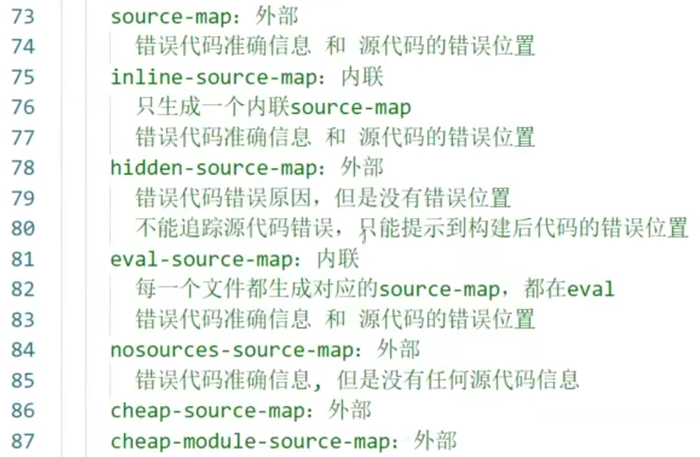 |
  | ------------------------------------------------------------ | ------------------------------------------------------------ |

- 看到10min处

# [22. 生产环境 oneOf](https://www.bilibili.com/video/BV1e7411j7T5/?p=22&spm_id_from=pageDriver&vd_source=a7089a0e007e4167b4a61ef53acc6f7e)

==oneOf：以下loader只会匹配一个==

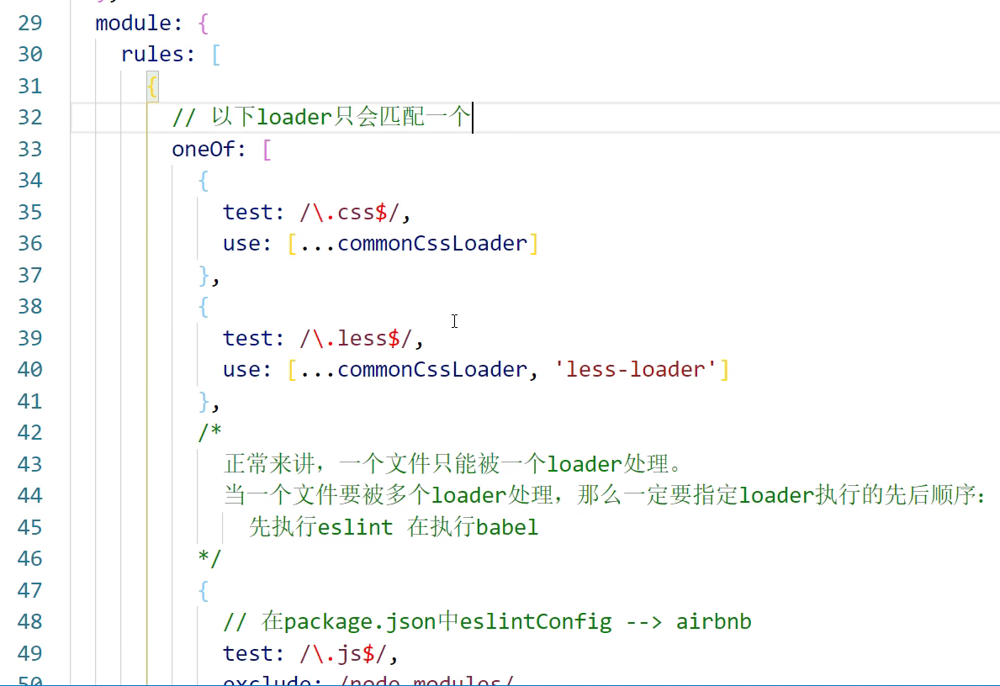

我们在写loader的时候，rules里面有非常多的loader规则（处理less文件和css文件的规则；处理js文件的规则；处理图片的规则；处理html中图片的规则）

如果不做优化的话，正常来讲，一个文件是要被所有loader过一遍（有些loader处理不了，有些loader会被命中），这样不太好。

用oneOf包裹之前的规则：==**oneOf主要是提升生产环境的打包构建速度**==

**注意：不能有两个配置处理同一类型的文件**

# [23. 生产环境 缓存](https://www.bilibili.com/video/BV1e7411j7T5/?p=23&spm_id_from=pageDriver&vd_source=a7089a0e007e4167b4a61ef53acc6f7e)

## 23.1 对babel进行缓存

为什么要对`babel`进行缓存？

- 因为`babel`要对js代码进行编译处理，编译成浏览器能识别的语法（即js兼容性处理）
- 在编译过程中，假设有100个JS模块，只改动其中一个JS模块，不可能把所有的模块再重新编译一次，其他99个模块应该是不变的。需做到这一点，就需开启`babel`缓存
- babel先得把之前100个文件编译后的文件进行缓存处理

> 在生产环境下，不能用HMR功能，因为HMR是基于devServer的，生产环境是不需要devServer的

作用：**让第二次打包构建速度更快**

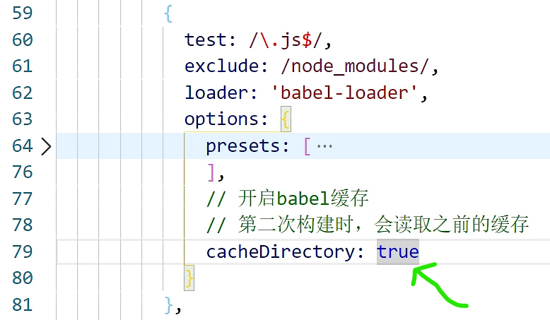

为什么对babel进行缓存不会作用在开发环境上面？

在使用Webpack和Babel进行开发时，启用缓存可以显著提升工程的打包速度，但在开发环境中，缓存机制有时不会生效或不建议使用，原因如下：

1. **热更新需求**：在开发环境中，开发者通常需频繁地进行代码修改和调试。为确保每次修改后的代码能立即生效，开发环境往往会禁用缓存，以便每次都能得到最新的构建结果
2. 调试准确性**：缓存机制在开发环境中可能会导致调试信息不准确。例如，启用了缓存后，代码行号映射（source maps）可能不匹配，从而使得调试变得更加困难。**？？？？
3. 缓存清理复杂**：在开发环境中，如果使用缓存，每次修改代码后都需要确保缓存清理正确，以避免使用旧的构建文件。这增加了维护复杂性，并且容易出错。**
4. 配置默认值：**许多Webpack和Babel的配置，在开发环境中默认会禁用缓存**，而在生产环境中则启用。这是因为在生产环境中，代码不会频繁变化，使用缓存能显著提升构建和加载性能并减少服务器的负担

尽管如此，如果你在开发环境中希望开启缓存，可以手动配置。例如，使用`babel-loader`时，可以通过如下配置启用缓存：

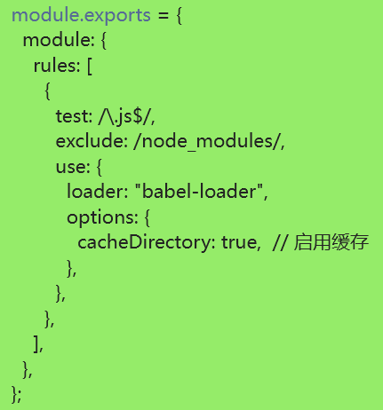

## 23.2 对整体文件资源进行缓存

> 作用：**让代码上线运行缓存更好使用**

|                 output filename取10位hash值                  |                   样式文件的hash值也取10位                   |
| :----------------------------------------------------------: | :----------------------------------------------------------: |
| 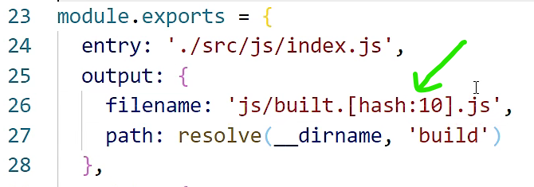 | 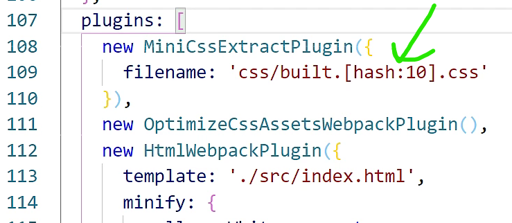 |
|                    **打包生成的文件如下**                    |                                                              |
| 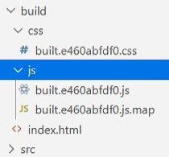 | 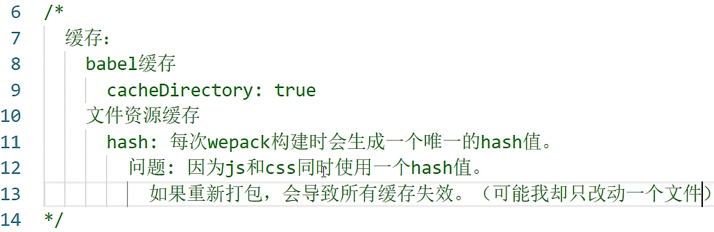 |

**为了解决上图描述的问题，引入了`chunkhash`**

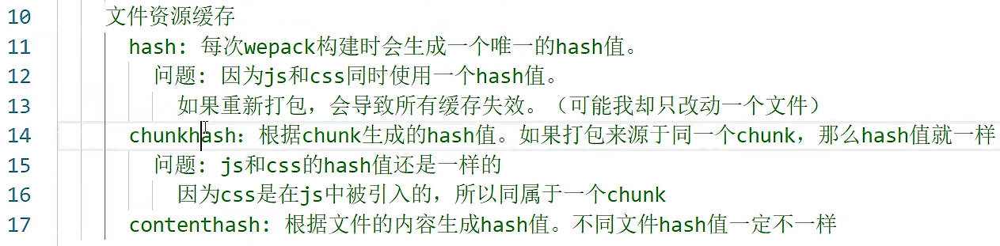

**`chunkhash`不一定能解决问题，所以进一步引入了`contenthash`**

| 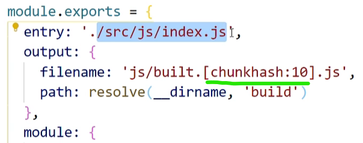 | 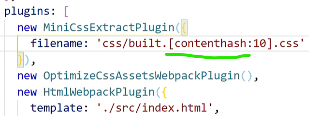 |
| ------------------------------------------------------------ | ------------------------------------------------------------ |

所有根据入口文件引入的东西都会生成*一个*chunk

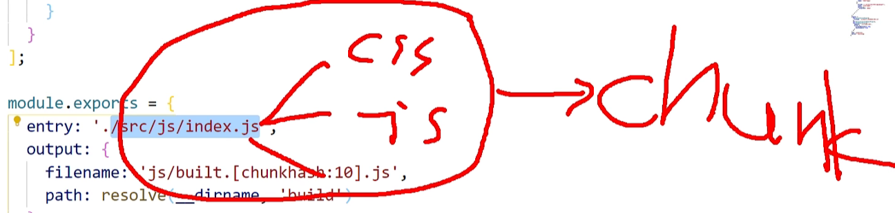

> chunk和bundle的联系和区别？？？？？

# [24. 生产环境 Tree-shaking](https://www.bilibili.com/video/BV1e7411j7T5/?p=24&spm_id_from=pageDriver&vd_source=a7089a0e007e4167b4a61ef53acc6f7e)

把应用程序想成是一棵树，而你在应用程序中引入的那些源代码或者第三方库理解成树叶

这个第三方库中有些代码你可能没有引用，那些没有被引用的代码可以理解成枯萎的树叶

为了去掉枯萎的树叶，摇晃树

**Tree-shaking目的：去除在应用程序中没有使用的代码，使得代码体积变得更小**


开启production环境可以自动的启用Tree-shaking

**为什么Tree-shaking一定要使用`ES6模块化`，不能使用`CommonJS模块化`？**

> Tree-shaking是一种在打包过程中移除未使用代码的技术。它依赖于静态分析代码的能力，以确定哪些代码在最终的输出中是必需的。
>
> ES6模块的导入和导出在**编译时**（静态分析时）是确定的。即 导入和导出在代码运行之前就可以确定。这是因为`import`和`export`语句在模块的顶层作用域执行。因此，打包工具可以在编译时准确分析哪些模块和导出被使用，从而移除未被引用的代码。这就是为什么Tree-Shaking技术可以在ES6模块上很好的工作
>
> CommonJS模块是动态的，即模块的导入可以基于条件，函数调用等动态行为来进行，如：
>
> ```js
> if (condition) {
>   const module = require('moduleA');
> }
> ```
>
> 在这种情况下，**编译时**无法确定到底会引入哪个模块，只有在**运行时**才能确定

# [25. code split 代码分割](https://www.bilibili.com/video/BV1e7411j7T5/?p=25&spm_id_from=pageDriver&vd_source=a7089a0e007e4167b4a61ef53acc6f7e)

> https://webpack.js.org/guides/code-splitting/
>
> 将打包输出的一个`chunk`分割成多个`chunk`

- 加载的时候就可以并行加载，从而速度更快
- 同时，分割成更多的文件，还可以实现**按需加载**的功能

## 25.1 配置方法1

| 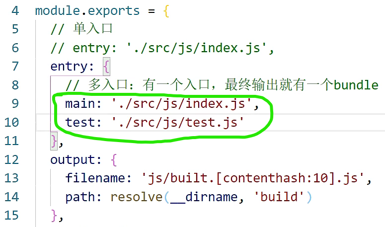 | 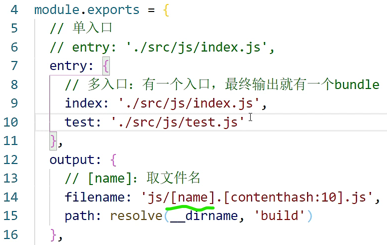 |
| ------------------------------------------------------------ | ------------------------------------------------------------ |

> **有多个入口，最终输出就有多个`bundle`**
>
> 单入口 对应 单页面应用
>
> 多入口 对应 多页面应用

## 25.2 配置方法2

> optimization：an act, process, or methodology of making something as fully perfect, functional, or effective as possible

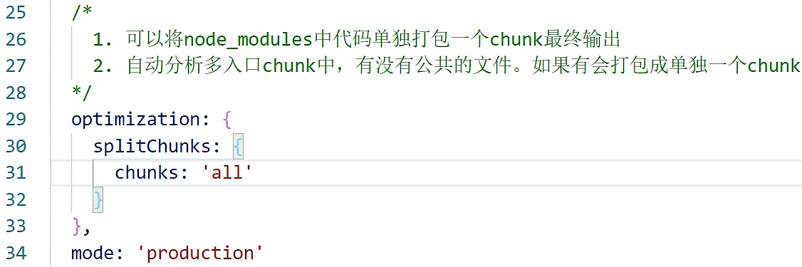

## 25.3 配置方法3

16min处

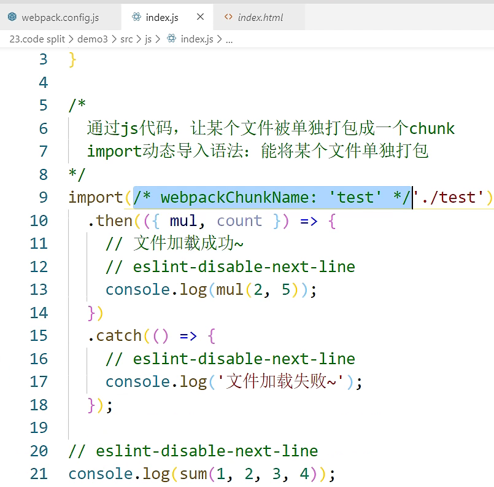

# [26. 懒加载和预加载](https://www.bilibili.com/video/BV1e7411j7T5/?p=26&spm_id_from=pageDriver&vd_source=a7089a0e007e4167b4a61ef53acc6f7e)

## 26.1 懒加载

- js文件的懒加载

- 懒加载可以理解成延迟加载，等触发了某些条件的时候才会加载，而不是一上来就加载
- 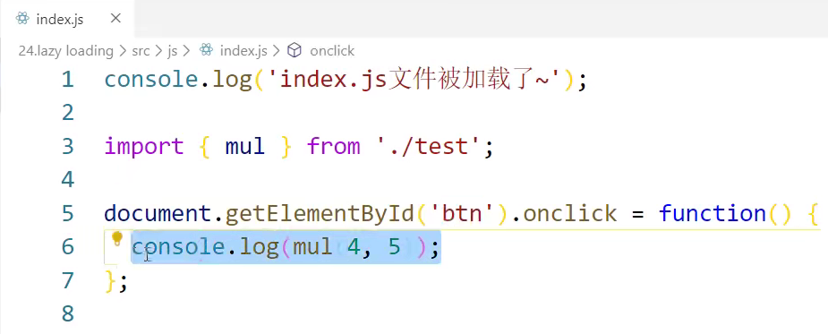
- 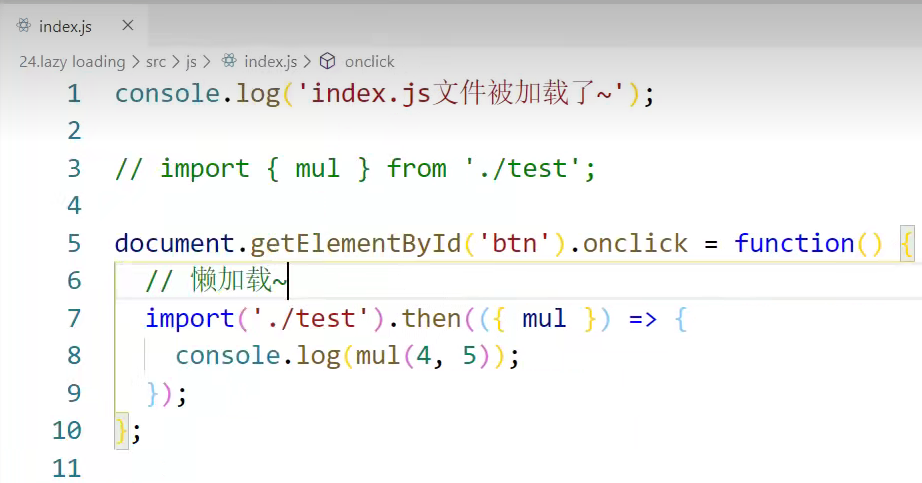
- 懒加载的前提条件是进行代码分割

## 26.2 预加载

- 预加载：webpackPrefetch：true

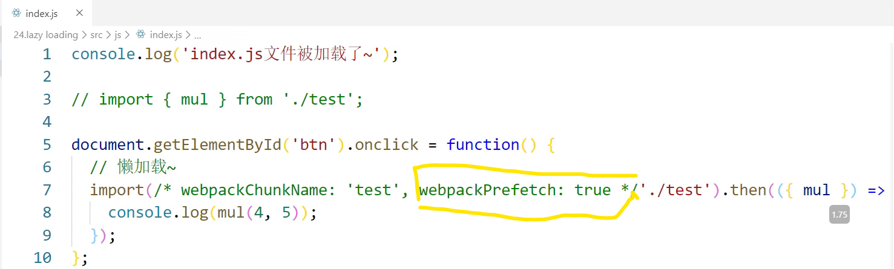

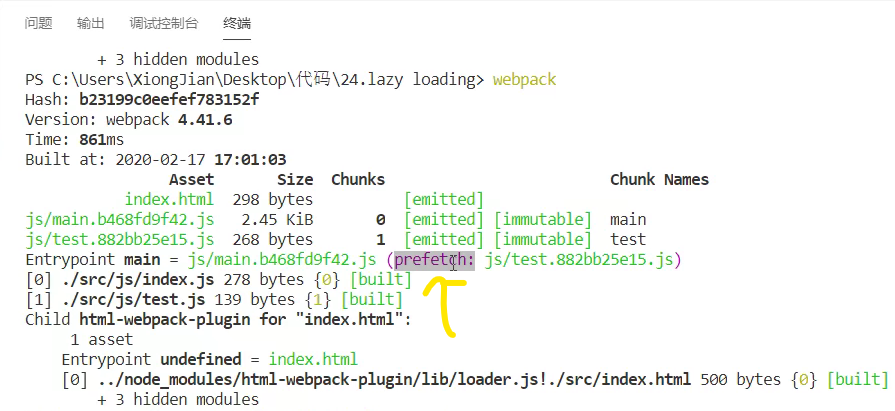

- 从network里面看，其实test文件已经被加载好了

- 点击按钮，其实读取的是提前加载好的缓存
- 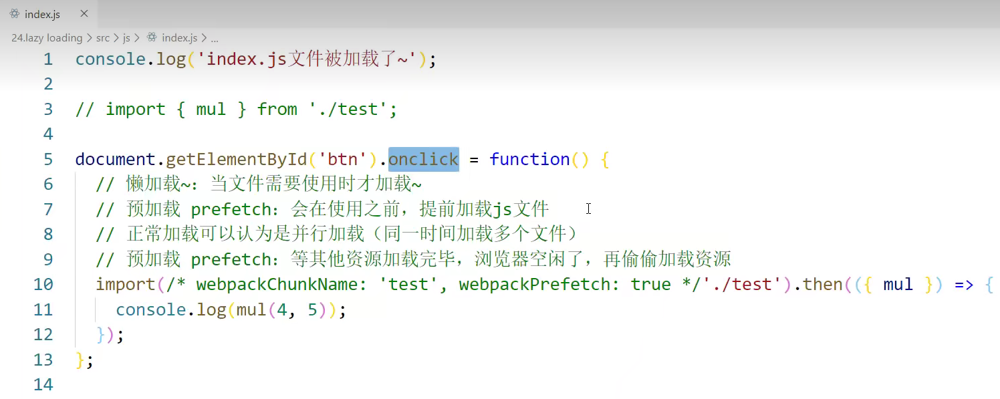
- 预加载谨慎使用，因为有很多兼容性问题 


- 疑问：为什么第一次加载test文件返回状态码是304
- 第二次从缓存中加载test文件返回状态码是200
- 3xx表示重定向，如要完成请求还必须采取进一步的行动

# [27. PWA](https://www.bilibili.com/video/BV1e7411j7T5/?p=27&spm_id_from=pageDriver&vd_source=a7089a0e007e4167b4a61ef53acc6f7e)

- 渐进式网络应用开发程序

- service works + cache

- 作用：帮助我们让我们的网页像APP应用程序一样，可以离线访问
- 2min20s

# [28. 多进程打包 thread loader](https://www.bilibili.com/video/BV1e7411j7T5?p=28&vd_source=a7089a0e007e4167b4a61ef53acc6f7e)

**js是单线程的**

npm i thread-loader -D

thread-loader一般是给babel-loader用

1min处

# 29. externals

- 作用：防止将某一些包打包到最终输出的bundle中

# [30. dll——dynamic link library](https://www.bilibili.com/video/BV1e7411j7T5?p=30&vd_source=a7089a0e007e4167b4a61ef53acc6f7e)

动态连接库 dynamic link library

- 作用：类似于externals，会指示webpack哪些库是不参与打包的，不同的是dll会单独的对某些库进行单独打包，将多个库打包成一个chunk
- 简单来讲就是：dll可以对代码进行单独打包

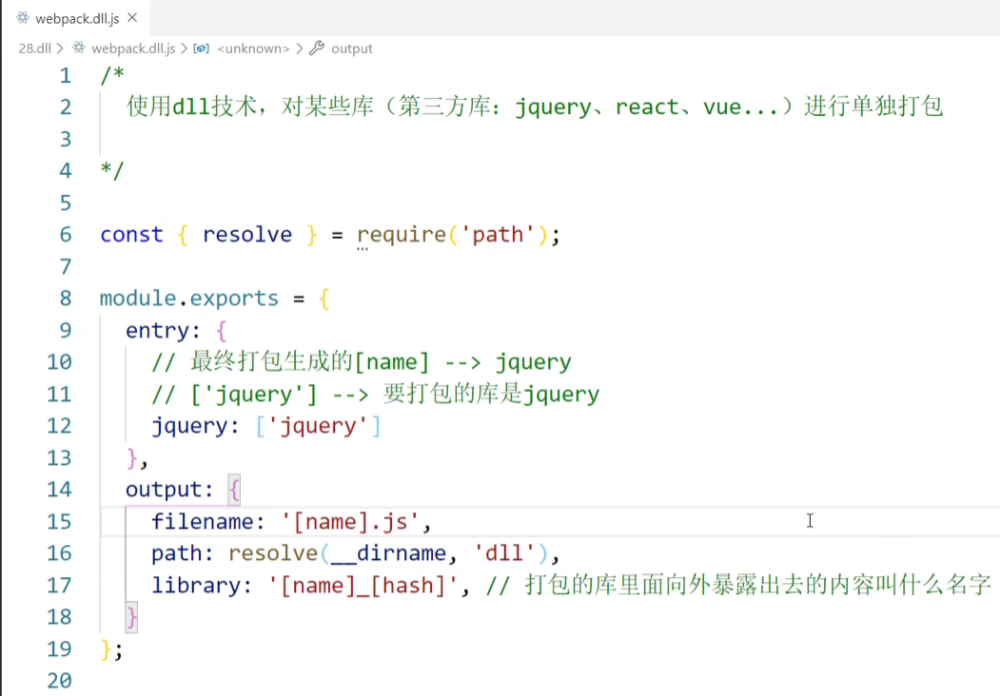

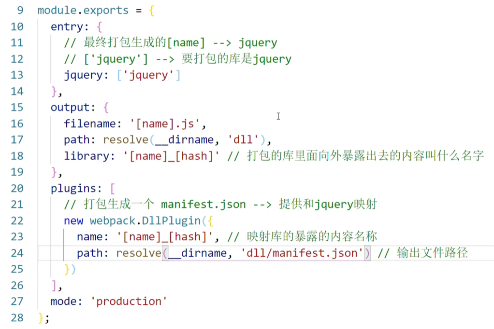

- 通过--config来指定要运行的配置文件是哪一个
- 

7min56处

# chunk和bundle的区别

> chunk：a thick solid piece that has been cut or broken off sth
>
> bundle：a number of things tied or wrapped together

### 1. Chunk
- **定义**：Chunk 是 Webpack **在构建过程中生成的**独立的代码块。它代表了在项目中被分离出来的一组模块（通常是为了优化加载时间和性能）。当 Webpack 处理依赖图时，它会识别出可以单独加载的代码部分，然后将它们划分为不同的 chunk。
  
- **类型**：Webpack 中有多种类型的 chunk，例如入口 chunk、异步 chunk 等。入口 chunk 是应用程序的主要入口点，而异步 chunk 则是在需要时按需加载的代码块。

- **目的**：通过创建多个 chunk，可以利用浏览器的并行加载能力，从而减少页面的初始加载时间。异步 chunk 特别用于动态导入场景下，只有在需要时才会加载。

### 2. Bundle
- **定义**：Bundle 是 Webpack **最终输出的文件**。Webpack 将多个 chunk 或者模块打包（bundle）到一个或多个文件中，这些文件就是 bundle。

- **形式**：Bundle 通常是 JavaScript 文件，但也可以包括其他资源，如 CSS、图像等。Bundle 是可以直接在浏览器中被引用和加载的文件。

- **目的**：Bundle 是 Webpack 打包过程的最终产物，它包含了应用程序的运行时和所有依赖的模块。通常，Webpack 会将一个或多个 chunk 合并到一个 bundle 文件中，尽管在某些优化策略下，多个 chunk 可能会生成多个 bundle 文件。

### 总结
- **联系**：Chunk 是在 Webpack 构建过程中生成的独立代码块，而 Bundle 则是这些 chunk 的最终打包产物。Chunk 是在构建阶段被识别和创建的，而 Bundle 是在构建完成后输出到磁盘上的文件。

- **区别**：Chunk 是一种内部概念，主要用于代码分割和优化；而 Bundle 是最终输出的文件，是在生产环境中实际被加载和执行的部分。


