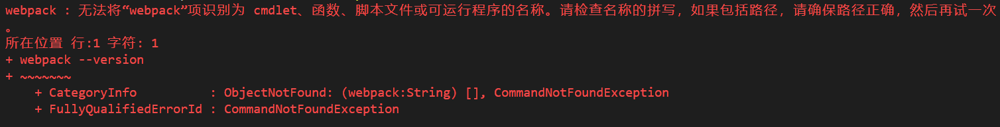
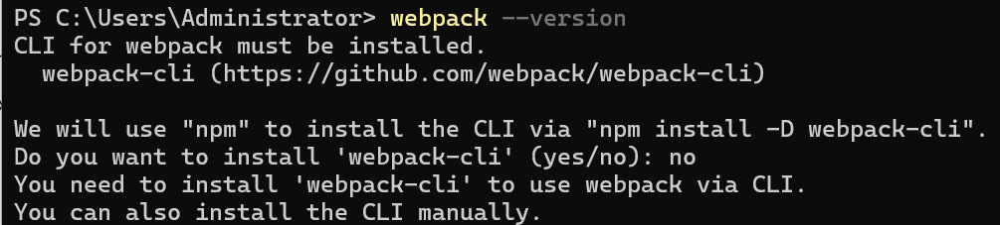

# 1. 怎么查看webpack版本

- webpack --version

- webpack -v

- 如果没有全局安装webpack，也可以在项目的node_modules 目录下运行 npm run webpack -v 命令来查看
  - 在luoshu-webresource中执行 `npm run webpack -v`得到6.14.18
  - 6.14.18代表webpack的什么版本

# 2. 怎么用命令行查看webpack有哪些版本

# 3. webpack报错



原因一：未全局安装webpack

原因二：未安装webpack-cli



# 4. 怎么查看npm 全局安装了哪些包

npm list -g --depth 0

# 5. 怎么全局安装指定版本的webpack

```bash
npm install -g webpack@<version>
npm install -g webpack@5.74.0
```

通常，webpack 需要搭配 `webpack-cli` 一起使用，以便通过命令行来执行 webpack。

```bash
npm install -g webpack-cli
webpack-cli -v
```

# 6. webpack-dev-server是干嘛的

`webpack-dev-server` 是一个开发服务器，专门为使用 Webpack 构建的应用程序设计的。它的主要功能包括：

1. **实时重新加载**：当你修改代码并保存时，页面会自动刷新以显示最新的更改。
2. **模块热替换（HMR）**：更高级的功能，允许在不重新加载整个页面的情况下替换、添加或删除模块。
3. **提供静态文件**：它可以为你提供本地开发服务器，直接从内存中提供打包后的文件，而不需要实际写入硬盘。
4. **代理请求**：可以将 API 请求代理到后端服务器，解决跨域问题。

它极大地提高了开发效率和体验，常与 Webpack 一起使用。

# 7. --save和--svae--dev的区别

1. **`--save`**:

   - 将依赖包添加到 `package.json` 文件的 `dependencies` 字段中。
   - 这些依赖包在开发和生产环境中都需要。

   ```
   npm install express --save
   ```
   
   `package.json`:

   ```
   "dependencies": {
     "express": "x.x.x"
   }
   ```
   
2. **`--save-dev`**:

   - 将依赖包添加到 `package.json` 文件的 `devDependencies` 字段中。
   - 这些依赖包仅在开发环境中需要，不在生产环境中使用。

   ```
   npm install webpack --save-dev
   ```
   
   `package.json`:

   ```
   "devDependencies": {
     "webpack": "x.x.x"
   }
   ```

总结：`--save` 用于生产和开发依赖，而 `--save-dev` 仅用于开发依赖。

# 8. vscode中的webpack相关提示插件

1. **Webpack**：
   - 提供 Webpack 配置文件的语法高亮和自动补全。
   - [Webpack](https://marketplace.visualstudio.com/items?itemName=steoates.autoimport)
2. **Webpack Dashboard**：
   - 提供一个漂亮的界面来显示 Webpack 构建过程的信息。
   - [Webpack Dashboard](https://marketplace.visualstudio.com/items?itemName=FormidableLabs.vscode-aurora)
3. **Path Intellisense**：
   - 自动补全路径，非常适合 Webpack 配置文件中的路径配置。
   - [Path Intellisense](https://marketplace.visualstudio.com/items?itemName=christian-kohler.path-intellisense)
4. **npm Intellisense**：
   - 自动补全 `import` 语句中的 npm 模块，非常适合 Webpack 项目。
   - [npm Intellisense](https://marketplace.visualstudio.com/items?itemName=christian-kohler.npm-intellisense)

这些插件可以帮助你在 VSCode 中更高效地工作，提供语法高亮、自动补全和构建过程的可视化。

# 9. webpack serve命令

`webpack serve` 是一个命令，用于启动 Webpack 开发服务器（webpack-dev-server）。这个命令在开发环境中非常有用，因为它提供了以下功能：

1. **实时重新加载**：当代码发生变化时，页面会自动刷新以显示最新的更改。
2. **模块热替换（HMR）**：允许在不重新加载整个页面的情况下替换、添加或删除模块。
3. **提供静态文件**：从内存中提供打包后的文件，而不需要实际写入硬盘。
4. **代理请求**：可以将 API 请求代理到后端服务器，解决跨域问题。

### 使用方式

在 `package.json` 的 `scripts` 中添加：

```json
"scripts": {
  "start": "webpack serve --mode development"
}
```

然后运行：

```bash
npm start
```

这将启动 Webpack 开发服务器，并在浏览器中打开你的应用。


