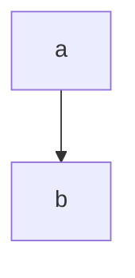

https://www.bilibili.com/video/BV1e7411j7T5?p=5



# 第五节：打包样式资源 'style-loader' and 'css-loader 20min处

*  'css-loader'：  将css文件变成commonjs模块，加载到js中，里面内容是样式字符串
*  'style-loader'：创建style标签，将js中的css样式资源插入进去，添加到页面head中生效

```css
html, body{
    margin: 0;
    padding: 0;
    height: 100%;
    background-color: pink;
}
```

==loader：帮你解析翻译一些不能识别的模块==

==plugins做的事更加强大==

 * webpack.config.js:webpack的配置文件
    * 作用：指示webpack怎么干活，干哪些活（当你运行webpack指令时，会加载里面的配置）
 * 所有构建工具都是基于nodejs平台运行的，模块化默认采用commonjs
 * src是项目的源代码，是写项目的代码，==项目的代码是用ES6module==
 * webpack是写配置的代码，项目和配置是两方面，而==配置的模块化，因为是基于nodejs平台，所以用commonjs==
    * commonjs暴露通过module.exports
 * 即这里我们用了两种模块化的方式

```js
// const path = require('path');
// 另一种写法 ：通过解构赋值
// resolve: 用来拼接绝对路径的方法
const { resolve } = require('path')
module.exports = {
    // webpack配置
    entry: './src/index.js',
    output: {
        filename: 'built.js',
        // 输出路径：通常会写一个绝对路径，避免出错
        // __dirname是nodejs的变量，代表当前文件（webpack.config.js）的目录绝对路径
        // 在这个项目中__dirname的值就是：‘webpack项目’
        path: resolve(__dirname, 'build')
    },
    // loader的配置
    module: {
        rules: [
            {
                // 匹配哪些文件
                test: /\.css$/,
                // 使用哪些loader进行处理
                use: [
                    // use数组中loader执行顺序：从右到左，从下到上依次执行
                    // 创建style标签，将js中的css样式资源插入进去，添加到页面head  中生效
                    'style-loader',
                    // 将css文件变成commonjs模块，加载到js中，里面内容是样式字符串
                    'css-loader'
                ]
            },
            {
                test: /\.less&/,
                use: [
                    'style-loader',
                    'css-loader',
                    // 将less文件编译成css文件
                    // 需要下载less-loader和less
                    'less-loader'
                ]
            }
        ]
    },
    // plugins的配置
    plugins: [],
    mode: 'development'
    // mode: 'production'
}
```

# 第六节：打包样式资源

# 第七节：打包图片资源 


```js
const { resolve } = require("path");
const HtmlWebpackPlugin = require('html-webpack-plugin')
 module.exports = {
     entry: './src/index.js',
     output: {
         filename: 'built.js',
         path: resolve(__dirname, 'build')
     },
     module: {
        rules: [
            {
                test: /\.css$/,
                // 要使用多个loader处理用use
                use: ['style-loader','css-loader']
            },
            {
                // 处理图片资源
                test: /\.(jpg|png|gif|jpeg)$/,
                // 使用一个loader
                loader: 'url-loader', // 下载url-loader file-loader
                options: {
                    // 图片大小小于8kb，就会被base64处理
                    // 优点：减少请求数量（减轻服务器压力）
                    // 缺点：图片体积会更大（文件请求速度更慢）
                    limit: 8 * 1024,
                    esModule: false, //关闭ES6module
                    // 给图片进行重命名
                    // [hash:10]取图片的hash的前10位
                    // [ext]:取文件原来扩展名
                    name: '[hash:10].[ext]'
                }
            },
            {
                test: /\.html$/,
                // 处理html文件的img图片（负责引入img，从而能被url-loader进行处理）
                loader: 'html-loader'
                // url-loader使用ES6module去处理模块；而html-loader引入的img是commonjs的引入
                // 以ES6的模块语法去解析commonjs的模块语法 解析不了
            }
        ]
     },
     plugins: [
         new HtmlWebpackPlugin({
             template: './src/index.html'
         })
     ],
     mode: "development"
 }
```

在html中引入图片的处理这好像有点问题！！！！！！！！

# 第八节：打包其他资源

```js
const { resolve } = require("path");
const HtmlWebpackPlugin = require('html-webpack-plugin')
 module.exports = {
     entry: './src/index.js',
     output: {
         filename: 'built.js',
         path: resolve(__dirname, 'build')
     },
     module: {
        rules: [
            {
                test: /\.css$/,
                // 要使用多个loader处理用use
                use: ['style-loader','css-loader']
            },
            // 打包其他资源 （除了html/js/css资源以外的资源）
            {
                exclude: /\.(css|js|html)/,
                loader: 'file-loader'
            }
        ]
     },
     plugins: [
         new HtmlWebpackPlugin({
             template: './src/index.html'
         })
     ],
     mode: "development"
 }
```

# 第九节：devServer

```js

/** 
 * webpack.config.js:webpack的配置文件
 * 作用：指示webpack怎么干活，干哪些活（当你运行webpack指令时，会加载里面的配置）
 * 
 * 所有构建工具都是基于nodejs平台运行的，模块化默认采用commonjs
 * 
 * src是项目的源代码，是写项目的代码，项目的代码是用ES6module
 * webpack是写配置的代码，项目和配置是两方面，而配置的模块化，因为是基于nodejs平台，所以用commonjs
 * 这里我们用来两种模块化的方式
 * 
 * commonjs暴露通过module.exports
 * 
 * loader: 1.下载 2.使用（配置loader）
 * plugins: 1.下载 2.引入 3.使用
 * 
*/

// const path = require('path');
// 另一种写法 ：通过解构赋值
// resolve: 用来拼接绝对路径的方法
const { resolve } = require('path')
const HtmlWebpackPlugin = require('html-webpack-plugin')

module.exports = {
    // webpack配置
    entry: './src/index.js',
    output: {
        filename: 'built.js',
        // 输出路径：通常会写一个绝对路径，避免出错
        // __dirname是nodejs的变量，代表当前文件（webpack.config.js）的目录绝对路径
        // 在这个项目中__dirname的值就是：‘webpack项目’
        path: resolve(__dirname, 'build')
    },
    // loader的配置
    module: {
        rules: [ 
            {
                // 匹配哪些文件
                test: /\.css$/,
                // 使用哪些loader进行处理
                use: [
                    // use数组中loader执行顺序：从右到左，从下到上依次执行
                    // 创建style标签，将js中的css样式资源插入进去，添加到页面head  中生效
                    'style-loader',
                    // 将css文件变成commonjs模块，加载到js中，里面内容是样式字符串
                    'css-loader'
                ]
            },
            {
                test: /\.less&/,
                use: [
                    'style-loader',
                    'css-loader',
                    // 将less文件编译成css文件
                    // 需要下载less-loader和less
                    'less-loader'
                ]
            }
        ]
    },
    // plugins的配置
    plugins: [
        // html-webpack-plugin
        // 默认会创建一个空的HTML，自动引入打包输出的所有资源（JS/CSS）
        // 需求：需要有结构的html文件
        new HtmlWebpackPlugin({
            // 复制'./src/index.html'文件，并自动引入打包输出的所有资源（JS/CSS）
            template: './src/index.html'
        })
    ],
    mode: 'development',
    // mode: 'production',

    // 开发服务器，devServer：用来自动化，自动编译。自动打开浏览器，自动刷新浏览器
    // 特点：只会在内存中编译打包，不会有任何输出
    // 启动devServer指令：webpack-dev-server
    // 因为我们是本地下载，要启动本地的webpack-dev-server，需要通过 npx webpack-dev-server 去启动。
    // 用这个指令就得把这个包下载下来
    devServer: {
        contentBase: resolve(__dirname, 'build'),
        // 启动gzip压缩：让代码更小，从而速度更快
        compress: true,
        port: 3000,
        // 自动打开浏览器
        open: true
    }
}
```

报错：Cannot find module 'webpack-cli/bin/config-yargs' 

原本：版本的问题。

# 第十节：开发环境基本配置

这个就是把前面的整合起来。没有试过！！！！只看到十分钟处

```js
const { resolve } = require('path')
const HtmlWebpackPlugin = require('html-webpack-plugin')

module.exports = {
    entry: './src/index.js',
    output: {
        filename: 'built.js',
        path: resolve(__dirname, 'build')
    },
    module: {
        rules: [ 
            {
                test: /\.css$/,
                use: [
                    'style-loader',
                    'css-loader'
                ]
            },
            {
                test: /\.less&/,
                use: [
                    'style-loader',
                    'css-loader',
                    'less-loader'
                ]
            },
            {
                // 处理图片资源
                test: /\.(jpg|png|gif|jpeg)$/,
                // 使用一个loader
                loader: 'url-loader', // 下载url-loader file-loader
                options: {
                  // 图片大小小于8kb，就会被base64处理
                  // 优点：减少请求数量（减轻服务器压力）
                  // 缺点：图片体积会更大（文件请求速度更慢）
                  limit: 8 * 1024,
                  esModule: false, //关闭ES6module
                  // 给图片进行重命名
                  // [hash:10]取图片的hash的前10位
                  // [ext]:取文件原来扩展名
                  name: '[hash:10].[ext]'
                }
              },
          	{
                test: /\.html$/,
                // 处理html文件的img图片（负责引入img，从而能被url-loader进行处理）
                loader: 'html-loader'
                // url-loader使用ES6module去处理模块；而html-loader引入的img是commonjs的引入
                // 以ES6的模块语法去解析commonjs的模块语法 解析不了
            },
            {
              	// 打包其他资源 （除了html/js/css资源以外的资源）
                exclude: /\.(css|js|html)/,
                loader: 'file-loader'
            }
        ]
    },
    plugins: [
        new HtmlWebpackPlugin({
            template: './src/index.html'
        })
    ],
    mode: 'development',
    devServer: {
        contentBase: resolve(__dirname, 'build'),
        compress: true,
        port: 3000,
        open: true
    }
}
```

# 第十一节：构建环境介绍


1. 样式之前是整合在js中的，因为有css-loader将样式文件整合到js中，而如果样式在js中的话，会让js体积变得非常大，下载速度就很慢。同时，因为先加载js才能通过创建style标签插入到页面中，所以会出现闪屏现象。（有人反对说：因为执行js时时阻塞DOM渲染的，只有js执行完，才会渲染DOM）我们要将css文件从js中提取出来。
2. 代码压缩处理
3. 兼容性问题

# 第十二节：提取css成单独文件

==MiniCssExtractPlugin==

```js
const { resolve } = require("path");
const HtmlWebpackPlugin = require('html-webpack-plugin')
const MiniCssExtractPlugin= require('mini-css-extract-plugin')
module.exports = {
    entry: './src/js/index.js',
    output: {
        filename: 'js/built.js',
        path: resolve(__dirname, 'build')
    },
    module: {
    rules: [
        {
            test: /\.css$/,
            // 要使用多个loader处理用use
            use: [
                // 创建style标签，将样式放入
                // 'style-loader',
                MiniCssExtractPlugin.loader, // 这个loader取代style-loader.作用：提取js中的css成单独文件。
                // 将css文件整合到js文件中
                'css-loader']
        },
    ]
    },
    plugins: [
        new HtmlWebpackPlugin({
            template: './src/index.html'
        }),
        new MiniCssExtractPlugin({
            filename: 'css/built.css'
        })
    ],
    mode: "development"
 }
```

# 第十三节：Css兼容性处理

==postcss-loader==

***\*前面加了很多前缀，如-webkit-,-moz-,-o-,-ms-,-chrome-等都是为了支持非正式发布版的浏览器\****

具体代码看CSS兼容性部分代码！！！

# 第十四节：压缩css

使用插件：==optimize-css-assets-webpack-plugin==

压缩CSS：会把所有的CSS代码变成一行。

CSS样式文件被压缩的越小，请求速度就会越快。用户看到的效果就会更快一些

# 第十五节：js语法检查eslint

==eslint-loader==

==eslint==

具体代码看js语法检查部分代码！！！

# 第十六节：js兼容性处理eslint（优先级降低，之后再看）19min

# 第十七节：压缩html和js

**压缩js**：只需要把mode：development改成mode：production

==生产环境下会自动压缩js代码（变成一行）==

生产环境下，webpack会加载一些不一样的环境配置。其中==UglifyJsPlugin==插件就是用来压缩js代码的


**压缩html**：

html要不要做兼容性处理？不要


# 第十八节：生产环境基本配置 9min处

CSS：

1. style-loader(被mini-css-extract-plugin.loader取代。因为用style-loader会将css代码整合到js中，这样不好。其实不是很懂哪里不好，影响很大吗？)
2. css-loader 
3. mini-css-extract-plugin

less： 

1. less-loader
2. postcss-loader(对样式做兼容性处理)
3. postcss-preset-env

JS 

HTML

图片


# 第十九节：性能优化介绍


# 第二十节：开发环境 HMR Hot module replacement

**优化==开发环境==的打包构建速度**。不能优化生产环境吗？？？不能

==在生产环境下不能用HMR功能==

* 因为HMR是基于dev-server的，生产环境不需要dev-server
* 为什么生产环境不需要dev-server？dev-server是用来干什么的？？？？
  * // 开发服务器，devServer：==用来自动化，自动编译==。自动打开浏览器，自动刷新浏览器
  *  // 特点：只会在内存中编译打包，不会有任何输出
  * // 启动devServer指令：webpack-dev-server
  * // 因为我们是本地下载，要启动本地的webpack-dev-server，需要通过 npx webpack-dev-server 去启动。
  *  // 用这个指令就得把这个包下载下来

前面所有的配置中存在的问题：

* 当修改css样式文件的时候，明明js文件没有什么变化，但是会被重新加载一次。

  所以在打包的时候看似我们只修改样式文件，实际上是把js文件也一起重新打包了一次。

想实现下面的功能：

如果只有一个模块发生变化，就只重新打包该模块。

  

加入属性：==hot：true==


[WDS] Hot Module Replacement enabled


==这里的module是哪里的module？是这个js文件中module.exports的那个module吗？？==

注意：HMR功能对js的处理，只能处理非入口js文件。

因为入口文件会将其他文件全都引入，一旦入口文件变化，其他文件重新引入就会重新加载，这是没办法阻止的。

# 第二十一节：开发环境 && 生产环境 source-map 24min处

解决==开发环境下调试代码==的问题？？？？？

如果构建后的代码出错（构建后的代码和源代码是千差万别的，比方说源代码有一百个模块，构建后代码可能只有一个模块，一个模块中有一百个模块的代码集合体，这个时候去找代码出错的位置，就比较难）

有了source-map，如果你构建后的代码出错，会通过映射关系可以追踪到源代码的错误。


  nosources和hidden都是为了隐藏源代码，防止造成源代码泄露。


# 第二十二节：生产环境 oneOf

==oneOf：以下loader只会匹配一个==

注意：不能有两个配置处理同一类型的文件

我们在写loader的时候，rules里面有非常多的loader规则（处理less文件和css文件的规则；处理js文件的规则；处理图片的规则；处理html中图片的规则）

如果不做优化的话，正常来讲，一个文件是要被所有loader过一遍（有些loader处理不了，有些loader会被命中），这样不太好。

用oneOf包裹之前的规则：==oneOf主要是提升构建速度==


# 第二十三节：生产环境 缓存

1. **对babel进行缓存：让第二次打包构建速度更快**

   1. 写代码的时候，js代码永远是最多的
   2. 为什么要对babel进行缓存呢？
      1. 因为==babel要对js代码进行编译处理==，编译成一种浏览器能够识别的语法（即所谓的js兼容性处理）
   3. 在编译过程中，假设我们有100个js模块，只改动其中的一个js模块，不可能把所有的模块再重新编译一次，而其他99个模块是不变的。需要做到这一点，就需要开启babel缓存。
   4. babel先得把之前100个文件编译后的文件进行缓存处理
   5. 

2. **对整体文件资源进行缓存**：让代码上线运行缓存更好使用

   1. 取10位hash值：

   2. 样式文件的hash值也取10位：

      


==chunkhash：==


==所有根据入口文件引入的东西都会生成*一个*chunk==


# 第二十四节：tree-shaking

把应用程序想成是一棵树，而你在应用程序中引入的那些源代码或者第三方库理解成树叶。

这个第三方库中有些代码你可能没有引用，那些没有被引用的代码可以理解成枯萎的树叶。

为了去掉枯萎的树叶，摇晃树。

==tree-shaking：去除在应用程序中没有使用的代码，使得代码体积变得更小==

开启production环境可以自动的启用tree-shaking


**==为什么tree-shaking一定要使用ES6模块化，不能使用CommonJS模块化？==**


# 第二十五节：code split

将一个chunk分割成多个chunk

# 第二十六节： 懒加载和预加载

js文件的懒加载

test.js:


index.js:


没做懒加载前：


懒加载可以理解成延迟加载

懒加载的前提条件是进行代码分割


预加载：webpackPrefetch：true


从network里面看，其实test文件已经被加载好了。

点击按钮，其实读取的是提前加载好的缓存。


疑问：为什么第一次加载test文件返回状态码是304

第二次从缓存中加载test文件返回状态码是200

3xx表示重定向，如要完成请求还必须采取进一步的行动。


预加载谨慎使用，因为有很多兼容性问题


