https://www.bilibili.com/video/BV18s411E7Tj?from=search&seid=7064259793791953240

# 一 模块化 入门介绍

立即执行函数：在全局不能看到函数里面的数据

模块化的好处：

* 避免命名冲突

* 更好的分离，按需加载

* 更高复用性

* 高可维护性

  

模块化导致的问题：

* 请求过多
* 依赖模糊，难以维护


# 二 模块进化史


# 三 commonjs基于服务器端(node)应用

常用的模块化规范：

* CommonJS

  * 在服务器端：**模块的加载运行是同步的**

  * 在浏览器端： 在commonjs里面有个require语法，浏览器引擎不认识。所以在浏览器端要使用commonjs，需要将模块提前编译打包处理

  * 暴露模块：

    * ```
      module.exports = value
      ```

    * ```
      exports.xxx = value
      ```

    * 暴露的模块到底是什么？

      * 暴露的都是exports对象(module.exports原来是一个空对象)

  * 引入模块：

    * ```node
      require(xxx)
      // 模块分为自定义模块和第三方模块
      // 第三方模块：xxx为模块名（包名 ）
      // 自定义模块：xxx为模块文件路径
      ```

  * 服务器端实现：Node

  * 浏览器端实现：Browserify(也称为commonJS的浏览器端打包工具)

* AMD

* CMD（阿里 了解即可）

* ES6


```js
// module1.js
module.exports = {
	msg: 'module1',
	foo(){
		console.log(this.msg)
	}
}
```

```js
// module2.js
module.exports = function () {
    console.log('module2');
}
```

```js
// module3.js
exports.foo = function () {
	console.log('foo() module3')
}
```

```js
// app.js
let module1 = require('./modules/module1');
let module2 = require('./modules/module2');
let module3 = require('./modules/module3');

module1.foo();
module2();
module3.foo();
```


# 四 commonjs基于浏览器端应用

```js
npm install browserify -g
npm install browserify --save-dev
// --save 表示局部安装 把依赖写入进去
// -dev 表示是开发依赖

// 打包处理命令：
browserify js/src/app.js -o js/dist/bundle.js
```


# 五 AMD规范_NoAMD

 Asynchronous Module Definition 异步模块定义

**专门用于浏览器端，模块的加载是异步的**

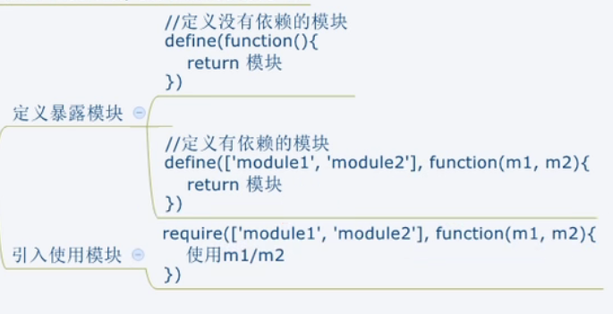


不使用模块化规范：

```js
// 定义一个没有依赖的模块
(function(window){
    let name = 'name';
    function getName () {
        return name;
    }
    // dataService相当于是模块的名字
    window.dataService = {
        getName: getName
    }
})(window)
```


```js
// 定义一个有依赖的模块
(function(window, dataService){
    let msg = 'msg';
    function showMsg () {
        console.log(msg, dataService.getName())
    }
    window.alerter = {
        showMsg: showMsg
    }
})(window, dataService)
```


# 六 AMD规范_NoAMD 自定义模块

http://requirejs.org

**AMD语法（即Requirejs语法）**

```js
// 定义没有依赖的模块
define(function(){
	let name = 'dataService.js';
	function getName(){
		return name;
	}
	
	return {getName};
})
```

```js
// 定义有依赖的模块
define(['dataService'], function(dataService){
	let msg = 'alerter.js';
	function showMsg () {
        console.log(msg, dataService.getName())
    }
	
	return {showMsg};
})
```

```js
// 主模块
(function () {
    requirejs.config({
        baseUrl: 'js/lib', // 
        paths: {
            dataService: './modules/dataService',
            alerter: './modules/alerter'
        }
    })
    
	requirejs(['alerter'], function (alerter) {
		alerter.showMsg();
	})
})()
```

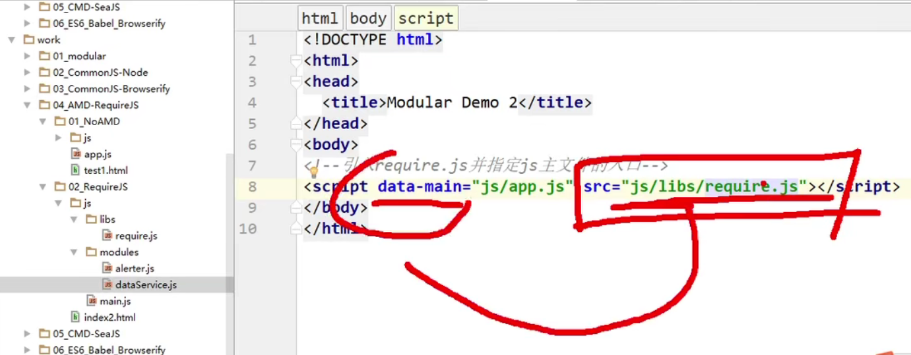

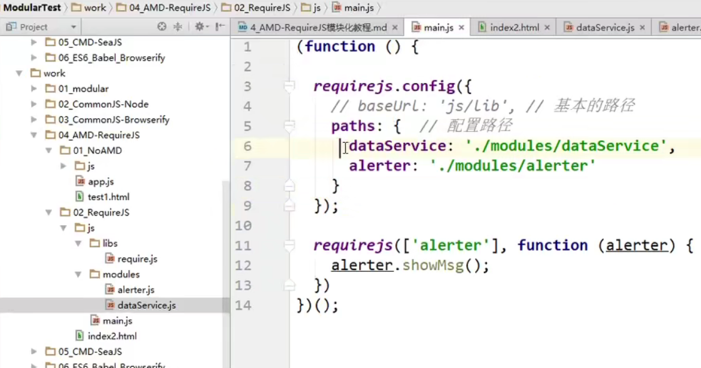

注意：第六行 第七行 末尾不要加.js


# 七 AMD规范_NoAMD 第三方模块

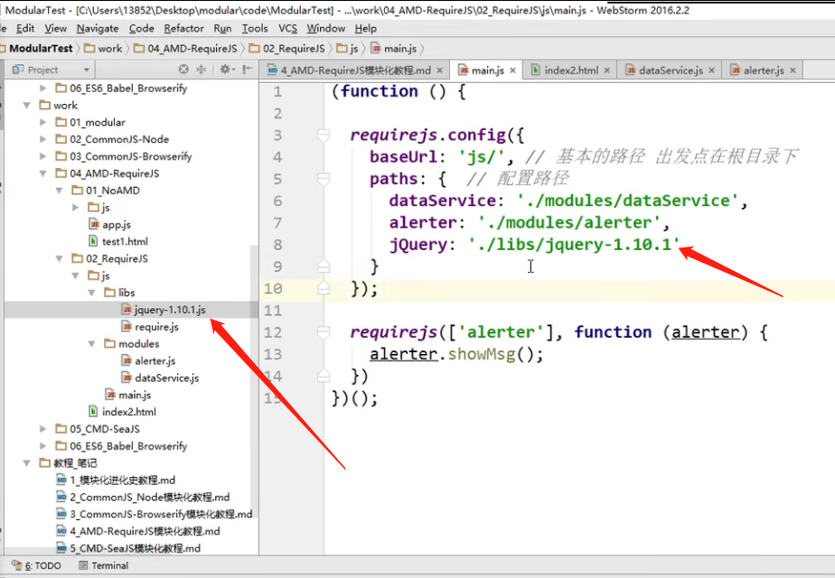

12行~14行：引入其他模块汇集到主模块


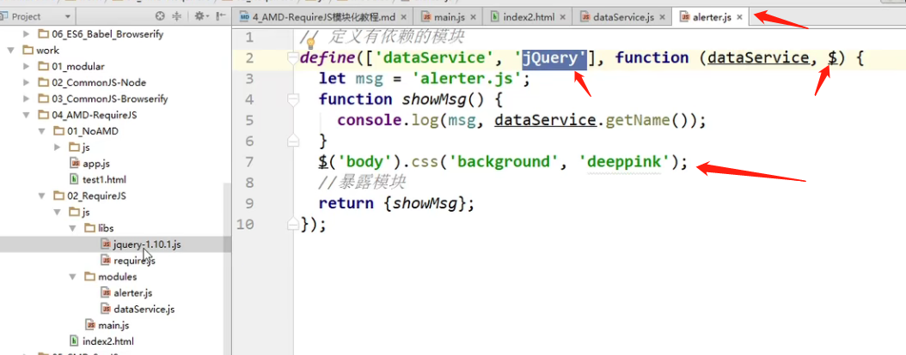

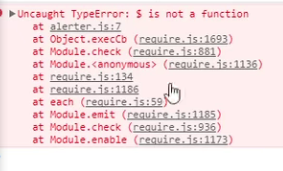

问题出在哪？

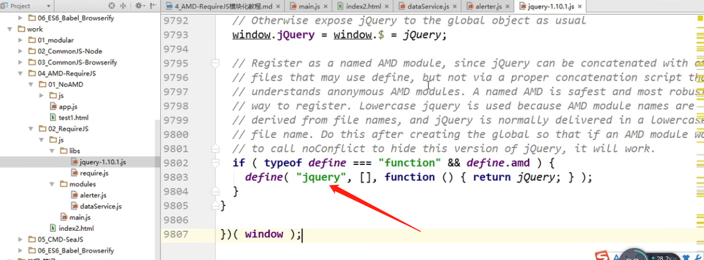

改正：q从大小改成小写

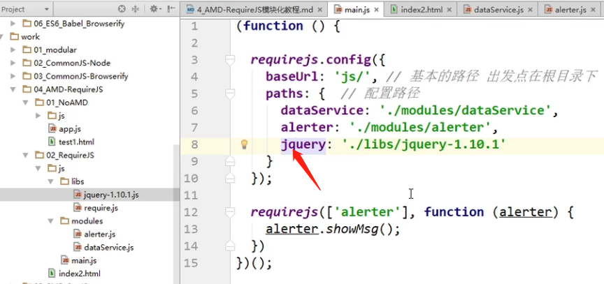


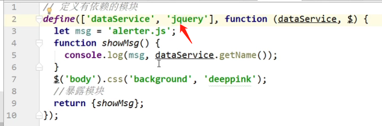

jQuery库支持AMD规范 但不是所有的第三方库都支持AMD规范

angular不支持

angular需要单独配置


# 八 CMD规范应用

**专门用于浏览器端，模块的加载是异步的**

**模块使用时才会执行加载**

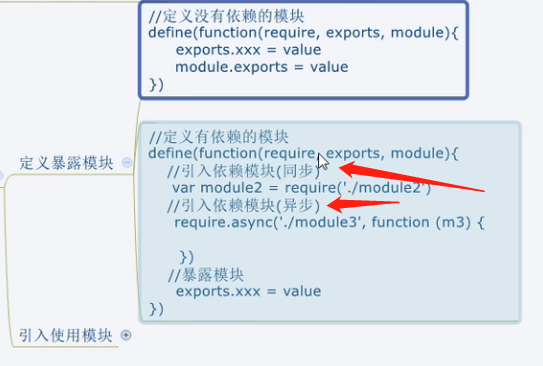

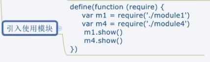

CMD在浏览端依赖一个库：Sea.js  http://seajs.org

看到9min处


# 九 ES6规范 基本使用

使用广泛

**依赖模块需要编译打包处理**？？？？

1. ES6里面的语法现在还有浏览器不支持的，这个时候通常用ES6开发完，要将ES6语法通过babel转换为ES5语法，这时浏览器才能识别
2. 当 “将ES6语法通过babel转换为ES5语法” 的时候。。。。。。
3. 打包编译require这种语法，需要用到browserify


**导出模块：**export

**引入模块：**import


```js
npm install babel-cli browserify -g
npm install babel-preset-es2015 --save-dev
```


* cli: command line interface 命令行接口
* babel-cli：下载完babel这个库以后，对应会有babel的命令。需要下载babel-cli库去帮助调用babel命令，否则使用不了babel的命令
* preset：预设（将es6转换为es5的所有插件打包）
* babelrc中的rc: run control 看到rc文件预示着它是一个运行时控制文件（就是运行时需要读的文件）


```json
// .babelrc
// babel的工作原理是它的插件去干活之前会先读.babelrc配置文件
{
    "preset": ["es2015"]
}
```

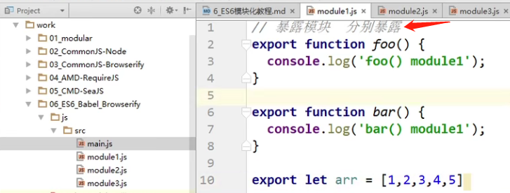

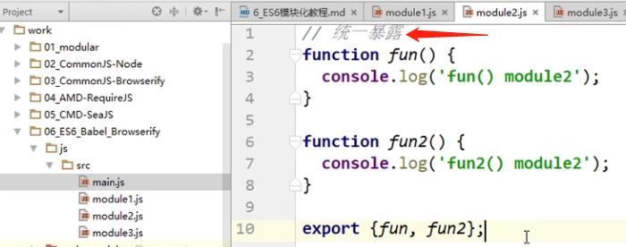

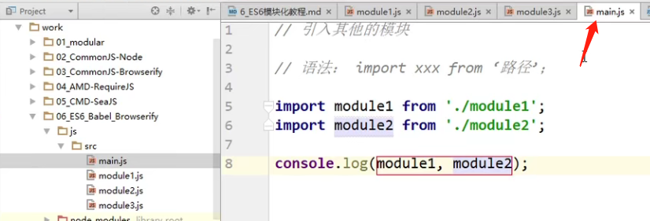

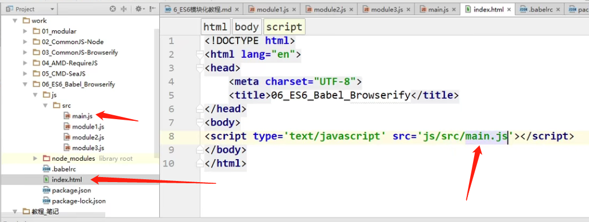

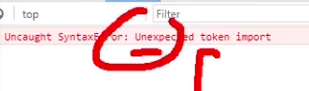


不认识import

这时候需要将es6的语法转换为es5（用到babel）

```
babel js/src -d js/lib
```


使用babel前：es6


使用babel后：es5 里面仍然包含require语法

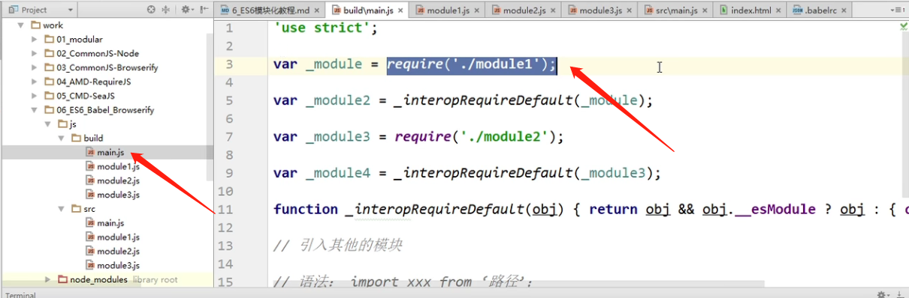

```
browserify js/build/main.js -o js/dist/bundle.js
```

browserify没有这么智能，只能在已有的文件夹下去生成文件，没有自动创建文件夹的功能

（但是我在bundel.js文件里面也看到require语法，怎么回事！！！ 要自己敲一下代码试一下！！！）


错误：

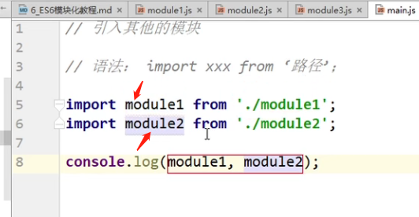

正确：（对象解构赋值）

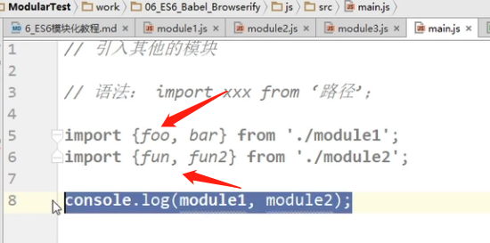


# 十 ES6规范 默认暴露

默认暴露可以暴露任意数据类型，暴露什么数据接收到的就是什么数据

**语法中加了default**

暴露：

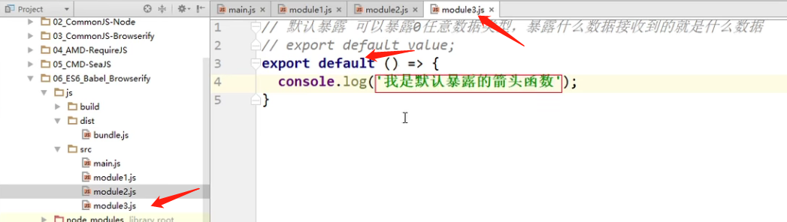

引入：

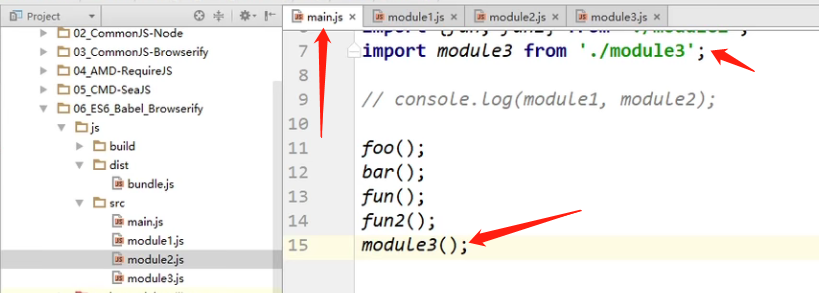

  

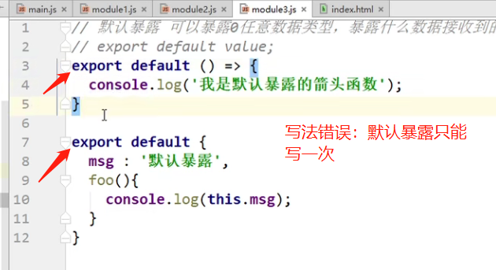


package-lock.json文件：https://blog.csdn.net/qq_41558265/article/details/103566073


