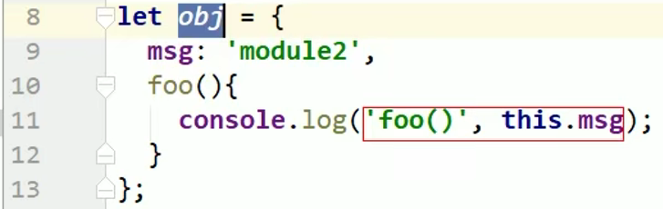

https://www.bilibili.com/video/BV18s411E7Tj?from=search&seid=7064259793791953240

# 1. 模块化 入门介绍

- 立即执行函数：在全局不能看到函数里面的数据


- 模块化的好处：

  * 避免命名冲突（减少命名空间污染）


  * 更好的分离，按需加载


  * 更高复用性


  * 高可维护性


- 模块化导致的问题：

  * 请求过多

  * 依赖模糊
  * 难以维护


# [2. 模块进化史](https://www.bilibili.com/video/BV18s411E7Tj/?p=2&spm_id_from=pageDriver&vd_source=a7089a0e007e4167b4a61ef53acc6f7e)

## 2.1 全局函数模式

将不同的功能封装成不同的全局函数


有命名冲突的问题

## 2.2 namespace模式

命名空间模式——简单对象封装




## 2.3 IIFE模式

Immediately invoked function expressions

立即执行函数

匿名函数自调用（闭包）


## 2.4 IIFE模式增强

引入依赖


# [3. commonjs基于服务器端(node)应用](https://www.bilibili.com/video/BV18s411E7Tj/?p=3&spm_id_from=pageDriver&vd_source=a7089a0e007e4167b4a61ef53acc6f7e)

node就是基于CommonJS这种模块化来编写的

## 3.1 CommonJS

* 每个js文件都可当做一个模块
* 在服务器端：模块的加载是运行时同步加载的（加载的模块文件一般都已经存在于本地硬盘，所以加载起来快，不用考虑异步加载的方式）
* 在浏览器端：模块需要提前编译打包处理
  * 在浏览器端使用commonJS会有问题
  * commonjs中有require语法，浏览器引擎不认识
  * 所以如果要在浏览器端使用commonjs规范，需要提前编译打包处理，编译打包的工具——Browserify


* 暴露模块：

  * ```
    module.exports = value
    ```

  * ```
    exports.xxx = value
    ```

  * 暴露的模块到底是什么？

    * 暴露的都是exports对象(module.exports原来是一个空对象)

* 引入模块：

  * ```node
    require(xxx)
    // 模块分为自定义模块和第三方模块
    // 第三方模块：xxx为模块名（包名 ）
    // 自定义模块：xxx为模块文件路径
    ```

* 服务器端实现：Node

* 浏览器端实现：Browserify(也称为commonJS的浏览器端打包工具)

```js
// module1.js
module.exports = {
	msg: 'module1',
	foo(){
		console.log(this.msg)
	}
}
```

```js
// module2.js
module.exports = function () {
    console.log('module2');
}
```

```js
// module3.js
exports.foo = function () {
	console.log('foo() module3')
}
```

```js
// app.js
let module1 = require('./modules/module1');
let module2 = require('./modules/module2');
let module3 = require('./modules/module3');
module1.foo();
module2();
module3.foo();
```

## 3.2 AMD

## 3.3 CMD(阿里研发 了解即可)

## 3.4 ES6

# 4. commonjs基于浏览器端应用

```js
npm install browserify -g
npm install browserify --save-dev
// --save 表示局部安装 把依赖写入进去
// -dev 表示是开发依赖

// 打包处理命令：
browserify js/src/app.js -o js/dist/bundle.js
```

# [5. AMD规范_NoAMD](https://www.bilibili.com/video/BV18s411E7Tj/?p=5&spm_id_from=pageDriver&vd_source=a7089a0e007e4167b4a61ef53acc6f7e)

-  Asynchronous Module Definition 异步模块定义


- **AMD规范专门用于浏览器端，模块的加载是异步的**
- AMD规范其实是比CommonJS浏览器端的实现要早


- NoAMD 不使用模块化规范


```js
// 定义一个没有依赖的模块 dataService.js
(function(window){
    let name = 'name';
    function getName () {
        return name;
    }
    // dataService相当于是模块的名字
    window.dataService = { getName }
})(window)
```

```js
// 定义一个有依赖的模块 // alerter.js
(function(window, dataService){
    let msg = 'msg';
    function showMsg () {
        console.log(msg, dataService.getName())
    }
    window.alerter = { showMsg }
})(window, dataService)
```


# [6. AMD规范_自定义模块](https://www.bilibili.com/video/BV18s411E7Tj/?p=6&spm_id_from=pageDriver&vd_source=a7089a0e007e4167b4a61ef53acc6f7e)

http://requirejs.org

**AMD语法（即Requirejs语法）**

```js
// 定义没有依赖的模块 dataService.js
define(function(){
	let name = 'dataService.js';
	function getName(){
		return name;
	}
	return { getName };
})
```

```js
// 定义有依赖的模块 alerter.js
define(['dataService'], function(dataService){
	let msg = 'alerter.js';
	function showMsg () {
        console.log(msg, dataService.getName())
    }
	return { showMsg };
})
```

```js
// 主模块 main.js
(function () {
    requirejs.config({
        baseUrl: 'js/lib',
        paths: {
            dataService: './modules/dataService',
            alerter: './modules/alerter'
        }
    })
	requirejs(['alerter'], function (alerter) {
		alerter.showMsg();
	})
})()
```

注：第六行 第七行 末尾不要加.js


# 7. AMD规范_第三方模块


12行~14行：引入其他模块汇集到主模块


问题出在哪？


改正：q从大小改成小写


jQuery库支持AMD规范 但不是所有的第三方库都支持AMD规范

angular不支持

angular需要单独配置

# 8. CMD规范应用

**专门用于浏览器端，模块的加载是异步的**

**模块使用时才会执行加载**


CMD在浏览端依赖一个库：Sea.js  http://seajs.org

# [9. ES6规范_基本使用](https://www.bilibili.com/video/BV18s411E7Tj/?p=9&spm_id_from=pageDriver&vd_source=a7089a0e007e4167b4a61ef53acc6f7e)

- 使用广泛


- **依赖模块需要编译打包处理**

  - ES6里面的语法现在还有浏览器不支持的，这个时候通常用ES6开发完，要将ES6语法通过babel转换为ES5语法，这时浏览器才能识别

  - 当你 “将ES6语法通过babel转换为ES5语法” 的时候，它里面使用了一些require语法（浏览器引擎不认识）

  - 打包编译require这种语法，需要用到browserify


- **导出模块：**export
- **引入模块：**import

```js
npm install babel-cli browserify -g
npm install babel-preset-es2015 --save-dev
```

* cli: command line interface 命令行接口
* babel-cli：下载完babel这个库以后，对应会有babel的命令。需要下载babel-cli库去帮助调用babel命令，否则使用不了babel的命令
* preset：预设（将es6转换为es5的所有插件打包）
* babelrc中的rc: run control 看到rc文件预示着它是一个运行时控制文件（就是运行时需要读的文件）

```json
// .babelrc
// babel的工作原理是它的插件去干活之前会先读.babelrc配置文件
{
    "preset": ["es2015"]
}
```

## 9.1 分别暴露


## 9.2 统一暴露


以上报错：不认识import

这时候需要将es6的语法转换为es5（用到babel）

```
babel js/src -d js/lib
```

使用babel前：es6


**使用babel后：es5 里面仍然包含require语法**


```js
browserify js/build/main.js -o js/dist/bundle.js
// browserify没有这么智能，只能在已有的文件夹下去生成文件，没有自动创建文件夹的功能
```

错误：


正确：（对象解构赋值）


**在ES6模块化规范里面，如果用分别暴露或者统一暴露的方式，都要求你在引入的时候必须用对象解构赋值的形式**

# 10. ES6规范_默认暴露

默认暴露可以暴露任意数据类型，暴露什么数据接收到的就是什么数据

**语法中加了default**

暴露：


引入：


package-lock.json文件：https://blog.csdn.net/qq_41558265/article/details/103566073

AMD推崇依赖前置  对

CMD推崇依赖就近 对

Sea.js遵循AMD规范，RequireJS遵循CMD规范  错

主流的模块化包括CommonJS，AMD，CMD

# 1.commonjs是用在==服务器端==，==同步==的 如nodejs

* 根据CommonJS规范，一个单独的文件就是一个模块。加载模块使用require方法，该方法读取一个文件并执行，最终返回文件内部的exports对象
* CommonJS加载模块是同步的，所以只有加载完成才能执行后面的操作
* NodeJS主要用于服务器的编程，加载的模块文件一般都已经存在于本地硬盘，所以加载起来快，不用考虑异步加载的方式，所以CommonJS规范比较适用
* 但如果是浏览器环境，要从服务器加载模块，这就必须采用异步加载模式，所以就有了AMD，CMD解决方案

# 2.amd，cmd是用在浏览器端，异步的，如requirejs和seajs

​	AMD是RequireJS在推广过程中对模块定义的规范化产出。

---

# ES6模块和CommonJS模块的区别：

https://blog.csdn.net/qq_36772866/article/details/88757140

## ES6模块：

* Import
* export
* ES6模块中的值属于”动态只读引用“
  * 对于只读来说，即不允许修改引入变量的值，import的变量是只读的，不论是基本数据类型还是复杂数据类型
  * 对于动态来说，原始值发生变化，import加载的值也会发生变化。不论是基本数据类型还是复杂数据类型
* 当模块遇到import命令时，就会生成一个只读引用.等到脚本真正执行时，再根据这个只读引用，到被加载的那个模块里面去取值。
* 循环加载时，ES6模块是动态引用。只要

## CommonJS模块：

* require：
  * 当使用require命令加载某个模块时，就会运行整个模块的代码
  * 当市容require命令加载同一模块时，不会再执行该模块，而是取到缓存之中的值。也就是说，CommonJS模块无论加载多少次，都只会在第一次加载时运行一次，以后再加载，就返回第一次运行的结果，除非手动清除系统缓存。
  * ？？？？？？？？循环加载时？？？，属于加载时执行。即脚本代码在require的时候，就会全部执行。一旦出现某个模块被”循环加载“，就只输出已经执行的部分？？？？？还未执行的部分不会输出。？？？？？
* module.exports，
* 对于基本数据类型属于复制；对于复杂数组数据类型，属于浅拷贝

