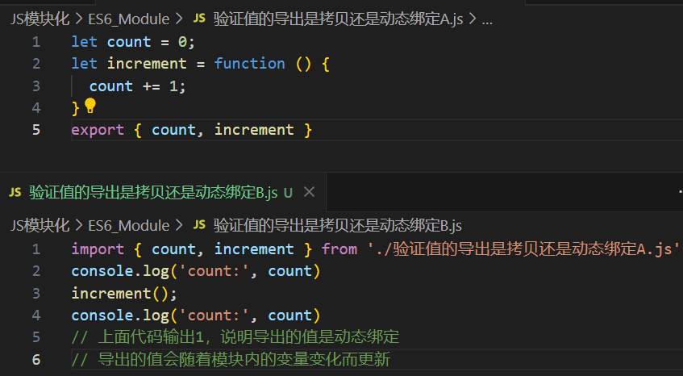
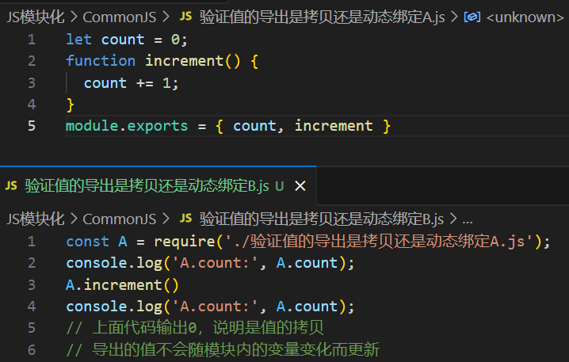

# 1. module.exports && exports

[CommonJS规范](../Node/02 高级Node.md#30-commonjs规范)

# 2. ES6中模块的执行顺序

在 ES6 模块（也称为 ECMAScript 模块）中，当模块 `B` 引入模块 `A`，执行顺序如下：

1. **加载模块 `B`**：Node.js 或浏览器首先开始**加载**模块 `B`。

2. **加载模块 `A`**：在加载 `B` 的过程中，Node.js 或浏览器会发现 `B` 依赖于模块 `A`（例如通过 `import A from './A';`），因此需要**加载和执行**模块 `A`。这意味着**模块 `A` 的代码会在 `B` 模块的代码之前被执行**。

3. **执行模块 `A`**：模块 `A` 会被执行，模块的导出会被计算并缓存。

4. **继续执行模块 `B`**：一旦模块 `A` 被加载并执行完成，Node.js 或浏览器会继续执行模块 `B` 中的剩余代码。

# 3. CommonJS中模块的执行顺序

在 CommonJS 模块系统中，模块 `B` 引入模块 `A` 的执行顺序如下：

1. **加载模块 `B`**：Node.js 首先开始加载模块 `B`。在 `B` 模块的代码中，如果有 `require('./A')`，Node.js 会遇到这个依赖并决定去加载模块 `A`。
2. **加载模块 `A`**：为了满足 `B` 的依赖，Node.js 会加载和执行模块 `A`。这意味着 **`A` 模块的代码会在 `B` 模块代码的==其余部分==之前被执行**。
3. **执行模块 `A`**：模块 `A` 会被执行，并且其导出的内容会被缓存。
4. **继续执行模块 `B`**：一旦模块 `A` 被执行并缓存，Node.js 会继续执行模块 `B` 中剩下的代码。

光看上面的描述，感觉两者没啥区别，还需更多学习！

# [4. 处理循环依赖](https://www.ruanyifeng.com/blog/2015/11/circular-dependency.html)

> circular dependency

| ES6 Modules | CommonJS                                           |
| ----------- | -------------------------------------------------- |
|             | https://nodejs.org/api/modules.html#modules_cycles |

# 5. ES6模块和CommonJS模块的区别

|              | ES6 Modules                                                  | CommonJS                                                     |
| ------------ | ------------------------------------------------------------ | ------------------------------------------------------------ |
| 导入         | import                                                       | require()                                                    |
| 导出         | export                                                       | module.exports \|\| exports                                  |
| 加载方式     | 采用**异步加载**的方式                                       | 模块是在代码执行到`require`时加载，采用**同步加载**方式      |
|              |                                                              |                                                              |
| 值的导出机制 | **导出的值会随着模块内的变量变化而更新**                     | **导出的值不会随模块内的变量变化而更新(如count)**<br />即拷贝。<br />但是导出 `increment` 函数时，是导出该函数的引用 |
|              |  |  |
|              |                                                              |                                                              |
| 取值         | 不会缓存运行结果，而是动态地去被加载的模块取值（见moduleAA.js和moduleBB.js） | 会缓存运行结果，之后到缓存中取值                             |
|              |                                                              |                                                              |
| 模块加载机制 | 采用静态加载机制，模块在**编译时**就确定了模块依赖关系<br>这使得ES6模块在编译阶段就可以进行静态分析<br>例如使用tree-shaking来除去未使用的代码 |                                                              |
| 顶层this值   | 顶层this的值是undefined                                      | 顶层this的值是当前模块的exports                              |


commonjs是用在服务器端

* 根据CommonJS规范，一个单独的文件就是一个模块。加载模块使用require方法，该方法读取一个文件并执行，最终返回文件内部的exports对象
* NodeJS主要用于服务器的编程，加载的模块文件一般都已经存在于本地硬盘，所以加载起来快，不用考虑异步加载的方式，所以CommonJS规范比较适用
* 但如果是浏览器环境，要从服务器加载模块，这就必须采用异步加载模式，所以就有了AMD，CMD解决方案

amd，cmd是用在浏览器端，异步的，如requirejs和seajs

​	AMD是RequireJS在推广过程中对模块定义的规范化产出。

ES6模块和CommonJS模块的区别：

https://blog.csdn.net/qq_36772866/article/details/88757140

ES6模块：

* ES6模块中的值属于”动态只读引用“
  * 对于只读来说，即不允许修改引入变量的值，import的变量是只读的，不论是基本数据类型还是复杂数据类型
  * 对于动态来说，原始值发生变化，import加载的值也会发生变化。不论是基本数据类型还是复杂数据类型
* 当模块遇到import命令时，就会生成一个只读引用.等到脚本真正执行时，再根据这个只读引用，到被加载的那个模块里面去取值

CommonJS模块：

* 当使用require命令加载某个模块时，就会运行整个模块的代码
* 当使用require命令加载同一模块时，不会再执行该模块，而是取到缓存之中的值。也就是说，CommonJS模块无论加载多少次，都只会在第一次加载时运行一次，以后再加载，就返回第一次运行的结果，除非手动清除系统缓存。
* 循环加载时，属于加载时执行。即脚本代码在require的时候，就会全部执行。一旦出现某个模块被”循环加载“，就只输出已经执行的部分还未执行的部分不会输出。

对于基本数据类型属于复制；对于复杂数组数据类型，属于浅拷贝

# babel-node

`babel-node` 是 Babel 提供的一个工具，它允许你直接在 Node.js 环境中运行使用了 Babel 转译的代码。主要作用如下：

1. **即刻执行**：它让你可以直接运行用 ES6+ 语法编写的 JavaScript 代码，而不需要先将代码转译成旧版 JavaScript。`babel-node` 自动处理这些转译工作，确保你可以使用最新的 JavaScript 特性。

2. **开发环境**：它通常用于开发阶段，以便于测试和调试代码。对于生产环境，通常推荐使用 `babel-cli` 或其他构建工具预先转译代码，以提高运行效率。

3. **兼容性**：在使用 `babel-node` 时，可以通过 Babel 的配置来处理各种 JavaScript 的新特性和语法扩展，确保代码在 Node.js 中能够正常运行。

示例用法：

```bash
babel-node script.js
```

这条命令会使用 Babel 转译并运行 `script.js` 文件中的代码。

要使用 `babel-node`，你需要按照以下步骤操作：

1. **安装依赖**：首先，确保你已经安装了 Babel 相关的依赖。你可以通过 npm 来安装 `@babel/core` 和 `@babel/node`，以及你需要的 Babel 插件和预设。

   ```bash
   npm install --save-dev @babel/core @babel/node @babel/preset-env
   ```

2. **配置 Babel**：在项目根目录下创建一个 Babel 配置文件（`babel.config.json` 或 `.babelrc`）。下面是一个简单的配置示例，使用 `@babel/preset-env` 预设来转译 ES6+ 代码：

   ```json
   {
     "presets": ["@babel/preset-env"]
   }
   ```

3. **运行代码**：使用 `babel-node` 来运行你的 JavaScript 文件。例如，如果你的文件名是 `app.js`，你可以这样执行：

   ```bash
   npx babel-node app.js
   ```

   `npx` 是 npm 自带的工具，可以执行本地安装的命令。如果你在项目中全局安装了 `babel-node`，可以直接用 `babel-node` 命令：

   ```bash
   babel-node app.js
   ```

4. **可选 - 添加脚本**：为了简化运行过程，可以在 `package.json` 文件中添加一个 npm 脚本。这样你就可以使用 `npm run` 命令来运行 `babel-node`。

   ```json
   {
     "scripts": {
       "start": "babel-node app.js"
     }
   }
   ```

   然后你可以用以下命令来运行你的脚本：

   ```bash
   npm run start
   ```

使用 `babel-node` 可以方便地测试和开发现代 JavaScript 代码，但请注意，它不适用于生产环境，因为每次运行时都需要进行实时转译，这会影响性能。在生产环境中，建议使用 Babel 转译工具提前处理你的代码。