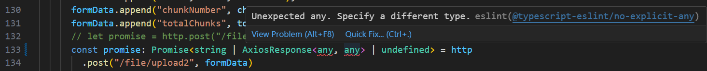

# 1. ESLint

ESLint 是一个广泛使用的 JavaScript 和 TypeScript 代码质量和风格检查工具，它的作用是帮助开发者发现和修复代码中的潜在问题，确保代码的一致性、质量和可维护性。ESLint 可以通过自定义规则或集成已有的规范（如 Airbnb 或 Google 的代码规范）来满足团队或个人的代码风格要求。

### ESLint 的特点
1. **高度可配置**：ESLint 支持开发者自定义规则或扩展现有的规则，能够灵活适应项目需求。
2. **支持插件**：ESLint 允许通过插件扩展其功能，能够针对特定的框架或语言（如 React、Vue、TypeScript）进行检查。
3. **集成与自动修复**：ESLint 可以与编辑器、构建工具集成，自动检查并在可能的情况下自动修复代码中的问题。
4. **支持多语言和框架**：除了 JavaScript，ESLint 还支持 TypeScript、JSX、TSX、Vue 和 HTML 等。

### ESLint 的工作方式
ESLint 的工作原理是根据一组预定义的规则分析代码。这些规则可以是内置的，也可以通过插件和扩展配置来添加。每条规则都会检查代码中的某些特定模式，并提供修复建议或直接自动修复。

### ESLint 常见规则分类
ESLint 的规则分为不同的类别，每个类别包含了不同的规则，用来检测代码中的特定问题。以下是一些常见规则分类及其示例：

#### 1. **可能的错误 (`Possible Errors`)**
   这些规则检查代码中可能出现的实际错误，例如拼写错误、逻辑错误等。
   - **`no-console`**：禁止使用 `console`，以防止调试时忘记删除。
     ```json
     {
       "rules": {
         "no-console": "warn"
       }
     }
     ```
   
   - **`no-undef`**：禁止使用未声明的变量。
     ```json
     {
       "rules": {
         "no-undef": "error"
       }
     }
     ```

#### 2. **最佳实践 (`Best Practices`)**
   这些规则鼓励更好的代码风格和结构，防止潜在的逻辑错误。
   - **`eqeqeq`**：要求使用全等 `===` 和 `!==` 代替宽松等于 `==` 和 `!=`。
     ```json
     {
       "rules": {
         "eqeqeq": "error"
       }
     }
     ```
   
   - **`curly`**：强制所有控制语句使用大括号 `{}`。
     ```json
     {
       "rules": {
         "curly": "error"
       }
     }
     ```

#### 3. **变量声明 (`Variables`)**
   这些规则处理变量声明及其作用域问题，确保变量的可读性和可维护性。
   - **`no-unused-vars`**：禁止定义了但未使用的变量。
     ```json
     {
       "rules": {
         "no-unused-vars": "warn"
       }
     }
     ```

   - **`no-shadow`**：禁止变量在外层作用域已定义的情况下被重新定义。
     ```json
     {
       "rules": {
         "no-shadow": "error"
       }
     }
     ```

#### 4. **代码风格 (`Stylistic Issues`)**
   这些规则强制一致的代码风格，以增强可读性和团队协作。
   - **`indent`**：控制代码缩进，默认是 2 格空格。
     ```json
     {
       "rules": {
         "indent": ["error", 2]
       }
     }
     ```
   
   - **`quotes`**：要求使用单引号还是双引号。
     ```json
     {
       "rules": {
         "quotes": ["error", "single"]
       }
     }
     // error表示ESLint会将不符合此规则的代码标记为错误。还有其他选项如warn或off
     ```

#### 5. **ES6 相关规则 (`ECMAScript 6`)**
   这些规则处理 ECMAScript 6 及其以上的语法使用，确保代码的现代性和一致性。
   - **`arrow-parens`**：强制箭头函数参数使用括号。
     ```json
     {
       "rules": {
         "arrow-parens": ["error", "always"]
       }
     }
     ```

   - **`prefer-const`**：如果变量从未重新赋值，要求使用 `const` 声明。
     ```json
     {
       "rules": {
         "prefer-const": "error"
       }
     }
     ```

### ESLint 的使用

#### 1. **安装 ESLint**
   ESLint 可以通过 npm 安装，通常作为项目的开发依赖。
   ```bash
   npm install --save-dev eslint
   ```

#### 2. **初始化 ESLint 配置**
   在项目根目录运行以下命令来生成 ESLint 的配置文件：
   ```bash
   npx eslint --init
   ```
   根据提示选择以下内容：
   - **要检测的代码类型**（如 JavaScript、TypeScript、React 等）。
   - **使用的模块系统**（如 CommonJS 或 ES Modules）。
   - **使用的 JavaScript 版本**。
   - **选择一个代码风格指南**（如 Airbnb 或 Google 的风格指南）。
   - **使用 JSON、YAML 或 JavaScript 格式的配置文件**。

   这将生成一个 `.eslintrc` 文件，其中包含 ESLint 的基础配置。

跑上面命令的时候提示：

```shell
You can also run this command directly using 'npm init @eslint/config@latest'.
Need to install the following packages:     
@eslint/create-config@1.3.1
```

#### 3. **基本命令**
   使用以下命令运行 ESLint 来检测代码中的问题：
   ```bash
   npx eslint <file or directory>
   ```

   - **自动修复**：添加 `--fix` 选项可以自动修复代码中某些类型的错误。
     ```bash
     npx eslint --fix src/
     ```

#### 4. **配置 ESLint**
   ESLint 的配置文件可以是 `.eslintrc.json`、`.eslintrc.yml` 或 `.eslintrc.js`。以下是一个典型的 `.eslintrc.json` 配置文件：
   ```json
   {
     "env": {
       "browser": true,
       "node": true,
       "es6": true
     },
     "extends": "eslint:recommended",
     "parserOptions": {
       "ecmaVersion": 2021,
       "sourceType": "module"
     },
     "rules": {
       "semi": ["error", "always"],
       "quotes": ["error", "single"],
       "no-console": "warn",
       "indent": ["error", 2]
     }
   }
   ```

#### 5. **与编辑器集成**
   ESLint 可以与大多数现代编辑器集成，以便在开发过程中即时查看代码中的问题。例如：
   - **VSCode**：可以通过安装 ESLint 插件来在代码编写时自动提示问题。配置 ESLint 插件后，可以在 `settings.json` 中配置保存时自动修复：
     ```json
     {
       "editor.codeActionsOnSave": {
         "source.fixAll.eslint": true
       }
     }
     ```

#### 6. **与 Prettier 集成**
   ESLint 和 Prettier 常常一起使用，其中 ESLint 负责代码质量检查，Prettier 负责代码格式化。为了让两者协作，可以使用 `eslint-config-prettier` 禁用与格式相关的 ESLint 规则。

   **步骤**：
   1. 安装相关依赖：
      ```bash
      npm install --save-dev eslint-config-prettier eslint-plugin-prettier
      ```

   2. 修改 `.eslintrc.json` 配置，禁用 ESLint 中与格式相关的规则：
      ```json
      {
        "extends": [
          "eslint:recommended",
          "plugin:prettier/recommended"
        ],
        "rules": {
          "prettier/prettier": "error"
        }
      }
      ```

#### 7. **与 Git Hook 集成**
   通过工具如 `husky` 和 `lint-staged`，可以在提交代码前自动运行 ESLint 检查，从而保证提交到代码仓库的代码是符合规范的。

   **步骤**：
   1. 安装 `husky` 和 `lint-staged`：
      ```bash
      npm install --save-dev husky lint-staged
      ```

   2. 在 `package.json` 中添加以下配置：
      ```json
      {
        "husky": {
          "hooks": {
            "pre-commit": "lint-staged"
          }
        },
        "lint-staged": {
          "*.js": ["eslint --fix", "git add"]
        }
      }
      ```

   这会在每次提交前自动运行 ESLint 并修复代码中的问题。

### ESLint 规则级别
在 ESLint 的配置文件中，规则可以有不同的级别：
- **"off"**：关闭规则。
- **"warn"**：触发警告，不会阻止代码运行。
- **"error"**：触发错误，阻止代码的正常运行。

**示

例**：
```json
{
  "rules": {
    "no-console": "warn",  // 仅警告
    "eqeqeq": "error"      // 报错并阻止代码运行
  }
}
```

### 总结
ESLint 是一个强大的代码检查工具，能够帮助开发者保持代码的一致性和高质量。通过自定义规则、插件和与编辑器或构建工具的集成，ESLint 在现代 JavaScript 和 TypeScript 项目中扮演了重要角色。

# 2. Prettier

Prettier 是一款广泛使用的代码格式化工具，它通过一组严格的格式化规则来自动化代码排版，确保代码风格一致性。Prettier 支持多种编程语言和配置文件，通过集成到编辑器或代码版本管理工具（如 Git）中，能显著提升团队合作时的代码可读性和维护性。

### Prettier 的特点

1. **自动格式化**：Prettier 不依赖于手动格式化，它会根据预设规则自动修改代码的缩进、空格、括号、引号等，使代码符合统一风格。

2. **无偏见的格式化**：Prettier 追求尽量消除代码风格上的争论。它遵循固定的规则，而不是让开发者自行决定过多细节，如单行代码是否需要换行等问题。

3. **支持多种语言**：Prettier 支持包括 JavaScript、TypeScript、CSS、HTML、Markdown 等在内的多种编程语言，使其适用于多种前端和后端开发项目。

4. **与多种工具集成**：Prettier 可以与编辑器（如 VSCode、Sublime Text 等）和开发工具（如 ESLint、Git hooks 等）轻松集成，方便自动格式化。

### 常见 Prettier 规则

Prettier 默认提供了一组核心的格式化规则，但开发者也可以根据项目需求自定义一些设置。以下是 Prettier 常用的一些规则：

#### 1. **Print Width (`printWidth`)**

   - **默认值**: 80

   - 用于控制一行最大字符数，超出部分自动换行。

   - **示例**：

     ```json
     {
       "printWidth": 100
     }
     ```

#### 2. **Tab Width (`tabWidth`)**

   - **默认值**: 2

   - 控制代码缩进中 tab 键的宽度，单位为空格数。

   - **示例**：

     ```json
     {
       "tabWidth": 4
     }
     ```

#### 3. **Use Tabs (`useTabs`)**

   - **默认值**: `false`

   - 控制缩进使用 tab (`true`) 还是空格 (`false`)。

   - **示例**：

     ```json
     {
       "useTabs": true
     }
     ```

#### 4. **Semi (`semi`)**

   - **默认值**: `true`

   - 控制是否在语句末尾添加分号。

   - **示例**：

     ```json
     {
       "semi": false
     }
     ```

#### 5. **Single Quote (`singleQuote`)**

   - **默认值**: `false`

   - 控制是否使用单引号 (`true`) 代替双引号。

   - **示例**：

     ```json
     {
       "singleQuote": true
     }
     ```

#### 6. **Trailing Comma (`trailingComma`)**

   - **默认值**: `"es5"`

   - 控制对象、数组等数据结构中，最后一个元素后是否允许使用逗号。

   - 可选值：`"none"`（不允许尾随逗号）、`"es5"`（允许在 ES5 有效的地方添加尾随逗号）、`"all"`（在可能的地方都添加尾随逗号）。

   - **示例**：

     ```json
     {
       "trailingComma": "all"
     }
     ```

#### 7. **Bracket Spacing (`bracketSpacing`)**

   - **默认值**: `true`

   - 控制对象字面量中的括号前后是否留有空格。

   - **示例**：

     ```json
     {
       "bracketSpacing": false
     }
     ```

#### 8. **Arrow Parens (`arrowParens`)**

   - **默认值**: `"always"`

   - 控制箭头函数的参数是否强制加上括号。

   - **可选值**：`"always"`（总是加括号）、`"avoid"`（当只有一个参数时可以省略括号）。

   - **示例**：

     ```json
     {
       "arrowParens": "avoid"
     }
     ```

#### 9. **End of Line (`endOfLine`)**

   - **默认值**: `"lf"`

   - 控制换行符风格，适用于跨平台项目，避免 Windows 和 Unix 的换行符差异问题。

   - **可选值**：`"lf"`（Line Feed）、`"crlf"`（Carriage Return + Line Feed）、`"cr"`（Carriage Return）、`"auto"`（保持文件现有风格）。

   - **示例**：

     ```json
     {
       "endOfLine": "auto"
     }
     ```

### Prettier 的使用

#### 1. **安装 Prettier**

   Prettier 可以通过 npm 安装：

   ```bash
npm install --save-dev prettier
   ```

#### 2. **基本命令**

   一旦安装好 Prettier，你可以在命令行中运行以下命令来格式化文件：

   ```bash
npx prettier --write <file or directory>
   ```

   - `--write`：这个选项会直接覆盖原文件，将其格式化。

   - 例如：

     ```bash
     npx prettier --write src/
     ```

#### 3. **配置 Prettier**

   Prettier 的配置文件可以是以下几种格式之一，并放置在项目的根目录下：

   - `.prettierrc`：JSON 或 YAML 格式的配置文件。
   - `prettier.config.js`：JavaScript 格式的配置文件。

   **示例 `.prettierrc` 配置：**

   ```json
{
  "printWidth": 100,
  "tabWidth": 4,
  "useTabs": false,
  "semi": true,
  "singleQuote": true,
  "trailingComma": "all",
  "bracketSpacing": true,
  "arrowParens": "avoid"
}
   ```

#### 4. **与编辑器集成**

   Prettier 可以集成到各种编辑器中，常见的有：

   - **VSCode**：安装 Prettier 插件后，可以设置在保存文件时自动格式化。

     - 打开 `settings.json`，添加如下设置：

       ```json
       {
         "editor.formatOnSave": true,
         "prettier.singleQuote": true,
         "prettier.trailingComma": "all"
       }
       ```

   - **WebStorm**、**Sublime Text** 等编辑器也有相应的 Prettier 插件可用，具体操作根据编辑器而定。


#### 5. **与 ESLint 集成**

   **Prettier 和 ESLint 通常配合使用，Prettier 处理代码的格式化，ESLint 负责代码风格和语法检查**。要让两者一起工作，可以通过 `eslint-config-prettier` 来禁用 ESLint 中与格式相关的规则。

   **集成步骤**：

   1. 安装相关依赖：

      ```bash
      npm install --save-dev eslint-config-prettier eslint-plugin-prettier
      ```

   2. 修改 `.eslintrc.js` 文件，添加 Prettier 配置：

      ```javascript
      module.exports = {
        extends: [
          'eslint:recommended',
          'plugin:prettier/recommended'  // 使用 eslint-plugin-prettier 来自动格式化
        ],
        rules: {
          // 其他 ESLint 规则
        }
      }
      ```

### 结论

Prettier 是一个非常有用的工具，它可以帮助团队统一代码风格，减少手动格式化带来的麻烦。通过配置 `.prettierrc` 文件或与 ESLint、编辑器集成，开发者可以自动化代码格式化工作，从而提高开发效率。

# 3. ESLint和Prettier

ESLint 和 Prettier 都是前端开发中常用的工具，但它们的功能有所不同，且可以互相结合使用来提升代码质量和一致性。

### **ESLint**
ESLint 是一个静态代码分析工具，用于发现和修复 JavaScript、TypeScript 等语言中的 **代码质量问题**。它的主要功能是：
- **检查代码中的语法错误**（比如变量未定义）。
- **强制执行代码风格规则**（如使用 `===` 而不是 `==`，或变量命名规范）。
- 支持定制化规则和扩展插件来根据项目需求调整代码规范。

### **Prettier**
Prettier 是一个代码格式化工具，专注于 **自动格式化代码风格**，它的主要功能是：
- 根据预定义的风格指南（例如统一缩进、引号类型、行尾符号）来自动调整代码的外观。
- Prettier 不会关心代码质量或逻辑正确性，而是专注于让代码的排版更整齐一致。

### **两者的区别**
- **ESLint** 主要是为了确保代码质量和防止潜在的错误，例如变量未使用、错误的代码逻辑、冗余代码等。
- **Prettier** 主要是为了确保代码格式统一，例如缩进、分号、换行等，不关心代码的逻辑对错。

### **如何结合使用**
通常情况下，ESLint 和 Prettier 可以结合使用，确保代码既 **符合格式要求**，又 **无逻辑错误**。结合使用时的步骤如下：

1. **安装 ESlint 和 Prettier**
   首先，在项目中安装 ESLint 和 Prettier：
   ```bash
   npm install eslint prettier eslint-plugin-prettier eslint-config-prettier --save-dev
   ```

2. **配置 ESLint**
   在项目根目录下创建 `.eslintrc.js` 文件，并在其中添加配置。你可以使用 `eslint-plugin-prettier` 插件来让 ESLint 通过 Prettier 来处理格式化规则：
   
   ```js
   module.exports = {
     extends: [
       'eslint:recommended',    // 基本的 ESLint 规则
       'plugin:prettier/recommended',  // 将 prettier 集成到 eslint 中
     ],
     rules: {
       'prettier/prettier': 'error',  // 把 prettier 的问题标记为错误
       // 其他 ESLint 规则
     },
   };
   ```
   
3. **禁用 ESLint 中的格式化规则**
   为了避免 ESLint 和 Prettier 之间的冲突，可以使用 `eslint-config-prettier` 来禁用 ESLint 中与 Prettier 冲突的规则：
   ```bash
   npm install --save-dev eslint-config-prettier
   ```

   然后，在 `.eslintrc.js` 中添加：
   ```js
   extends: ['eslint:recommended', 'prettier'],
   ```

4. **使用 Prettier 格式化代码**
   在项目中添加一个 `.prettierrc` 文件，来配置 Prettier 的格式化规则，例如：
   ```json
   {
     "singleQuote": true,
     "semi": false,
     "trailingComma": "es5"
   }
   ```

5. **结合 VSCode 使用**
   配合 VSCode 等编辑器可以进一步简化开发流程。可以通过安装 ESLint 和 Prettier 插件，使得在保存时自动格式化代码：
   - 在 `settings.json` 中，添加以下配置，确保保存时自动格式化：
     ```json
     "editor.formatOnSave": true,
     "editor.codeActionsOnSave": {
       "source.fixAll.eslint": true
     }
     ```

### 总结
- **ESLint** 负责发现和修复代码质量问题。
- **Prettier** 负责自动化地格式化代码风格。
- **eslint-plugin-prettier** 让 ESLint 使用 Prettier 来检查格式化问题，而 **eslint-config-prettier** 则确保两者的规则不会冲突。

通过结合使用，可以有效保证代码既符合代码质量规范，又有一致的格式风格。

# 4. npx eslint --init报错

```shell
You can also run this command directly using 'npm init @eslint/config@latest'.
Need to install the following packages:     
@eslint/create-config@1.3.1
```

报错信息的核心提示是：**你正在尝试运行 `npx eslint --init`，但该命令依赖于尚未安装的包 `@eslint/create-config@1.3.1`**。报错同时建议你可以通过直接使用 `npm init @eslint/config@latest` 命令来完成 ESLint 的初始化。

让我们逐步分析这个提示：

### 1. **"You can also run this command directly using 'npm init @eslint/config@latest'"**

- 这是提示你可以使用更现代和官方推荐的方式来初始化 ESLint 配置，即使用 `npm init @eslint/config@latest`，它会自动执行所有初始化流程并安装最新的依赖。
- 在新版的 ESLint 中，`npx eslint --init` 这种初始化方式逐渐被 `npm init @eslint/config` 所取代，因为后者可以自动更新并更好地管理配置生成工具。
  
### 2. **"Need to install the following packages: @eslint/create-config@1.3.1"**

- 这个信息表示，当前你运行的命令（`npx eslint --init`）依赖于 `@eslint/create-config` 包，而这个包在你的项目中还没有被安装。
- `@eslint/create-config` 是用来生成 ESLint 配置的工具包，确保你可以顺利初始化 ESLint 的配置文件（比如 `.eslintrc`）。

### **解决办法**

有两种主要的解决方法：

#### 1. **使用推荐的命令 `npm init @eslint/config@latest`**
   - 你可以按照提示直接运行：
     ```bash
     npm init @eslint/config@latest
     ```
   - 这个命令会自动安装所需的 `@eslint/create-config` 包，并引导你完成 ESLint 初始化过程。完成后，它会生成 `.eslintrc` 配置文件，指导 ESLint 如何在你的项目中应用代码检查规则。

#### 2. **手动安装依赖并运行 `npx eslint --init`**
   - 如果你更倾向于继续使用 `npx eslint --init`，你可以先手动安装依赖包：
     ```bash
     npm install @eslint/create-config --save-dev
     ```
   - 然后，重新运行 `npx eslint --init` 来初始化 ESLint。

   这样也可以达到相同的效果，但需要你手动安装这个必要的包。

### **为什么会有这个报错？**

在早期版本中，`npx eslint --init` 是默认的初始化命令，但随着 ESLint 生态的不断更新，官方引入了 `@eslint/create-config` 来管理初始化配置的生成工具，并推荐通过 `npm init @eslint/config` 来简化整个初始化过程。这意味着 ESLint 正在逐步鼓励开发者使用更现代的命令来初始化项目，而不是手动处理依赖。

### **总结**
- 报错的原因是因为 `@eslint/create-config` 这个依赖包尚未安装，导致 `npx eslint --init` 无法正常工作。
- 你可以通过直接运行 `npm init @eslint/config@latest` 来解决问题，自动安装所需包并完成初始化流程。
- 也可以手动安装依赖后再运行 `npx eslint --init`，但这略显繁琐。

推荐使用官方建议的命令 `npm init @eslint/config@latest`，这是更简洁和现代的方式。

# 5. ESLint配置文件生成过程

## How would you like to use ESLint? 

To check syntax only 

To check syntax and find problems 

这两个选项的区别在于 **ESLint 进行代码检查的深度** 和 **检查的内容**：

1. **To check syntax only（仅检查语法）**
   - 选择这个选项时，ESLint **只会检查代码的语法错误**，例如语法结构是否正确、是否有未闭合的括号、未声明的变量等。这种模式相当于基本的语法验证器，比如 JavaScript 编译器的工作。
   - 这种配置不会执行额外的代码质量检查，也不会检查代码的最佳实践或风格规范。

   **适用场景**：
   - 如果你只关心代码是否能够正确运行，而不在意代码风格或潜在的逻辑错误。
   - 适合初期阶段，只想确保代码是合法的 JavaScript。

2. **To check syntax and find problems（检查语法并查找问题）**
   - 选择这个选项时，ESLint 不仅会检查语法错误，还会**查找潜在的代码质量问题**，例如变量未使用、变量未声明、潜在的逻辑错误、不安全的代码实践等。
   - 此外，这个选项通常还包含一些 **风格检查**，比如强制使用单引号还是双引号、行尾分号等（具体取决于你安装的 ESLint 规则集）。

   **适用场景**：
   - 如果你希望代码不仅没有语法错误，还遵循良好的编码规范，并减少常见的错误（如未处理的异常、未定义的变量）。
   - 适合于项目开发中的质量控制阶段，帮助你保持更高的代码质量。

### 举例
- **语法错误**（syntax errors）：这类问题会导致代码无法运行，比如：
  ```js
  const x = ;
  ```
  这里 `const x = ;` 是语法错误，无法执行。

- **问题检查**（problems）：这些问题可能不会导致代码立刻报错，但它们暗示了潜在的风险或代码质量问题，比如：
  ```js
  const x = 5;
  console.log(y); // 变量 y 未定义，潜在错误
  ```

### 总结
- **"To check syntax only"** 只关注代码的合法性，确保没有语法错误。
- **"To check syntax and find problems"** 则会在此基础上进一步查找代码中的潜在问题和错误，帮助你提升代码质量。

一般来说，选择 **"To check syntax and find problems"** 会更有助于编写高质量的代码。

为什么在生成ESLint配置文件的过程中缺少To check syntax，find problems，and enforce code style这一项

版本差异导致

## What type of modules does your project use? 

JavaScript modules (import/export)

CommonJS (require/exports)

None of these

## Which framework does your project use? 

React
Vue.js
None of these

```shell
The config that you've selected requires the following dependencies:

eslint, globals, @eslint/js, typescript-eslint, eslint-plugin-react 
? Would you like to install them now?
```

## 最终文件 eslint.config.mjs

```js
import globals from "globals";
import pluginJs from "@eslint/js";
import tseslint from "typescript-eslint";
import pluginReact from "eslint-plugin-react";


export default [
  {files: ["**/*.{js,mjs,cjs,ts,jsx,tsx}"]},
  {languageOptions: { globals: globals.browser }},
  pluginJs.configs.recommended,
  ...tseslint.configs.recommended,
  pluginReact.configs.flat.recommended,
];
```

```js
// 这是一个提供全局变量的模块，支持不同环境(如浏览器，NodeJ等)中的全局变量
import globals from "globals";
// 引入ESLint官方提供的JS规则插件
import pluginJs from "@eslint/js";
// 这是一个支持TS的ESLint插件，提供了针对TypeScript的解析和规则
import tseslint from "typescript-eslint";
// 引入了React相关的ESLint插件，提供了React特有的规则和配置
import pluginReact from "eslint-plugin-react";
import { rules } from "@eslint/js/src/configs/eslint-all";

export default [
  // 这个对象指定了要检查的文件类型。它匹配所有的JS和TS文件
  { files: ["**/*.{js,mjs,cjs,ts,jsx,tsx}"] },
  // 这个对象定义了语言选项，包括全局变量。使用globals.browser，
  // 这意味着在ESLint检查时会识别浏览器环境下的全局变量（例如window，document）
  { languageOptions: { globals: globals.browser } },
  // pluginJs.configs.recommended是ESLint官方JS插件提供的推荐配置，
  // 包含了一些最佳实现和常见的代码风格规则
  pluginJs.configs.recommended,
  // 这个推荐配置包含了 TypeScript 特有的规则，确保 TypeScript 代码的质量和风格一致性
  ...tseslint.configs.recommended,
  // 这个配置引入了 React 插件的推荐配置，适用于 React 项目中的 JSX 语法和组件开发。
  // 这将包含针对 React 的特定规则，如 prop-types 的使用和组件命名等
  pluginReact.configs.flat.recommended,
  {
    rules: {
      "quotes": ["error", "single"],
      "no-unused-vars": "error"
    }
  }
];
```


```js
import globals from "globals";
import pluginJs from "@eslint/js";
import tseslint from "typescript-eslint";
import pluginReact from "eslint-plugin-react";


export default [
  {files: ["**/*.{js,mjs,cjs,ts,jsx,tsx}"]},
  {languageOptions: { globals: globals.browser }},
  pluginJs.configs.recommended,
  ...tseslint.configs.recommended,
  pluginReact.configs.flat.recommended,
];
```


# 6. 为什么生成eslint.config.mjs，而不是`.eslintrc.json`、`.eslintrc.yml` 或 `.eslintrc.js`

生成 `eslint.config.mjs` 文件而不是 `.eslintrc.json`、`.eslintrc.yml` 或 `.eslintrc.js` 文件的原因主要与 **ESLint 的新配置格式** 以及 **模块系统** 的变化有关。以下是具体的解释：

### 1. **新配置格式的引入**

从 **ESLint 8.0** 开始，ESLint 引入了一种新的配置格式，允许使用 ECMAScript 模块（ESM）来定义 ESLint 配置。这种新格式的文件扩展名通常为 `.mjs`，表示该文件是一个模块化的 JavaScript 文件。

- **优势**：
  - 使用 ESM 的配置文件可以更灵活地导入和导出配置，比如可以动态加载配置、使用环境变量、使用 JavaScript 逻辑等。
  - 这种格式使得配置文件可以更容易地适应不同的开发环境和需求，能够支持更复杂的配置逻辑。

### 2. **与模块系统的兼容性**

- **`.mjs` 文件**：这类文件明确标识为使用 ESM 的模块，这意味着你可以使用 `import` 和 `export` 语法，这在现代 JavaScript 中越来越普遍。
  
- **`.eslintrc.*` 文件**：这些文件（如 `.eslintrc.json`、`.eslintrc.yml` 和 `.eslintrc.js`）都是 ESLint 之前的传统配置格式。虽然 `.eslintrc.js` 仍然可以使用，但使用 `.mjs` 文件能够提供更好的模块化支持。

### 3. **统一性和一致性**

生成 `eslint.config.mjs` 文件有助于统一 ESLint 的配置方式，避免混乱。无论是对于小型项目还是大型项目，使用一致的配置格式使得开发人员更容易理解和维护配置文件。

### 4. **自动化和工具支持**

使用 `eslint.config.mjs` 文件时，可以更好地与现代工具和构建系统集成（如 Webpack、Babel 等）。这使得 ESLint 能够在复杂的开发环境中更容易地处理各种配置需求。

### 总结

- **选择生成 `eslint.config.mjs` 文件** 是出于引入新的配置格式和模块系统支持的考虑，旨在提供更大的灵活性和兼容性。
- **`.mjs` 文件** 允许使用 ESM 特性，可以更方便地处理复杂的配置逻辑。
- 对于需要使用传统配置文件的项目，仍然可以使用 `.eslintrc.json`、`.eslintrc.js` 和 `.eslintrc.yml` 等格式，但新的 ESM 格式提供了更现代的解决方案。

# 7. .prettierrc文件

```
{
  "printWidth": 80,
  "useTabs": false,
  "tabWidth": 2,
  "semi": true,
  "singleQuote": false
}
```

# 8. Vscode Format Document With


为什么VScode在格式化文档的时候会出现这两个选项，跟vscode安装的插件有关系吗

是的，**VSCode 在格式化文档时出现多个选项**，是与安装的插件有直接关系的。

### 出现这两个选项的原因：

1. **Prettier - Code formatter**：
   - 这是一个流行的代码格式化工具插件，专门用于格式化各种语言的代码，包括 JavaScript、TypeScript、CSS、HTML 等。
   - 当你安装了 Prettier 插件后，它会成为默认的代码格式化工具之一，并出现在格式化选项中。

2. **TypeScript and JavaScript Language Features**：
   - 这是 VSCode 内置的语言支持功能，用于提供 JavaScript 和 TypeScript 的语法高亮、错误提示和代码格式化等功能。
   - 如果你没有安装其他代码格式化工具，VSCode 会使用它来进行基础的代码格式化。即使安装了其他工具，这个内置选项仍会保留在列表中。

### 与插件的关系：

- **Prettier 插件**：安装 Prettier 后，它会作为一个专门的格式化工具显示在选项中，提供更强大和可定制的格式化功能。
- **VSCode 内置功能**：`TypeScript and JavaScript Language Features` 是 VSCode 内置的功能，不需要额外安装任何插件。
  
### 如何解决多选项问题：

如果你希望始终使用 **Prettier** 或 **某个特定的格式化工具**，你可以通过以下方式指定：

1. **在 VSCode 设置中指定默认格式化工具**：
   - 打开 VSCode 的设置（`Ctrl + ,`）。
   - 搜索 `Format On Save` 并确保它是启用的。
   - 搜索 `default formatter` 并设置为 `Prettier`：
     ```json
     "editor.defaultFormatter": "esbenp.prettier-vscode"
     ```

2. **为特定的语言设置默认格式化工具**：
   你还可以为不同的文件类型（如 JavaScript 或 TypeScript）指定特定的格式化工具：
   ```json
   "[javascript]": {
     "editor.defaultFormatter": "esbenp.prettier-vscode"
   },
   "[typescript]": {
     "editor.defaultFormatter": "esbenp.prettier-vscode"
   }
   ```

### 总结

出现多个格式化选项是因为你安装了 **Prettier** 插件，并且 VSCode 自带了 **TypeScript 和 JavaScript 的格式化功能**。如果你想简化选择，可以通过指定默认格式化工具来避免冲突。

# 9. vscode settings.json

```json
{
    "files.autoSave": "onFocusChange",
    "window.zoomLevel": 2,
    // 当打开文件夹，Vscode会始终在父文件夹中自动打开Git仓库
    "git.openRepositoryInParentFolders": "always",
    // 禁用删除文件时的确认提示，删除操作不再要求用户确认
    "explorer.confirmDelete": false,
    // 设置为false时，禁用Vscode内置的JavaScript语法验证。这通常时在使用第三方工具(如ESLint)进行语法检查时关闭内置验证的情况
    "javascript.validate.enable": false,
    // 设置为false时，禁用编辑器右侧的小地图视图
    "editor.minimap.enabled": false,
    // 允许与特定的网络主机进行交互，“wsl.localhost”指的是Windows子系统WSL的本地主机地址。这允许编辑器在WSL上工作时访问相关资源
    "security.allowedUNCHosts": ["wsl.localhost"],
    // 设置编辑器的默认格式化工具为Prettier插件，用于自动格式化代码
    "editor.defaultFormatter": "esbenp.prettier-vscode",
    // 启用保存时自动格式化功能。当你保存文件时，vscode会根据已配置的格式化工具自动整理代码
    "editor.formatOnSave": true,
    // 为js文件设置专属的默认格式化工具，这里指定的是VSCode内置的typescript-language-features插件。尽管它是TS语言的功能插件，但也支持JS的格式化
    "[javascript]": {
        "editor.defaultFormatter": "vscode.typescript-language-features"
    },
    // 禁用粘性滚动功能。粘性滚动在编辑大型文件时有时会固定顶层的上下文。这里关闭了该功能
    "editor.stickyScroll.enabled": false,
    // 将编辑器的缩进大小设置为2个空格
    "editor.tabSize": 2,
    // 为TS文件指定Prettier插件作为默认格式化工具
    "[typescript]": {
        "editor.defaultFormatter": "esbenp.prettier-vscode"
    },
    // 在保存时启用ESLint的自动修复功能。”explicit“表示只有在特定的情况下手动调用此操作时才会运行，而不是在每次保存时自动触发
    "editor.codeActionsOnSave": {
        "source.fixAll.eslint": "explicit"
    }
}
```

从上面的 `settings.json` 文件来看，大部分配置是合理的，但有几点设置可能存在冲突或优化的空间。以下是详细分析：

### 可能的冲突和不合理之处

1. **`editor.defaultFormatter` vs. `[javascript]` 中的 `editor.defaultFormatter`**
   - 全局设置了 `editor.defaultFormatter` 为 Prettier (`esbenp.prettier-vscode`)，但是对于 `JavaScript`，你又设置了 `vscode.typescript-language-features` 作为默认格式化工具。
   - 这样在 JavaScript 文件中，Prettier 和 TypeScript 内置格式化工具可能会相互冲突，导致 VSCode 在保存时不知道选择哪个格式化器。
   
   **建议**：
   
   - 如果你想确保 JavaScript 文件使用 Prettier 作为格式化工具，可以在 `[javascript]` 中也使用 `Prettier`。否则，如果你只想用 TypeScript 的内置格式化功能格式化 JavaScript，取消全局 Prettier 的设置即可。
   
   **调整示例**：
   ```json
   "[javascript]": {
     "editor.defaultFormatter": "esbenp.prettier-vscode"
   }
   ```
   
2. **`editor.formatOnSave` vs. `editor.codeActionsOnSave`**
   - `editor.formatOnSave`: 该设置会在保存时自动运行格式化工具（如 Prettier）。
   - `editor.codeActionsOnSave`: 该设置在保存时运行 ESLint 的修复操作。
   
   虽然这两个功能都是自动处理代码的不同方面，一个负责格式化，一个负责代码质量修复，但是如果格式化工具和 ESLint 对同一部分代码都有不同的修复规则，可能会发生冲突。比如，Prettier 强制使用双引号，而 ESLint 可能要求单引号，这会导致保存时两者不断修改同一部分代码。

   **建议**：
   
   - 确保 Prettier 和 ESLint 的规则兼容，尤其是关于格式化（如引号、缩进）的规则，这样可以避免冲突。你可以通过 `eslint-config-prettier` 关闭 ESLint 中与 Prettier 冲突的格式化规则。
   - 使用 `eslint-config-prettier` 结合 ESLint 和 Prettier 会很好地解决这种潜在冲突。
   
   **安装和使用 `eslint-config-prettier`**：
   ```bash
   npm install --save-dev eslint-config-prettier
   ```
   然后在 `.eslintrc.js` 中添加：
   ```javascript
   extends: [
     "eslint:recommended",
     "plugin:prettier/recommended"
   ]
   ```
   
3. **`editor.tabSize` vs. Prettier 的缩进设置**
   - 你全局设置了 `editor.tabSize` 为 `2`，但没有在 Prettier 中明确定义缩进规则。如果 Prettier 的默认缩进规则不同，可能会在保存时出现格式化风格不一致的情况。

   **建议**：
   - 明确在 Prettier 的配置中设置 `tabWidth` 为 `2`，以确保缩进风格一致。
   
   **调整示例**：
   在项目根目录下创建 `.prettierrc` 文件，并添加：
   ```json
   {
     "tabWidth": 2
   }
   ```

4. **`editor.defaultFormatter` 和 `[typescript]` 中的 `editor.defaultFormatter`**
   - 你为 TypeScript 文件专门设置了 Prettier 作为默认格式化工具，但也设置了全局 `editor.defaultFormatter` 为 Prettier。这样虽然不会导致冲突，但 TypeScript 文件的这条设置变得冗余。

   **建议**：
   - 如果 Prettier 作为全局默认格式化器，那 `[typescript]` 的设置可以去掉，简化配置。
   
   **调整示例**：
   ```json
   // 移除这段内容
   "[typescript]": {
     "editor.defaultFormatter": "esbenp.prettier-vscode"
   }
   ```

### 总结调整建议

- **JavaScript** 和 **TypeScript** 格式化工具应该保持一致，优先使用 **Prettier**，这样可以避免多个工具对格式化规则的冲突。
- 使用 **`eslint-config-prettier`** 来关闭 ESLint 与 Prettier 冲突的规则，确保代码在保存时不会被多次修改。
- 明确 Prettier 的 **tabWidth** 设置，以避免缩进不一致。
- 可以移除不必要的配置项，保持设置文件简洁。

通过这些调整，你可以确保 **Prettier**、**ESLint** 和 **VSCode** 的各种格式化规则协调一致，减少冲突，并获得最佳的开发体验。

### 修改前的文件

```json
{
  "files.autoSave": "onFocusChange",
  "window.zoomLevel": 2,
  "git.openRepositoryInParentFolders": "always",
  "explorer.confirmDelete": false,
  "javascript.validate.enable": false,
  "editor.minimap.enabled": false,
  "security.allowedUNCHosts": ["wsl.localhost"],
  "editor.defaultFormatter": "esbenp.prettier-vscode",
  "editor.formatOnSave": true,
  "[javascript]": {
    "editor.defaultFormatter": "vscode.typescript-language-features"
  },
  "editor.stickyScroll.enabled": false,
  "editor.tabSize": 2,
  "[typescript]": {
    "editor.defaultFormatter": "esbenp.prettier-vscode"
  },
  "editor.codeActionsOnSave": {
    "source.fixAll.eslint": "explicit"
  }
}
```

### 修改后的文件

```json
{
  "files.autoSave": "onFocusChange",
  "window.zoomLevel": 2,
  "git.openRepositoryInParentFolders": "always",
  "explorer.confirmDelete": false,
  "javascript.validate.enable": false,
  "editor.minimap.enabled": false,
  "security.allowedUNCHosts": ["wsl.localhost"],
  "editor.defaultFormatter": "esbenp.prettier-vscode",
  "editor.formatOnSave": true,
  "editor.stickyScroll.enabled": false,
  "editor.tabSize": 2
}
```

# 10. eslint-config-prettier库

`eslint-config-prettier` 是一个 ESLint 配置扩展，专门用于解决 Prettier 和 ESLint 在代码风格上可能产生的冲突。Prettier 是一个专注于代码格式化的工具，而 ESLint 则主要用于检测代码质量问题和强制执行代码风格规则。有时候，Prettier 和 ESLint 的一些规则（如缩进、引号风格等）可能会产生冲突，这时 `eslint-config-prettier` 可以帮助禁用那些与 Prettier 冲突的 ESLint 规则。

下面将详细介绍 `eslint-config-prettier` 的使用过程和配置步骤。

### 1. 为什么使用 `eslint-config-prettier`

Prettier 是一个自动格式化代码的工具，它的主要目标是对代码进行统一的格式化，例如对齐、换行、引号风格等。但是 ESLint 有时也会检测代码格式问题，并提供类似 Prettier 的修复能力，比如：

- ESLint 可能要求双引号，而 Prettier 默认使用单引号。
- ESLint 的缩进规则可能与 Prettier 的自动缩进规则冲突。

为了避免这种冲突，`eslint-config-prettier` 禁用了 ESLint 中那些与 Prettier 相冲突的规则。这样一来，Prettier 负责格式化，ESLint 仅负责代码质量和错误检查，不再干预代码格式细节。

### 2. 安装 `eslint-config-prettier`

要在项目中使用 `eslint-config-prettier`，首先需要安装它。

**使用 npm 安装：**
```bash
npm install --save-dev eslint-config-prettier
```

**使用 yarn 安装：**
```bash
yarn add eslint-config-prettier --dev
```

### 3. 配置 `eslint-config-prettier`

安装完成后，需要在 ESLint 的配置文件（如 `.eslintrc.json`、`.eslintrc.js` 或 `eslint.config.mjs`）中进行配置。

#### 3.1 在 `.eslintrc.json` 中配置
如果你使用的是 `.eslintrc.json`，需要添加 `eslint-config-prettier` 到 `extends` 中。

```json
{
  "extends": [
    "eslint:recommended",
    "plugin:react/recommended", // 如果你使用 React
    "prettier"
  ],
  "rules": {
    // 在这里添加你自定义的 ESLint 规则
  }
}
```

#### 3.2 在 `.eslintrc.js` 中配置
对于使用 JavaScript 文件作为配置文件的项目，配置如下：

```js
module.exports = {
  extends: [
    'eslint:recommended',
    'plugin:react/recommended',  // 如果你使用 React
    'prettier'
  ],
  rules: {
    // 自定义 ESLint 规则
  }
};
```

#### 3.3 在 `eslint.config.mjs` 中配置
对于使用 `.mjs` 文件作为 ESLint 配置的项目，你可以这样配置：

```javascript
export default [
  'eslint:recommended',
  'plugin:react/recommended', // 如果你使用 React
  'prettier'
];
```

### 4. 配置 `eslint-plugin-prettier`

为了进一步集成 Prettier，可以结合使用 `eslint-plugin-prettier`。这个插件会将 Prettier 的格式化规则作为 ESLint 规则，从而允许 Prettier 在 ESLint 的检查中生效。

#### 4.1 安装 `eslint-plugin-prettier`
```bash
npm install --save-dev eslint-plugin-prettier
```

#### 4.2 配置 ESLint 以使用 `eslint-plugin-prettier`

你需要将 `plugin:prettier/recommended` 添加到 `extends` 中：

```json
{
  "extends": [
    "eslint:recommended",
    "plugin:react/recommended", // 如果你使用 React
    "plugin:prettier/recommended"
  ],
  "rules": {
    // 自定义 ESLint 规则
  }
}
```

使用 `plugin:prettier/recommended` 的好处是，它不仅包含 `eslint-config-prettier`，还会自动开启 Prettier 的错误作为 ESLint 规则，并进行相关的修复。通过这种方式，你可以在保存文件时既享受 ESLint 的代码质量检查，又可以由 Prettier 进行格式化。

### 5. 配置 ESLint 和 Prettier 的结合使用

结合使用 ESLint 和 Prettier 时，可以按照以下步骤配置：

#### 5.1 规则冲突的解决
- `eslint-config-prettier` 禁用了那些可能与 Prettier 冲突的 ESLint 规则，比如缩进、引号、括号位置等格式化相关的规则。
- `eslint-plugin-prettier` 将 Prettier 集成到 ESLint 中，使 Prettier 的格式化规则成为 ESLint 规则的一部分。

#### 5.2 示例 `.eslintrc.json` 配置
以下是一个使用 ESLint、Prettier 以及 `eslint-config-prettier` 的完整配置示例：

```json
{
  "env": {
    "browser": true,
    "es2021": true
  },
  "extends": [
    "eslint:recommended",
    "plugin:react/recommended",  // 如果你使用 React
    "plugin:prettier/recommended" // 将 Prettier 集成到 ESLint 中
  ],
  "parserOptions": {
    "ecmaFeatures": {
      "jsx": true
    },
    "ecmaVersion": 12,
    "sourceType": "module"
  },
  "rules": {
    "quotes": ["error", "single"],  // 使用单引号
    "semi": ["error", "always"],  // 强制使用分号
    "prettier/prettier": ["error", { "singleQuote": true, "semi": true }]  // Prettier 的自定义规则
  }
}
```

#### 5.3 `prettier/prettier` 自定义规则
`prettier/prettier` 是一个专门的 ESLint 规则，用于覆盖 Prettier 的默认配置。你可以在 `rules` 中添加它，并自定义 Prettier 的格式化行为，比如使用单引号还是双引号、是否强制分号等。

### 6. 如何运行 ESLint 和 Prettier

为了使用 ESLint 和 Prettier 检查和修复代码，可以使用以下命令：

- **运行 ESLint 检查代码**：
  ```bash
  npx eslint .
  ```

- **运行 ESLint 并自动修复代码**：
  ```bash
  npx eslint . --fix
  ```

- **运行 Prettier 自动格式化**：
  ```bash
  npx prettier --write .
  ```

通过这种方式，你可以确保项目中的代码不仅符合 Prettier 的格式化标准，还符合 ESLint 的代码质量检查标准。

### 7. 总结

- `eslint-config-prettier` 禁用 ESLint 中可能与 Prettier 发生冲突的规则，确保 Prettier 完全掌控代码格式化。
- `eslint-plugin-prettier` 将 Prettier 集成到 ESLint 中，使其格式化规则成为 ESLint 检查的一部分。
- 配置 `plugin:prettier/recommended` 让 ESLint 和 Prettier 可以无缝协同工作，避免两者规则冲突。
- 可以通过 `prettier/prettier` 规则自定义 Prettier 的行为，例如引号类型、分号使用等。

通过结合使用 ESLint 和 Prettier，你可以保证项目代码的格式化统一和代码质量，从而减少开发过程中的代码风格分歧。

# 11. 删除Prettier相关插件和配置文件

再格式化文件


# 12. 可以只使用ESLint，不使用Prettier吗

是的，你完全可以只使用 ESLint，而不使用 Prettier。ESLint 和 Prettier 之间的关系通常是相辅相成的，但它们的功能是不同的：

### ESLint 的功能：
- **语法检查**：ESLint 主要用于静态代码分析，能够检测 JavaScript 中的语法错误和潜在问题。
- **代码风格检查**：通过定义规则，ESLint 可以强制实施特定的代码风格，例如变量命名、使用单引号还是双引号、缩进规则等。
- **可配置性**：可以根据项目需要自定义规则和配置。

### Prettier 的功能：
- **代码格式化**：Prettier 是一个代码格式化工具，主要负责确保代码在格式上的一致性，如自动换行、空格、分号、缩进等。它关注的是代码的可读性，而不是逻辑错误。

### 只使用 ESLint 的场景：
1. **小型项目或个人项目**：如果项目较小，或者你不需要严格的代码格式化，只依赖 ESLint 进行代码检查即可。
2. **已有代码风格指南**：如果团队已经有明确的代码风格指南，且愿意手动遵循或使用其他工具进行格式化。
3. **不需要自动格式化**：如果你不需要代码在保存时自动格式化，使用 ESLint 来确保代码质量和逻辑正确性就足够了。

### 注意事项：
- **规则冲突**：如果你选择只使用 ESLint，而不使用 Prettier，可能会遇到代码风格的一致性问题。确保 ESLint 的规则足够满足你的代码风格需求。
- **无格式化功能**：只使用 ESLint 时，代码格式不一致可能会影响可读性，尤其在团队合作中。

### 总结：
完全可以只使用 ESLint，特别是在不需要复杂格式化的情况下。如果将来需要更严格的格式控制，可以考虑引入 Prettier。要确保 ESLint 的规则能够涵盖你的代码风格需求，这样就能保持代码的一致性和可读性。

# 13. 如果只使用ESLint，不使用Prettier，会有什么问题


# 14. ESLint相关报错

## 第一个文件

E:\TechDocument\Koa\myReactApp\src\index.js


## 第二个文件

E:\TechDocument\Koa\myReactApp\src\undoRedoManager\undoRedoManager.ts


但是后续代码中有stach.push()操作，应该如何解决这个eslint问题

当 ESLint 提示 `'stack' is never reassigned. Use 'const' instead. (eslint: prefer-const)` 时，表示你声明的变量 `stack` 没有重新赋值，因此可以使用 `const` 来声明它，而不是 `let`。在 JavaScript 中，使用 `const` 声明的变量不能被重新赋值，但可以对对象和数组进行修改，比如使用 `.push()` 等方法。

### 解决方案：

如果 `stack` 是一个数组，并且你在后续代码中使用 `stack.push()` 来添加元素，可以将其声明为 `const`，因为它的引用不会改变。以下是一个示例：

```javascript
const stack = []; // 使用 const 声明，因为不会重新赋值

stack.push(1); // 合法，数组的内容可以被修改
stack.push(2); // 合法
console.log(stack); // 输出: [1, 2]
```

### 总结：

- **使用 `const`**：如果变量的引用不会改变（即不会被重新赋值），而只是对其内容进行修改（如数组的 `.push()` 操作），则可以使用 `const` 来声明。
- **避免使用 `let`**：在这种情况下使用 `let` 是不必要的，且会导致 ESLint 报告警告。使用 `const` 是更合适的选择。

这样做可以让代码更加清晰，表明该变量不会被重新赋值，同时也能通过 ESLint 的检查。


## 第三个文件

E:\TechDocument\Koa\myReactApp\src\pages\FileList\index.tsx


这个 ESLint 错误提示 “Expected an assignment or function call and instead saw an expression” 通常意味着你在代码中使用了一个表达式，但这个表达式并没有被赋值或调用，导致了未使用的表达式。

这个错误通常发生在以下情况：

1. **条件表达式**：你可能写了一个条件表达式，但没有执行任何操作。例如：

   ```typescript
   if (condition) someFunction(); // 正确
   condition && someFunction(); // 错误
   ```

   在第二个例子中，`condition && someFunction()` 是一个表达式，但 ESLint 认为它没有被有效地使用。

2. **短路求值**：在短路求值中，你可能期望条件成立时会执行某个函数，但没有在分支中明确表达出要执行的意图：

   ```typescript
   const result = condition && someFunction(); // 错误
   ```

   这里虽然 `someFunction` 会被调用，但这种写法可能会被 ESLint 认为没有明确的意图。

### 解决方法

要解决这个问题，你可以：

1. **使用明确的调用**：

   将未使用的表达式转换为函数调用或赋值。例如：

   ```typescript
   if (condition) {
       someFunction(); // 正确
   }
   ```

2. **禁用规则**：

   如果你希望允许这种用法，可以在 ESLint 配置中禁用该规则，但不推荐这样做，因为这可能会导致其他潜在问题：

   ```json
   {
       "rules": {
           "@typescript-eslint/no-unused-expressions": "off"
       }
   }
   ```

3. **使用括号**：

   通过使用括号来表明你的意图，使 ESLint 认为你正在执行一个操作：

   ```typescript
   (condition && someFunction()); // 正确
   ```

4. **添加返回值**：

   如果在一个箭头函数中，可以确保有返回值：

   ```typescript
   const checkCondition = () => (condition ? someFunction() : null); // 正确
   ```

通过这些方法，可以避免该 ESLint 错误并确保代码的可读性和意图明确性。




```
use `unknown` instead,this will force you to explicitly,and safely assert the type is correct
```

使用 `unknown` 类型在 TypeScript 中是一种更安全的选择，因为它比 `any` 更严格。`unknown` 类型的核心理念是，**在使用值之前必须先对其类型进行检查或断言**，这样可以减少运行时错误。相比之下，`any` 允许你随意操作数据而不需要类型检查，这容易导致意外的错误。

### 原理分析

1. **`any` vs `unknown`:**
   - `any` 类型完全跳过了 TypeScript 的类型检查系统，允许你将任何类型的值赋给 `any`，并对其进行任何操作，这可能会导致类型不匹配的问题。
   - `unknown` 则需要显式地确认其类型，确保只有在正确的类型上下文中才可以使用。

2. **使用 `unknown` 的场景：**
   - 当你处理外部输入数据，或者无法预先知道数据类型时，`unknown` 能提供更强的类型安全。你无法直接对 `unknown` 类型的变量进行操作，必须首先通过类型检查或类型断言。

3. **如何使用 `unknown`：**
   使用 `unknown` 强迫开发者在对该变量进行操作时进行类型检查或断言：
   
   ```typescript
   let data: unknown;
   
   // 类型检查
   if (typeof data === 'string') {
     console.log(data.toUpperCase()); // 现在我们知道 data 是 string
   }
   
   // 类型断言
   (data as number) += 1; // 使用类型断言，明确告诉 TypeScript 这是一个 number
   ```

### 为什么选择 `unknown`
- **强制类型检查**：在访问变量前进行类型检查，这能避免因为操作不兼容类型而导致的错误。
- **提升代码可读性**：使用 `unknown` 可以让代码的意图更明确，表示在操作之前你必须处理可能的类型不确定性。
- **更安全的代码**：通过强制开发者显式地断言或检查类型，可以减少因未正确处理类型导致的运行时错误。

简而言之，使用 `unknown` 是一种防御性的编程实践，它能够增强类型安全，特别是在处理动态或不确定的数据时。

# 15. 使ESLint报错能在文件侧边飘红显示出来

在 Visual Studio Code (VSCode) 中，若要使 ESLint 报错在文件侧边显示红色波浪线（即在代码编辑器的侧边栏中明显标识），你需要确保已安装并正确配置 ESLint 插件。以下是具体步骤：

### 1. 安装 ESLint 插件

1. 打开 VSCode。
2. 转到 **扩展** 视图（可以通过左侧栏的方块图标或使用快捷键 `Ctrl + Shift + X`）。
3. 在搜索框中输入 **ESLint**。
4. 找到 **ESLint** 插件（由 Dirk Baeumer 开发），点击 **安装**。

### 2. 配置 ESLint

确保你的项目中安装了 ESLint，并且有一个有效的配置文件（如 `.eslintrc.js`、`.eslintrc.json` 等）。你可以使用以下命令在项目中安装 ESLint：

```bash
npm install eslint --save-dev
```

如果需要初始化配置，可以使用：

```bash
npx eslint --init
```

### 3. 启用 VSCode 中的 ESLint 功能

1. 打开 VSCode 设置（可以通过 `Ctrl + ,` 快捷键）。
2. 在搜索框中输入 **eslint**，找到 **ESLint › Enable** 设置，并确保该选项被勾选。
3. 确保 **ESLint › Validate** 中包括了 **javascript** 和 **typescript**（如果使用 TypeScript）。

### 4. 确保文件正在监视

在工作区中打开 JavaScript 或 TypeScript 文件，VSCode 应该会自动识别并开始监视 ESLint 的规则。如果文件侧边没有红色波浪线，请尝试以下步骤：

- **保存文件**：在某些情况下，ESLint 可能需要在文件保存时重新检查。
- **检查 ESLint 配置**：确保你的 ESLint 配置文件中没有语法错误，并且 ESLint 规则设置正确。
- **查看输出**：在 VSCode 底部的状态栏中，点击 **输出**，从下拉菜单中选择 **ESLint**，查看是否有相关的错误消息。

### 5. 其他可能的原因

- **不支持的语法**：确保你在使用的 JavaScript 版本（如 ES6、ESNext 等）与 ESLint 规则兼容。
- **项目路径问题**：如果 ESLint 没有正确找到配置文件，可能是工作区设置的问题。确保你的工作区设置中包括了正确的 ESLint 配置文件路径。

完成这些步骤后，ESLint 的报错信息应该会在文件侧边以红色波浪线显示出来。如果仍然无法显示，请检查是否有其他冲突的扩展或设置。

# 16. Eslint官方文档

https://eslint.org.cn/docs/latest/use/configure/configuration-files

```js
export default [
    {
        ignores: ["**/.config/"]
    }
];
```

使用ignores才能正确忽略文件


