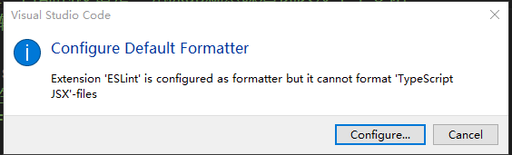
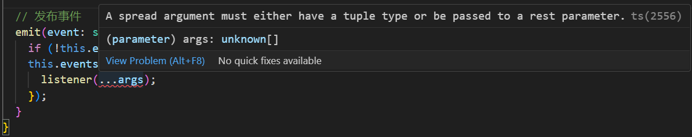

# 1. 报错一

```
Oops! Something went wrong! :(

ESLint: 9.12.0

SyntaxError: Unexpected token '{'
    at ModuleLoader.moduleStrategy (node:internal/modules/esm/translators:118:18)
    at callTranslator (node:internal/modules/esm/loader:273:14)
    at ModuleLoader.moduleProvider (node:internal/modules/esm/loader:278:30)
    at async link (node:internal/modules/esm/module_job:76:21)
```

报错原因：eslint.config.mjs文件中，两项配置之间没有加逗号

# 2. 报错二

```bash
Oops! Something went wrong! :(

ESLint: 9.12.0

A config object is using the "env" key, which is not supported in flat config system.

Flat config uses "languageOptions.globals" to define global variables for your files.

Please see the following page for information on how to convert your config object into the correct format:
https://eslint.org/docs/latest/use/configure/migration-guide#configuring-language-options

If you're not using "env" directly (it may be coming from a plugin), please see the following:
https://eslint.org/docs/latest/use/configure/migration-guide#using-eslintrc-configs-in-flat-config
```

这个错误信息表明你在使用 ESLint 的平面配置（flat config）时，配置对象中使用了 `env` 键，但在平面配置系统中不再支持这个键。根据 ESLint 的更新，平面配置要求使用 `languageOptions.globals` 来定义全局变量。以下是对这个错误的详细分析和解决方案。

### 错误分析

1. **错误描述**：
   - `A config object is using the "env" key, which is not supported in flat config system.` 这表明 ESLint 配置中使用了 `env` 键，然而在平面配置中应使用 `languageOptions.globals` 来定义全局变量。

2. **平面配置系统**：
   - ESLint 7.0 版本引入了平面配置系统，以支持更简化的配置管理。在这种新系统中，配置被分为多个部分（如 `languageOptions`），而不再使用传统的层级结构。

### 解决步骤

#### 1. 移除 `env` 键

首先，从 ESLint 配置中移除 `env` 键。查找你的 `.eslintrc.js`、`.eslintrc.cjs` 或 `.eslintrc.json` 文件，找到并删除 `env` 配置。例如：

```javascript
// 移除以下 env 配置
module.exports = {
  env: {
    browser: true,
    es2021: true,
  },
  // 其他配置...
};
```

#### 2. 使用 `languageOptions.globals`

在平面配置系统中，使用 `languageOptions.globals` 来定义全局变量。更新你的配置文件如下：

```javascript
// .eslintrc.js
module.exports = {
  languageOptions: {
    globals: {
      // 定义全局变量
      document: true,
      window: true,
      // 其他全局变量...
    },
  },
  // 其他配置...
};
```

#### 3. 配置其他选项

如果你还在使用其他选项，如 `extends` 或 `plugins`，确保这些选项仍然符合平面配置的格式。例如：

```javascript
// .eslintrc.js
module.exports = {
  languageOptions: {
    globals: {
      document: true,
      window: true,
    },
  },
  plugins: ['plugin-name'],
  rules: {
    'rule-name': 'error',
  },
};
```

#### 4. 参考官方迁移指南

ESLint 提供了官方的迁移指南，可以帮助你更好地理解平面配置的要求。你可以参考以下链接了解更多信息：

- [ESLint 配置迁移指南](https://eslint.org/docs/latest/use/configure/migration-guide)

### 总结

遇到这个错误时，主要是因为使用了不再支持的 `env` 键。通过将其移除并替换为 `languageOptions.globals`，你可以将配置更新为平面配置系统的要求。确保检查所有的配置文件，并在进行更改后重新运行 ESLint，以确认问题是否已解决。

# 3. 提示三



这个错误提示表明你在 VSCode 中配置了 ESLint 扩展作为格式化工具，但 ESLint 不能格式化 TypeScript JSX 文件（通常是 `.tsx` 文件）。这是一个常见问题，可以通过以下步骤来解决：

### 1. 确保安装必要的依赖

首先，确保你的项目中安装了以下依赖：

- `eslint`
- `eslint-plugin-react`
- `@typescript-eslint/parser`
- `@typescript-eslint/eslint-plugin`

你可以通过以下命令安装它们（如果你还没有安装的话）：

```bash
npm install --save-dev eslint eslint-plugin-react @typescript-eslint/parser @typescript-eslint/eslint-plugin
```

### 2. 更新 ESLint 配置

确保你的 ESLint 配置文件（如 `eslint.config.mjs` 或 `.eslintrc.js`）中包含 TypeScript 和 React 的相关设置。以下是一个示例配置：

```javascript
import globals from 'globals';
import pluginJs from '@eslint/js';
import tseslint from 'typescript-eslint';
import pluginReact from 'eslint-plugin-react';

export default [
  { files: ['**/*.{js,mjs,cjs,ts,jsx,tsx}'] },
  {
    languageOptions: {
      parser: '@typescript-eslint/parser',
      globals: {
        ...globals.browser,
        jest: 'readonly',
        test: 'readonly',
        expect: 'readonly',
      },
    },
  },
  pluginJs.configs.recommended,
  ...tseslint.configs.recommended,
  pluginReact.configs.flat.recommended,
  {
    rules: {
      '@typescript-eslint/no-unused-expressions': 'off',
      quotes: ['error', 'single'],
      indent: ['error', 2],
      semi: ['error', 'always'],
    },
  },
  {
    ignores: ['dist/**', 'webpack.config.js'],
  },
];
```

### 3. 配置 VSCode 设置

确保在 VSCode 设置中启用 ESLint 格式化。你可以在 `settings.json` 文件中添加或确认以下设置：

```json
{
  "editor.defaultFormatter": "dbaeumer.vscode-eslint",
  "editor.formatOnSave": true,
  "[typescriptreact]": {
    "editor.defaultFormatter": "dbaeumer.vscode-eslint"
  }
}
```

### 4. 检查 VSCode 扩展

确保安装并启用了 `ESLint` 扩展（由 Dirk Baeumer 开发）。此外，确保没有其他格式化扩展（如 Prettier）与 ESLint 冲突。如果你使用 Prettier，请确保它的配置与 ESLint 兼容。

### 5. 清理项目依赖

有时候，项目依赖的版本冲突可能导致格式化问题。尝试删除 `node_modules` 文件夹并重新安装依赖：

```bash
rm -rf node_modules
npm install
```

### 6. 运行 ESLint 以检测问题

在终端中运行 ESLint，查看是否有任何其他错误：

```bash
npx eslint . --ext .js,.jsx,.ts,.tsx
```

### 7. 重启 VSCode

在完成上述所有步骤后，重启 VSCode 以确保所有设置生效。

通过上述步骤，你应该能够解决 ESLint 不能格式化 TypeScript JSX 文件的问题。如果问题仍然存在，确保查看 VSCode 的输出窗口中的 ESLint 日志，以获取更具体的错误信息。

# 4. 报错四

```ts
emit(event: string, ...args: unknown[]) {
    if (!this.events[event]) return;
    this.events[event].forEach(listener => {
        listener(...args);
    });
}
```


```bash
A spread argument must either have a tuple type or be passed to a rest parameter.ts(2556)
```



这个报错是因为 TypeScript 在使用扩展运算符（`...`）传递参数时，期望 `args` 是一个确定的元组类型，而不是一个通用的数组类型（`unknown[]`）。目前 `args` 被推断为 `unknown[]`，它不满足扩展运算符的要求，因此会触发报错 `A spread argument must either have a tuple type or be passed to a rest parameter.ts(2556)`。

### 报错原因分析
`args` 被声明为 `unknown[]`，表示一个数组，数组中的元素可以是任意类型，但扩展运算符要求它要么是一个元组（具有固定数量和类型的数组），要么传递给函数的剩余参数。

在 `listener(...args)` 这行代码中，TypeScript 无法确定 `args` 是否符合 `listener` 函数期望的参数类型，因为 `listener` 的参数类型未明确。

### 解决方案

1. **使用元组类型代替 `unknown[]`**：
   如果你知道 `args` 的结构（即每个参数的类型和数量是固定的），可以将 `args` 声明为一个元组类型。例如：

   ```typescript
   emit(event: string, ...args: [string, number]) {
     if (!this.events[event]) return;
     this.events[event].forEach(listener => {
       listener(...args); // 不会报错
     });
   }
   ```

   这样 `args` 的类型是固定的，TypeScript 可以正确推断出 `listener` 期望的参数。

2. **保持 `unknown[]` 并使用类型断言**：
   如果你不确定 `args` 的具体类型，可以通过类型断言告诉 TypeScript 可以安全地扩展 `args`，即便它是一个普通数组：

   ```typescript
   emit(event: string, ...args: unknown[]) {
     if (!this.events[event]) return;
     this.events[event].forEach(listener => {
       (listener as Function)(...args); // 使用类型断言，告诉 TypeScript listener 是一个函数
     });
   }
   ```

   **注意**：这种方式可以绕过类型检查，但你要确保 `listener` 真的是一个函数，否则可能会带来运行时错误。

3. **泛型方案**：
   如果你希望 `args` 能适应多种事件参数类型，可以用泛型来处理事件与参数的映射：

   ```typescript
   emit<T extends unknown[]>(event: string, ...args: T) {
     if (!this.events[event]) return;
     this.events[event].forEach(listener => {
       listener(...args);
     });
   }
   ```

   这样，`T` 可以代表任意的元组类型，允许 `args` 根据不同的事件传递不同类型和数量的参数。

### 总结
报错的原因在于 TypeScript 对扩展运算符的严格类型检查，你可以通过使用元组类型、类型断言或者泛型来解决这个问题。选择哪种方案取决于你的 `emit` 方法对参数类型的需求。