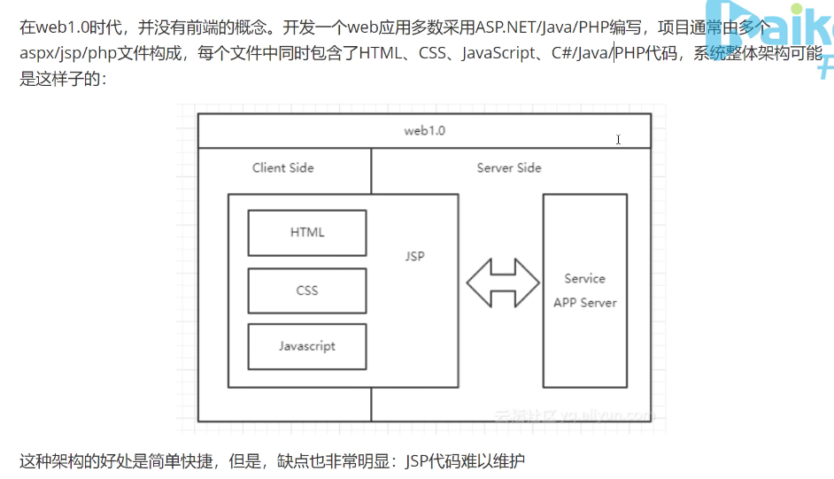
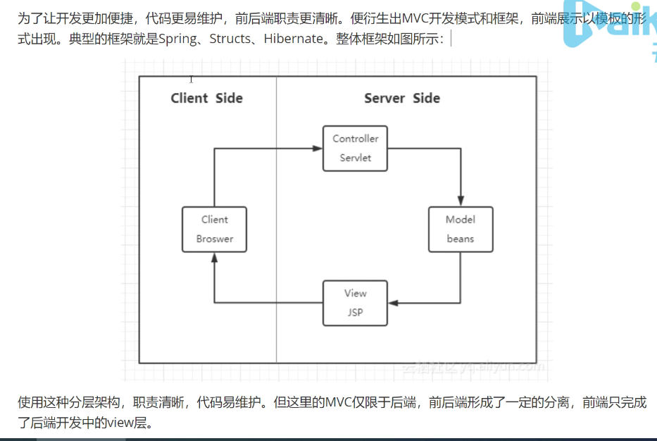
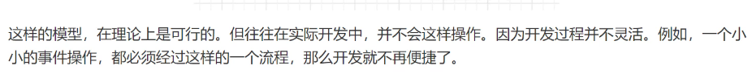
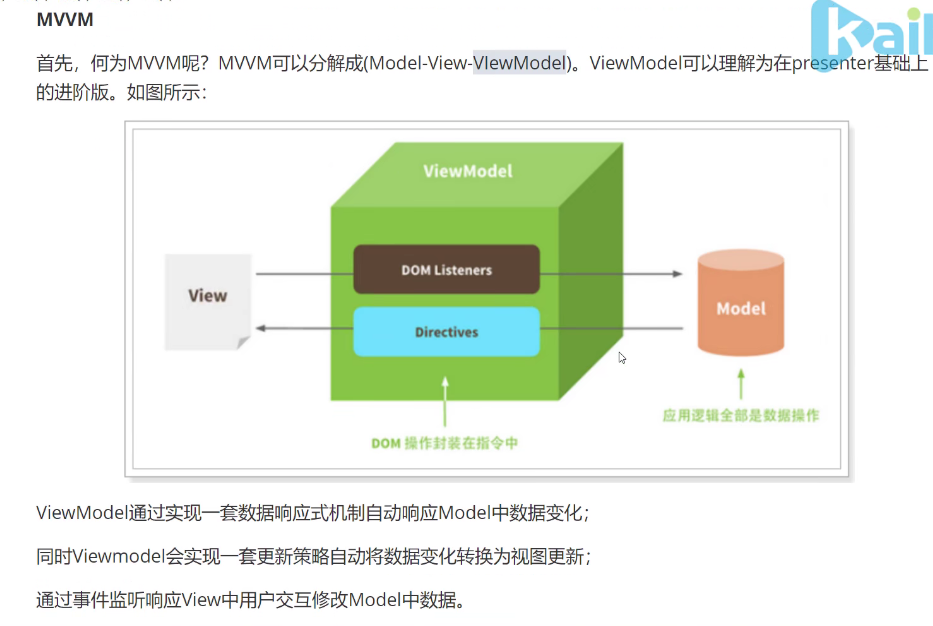
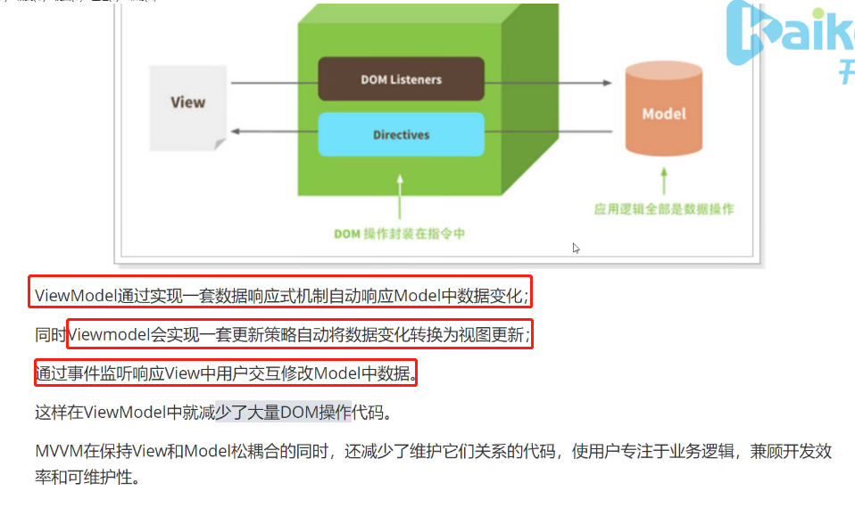
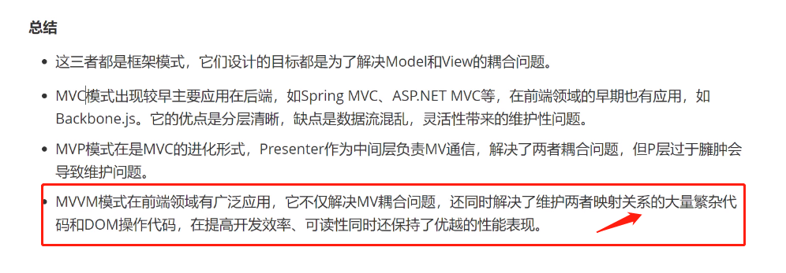

https://www.bilibili.com/video/BV137411N7aB?from=search&seid=16228469319883834532&spm_id_from=333.337.0.0

谈谈你对MVC MVP MVVM的理解

# 1.无框架

JSP在服务端生成。调用service获取数据，然后在JSP页面中进行封装

JSP代码难以维护：因为前端代码和后端代码混在一起

# 2.后端MVC（以node为例）

把**数据**，**视图**，**业务逻辑**分层

这种模式下存在的问题：

* 前端页面开发效率不高
* 前后端职责不清

# 3.前端MVC

https://zh.wikipedia.org/wiki/Gmail

客户端非常单纯，就是html，css和js。服务端只需要把数据返回给前端。

前端通过发送AJAX请求去获取数据。

- 视图会改，会尝试通过一些事件去通知控制器，控制器去改模型。

- 模型变了之后再尝试用某种办法通知视图去更新。

- 通常我们需要造出很多概念。比如说一些中间的概念：xxx。让view和model产生映射关系

# 4.MVP

# 5.MVVM

- [ ] **这个数据发生变化了，我怎么知道它变了？** **我总不能说要写很多改数据的函数和很多对应更新视图的代码，显得代码很臃肿**， **怎么简化呢？**

- [ ] **其实就是一种数据响应式的机制。能不能监听或者是用某种机制知道数据发生了变化，自动的去响应数据的变化。**

- [ ] **知道数据的变化之后怎么去做视图的更新？**
  * **以前做视图的更新是用jQuery直接做DOM操作**
    * **数据变了自然要做DOM操作去更新**
    * 但是我们不想这样做，因为我们发现这样做，首先代码很多，然后效率也不高。比如在做一个大列表的维护过程当中，人工去写很难去高效率的写出代码。**所以才会出现虚拟DOM，用虚拟DOM的方式去做更新**，按照精美的Diff算法去做比对

通过响应式和虚拟dom来做到数据驱动，如果model数据变化，直接视图更新。用户在编程的时候只是改数据就可以，不用关心其他乱七八糟的东西。在这个过程中，我们减少了大量的dom操作的代码。

视图层怎么改变模型层的，其实没有变化，跟以前一样，用事件监听。

只不过说：好像现在不用写一些事件监听的代码，那只是因为vm层它同时提供给我们一些好用的**模板引擎**，这些模板引擎中有一些事件处理的语法。

VM层替我们做了大量的事情，但是我们却看不见。

# 总结

以前要做很多映射关系，改了一个数据，要执行哪个更新函数。要把这些映射关系保存起来，要把更改函数写出来。现在有了数据响应式，不需要去监控，关心数据的响应式变化。

**react和vue都是MVVC模式吗？？**

