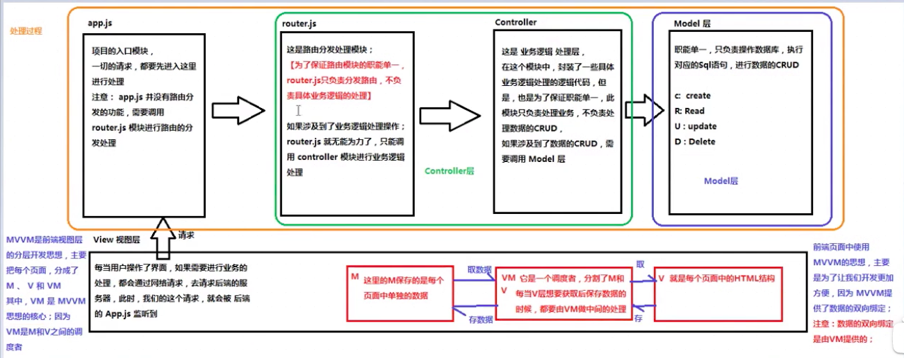
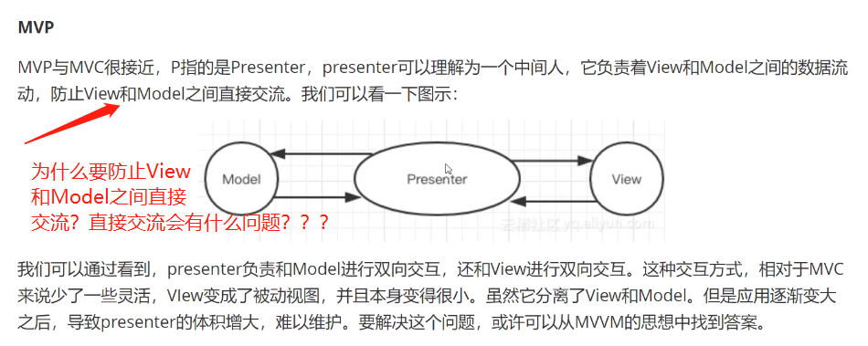

https://www.bilibili.com/video/BV137411N7aB?from=search&seid=16228469319883834532&spm_id_from=333.337.0.0

谈谈你对MVC MVP MVVM的理解

# 1.无框架

==JSP在服务端生成。调用service获取数据，然后在JSP页面中进行封装。==

==JSP代码难以维护：因为前端代码和后端代码混在一起==

# 2.后端MVC（以node为例）

==把**数据**，**视图**，**业务逻辑**分层==

Model：主要处理数据的CRUD

View：前端页面

Controller：业务逻辑层

这种模式下存在的问题：

* 前端页面开发效率不高
* 前后端职责不清

# 3.前端MVC

==视图会改，会尝试通过一些事件去通知控制器，控制器去改模型==。

==模型变了之后再尝试用某种办法通知视图去更新==

==通常我们需要造出很多概念。比如说一些中间的概念：xxx。让view和model产生映射关系==

**MVC缺点：**

* 

# 4.MVP

# 5.MVVM

**这个数据发生变化了，我怎么知道它变了？**

**我总不能说要写很多改数据的函数和很多对应更新视图的代码，显得代码很臃肿**

**怎么简化呢？**

* **其实就是一种数据响应式的机制。能不能监听或者是用某种机制知道数据发生了变化，自动的去响应数据的变化。**

**知道数据的变化之后怎么去做视图的更新？**

* **以前做视图的更新是用jQuery直接做DOM操作**
  * **数据变了自然要做DOM操作去更新**
  * 但是我们不想这样做，因为我们发现这样做，首先代码很多，然后效率也不高。比如在做一个大列表的维护过程当中，人工去写很难去高效率的写出代码。**所以才会出现虚拟DOM，用虚拟DOM的方式去做更新**

# 总结

以前要做很多映射关系，改了一个数据，要执行哪个更新函数。要把这些映射关系保存起来，要把更改函数写出来。现在有了数据响应式，不需要去监控，关心数据的响应式变化。

**react和vue都是MVVC模式吗？？**

