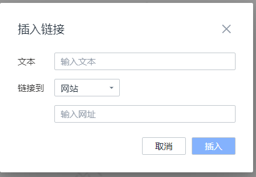
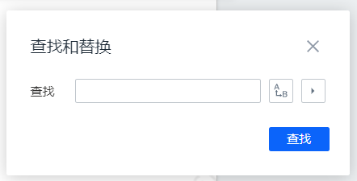
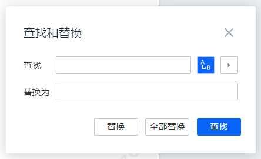
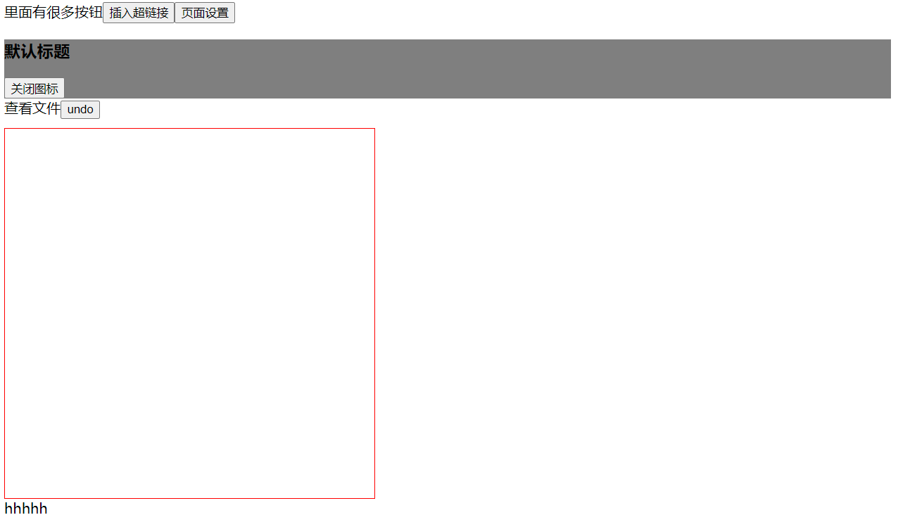
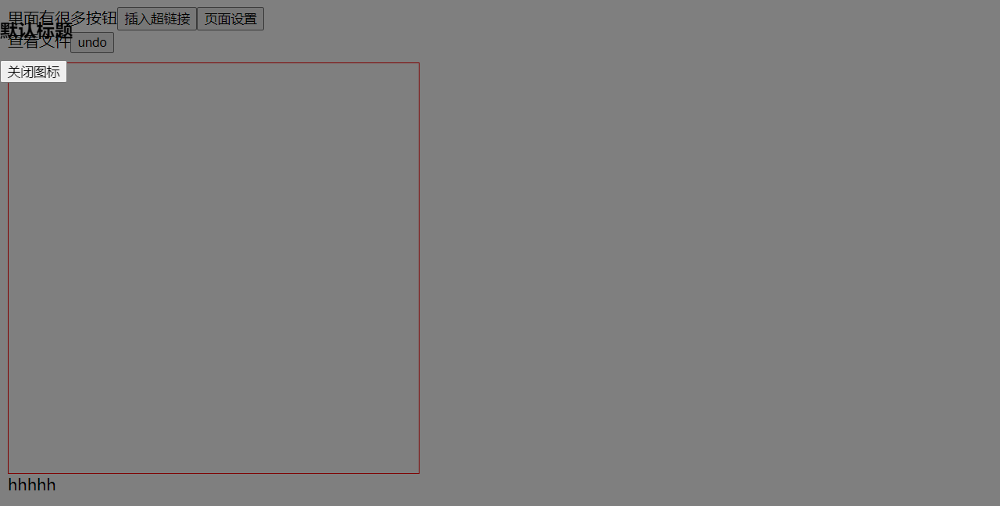

# 1. 封装弹出框步骤

|  |  |
| ------------------------------------------------------------ | ------------------------------------------------------------ |
|  |  |

需要做的：

1. 先分别实现这几个组件
2. 再抽取公共逻辑，封装这几个组件

封装一个复用性高、可维护性好的弹出框（Modal）组件在前端开发中非常常见。以下是如何在 React 中封装这样的组件的详细步骤和示例。

### 1. **组件职责明确**

弹出框组件应具备基础的功能，如打开、关闭、内容显示、标题等。确保组件只负责弹出框的展示逻辑，而不涉及业务逻辑。

### 2. **组件结构**

首先定义一个基础的弹出框结构，包括遮罩层（backdrop）、弹出框主体（modal body）、标题（title）、内容（content）、和操作按钮（actions）。

```jsx
import React from 'react';
import PropTypes from 'prop-types';
import './Modal.css';

const Modal = ({ isOpen, onClose, title, children, footer }) => {
  if (!isOpen) return null;

  return (
    <div className="modal-backdrop">
      <div className="modal-content">
        <div className="modal-header">
          <h3>{title}</h3>
          <button onClick={onClose} className="modal-close-button">&times;</button>
        </div>
        <div className="modal-body">
          {children}
        </div>
        {footer && (
          <div className="modal-footer">
            {footer}
          </div>
        )}
      </div>
    </div>
  );
};

Modal.propTypes = {
  isOpen: PropTypes.bool.isRequired,
  onClose: PropTypes.func.isRequired,
  title: PropTypes.string,
  children: PropTypes.node.isRequired,
  footer: PropTypes.node,
};

Modal.defaultProps = {
  title: '',
  footer: null,
};

export default Modal;
```

### 3. **样式的模块化**

使用 CSS 模块化来隔离样式，避免样式冲突，并确保组件样式的可维护性。

```css
/* Modal.css */
.modal-backdrop {
  position: fixed;
  top: 0;
  left: 0;
  width: 100%;
  height: 100%;
  background: rgba(0, 0, 0, 0.5);
  display: flex;
  align-items: center;
  justify-content: center;
}

.modal-content {
  background: white;
  padding: 20px;
  border-radius: 5px;
  width: 500px;
  max-width: 100%;
}

.modal-header {
  display: flex;
  justify-content: space-between;
  align-items: center;
  margin-bottom: 10px;
}

.modal-close-button {
  background: none;
  border: none;
  font-size: 1.5rem;
  cursor: pointer;
}

.modal-body {
  margin-bottom: 20px;
}

.modal-footer {
  text-align: right;
}
```

### 4. **复用性与可扩展性**

为组件提供足够的 `props` 以支持不同的使用场景，例如自定义标题、内容、和底部操作区。

- `title`：弹出框的标题，默认为空字符串。
- `footer`：弹出框底部的操作区，可以传入按钮或其他操作元素。

### 5. **优化性能**

使用 `React.memo` 来避免不必要的重渲染，提高组件的性能。

```jsx
export default React.memo(Modal);
```

### 6. **组件使用示例**

封装完弹出框后，可以这样在应用中使用：

```jsx
import React, { useState } from 'react';
import Modal from './Modal';

const App = () => {
  const [isModalOpen, setModalOpen] = useState(false);

  const toggleModal = () => {
    setModalOpen(!isModalOpen);
  };

  return (
    <div>
      <button onClick={toggleModal}>Open Modal</button>
      <Modal
        isOpen={isModalOpen}
        onClose={toggleModal}
        title="Example Modal"
        footer={
          <>
            <button onClick={toggleModal}>Cancel</button>
            <button onClick={() => alert('Confirmed!')}>Confirm</button>
          </>
        }
      >
        <p>This is the content of the modal.</p>
      </Modal>
    </div>
  );
};

export default App;
```

### 7. **测试**

为弹出框组件编写测试，确保组件在各种场景下都能正确运行。

```jsx
import { render, fireEvent } from '@testing-library/react';
import Modal from './Modal';

test('renders modal with correct content', () => {
  const { getByText } = render(
    <Modal isOpen={true} onClose={() => {}} title="Test Modal">
      <p>Modal Content</p>
    </Modal>
  );
  expect(getByText('Test Modal')).toBeInTheDocument();
  expect(getByText('Modal Content')).toBeInTheDocument();
});

test('closes modal on close button click', () => {
  const handleClose = jest.fn();
  const { getByText } = render(
    <Modal isOpen={true} onClose={handleClose} title="Test Modal">
      <p>Modal Content</p>
    </Modal>
  );
  fireEvent.click(getByText('×'));
  expect(handleClose).toHaveBeenCalledTimes(1);
});
```

### 8. **文档与发布**

为组件编写文档，展示如何使用各个 `props`，并提供不同场景下的示例。同时，遵循语义化版本控制，发布组件供其他项目使用。

# 2. 实际封装弹出框

|  |  |
| ------------------------------------------------------------ | ------------------------------------------------------------ |
|  |  |

## 1. 用`position: fixed`，不用`position: relative`

注意：灰色部分是遮罩

|                   position:relative的效果                    |                     position:fixed的效果                     |
| :----------------------------------------------------------: | :----------------------------------------------------------: |
|  |  |

[两者的区别](#8-position:relative和fix的区别)

## 2. 弹框显示时给body设置`overflow：hidden`，禁止页面滚动

## 3. 弹窗关闭函数

封装在弹窗内部会有啥问题？？？

封装弹框组件时，关闭弹框的函数一般由外部传递进来比较好。这样做的好处包括：

### 1. **增强组件的可重用性和灵活性**

- 通过将关闭弹框的逻辑交给外部处理，组件变得更加通用和可配置。不同的父组件可以根据自己的需求来控制弹框的关闭逻辑，而不需要依赖弹框组件内部的实现。

### 2. **遵循单向数据流的原则**

- 在 React 中，数据流是单向的，父组件控制子组件的状态。当弹框的关闭状态由外部控制时，父组件可以更好地管理整个应用的状态，符合 React 的设计理念。

### 3. **更好的状态管理**

- 当关闭弹框的逻辑在外部处理时，可以更方便地与其他状态管理逻辑（如 Redux、Context API）集成。这种方式也允许父组件在关闭弹框时执行额外的逻辑（如清理数据、发送请求等）。

### 4. **避免组件内部状态的复杂性**

- 如果关闭弹框的逻辑完全由内部处理，组件内部需要管理自己的状态，这可能会导致状态管理复杂化，特别是在涉及多个弹框或嵌套弹框的情况下。

# 3. 写页面遮罩的时候需要注意哪些点

在编写页面遮罩时，需要关注多个方面，从视觉效果到用户交互，再到性能优化。以下是详细说明及代码示例：

### 1. **遮罩的层级管理（z-index）**

**目的**：确保遮罩能够覆盖页面的所有内容，并且位于最前面。

**实现**：通过设置较高的 `z-index` 值来实现。

```css
.modal-overlay {
    position: fixed;
    top: 0;
    left: 0;
    width: 100%;
    height: 100%;
    background-color: rgba(0, 0, 0, 0.5); /* 半透明黑色 */
    z-index: 9999; /* 确保遮罩层级最高 */
}
```

**注意**：确保页面上其他元素的 `z-index` 值不超过此值，否则遮罩可能会被覆盖。

### 2. **背景色与透明度**

**目的**：创建一个半透明的遮罩，使得用户感知到页面被遮住，同时还能模糊看到背后的内容。

**实现**：使用 `rgba` 颜色值设置透明度。

```css
.modal-overlay {
    background-color: rgba(0, 0, 0, 0.5); /* 黑色，50% 透明度 */
}
```

### 3. **覆盖范围**

**目的**：确保遮罩覆盖整个视口。

**实现**：通过 `position: fixed` 配合 `top`, `right`, `bottom`, `left` 设置。

```css
.modal-overlay {
    position: fixed;
    top: 0;
    right: 0;
    bottom: 0;
    left: 0;
}
```

**效果**：遮罩将覆盖整个视口，无论页面内容有多大。

### 4. **滚动条的处理**

**目的**：防止遮罩显示时用户还能滚动页面。

**实现**：在遮罩显示时，设置 `body` 的 `overflow` 为 `hidden`。

```javascript
function showOverlay() {
    document.body.style.overflow = 'hidden'; // 禁止滚动
    document.querySelector('.modal-overlay').style.display = 'block';
}

function hideOverlay() {
    document.body.style.overflow = ''; // 恢复滚动
    document.querySelector('.modal-overlay').style.display = 'none';
}
```

### 5. **交互性**

**目的**：遮罩出现时，用户不应与背景内容交互。

**实现**：在遮罩区域内阻止点击事件传递，防止事件触发。

```javascript
document.querySelector('.modal-overlay').addEventListener('click', function(event) {
    event.stopPropagation(); // 阻止事件冒泡
});
```

### 6. **关闭方式**

**目的**：提供用户关闭遮罩的便捷方式。

**实现**：点击遮罩关闭，或提供一个明确的关闭按钮。

```html
<div class="modal-overlay" onclick="hideOverlay()">
    <div class="modal-content">
        <span class="close-button" onclick="hideOverlay()">X</span>
        <!-- 其他内容 -->
    </div>
</div>
```

**CSS**：

```css
.close-button {
    position: absolute;
    top: 10px;
    right: 10px;
    cursor: pointer;
}
```

### 7. **动画效果**

**目的**：使遮罩的出现和消失更加流畅。

**实现**：使用 CSS 过渡或动画效果。

```css
.modal-overlay {
    opacity: 0;
    transition: opacity 0.3s ease; /* 淡入淡出效果 */
}

.modal-overlay.show {
    opacity: 1;
}
```

```javascript
function showOverlay() {
    document.querySelector('.modal-overlay').classList.add('show');
}

function hideOverlay() {
    document.querySelector('.modal-overlay').classList.remove('show');
}
```

### 8. **性能优化**

**目的**：减少遮罩对页面性能的影响。

**实现**：避免复杂的阴影和大量的重绘、重排。

```css
.modal-overlay {
    will-change: opacity; /* 提示浏览器优化渲染 */
}
```

### 9. **可访问性**

**目的**：确保遮罩对屏幕阅读器友好，保证所有用户都能正常使用。

**实现**：使用 `aria` 属性来描述遮罩的用途。

```html
<div class="modal-overlay" role="dialog" aria-modal="true" aria-labelledby="modalTitle">
    <div class="modal-content">
        <h2 id="modalTitle">对话框标题</h2>
        <!-- 其他内容 -->
    </div>
</div>
```

### 10. **响应式设计**

**目的**：确保遮罩在各种设备上都能正常显示。

**实现**：使用媒体查询调整遮罩在不同屏幕上的样式。

```css
@media (max-width: 768px) {
    .modal-content {
        width: 90%;
        height: auto;
    }
}
```

**总结**：这些注意点结合具体代码实现，可以帮助你开发出一个功能完善、用户体验友好的页面遮罩。

# 4. position:relative和fix的区别

`position: relative` 和 `position: fixed` 是两种常见的 CSS 定位方式，它们的主要区别在于定位元素相对于哪个参考点，以及元素在页面滚动时的行为。

### 1. **`position: relative`**

- **相对定位**：元素相对于其 **正常文档流中的位置** 进行偏移。
- **默认行为**：当设置 `position: relative` 时，元素仍然占据它在文档流中的原始空间，但可以通过设置 `top`, `right`, `bottom`, `left` 属性偏移它的显示位置。
- **参考点**：元素的偏移是相对于它自己原本在页面中的位置。
- **滚动行为**：当页面滚动时，元素的位置会随页面内容一起滚动。

**示例**：

```html
<div style="position: relative; top: 20px; left: 30px;">
    这个元素相对于其原始位置向下偏移了20px，向右偏移了30px。
</div>
```

**效果**：该元素在文档流中的位置没有改变，但它的显示位置会被偏移。

### 2. **`position: fixed`**

- **固定定位**：元素相对于 **浏览器视口** 进行定位。
- **默认行为**：当设置 `position: fixed` 时，元素会脱离文档流，不再占据原来的空间，而是固定在视口中的指定位置。
- **参考点**：元素的偏移是相对于浏览器窗口（视口）的顶部、右侧、底部或左侧。
- **滚动行为**：当页面滚动时，元素始终保持在指定的视口位置，不会随页面内容滚动。

**示例**：

```html
<div style="position: fixed; top: 20px; right: 10px;">
    这个元素固定在视口的右上角，距离顶部20px，距离右侧10px。
</div>
```

**效果**：无论页面如何滚动，该元素始终保持在视口的右上角。

### **总结对比**：

- **定位参考点**：
  - `relative`：相对于元素自身原来的位置。
  - `fixed`：相对于浏览器的视口。

- **元素占据的空间**：
  - `relative`：元素仍然占据文档流中的空间，但显示位置被偏移。
  - `fixed`：元素脱离文档流，不占据原来的空间，固定在视口中。

- **页面滚动行为**：
  - `relative`：元素跟随页面内容滚动。
  - `fixed`：元素保持在视口的固定位置，不随页面内容滚动。

这两种定位方式适用于不同的场景，例如，`relative` 通常用于微调元素的位置，而 `fixed` 则常用于创建固定在页面顶部或底部的导航栏、悬浮按钮等。