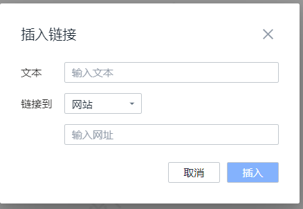
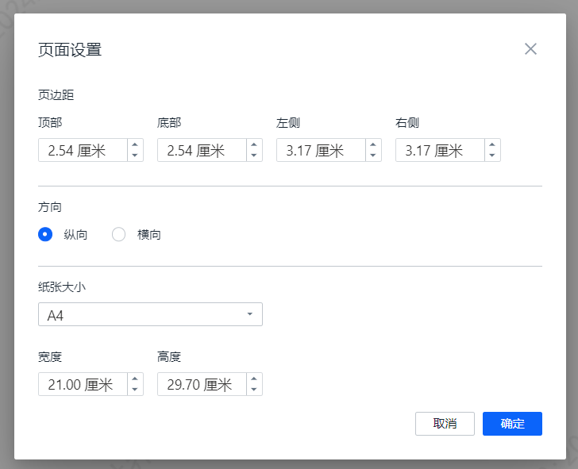
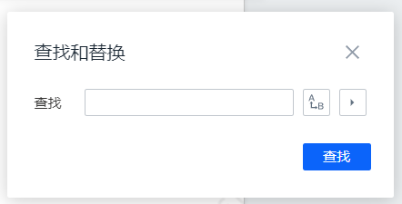
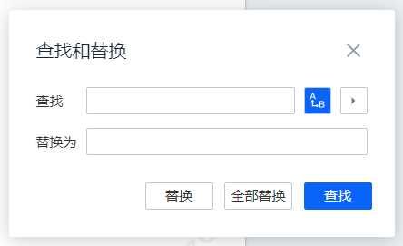
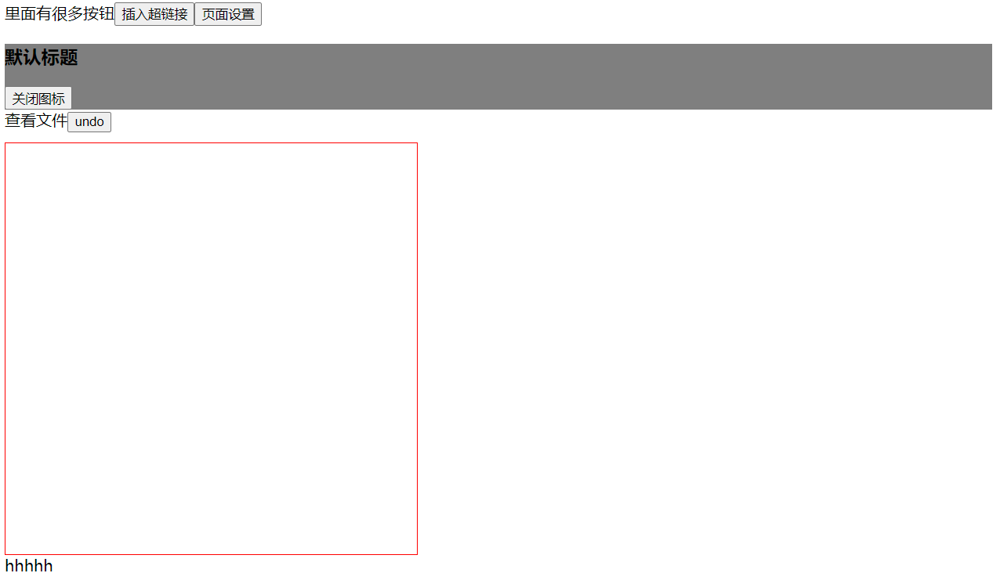
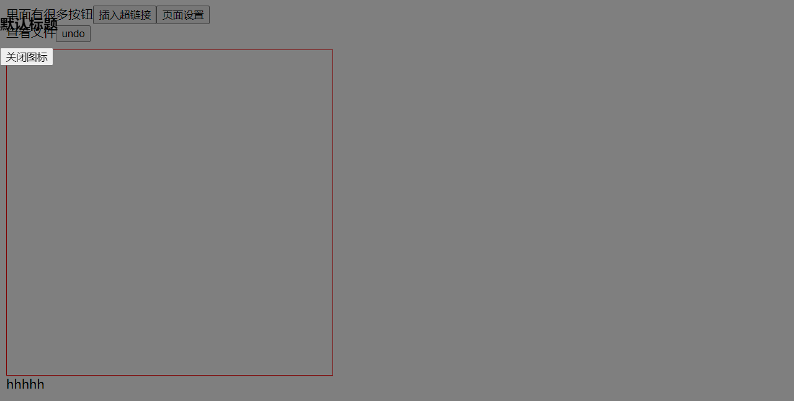

# 1. 搭建前端组件库的基本流程

搭建前端组件库涉及几个关键步骤，从设计和开发到文档和发布。以下是一个基本的流程：

### 1. **规划和设计**

- **定义组件**：确定你需要的组件类型和功能，例如按钮、表单输入、对话框、卡片等。
- **设计规范**：制定设计规范和样式指南，包括颜色、字体、间距和响应式设计规则。

### 2. **技术选型**

- **框架选择**：决定使用的前端框架或库，如 React、Vue、Angular 或纯 HTML/CSS/JavaScript。
- **构建工具**：选择构建工具和包管理器，如 Webpack、Vite、Rollup，以及 npm 或 Yarn。

### 3. **组件开发**

- **组件创建**：编写每个组件的代码，确保其功能模块化、可复用，并符合设计规范。
- **样式处理**：使用 CSS、Sass、Less 或 CSS-in-JS（如 styled-components）来处理组件的样式。
- **状态管理**：如果需要，处理组件的内部状态或使用状态管理库（如 Redux 或 Vuex）。

### 4. **文档编写**

- **文档生成**：使用工具生成文档，如 Storybook、Styleguidist 或 VuePress，展示组件的使用方式和示例。
- **示例代码**：为每个组件提供示例代码，帮助用户理解如何在项目中使用它们。

### 5. **测试**

- **单元测试**：使用测试框架（如 Jest、Mocha、Testing Library）编写组件的单元测试，确保它们的功能正确。
- **端到端测试**：如果需要，使用工具（如 Cypress）进行端到端测试，验证组件在实际应用中的表现。

### 6. **打包和发布**

- **构建**：配置构建工具，打包组件库的代码，生成适合分发的文件（如 ES Modules、CommonJS、UMD）。
- **版本控制**：使用版本控制工具（如 Git）管理代码，确保发布版本的稳定性。
- **发布**：将组件库发布到 npm 或其他包管理平台，以便其他开发者可以安装和使用。你可以通过命令行工具（如 `npm publish`）完成发布。

### 7. **维护和更新**

- **Bug 修复**：定期修复组件中的问题，保持代码质量。
- **功能扩展**：根据用户反馈和需求，添加新功能或改进现有组件。
- **版本管理**：遵循语义化版本控制（SemVer）规范，管理组件库的版本更新。

### 示例：React 组件库

如果使用 React 来搭建组件库，以下是一些额外的细节：

- **项目结构**：
  ```
  /src
    /components
      Button.js
      Card.js
    /styles
      Button.css
      Card.css
  /docs
  /tests
    Button.test.js
    Card.test.js
  .babelrc
  package.json
  ```

- **构建配置**：
  使用工具如 `rollup` 来打包组件：
  ```javascript
  // rollup.config.js
  import babel from '@rollup/plugin-babel';
  import peerDepsExternal from 'rollup-plugin-peer-deps-external';
  
  export default {
    input: 'src/index.js',
    output: [
      { file: 'dist/index.js', format: 'cjs' },
      { file: 'dist/index.esm.js', format: 'esm' },
    ],
    plugins: [
      peerDepsExternal(),
      babel({ babelHelpers: 'bundled' }),
    ],
  };
  ```

- **文档工具**：
  使用 Storybook：
  ```bash
  npx sb init
  ```

搭建前端组件库的过程可能会因项目规模和需求而有所不同，但以上步骤提供了一个基本的框架和指南。

# 2. 如何快速为团队打造自己的组件库

https://www.bilibili.com/video/BV1pN41197t6/?spm_id_from=333.337.search-card.all.click&vd_source=a7089a0e007e4167b4a61ef53acc6f7e

# 3. 为什么有现成的UI库，但公司还要自己封装

即使有许多现成的 UI 库可供选择，许多公司仍然选择自己封装组件库或对现有 UI 库进行定制，主要有以下几个原因：

### 1. **品牌一致性和定制化需求**
   - **品牌一致性**：公司可能希望所有的产品在视觉风格上保持一致，这包括颜色、字体、按钮样式、布局等。现成的 UI 库虽然提供了丰富的组件，但这些组件的风格可能与公司的品牌设计不完全契合。通过封装自己的组件库，公司可以确保所有 UI 元素都符合品牌设计规范。
   - **特定需求**：公司可能有一些特定的业务需求，要求定制化的组件。例如，某些交互方式、特定的数据展示形式、特定的动画效果等，这些可能在现成的 UI 库中无法直接找到。

### 2. **降低依赖风险**
   - **长期维护**：UI 库通常由第三方维护，虽然这些库可能有很大的社区支持，但一旦库停止更新或者更新速度不符合公司的需求，可能会对项目产生不良影响。自己封装组件库可以降低对第三方库的依赖，确保公司可以独立控制组件的更新和维护。
   - **兼容性问题**：随着时间的推移，UI 库的更新可能会引入 breaking changes（破坏性变更），导致现有项目的某些部分需要重新适配。封装自己的组件库可以减少因依赖外部库的变更带来的风险。

### 3. **更好的性能优化**
   - **精简体积**：现成的 UI 库通常包含大量的组件和功能，但项目可能只需要其中的一小部分。自己封装组件库可以只引入必要的功能，从而减少打包后的文件大小，提升页面加载速度。
   - **性能调优**：公司可以根据具体的业务场景对组件进行优化，例如减少不必要的渲染、提高响应速度等，这在使用现成库时可能较难实现。

### 4. **一致的开发体验**
   - **统一的开发标准**：通过封装自己的组件库，公司可以制定统一的开发规范，确保所有开发者在使用组件时遵循相同的标准，减少代码风格的不一致性。
   - **提高开发效率**：通过对常用的 UI 组件进行封装，开发者可以避免重复造轮子，减少代码重复，提高开发效率。

### 5. **特定业务逻辑的封装**
   - **业务逻辑复用**：很多时候，UI 组件不仅仅是视觉元素，还需要包含与公司业务紧密相关的逻辑。自己封装组件库可以将这些逻辑与组件一同封装，方便在不同项目中复用。

### 总结
虽然现成的 UI 库能提供快捷的开发体验和丰富的组件选择，但公司自封装组件库的决定通常基于品牌一致性、降低依赖风险、性能优化、开发体验一致性以及业务逻辑的封装等多方面的考量。这些因素使得自封装组件库成为大多数中大型企业的标准做法。

# 4. 若公司不依赖第三方UI库，应怎样维护自己的组件

如果公司选择完全不依赖第三方UI库，在项目中开发和维护自己的组件库是一项挑战，但也提供了更高的灵活性和定制能力。以下是开发和维护自定义组件库的关键步骤和注意事项：

### 1. **设计系统的制定**
   - **统一的设计语言**：与设计团队合作，制定一套统一的设计语言，包括颜色、间距、排版、图标风格等。这是组件库的基础，确保所有组件在视觉和交互上保持一致性。
   - **组件规范**：定义每个组件的使用规范，如按钮、输入框、模态框等的样式和交互行为。规范应详细到包括不同状态下的样式（例如：hover, active, disabled）。

### 2. **组件库的架构设计**
   - **模块化设计**：将组件库分成独立的模块或包，每个模块负责特定的组件或功能。这使得组件库更易于维护和扩展，也便于在需要时按需加载。
   - **基础组件与高级组件**：首先开发基础组件（如按钮、输入框等），这些组件应该是通用的、简单的、灵活的。然后基于基础组件开发更复杂的高级组件（如表单、表格等）。

### 3. **组件开发流程**
   - **标准化开发流程**：为组件开发建立标准化流程，包括组件设计、开发、测试、代码评审、文档编写和发布。使用代码生成器或脚手架工具来加速组件的创建，并确保组件结构一致。
   - **代码分离**：将组件的逻辑、样式和测试代码分离，这样可以更容易地管理和维护。可以使用 CSS-in-JS、CSS Modules 或传统的 CSS/SCSS 文件来管理样式。

### 4. **组件的可扩展性和可配置性**
   - **Props设计**：确保组件通过 props 接受外部配置。保持组件的 API 简洁，同时提供合理的默认值。考虑支持通过 props 传递自定义样式或类名。
   - **插槽/children**：利用 React 的 `children` 属性或类似的插槽机制，使得组件能够接受动态内容，增强组件的灵活性。

### 5. **样式管理**
   - **样式统一管理**：将设计系统中的样式变量（如颜色、字体、间距等）集中管理，这样可以通过调整样式变量来全局调整组件的视觉效果。
   - **响应式设计**：确保组件支持响应式设计，适配不同的屏幕尺寸。可以使用媒体查询或 CSS Grid/Flexbox 来实现。

### 6. **文档与示例**
   - **自动化文档生成**：使用工具（如 Storybook 或 Styleguidist）自动生成组件文档，展示每个组件的使用方法、API 说明和不同的使用示例。
   - **示例项目**：创建一个示例项目，展示如何在实际场景中使用组件库。这不仅可以作为开发参考，也可以用于新员工的培训。

### 7. **测试**
   - **单元测试**：为每个组件编写单元测试，确保其功能在各种情况下都能正确运行。可以使用 Jest 和 React Testing Library 来进行测试。
   - **端到端测试**：为关键组件编写端到端测试，确保它们在真实使用场景中的表现符合预期。Cypress 是一个常用的端到端测试工具。

### 8. **版本控制与发布**
   - **语义化版本控制**：遵循语义化版本控制（SemVer），清晰管理组件库的版本更新。主要是修复、添加新功能和破坏性更改应分别对应小版本号、次版本号和主版本号。
   - **发布与管理**：将组件库发布到私有的 npm 仓库或公司内部的包管理系统，方便项目按需引用和更新。可以考虑通过 CI/CD 管道自动化组件库的发布流程。

### 9. **维护与迭代**
   - **定期更新与优化**：根据业务需求和技术发展，定期更新和优化组件库。保持与设计团队和开发团队的密切沟通，确保组件库始终符合最新的需求和规范。
   - **代码审查**：建立严格的代码审查流程，确保组件库的代码质量和一致性。这有助于防止技术债务的累积。

### 10. **组件库的推广与培训**
   - **团队培训**：为团队成员提供培训，帮助他们理解并有效使用组件库。培训内容可以包括组件库的架构、设计理念、最佳实践等。
   - **反馈机制**：建立反馈机制，收集团队在使用组件库时遇到的问题和建议，以便及时改进。

---

通过以上步骤，你可以建立一个高质量的自定义组件库，满足公司内部项目的需求，并保持组件的复用性和可维护性。这样做不仅能确保项目的 UI/UX 一致性，还能提高开发效率，减少重复工作。

# 5. 封装弹出框

|  |  |
| ------------------------------------------------------------ | ------------------------------------------------------------ |
|  |  |

需要做的：

1. 先分别实现这几个组件
2. 再抽取公共逻辑，封装这几个组件

封装一个复用性高、可维护性好的弹出框（Modal）组件在前端开发中非常常见。以下是如何在 React 中封装这样的组件的详细步骤和示例。

### 1. **组件职责明确**

弹出框组件应具备基础的功能，如打开、关闭、内容显示、标题等。确保组件只负责弹出框的展示逻辑，而不涉及业务逻辑。

### 2. **组件结构**

首先定义一个基础的弹出框结构，包括遮罩层（backdrop）、弹出框主体（modal body）、标题（title）、内容（content）、和操作按钮（actions）。

```jsx
import React from 'react';
import PropTypes from 'prop-types';
import './Modal.css';

const Modal = ({ isOpen, onClose, title, children, footer }) => {
  if (!isOpen) return null;

  return (
    <div className="modal-backdrop">
      <div className="modal-content">
        <div className="modal-header">
          <h3>{title}</h3>
          <button onClick={onClose} className="modal-close-button">&times;</button>
        </div>
        <div className="modal-body">
          {children}
        </div>
        {footer && (
          <div className="modal-footer">
            {footer}
          </div>
        )}
      </div>
    </div>
  );
};

Modal.propTypes = {
  isOpen: PropTypes.bool.isRequired,
  onClose: PropTypes.func.isRequired,
  title: PropTypes.string,
  children: PropTypes.node.isRequired,
  footer: PropTypes.node,
};

Modal.defaultProps = {
  title: '',
  footer: null,
};

export default Modal;
```

### 3. **样式的模块化**

使用 CSS 模块化来隔离样式，避免样式冲突，并确保组件样式的可维护性。

```css
/* Modal.css */
.modal-backdrop {
  position: fixed;
  top: 0;
  left: 0;
  width: 100%;
  height: 100%;
  background: rgba(0, 0, 0, 0.5);
  display: flex;
  align-items: center;
  justify-content: center;
}

.modal-content {
  background: white;
  padding: 20px;
  border-radius: 5px;
  width: 500px;
  max-width: 100%;
}

.modal-header {
  display: flex;
  justify-content: space-between;
  align-items: center;
  margin-bottom: 10px;
}

.modal-close-button {
  background: none;
  border: none;
  font-size: 1.5rem;
  cursor: pointer;
}

.modal-body {
  margin-bottom: 20px;
}

.modal-footer {
  text-align: right;
}
```

### 4. **复用性与可扩展性**

为组件提供足够的 `props` 以支持不同的使用场景，例如自定义标题、内容、和底部操作区。

- `title`：弹出框的标题，默认为空字符串。
- `footer`：弹出框底部的操作区，可以传入按钮或其他操作元素。

### 5. **优化性能**

使用 `React.memo` 来避免不必要的重渲染，提高组件的性能。

```jsx
export default React.memo(Modal);
```

### 6. **组件使用示例**

封装完弹出框后，可以这样在应用中使用：

```jsx
import React, { useState } from 'react';
import Modal from './Modal';

const App = () => {
  const [isModalOpen, setModalOpen] = useState(false);

  const toggleModal = () => {
    setModalOpen(!isModalOpen);
  };

  return (
    <div>
      <button onClick={toggleModal}>Open Modal</button>
      <Modal
        isOpen={isModalOpen}
        onClose={toggleModal}
        title="Example Modal"
        footer={
          <>
            <button onClick={toggleModal}>Cancel</button>
            <button onClick={() => alert('Confirmed!')}>Confirm</button>
          </>
        }
      >
        <p>This is the content of the modal.</p>
      </Modal>
    </div>
  );
};

export default App;
```

### 7. **测试**

为弹出框组件编写测试，确保组件在各种场景下都能正确运行。

```jsx
import { render, fireEvent } from '@testing-library/react';
import Modal from './Modal';

test('renders modal with correct content', () => {
  const { getByText } = render(
    <Modal isOpen={true} onClose={() => {}} title="Test Modal">
      <p>Modal Content</p>
    </Modal>
  );
  expect(getByText('Test Modal')).toBeInTheDocument();
  expect(getByText('Modal Content')).toBeInTheDocument();
});

test('closes modal on close button click', () => {
  const handleClose = jest.fn();
  const { getByText } = render(
    <Modal isOpen={true} onClose={handleClose} title="Test Modal">
      <p>Modal Content</p>
    </Modal>
  );
  fireEvent.click(getByText('×'));
  expect(handleClose).toHaveBeenCalledTimes(1);
});
```

### 8. **文档与发布**

为组件编写文档，展示如何使用各个 `props`，并提供不同场景下的示例。同时，遵循语义化版本控制，发布组件供其他项目使用。

---

通过这种方式，你可以创建一个复用性高、易于维护的弹出框组件，并且能够在不同的项目中方便地复用。

# 6. 实际封装弹出框

|  |  |
| ------------------------------------------------------------ | ------------------------------------------------------------ |
|  |  |

## 1. 用`position: fixed`，不用`position: relative`

注意：灰色部分是遮罩

|                   position:relative的效果                    |                     position:fixed的效果                     |
| :----------------------------------------------------------: | :----------------------------------------------------------: |
|  |  |

[两者的区别](#8-position:relative和fix的区别)

## 2. 弹框显示时给body设置`overflow：hidden`，禁止页面滚动

## 3. 弹窗关闭函数

封装在弹窗内部会有啥问题？？？

封装弹框组件时，关闭弹框的函数一般由外部传递进来比较好。这样做的好处包括：

### 1. **增强组件的可重用性和灵活性**

- 通过将关闭弹框的逻辑交给外部处理，组件变得更加通用和可配置。不同的父组件可以根据自己的需求来控制弹框的关闭逻辑，而不需要依赖弹框组件内部的实现。

### 2. **遵循单向数据流的原则**

- 在 React 中，数据流是单向的，父组件控制子组件的状态。当弹框的关闭状态由外部控制时，父组件可以更好地管理整个应用的状态，符合 React 的设计理念。

### 3. **更好的状态管理**

- 当关闭弹框的逻辑在外部处理时，可以更方便地与其他状态管理逻辑（如 Redux、Context API）集成。这种方式也允许父组件在关闭弹框时执行额外的逻辑（如清理数据、发送请求等）。

### 4. **避免组件内部状态的复杂性**

- 如果关闭弹框的逻辑完全由内部处理，组件内部需要管理自己的状态，这可能会导致状态管理复杂化，特别是在涉及多个弹框或嵌套弹框的情况下。

# 7. 写页面遮罩的时候需要注意哪些点

在编写页面遮罩时，需要关注多个方面，从视觉效果到用户交互，再到性能优化。以下是详细说明及代码示例：

### 1. **遮罩的层级管理（z-index）**

**目的**：确保遮罩能够覆盖页面的所有内容，并且位于最前面。

**实现**：通过设置较高的 `z-index` 值来实现。

```css
.modal-overlay {
    position: fixed;
    top: 0;
    left: 0;
    width: 100%;
    height: 100%;
    background-color: rgba(0, 0, 0, 0.5); /* 半透明黑色 */
    z-index: 9999; /* 确保遮罩层级最高 */
}
```

**注意**：确保页面上其他元素的 `z-index` 值不超过此值，否则遮罩可能会被覆盖。

### 2. **背景色与透明度**

**目的**：创建一个半透明的遮罩，使得用户感知到页面被遮住，同时还能模糊看到背后的内容。

**实现**：使用 `rgba` 颜色值设置透明度。

```css
.modal-overlay {
    background-color: rgba(0, 0, 0, 0.5); /* 黑色，50% 透明度 */
}
```

### 3. **覆盖范围**

**目的**：确保遮罩覆盖整个视口。

**实现**：通过 `position: fixed` 配合 `top`, `right`, `bottom`, `left` 设置。

```css
.modal-overlay {
    position: fixed;
    top: 0;
    right: 0;
    bottom: 0;
    left: 0;
}
```

**效果**：遮罩将覆盖整个视口，无论页面内容有多大。

### 4. **滚动条的处理**

**目的**：防止遮罩显示时用户还能滚动页面。

**实现**：在遮罩显示时，设置 `body` 的 `overflow` 为 `hidden`。

```javascript
function showOverlay() {
    document.body.style.overflow = 'hidden'; // 禁止滚动
    document.querySelector('.modal-overlay').style.display = 'block';
}

function hideOverlay() {
    document.body.style.overflow = ''; // 恢复滚动
    document.querySelector('.modal-overlay').style.display = 'none';
}
```

### 5. **交互性**

**目的**：遮罩出现时，用户不应与背景内容交互。

**实现**：在遮罩区域内阻止点击事件传递，防止事件触发。

```javascript
document.querySelector('.modal-overlay').addEventListener('click', function(event) {
    event.stopPropagation(); // 阻止事件冒泡
});
```

### 6. **关闭方式**

**目的**：提供用户关闭遮罩的便捷方式。

**实现**：点击遮罩关闭，或提供一个明确的关闭按钮。

```html
<div class="modal-overlay" onclick="hideOverlay()">
    <div class="modal-content">
        <span class="close-button" onclick="hideOverlay()">X</span>
        <!-- 其他内容 -->
    </div>
</div>
```

**CSS**：

```css
.close-button {
    position: absolute;
    top: 10px;
    right: 10px;
    cursor: pointer;
}
```

### 7. **动画效果**

**目的**：使遮罩的出现和消失更加流畅。

**实现**：使用 CSS 过渡或动画效果。

```css
.modal-overlay {
    opacity: 0;
    transition: opacity 0.3s ease; /* 淡入淡出效果 */
}

.modal-overlay.show {
    opacity: 1;
}
```

```javascript
function showOverlay() {
    document.querySelector('.modal-overlay').classList.add('show');
}

function hideOverlay() {
    document.querySelector('.modal-overlay').classList.remove('show');
}
```

### 8. **性能优化**

**目的**：减少遮罩对页面性能的影响。

**实现**：避免复杂的阴影和大量的重绘、重排。

```css
.modal-overlay {
    will-change: opacity; /* 提示浏览器优化渲染 */
}
```

### 9. **可访问性**

**目的**：确保遮罩对屏幕阅读器友好，保证所有用户都能正常使用。

**实现**：使用 `aria` 属性来描述遮罩的用途。

```html
<div class="modal-overlay" role="dialog" aria-modal="true" aria-labelledby="modalTitle">
    <div class="modal-content">
        <h2 id="modalTitle">对话框标题</h2>
        <!-- 其他内容 -->
    </div>
</div>
```

### 10. **响应式设计**

**目的**：确保遮罩在各种设备上都能正常显示。

**实现**：使用媒体查询调整遮罩在不同屏幕上的样式。

```css
@media (max-width: 768px) {
    .modal-content {
        width: 90%;
        height: auto;
    }
}
```

**总结**：这些注意点结合具体代码实现，可以帮助你开发出一个功能完善、用户体验友好的页面遮罩。

# 8. position:relative和fix的区别

`position: relative` 和 `position: fixed` 是两种常见的 CSS 定位方式，它们的主要区别在于定位元素相对于哪个参考点，以及元素在页面滚动时的行为。

### 1. **`position: relative`**

- **相对定位**：元素相对于其 **正常文档流中的位置** 进行偏移。
- **默认行为**：当设置 `position: relative` 时，元素仍然占据它在文档流中的原始空间，但可以通过设置 `top`, `right`, `bottom`, `left` 属性偏移它的显示位置。
- **参考点**：元素的偏移是相对于它自己原本在页面中的位置。
- **滚动行为**：当页面滚动时，元素的位置会随页面内容一起滚动。

**示例**：

```html
<div style="position: relative; top: 20px; left: 30px;">
    这个元素相对于其原始位置向下偏移了20px，向右偏移了30px。
</div>
```

**效果**：该元素在文档流中的位置没有改变，但它的显示位置会被偏移。

### 2. **`position: fixed`**

- **固定定位**：元素相对于 **浏览器视口** 进行定位。
- **默认行为**：当设置 `position: fixed` 时，元素会脱离文档流，不再占据原来的空间，而是固定在视口中的指定位置。
- **参考点**：元素的偏移是相对于浏览器窗口（视口）的顶部、右侧、底部或左侧。
- **滚动行为**：当页面滚动时，元素始终保持在指定的视口位置，不会随页面内容滚动。

**示例**：

```html
<div style="position: fixed; top: 20px; right: 10px;">
    这个元素固定在视口的右上角，距离顶部20px，距离右侧10px。
</div>
```

**效果**：无论页面如何滚动，该元素始终保持在视口的右上角。

### **总结对比**：

- **定位参考点**：
  - `relative`：相对于元素自身原来的位置。
  - `fixed`：相对于浏览器的视口。

- **元素占据的空间**：
  - `relative`：元素仍然占据文档流中的空间，但显示位置被偏移。
  - `fixed`：元素脱离文档流，不占据原来的空间，固定在视口中。

- **页面滚动行为**：
  - `relative`：元素跟随页面内容滚动。
  - `fixed`：元素保持在视口的固定位置，不随页面内容滚动。

这两种定位方式适用于不同的场景，例如，`relative` 通常用于微调元素的位置，而 `fixed` 则常用于创建固定在页面顶部或底部的导航栏、悬浮按钮等。