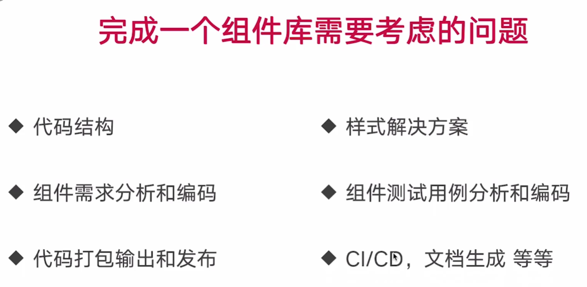
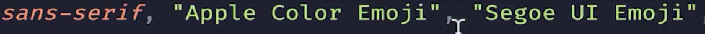
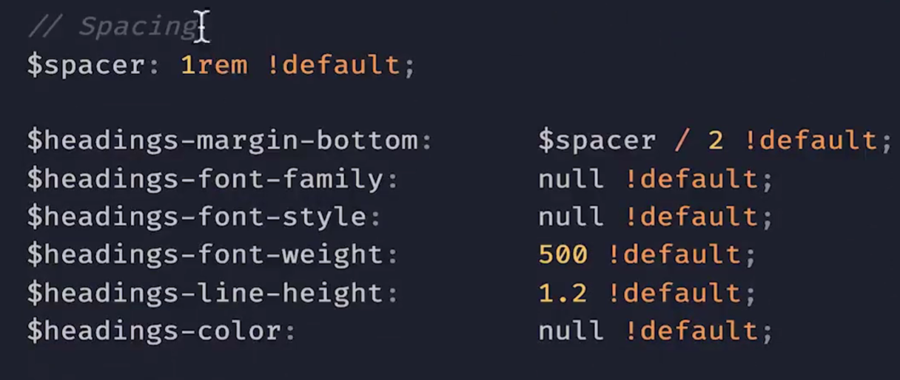

# [1. 从实战出发，从0到1构建一个符合标准的公共库](https://www.bilibili.com/video/BV1rP411f7Wn?p=10&vd_source=a7089a0e007e4167b4a61ef53acc6f7e)

# [2. 如何开发一套组件库](https://www.bilibili.com/video/BV1KT421q7F2/?spm_id_from=333.337.search-card.all.click&vd_source=a7089a0e007e4167b4a61ef53acc6f7e)

https://backlight.dev/

https://backlight.dev/mastery/best-react-component-libraries-for-design-systems

https://medium.com/@nirbenyair/headless-components-in-react-and-why-i-stopped-using-ui-libraries-a8208197c268

# [3. 从0到1完整搭建一套组件库](https://www.bilibili.com/video/BV1ko4y1H7aL/?spm_id_from=333.337.search-card.all.click&vd_source=a7089a0e007e4167b4a61ef53acc6f7e)

# [35. 组件库开始启航](https://www.bilibili.com/video/BV1ipHreRECz?p=35&vd_source=a7089a0e007e4167b4a61ef53acc6f7e)



```
npx create-react-app cmfship --typescript
```

# [36. 文件结构和代码规范](https://www.bilibili.com/video/BV1ipHreRECz?p=36&spm_id_from=pageDriver&vd_source=a7089a0e007e4167b4a61ef53acc6f7e)

# [37. 样式解决方案分析](https://www.bilibili.com/video/BV1ipHreRECz?p=37&spm_id_from=pageDriver&vd_source=a7089a0e007e4167b4a61ef53acc6f7e)

- Inline CSS
- CSS in JS
- Styled Component
- Sass/Less

**Sass** 和 **Less** 都是 CSS 的预处理器，但它们在语法、特性和编译方式等方面有一些区别。以下是它们的主要区别：

### 1. **语法**
   - **Sass**：有两种语法，传统的 `.sass` 和较新、更常用的 `.scss`。  
     - `.sass` 文件是缩进式语法，不需要花括号 `{}` 和分号 `;`，语法更加简洁。
     - `.scss` 文件更像 CSS，使用大括号和分号，语法规则与标准 CSS 非常相似。
   - **Less**：只有一种语法，和 `.scss` 类似，使用大括号和分号，与标准 CSS 也非常相似。

### 2. **编译方式**
   - **Sass**：需要使用 **Dart Sass**、**LibSass** 或 **Ruby Sass** 来编译，其中 Dart Sass 是官方推荐的编译器。
   - **Less**：Less 通常通过 Node.js 编译，编译器更简单轻量一些。

### 3. **变量定义**
   - **Sass**：使用 `$` 符号定义变量。
     ```scss
     $primary-color: #333;
     body {
       color: $primary-color;
     }
     ```
   - **Less**：使用 `@` 符号定义变量。
     ```less
     @primary-color: #333;
     body {
       color: @primary-color;
     }
     ```

### 4. **函数与运算**
   - **Sass**：内置了更多的函数库，提供更强大的功能（如颜色处理、列表操作、数学运算等）。
   - **Less**：功能较为简单，但也提供基本的函数库和运算功能。

### 5. **继承与混入（Mixin）**
   - **Sass**：支持 `@extend` 用来继承样式，以及 `@mixin` 和 `@include` 用来复用代码。
     ```scss
     @mixin button($color) {
       background-color: $color;
     }
     .primary-btn {
       @include button(blue);
     }
     ```
   - **Less**：也有类似的 mixin 机制，但是没有 `@extend`。
     ```less
     .button(@color) {
       background-color: @color;
     }
     .primary-btn {
       .button(blue);
     }
     ```

### 6. **社区与生态**
   - **Sass**：由于发展时间较长，生态系统非常成熟，被广泛用于许多项目中，尤其是在大型项目和框架（如 Bootstrap、Foundation）中。
   - **Less**：Less 也很流行，尤其是在 Bootstrap 的早期版本中广泛使用，但 Sass 在社区中的支持更为广泛。

### 7. **语法扩展**
   - **Sass**：有更多的高级特性，如控制指令（`@if`、`@for`、`@each` 等），适合更复杂的项目需求。
   - **Less**：相对简单，语法扩展没有 Sass 丰富。

### 总结
如果项目需求比较复杂，或更注重社区支持和高级功能，**Sass** 可能是更好的选择。而 **Less** 则更适合对编译要求较低、希望更轻量化的项目。

# [38. 添加自己的色彩体系](https://www.bilibili.com/video/BV1ipHreRECz?p=38&spm_id_from=pageDriver&vd_source=a7089a0e007e4167b4a61ef53acc6f7e)

|  |  |
| ------------------------------------------------------------ | ------------------------------------------------------------ |
|  |                                                              |

Create React App天生不支持Sass预处理器

```
npm install node-sass --save
```

`node-sass` 是一个用于在 Node.js 中编译 Sass（Syntactically Awesome Stylesheets）文件的库。Sass 是一种扩展 CSS 的预处理器语言，它提供了变量、嵌套规则、混合（mixin）、继承等功能，使得编写和管理复杂的 CSS 更加方便。

`node-sass` 的主要作用是将 `.scss` 或 `.sass` 文件编译成标准的 CSS 文件，以便在网页中使用。它使用 LibSass 库作为底层的 Sass 编译器，因此在性能上非常快。`node-sass` 通常用于前端构建工具链中，例如与 Webpack 配合，通过 `sass-loader` 来处理 Sass 文件。

不过，值得注意的是，`node-sass` 最近已经被推荐逐步迁移到 `dart-sass`，因为 `node-sass` 的开发和维护逐渐减少，而 `dart-sass` 作为官方推荐的 Sass 编译器具有更好的兼容性和未来支持。

### 使用场景
- 编写更简洁、模块化的 CSS 代码
- 在项目中使用 Sass 的高级功能，比如变量、嵌套、函数等
- 通过工具如 Webpack、Gulp 等集成到项目的构建流程中

### 基本用法
通过 npm 安装：
```bash
npm install node-sass
```

编译 `.scss` 文件：
```bash
npx node-sass input.scss output.css
```

这样可以把 Sass 文件编译成标准的 CSS 文件。

安装node-sass时报错：

```bash
npm ERR! code 1
npm ERR! path E:\TechDocument\前端组件库搭建\cmfship\node_modules\node-sass
npm ERR! command failed
npm ERR! command C:\WINDOWS\system32\cmd.exe /d /s /c node scripts/build.js
npm ERR! Building: C:\Program Files\nodejs\node.exe E:\TechDocument\前端组件库搭建\cmfship\node_modules\node-gyp\bin\node-gyp.js rebuild --verbose --libsass_ext= --libsass_cflags= --libsass_ldflags= --libsass_library=
npm ERR! gyp info it worked if it ends with ok
npm ERR! gyp verb cli [
npm ERR! gyp verb cli   'C:\\Program Files\\nodejs\\node.exe',
npm ERR! gyp verb cli   'E:\\TechDocument\\前端组件库搭建\\cmfship\\node_modules\\node-gyp\\bin\\node-gyp.js',
npm ERR! gyp verb cli   'rebuild',
npm ERR! gyp verb cli   '--verbose',
npm ERR! gyp verb cli   '--libsass_ext=',
npm ERR! gyp verb cli   '--libsass_cflags=',
npm ERR! gyp verb cli   '--libsass_ldflags=',
npm ERR! gyp verb cli   '--libsass_library='
npm ERR! gyp verb cli ]
npm ERR! gyp info using node-gyp@8.4.1
npm ERR! gyp info using node@20.9.0 | win32 | x64
npm ERR! gyp verb command rebuild []
npm ERR! gyp verb command clean []
npm ERR! gyp verb clean removing "build" directory
npm ERR! gyp verb command configure []
npm ERR! gyp verb find Python Python is not set from command line or npm configuration
npm ERR! gyp verb find Python Python is not set from environment variable PYTHON
npm ERR! gyp verb find Python checking if "python3" can be used
npm ERR! gyp verb find Python - executing "python3" to get executable path
npm ERR! gyp verb find Python - "python3" is not in PATH or produced an error
npm ERR! gyp verb find Python checking if "python" can be used
npm ERR! gyp verb find Python - executing "python" to get executable path
npm ERR! gyp verb find Python - executable path is "D:\Python\python.exe"
npm ERR! gyp verb find Python - executing "D:\Python\python.exe" to get version
npm ERR! gyp verb find Python - version is "3.12.2"
npm ERR! gyp info find Python using Python version 3.12.2 found at "D:\Python\python.exe"
npm ERR! gyp verb get node dir no --target version specified, falling back to host node version: 20.9.0
npm ERR! gyp verb command install [ '20.9.0' ]
npm ERR! gyp verb install input version string "20.9.0"
npm ERR! gyp verb install installing version: 20.9.0
npm ERR! gyp verb install --ensure was passed, so won't reinstall if already installed
npm ERR! gyp verb install version is already installed, need to check "installVersion"
npm ERR! gyp verb got "installVersion" 11
npm ERR! gyp verb needs "installVersion" 9
npm ERR! gyp verb install version is good
npm ERR! gyp verb get node dir target node version installed: 20.9.0
npm ERR! gyp verb build dir attempting to create "build" dir: E:\TechDocument\前端组件库搭建\cmfship\node_modules\node-sass\build
npm ERR! gyp verb build dir "build" dir needed to be created? Yes
npm ERR! gyp verb find VS msvs_version not set from command line or npm config
npm ERR! gyp verb find VS VCINSTALLDIR not set, not running in VS Command Prompt
npm ERR! gyp verb find VS could not use PowerShell to find Visual Studio 2017 or newer, try re-running with '--loglevel 
silly' for more details
npm ERR! gyp verb find VS looking for Visual Studio 2015
npm ERR! gyp verb find VS - not found
npm ERR! gyp verb find VS not looking for VS2013 as it is only supported up to Node.js 8
npm ERR! gyp ERR! find VS
npm ERR! gyp ERR! find VS msvs_version not set from command line or npm config
npm ERR! gyp ERR! find VS VCINSTALLDIR not set, not running in VS Command Prompt
npm ERR! gyp ERR! find VS could not use PowerShell to find Visual Studio 2017 or newer, try re-running with '--loglevel 
silly' for more details
npm ERR! gyp ERR! find VS looking for Visual Studio 2015
npm ERR! gyp ERR! find VS - not found
npm ERR! gyp ERR! find VS not looking for VS2013 as it is only supported up to Node.js 8
npm ERR! gyp ERR! find VS
npm ERR! gyp ERR! find VS **************************************************************
npm ERR! gyp ERR! find VS You need to install the latest version of Visual Studio
npm ERR! gyp ERR! find VS including the "Desktop development with C++" workload.
npm ERR! gyp ERR! find VS For more information consult the documentation at:
npm ERR! gyp ERR! find VS https://github.com/nodejs/node-gyp#on-windows
npm ERR! gyp ERR! find VS **************************************************************
npm ERR! gyp ERR! find VS
npm ERR! gyp ERR! configure error 
npm ERR! gyp ERR! stack Error: Could not find any Visual Studio installation to use
npm ERR! gyp ERR! stack     at VisualStudioFinder.fail (E:\TechDocument\前端组件库搭建\cmfship\node_modules\node-gyp\lib\find-visualstudio.js:122:47)
npm ERR! gyp ERR! stack     at E:\TechDocument\前端组件库搭建\cmfship\node_modules\node-gyp\lib\find-visualstudio.js:75:16
npm ERR! gyp ERR! stack     at VisualStudioFinder.findVisualStudio2013 (E:\TechDocument\前端组件库搭建\cmfship\node_modules\node-gyp\lib\find-visualstudio.js:363:14)
npm ERR! gyp ERR! stack     at E:\TechDocument\前端组件库搭建\cmfship\node_modules\node-gyp\lib\find-visualstudio.js:71:14
npm ERR! gyp ERR! stack     at E:\TechDocument\前端组件库搭建\cmfship\node_modules\node-gyp\lib\find-visualstudio.js:384:16
npm ERR! gyp ERR! stack     at E:\TechDocument\前端组件库搭建\cmfship\node_modules\node-gyp\lib\util.js:54:7
npm ERR! gyp ERR! stack     at E:\TechDocument\前端组件库搭建\cmfship\node_modules\node-gyp\lib\util.js:33:16
npm ERR! gyp ERR! stack     at ChildProcess.exithandler (node:child_process:430:5)
npm ERR! gyp ERR! stack     at ChildProcess.emit (node:events:514:28)
npm ERR! gyp ERR! stack     at maybeClose (node:internal/child_process:1105:16)
npm ERR! gyp ERR! stack     at ChildProcess._handle.onexit (node:internal/child_process:305:5)
npm ERR! gyp ERR! System Windows_NT 10.0.19045
npm ERR! gyp ERR! command "C:\\Program Files\\nodejs\\node.exe" "E:\\TechDocument\\前端组件库搭建\\cmfship\\node_modules\\node-gyp\\bin\\node-gyp.js" "rebuild" "--verbose" "--libsass_ext=" "--libsass_cflags=" "--libsass_ldflags=" "--libsass_library="
npm ERR! gyp ERR! cwd E:\TechDocument\前端组件库搭建\cmfship\node_modules\node-sass
npm ERR! gyp ERR! node -v v20.9.0
npm ERR! gyp ERR! node-gyp -v v8.4.1
npm ERR! gyp ERR! not ok
npm ERR! Build failed with error code: 1

npm ERR! A complete log of this run can be found in: C:\Users\Administrator\AppData\Local\npm-cache\_logs\2024-10-15T08_59_17_242Z-debug-0.log
```

# [39. 添加字体变量解决方案](https://www.bilibili.com/video/BV1ipHreRECz?p=39&vd_source=a7089a0e007e4167b4a61ef53acc6f7e)





https://fonts.google.com/

|                    |                                 |      |
| ------------------ | ------------------------------- | ---- |
| -apple-system      | 针对Apple设备的系统字体         |      |
| BlinkMacSystemFont | Chrome，Safari中的macOS系统字体 |      |
| Segoe UI           |                                 |      |
|                    |                                 |      |
|                    |                                 |      |
|                    |                                 |      |
|                    |                                 |      |
|                    |                                 |      |





 # [40. 添加normalize.css](https://www.bilibili.com/video/BV1ipHreRECz?p=40&spm_id_from=pageDriver&vd_source=a7089a0e007e4167b4a61ef53acc6f7e)

https://github.com/necolas/normalize.css

`normalize.css` 是一个 CSS 文件，旨在使浏览器在渲染 HTML 元素时表现一致。不同浏览器默认样式各异，而 `normalize.css` 通过标准化这些默认样式，减少跨浏览器的不一致性。

### 具体作用

1. **跨浏览器一致性**：
   各浏览器都有不同的用户代理样式表（User Agent Stylesheet），它们决定了没有被样式覆盖的 HTML 元素的默认外观。`normalize.css` 通过调整这些默认样式，使得各种现代浏览器（如 Chrome、Firefox、Safari、Edge 等）对 HTML 元素的渲染结果更为一致。

2. **修正常见的浏览器问题**：
   `normalize.css` 解决了一些特定浏览器的样式问题。例如，某些浏览器中会出现内联块元素的间隙、表单元素的样式不一致、链接在不同状态下的行为不同等问题。`normalize.css` 对这些常见问题进行了修复。

3. **保持有用的默认样式**：
   与其他类似的 CSS reset（例如 `reset.css`）不同，`normalize.css` 并不是完全清除所有的默认样式。它只修改那些可能导致不一致或带来问题的默认样式，同时保留了浏览器中有用的默认样式（例如按钮、表单元素、表格的样式）。

4. **提高可读性和可维护性**：
   `normalize.css` 通过注释、结构清晰的代码和合理的分层组织，帮助开发者理解它所修正的问题，使其更易于维护。

### 示例分析

```css
/**
 * 1. Correct the line height in all browsers.
 * 2. Prevent adjustments of font size after orientation changes in iOS.
 */
html {
  line-height: 1.15; /* 1 */
  -webkit-text-size-adjust: 100%; /* 2 */
}
```
- **解释**：
  - 为 `html` 元素设置 `line-height` 为 `1.15`，统一浏览器默认的行高。
  - `-webkit-text-size-adjust` 用于在 iOS 中防止设备方向变化时调整字体大小。

```css
/**
 * Remove the margin in all browsers.
 */
body {
  margin: 0;
}
```
- **解释**：
  - 删除了 `body` 元素的默认 `margin`，防止不同浏览器的 `body` 元素默认边距不同，确保一致性。

```css
/**
 * Add the correct display in Edge, IE 10+, and Firefox.
 */
details {
  display: block;
}
```
- **解释**：
  - `details` 标签在某些浏览器中默认的 `display` 值不一致，因此显式地设置为 `block`。

```css
/**
 * Remove the default vertical scrollbar in IE 10+.
 */
textarea {
  overflow: auto;
}
```
- **解释**：
  - 在 IE 浏览器中，`textarea` 默认会显示滚动条。通过设置 `overflow: auto`，当内容超出时才显示滚动条。

### 与 CSS reset 的区别

1. **保留有用的默认样式**：CSS reset 通常会移除所有 HTML 元素的样式（例如：所有的 `margin`, `padding` 都被重置为 0），导致需要开发者从零开始定义所有样式。而 `normalize.css` 则保留了一些对页面布局和交互有用的默认样式。

2. **更关注跨浏览器问题**：`normalize.css` 更加专注于解决现代浏览器之间的样式差异问题，而不是简单地移除所有默认样式。

### 使用场景

`normalize.css` 通常用于项目的基础样式部分，尤其适合需要支持多浏览器的项目。它为开发者提供一个一致、稳定的起点，并减少了浏览器默认样式带来的困扰。许多流行的前端框架（如 Bootstrap）都在项目中引入了 `normalize.css`。

### 总结

`normalize.css` 是一款轻量且实用的 CSS 文件，它通过解决浏览器之间的样式不一致性问题，为前端开发者提供了更加统一和一致的 HTML 元素默认样式。这有助于减少跨浏览器调试的复杂性，并提高开发效率。

# 40. 分析normalize.css

`normalize.css` v8.0.1 文件对浏览器的默认样式进行了系统化的修复和标准化调整，目的是减少不同浏览器的渲染差异，从而确保网页在各个浏览器中的表现一致。以下是对该文件的一些关键部分的分析：

### 1. **文档级别样式调整 (`html` 和 `body`)**

```css
html {
  line-height: 1.15; /* 1 */
  -webkit-text-size-adjust: 100%; /* 2 */
}

body {
  margin: 0;
}
```
- **html 元素**：
  - 设置 `line-height: 1.15` 是为了确保各浏览器有一致的行高。
  - `-webkit-text-size-adjust: 100%` 防止 iOS 浏览器在改变设备方向时调整字体大小。
  
- **body 元素**：
  - 删除 `body` 元素的默认 `margin`，避免不同浏览器默认外边距不同导致的布局问题。

### 2. **标题元素 (`h1`)**

```css
h1 {
  font-size: 2em;
  margin: 0.67em 0;
}
```
- 这是针对 `h1` 元素的样式标准化，确保在不同浏览器中的字体大小和外边距一致。特别是在 `section` 和 `article` 等上下文中。

### 3. **文本分割线 (`hr`)**

```css
hr {
  box-sizing: content-box; /* 1 */
  height: 0; /* 1 */
  overflow: visible; /* 2 */
}
```
- 设置 `box-sizing: content-box`，确保在 Firefox 浏览器中的框模型正确。
- 将 `height` 设为 0，解决不同浏览器中对 `hr` 元素默认高度的不一致。
- `overflow: visible` 修复了在 Edge 和 IE 浏览器中对 `hr` 的渲染问题，确保溢出内容是可见的。

### 4. **预格式化文本 (`pre`)**

```css
pre {
  font-family: monospace, monospace; /* 1 */
  font-size: 1em; /* 2 */
}
```
- 为了在所有浏览器中一致渲染，使用了 `monospace` 字体，并确保字体大小统一为 `1em`。

### 5. **内联元素与文本标签 (`a`, `abbr`, `strong`, 等)**

```css
a {
  background-color: transparent;
}

abbr[title] {
  border-bottom: none;
  text-decoration: underline dotted;
}
```
- 链接元素 `a`：移除 IE 10 中默认的灰色背景色。
- `abbr` 标签（带有 `title` 属性）：移除旧版 Chrome 的默认下划线，并增加一致的下划线风格。

### 6. **嵌入内容（`img`）**

```css
img {
  border-style: none;
}
```
- `img` 元素在 IE 10 中，链接内部的图片默认有边框。这里通过移除边框样式，确保一致的无边框图片展示。

### 7. **表单控件 (`button`, `input`, `select`, `textarea`)**

```css
button,
input,
optgroup,
select,
textarea {
  font-family: inherit; /* 1 */
  font-size: 100%; /* 1 */
  line-height: 1.15; /* 1 */
  margin: 0; /* 2 */
}
```
- 标准化了表单控件的样式，包括 `font-family`、`font-size` 等，确保继承父元素的字体样式，并移除了某些浏览器（如 Firefox、Safari）中的默认外边距。

### 8. **复选框与单选按钮 (`checkbox`, `radio`)**

```css
[type="checkbox"],
[type="radio"] {
  box-sizing: border-box; /* 1 */
  padding: 0; /* 2 */
}
```
- 修正了 IE 10 中对这些表单控件的 `box-sizing` 问题，并移除了默认的内边距。

### 9. **隐藏与模板元素 (`template`, `[hidden]`)**

```css
template {
  display: none;
}

[hidden] {
  display: none;
}
```
- 使 `template` 和 `[hidden]` 元素在 IE 10 及以上版本中正确隐藏，确保这些元素在不被显示时不会影响布局。

### 10. **细节元素 (`details` 和 `summary`)**

```css
details {
  display: block;
}

summary {
  display: list-item;
}
```
- 这部分确保了 `details` 和 `summary` 元素在各大浏览器中的一致显示行为，尤其在 Edge、IE 和 Firefox 中。

### 总结

`normalize.css` 针对不同浏览器的常见样式问题进行了细致修正，包括：
- 文档的默认行高、字体调整。
- 表单、图片、内联元素等的默认行为标准化。
- 针对老旧版本的浏览器（如 IE 10+）的特殊处理。

与 `reset.css` 不同，`normalize.css` 并不会将所有元素的样式清空，而是保留了有用的样式，只针对可能出现不一致的地方进行修正。这使得开发者可以在一个更加一致的基础上构建网页，而无需从头定义所有元素的样式。

# [41. Button组件需求分析](https://www.bilibili.com/video/BV1ipHreRECz?p=41&spm_id_from=pageDriver&vd_source=a7089a0e007e4167b4a61ef53acc6f7e)

|  |  |
| ------------------------------------------------------------ | ------------------------------------------------------------ |

# [42. Button组件编码第一部分](https://www.bilibili.com/video/BV1ipHreRECz?p=42&spm_id_from=pageDriver&vd_source=a7089a0e007e4167b4a61ef53acc6f7e)

```
npm install classnames --save
npm install @types/classnames --save
import classNames from 'classnames'
```

# 42. classnames库的使用

`classnames` 是一个流行的 JavaScript 库，用于简化在 React 等框架中条件性地添加 CSS 类名。它允许你根据不同的条件来动态拼接类名，而无需手动编写大量的条件语句，使代码更加简洁和可读。

### 1. **安装**

你可以通过 npm 或 yarn 安装 `classnames`：

```bash
npm install classnames
# or
yarn add classnames
```

### 2. **基本使用**

`classnames` 可以接受不同类型的参数，并将它们合并成一个字符串，其中 `true` 的值会包含，`false` 的值会忽略。

#### **例子 1: 简单的类名拼接**

```js
import classNames from 'classnames';

const className = classNames('btn', 'btn-primary'); // 输出: 'btn btn-primary'
```

#### **例子 2: 条件添加类名**

你可以使用对象形式来根据条件来控制类名的添加：

```js
import classNames from 'classnames';

const isActive = true;
const className = classNames('btn', { 'btn-active': isActive }); // 输出: 'btn btn-active'
```

当 `isActive` 为 `true` 时，`btn-active` 会被添加到类名中，如果为 `false`，则不会。

### 3. **更复杂的用法**

#### **例子 3: 多个条件组合**

你可以传递多个对象来动态添加多个类名：

```js
import classNames from 'classnames';

const isPrimary = true;
const isDisabled = false;

const className = classNames({
  'btn-primary': isPrimary,
  'btn-disabled': isDisabled
}); // 输出: 'btn-primary'
```

#### **例子 4: 结合数组和字符串**

`classnames` 还支持传入字符串、数组和对象的组合：

```js
import classNames from 'classnames';

const className = classNames('btn', ['btn-lg', 'btn-block'], { 'btn-primary': true }); 
// 输出: 'btn btn-lg btn-block btn-primary'
```

### 4. **在 React 中使用**

`classnames` 在 React 中的常见用法是将其与 JSX 的 `className` 属性结合使用，以动态地处理组件的样式。

#### **例子 5: 在 React 组件中使用 `classnames`**

```jsx
import React from 'react';
import classNames from 'classnames';

const Button = ({ isPrimary, isDisabled }) => {
  const buttonClass = classNames('btn', {
    'btn-primary': isPrimary,
    'btn-disabled': isDisabled,
  });

  return <button className={buttonClass}>Click me</button>;
};

export default Button;
```

在上面的例子中，`Button` 组件根据传递的 `isPrimary` 和 `isDisabled` prop 值动态地生成类名。

#### **例子 6: 使用 `classnames` 处理状态**

`classnames` 还可以很方便地处理状态，例如激活、错误、高亮等状态的样式：

```jsx
import React from 'react';
import classNames from 'classnames';

const InputField = ({ isError, isSuccess }) => {
  const inputClass = classNames('input-field', {
    'input-error': isError,
    'input-success': isSuccess,
  });

  return <input className={inputClass} />;
};

export default InputField;
```

### 5. **结合动态属性**

如果你需要处理更加复杂的逻辑，比如动态属性传递，可以通过 `classnames` 来轻松实现：

```jsx
import React from 'react';
import classNames from 'classnames';

const DynamicButton = ({ size, type }) => {
  const buttonClass = classNames('btn', {
    [`btn-${size}`]: size, // 根据 size 动态生成类名
    [`btn-${type}`]: type, // 根据 type 动态生成类名
  });

  return <button className={buttonClass}>Dynamic Button</button>;
};
```

如果 `size="large"` 且 `type="primary"`，生成的类名将是 `btn btn-large btn-primary`。

### **总结**

- `classnames` 是一个非常简洁、强大的工具，用来拼接多个类名，特别是在 React 项目中可以有效管理动态类名。
- 它支持字符串、对象、数组等多种类型的参数输入，能够根据条件生成相应的 CSS 类名，帮助你简化代码逻辑，提升可读性。

# 42. Button type

`<button>` 元素的 `type` 属性主要用于指定按钮的行为，它有三个可能的值：`submit`、`reset` 和 `button`。不同的 `type` 属性值会改变按钮在表单中的行为。

### 1. **`type="submit"`（默认值）**
   - **作用**：`submit` 类型的按钮用于提交表单。当用户点击该按钮时，表单的 `action` 属性指向的 URL 会被请求，表单数据会发送到服务器。
   - **应用场景**：这是 `<button>` 的默认行为。如果没有显式设置 `type`，浏览器会默认将其视为 `submit`。
   - **示例**：
     ```html
     <form action="/submit" method="POST">
       <button>提交表单</button> <!-- 默认是 submit 类型 -->
     </form>
     ```

### 2. **`type="reset"`**
   - **作用**：`reset` 类型的按钮用于重置表单中的所有输入字段。当用户点击该按钮时，表单中的所有内容都会被清空或恢复为默认值。
   - **应用场景**：当你希望用户可以快速恢复表单到初始状态时，可以使用 `reset` 类型的按钮。
   - **示例**：
     ```html
     <form>
       <input type="text" name="username" value="John">
       <button type="reset">重置表单</button>
     </form>
     ```
     在上面的例子中，点击 "重置表单" 按钮会清空 `username` 输入框。

### 3. **`type="button"`**
   - **作用**：`button` 类型的按钮不会触发表单提交或重置行为。它通常用于结合 JavaScript 来实现自定义操作。
   - **应用场景**：当按钮不涉及表单提交或重置时，比如实现一些客户端的交互（如通过 JavaScript 控制页面内容），通常使用 `type="button"`。
   - **示例**：
     ```html
     <button type="button" onclick="alert('按钮被点击')">点击我</button>
     ```

### 4. **不显式设置 `type`**
   - 如果没有显式定义 `type` 属性，HTML 规范默认将 `<button>` 视为 `type="submit"`。这可能会在不需要提交表单的情况下造成意外行为，因此在表单中，最好明确指定按钮的 `type`。
   - **示例**：
     ```html
     <form action="/submit" method="POST">
       <button>默认提交按钮</button> <!-- 会触发表单提交 -->
       <button type="button">普通按钮</button> <!-- 不会提交表单 -->
     </form>
     ```

### **总结**
- `submit`: 表单提交按钮。
- `reset`: 表单重置按钮。
- `button`: 普通按钮，通常与 JavaScript 配合使用。
- 不指定 `type` 时，默认是 `submit` 类型，这在某些场景可能导致意外的表单提交。

# 42. React.FC

`React.FC` 是 React 中用于定义函数式组件的类型别名，全称为 `React.FunctionComponent`。它帮助你为使用 TypeScript 的 React 函数组件提供类型支持。

### 1. **基本概念**

`React.FC` 定义了一个标准的函数式组件，它接收一个 props 对象作为参数，并返回一个 React 元素。这种类型让你在 TypeScript 中能够获得更严格的类型检查和代码提示。

### 2. **`React.FC` 的特性**

- **类型推断**：`React.FC` 可以自动推断函数组件的 props 类型，不需要手动定义类型。
- **默认包含 `children`**：使用 `React.FC` 的组件默认会包含 `children` 属性，代表组件内部的嵌套内容。
- **返回类型固定为 `ReactElement`**：使用 `React.FC` 会让函数组件的返回值固定为 `ReactElement` 类型，这有助于保证组件返回的是有效的 React 元素。

### 3. **使用示例**

以下是如何使用 `React.FC` 定义一个函数式组件的例子：

```tsx
import React from 'react';

// 定义 props 类型
interface MyComponentProps {
  title: string;
}

// 使用 React.FC 定义函数组件
const MyComponent: React.FC<MyComponentProps> = ({ title, children }) => {
  return (
    <div>
      <h1>{title}</h1>
      {children}
    </div>
  );
};

export default MyComponent;
```

在这个例子中：
- `MyComponent` 是一个使用了 `React.FC` 的函数组件。
- `MyComponentProps` 接收了 `title` 作为一个字符串类型的 prop。
- `children` 是 `React.FC` 默认包含的属性，不需要显式声明。

### 4. **优缺点**

#### **优点**
- **简化组件声明**：`React.FC` 能自动推断 `props` 类型，简化了代码编写。
- **内置 `children`**：不需要显式声明 `children` 属性。
- **类型安全**：确保返回值是有效的 React 元素，同时让 props 类型得到强类型检查。

#### **缺点**
- **`children` 不可移除**：对于不需要 `children` 的组件，`React.FC` 会自动添加，这可能不是所有场景下都需要。
- **复杂度增加**：某些情况下，`React.FC` 可能会增加不必要的复杂度，比如当不需要 `children` 或想要精确控制返回类型时。

### 5. **非 `React.FC` 的函数组件**

在很多情况下，开发者也可以直接通过手动定义组件 props 的方式来实现函数组件，而不使用 `React.FC`，这种方式可以避免 `React.FC` 自动带来的 `children` 属性：

```tsx
import React from 'react';

interface MyComponentProps {
  title: string;
}

const MyComponent = ({ title }: MyComponentProps) => {
  return <h1>{title}</h1>;
};

export default MyComponent;
```

这种方式更灵活，并且避免了默认 `children` 属性的出现。

### **总结**

- `React.FC` 是用于定义 React 函数组件的类型别名，简化了 TypeScript 下的组件定义。
- 默认包含 `children` 属性，但这一特性并非总是必要。
- 使用 `React.FC` 可以获得更强的类型推断和约束，但在不需要 `children` 的场景下，直接定义 props 类型也是一种更灵活的方式。

# 42. defaultProps

```
'defaultProps' is deprecated.ts(6385)
index.d.ts(1169, 12): The declaration was marked as deprecated here.
(property) React.FunctionComponent<BaseButtonProps>.defaultProps?: Partial<BaseButtonProps> | undefined
Used to define default values for the props accepted by the component.

@see — React Docs

@example

type Props = { name?: string }

const MyComponent: FC<Props> = (props) => {
  return <div>{props.name}</div>
}

MyComponent.defaultProps = {
  name: 'John Doe'
}
@deprecated — Use default values for destructuring assignments instead.
```

`defaultProps` 已被废弃，建议改为使用解构赋值来处理默认参数值。你可以通过解构直接在函数参数中设置默认值，而不是使用 `defaultProps`，例如：

### 改进前的代码（使用 `defaultProps`）：
```typescript
type Props = { name?: string }

const MyComponent: React.FC<Props> = (props) => {
  return <div>{props.name}</div>
}

MyComponent.defaultProps = {
  name: 'John Doe'
}
```

### 改进后的代码（使用解构赋值设置默认值）：
```typescript
type Props = { name?: string }

const MyComponent: React.FC<Props> = ({ name = 'John Doe' }) => {
  return <div>{name}</div>
}
```

### 优点：
1. **简洁**：不再需要定义 `defaultProps`，代码更简洁。
2. **类型推断更好**：TypeScript 在处理函数参数时能更好地推断类型。

通过这种方式，你不再需要使用已经废弃的 `defaultProps`，并且代码会更加现代化。

# [43. 添加Button基本样式](https://www.bilibili.com/video/BV1ipHreRECz?spm_id_from=333.788.player.switch&vd_source=a7089a0e007e4167b4a61ef53acc6f7e&p=43)


# 43. scss文件命名为什么带下划线

带下划线的SCSS文件被称为**局部文件(partial)**，其作用通常是为了组织代码，方便模块化

- 它们的目的是被其他SCSS文件导入

- 编译器不会把**局部文件**编译成独立的CSS文件，这避免了生成不必要的CSS文件。只有最终的SCSS文件（没有下划线）会被编译成CSS，例如`main.css`可以通过`@import`导入多个局部文件
- 假设项目中有如下文件结构：

```markdown
- scss/
  - _variables.scss
  - _mixins.scss
  - main.scss
```

在 `main.scss` 中：

```scss
@import 'variables';
@import 'mixins';

body {
  color: $primary-color;
}
```

在编译时，`_variables.scss` 和 `_mixins.scss` 不会单独编译成 CSS 文件，而 `main.scss` 会编译成 CSS 文件，并包含这些局部文件的样式定义

# 43. sass-loader相关warning

```
LOG from ./node_modules/sass-loader/dist/cjs.js sass-loader ./node_modules/css-loader/dist/cjs.js??ruleSet[1].rules[1].oneOf[7].use[1]!./node_modules/postcss-loader/dist/cjs.js??ruleSet[1].rules[1].oneOf[7].use[2]!./node_modules/resolve-url-loader/index.js??ruleSet[1].rules[1].oneOf[7].use[3]!./node_modules/sass-loader/dist/cjs.js??ruleSet[1].rules[1].oneOf[7].use[4]!./src/styles/index.scss
<w> Deprecation The legacy JS API is deprecated and will be removed in Dart Sass 2.0.0.
<w>
<w> More info: https://sass-lang.com/d/legacy-js-api
<w>
<w> null
```

该警告来源于`sass-loader`,它是用于将Sass编译成CSS的Webpack加载器，它依赖于`Dart Sass`来进行编译

警告指出：使用的旧版JS API 被标记为弃用，并将在Dart Sass的2.0.0版本中移除

这意味着如果项目使用的是较旧的Sass API进行编译，未来可能会导致兼容性问题

https://sass-lang.com/documentation/breaking-changes/legacy-js-api/

查看sass-loader和sass的版本

```json
"devDependencies": {
    "sass": "^1.79.5"
}
```

执行命令`npm install sass-loader sass --save-dev`后得到

```json
"devDependencies": {
    "sass": "^1.80.1",
    "sass-loader": "^16.0.2"
}
```

# [44. 升级Button组件样式](https://www.bilibili.com/video/BV1ipHreRECz?spm_id_from=333.788.player.switch&vd_source=a7089a0e007e4167b4a61ef53acc6f7e&p=44)

# [45. Button组件编码第二部分](https://www.bilibili.com/video/BV1ipHreRECz?spm_id_from=333.788.player.switch&vd_source=a7089a0e007e4167b4a61ef53acc6f7e&p=45)

# 46. 为什么要有测试

# 47. 通用测试框架Jest出场

# 48. React测试工具-react-testing-library

# 49. 添加Buttton测试代码第一部分

# 50. 添加Buttton测试代码第一部分

# [8-1 什么是Storybook](https://www.bilibili.com/video/BV1ipHreRECz?spm_id_from=333.788.videopod.episodes&vd_source=a7089a0e007e4167b4a61ef53acc6f7e&p=70)

目前开发的痛点：

- create-react-app入口文件不适合管理组件库
- 缺少行为追踪和属性调试功能

组件完美开发工具应有的特点：

- 分开展示各个组件不同属性下的状态
- 能追踪组件的行为并且具有属性调试功能
- 可以为组件自动生成文档和属性列表

# [8-2 安装Storybook](https://www.bilibili.com/video/BV1ipHreRECz?spm_id_from=333.788.player.switch&vd_source=a7089a0e007e4167b4a61ef53acc6f7e&p=71)

```
npx storybook@latest init
```

# [8-3 Storybook支持TypeScript](https://www.bilibili.com/video/BV1ipHreRECz?spm_id_from=333.788.videopod.episodes&vd_source=a7089a0e007e4167b4a61ef53acc6f7e&p=72)

https://storybook.js.org/docs/configure/integration/typescript

abridged：删节的；削减的

```typescript
// .storybook/main.ts
// Replace your-framework with the framework you are using (e.g., react-webpack5, vue3-vite)
import type { StorybookConfig } from '@storybook/your-framework';

const config: StorybookConfig = {
  // Required
  framework: '@storybook/your-framework',
  stories: ['../src/**/*.mdx', '../src/**/*.stories.@(js|jsx|mjs|ts|tsx)'],
  // Optional
  addons: ['@storybook/addon-essentials'],
  docs: {
    autodocs: 'tag',
  },
  staticDirs: ['../public'],
};

export default config;
```

# [8-4 为Button添加Story](https://www.bilibili.com/video/BV1ipHreRECz?spm_id_from=333.788.player.switch&vd_source=a7089a0e007e4167b4a61ef53acc6f7e&p=73)


