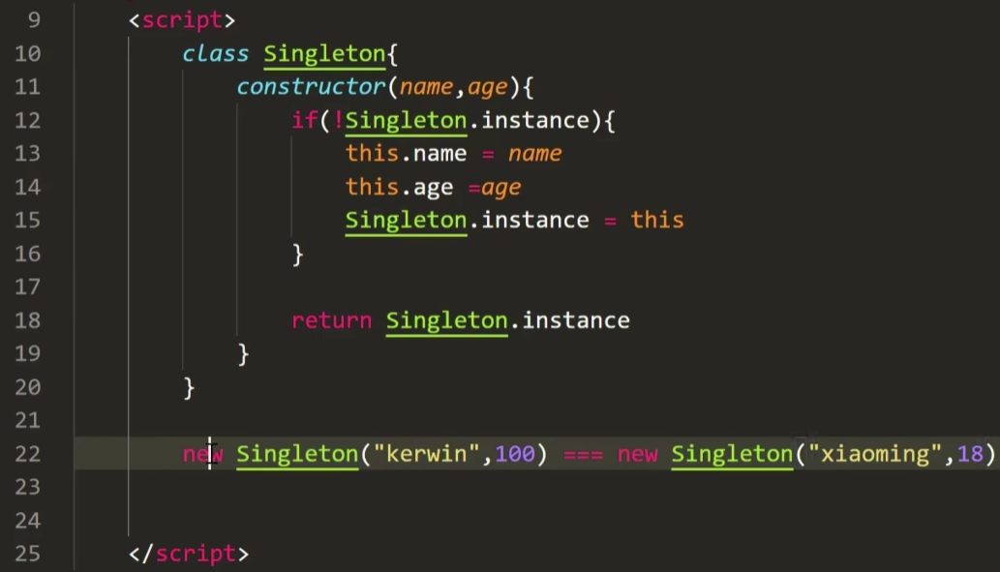

# [单例模式](https://www.bilibili.com/video/BV1MP4y127kd?p=9&vd_source=a7089a0e007e4167b4a61ef53acc6f7e)

> 保证一个类仅有一个实例，并提供一个访问它的全局访问点

两种创建方式：

1. ES5的闭包
2. ES6 

> 在函数1内部返回函数2给外界变量所引用，导致函数1里面的变量无法被释放，这样就构建成了闭包

|                           ES5写法                            |                           ES6写法                            |
| :----------------------------------------------------------: | :----------------------------------------------------------: |
|  | <br>22行：输出true |

# 单例模式解决的问题

在 JavaScript 中，提出单例模式主要是为了解决需要**共享状态、资源管理或全局协调**的问题。以下是几个实际使用单例模式的场景：

## 1. **全局配置管理**

在大型应用程序中，通常需要有一个全局的配置对象，存储诸如API地址、应用模式（开发/生产）、用户权限等信息。这个配置对象在应用的各个模块中都可能被访问，如果每个模块都创建自己的配置实例，可能会导致不一致或配置更新不同步。

**示例：**

```javascript
class Config {
    constructor() {
        if (!Config.instance) {
            this.settings = {
                apiUrl: 'https://api.example.com',
                mode: 'development',
            };
            Config.instance = this;
        }
        return Config.instance;
    }

    get(key) {
        return this.settings[key];
    }

    set(key, value) {
        this.settings[key] = value;
    }
}

const config1 = new Config();
const config2 = new Config();

console.log(config1 === config2); // true，确保全局只有一个配置实例
```

## 2. **日志记录**

日志记录器通常是一个适合使用单例模式的场景。系统中可能有多个模块或类需要记录日志，如果每个模块都创建一个日志实例，这不仅会浪费资源，还会使日志记录的管理变得复杂。使用单例模式，可以确保所有模块使用同一个日志实例，从而统一管理日志输出。

**示例：**

```javascript
class Logger {
    constructor() {
        if (!Logger.instance) {
            Logger.instance = this;
        }
        return Logger.instance;
    }

    log(message) {
        console.log(`[LOG]: ${message}`);
    }
}

const logger1 = new Logger();
const logger2 = new Logger();

logger1.log('This is a log message'); // [LOG]: This is a log message
console.log(logger1 === logger2); // true，确保所有模块使用同一个日志实例
```

## 3. **数据库连接**

在后端开发中，数据库连接通常是一个昂贵的操作。为了避免多个数据库连接实例导致资源浪费或竞争条件，通常会使用单例模式来确保只有一个连接实例存在。

**示例：**

```javascript
class DatabaseConnection {
    constructor() {
        if (!DatabaseConnection.instance) {
            // 假设这里是数据库连接的初始化
            this.connection = this.connect();
            DatabaseConnection.instance = this;
        }
        return DatabaseConnection.instance;
    }

    connect() {
        // 假设这里执行数据库连接的操作
        console.log('Connecting to the database...');
        return {}; // 返回一个连接对象
    }

    getConnection() {
        return this.connection;
    }
}

const db1 = new DatabaseConnection();
const db2 = new DatabaseConnection();

console.log(db1 === db2); // true，确保只有一个数据库连接实例
```

## 4. **应用状态管理**

在前端开发中，尤其是使用像 React 或 Vue 这样的框架时，通常需要一个全局的状态管理系统（如 Redux 或 Vuex）。在这些系统中，单例模式用于确保整个应用中只有一个全局状态管理器实例，所有组件共享同一个状态源。

**示例：**

```javascript
class AppState {
    constructor() {
        if (!AppState.instance) {
            this.state = {
                user: null,
                theme: 'light',
            };
            AppState.instance = this;
        }
        return AppState.instance;
    }

    getState() {
        return this.state;
    }

    setState(newState) {
        this.state = { ...this.state, ...newState };
    }
}

const appState1 = new AppState();
const appState2 = new AppState();

appState1.setState({ user: 'John Doe' });
console.log(appState2.getState()); // { user: 'John Doe', theme: 'light' }
console.log(appState1 === appState2); // true，确保状态在全局是一致的
```

### 总结

单例模式在 JavaScript 中解决了**资源共享、全局状态一致性**和**避免不必要的多实例开销**等问题。通过确保系统中某个类只有一个实例，单例模式可以有效地管理和优化资源，在很多实际开发场景中都是非常有用的设计模式。


https://juejin.cn/post/6932015291358511118

- 当我们获得对象的时候，每次获得的都是同一个
- 那么我们可以先创建好一个实例，然后写一个get方法，每次创建的时候，通过get方法获取该实例，那么就达到了单例效果，


下面是用JavaScript实现单例模式的几种不同方式，涵盖了懒汉式、饿汉式、双重检查锁定和模块模式。

# 1. 懒汉式（Lazy Initialization）

懒汉式单例模式在第一次访问时创建实例。此实现并不默认线程安全，但可以使用`synchronized`机制确保线程安全。

```javascript
class Singleton {
  constructor() {
    if (Singleton.instance) {
      return Singleton.instance;
    }
    this.value = Math.random();
    Singleton.instance = this;
  }
  
  getValue() {
    return this.value;
  }
}

// 使用示例
const instance1 = new Singleton();
const instance2 = new Singleton();

console.log(instance1 === instance2); // true
console.log(instance1.getValue()); // 实例的值
```

# 2. 饿汉式（Eager Initialization）

饿汉式单例模式在类加载时就创建实例，确保实例在任何情况下都已存在。

```javascript
class Singleton {
  constructor() {
    this.value = Math.random();
  }
  
  static getInstance() {
    return Singleton.instance;
  }
}

// 创建唯一实例
Singleton.instance = new Singleton();

// 使用示例
const instance1 = Singleton.getInstance();
const instance2 = Singleton.getInstance();

console.log(instance1 === instance2); // true
console.log(instance1.value); // 实例的值
```

# 3. 双重检查锁定（Double-Checked Locking）

双重检查锁定是一种懒汉式单例模式实现方式，用于确保线程安全。

```javascript
class Singleton {
  constructor() {
    if (Singleton.instance) {
      return Singleton.instance;
    }
    this.value = Math.random();
    Singleton.instance = this;
  }

  static getInstance() {
    if (!Singleton.instance) {
      Singleton.instance = new Singleton();
    }
    return Singleton.instance;
  }
}

// 使用示例
const instance1 = Singleton.getInstance();
const instance2 = Singleton.getInstance();

console.log(instance1 === instance2); // true
console.log(instance1.value); // 实例的值
```

# 4. 模块模式（Module Pattern）

JavaScript的模块模式（尤其是ES6的模块）也可以实现单例模式。这里是一个使用自执行函数的例子：

```javascript
const Singleton = (function () {
  let instance;
  
  function createInstance() {
    return {
      value: Math.random(),
      getValue() {
        return this.value;
      }
    };
  }
  
  return {
    getInstance() {
      if (!instance) {
        instance = createInstance();
      }
      return instance;
    }
  };
})();

// 使用示例
const instance1 = Singleton.getInstance();
const instance2 = Singleton.getInstance();

console.log(instance1 === instance2); // true
console.log(instance1.getValue()); // 实例的值
```

### 总结

这些实现展示了如何在JavaScript中实现单例模式。具体选择哪种方式取决于需求，例如是否需要线程安全，是否需要懒加载等。如果你有其他问题或需要更多示例，随时告诉我！